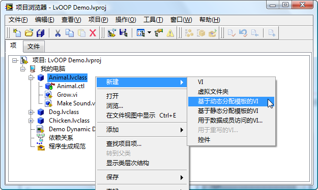
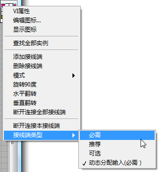
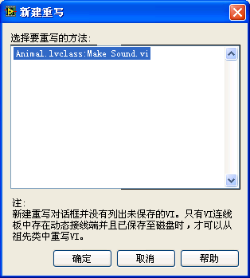

# LabVIEW的类

## 创建

在项目浏览器上，点击鼠标右键，选择"新建-\>类"，就可以创建一个新的类（图
13.1）。

图 .1新建一个类

类在结构上是一种特殊的LabVIEW库，因此它的很多属性和设置都与库相似。比如，类的名字也作为名字空间；也可以为类中的VI设置访问权限等。除此之外，类还有它特殊的设置，比如有属性和方法等。

类被保存在一个以lvclass为后缀名的文件中。

例如，可以创建一个名为Animal的类，用它来描述一些动物的属性和行为。

## 属性(数据)

除了VI，每个类都包含一个和类同名的.ctl项。尽管它的面板与设置方法与用户自定义控件类似，但实际上在硬盘上是找不到这个.ctl文件的。它的数据信息都直接记录在同名的.lvclass文件中。此外，这个.ctl项必须是一个簇。簇中的元素就是这个类的属性，及它所使用到的数据，这相当于C语言中的类的变量。

与C语言不同之处是，LabVIEW的类的数据只能是私有的。这主要是出于安全考虑。在类之外，只能通过公有的方法来间接访问这些数据。

现在，回到前面例子中的Animal类：需要用两个数据来分别描述动物的年龄和颜色。因此，在Animal.ctl的簇中放入了两个分别表示年龄和颜色的控件（图
13.2）。

图 .2添加类的数据

类的数据可以有初始值设定。比如，只要创建一个此类型的新对象，对象中age的默认值都是0。如果把类数据中"age"控件的默认值改为2，那么，以后每创建一个新对象，其age的初始值也就成了2。

## 方法（VI）

鼠标右键点击在类上，就可以为类创建方法了（图
13.3）。方法其实就是一些VI。

图 .3创建新方法

在图 13.3中新建这一栏下可以看到很多条目：

VI：就是指创建一个普通的方法VI。

虚拟文件夹：如果类中的方法很多，为了便于管理，可以把它们归类到不同的文件夹中。

基于动态分配模板的VI：如果一个类中的方法，有可能被子类中相同的方法重写，就应该使用这个模板。比如发声（Make
Sound）这个方法，在两个不同子类中将会被重写，所以一定要使用"基于动态分配模板的VI"。（这有点类似与C++中的虚函数。）

基于静态分配模板的VI：如果一个类中的方法，不允许被子类重写，就应该使用这个条目来创建。它与基于动态分配模板的VI的唯一的区别在于：动态分配的VI的类输入输出接线端（这个例子中是"Animal
in/out"）是动态分配的，而静态分配的VI则不是（如图
13.4所示）。静态分配的VI到的接线端通常使用"推荐"类型。

用于数据成员访问的VI：因为类的数据全部是私有的，所以需要借助公有VI来访问它们。这个选项用于快速建立读写类中数据的VI。

用于重写的VI：这个选项是专门给子类用的。用来创建覆盖父类的方法VI。

控件：创建用户自定义控件。

图 .4动态分配类输入/输出的接线端

使用过C++的程序员都知道，C++的类中有两个特殊函数：构造函数和析构函数。它们分别在类的生成和销毁时完成一些初始化和收尾的工作。LabVIEW的类不存在类似的构造和析构VI。如果需要在类实例生成后或销毁前作初始化和收尾工作，需要程序员自己编写完成这些工作的VI，并在应用程序中调用这些VI。

## 继承

为了让演示程序更生动，再创建两个动物类的子类："狗"类和"鸡"类。创建子类时，与创建"动物"类的过程是一样的：在项目浏览器上，点击鼠标右键，选择"新建-\>类"，然后存盘。

如果某个类是其它类的子类，需要在子类的属性对话中设置。比如设置"狗"类的继承关系，打开它的属性对话框，点击"更改继承"按钮，在弹出的更改继承对话框上（图
13.5），选择animal.lvclass作为它的父类。这样，狗类便成了动物类的子类。在这里可以注意到，LabVIEW中所有的类都有一个共同的父类"LabVIEW对象"。

图 .5设置类的继承关系

C++的类支持多继承，即一个子类可以有多个父类。LabVIEW的类只支持单继承，一个子类只能有一个父类，但一个父类可以有多个子类。这与Java、C#比较相似。LabVIEW中所有的类都有一个共同的祖先类，而C++中没有，这点也与Java、C#相似。

设置好继承关系，再为子类创建几个属性和方法，这个演示程序就搭建完成了。为了让应用程序美观易读，可以修改这几个类的数据线外观（图
13.6）。否则，所有的类的数据线千篇一律，很容易就混淆了。数据线的外观也是在类的属性对话框中配置的。

图 .6配置类数据线的外观

## 多态

鸡类和狗类同时从动物类那里继承了"发声"这个方法。但是，它们对这个方法的实现可以不同，这样就实现了多态。

为了达到这一效果，首先要在动物类中使用"基于动态分配模板的VI"为父类创建一个"发声"方法：Make
Sound.vi。在鸡类和狗类两个子类中，分别使用"用于重写的VI"为每个子类创建一个新的Make
Sound.vi（图 13.7）。（父类与子类的方法VI必须是同一VI名字）

图 .7选择重写父类中的某个方法

实际上，这两个类对于发声方法的实现是非常相似的。可以找一段音频，在扬声器中输出狗叫和鸡叫。不过，在这个演示程序中简化一下，仅仅把叫声在弹出对话框中显示出来就可以了（图
13.8）。

图 .8两个子类中Make Sound.vi的实现

在这两个子类方法的程序框图中，除了弹出对话框之外，还调用了一个子VI。这个子VI是父类中相同的方法，即动物类的Make
Sound.vi
。这样，就可以使子类的方法不仅继承有父类同一方法的功能，然后还可添加一些子类自身的额外功能。在子类中调用父类同一方法时，不能如同调用一般的子VI那样，直接把父类的方法拖拽过来。这种调用方式是无效的，而必须使用函数选板中的"编程-\>簇，类与变体-\>调用父类方法"节点来调用父类的方法。

其实，借助类的多态特性，应用程序不再需要判断实例数据所属的子类，再根据不同子类编写不同代码。它完全可以把所有实例用它们共同的父类的类型来传递，代码中也只使用父类的方法。而程序执行到父类的方法时，会自动执行已经覆盖了它的相应的子类的方法。从而让不同的动物发出不同的叫声。

图
13.9中的程序，它有两个分别属于鸡类和狗类的实例：一个鸡对象，一个狗对象。程序的目的是让这两只小动物分别叫一声。如果按照传统的编程方法，需要先判断对象的类型，然后按照不同类型去调用不同的子VI。而有了多态这个特性，在编写程序时，可以把这两个实例都使用它们共同父类来表示，调用发声方法时，也只调用父类中的方法，把动物类中的"Make
Sound.vi"拖到程序框图上即可。待程序运行时，会自行判断每个实例属于哪个子类，然后调用子类中对应的发声方法。

图 .9类的多态特性的演示

图 13.9中的程序运行的结果是，先弹出"汪汪！"，然后再弹出"咕咕嘎！"对话框

由于程序在图 13.9中的"Make
Sound"子VI处，有可能运行的是某个子类中的同一个方法，所以双击打开它时，它会提示你选择打开哪一个方法VI的程序框图。弹出的选择对话框如图
13.10所示。

图 .10选择打开父类或某一个子类的方法
b

