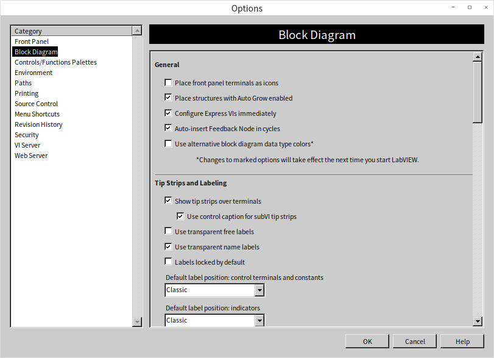
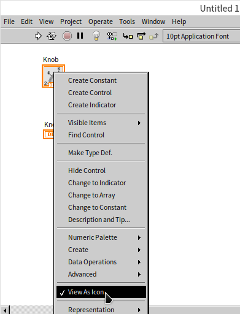
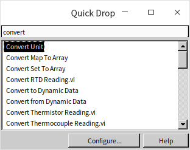
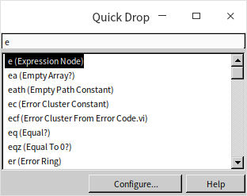

# 按自己的喜好设置编程环境

LabVIEW 编程环境的默认设置，也许对你并不适合。那么可以对编程环境做一些自定义的设置，以提高编程效率。

## LabVIEW 的设置选项

在 LabVIEW 的菜单中选择“工具 -\> 选项”，就会弹出 LabVIEW 的选项对话框：

对话框上面有数目众多的选项。想要查看了解每一个选项的含义，可以点击该对话框的“帮助”按钮。

这些选项既然是可选的，就没有绝对优劣之分。LabVIEW 编程者可以在尝试一段时间过后，再根据自己的喜好和习惯，选择最适合自己编程的配置。比如，笔者通常会修改控件接线端在程序框图上的显示方式。控件在程序框图上有两种显示方式：按图标方式，和不按图标方式。按图标方式显示的接线端更加直观漂亮一些，但是占用面积也大一些；不按图标方式则减小了接线端在程序框图中的显示面积。

笔者个人喜欢显示面积小的方式，因此，就在选项对话框把这个设置做了修改。此外，我们在 [控件的局部变量和属性](data_and_controls) 一节介绍过如何调节控件的闪烁频率，也是这个选项对话框上做的修改。选项对话框还有一些设置是用来开启某些高级功能的，后续章节也会介绍到。

LabVIEW 的这些设置都被保存在了配置文件中（Windows 操作系统下，配置文件是与 LabVIEW.exe 同文件夹下的 LabVIEW.ini 文件）。当熟悉了配置文件的格式后，也可以直接在配置文件中对这些选项进行修改。本书会在 [文件读写](pattern_file) 一节介绍如何修改这样的配置文件。

## 函数和控件选板的设置

函数和控件选板在编程时使用频率非常高，所以它的设置将直接影响编程效率。两个选板的设置方法相同，所以在下文中仅以函数选板为例说明如何改动它。

笔者在频繁使用某一个函数选板时，会点击它上边的“图钉”图案的按钮，让函数选板以浮动窗口的形式显示，它会保持显示在所有 VI 窗口的前面，方便笔者直接选中所需的函数。但是浮动窗口往往会遮挡住部分程序代码。在不需要频繁的使用某个函数选板的时候，笔者会将其隐藏，留出更多的空间显示程序框图。仅在需要使用它的时候，才用鼠标右键点击程序框图的空白处，弹出函数选板。

默认的函数选板，尤其是在使用鼠标右键让其弹出的时候，它上面只有一个类别选板是展开的，其它类别都是缩起来的，有些类别可能还是隐藏的：

根据项目情况，也许某些读者平时编程最常用的函数都不在默认展开的类别中。不过这是可以解决，选板的布局和默认显示的条目都是可以修改的：点击函数选板浮动窗口上的“查看”（Customize）按钮，选择“更改可见类别”。（如果是鼠标右键弹出的函数选板，则先要点击它左上方的图钉按钮，把它钉成浮动窗口。）在“更改可见类别”对话框中选择常用的条目，被选中的条目就会出现在函数选板首选项里；把几乎不用的类别去掉，免得它们耽误选取其它常用的函数：

默认情况下，函数选板总是展开排在最上面的那个条目，所以应该把最常用的条目排在最上面。

将鼠标放到“收藏”（Favorites）这个条目左侧的两个竖线上，鼠标就会变成带箭头的十字花，这时按下鼠标可以拖动这个条目。把“收藏”拖到函数选板的最上方，然后点击鼠标，首先看到的就是展开了的“收藏”函数选板了：

之所以要把收藏挪到第一项，是因为用户可以方便地调整“收藏”选板中的内容，把那些最常用的函数都放到“收藏”里。例如，想把“编程 -\> 结构”选板添加到“收藏”中去，可以点击“编程”条目，将其展开，在“结构”这个子选板上单击鼠标右键，选择“添加子选板至收藏夹”这样“结构”子选板以后就会出现在“收藏”之中了。

添加了几个常用函数选板后，函数选板的布置如下。以后只要一打开函数选板，常用的函数子选板都已经展现，编程方便多了。

### 搜索函数和控件

LabVIEW 中的函数和控件毕竟太多了，有时候，需要一个功能，可是就是不知道该去哪找。这时，可以利用函数或控件选板的搜索功能，点击函数或控件选板上方的“搜索”按钮（图标为放大镜的按钮），就可以进入选板搜索功能：

在搜索界面上输入关键词，然后选中一个搜索结果，拖放到 VI 的程序框图或前面板上即可。如果双击一个搜索结果，会跳转到这个结果所在的选板位置，这样我们就能够知道这个节点放置在哪个选板上，以后可以直接到这个选板下选择该节点。

LabVIEW 中还有一个与选板搜索类似的工具叫做 Quick Drop。Quick Drop 的启动快捷键是“Ctrl+Space”，这个快捷键与系统切换中文输入法的快捷键有冲突，所以可能在某些系统下会失效。如果读者在电脑上无法使用这个快捷键启动，还可以试一下“Ctrl+Shift+Space”或“Alt+Space”。在笔者的电脑上，Quick Drop 的启动快捷键是“Ctrl+Alt+Space”。

Quick Drop 也可以用来搜索函数或控件：

更重要的是，在 Quick Drop 中可以为函数或控件添加快捷方式，快捷方式是用几个简短的字母来代表一个函数。点击 Quick Drop 界面上的 Configure 按钮，可以查看 LabVIEW 默认的快捷方式配置：

用户可以在此添加自定义的快捷方式，比如，某为读者总是要使用到“表达式节点”（Expression Node），那么就可以添加一个快捷方式：把字母“e”作为快捷字母，把“Expression Node”作为指向的目标。之后，在 Quick Drop 中输入字母“e”，回车，就会直接得到一个表达式节点：

## 工具选板

LabVIEW 是图形化编程语言，相对于文本编程语言而言，鼠标在 LabVIEW 中的作用远远超过键盘。鼠标要负责选择对象、拖动对象、调整对象的大小，还要负责连线、插入断点和探针等等。总之，一个鼠标身兼数职。

默认情况下，鼠标的功能是 LabVIEW 自动选定的。例如，把鼠标挪到函数体上时，它可以拖动这个函数；而鼠标移动到函数接线端上，则可用作连线。自动选择固然方便，也有其不利的一面：每次都要小心翼翼找准鼠标的位置，才能使其具有期望的功能。所以有些编程者还是倾向于手工变换鼠标的功能，这样就不必再为精确的地找准鼠标的位置而耗费时间了。

这一设置是在“工具选板”中完成的。在菜单中选择“查看 -\> 工具选板”，或者在前面板和程序框图的空白处按住 Shift 键点击鼠标右键，即可弹出工具选板：

工具选板最上方的扳手加螺丝刀按钮，就是“自动选择工具”按钮。当它被按下时，LabVIEW 自动选择鼠标的功能；再次点击这个按钮，自动选择功能被关闭。这时，鼠标的功能就需要手工来选择了。

点击工具选板上相应的按钮，就可以让鼠标切换至该功能。也可以通过键盘上的按键来快速切换鼠标功能。

在程序框图窗口上，按空格键，使鼠标在“连线”和“定位/调整大小/选择”两个功能间切换；按 Tab 键，使鼠标在“操作值”、“定位/调整大小/选择”、“编辑文本”和“连线”四个功能间切换。

在 VI 前面板上，按空格键，使鼠标在“操作值”和“定位/调整大小/选择”两个功能间切换；按 Tab 键，使鼠标在“操作值”、“定位/调整大小/选择”、“编辑文本”和“设置颜色”四个功能间切换。

VI 调试过程中，按空格键或 Tab 键，使鼠标在“操作值”、“设置/清除断点”和“探针”三个功能间切换。

笔者个人经验，平时只要使用“自动选择工具”选项就可以应付大多数编程工作了。偶尔需要调出工具选板时，可以按住键盘上的 Shift 键，再在 VI 前面板或程序框图上点击鼠标右键，即可显示出此工具选板。

## 练习

* 查看一遍 LabVIEW 所有的函数选板，看看有哪些将来可能会用到的函数，同时看看是否需要调整一下选板排布的顺序。