# 控件的局部变量和属性

## 控件与变量的关系

熟悉文本编程语言的用户一定非常熟悉变量这个概念。变量是文本编程语言中一个非常重要的元素，程序所需的数据都存储在变量中。但是，在使用 LabVIEW 语言的时候，必须改变这种观念。

LabVIEW 中并没有与文本编程语言中的变量直接对应的概念。虽然，有一些其它的对象可以完成文本编程语言中变量的功能。

有过文本编程语言经验，而又初学 LabVIEW 的用户，常常会把 LabVIEW 中的控件当作文本编程语言中的变量：变量是用来保存数据的，而控件中也可以保存数据，所以控件可以当作变量用。这种思维方式在 LabVIEW 编程中，虽然也行得通，但是它并不符合 LabVIEW 最本质的数据流驱动模式。在这种思维方式的指导下，写出来的程序往往代码混乱，不易阅读，容易出错。

控件在 LabVIEW 程序中主要是用来输入输出数据的：一是作为用户界面，与用户交互；二是在子 VI 中用于与上层程序交换数据。子 VI 中的控件的功能就类似于文本编程语言中子函数的输入输出参数或返回值。

那么，在 LabVIEW 中是什么最接近于文本编程语言中的变量呢？那就是数据连线了。在 LabVIEW 程序框图中，数据从某一节点流出，经由数据线，再流入下一节点。暂且不考虑 LabVIEW 内部是如何实现这一机制的，单从编程者的角度直观来看，数据从某节点流出后，暂时保存在一数据线内，再被传递给下一个节点。所以，一条数据线就类似于文本编程语言中一个生命周期极短的变量。从某一子函数返回的数据也保存在数据连线这个变量中，直到把数据传递给下一个函数，这个变量的生命周期也就结束了。

因此，在编写 LabVIEW 代码的时候，遇到一个数据从某节点传出，需要暂时保存一下，留给后续某个节点使用的情况时，先不要考虑给这个数据新建一个控件或者全局变量来保存它，而是应该考虑如何连一条数据线，把数据引出，再传递到需要使用它的那个节点。

## 控件的标签和标题

LabVIEW 的控件有标签（Label）和标题（Caption）这两个非常相似的属性：

二者的共同点都是为了给控件一个有意义的名称。如果只考虑开发英文软件，多数时候只使用默认的标签就可以了。但我们平时可能会经常需要显示中文，这就需要关注一下两者的不同用法了。它们的主要区别是：

标签是控件唯一的标识，每个控件的标签应当是唯一的。标签在程序运行过程中是不可以改变的。LabVIEW 提供的某些高级函数可以在程序运行时，根据控件的标签，找到一个控件，并对其操作。尽管 LabVIEW 并没有禁止给不同的控件使用同一标签名，但这种编程习惯极其有害，会为程序留下隐患。因此，编程时一定要注意，控件的标签在同一个 VI 上不能有重复，也不要使用空白标签。标签应该尽量只使用英文字符，因为 LabVIEW 没有完全支持 unicode，如果在标签中使用了其它语言的字符，可能会导致某些程序在拷贝到一个不同语言的系统后运行出错。

标题专用于表示控件在用户界面上显示出来的名称，是可以在运行时改变的。有些控件在程序中可能有多个含义，在表示不同含义时需要给予不同的文字提示。此时，就可以在界面上显示控件的标题，并在程序中动态对其进行修改。标题的另一个重要用途是软件本地化。标签作为控件的唯一标识，在程序的各种语言版本中都应当相同，而能够改变文字的就是标题了。所以，需要本地化的软件，可以把控件的标签隐藏起来，只显示其标题。

刚从控件选板拖到 VI 前面板上的控件是没有标题的，它只有一个标签。在控件右键菜单的“显示项”中选中“标题”，这时，LabVIEW 会自动给控件添加一个内容与标签相同的标题，并显示出来。当然，也可以在控件的属性对话框中配置控件显示的标题或标签。

对于在 VI 中使用控件的标签或标题，笔者有一些建议：

无论是标签还是标题，都应该使用有意义的文字。在使用英语短语命名时，单词之间可用空格分隔，不应该有重名。对于不同类型的VI，可以遵循下表中的建议：

| VI 类型   | 标签                                     | 标题                                                     |
| ------ | -------------------------------------- | ------------------------------------------------------ |
| 底层 VI （用户不会直接使用到的 VI，作为子 VI 随程序一起发布。）  | 显示。                                    | 使用 LabVIEW 的默认状态，即标题为空。                                  |
| 用户界面 VI （VI 前面板是用户所看到的程序界面的一部分。） | 隐藏。多语言版本中，只使用英语。                       | 显示。多语言版本中，使用本地化语言。                                     |
| 程序接口 VI （VI 是提供给用户编程时，当作 API 被调用的。） | 隐藏。多语言版本中，只使用英语。  不用标注控件的默认值。 | 显示。多语言版本中，使用本地化语言。  在后面加一括号，括号内标注控件的默认值和数据单位。 |

除了以上几点，如果需要在 VI 运行时改变一个控件的文字说明信息，那么只能使用标题。控件在程序框图的接线端只能显示标签，如果发现一个控件在前面板和程序框图上有不同的名字，那么说明前面板上显示的是标题而不是标签。

## 控件的默认值

在 VC++ 等编程语言中，你可以运行一个程序，但是不能只运行一个函数。这给调试带来了不少麻烦。比如，你编写了一个子函数，想立即调试一下。可是，为了调试，还必须先创建一个完整的工程，实现 main() 函数。然后，在 main() 函数中定义必要的变量，传参数给要测试的子函数，再调用子函数。调试相当繁琐。

相比之下，LabVIEW 在这方面就具有很大优势。LabVIEW 中的每个 VI 都可以独立运行。当然，为了让一个 VI 正确运行，还要为它提供合理的参数输入。

在运行之前，给 VI 前面板上的控制控件赋予合理的值，VI 就会使用这些值来运行程序。LabVIEW 的每个控件都有一个默认值。比如，新拖到 VI 前面板上的数值控件的默认值是 0。即使你改动了这个值，关闭 VI，当重新打开这个 VI 时，控件又会回复到默认值。如果一个数值控件最经常使用的值不是 0 而是 0.5，那么就应该把 0.5 设置为它的默认值。为此，必须先把控件的值设为 0.5，再从控件的鼠标右键菜单中选择“数据操作 -> 当前值设置为默认值”，控件的默认值就被设置成了 0.5。下次再打开 VI，看到这个控件的值就是 0.5。

当 VI 作为子 VI 时，控制控件被用作子 VI 的输入参数。上层程序调用一个子 VI 时，并不需要给子 VI 的每个参数都输入一个值。如果上层程序没有输入，子 VI 就使用控件的默认值作为输入参数。所以，为了便于调用，子 VI 应当选择最常用的值作为控件的默认值。还可以把控件的默认值写在控件的标签或标题上，以便查看。

比如下图中的程序使用了“Open Config Data.vi”子 VI，从即时帮助中，可以看到，该子 VI 的“必要时创建文件”参数的默认值是“真（T）”。因为程序也希望子 VI 在必要时候创建一个文件，所以不必再传一个“真”数据给这个参数了。也就是说，这个输入端不必连任何数据，子 VI 运行时自然会使用这个默认的“真”值。

## 局部变量

### 创建局部变量

在控件或控件的接线端上点击鼠标右键，选择 "创建 -> 局部变量"，可以为控件创建出一个局部变量来。

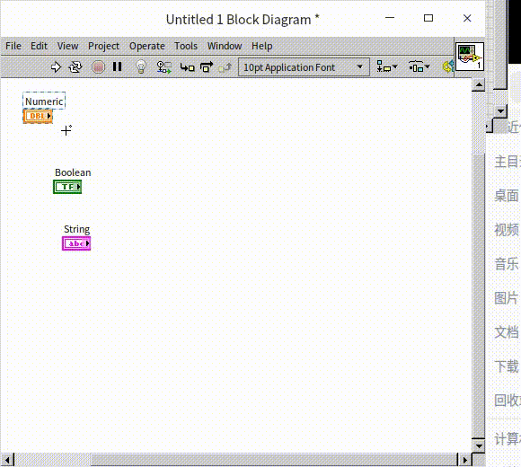

局部变量在程序框图上显示为一个有小房屋图标的矩形（在旧版 LabVIEW 中，外观是个双线边框的矩形），矩形内的文字是控件的标签名。局部变量中的数据等同于控件中的数据。控件中数据改变，局部变量中的数据也会随之改变；反之亦然。点击局部变量，也可以让它与同一 VI 上的其它控件相关联。

与控件的接线端不同，不论控件是哪种方向的（即无论是控制控件还是显示控件），它的局部变量都既可以用作读出数据，也可以用作写入数据。在局部变量的右键菜单上选择“转换为读取”/“转换为写入”，可以改变局部变量的数据流入流出方向。

局部变量给编程者提供了一个获得数据的便利条件：既不用从接线端连线，也不受接线端方向的限制。想读就读，想写就写。因此，局部变量很容易被初学者滥用。尤其是有文本编程经验的用户，很容易把控件的局部变量与文本编程语言中的变量混淆起来，把它当作存储和传递数据的工具。但是，正如上文所介绍的，子 VI 的控件是用于与高层程序或用户交互数据的，而不是用于暂存和传递 VI 运行中产生的临时数据的。控件局部变量的用途与控件相同，只应该用于辅助控件。在 VI 内部传递数据的功能应当由数据连线完成，只有在不得不使用局部变量的情况下，才应该考虑使用它。

一般，在下列情况中，可以考虑使用局部变量。

### 把数据写入控制控件，或从显示控件读取数据

比如我们要编写 VI 实现如下的功能：界面上有一字符串型控制控件，若输入的文字少于或等于 4 个字母时，正常显示；否则，清空字符串控件。由于控制控件的接线端只能作为数据源，不能写入数据。所以，在需要更新控件内容的时候，需要使用局部变量。同理，从显示控件中读取数值，也需要使用局部变量。实现上述功能的程序如下：

在上图的例子中，“input”控件必须在其鼠标右键菜单中被设置为“键入时刷新”（Update Value While Typing）。这样，每输入一个字符，程序都会自动检查一下，看看当前字符串的值是否需要做修改。否则，程序会等到用户在字符串控件上输入完所有字符后，才更新字符串控件的值。

### 应用于多线程间的共享数据

上图的程序框图中，有两个完全独立的循环。由于它们之间没有数据线连接，这样 LabVIEW 就会认为可以并行运行这两个循环。实际上，此程序的目的也的确是要同时运行这两个循环，分别完成不同的工作。在用户点击“Stop”按钮后，两个循环同时停下来。

LabVIEW 会把两段没有先后顺序要求的代码，放在不同的线程内，同时运行它们。线程是一个计算机科学术语，指运行中的程序的调度单位。一个线程就是程序中一个单一顺序的控制流。这里采用一种不很确切但容易接受的理解方法：在 LabVIEW 中，一段程序执行的代码就构成了一个线程，另一段代码与这段代码无先后依赖关系，同时也在运行，就是另一个线程。本书将在 [多线程编程](optimization_multi_thread) 一节中详细讲解 LabVIEW 中的多线程。

在这个程序中，“Stop”控件的接线端控制了一个循环的结束条件，它的局部变量控制了另一个循环的停止条件。按下“Stop”按钮，局部变量中的数据也会同时更新，于是两个循环的停止条件接线端都收到了同样的“真”数据，两个循环都停止运行。

要在多个线程中同时使用同一个数据，就需要使用局部变量来解决。下图的程序框图并没有使用局部变量，而是使用了数据连线。从“停止”按钮读出的数据被分别连接到两个循环的停止条件的输入端。这个程序中了两个循环会同时运行同时停止吗？

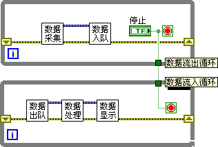

LabVIEW 的循环体具有如下特点：若有数据从循环外流入循环体内，则程序认为循环体内既然需要这一数据，就只有等接收到这一数据后，循环才能开始迭代运行；若有数据流出循环体，程序考虑到每一次循环迭代，其数据都可能发生变化，所以只有当循环结束才能输出一个最终的确定值。

上图中有一根数据线从上方循环体内，引到循环体外，再引入到下方另一个循环体内。也就是说，下面这个循环需要上面那个循环的输出值，两个循环间形成了顺序上的依赖关系。实际运行程序时，框图上面的循环会先开始运行，直到用户点击“停止”按钮，循环结束，才能把“停止”控件的值传递出循环体。“停止”数据流入下方的循环，下方的循环才开始迭代运行。由于这个“停止”值是“真”，下方循环迭代一次即停止。这样的运行逻辑就不可能完成设计中让两个循环同时运行的功能。

## 属性节点和调用节点

### 属性节点
控件的属性，比如数值的界限、显示格式等，可以在控件的属性对话框中配置。实际上，属性对话框只涵盖了控件属性中的小部分，很多的控件属性并未包括在属性对话框内。如果我们希望设置那些没有出现在控件属性对话框上的属性，或者希望在程序运行时去读写某些控件的属性，就需要使用到控件的属性节点。

在控件或控件的接线端上点击鼠标右键，选择“创建 -> 属性节点”，然后选择其中一项，即可得到该控件的一个属性。每一个控件都拥有很多属性。比如下图是一个普通数值控件的属性，它的属性的个数还算是比较少的，但也有数十个之多：

初学者要记住所有的属性不太容易，好在 LabVIEW 有即时帮助功能。在选择属性节点时，可以打开 LabVIEW 的即时帮助窗口，鼠标移动到不同的属性上，即时帮助窗口上就会显示出该属性的解释。在选择属性时，属性候选菜单是按照属性所属类别来排列的。以上图显示的属性为例，除去“浏览”项，排在最上面一栏的是 LabVIEW 中所有对象都具备的属性，比如对象所在的 VI；紧接在下面的一栏是所有 VI 前面板对象都具备的属性，比如位置和大小；再下面一栏是所有控件都具备的属性，比如标题，是否可见等；再下面的是所有数值类型控件的属性，比如单位标签的各种属性；最下面的是我们选择的这一款数值控件的属性，比如显示格式的设置。每一类别之中，则是按字母顺序排列。

如果是其它类型的控件，会在列表中看到其它的一些属性，比如按钮控件会具有“按钮文字”等属性、字符串控件会具有“单行显示”等属性。

上文提到，属性候选菜单是按照属性所属类别来排列的，那么 LabVIEW 中的控件有多少类别呢？有一个好方法，可以帮助我们查看 LabVIEW 对象的这种类型的层次关系：在程序框图上创建一个“编程 -> 应用程序控制 -> 类说明符常量”，然后鼠标点击这个常量，菜单展开的层次，就是 LabVIEW 中对象从通用到特定的层次关系：

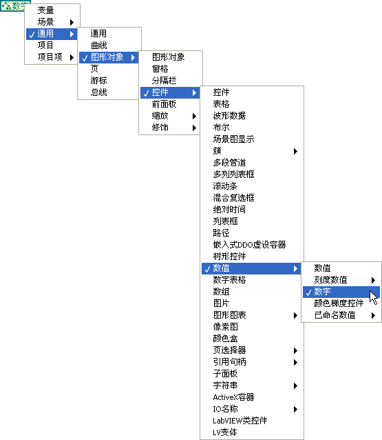

有关控件的类别本书会在“[对象类的层次结构](vi_server_for_ui#对象类的层次结构)”一节做详细介绍。

有些属性是只读或只写的，有些则既可读也可写。在属性的右键菜单中可以选择“全部转换为写入”/“全部转换为读取”，或“转换为写入”/“转换为读取”，以改变属性的方向。有的属性虽然可写，但只有当 VI 在编辑状态下，才可以改变属性的值，比如控件的标签文本便是如此。所以，在尝试设置控件属性时还要注意属性节点是否返回错误。当然，在帮助文件中都可以找到有关属性项的详细说明。

一个属性节点可以同时读写多个属性。把鼠标移到属性节点下边框的中间部位，就可以将其拉长或缩短。鼠标点击新增出来的条目，可将其更换为我们需要的属性。鼠标菜单中，还有“增添元素”/“删除元素”选项，也可以完成上述功能。

在属性项中，有一项名为“值”，其作用相当于上一节提到的局部变量。但是程序运行时，属性节点的效率要大大低于局部变量。另一项名为“值（信号）”的属性则是用来作为该控件发出“值改变”事件信号的，对于事件的处理会在[事件结构](pattern_ui)一节介绍。

属性节点默认显示的是每个属性的短名称，即英文缩写。在属性节点的右键菜单中可以把它切换成长名称显示，这样就可以使用中文名称了：

### 关联控件

如果程序框图上已经有一个控件的属性节点了，但我们还需要一个同样的属性节点，大家首先想到的可能是复制粘贴。选中这个属性节点，按 `Ctrl C` 再 按 `Ctrl V`，读者会发现，复制出来的属性节点和之前的长得不太一样（见下图）。这是因为复制出来的属性节点还没有与任何控件相关联，本书会在[运行中改变界面](vi_server_for_ui) 一节再详细介绍如何使用这种与控件无关联的属性节点。如果在一个属性节点的右键菜单中选择“断开连接控件”，它就会变成一个与控件无关联的属性节点，同理也可以在它的右键菜单中把它与某个控件关联起来：

属性节点也还是可以复制的，但是不是使用 `Ctrl C` 快捷键，而是按住 `Ctrl` 键，在用鼠标点击拖拽一个属性节点就可以把它复制出一份来。不只是属性节点，LabVIEW 中的控件，函数等几乎所有对象都可以通过这种方式复制。下图是按住了 `Ctrl` 键进行复制的演示：

### 调用节点

调用节点的创建、使用方法与属性节点类似。区别在于调用节点用于选择方法，以完成控件的某些行为。每个调用节点只能选择一种方法。

比如，在控件的接线端上点击鼠标右键，选择“查找 -> 控件”，可以高亮显示接线端对应的控件。在程序中，也可以通过调用节点来实现这个功能。为控件创建一个“对象高亮显示”调用节点，运行程序，就可以看到控件被高亮显示了一次：

LabVIEW 中各种控件的属性节点和调用节点实在是太多了，本书无法一一讲解，下面只能抛砖引玉，介绍几个最典型的应用，帮助读者了解属性节点和调用节点的用法，以及它们的适用场景。希望读者也可以自己探索一下，看看使用属性节点和调用节点还能实现哪些有趣的应用。

### 应用实例 - 移动控件

有时候在程序运行的过程中，需要调整控件的位置，或大小。若要实现类似的功能，可以设置控件的位置和尺寸属性。比如下面的的程序，按一定的顺序规律设置“stop”按钮的位置属性，让这个按钮在前面板上做圆周运动：

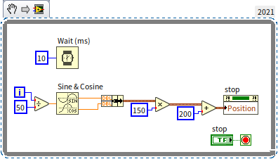

程序运行结果如下：

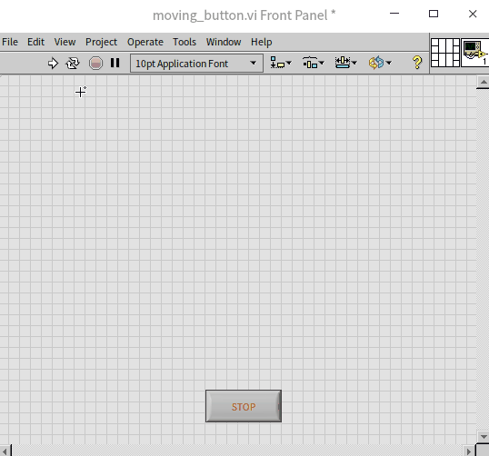

读者可以试着看能不能点到程序上的停止按钮，如果点击这个按钮难度太低，不要紧，本书后面还会介绍一个更难抓到的按钮。

在复杂的程序界面上，有时候我们需要在不同的条件下显示不同的控件。实现这一功能，我们可以使用控件的“隐藏”属性，在不需要看到某些控件的时候，把它们隐藏起来。但是，这样会给编辑调试程序带来一些麻烦，因为控件被隐藏后，在编辑状态下它们也是隐藏的，无法直接在前面板调整它们的数据和属性。所以，更多的时候，笔者是通过调整控件的位置，来实现上述功能的，在不需要看到某些控件的时候，就把它们移动到可见窗口之外的某个位置上。这样，在编辑状态下，拉大前面板窗口就可以看到所有的控件了。

位置和大小属性是比较基础的属性，不但控件有这个属性，前面板上的一些纯装饰物，比如“装饰”控件选板上的那些装饰物也都有位置和大小属性，本书后续章节会介绍如何在程序中控制更广泛的对象。

### 应用实例 - 改变控件的标题

程序要求：在界面上放置一个数值型控件，既可用于输入一个长度值，也可用于输入一个重量值；再放置一个枚举类型单选按钮控件，用户可通过其输入选择数值控件的标题，显示是输入长度还是重量。

这个程序需要动态修改控件的标题（Caption）属性。控件的标题本身也有很多属性，比如标题的位置，大小等。这个程序需要设置的是标题属性中的文字属性，这是一个带有层级关系的属性：

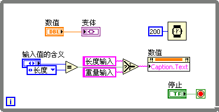

程序运行结果如下：

我们做一个更简单的程序，试着用同样的方法在程序运行时设置控件的标签（Label）:

运行上面的程序，控件的标签并不会被修改，反而，属性节点会返回一个错误，错误信息是：“This property is writable only when the VI is in edit mode”，翻译成中文是：“本属性只能在 VI 处于编辑状态时被设置”。当我们点击 VI 的运行按钮的时候，VI 就从编辑状态变成运行状态了，所以不能设置标签属性。可是不运行 VI，又怎么调用这个属性节点呢？这不是矛盾的吗？

一个 VI 无论如何都无法使用属性节点改变自身控件的标签，但是它可以调用属性节点去设置其它 VI 上的控件的标签，所以标签属性还是有存在的意义的。本书会在[运行中改变界面](vi_server_for_ui) 一节介绍如何使用属性节点和调用节点去修改其它的 VI。

### 应用实例 - 在字符串中显示多种字体

程序要求：输出一个字符串“LabVIEW 真好用！”，并突出强调“好用”两个字。

可以预料到，本程序需要调用字符串控件相关的属性。由于只是修改字符串控件中的部分字符，所以先要使用属性节点选中所需的字符，再修改其字体。多个属性可以都放在同一个属性节点中，一起设置：

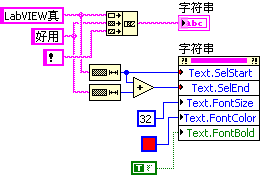

程序中的红色小方块是一个“颜色”常量，它在“编程 -> 图形和声音 -> 图片函数”函数选板上，它对应的控件在“数值”控件选板上。

程序运行结果如下：

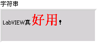

### 应用实例 - 让控件闪烁

程序要求：程序中某个设置量不能太大，如果过大可能会有一些风险，需要提醒操作者。

程序提醒操作者可以有很多方式，比如改变控件的颜色、发出提示音等。这里我们演示一个比较简单的方法，也是比较常用的方法：利用控件的闪烁属性。下图是这个程序的程序框图，程序一直监视旋钮控件“Knob”的数值，如果超过 6.1 则让旋钮和停止按钮都开始闪烁：

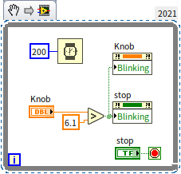

程序运行结果如下：

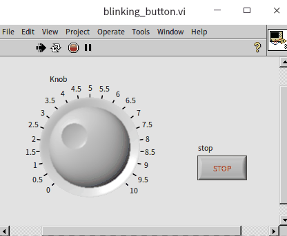

控件的闪烁频率是在 LabVIEW 的设置选项中配置的，在 VI 的菜单中选择“工具 -> 选项”，就会弹出 LabVIEW 的选项对话框。在“前面板”页面可以看到“前面板控件的闪烁延时”默认是 1000 毫秒，如果觉得这样闪的太慢，可以改成 300 毫秒：

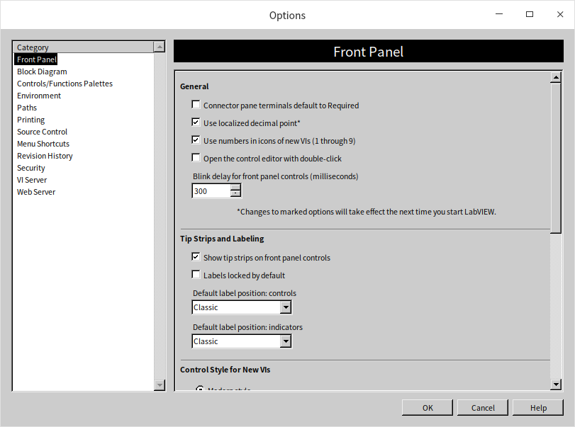

### 应用实例 - 禁止枚举控件中的某些项

程序要求：创建一个枚举型控件，但在程序运行过程中，需要暂时禁止它的某些选项。

实现这个功能只要使用一个针对枚举类型的属性“禁用项 \[\]”就可以了。该属性的输入值是一个整数数组，数组的中元素的数值表示枚举控件中需要被禁用的选项（从 0 开始）。比如，需要禁用枚举控件中的第二条选项，则需要给“禁用项 \[\]”属性提供一个包含一个元素的整数数组，元素的值是：

程序运行结果如下：

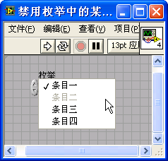

## 列表、表格和树形控件

这几个控件在控件选板“列表、表格和树”上：

本书之前介绍过的各种控件，相对来说，处理的数据都是比较单一的，比如按钮控件或灯泡控件就是用来表示布尔类型的数据。通常，在程序里也就只会用到这些控件的值，需要调用属性节点设置外观等属性的情况是比较少的。但是，接下来将要介绍的这几个控件相对就复杂一些了，它们所需的数据比较多。比如，当我们使用列表框控件的时候，通常都至少需要为它提供两种数据：一是列表中每个条目的文字，是一个字符串数组数据；二是被选中的条目，如果单选应该是个整数，多选则会是一个整数数组。如果控件选择这两种数据之一作为控件的数据，那么另一个数据就只能通过控件的属性节点来设置了。所以，在程序中使用到列表框等控件的时候，通常都不会只使用到它们的接线端和局部变量，还会要使用到它们的属性节点。

下面我们通过一些实例来解释如何使用这几个控件。

### 列表框控件的基础设置

列表框控件与 [下拉列表控件](data_custom_control#枚举型控件与下拉列表控件的比较) 比较相似，区别在于下拉列表控件只显示列表中被选中的条目，而列表框控件则可以显示多个条目，方便用户进行挑选。另一点不同是列表框控件还可以支持多选，用户可以在控件的右键菜单中切换“选择模式”。列表框控件上被选中的条目会被高亮显示。

列表框控件（以及树形控件等）的每个条目的前端，还可以显示出一个小图标。选中控件的右键菜单“显示项 -> 符号”，就可以把选取的图标显示出来：

默认情况下，图标是空白的。我们可以直接通过控件每个条目的右键菜单“项符号”来选择条目的图标，也可通过在程序中设置控件的“项符号”属性来设置。控件自带的图标都比较简单，总共大约有四十多个：

上图中最后一个符号图标（横条虚线图案）其实不是一个“图标”，而是分割线。上图列表框控件中，第一个条目和第二个条目之间就有一个分割线。

### 使用列表框选取文件夹中的文件

程序要求：列出一个文件夹中的所有子文件夹和文件，用户可以选取其中的一个。

程序使用了列表框控件列出所有的文件，实现如下：

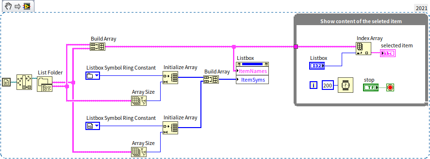

程序分成两个部分：循环结构用于把用户选中的文件名显示在“selected item”字符串控件上；循环结构左边的程序用于读取一个文件夹中的所有文件并显示在列表框控件上。程序中使用到的“List Folder”函数（“罗列文件夹”函数在函数选板“编程 -> 文件 -> 高级文件”上）可以读取一个文件夹下的所有子文件夹和文件，把它们的名字返回出来。通过设置列表框控件的“ItemNames”属性，让列表框控件把这些条目显示出来。程序同时还为每个条目设置了一个符号图标，如果是文件夹，就设置一个文件夹图标；如果是 VI 文件，就设置一个 VI 图标。程序在设置符号图标时使用了一个“Listbox Symbol Ring”常量来选取图标，这个常量在函数选板“编程 -> 对话框和用户界面”上。

程序的运行结果如下：

### 为列表框控件添加自定义的图标

LabVIEW 自带的符号图案种类有限，如果想制作更美观的界面，我们可以自己定义列表空等控件条目的符号。以列表框控件为例，编程时，使用控件的“自定义项符号 -> 设置为自定义符号”调用节点， 可以为控件添加自定义的图标。这个调用节点有两个输入：“索引”表示图标的序号；“图像”则是自定义图标的图片文件路径。为了不影响 LabVIEW 自带的符号，我们需要给新图标选择一个大一点的序号，比如 100 或更大：

在这个例子中，图片 VI.png 是一张彩色的系统用来表示.vi 文件的图标。程序调用““Read PNG File.vi”打开这个图片文件，得到它的图像数据，然后设置给列表框控件。图片相关的 VI 都在函数选板“编程 -> 图形和声音”下。读者可以尝试一下其它的图片。程序的显示效果如下，控件的最后一个条目的符号就是我们新添加的图标：

### 在不同列表框控件间拖拽条目

列表框和树形控件都是支持内容拖拽的，使用这一功能要在控件的右键菜单中选中允许拖拽和放下：

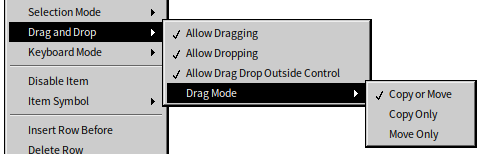

以下面的简单程序为例，示例的界面上有两个列表框控件：

程序运行时，就可以拖拽列表框中的条目了：

需要注意的是，上面示例程序中，由于列表框的内容在程序运行时可能会改变，所以程序中在使用到相关数据时，需要使用“ItemNames”属性，再把列表中的内容读取出来。在实际应用程序中，需求往往会更复杂一些，比如，可能需要限定允许拖拽的范围，可能需要使用某些按钮来控制条目的转移等等。本书会在讲解了[事件结构和程序界面](pattern_ui) 之后再来介绍这些复杂用户界面交互的实现方法。

### 在表格中高亮显示异常数据

多列列表框控件的用法与列表框控件几乎相同。区别从名字上就能看出来，列表框只有一列，而多列列表框可以有多列。多列列表框还可以显示行和列的表头，这样一来，多列列表框就非常适合用于显示二维的数据表格，比如显示产品的测试结果数据，显示成绩单等。下面用一个显示成绩单的程序为例，介绍一下多列列表框控件的基本操作：

上图中的程序，循环结构左边的部分分别调用了多列列表框控件的“Column Header Strings”、“Row Header Strings”和“Item Name”属性设置了控件的列表头、行表头和表格内的数据。嵌套的两个循环结构遍历了表格中的每个数据单元，如果发现当前单元的数据小于 60，就调用属性“Active Cell”和“Cell Background Color”把当前单元格的背景设为红色。程序运行效果如下：

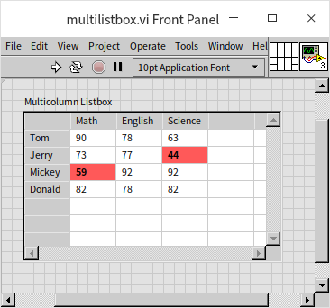

LabVIEW 中还有一个“表格”控件，它与多列列表框控件的外观几乎一模一样，使用方法也类似，比如下图的程序，使用了类似的方法，把表格控件的每隔一行的背景色做了调整，可以让数据看起来更清晰：

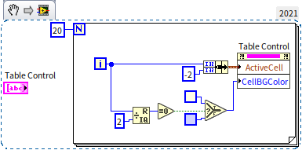

程序中，设置“Active Cell”的时候，使用了 -2 作为列号，表示所有列，也就是选取一整行。在设置“Active Cell”时，如果输入是一个非负整数，表示选取对应的行或列；输入 -1 表示不选取；输入值小于 -1 表示全部选取。程序的运行效果如下：

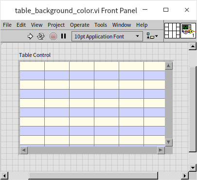

表格控件的数据类型是一个字符串二维数组，与多列列表框控件的“Item Name”属性的数据类型相同。由此可见，表格控件更侧重于表格中的数据，而不是对这些数据的界面操作。在 LabVIEW 中，直接把数据传递给控件的接线端效率最高；使用局部变量传递数据效率会稍差一些；使用属性节点的运行效率是最低的。如果程序只需要显示一组二维数据，那么使用表格控件会更方便高效一些；如果还需要对数据进行一些操作，比如高亮选中一些行，通过拖拽调整数据的顺序等，就最好还是使用多列列表框控件。

### 截取控件图片

本书中所有的插图都是笔者手工截取的，但是，有时候我们需要使用程序自动截取一些图片，比如在程序中生成报表的时候，我们会希望把已经在程序界面上生成的漂亮的波形图、3D 图形等直接放到报表中，或保存到文件里。这时候，可以使用控件的“获取图片”方法。如下图中的程序，调用了多列列表框控件的获取图片方法：

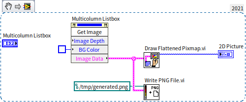

通常，报表的背景颜色是白色的，所以在截取控件图片时，也需要设置背景为白色，以免出现不协调的背景色。程序调用了“Draw Flatterned Pixmap.vi”把截取的图片转换成了二维图片数据，这样就可以在前面板使用“2D 图片”控件把它显示出来了。程序还同时调用了“Write PNG File.vi”把截图保存成了一个 PNG 文件。这几个图片相关的 VI 都在函数选板“编程 -> 图形和声音”下。程序的运行结果如下：

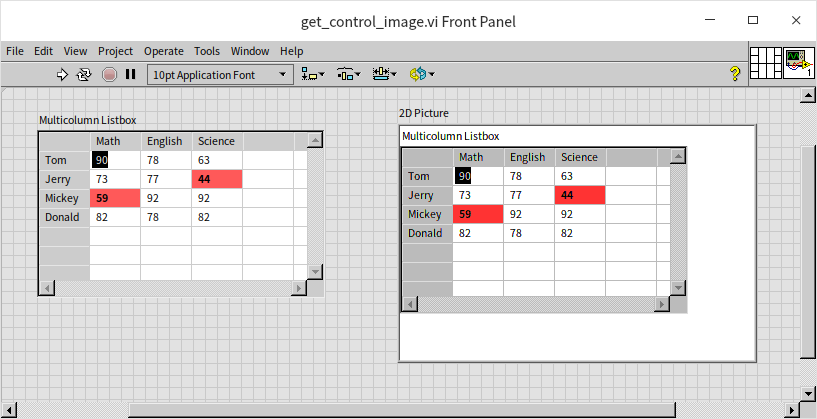

## 练习

* 编写一个 VI，VI 的前面板上显示有一些文字，比如 “LabVIEW”，还有一个可供用户选择颜色的控件。VI 运行时，当用户在颜色控件上选择了一个颜色后，把前面板上的文字改为相同颜色的文字。
