# 图形化显示数据

能够方便的把数据以图形化的方式展现出来，是 LabVIEW 的一大特色。LabVIEW 为此提供了丰富的控件和函数，可以大大简化图形化显示数据的复杂度。LabVIEW 图形控件选板上列出了几十种控件，分别用于显示不同类型的数据。但实际上，真正用于显示的部分，不需要分成那么多种控件，比如，一个图片控件既可以显示用直角坐标系表示数据，也可以显示用极坐标系表示的数据。所以，读者们可能已经发现了，这个选板上的很多控件被拖到前面板上时，它还会在 VI 的程序框图上添加一些代码。这些代码是真正用来处理不同类型的数据的，它们把不同类型的数据转换为图形控件可以显示的方式，再使用图形控件把数据绘制出来。

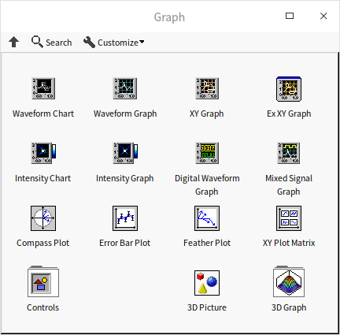

这个选板上的大多数控件用来显示二维图形数据，也有一部分控件可以用来显示三维图形数据。

## 波形图表和波形图

我们先来看两个最常用的数据曲线显示控件：波形图表和波形图控件。所谓曲线就是一组随时间变化的数值数据，曲线常常也被称作波形。LabVIEW 中最常见的曲线格式是在一个直角坐标系中用 X 轴表示时间，Y 轴表示数据值。 

### 图表与图的区别

在图形控件选板上的波形图（Waveform）和强度图（Intensity），都有对应的图表（Chart）和图（Graph）。图表和图的功能非常类似，最主要的区别在于当图表控件自带一块缓存，历史数据会被保存在缓存中。当图表接收到新的数据时，它不会把原来显示的图形清除，而是在原图形基础上再把新数据添加上。图控件没有缓存，每次接收到新的数据，就会把旧图清除，只显示新的数据。

在实际应用中，图表适合显示低速变化的数据，比如某一程序每秒钟读取并显示一次锅炉的温度数据，这个程序可以使用波形图表控件。这样不但能够显示当前数据，还可以为用户提供历史数据，直接观察到温度的变化趋势。如果程序显示的是瞬时的高速采集的数据，就无需逐点显示数据了。比如，程序在 0.01 秒内采集了 1000 个被测物体的震动信号数据，即便可以在 0.01 秒内逐个画出 1000 个点，人眼也无法看到绘图的过程。这种情况更适合在采集完全部 1000 个数据后，使用波形图控件一次绘制出全部数据。

在 VI 前面板上新加一个波形图表控件，会发现它在程序框图上的数据类型是 DBL 的实数数值类型；在 VI 前面板上新加一个波形图控件，会发现它在程序框图上的数据类型是实数数组类型。波形图表控件的数据端通常会放在一个循环内，每次循环迭代为波形图表提供一个数据；波形图控件则每次接受一组数据，然后全部显示出来。比如下图中的程序，绘制了一条带有噪声的正弦波信号。波形信号被分别传递给了一个波形图表和一个波形图控件，但传递方式有所不同：

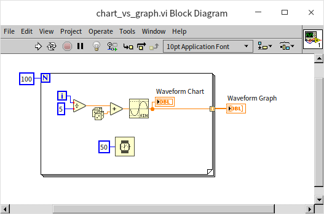

运行 VI，会看到波形图表和波形图控件最终显示的数据曲线完全相同。区别在于程序的运行过程中，波形图表控件逐点绘制曲线，波形图控件要等到所有数据集齐后才一次绘制所有数据。

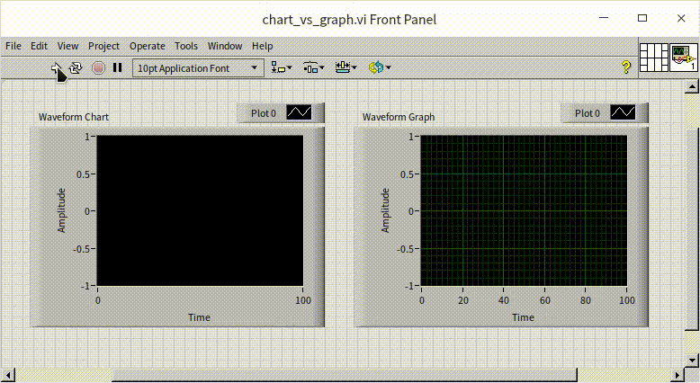

这时候如果再次运行 VI，会发现波形图表上的旧数据并没有被清除，而是在后面继续添加的新数据。如果希望每次程序运行时，都是一个全新的开始，可以在程序中通过波形图表的“历史”属性节点（关于属性节点的介绍，可以参考 [控件的属性节点](data_and_controls#属性节点) 一节），清空它的历史数据，之后再添加数据：

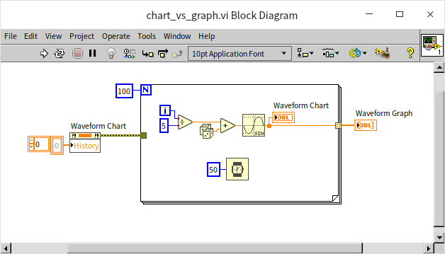

我们也可以使用同样的属性节点在程序运行当中，清除波形图表控件的历史数据，或者为它设置一些初始的历史数据。

我们之前介绍的各种控件，大多都是每个控件对应一种数据类型，比如开关控件接受布尔类型的数据，文本框控件接受字符串数据类型等。但是波形图表和波形图控件，除了默认的数值和数值数组类型之外，还可以接受其它多种不同数据类型，并且根据不同的输入数据类型采取不同的数据显示方式。

波形图表控件也可以接受数值数组数据，这时，它会一次把输入的一组数据都添加在波形显示区。如果我们把上面的例子稍作修改，在循环外，把生成的数组数据同时传给波形图表和波形图控件，会发现这时候两个控件的行为完全一致：

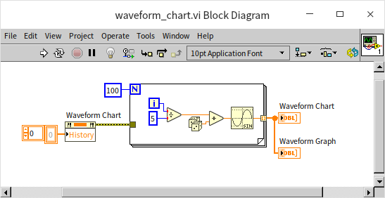

### 显示多条波形曲线

波形图表和波形图控件都可以用来显示多条波形曲线，一个直觉的想法是：既然一维数组可以表示一条曲线，那么二维数组就应当可以表示多条曲线。我们的确可以把二维数组数据传递给波形图表和波形图控件，让他们显示多条曲线，但是需要注意的是，这两个控件接受的二维数组数据是具有不同格式的：

* 波形图控件接受的二维数组数据中，每一行代表一条曲线，每一列代表一个时刻的数据；
* 波形图表控件正相反，它接受的二维数组数据中，每一列代表一条曲线，每一行代表一个时刻的数据。

比如下面这个程序，波形图表和波形图控件显示的曲线图案完全相同，但是输入的数据，一个却是另一个的转置：

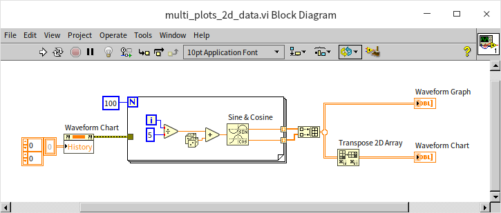

这也是因为两个控件使用场景的不同：波形图每次绘制一条曲线，然后再绘制另一条曲线；波形图表控件每次绘制一个时间点所有曲线的数据，然后再绘制下一个时间点的数据。另一种波形控件常用的数据类型是簇数组（Array of Cluster），与上面的规则类似：

* 波形图控件接受的簇数组数据中，每个簇代表一条曲线；
* 波形图表控件接受的簇数组数据中，每个簇代表一个时刻的数据。

下图中程序产生的结果与上面的示例完全相同：

波形图表控件提供了两种方式显示多条曲线。波形图表控件的鼠标右键菜单中，可以选择 “堆叠模式（Stack Plots）” 或者 “覆盖模式（Overlay Plots）”。覆盖模式是默认的模式，就是多条曲线显示在同一张图上；堆叠模式则视为每个曲线单独绘制一张小图：

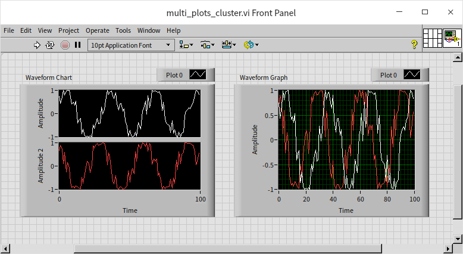

堆叠模式的一个用途是，有时候两条（或多条）曲线的 Y 轴数据范围差距较大（或者是偏移量差距较大），不适合放在同一张图中。比如下图中的两条曲线，由于它们的幅值差距较大，在同一个坐标系中，幅值较小的那一条曲线的细节部分就看不清楚。

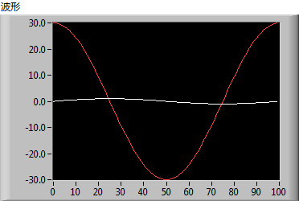

这时，可以使用堆叠模式，把两条曲线分别显示。但是波形图控件没有堆叠模式，或者可能在波形图表控件中我们也还是希望把两个曲线显示在同一张图上，以便比较。这时候我们还有另一个选择：我们可以为两条曲线设置不同的坐标系，以便把每一条曲线的整体和细节都展现得清清楚楚。

在波形图坐标轴的标尺上点击鼠标右键，选择 "复制标尺"，可以为波形图添加一条额外的标尺。每个标尺的刻度可以是不同的，在波形图的属性对话框中或图例的右键菜单中可以选择每个曲线采用哪一个标尺。采用不同的标尺，可以使波形图中每条曲线的显示都达到最佳效果：

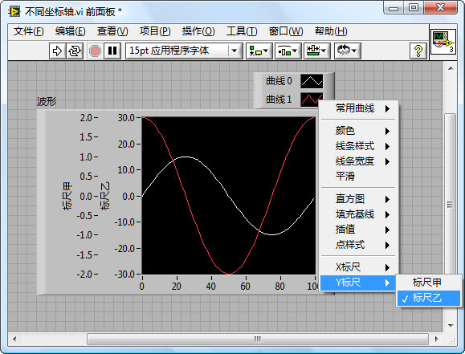

## 波形数据类型

到目前为止，我们一直在使用数组的索引来表示曲线的时间信息，但在很多实际应用中，是需要显示曲线的实际时间信息的。比如，如果一段数据采集于 2021 年 12 月 18 日上午 9 点 01 分 01 秒至 2021 年 12 月 18 日上午 9 点 01 分 02 秒，这些时间信息需要被显示在波形图的横轴上以方便用户理解数据。这就需要把时间信息和数据的值一同传递给波形控件才行。在 LabVIEW 中，我们可以把时间信息和波形数据一起打包成一个簇。不过，我们不需要自己定义这个簇了，LabVIEW 已经定义了一个特殊的簇类型，专用于保存待时间的波形数据，这就是波形数据类型。

波形数据类型包含四个元素：t0（采样起始时间）、dt（采样间隔时间）、Y（数据，一维数组表示的每个点对应 Y 轴上的值）、attributes（波形的一些属性）。由于波形包含的信息多于单纯的数组，所以程序中应当尽量以波形数据类型来表示采集到的数据。有关波形数据的函数都在 LabVIEW 的函数选板的 “编程 -> 波形” 中。

下图中的程序生成了一个波形数据。它使用系统当前的时间作为波形的起始时间，采样间隔是 0.1 秒。

既然波形中包含了时间信息，那么在表示它的时候，X 轴直接显示时间信息会更加直观。若需要波形图控件的横坐标显示时间，只要调整它的显示格式即可。鼠标右键点击波形图控件的横坐标，选择 "格式化" 即可对其显示格式进行配置。它的设置方式与普通数值控件显示格式的设置方式相同（参考 [数值控件及其显示格式](data_number)）。直接选择 "绝对时间" 格式即可在 X 坐标标尺上显示时间，也可以使用高级设置选择自定义的显示格式：

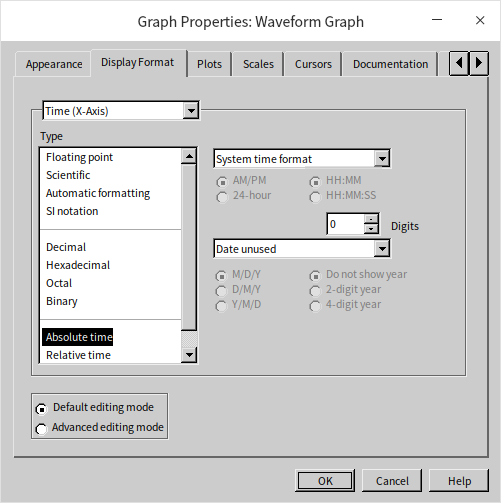

波形图控件默认状态下，是通过直接修改坐标的起始值来设置 X 轴的时间信息的，所以当我们需要使用波形数据携带的时间信息时，需要把 “忽略波形数据的时间戳（Ignore waveform time stamp on x-axes）” 这个选项取消才行：

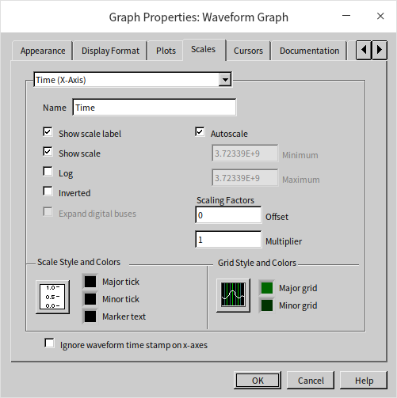

程序运行结果如下：

使用 "设置波形属性" 和 "获取波形属性" 可以读写波形数据中的属性。波形中可以保存一些任意名称和任意类型数据的属性。采集数据时的某些信息，如通道名称、单位、放大倍数等，这些信息在后续的程序中也许还要用到，就可以把它们当作波形数据的属性保存下来，并传给后续程序。后续程序在需要用到这些信息时，可以从波形数据中把它们读出来。这两个函数分别有一个名为 "名称" 的输入或输出接线端。在程序中，某些名称的属性具有特殊用途。比如，"NI_ChannelName" 表示通道名称。设置了这个属性，波形图中的通道名称会自动更新。在这两个函数的帮助文件中，可以查看到这些特殊含义的名称属性的详细信息。

使用波形数据的一个额外好处是：波形图表和波形图控件可以接受同样格式的数据，并且显示出同样的结果了，比如下面的程序：

程序运行结果：

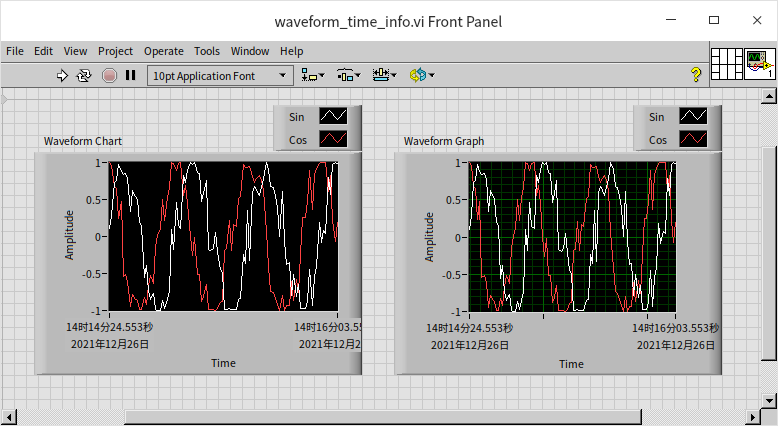

## XY 图形控件（XY Graph）

波形图控件处理的数据有一个特征，它的时间信号是有序等间隔的。对于这种数据，通常只需要用一个一维数组，表示每一个时间点上 Y 轴的数据即可。如果还需要具体的时间数据，也不需要把每个时间点的数据保存下来，只需要一个初始时间值，和一个间隔值即可。但是，有时候除了波形曲线，我们还需要绘制一些其他类型的曲线，它们的 X 轴可能并不是有序的，或者不是等间隔的。对于这样的数据，就还需要再增加一个一维数组，来表示数据在 X 轴上的每一个数值。这一类由一组对应的 X 和 Y 的值组成的数据，可以使用 XY 图形控件（XY Graph）来显示。

我们通常会用 XY 图形数据来展现两组数据之间的关系。比如，在测控领域，常常用它来展示一组采集数据中两个通道的数据之间的关系；在数据统计或人工智能等领域，常常用它来展示一个数据集中，某个特征量的分布，或者两个特征之间的关系等。

### 展示两个信号通道之间的关系

下图是一个简单示例，它把相位相差为 90 度的两个正弦波数据分别作为 X 和 Y 轴的数据输入 XY 图形控件：

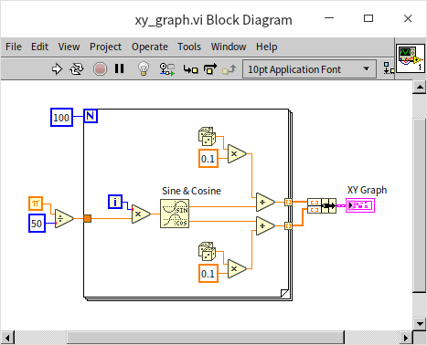

如果没有噪音，图像应该是一个正圆。因为加入了一些随机数，XY 图形控件显示的是一个带有不规则锯齿的圆圈：

很多示波器具有绘制利萨茹曲线的功能。数学上，利萨茹（Lissajous）曲线（又称利萨茹图形、李萨如图形或鲍迪奇曲线）是两个沿着互相垂直方向的正弦振动的合成的轨迹。使用利萨茹图形可以测量出两个信号的频率比与相位差。在程序里，我们可以使用ＸＹ图形控件来绘制利萨茹曲线。下图的程序是一个简单示例，为了简化编程复杂度，程序使用了 [Express VI](measurement_express_vi) 来生成演示所需的两个通道的正弦波信号，两个通道信号的频率分别为 3Hz 和 4Hz：

输入频率比为 3/4 的两个正弦信号的利萨茹曲线如下：

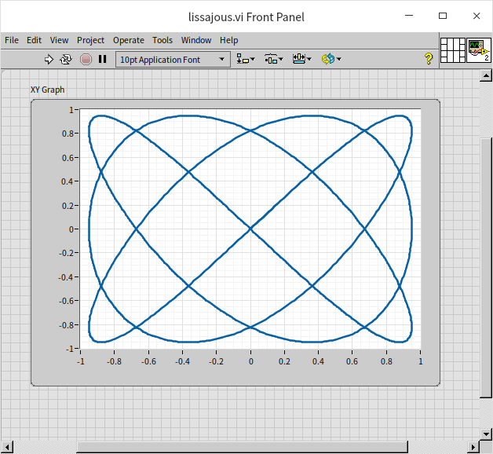

### 数据分析

文本文件 “weight_height.csv” 中，收集了一万个人的性别、身高和体重数据。我们猜测，身高和体重数据可能有相关性，需要验证一下，那么我们就可以用身高作为 X 轴，以体重为 Y 轴，把每一个人的身高体重对应的坐标点显示在 XY 图形控件上。这样就可以直观的看出体重相对于身高的分布规律了。XY 图形控件也可以接受多通道数据，所以我们还可以按照性别把数据分为男女两个通道。下图是示例ＶＩ的程序框图：

* 程序首先从 csv 文件中读出数据，程序使用了一个库 VI，“Read Delimited Spreadsheet”。这个 VI 可以读取文本格式的表格数据，再把数据存放在一个二维数组中输出。有关文件读写的详细介绍，可以参考 [文件读写](pattern_file) 一节。
* 然后，程序按照性别把数据整理至４个一维数组中，分别代表：男性身高、男性体重、女性身高、女性体重，
* 最后分别把男女的数据绑定为两个通道的数据，在 XY 图形数据显示出来。

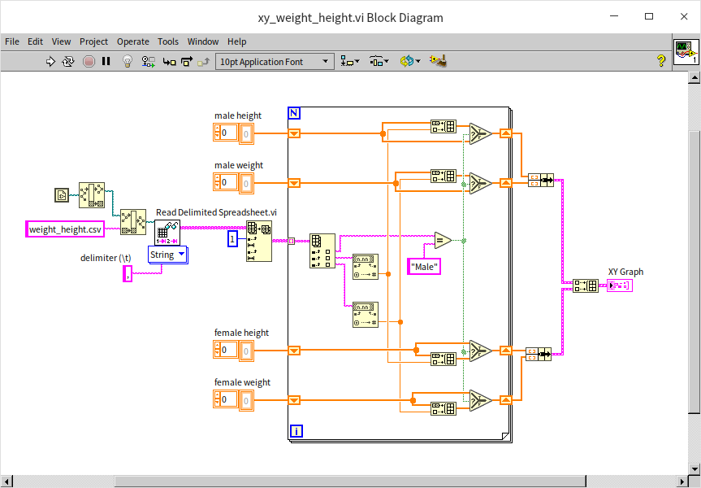

这个示例中的数据都是离散的，每个人之间的数据都相互独立。所以也不需要有连线，只要在每个有数据的地方画一个点即可。我们可以在 XY 图的设置中修改曲线风格，改成按点显示：

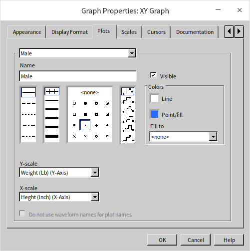

程序使用蓝色代表男性数据，红色代表女性数据。程序运行结果如下图所示：

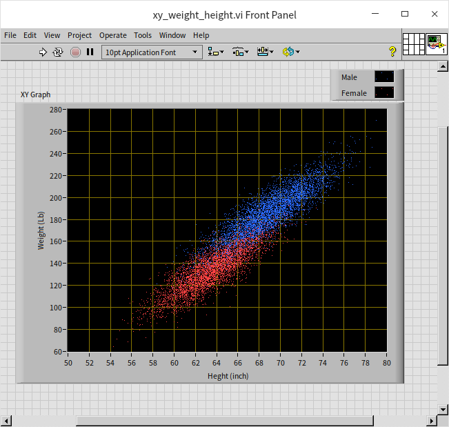

可以明显的看到数据分布在一条倾斜的狭长地带上，无论单看男性、女性，还是从整体来看，都可以看出身高与体重之间有比较明显的正相关性。如果需要看一下人群中，身高与体重各自的分布情况，也可以使用 XY 图形控件来显示。程序逻辑与上面的示例相似，区别在于最后的显示数据经过简单统计处理后的数据。在这里我们使用身高作为 X 轴，在每一身高区间范围内的人数左右 Y 轴，这样就可以看到在身高维度上人数的分布。使用类似的方法，也可以查看人群中不同体重区间内的人数分布。

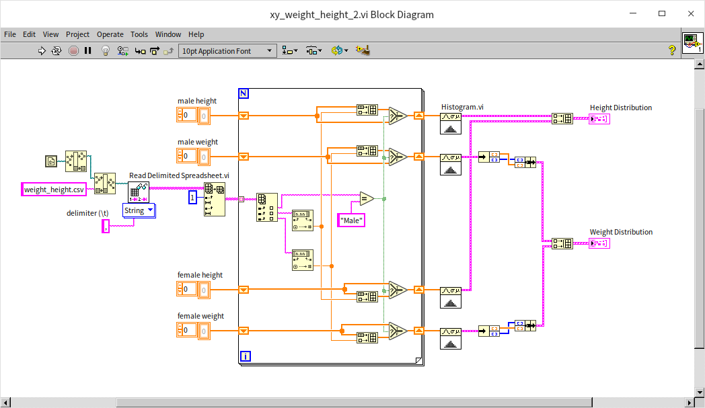

查看数据在某一维度上的分布常常会使用柱状图，当然，曲线图也可以：

可以看出男女的数据分布虽然有重叠，但峰值部分（最典型的身高和体重）还是明显分开的。

## 强度图 (Intensity Graph)

XY 图形在每一个坐标点只有两个选项：有数据或者没有数据。但有的时候我们需要在每个坐标点上展示更复杂的信息，不仅表示有没有，还要显示一个量值。这时候数据就从二维变成了三维，除了 X、Y 轴的数值，又添加了一个 Z 轴上的数值。LabVIEW 常用两种方法来显示三维数据，一种方法是使用三维图形控件，但是我们首先介绍一下第二种方法：使用强度图来展示三维数据。强度图依然是一个二维图，与 XY 图有些相似，但是它可以使用像素的亮度或颜色来表示三维数据在 Z 轴上的数值。

### 时频联合谱图

在测控领域，使用波形图只能表达两维信息量。比如常常用横轴表示时间或频率，而用纵轴表示幅值或能量。但有时候我们需要更复杂的分析方法，比如真实信号的能量在不同频率的分布常常是随着时间变化而改变的。如果要把这一变化显示出来，就需要借助有三维信息的图形，分别显示时间、频率、功率。我们可以使用强度图来表示这个三维信息，则除了横纵轴分别表示时间和频率，再使用颜色变化来表示第三维的功率信息。某些音频播放软件提供了时频联合分析的功能，即在一张图上以颜色表示声音能量在不同时段和频率上的分布。使用 LabVIEW 编程可以实现同样的功能。下图
是实现这一功能的一段程序。它的实现方法是比较简单的，把声音分成小的片段，比如每秒钟一段，然后分析这一段时间内，声音功率在不同频率上的分布，最后把每一秒钟的分析结果合并在一起，就得到这一数据随时间变化的图谱了。

在上图的示例程序中，有一个图标包含一副眼镜和一个音符的子 VI （Sound File Read Simple.vi）。LabVIEW 中，常常在图标中用眼镜表示读取数据或文件，所以从图标可以猜到这个 VI 用于读取声音文件，它在函数选板“编程 -> 图形和声音 -> 声音 -> 文件”上。另一个图标上有 PS/PSD 字样的子 VI （FFT Power Spectrum and PSD.vi），在函数选板“编程 -> 波形 -> 模拟波形 -> 波形测量”中，它使用快速傅里叶变换计一段时域信号在频域上的能量分布，也就是功率谱。

在选取时间片长度的时候需要注意：如果时间片选取的太短，时频联合分析结果在频域上的分辨率就会比较低；而如果时间片太长，时频联合分析结果在时域上的分辨率会降低。这两个分辨率是矛盾的，此消彼长。对于音乐和语音来说，一般每秒钟最多包含四五个音节，所以选取每 200 毫秒为一个时间片是比较合适的。

下图是一首钢琴曲的时频能量谱图。从这张图上可以清楚的看出钢琴曲不同音符的跳跃变化。如果需要编写一个程序，把一段音乐转成曲谱，或把录制的电话拨号音还原为电话号码，那么第一步就可以采取上述方式进行时频联合分析。然后得到谱图中高亮部分信号的频率，再将频率转换成相应的音符或电话拨号即可。

如果把程序改为从声卡或其它数据采集设备中读入数据，就可以对采集到的信号进行实时分析了。

### 数据分析

在显示身高体重分布的示例中，使用 XY 图，我们只能够分别查看身高的分布或体重的分布。如果想同时观察身高和体重的分布这就需要三维数据了：身高、体重、分布数量，它可以使用强度图来显示，程序如下：

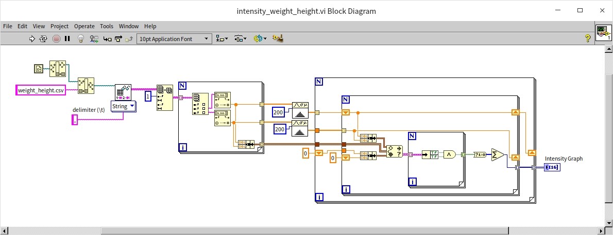

由于 LabVIEW 自带的函数中没有计算二维数据分布图的 VI，这个示例程序稍微麻烦了一点，需要自己计算数据在每个身高体重区间内的分布。我们把身高和体重都各自等分了 200 份，也就是把数据按照身高体重组成了一个 200*200 的网格，然后把每个人的数据放到相应的网格里。在 XY 图形控件中有亮度来表示每个网格中人数的多少：

上图看上去有点像斜着放的银河系，但是可以看出来，有两个亮度比较明亮的区域区域，分别是男性和女性中最常见的身高体重区域。

### 图片

整个电脑屏幕的显示本质上也是一种强度图。对于黑白显示屏来说，每个像素有三维数据：横坐标、纵坐标、亮度；对于彩色显示屏来说，是把红绿蓝三个颜色通道的强度图合并在了一起。我们在屏幕上看到的每一个图片也是一个强度图。因此，我们可以把图片再拆分成基本的亮度数据，然后在 LabVIEW 的强度图控件上显示出来。下图中的程序读取了一个图片文件，图片内容是一个 LabVIEW 的图标。LabVIEW 读取图片的 VI 会把图像数据当作一维数组读出，我们需要把它转换回为二维数组的形式。又因为图片是彩色的，而 LabVIEW 每个强度图只能显示一个通道的数据，所以我们需要把数组中的数据拆分成红绿蓝（RGB）三个通道，然后分别送往三个强度图控件显示。

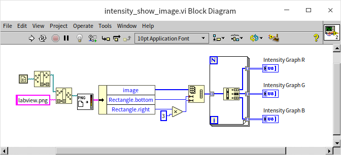

程序运行结果如下：

图片使用的坐标系与 LabVIEW 中二维图形控件使用的坐标系略有不同，LabVIEW 图形控件多是使用的标准的直角坐标系，是把左下角当作原点，向右为 X 轴正向，向上为 Y 轴正向；图片中一般把左上角作为原点进行计数，向右为 X 轴正向，向下为 Y 轴正向。这个示例程序没有调整读入数据的方向，所以在 LabVIEW 强度图中显示的图片是翻转了 90 度的。与原图对比一下：

## 三维图形控件

强度图控件不支持多通道数据是因为它毕竟还是二维显示的，如果同时有多个通道的数据，其中一个通道的图像必然会覆盖住其它所有通道的图像，因此它每次只能显示一个通道数据。此外，人眼对于颜色和亮度的敏感度也远不如对距离的敏感度。因为，为了更清楚的展现三维数据，LabVIEW 也提供了真正的三维图像显示控件，它们可以显示多通道三维数据。尽管显示器屏幕是二维的，但是我们可以调整三维图像的观察角度。在三维空间里，如果有数据遮挡了另一些数据，调整到合适的观察角度就可以查看那些原本被遮挡的数据。

虽然 LabVIEW 控件选板上有众多三维控件类型，其实它们真正用于显示的都是同一种控件，不同之处只在于用于处理数据的函数。在把这些控件拖到前面板的同时，它们会自动在程序框图上添加一个名为“xx helper”的子 VI。这些 VI 就是用来帮助构建三维图像的，它们有些用来绘制离散的点，有的可把点连成线，还有一些可以把点连成面。

### 三维点图

在三维空间绘制点图与在 XY 图形上绘制点图非常类似，只要提供每一个需要绘制的点的坐标即可。上文中，在 XY 图形控件上绘制了一些身高体重数据，我们可以看到男性和女性的数据分布是有重叠区域的，在重叠区域内不太容易分辨哪里是男性或女性的数据。为了把两组数据彻底分开，我们可以把性别也作为一个维度（比如女性用 0.1 表示；男性用 0.2 表示），这样每条数据就有了三个维度的值：身高、体重、性别。把每一条数据的三个值传给三维控件，即可绘制出数据在三维空间上的分布：

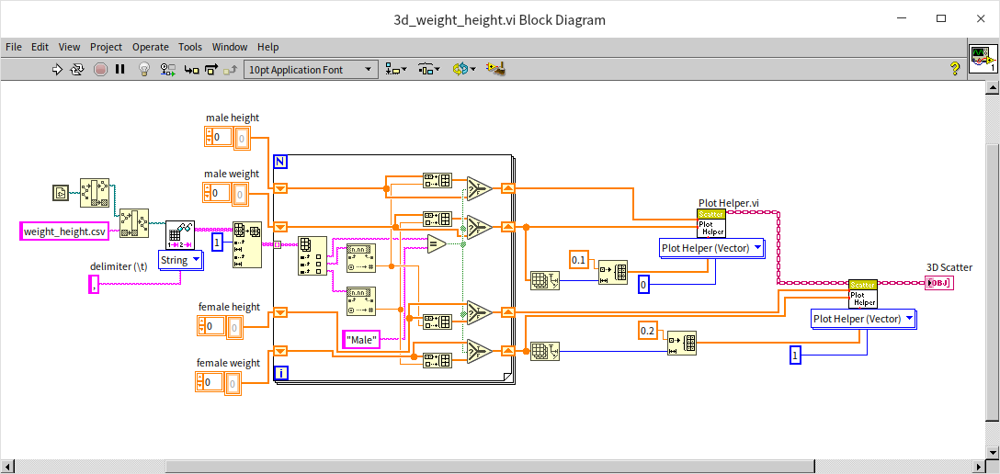

程序运行结果如下，现在，我们可以拖动三维图，切换角度来看清楚每一处的数据：

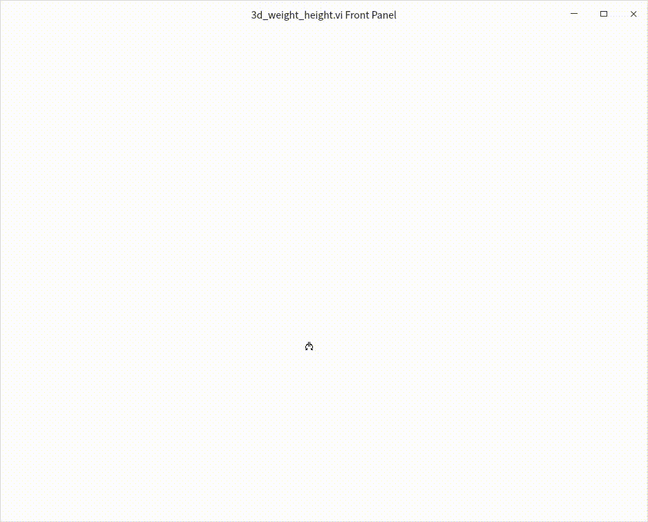

### 三维曲线

绘制三维曲线与绘制三维点图所需要的数据基本相同，区别仅在于会使用线段把输入数据中每个相邻的点都连接起来。很少有示波器可以绘制三通道的三维空间上的利萨茹曲线，但是我们可以编程轻松实现这一功能。下图程序与绘制二维利萨茹曲线的程序非常相似，仅仅是增加了一个通道，现在有三个通道的正弦波信号，频率分别为 2Hz、3Hz 和 4Hz：

程序运行结果如下：

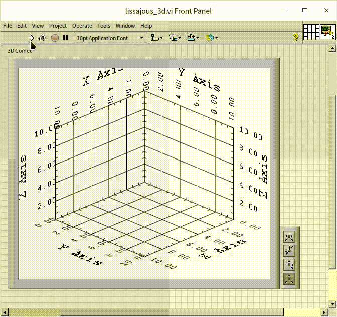

### 三维曲面

有一些数学公式被绘制成图后是可以非常漂亮的，充分体现了数学之美。比如下面的程序是笔者根据在网上找到的绘制花瓣数据的公式编写的。程序写完之后，使用了程序框图自动整理工具，程序节点排布可能变得整齐了一些，但是程序逻辑似乎更难读懂了。连线编程的方式确实不太适合表达复杂的数学公式，笔者应当使用 [公式节点](data_number#公式节点) 来编写这个程序：

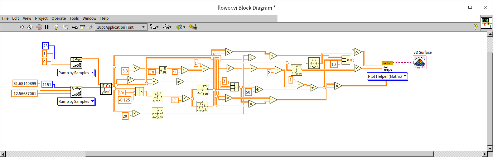

程序运行结果如下，看上去还挺漂亮的，但是机械感太强，不够真实。

修改三维图形控件的设置：隐藏坐标显示，调节光照和配色：

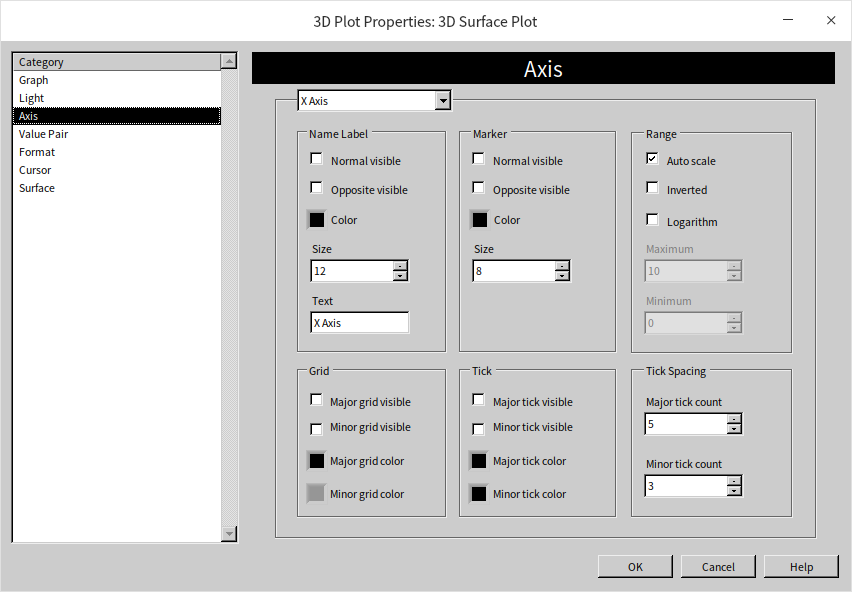

之后图片看起来有点像真花了：

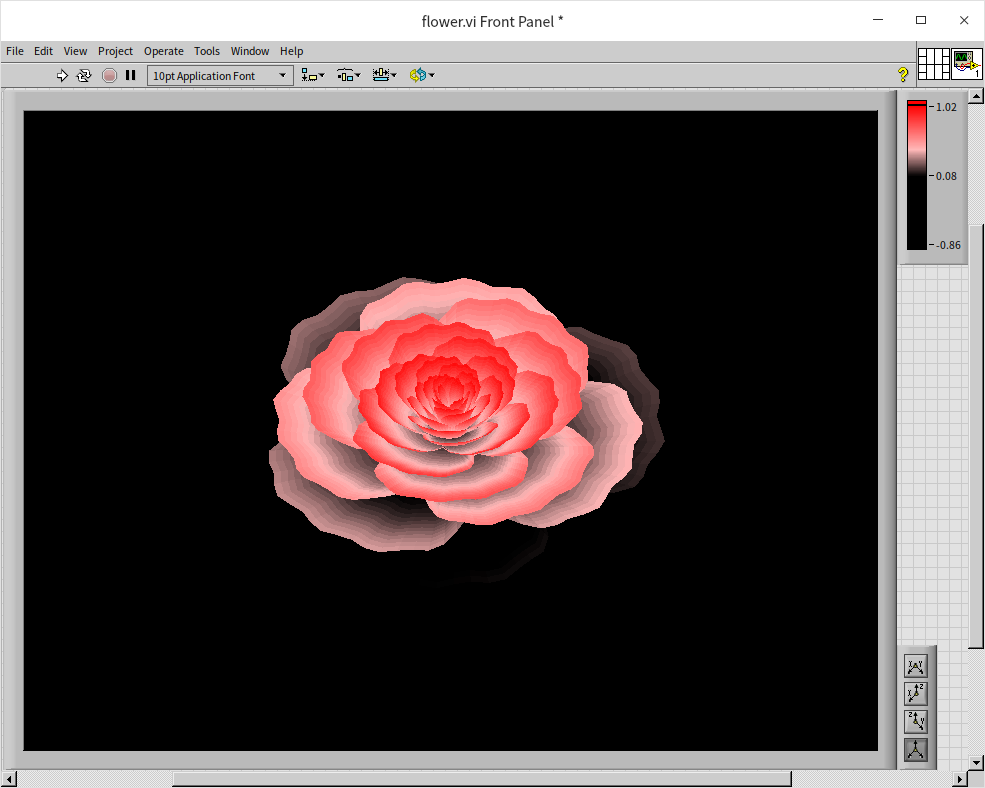

## 练习

* 编写一个 VI，产生一些方波数据，并且在界面上把这些方波显示出来。
