# 数值和布尔数据

## 数值控件

通常，LabVIEW 控件选板上排在第一位的就是放置数值控件的选板：


这一栏中的控件虽然在前面板上的外观各不相同，但是它们所表示的数据类型是相同的，都属于数值类型。选板右上方两个控件的数据类型是“时间”，也是数值数据的一种显示方式。还有其它一些控件，尽管位于别的选板，但它们的数据类型也是数值型的，比如下拉列表控件、列表框控件等。

这个控件选板上头两个控件是最常用的数值类型控件，尽管它们的外观是最简单。他俩的区别只在于第一个是控制控件，第二个是显示控件。控制控件比显示控件底色更浅，同时在左侧多了两个增减按钮。在鼠标键盘操作的系统中，这两个按钮比较鸡肋，但是在触摸屏操作的系统上还是有实用性的。除了这两个基本控件，编程人员还可以根据数据的应用环境和表达的具体意义来选定一种控件。例如，在工厂生产流程中，表示某个油罐内的储存油量时，可以选择液罐控件；模拟汽车仪表盘的时候应该选仪表控件；等等。

LabVIEW 数值控件还有丰富的各种设置和显示方式，有一些在控件的鼠标右键菜单中就能发现，比如设置空间数据的进制、单位等：

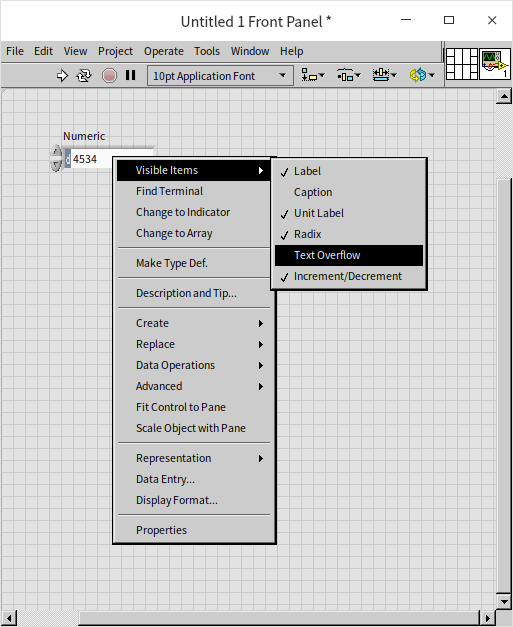

而更多的设置是在控件的属性对话框中。在控件的右键菜单上点击“属性”，就会打开属性对话框：

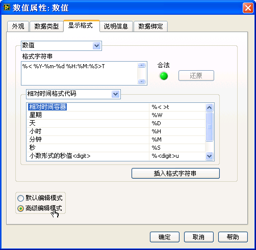

我们可以在属性对话框中设置控件的状态、尺寸、数据范围等等。这里大多数设置是比较直观的，看到名字就能够理解。比如，设置数值范围可以对数据的范围加以限制，避免程序运行时出现数值越界错误。设置显示格式可以方便用户观察数据。

在属性对话框的显示格式页上，我们可以选择用何种方式显示一个数据，比如是以小数方式，还是科学记数法或是工程记数法来显示，对于整数还可以选择进制，比如二进制、十六进制等。如果我们正在设置的数值表示的是一个时间，使用单一的数值来显示时间显然不符合我们识别时间的习惯。我们需要让它按照年月日的格式把时间值显示出来。设置时间显示方式，相对复杂一些，尤其当我们需要使用自定义的格式时。这时，可以在显示格式页面中，先选择需要设置的类型是“绝对时间”（或“相对时间”），然后再在下方选择“高级编辑模式”，就可以为控件设置显示方式了（如上图）。例如，在 "格式字符串" 一栏中输入 "%<% Y-% m-% d % H:% M:% S>T"，可以让控件按照 "年 - 月 - 日 时：分：秒" 的格式把一个实数数值显示出来。

实数“0.0”用绝对时间格式表示如下：


当一个实数用来表示绝对时间时，其含义是指北京时间 1904-01-01 08:00:00 （相当于格林威治时间 1904-01-01 12:00am）这一时刻之后的多少秒。

## 常量

鼠标右键点击某一个数值型数据常量，可以看到其快捷菜单中 "匹配至输入数据" 一项是默认选中的。也就是说，常量将会根据输入值自动选择表示法。例如，在常量中输入一个正数，假设为 "34"，常量的类型会自动变为 I32 整型（蓝色 ）；假如输入为 "34.3"，常量的类型会自动变为 DBL 实数型（桔黄色 ）。如果要输入实数型 34，则应该输入 "34.0"。

数值型控件并无这一选项。也就是说，对数值型控件而言，必须视需要人为选择控件的表示法。

## 表示法

一个数值型数据还可以有多种不同的表示法，用来表示不同范围和精度的数据。我们可以认为数值类型属于一种数据类型，而 I32，U8 等只是不同的表示法；也可以把数值类型的不同表示法视作不同数据类型。在文本编程语言中，一般都是把 I32，U8 等当作不同的数据类型处理的。

在 VI 的前面板上放置一个数值型控件，或在程序框图上放置一个数值常量，在它们的右键菜单中可以查看或更改其表示法（Representation）：


在 LabVIEW 帮助的索引中搜索“数值”，打开数值分类下的数据，可以查看到每种表示法的详细解释。从表示法的图标中可以很清楚地看出，每种表示法的区别在于数据长度不同。计算机使用的是二进制，每一位可以表示 0 或 1 两个值，8 位为 1 字节。每种表示法的长度如下表所示。

| | | | |
|-----|------------------------|-----|---------------------|
| EXT | 扩展精度实数，16 字节长   | DBL | 双精度实数，8 字节长   |
| SGL | 单精度实数，4 字节长      | FXP | 定点数，最大 8 字节长   |
| I64 | 带符号 64 位整数           | I32 | 带符号 32 位整数        |
| I16 | 带符号 16 位整数           | I8  | 带符号 8 位整数         |
| U64 | 无符号 64 位整数           | U32 | 无符号 32 位整数        |
| U16 | 无符号 16 位整数           | U8  | 无符号 8 位整数         |
| CXT | 扩展精度复数，2×16 字节长 | CDB | 双精度复数，2×8 字节长 |
| CSG | 单精度复数，2×4 字节长    |     |                       |


一般来说，长度越长，可以表示的数值范围就越大、精度也越高，但计算速度越慢，占用存储空间也越大。

选择表示法首先要考虑能够满足程序需求。比如说 I16 表示法能够支持的数值范围是 - 32768 到 32767 之间的整数，这个范围甚至不够计算 300×300 这样的简单算术运算。我们不妨现在就编写一个程序：新建一个 VI，在 VI 上放置两个值为 300 的 I16 常量，然后相乘，将乘积用一个 I16 的数值控件来显示，看看他们的积是多少。这种错误叫做“溢出”，也就是需要表示的数值已经大于一个控件可以表示的最大数值了。此类错误如果隐藏在一个大工程内，查找起来是颇为困难的。

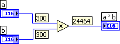


I64 可以表示的范围就要大很多，可以达到 $10^{18}$ 数量级。但这样的数量级如果用于计算阶乘，最多也只能算到 20 的阶乘（即 20!）。需要更广泛的数值范围，或者用到小数时，就要使用实数表示法。某些科学计算中还需要用到复数。

其次，要考虑程序的运行效率和存储效率。计算机对于实数的运算速度要大大慢于整数运算。所以，程序中的数据，若能够以整数表示的，如表示人数、物件个数等只可能出现整数的物理量，数值又不会太大时，尽量使用整数，而不要用实数。

复数是由两个分别表示实数部和虚数部的实数组成的，运算速度更慢。

对于单个数据而言，使用 U16 与使用 U32 表示法相比，不过相差两字节。这个长度上的差别可以忽略不计，对程序占用的存储空间根本不会有什么影响。为安全起见，不妨尽量使用长度较大的表示法。但如果数据量较大时，选择不同表示法会导致程序内存占用的巨大差异，需要加以慎重选择。比如用于一个拥有大量元素的数组，若数组有 1,000 个元素时，元素采用 U16 与 U32 表示法相比，则有 2K 字节存储空间的差别；若数组有 1,000,000 个元素时，差别达到 2M 字节，已经相当可观。

### 一些特殊的实数

前面提到整数运算在产生溢出时，程序不会报错，但是用户看到的数值却是一个错误的数据了。那么实数运算会产生溢出吗？实数虽然能够表示的的数据范围要大的多，但也是有限的。双精度实数 DBL 可以表示的最大数值大约为 $1.7*10^{308}$。如果数据超出这个范围，LabVIEW同样不会报错，而是会使用一个特殊的符号，Inf（正无穷大），来表示所有比这个范围还大的数。当然对应的还有 -Inf，负无穷大。

比如，在 LabVIEW 中计算 $1 \div 0$，结果就是 Inf。在很多其它编程语言中，除以零会抛出异常，而不是得到一个特殊结果。0 除以任何数都等于零，任何数除以 0 都等于无穷大，那么 0 除以 0 等于几？在 LabVIEW 中 $0 \div 0$ 会得到另一个符号 NaN，表示这不是一个数值。在其它一些情况下，也会得到 NaN，比如 NaN 和数值做运算都会得到 NaN； +Inf 与 -Inf 相加会得到 NaN； Inf 除以 Inf 会得到 NaN； -1 开平方也会得到 NaN。

-1 开平方在实数域内确实没有结果，但是如果在复数域内就是一个合法的计算了。我们把输入和输出的表示法都换成双精度复数，再计算一遍：


-1 开平方的结果应该是 i，但是在笔者的电脑上得到的结果是 6.12303E-17+1i，它有一个近似为零却不是零的非常小的实数部分。这是计算中的误差造成的，双精度实数毕竟只有 8 个字节，不但能表示的数值范围有限，分辨率也有限，只能间隔的表示一段数值范围内的一部分数值，如果真实数值没有恰好是这些数值中的一个，就只能使用近似的值来表示。使用近似值产生的误差，可能是在计算过程而中间值中产生的，累积到最终结果的时候，也会被体现出来，以至于一些本来可以被精确表示的最终计算结果，也会带有误差，比如 $\sqrt{-1}$ 的结果，尽管双精度复数是可以精确表示它，但这里还是显示出了误差。这也提醒我们，在比较两个实数是否相等的时候，一定要考虑误差。

### 数值表示法之间的转换

数值表示法之间，通常不需要经过特殊函数进行转换。用连线把一个数值，连接到另一种表示法数值类型的接线端上，数据就会自动转换成新的表示法。有些函数，如加法函数，可以接受任何表示法的数据。若有两个不同表示法的数据作为加数传递给加法函数，加法函数会把表示范围较小的那个数据转换为范围较大的表示法，结果数据当然也采用后一种表示法。数据表示法发生变化的地方会出现一个红点（强制转换点），以提醒编程者的注意：


一般来说，这些强制转换点并不会影响程序运行。但它们毕竟是编程时无意识造成的，有可能存在潜在危险。比如编程者不小心使用了一个短数据类型来显示一个原本是长数据类型的数据，就有潜在的数值溢出的可能。所以，为了消灭这些潜在威胁，应当消除所有的强制转换点（函数上那个红点）。如果程序中确实需要进行强制转换，可以使用表示法转换函数（在函数选板 "编程 -\> 数值 -\> 转换" 中），以避免无意识下造成的数值转换错误：


## 数值运算的常用函数

与数值数据相关的基本运算函数和节点大多位于“编程 -\> 数值”函数选板下：

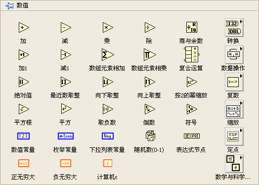

这些函数节点的图标非常直观地表示出了它们的功能：加、减、四舍五入、求倒数等。在“数学”函数选板中，还有一些更复杂的有关数学运算的函数和 VI。每一个函数的功能可以在 LabVIEW 帮助文档上找到，本书就不重复了。

数学运算的算法纷繁复杂，难免有时需要一个函数，却不知道它藏在哪个函数选板下。这时，可以利用函数或控件选板的搜索功能，点击函数或控件选板上方的“搜索”按钮（图标为放大镜的按钮），就可以进入选板搜索功能：


在搜索界面上输入关键词，然后选中一个搜索结果，拖放到 VI 的程序框图或前面板上即可。如果双击一个搜索结果，会跳转到这个结果所在的选板位置，这样我们就能够知道这个节点放置在哪个选板上，以后可以直接到这个选板下选择该节点。

:::tip

很多数学运算函数的图标比较小输入接线端离得也比较近（比如减法函数），如果不小心把两个输入数据线连接到了错误的接线端上，或者就只是希望调换两个输入数据的位置，不需要把数据删除再重新连接。可以采用一种更便捷的方法：先把鼠标移动到加减法数的输入参数接线端上，再按下Ctrl键，光标会从绕线轴变成一个类似剪刀的形状。点击鼠标，这两个输入端的连线就会交换位置，如下图。这个方法只对有两个输入参数的函数有效。

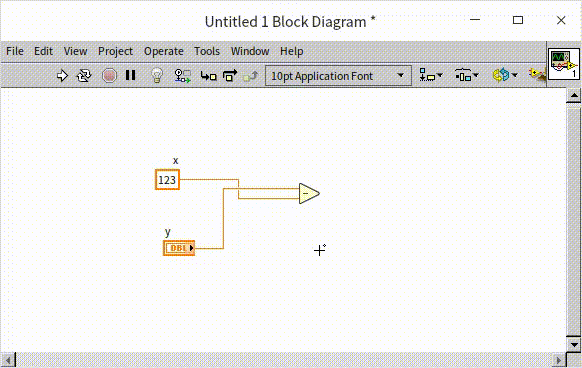

:::

## 表达式节点

对于简单的加减乘除运算，使用基本的函数节点就够用了。如果是较为复杂的数值运算，就需要大量函数节点。节点之间的连线可能会有转角甚至相互交叉，显得比较杂乱，不利于程序阅读和维护。此种情况下，我们可以选用其它一些更好的编程方法。

对于只有一个输入和一个输出的运算，我们可以使用表达式节点。

比如，我们要计算华氏温度到摄氏温度的转换，可以通过基本运算函数完成。尽管运算并不复杂，但读者恐怕还是无法一下子就意识到这个运算与计算公式是完全一致的，还需要一步一步加以判断。这是图形化语言在表达纯数学计算时的弱点。而文字表达方式，因为它与教科书、文字资料中常见的公式书写一致，所以更为直观易懂。在 LabVIEW 中，表达式节点是使用文字来描述运算的。下图的下半部分显示的就是一个使用表达式节点的程序，用户可以直观地读出该节点所使用的公式：

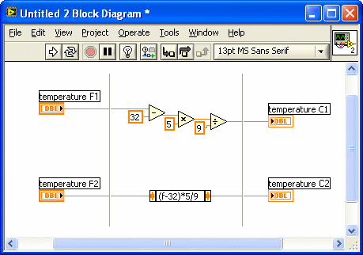

与使用基本运算节点相比较，表达式节点的另一个优点是节省了框图上的空间。

在表达式节点中只允许有一个字符串代表输入参数，即只能计算单变量函数。例如，上图中用 f 表示输入参数。

LabVIEW 在线帮助里列出了表达式节点所支持的运算符、函数和表达式规则。LabVIEW 的表达式节点，以及后文将要提到的公式节点，在书写数学表达式时，都借鉴了 C 语言的运算符和函数名，如果有 C 语言基础，基本上不需要查找帮助也可以直接写出来，比如加减乘除，或者 ** 表示指数运算，sqrt() 表示开方等等。

## 公式 Express VI

如果运算有多个输入，可以使用公式 [Express VI](measurement_express_vi)：


我们在后续章节中还会详细讨论 [Express VI](measurement_express_vi) 的特点和使用方法，这里仅简单介绍一下公式 Express VI。该 VI 在函数选板 "数学 -\> 脚本与公式" 下。把它拖到程序框图上，它会立刻弹出一个配置面板，它看起来就像是一台高档计算器，用户基本不需要学习就可以使用了：

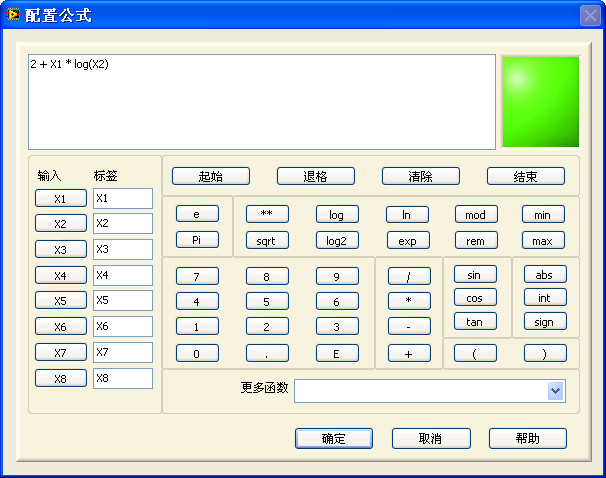

公式 Express VI 允许使用最多 8 个输入数据，但只能有一个输出数据。公式 Express VI 的缺点是：它的表达式是隐藏起来的，在程序框图上看不到具体的公式。用户需要查看计算公式时，先要双击这个 VI，调出配置面板才能看到。

## 公式节点

对于多输入多输出或更加复杂的计算，可以使用公式节点（在函数选板“编程 -> 结构”上）：


用户可以把它看作是更为复杂的支持多输入输出的表达式节点。公式节点中的表达式语法与 C 语言类似，相当于实现了一个只包含基础的数学运算的 C 语言的子集。熟悉 C 语言的用户，使用公式节点不会感到陌生。对于没有 C 语言经验的读者，需要先学习一下 C 语言的基本语法，这样可以帮助快速使用公式节点。

在使用公式节点的时候，如果一个变量表示的是输入值，则不需要在公式节点内进行声明，比如上图程序中的变量 a 和 x，它们的类型定义是在输入控件中定义的。文本程序中的其它变量，一定要预先声明，这也是 C 语言的语法之一，比如上图程序中的 y 和 temp，需要在程序开头声明它们的数据类型是 int32。

新添加的公式节点是空白的灰色矩形框，用户需要首先在公式节点的框架内添加类似 C 语言的文本程序。然后鼠标右键点击框架，在菜单中选择“添加输入”和“添加输出”为程序添加输入输入输出变量。输入输出都是附着在公式节点边框上的小方块，输入在左，输出在右。使用者要在小方块内写入变量名。


在实现算法时，人们往往更习惯于文本表达方式。我们在书本中学习到的公式，对计算过程的描述，都是用文本方式来表达的。并且，在具有较多[选择结构](structure_cond_seq)的程序中，文本表达方式可以有顺序地显示所有分支中的内容；而 LabVIEW 在遇到选择结构时，每次只能显示一个分支的内容，其它的分支要点击鼠标后才能逐页读到，可读性差。因此，在较为复杂的数学运算程序中，使用公式节点可以让程序的可读性和可维护性得到提高。

下图是一个棋类游戏程序中的一个子 VI，用于计算可以走子的位置。它实际上就是针对一个二维整数数组的一些简单数值操作。程序嵌套了多个循环与选择结构，使得它相当难以读懂。读者不需要理解它的程序，这是只是用它来展示一下 LabVIEW 代码可能会达到的复杂程度。


下图是一个完成相同功能但使用了公式节点的子 VI 的程序框图。对于一个 C 语言水平与 LabVIEW 水平差不多的程序员来说，下图这个程序读起来会更加顺畅，公式节点中的代码也更容易理解。


公式节点的缺点是：对于毫无 C 语言编程经验的用户，还要花费一些时间先学习公式节点的语法，给他们增加了一点额外的使用成本。

公式节点中的代码无法设置断点和进行调试。为了保证公式节点中代码的正确性，可以先在一个 C 语言编译器中对其进行编译调试，在保证其正确性后再在放入 LabVIEW 公式节点中使用。


## 数值的单位

LabVIEW 被广泛的应用于测控领域，LabVIEW 中的数据通常不是抽象的数值，而是代表实际意义的物理量。因此，LabVIEW 的数值型控件和常量是可以带物理量单位的。在数值型控件的快捷菜单上选择 "显示项 -\> 单位标签"，就可输入数值的单位了。单位是用英文字母缩写来表示的，如果你对某个单位的正确拼写没有把握，可以先任意输入一个字符，然后用鼠标右键点击单位标签，选择 "创建单位字符串"。这时，LabVIEW 会弹出一个对话框，显示出 LabVIEW 支持的所有单位。

数据从一个单位转换为其它单位时，数值是会自动换算。例如要计算 2 年有多少天，可以用下图中的程序：


给某种数据类型的控件赋予另一种数据类型的数据，如把一个 I32 型的数据赋值给字符串型的控件，肯定是一种错误行为。LabVIEW 与大多数编程语言一样，也具备在编译时报告此类错误的功能。除此以外，LabVIEW 还具备对数值型数据进行单位一致性检查的功能。这种检查更严格：不仅实数与字符串之间不可以相互赋值；同样是实数型的两个数据，如一个表示时间，另一个表示长度，它们之间也不能相互赋值。

故此，我们在编写 LabVIEW 程序的时候，应当尽量使用带单位的数值控件。当试图把表示时间的数据和表示长度的数据相加时，LabVIEW 会禁止这种连线。这有助于防止编程时出现的不一致性错误：


一个带单位的物理量，和一个不带单位的数值之间，有些运算是被允许的，有些则不行。比如数字常量 π 是不带单位的，当计算直径为两米的圆的周长时，可以计算 2m * π，这是允许的，但是两米与 π 相加则不符合物理规则。


但是，这种严格的单位一致性的检查也可能会带来麻烦。例如，我们编写了一个子 VI，用于计算两个时间数据之和。下次，当我们需要一个计算长度数据之和的子 VI 时，却不能够直接使用这个已有的、计算时间数据的子 VI，因为它们的单位是不同的。为了解决这个问题，LabVIEW 提供了单位通配符。

在编写能够适用于不同单位的子 VI 时，可以使用单位通配符。单位通配符用 \$n 表示，其中 n 是 1 到 9 之间的任意一个数字。以我们刚才提到的加法为例：可以在子 VI 中使用通配符 \$1；如果还需要一个执行其他运算的子 VI，其单位可以用 \$2 表示；依此类推。


非常遗憾的是，LabVIEW 很多自带的 VI 却没有使用单位匹配符，直接把有单位的数据传递给它们，LabVIEW 就会报错。这时候只能稍微麻烦一些，把有单位的数据转换成无单位数据，计算完之后再转回有单位数据。


使用“单位转换”(Convert Unit)节点（在“编程 -\> 数值 -\> 转换函数”选板下）可以把一个纯数字量转换为带有单位的数字量，或者反向转换。比如，我们想要生成一个在一米到两米之间的随机长度，可以使用 LabVIEW 自带的“Random Number (Range).vi”，但是这个 VI 没有使用单位通配符，我们只能作单位转换后再使用它：

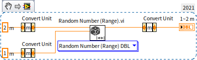

使用同一选板下的“基本单位转换”（Cast Unit Bases）节点，可以更灵活地把某一数值从一个单位直接转换成另一单位。需要注意的是，单位转换节点的外观和表达式节点的外观一模一样，甚至在早期版本中，它们的鼠标右键快捷菜单也一模一样，但它们的功能完全不同。千万不要用弄混了，下图程序中两个节点虽然看上去一样，但产生而结果却不同：

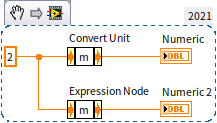


## 布尔数据类型和数值的比较

布尔型数据只有两个值："真" 或 "假"。在理论上，只要一位（bit）就可以表示这两个值了。但实际上，台式机或笔记本电脑处理数据的最小单位是字节（8 bit），这两个值只能分别是用一个字节来表示的。当一个字节上每一位数据都为 0 时，表示 "假"，否则表示 "真"。下图程序演示了数值与布尔类型之间的转换关系：

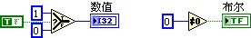

数值比较时会产生一个布尔结果。比如计算 2 是否大于 1，结果会是真。需要注意的是，实数是否相等的比较，以及一些特殊值之间的比较。

比较两个实数是否相等的时候，要考虑误差。由于计算机中能够表示出来的数值有限，绝大多数而实数都是在用近似值来表示，这就产生了误差。一般来说，只要两个实数的差距小于某一预定的范围就可以算作是相等的了。这个范围，也就是允许多大的误差要根据项目的具体情况和要求来设定。同一段程序，在不同的电脑上运算，误差也可能是不同的，比如下面的程序：在笔者电脑上直接比较 $\sqrt{-1}$ 的实数部分是否是 0，结果却是假。在某些电脑上可能这个判断会是真。但为了确保在所有电脑上都得到应有的结果，我们需要为这个是否等于 0 的比较设定一个误差范围，这样就可以在任何电脑上都得到 $\sqrt{-1}$ 实部为零的结果了。

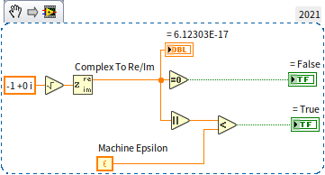

一个数值 x 是不是肯定不等于 x+100？在数学计算中是的，在很多编程语言中也是的，但在 LabVIEW 中却不一定，因为无穷大与无穷大是相等的，无穷大加减乘除某个具体的数也还是无穷大（或者负无穷大）。：

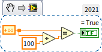

NaN 与任何数都不相等，包括它自己。如果要检查一个数据是否是 NaN 只能使用“不是一个数字/路径/引用”函数来检查：

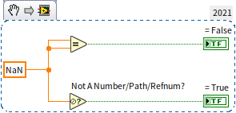


## 布尔型控件

布尔控件从外观上来看，是各种样式的开关、按钮和灯泡：

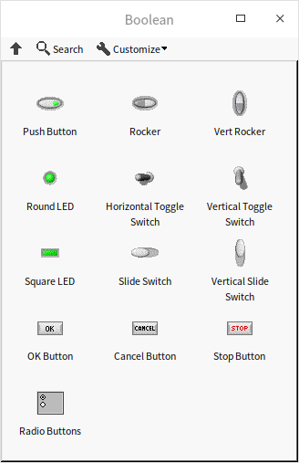

布尔型控制控件不仅在外观上，在行为上也模拟了真实的开关和按钮，还可以设置不同的机械动作。在控件鼠标右键菜单中选择 "机械动作"，可以看到如下图所示的六种机械动作：


其中，前两个机械动作模拟开关，每次点击，状态就会发生改变：开变关，关变开；后四个机械动作模拟按钮，按下再松开手，按钮会自动恢复默认状态。开关或按钮按下是一个持续的动作，有一个过程，但布尔数值，就两个状态，这六种机械动作就定义了，在按下控件的过程中时，究竟何时改变控件的值。最符合用户习惯的设置是，对于开关类型的控件，选择第一种机械动作，即，每次鼠标按下就立即切换数据的值；对于按钮类型控件，选择第二排第二列的机械动作，即每次鼠标按键放开时，发出一个值改变的脉冲信号。所谓脉冲信号是指，按钮控件的布尔数值原本是 False，在鼠标按键放开的瞬间变为 True，然后立即恢复为 False。

在大多数程序中，按钮常常被用来触发一个事件，去处理某个工作。关于这一点，后文还会在[事件结构](pattern_ui)中继续讨论。在后面的章节中，会讲到如何使用控件的[局部变量和“值”属性节点](data_and_controls)。对于大多数控件而言，除了可以通过它们的接线端读写数据以外，还可以通过它们的局部变量和“值”属性节点读写数据。但是，机械动作为触发型的布尔控件，也就是第二排的三种机械动作类的布尔控件，是不能够使用局部变量和“值”属性节点的。

## 数据类型强制转换

### 强制转换的含义

LabVIEW 中有一个“强制类型转换”函数，在函数选板“编程 -\> 数值 -\> 数据操作”上。它可以把数据强制转换成另一种类型，但内存中的二进制数据本身并不发生改变。这个函数类似于 C 语言中的强制类型转换。

比如下面这段代码是 C 语言中，把双精度浮点数强制转换成整数：
```cpp
double dblNumber;
int64* intPointer= (int64*)(&dblNumber);
int intValue= *intPointer;
```
与之功能相对应的 LabVIEW 程序如下：


首先要明确，强制类型转换与上文提到的，把数据转换成不同的表示法，或者用整数来表示布尔数值等的转换方式都是不同的。上文提到的几种转换都是让同一个数据以不同的形式表现出来，尽管在转换过程中，数据类型以及数据在内存中的二进制数值可能都发生了变化，但数据所传递的含义是不变的。比如说“13.4”这个数据，可以用32位浮点数表示，也可以用64位浮点数表示，甚至也可以以字符串的方式表示。这些不同表现形式在内存中记录的是完全不同的数据。但对于用户来说，看到任何形式的“13.4”都表示的是“13.4”这个数。而强制转换，则恰好相反，在转换过程中，内存中记录的数据不发生变化。但用户接受到的内容却变了。

以上图中的程序为例，如果使用“转换为 64 位整型”函数对 13.4 进行转换，得到的数据是 13，数据表达的含义是相同的，尽管精确度不同了。DBL 类型的 13.4 与 I64 类型的 13，两者在内存中按二进制存储的内容完全不同。
使用强制类型转换得到的与 DBL 类型的 13.4 对应的 I64 类型的数值是 4623733147430603981。这两个数据在内存中都是占用 8 字节长度，并且以二进制表示的所有字节的数据都是："0100000000101010110011001100110011001100110011001100110011001101"。这个二进制数据，如果按照双精度实数的存储方式去理解它，它就是 13.4；按照 I64 的存储方式去解释它，它就是 4623733147430603981。这就是所谓的：二进制数据本身不发生改变，但是按照不同的数据类型理解，其含义完全不同。

### 强制转换的用途

在应用强制类型转换时，要考虑这样的转换是否有实际意义。一个二进制数据在某类型下表达的是一定的含义，换成另一类型，也许就失去其意义了。还以上图中的程序为例，假设这是一个测试程序中的一部分，实数 13.4 本来表达的是测量到的当前温度值。如果把这个数值强制转换成 I64 的 4623733147430603981 就完全失去其原来的物理意义了。

因此，只有那些内部表达方式相同的数据类型之间，进行强制类型转换，新类型的数据才可能会有意义。

### 布尔与 U8 之间的转换

布尔型数据和 U8（或 I8）在内存中同样是用一个字节来存储的。因此这两种数据相互之间的强制转换是有意义的。下面的两个程序分别使用了两种方式在数值与布尔之间转换，它们的功能是完全等价的。


如果把上面两个程序中数值的表示法，由单字节编程多字节，比如使用 I16 数值进行测试，那么两个程序的结果就完全不一样了。归根结底，对于多字节数值，比如 I16 数值，我们仍然可以用函数来判断它是否等于零，或者使用选择函数把“真”“假”条件转换成不同的数值，但这时候，强制类型转换就失去了意义。布尔类型只有 1 个字节，把多字节数值前置转换成布尔类型，布尔类型的值，只会由那个多字节数值的第一个字节决定（最高位的那个字节）。多字节数值即便不等于零，它的第一个字节也可能是零。所以这种强制转换一般没有实际意义。

### 时间与数值间的转换

上文提到，我们可以按时间格式显示一个实数，LabVIEW 就是用实数来表示时间的。但是为了更方便的对时间进行操作，LabVIEW 中还定义了一个专门的数据类型：“时间标识”。准格尔数据类型的本质上，依然是以秒的数值为单位来记录时间。LabVIEW 使用了两个 64 位数值来记录时间的值。前 64 位记录秒数的整数部分，后 64 位记录小数部分。它的长度与扩展精度实数一样，但表示方法并不相同。

时间有两种：相对时间和绝对时间。相对时间表示某两个时刻之间的差值，这个数据在 LabVIEW 中记录的就是两个时刻所差的秒数。绝对时间指的是某一时刻的年月日时分秒，在 LabVIEW 中记录的是这一时刻距离格林威治时间 1904 年 1 月 1 日 12:00 a.m 的秒数（这是大多数软件采用的计时方法）。也就是说，绝对时间记录的实际上是一个特殊的相对时间。

例如，如果相对时间是 2 分钟，在 LabVIEW 内部记录的就是数值“120.0”；如果绝对时间是第 29 届北京奥运会开幕时间：北京时间 2008 年 8 月 8 日 20 点 0 分 0 秒，则 LabVIEW 内部记录的数值是“3301041600.0”。这实际上是该时刻距离格林威治时间 1904 年 1 月 1 日 12:00 a.m 的秒数。

时间可以通过表示法转换函数转换成数值，数值也可以通过“转换为时间标识”函数转换成时间。时间的秒数与年月日时分秒之间的转换通过“日期 / 时间至秒转换”和“秒至日期 / 时间转换”函数完成，比如下图中的程序：


它的运行结果如下：

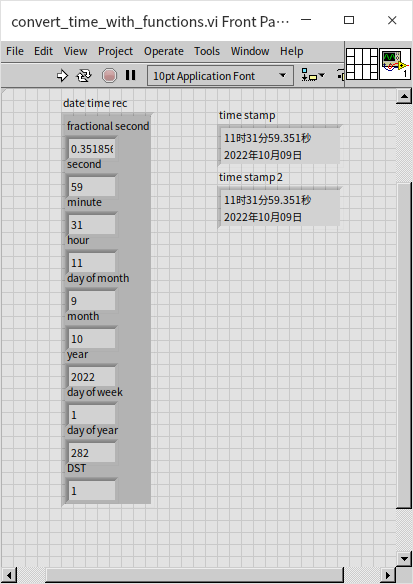

当我们知道了时间标识在内存中的存储方式：一个 128 位二进制数据，前 64 位为整数部分，后 64 位为小数部分。我们就也可以使用数据类型的强制转换方法来查看内存中的数据。我们可以把时间数据强制转换成两个 U64 组成的簇，时间的整数部分，被转换后可以直接用 U64 显示出来，小数部分经过简单换算，也可以显示出来，如下图所示：

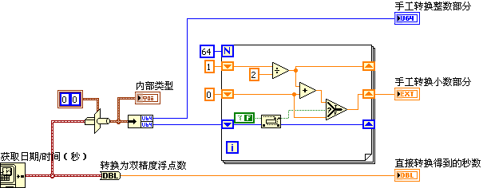

程序运行结果如下，可以看到强制数据类型转换与 LabVIEW 提供的转换函数所得到的结果是相同的：


本节提到的数据类型强制转换主要是为了帮助读者理解 LabVIEW 中数据在内存的存储方式。在实际项目中，应该尽量使用 LabVIEW  提供的转换函数，而不是使用强制类型转换。如果对数据不是完全了解，强制类型转换很容易产生错误的结果。


## 练习

* 笔者家的客厅是一个长为 22.5 英尺，宽为 12.5 英尺的长方形。编写一个 VI 计算一下笔者家客厅的面积是多少平方米？
* 编写一个 VI，它有 4 个数值输入数据（控制控件或常量），分别是 x1, x2, x3, target，和一个布尔型输出数据 result。编写程序判断一下在 x1, x2, x3 中是否存在两个数，相加后恰好等于 target。比如输入的 4 个数值分别是 x1=3, x2=5, x3=7, target=8, 则输出 result=True，因为 3+5=8； 如果前三个输入数值不变，但是 target=2，则计算结果应为 result=False。
