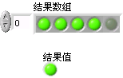
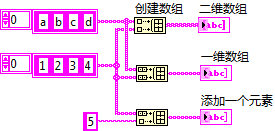
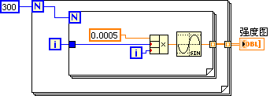

# 其它数据类型

LabVIEW中有众多数据类型，限于篇幅，我们不可能对每一种类型都进行详细的讨论。在本书中，我们只侧重于介绍部分常用数据类型和它们比较富有特色的使用方法。而与数值类型相似的部分，则不再重复讨论。

有些控件并没有在这一章提及，将在后续章节使用到它们的时候，再进行详细介绍。

## 枚举

枚举类型与数值类型有些相似。枚举型的数据一定是一段连续的正整数，每一数值表示一个特定意义。

### 枚举型控件与下拉列表控件的比较

讨论到枚举型控件，就一定要提及下拉列表控件，因为这两个控件在外观上极为相似（图
2.15）。

图 .15下拉列表和枚举型控件的外观

但枚举控件的数据类型是属于枚举型；而下拉列表属于数值型。表
2.2列举了两者在属性和应用方面的主要区别。

<table>
<colgroup>
<col style="width: 21%" />
<col style="width: 40%" />
<col style="width: 38%" />
</colgroup>
<thead>
<tr class="header">
<th>控件类型</th>
<th>下拉列表</th>
<th>枚举</th>
</tr>
</thead>
<tbody>
<tr class="odd">
<td>数据类型</td>
<td>

数值型
</td>
<td>

枚举型
</td>
</tr>
<tr class="even">
<td>表示法</td>
<td>
支持任何浮点实数类型，包括：EXT, DBL, SGL, I64, I32, I16, I8, U64, U32, U16, U8

</td>
<td>
只支持三种无符号整数类型：U32, U16, U8

</td>
</tr>
<tr class="odd">
<td>设置数值</td>
<td>可以给每个条目设定任意的值，但是不能有数值相同的条目。</td>
<td>只能按照顺序给每个条目设定一个整数值。从0开始，之后每个条目加1。</td>
</tr>
<tr class="even">
<td>作为条件结构的条件</td>
<td>
在条件结构的选择标签中，按照每个条目的值来判断条件是否满足。条件结构无法知道下拉列表中有多少条目，必须手工输入所有可能出现的条件值。

</td>
<td>
按照每个条目的标签来判断条件是否满足。条件结构知道枚举类型中每个条目，条件结构鼠标右键菜单中可以选择自动为每个枚举中的条目添加分支。

</td>
</tr>
<tr class="odd">
<td>动态修改条目标签</td>
<td>可以通过控件的属性设置，在程序运行时，动态修改下拉列表每一项的标签。</td>
<td>只能在编辑状态下修改枚举型每一项的标签。VI运行时不能修改。</td>
</tr>
<tr class="even">
<td>类型严格性</td>
<td>
所有下拉列表都是同一种数据类型，条目有所不同的两个下拉列表可以直接相互赋值。

</td>
<td>
拥有不同条目的枚举属于不同数据类型，它们之间不能直接赋值。如需赋值，需要首先强制转换成一般数值类型，再转换成另一枚举类型。

</td>
</tr>
</tbody>
</table>

表 .2比较下拉菜单与枚举类型

通过表 2.2的对比，我们可以得出以下结论：

在程序中，表示有限的几种物件、几个状态等含义时，应尽量使用枚举控件而不是下拉列表。因为枚举控件的数据类型更加严格，可以防止程序中的某些错误。并且，这样的数据在程序中通常会与选择结构相连，以对不同的状态、事件分别进行处理。而枚举控件按照条目标签来选择分支，可以增加程序的可读性和可维护性。

当程序需要表示的依然是一个数值，只不过需要把用户的输入限定在某几个特定值的时候，应当使用下拉列表控件。

比如，我们编写一段程序，用于模拟一台示波器，它有三种触发模式：边沿触发，脉宽触发和斜率触发。此时程序应该选用枚举类型的控件表示触发模式。这台示波器可显示的波形幅值范围也有三档，分别是：0.1V、0.25V和1V。它们是离散的数值，应该用下拉列表来表示这三个幅值范围。

### 单选按钮控件

除了下拉式的枚举型控件外，LabVIEW中单选按钮控件（图
2.16）的数据类型也是枚举型的。单选按钮只是在外观上与下拉式的枚举控件不同。单选按钮由一组布尔型控件组成（可以根据需要选择改变选项的外观，以及设置一定数量的选项）。在一组控件中，每次只能有一个值为真。整个单选按钮的值，就是为真值的那个布尔控件所在的位置。

 

图 .16单选按钮控件

单选按钮控件的优点是，所有可选的条目都直接显示在界面上，而枚举控件必须在操作中按下控件后才能查看条目内容；缺点是单选控件占用界面的尺寸比下拉式的枚举型控件大。

## 布尔

布尔型数据只有两个值："真"或"假"。在理论上，只要一位（bit）就可以表示这两个值了。但实际上，计算机处理数据的最小单位是字节，这两个值分别是用一个字节来表示的。当一个字节上每一位数据都为0时，表示"假"，否则表示"真"。

按钮属于布尔型的控件。它在作为控制控件时，还可以选择按钮所表示的机械动作。在控件鼠标右键菜单中选择"机械动作"，可以看到如图
2.17所示的六种机械动作：

图 .17布尔型控件的机械动作

选择不同的机械动作，布尔型控件就可以模拟不同种类开关的行为了。比如，房间灯光的开关，它是转换型的，按钮被按动后开关状态被改变，直到再次按动按钮。这种行为与图
2.17第一排开关的行为相一致。而门铃按钮则是触发型的，一松手按钮立刻弹起，回到初始状态。这与图
2.17第二排的机械动作相类似。有的门铃是按下按钮，按下立即就开始唱歌，此行为对应图
2.17的第一列；有的是松开按钮时才开始唱歌，对应图
2.17的第二列；还有的门铃，按下时发声，一松手声音马上就停了，这与图
2.17的第三列相对应。

在后面的章节中，我们会讲到如何使用控件的局部变量和"值"属性节点。对于大多数控件而言，除了可以通过它们的接线端读写数据以外，还可以通过它们的局部变量和"值"属性节点读写数据。但是，机械动作为触发型的布尔控件，即图
2.17第二排的三种类型的布尔控件，是不能够使用局部变量和"值"属性节点的。

## 数组

### 数组数据

数组用于管理一组相同类型的数据。LabVIEW中几乎任何其它数据类型都可以作为数组元素的数据类型，但数组本身不能作为另一个数组的元素。实际上，多维数组就有些类似于把数组作为另一个数组的元素了。在一定要把数组作为其他数组元素的时候，可以考虑先把作为元素的数组构成一个簇，再把这个簇作为另一数组的元素（图
2.18）。

图 .18数组元素为簇，簇中又有数组

在LabVIEW内部，一个数组数据包含了两部分内容：首先是数组每个维度上的长度信息；然后是按顺序排列的数组的每个元素。

### 数组数据的运算

LabVIEW中有些函数是专门针对数组的，比如计算数组长度、索引、排序以及计算数组的和等等。也有一些函数，它们原本用于数值类型、布尔类型等数据的计算，但是也可以直接用于对相应数据类型的数组进行运算。比如，对数值型数据进行操作的加减乘除等运算，也可以用于数值型数组；对布尔型数据进行的与或非等运算都可用于布尔型数组。

以加法为例，把一个数值和数组相加，相当于把数组中每个元素都加上这个数值。而两个数组相加，则相当于把两个数组中对应的元素相加，得到另一个数组。两输入数组元素个数不同时，结果数组长度等于两输入中长度较短的那个数组的长度。数组加法运算结果如图
2.19所示。

图 .19数组相加

对数组进行编程运算时，需要注意数组长度是否正确，尤其注意输入的数组是否可能为空。有时程序需要对输入的空数组进行特殊处理以避免出错。

### 数组数据的比较

比较函数，如"等于？"、"大于？"等函数也可以用于数组的比较。这些比较函数用于比较数组时，可以在右键菜单中选择"比较元素"，或"比较集合"。"比较元素"的意思是对两个数组中对应的每一个元素分别进行对比，比较的结果构成了一个同长度的布尔型数组。"比较集合"则是把数组整体作为一个数据，同另一个数组相比较，其结果为一个单个的"真"或"假"（图
2.20）。

图 .20比较数组

### 数组索引

索引是最为常用数组操作之一。使用"索引数组"函数，可以得到数组中某个位置上的元素的值。"索引数组"函数的"索引"参数用于表明需要得到数组中的第几个元素。但是"索引"参数也可以为空，即在缺省情况下，相当于输入为0，表示需要得到数组的第一个元素。

需要索引多个数组元素时，并不需要使用多个"索引数组"函数，而是可以把"索引数组"函数拉长。把鼠标移到"索引数组"函数下边框中间的位置，按住鼠标左键即可将其图标拉长（或缩短），左侧出现多个"索引"参数。每个参数都可以设置不同的值。若输入"索引"均为空，其缺省值依次为0、1、2、......，即输出依次为数组的第一个，第二个，第三个......元素。若输入"索引"在某一项索引后为空，则对应空索引的输出依次为非"空"的那一项+1、+2、......。参见图
2.21：

图 .21数组索引

索引多维数组的时候，可以索引某个元素，也可以索引某个数组子集。比如需要索引二维数组某个元素时，就要求"索引"参数输入两个位置信息，分别表示在两个维度上的位置；而需要索引某行或某列的所有元素时，只需输入行或列的位置信息即可（图
2.22、图 2.23）。

图 .22多维数组索引

图 .23多维数组索引运行结果

### 数组合并

使用"创建数组"函数可以把元素添加到一个数组中，或者把几个数组合并。当创建数组函数的输入为一个非数组类型数据，和一个这个类型的一维数组时，创建数组函数会把非数组数据添加到数组中去。如果两个输入数据是类型相同的一维数组，默认情况下，创建数组函数会把它们合并成一个二维数组。但是选择创建数组函数输入端右键菜单的"连接输入"，可以把两个输入的数组首尾相连，合成一个新的一维数组（图
2.24、图 2.25）。

图 .24创建数组函数的用法

图 .25创建数组函数的结果

创建数组函数和数组索引函数一样，可以通过拉伸支持多个输入数据。

### 其它类型的数组控件

LabVIEW中有些比较复杂的控件的数据类型也是数组，例如图表控件。这就使得数组数据可以有更丰富的表达方式。在某些情况下，以曲线或图形表达出来的数据比抽象的阿拉伯数字更加直观。

例如，通过某种函数计算得出一组二维数组的数据（图
2.26），希望能够观察到数据变化的规律。如果用表格的形式显示（图
2.27），虽然能够精确地显示出每一点的数值，但根本无法体现出数据变化的规律；如果以强度图的形式表示（图
2.28），虽然无法得到每一点的精确数据，但一眼就可看出数据变化的规律。

图 .26利用正弦函数计算得到一个二维数组

图 .27以表格表示的输出数据

图 .28以强度图的形式观察数组中数据变化规律

## 簇

簇用于把多个不同类型的数据归为一组，它和C语言中的结构(struct)比较相似。LabVIEW中最常见的簇，是错误输入/输出簇（图
2.29），在大多数VI中都能看到它的身影。它是由一个布尔类型数据、一个数值型数据和一个字符串数据组成的。

图 .29错误簇

控件"簇"外形的大小可以自动排列。在一般情况下，可以在簇的快捷菜单中选择"自动选择大小-\>垂直排列"。这样，簇中元素个数变动时，不必再手动调整簇的外观。再者，可以直观地看到簇中元素的排列顺序。因为在创建一个簇时，簇中元素摆放的顺序不一定就是簇元素排列的顺序。

"捆绑"/"松绑"（"解除捆绑"）有两种方式：一般的"捆绑"/"松绑"，以及"按名称捆绑/松绑"。它们都可以把几个简单的数据包装成一个簇，或者把簇中的元素拆分出来。在程序中应尽量使用"按名称捆绑/松绑"，而不是直接"捆绑/松绑"（图
2.30）。"按名称捆绑/松绑"不仅可读性比较好，还可以避免诸如前后两个簇中元素顺序不一致等引发的错误。

图 .30直接捆绑松绑方式虽然没有错误，但不建议使用

某些数值、布尔等类型的函数也可以用于对簇的运算，其效果与作用类似于对数组的运算。但由于簇中的元素通常拥有不同数据类型，所以需要对簇的每个元素都做某一运算的情况比较少见。

## 字符串

### 字符串与显示方式

LabVIEW中字符串的存储方式与C语言相类似，都是使用表示法为U8的数值数组。二者的区别在于，C语言中的字符串以字符"\\0"作为字符串结束标志，而LabVIEW的字符串还有长度信息，不需要特殊的结束符。

LabVIEW的字符串控件除了具有正常的显示方法之外，还提供了另外三种非常有用的显示方式："'\\'代码显示"、"十六进制显示"以及"密码显示"方式（图
2.31）。

字符串中，有些字符具有特殊含义或无法显示，比如回车、换行等符号。这时，可以使用"'\\'代码显示"方式，把不能显示的字符用'\\'转义代码表示出来。比如用"\\n"表示换行符、"\\t"表示制表符等。完整的转义符号表可以在LabVIEW帮助中查到。对于使用过C语言的程序员来说"'\\'代码显示"方式应该不陌生，C语言中使用同样的转义符来表示字符串中的特殊字符。

LabVIEW与某些设备交互数据，或者读写某些文件时，使用的是字符串类型的数据。但是，这些数据事实上也许并非文字，而是一些数值信息。这种数据在字符串控件上显示出来的是一些毫无意义的空格或符号，就如同在记事本中打开一个EXE文件看到的内容一样。其实，用户更希望看到的是数据的数值。此时，就可以选择"十六进制显示"方式将数据按数值方式显示出来。

图 .31字符串控件的三种显示方式

组合框控件的数据类型也是字符串，我们可以利用它来限定用户只能选择某几个字符串。组合框与字符串控件的关系很类似于下拉列表控件与普通数值控件之间的关系。

### 正则表达式

字符串的常用操作包括合并字符串、查找子串等，都比较简单，就不在这里一一讨论了。在实际编程中经常需要查找一个长字符串中的某个子串，但又不是进行精确匹配，而是需要查找符合某一模式的字符串。为此LabVIEW为字符串提供了一个搜索功能更强大的"匹配模式"以及参数设置更详细的"匹配正则表达式"函数。

在进行模式匹配时，LabVIEW并不搜索某个特定的子字符串，而是按照某一模式搜索子字符串。子字符串的模式使用的是正则表达式的规则，所谓正则表达式就是指使用一些符号表示某种字符搭配组合的模式。正则表达式语法可以在LabVIEW帮助中找到。对于初次接触此概念的用户来说，正则表达式的规则比较抽象，需要多实践几次才能领悟。

例如，程序的输入是一个字符串，是一个不包含非法字符的某文件全路径。程序的功能是：如果输入的路径是指向某一VI的，就把这个VI的文件名取出。VI文件名并不是某一固定的字符串，但它符合一定的规律：在路径的最后一级，以.vi结尾，大小写不敏感。使用简单的字符串比较方法来分离出此文件名是相当繁琐的，但是借助正则表达式，只需使用一个匹配模式函数就可以把所需的文件名找到（图
2.32、图
2.33）。用于表达这个文件名的查找规则的正则表达式是："\[\^\\\\\]+\\.\[Vv\]\[Ii\]\$"。

图 .32使用正则表达式

图 .33查找结果

为了帮助大家尽快熟悉正则表达式，我们首先解释一下这里用到的正则表达式："\[\^\\\\\]+\\.\[Vv\]\[Ii\]\$"。这个表达式的最后一个字母"\$"表示进行模式匹配时，从源字符串右侧开始，向左匹配，即被找到的字符串应当在源字符串的末尾；"\[Ii\]"表示子字符串的最后一个字符是大写或小写的I；"\[Vv\]"表示子字符串的倒数第二个字符是大写或小写的V；"\\."表示子字符串的倒数第三个字符是一个英文句号"."；"\[\^\\\\\]+"表示，子字符串的第一位到倒数第四位是一个或多个字符，但不能是反斜杆"\\"字符。

这样一来，如果源字符串的末尾是"abc.vi"或"TEST.VI"等，都可以被找出。而"data.txt"之类的文件名则不满足匹配要求，不会被找出来。

## 路径

### 路径数据

路径是LabVIEW特有的数据类型。在文本编程语言中，一般直接使用字符串来表示路径。这种看似简单的做法给跨平台带来了麻烦：因为每种操作系统使用的路径分隔符都不尽相同。比如，Windows使用反斜杠"\\"作为路径分隔符；Linux使用正斜杠"/"；Mac
OS使用冒号":"。使用同一字符串来表示路径是不可能适用于所有平台的。

LabVIEW是跨平台的编程语言，为了解决这个问题，LabVIEW使用专门的数据类型来表示路径。LabVIEW中，路径数据类型所记录的信息包含两部分：一是路径的种类，是相对路径还是绝对路径；二是以字符串数组的形式来记录路径数据。数组的元素按顺序记录下路径从根到分支每一级的名字。至于分隔符，是在显示路径时，根据不同系统添加上去的。这样一来，路径数据在各个平台下都是有效的。

### 相对路径

在程序中使用路径数据的时候，应当尽量使用相对路径。这样，当程序位置发生变动时，比如，程序生成为.exe文件或者被拷贝到另一台计算机上之后，程序不至于找不到相应的文件。

如果程序需要读写某一文件中的数据，可以把该文件放在程序主VI同一路径下，程序中记录的是该文件的相对路径（）。以后每次程序运行，先调用"当前VI路径"常量，得到主VI的位置，再与记录的相对路径合成该数据文件的全路径。如果主VI位于C盘根目录下，文件名为main.vi，则主VI的当前路径是C:\\main.vi，文件的路径即为C:\\data.txt。（图
2.34）

图 .34使用相对路径

有关路径的各函数及常量均位于"编程-\>文件I/O"子选板。

### 路径常量

LabVIEW提供了一些路径常量（图
2.35），作为使用相对路径的基准。比如在上例中，以程序主VI为基准，记录相对路径，所以在程序的主VI中使用了"当前VI路径"常量来得到当前VI的位置。若主VI所在的路径发生了变动，这个常量的值也会随之变化。

图 .35路径常量

## 练习

* 有两个数组常量，它们都是字符串类型的一维数组，每个数组中都存放了一些小朋友的名字。编写一个VI把所有小朋友的名字合并到一个数组中，并且按照字母顺序排序。
