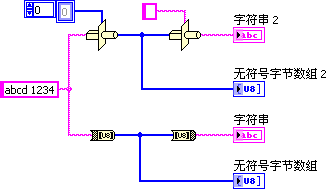
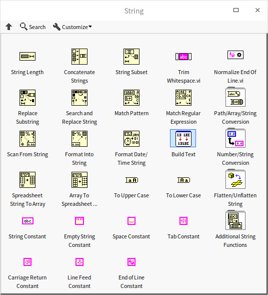
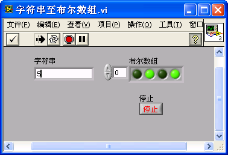
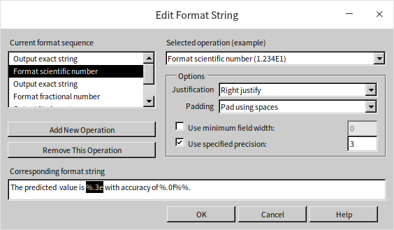
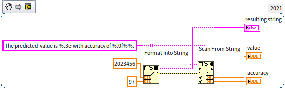
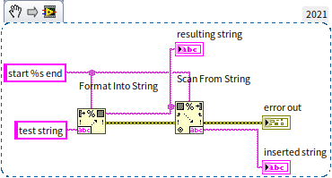
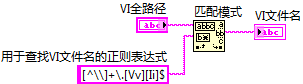
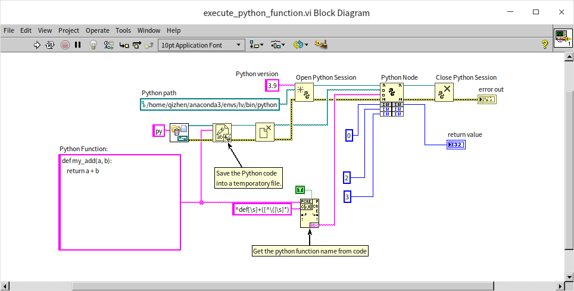
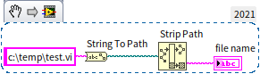
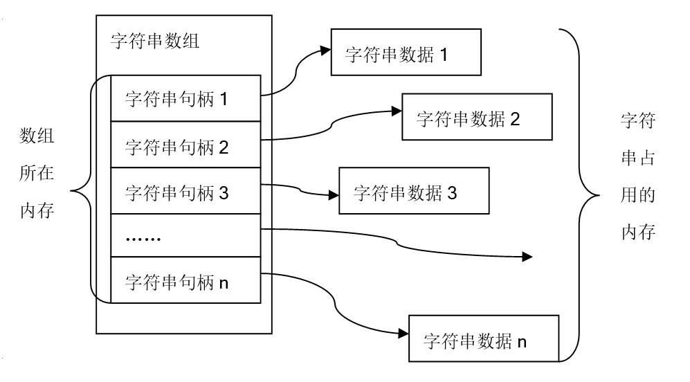

# 字符串和路径数据

## 字符串数据类型

LabVIEW 中字符串的存储方式与 C 语言相类似，都是使用表示法为 U8 的数值数组。二者的区别在于，C 语言中的字符串以字符 "\\0" 作为字符串结束标志，而 LabVIEW 的字符串还记录了长度信息，不需要再使用特殊的结束符。

因为字符串数据在内存中存储数据的方式与 U8 数组相同，所以这两种数据之间的类型转换是有实际意义的。转换成的 U8 数组中每个元素是字符串中每个字母的 ASCII 码，使用十六进制显示字符串时，看到的也是字符串中每个字符的 ASCII 码。不过 LabVIEW 已经提供了专门在字符串与 U8 数组之间转换的函数：“字符串至字节数组转换（）”和“字节数组至字符串转换”，不必使用强制类型转换函数。下图中的两种转换方式是完全等效的。



:::caution

目前 LabVIEW 在 Windows 操作系统下是不支持 unicode 的，关于这个问题的详细信息可以参考 [LabVIEW 的 unicode 问题](appendix_problem) 一节。如果在 LabVIEW 中使用了非英文字母（ASCII 定义之外的那些字符），一定要考虑到，如果换了一个操作系统，比如从中文系统切换到法语系统，或从 Windows 切换到 Linux，这些字符串中的内容很可能就会变成乱码。

:::

## 字符串控件

LabVIEW 的字符串控件除了具有正常的显示方法之外，还提供了另外三种非常有用的显示方式：“'\\' 代码显示”、“十六进制显示”以及“密码显示”方式：


字符串中，有些字符具有特殊含义或无法显示，比如回车、换行等符号。这时，可以使用“'\\' 代码显示”方式，把不能显示的字符用 '\\' 转义代码表示出来。对于使用过文本编程语言的程序员来说 '\\' 转义符不会陌生，C 语言中使用同样的转义符来表示字符串中的特殊字符。在 LabVIEW 中，最常用的转义符就只有 "\\n" 表示换行符、"\\r" 表示回车符、"\\t" 表示制表符、"\\s" 表示空格、"\\\\" 表示 '\\' 等几个。

LabVIEW 与某些设备交互数据，或者读写某些文件时，使用的是字符串类型的数据。但是，这些数据事实上也许并非文字，而是一些数值信息。这种数据在字符串控件上显示出来的是一些毫无意义的空格或符号，就如同在记事本中打开一个 EXE 文件看到的内容一样。其实，用户更希望看到的是数据的数值。此时，就可以选择 "十六进制显示" 方式将数据按数值方式显示出来。

“密码显示”方式方式顾名思义，就是把所有字符都用星号 '*' 来表示，专用于需要输入密码的控件。

组合框（Combo Box）控件的数据类型也是字符串，我们可以利用它来限定用户只能选择某几个字符串。组合框与字符串控件的关系很类似于[下拉列表控件](data_custom_control#枚举型控件与下拉列表控件的比较)与普通数值控件之间的关系。


## 数值、时间与字符串之间的转换

### 基础转换函数

字符串相关的函数主要在“编程 -\> 字符串”函数选板下： 



大部分字符串函数的用法，比如计算字符串长度、合并字符串等，都比较直观，基本上拿来就可以用。下文主要介绍一些稍微有些复杂却又比较常用的函数。

数值和字符串之间经常需要进行转换。通常，数据在进行计算的时候必须使用数值，而显示（比如需要把数据的值嵌入一段说明文字当中）或者存入文件的时候又往往需要以字符串的形式表示。LabVIEW 中有两套数值和字符串之间转换的函数。其中比较容易使用的一套函数位于函数选板“编程 -\> 字符串 -\> 字符串 / 数值转换”上。用户根据所需数据的进制、记数法等要求，选择相应的函数即可。


我们来看一个具体的示例程序：**字符串转换为布尔数组**。程序要求输入一个十六进制的字符，输出一个与十六进制字符等值的 4 位布尔型数组。

这个程序可以分成几部分：第一部分控制输入字符串，只允许出现 0～9，A～F 中的字符；第二部分把字符转成 U8 数据；最后一部分，把 U8 数据的低四位用布尔数组显示出来。这三个部分非常适合分成三个子 VI。但是为了便于演示整个程序，我们把所有代码放在一个程序框图上了：


这个程序中需要注意的是：要选择恰当的数据类型转换函数。程序运行结果如下：



### 字符串格式化

“编程 -\> 字符串”函数选板上还有两个功能更加强大的转换函数：“格式化写入字符串”和“扫描字符串”。这两个函数的功能分别相当于 C 语言中的 sprintf() 和 sscanf()。与上一段介绍的那套转换函数相比，这两个函数可以一次处理多个数据，并且以更丰富的形式表现。但是使用这两个函数需要编程者了解掌握格式字符串语法。LabVIEW 在这里依然借鉴了 C 语言的格式字符串语法，已经了解了 sprintf() 和 sscanf() 函数用法的用户，可以直接套用 C 语言中的用法。

“格式化写入字符串”的功能是把输入的数据，按照用户指定的格式转换成字符串。它通过使用格式化字符串（format string）来指定具体格式。输入字符串有两种：格式字符串和非格式字符串。非格式字符串在输出的时候原样输出；格式字符串是以字符 '%' 打头的字符串，在 '%' 后面跟不同格式字符，用来说明输出数据的类型、形式、长度、小数位数等。格式字符串的形式一般为： % [输出最小宽度] [.精度] [长度] 类型。比如，LabVIEW 中最常用的几种输出格式为：

* %d  有符号十进制整数转换成字符串。比如 %4d 表示如果数据的位数小于4，则左端补以空格，若大于4，则按实际位数转换成字符串
* %u  无符号十进制整数转换成字符串。
* %f  使用十进制记数法把小数转换成字符串。比如 %6.2f 表示转换后的字符串至少有 6 个字符，其中两位是小数部分，如果不足，则左端补以空格
* %e  使用科学记数法把小数转换成字符串
* %g  根据数值大小不同自动选择 %f 或 %e 格式符
* %s  把输入的字符串转格式化输出，也可以设置宽度
* %%  输出一个百分号字符 %

如果记不住这些格式符也不要紧，LabVIEW 提供了一个编辑格式符的对话框帮助用户配置适当的格式符。在“格式化写入字符串”或“扫描字符串”函数的右键菜单中选择“编辑格式字符串”，就会弹出这个对话框，在“选择操作”下拉菜单中挑选所需的数据类型进行配置即可：



“扫描字符串”使用同样的格式化字符串把数据从输入的纯字符串提取出来。比如下面的程序，使用格式化字符串把两个输入数据插入一段字符串，然后在用同样的格式化字符串把数据从生成的字符串中读取回来：



程序运行结果：


但是要注意，如果希望通过“扫描字符串”函数提取一段类型为字符串的数据，可能会发现这个函数没有那么智能。比如运行下面这个程序，会得到一个运行错误信息：



这是因为输入的数据都是字符串，函数也搞不清楚应 %s 应该匹配到哪里。这个问题可以通过下文将要介绍到的正则表达式来解决。


再看一个具体的示例程序：**字符串公式求值**。程序要求输入一个字符串，用于表达一段简单的数学公式，比如“sin (pi (1/2)) + 3\*5 - 2”；以实数形式输出这个公式计算后的值。

这个问题初看起来，与字符串到数值转换，和在 [数值和布尔数据](data_number) 一节讲过的公式 Express VI 以及公式节点等有关，它们都是对一段表达式的计算。但实际上仅仅依靠之前介绍过的知识还不足以解决这个复杂的问题，它不但要把字符串中的数字转换成数值数据，也要把字符串中的运算符转换成相应的计算。并且之前提到的公式 Express VI 和公式节点都只能在程序编辑时设置固定的公式；程序运行后，就只能改变参数，不能再改变公式本身了。

针对这个问题，在动手编写程序之前，我们先调查一下，看是否可以借用 LabVIEW 或他人已经写好的程序，尽量不再重复别人已经完成的工作。我们估计，假如 LabVIEW 自带的函数或 VI 能够完成或部分完成本示例要求的功能，它很可能位于 "数学 -\> 脚本与公式" 函数选板中。打开即时帮助窗口，用鼠标快速浏览一下该选板下的每个条目，看看它们的帮助信息内容是否与示例要求相关。可以看到，“数学 -\> 脚本与公式 -\> 一维二维分析 -\> 字符串公式求值”VI 的功能与示例的要求基本相符，直接把该 VI 拿来用就可以了：


这个字符串公式求值 VI 是可以看到源代码的。有兴趣的读者可以打开该 VI 的程序框图，看看它具体是怎样编写的。这个 VI 的程序对于初学这来说，可能有些过于复杂，本书在 [状态机](pattern_state_machine) 一节将会介绍如何使用状态机实现一个简化版的字符串公式求值功能。

### 时间与字符串之间的转换

日常工作中，更常用的是把时间转换成特定格式的字符串，然后显示出来。“获取日期 / 时间字符串”函数可以把时间转换成系统默认的显示格式。需要更复杂的表达形式时，可以使用“格式化日期 / 时间字符串”函数。

反过来，并没有一个通用的简易函数可以把表示时间的字符串转化为时间数据类型。这是因为用字符串表示时间的方式多种多样，必须针对不同的情况分别处理。只能使用“扫描字符串”函数，设置好格式字符串，把特定字符串中的数值提取出来，换算成时间。


时间与字符串之间转换所用的格式转换字符是 LabVIEW 扩展出来的，在 C 语言中并没有对应的格式转换字符，C 语言一般直接使用数值类型数据来表示时间。


## 正则表达式

在程序中，经常会遇到在一大段文字中查找一小段字符串的情况。如果需要查找的是具体的某一串字符，比如在一篇文章中找到所有的单词“dog”，可以使用“查找替换”（Search and Replace String）函数。但更多的时候，需要查找的并不是一段确切的文字，而是符合某一模式的字符串。比如，需要从一段 C 语言的程序中找出所有的函数名，或者变量名等。当然，我们可以编写一段复杂的程序，来检查输入文本中，每一个单词是否是函数名、是否是变量名等。编程的代码量还是比较大的，但是 LabVIEW 也提供了一种快捷的方案，这就是正则表达式。正则表达式(Regular Expression)是一种文本模式，包括普通字符（英文字母和数字等）和特殊字符（称为“元字符”）。正则表达式使用这些字符串来描述和匹配某个句法规则的字符串。正则表达式比较繁琐，但它功能强大，学会之后可以极大提高工作效率。不仅仅是编程，笔者在编辑文档时，也常常需要用正则表达式去查找所有需要编辑的内容。比如，本书的原稿是使用了 Markdonw 格式的文本格式编写的，Markdonw 格式中的图片的格式定义为：``。如果笔者需要找出文档中所有的插图的文件路径进行修改，那么也就是需要匹配所有的叹号，后面跟着中括号，后面又跟着小括号，然后提取出小括号内，双引号之外的内容。要实现这样的功能，除了编程也就只能依靠正则表达式了。

LabVIEW 提供了两个基于正则表达式的字符串匹配函数：“匹配模式”和“匹配正则表达式”函数。“匹配模式”函数功能较为简单，但运行速度快；“匹配正则表达式”则是为了更强大的功能牺牲运行速度。对于简单的问题，比如找出一段文字中所有的数值，所有括号中的内容等，就可以使用“匹配模式”来完成。比如下面这个程序，它可以把输入文字中的所有数值都提取出来。因为数值可能不止一个，所以需要采用循环，每次匹配到一个数值时，取出这个数值，然后再继续搜索后续的文字。


上图程序的运行结果是一个数组：`[33, 0.95]`。它采用了正则表达式 `[0-9]+[.]?[0-9]*` 来进行匹配。其中 `[0-9]` 表示需要匹配一个 0 到 9 之间的数字字符；`+` 表示一个或多个字符；`[0-9]+` 合并起来就表示要匹配一个或多个 0 到 9 之间的数字字符，也就是匹配一个整数；`[.]` 表示一个小数点，也可以使用 `\.` 表示小数点；`?` 表示0 或 1 个字符；`[.]?` 合并起来就表示有或没有小数点； `*` 表示 0 或多个字符； `[0-9]*` 合并起来就表示要匹配零个或多个 0 到 9 之间的数字字符，也就是如果有就匹配小数部分。

“匹配模式”函数，会从输入字符串的第一个字符开始，一个一个与正则表达式进行匹配。字符串前半部分都是因为字母和空格，无法与正则表达式匹配上，直到遇到 "33"，这两个数字与 `[0-9]+` 相匹配。当遇到 "33" 之后的空格时，无法再与正则表达式匹配上，于是，一次匹配结束。“匹配模式”函数返回匹配到的 "33"，同时也会返回它之前的所有字符，以及它之后的所有字符以方便后续操作。

`[0-9]+[.]?[0-9]*` 是一个简化的匹配小数的正则表达式，有些情况它可能处理不好，后文会给出一个更精确的匹配。

再看一个示例，假设输入是一个合法 Windows 系统下的 VI 文件的路径，我们需要得到这个 VI 的文件名。编写好的程序如下：



运行结果： 


用于用于匹配 VI 文件名的则表达式是：`[^\\]+\.[Vv][Ii]$`。其中 `\\` 表示匹配一个反斜杠，因为反斜杠在正则表达式中是一个特殊字符，所以要匹配输入字符串中的反斜杠需要使用两个反斜杠；`[^\\]` 表示除了反斜杠之外的任意字符，用于反斜杠被用作 Windows 系统下的路径分隔符，所以我们知道，文件名必须是输入路径最后一个反斜杠之后的文字内容；`[Vv]` 表示匹配大写 V 或小写 v 中的任意一个字符；最后一个 `$` 表示这个匹配必须是在输入字符串的结尾部分，加入输入的文件名是 "abc.vim"，在匹配了 "abc.vi" 之后还有一个字母 "m" 无法被匹配，那么这次的正则表达式匹配就失败了。这样一来，如果输入字符串的末尾是 "abc.vi" 或 "TEST.VI" 等，都可以被找出。而 "data.txt", "template.vit" 之类的文件名则不满足匹配要求，不会被找出来。

下表列出了正则表达式中常用的字符和用法：

| 字符 | 描述 |
| ---- | -------------- |
| `\` | 将下一个字符标记为一个特殊字符、或一个原义字符、或一个向后引用、或一个八进制转义符。例如，`"n"` 匹配字符 "n"，但`"\n"` 匹配一个换行符；`"\\"` 匹配 "\\"； `"\("` 匹配 "("。 |
| `^` | 匹配的字符串必须是从输入字符串的开始位置起始。 |
| `$` | 匹配的字符串必须是在输入字符串的末尾位置结束。 |
| `*` | 匹配前面的子表达式零次或多次。例如，`"fo*"` 能匹配 "f" 或 "fo" 或 "foo"。等价于 `"{0,}"`。 |
| `+` | 匹配前面的子表达式一次或多次。例如，`"fo+"` 能匹配 "fo" 或 "foo" 但不能匹配 "f"。 等价于 `"{1,}"`。 |
| `?` | 匹配前面的子表达式零次或一次。例如，`"fo?"` 能匹配 "f" 或 "fo"。 等价于 `"{0,1}"`。 |
| `{n}` | n 是一个非负整数。匹配确定的 n 次。只能在“匹配正则表达式”函数中使用。例如，`"fo{2}"` 能匹配 "foo" 但不能匹配 "f" 或 "fo"。 |
| `{n,}` | n 是一个非负整数。至少匹配 n 次。只能在“匹配正则表达式”函数中使用。例如，`"fo{2,}"` 能匹配 "foo" 或 "fooooooo"。`"o{1,}"` 等价于 `"o+"`；`"o{0,}"` 等价于 `"o*"`。 |
| `{n,m}` | m 和 n 均为非负整数，其中n<=m。最少匹配 n 次且最多匹配m次。只能在“匹配正则表达式”函数中使用。例如，`"fo{1,3}"` 能匹配 "fo" 或 "foo" 或 "fooo"。`"o{0,1}"`等价于 `"o?"`。 |
| `?` | 当 `?` 紧跟在任何一个其他限制符（`*`, `+`, `{}`）后面时，匹配模式是非贪婪的。非贪婪模式尽可能少的匹配所搜索的字符串，而默认的贪婪模式则尽可能多的匹配所搜索的字符串。例如，对于字符串 "oooo"，`"o+?"`值匹配一个 "o"，而 `"o+"` 将匹配所有 "o"。 |
| `.` | 匹配除换行符之外的任何单个字符。要匹配包括换行符在内的任何字符，需要使用 `"(.|\n)"`。 |
| <kbd>x&#124;y</kbd> | 匹配 x 或 y。只能在“匹配正则表达式”函数中使用。例如，<kbd>"a&#124;view"</kbd> 能匹配 "a" 或 "view"； <kbd>"(a&#124;v)iew"</kbd> 匹配 "aiew" 或 "view"，等价于 `"[av]iew"`。 |
| `[xyz]` | 匹配中括号内的任意一个字符。例如，`"[abc]"` 可以匹配 "a" 或 "b" 或 "c"。 |
| `[^xyz]` | 匹配匹配中括号内未包含的任意字符。例如，`"[^abc]"` 可以匹配 "f" 或 "g"。 |
| `[a-z]` | 匹配指定范围内的任意字符。例如，`"[a-c]"` 可以匹配 "a" 或 "b" 或 "c"。 |
| `[^a-z]` | 匹配任何不在指定范围内的任意字符。例如，`"[^a-e]"` 可以匹配 "f" 或 "g"。 |
| `\b` | 匹配一个单词边界，也就是指单词和空格间的位置。例如，`"\blab"` 可以匹配 "labview" 中的 "lab"，但不能匹配 "collaborate" 中的 "lab"。 |
| `\cx` | 匹配由 x 指定的 ASCII 控制符。例如，`"\cJ"` 匹配一个换行符。 |
| `\d` | 匹配一个数字字符。等价于 `"[0-9]"`。 |
| `\D` | 匹配一个非数字字符。等价于 `"[^0-9]"`。 |
| `\f` | 匹配一个换页符。等价于 `"\x0c"` 和 `"\cL"`。 |
| `\n` | 匹配一个换行符。等价于 `"\x0a"` 和 `"\cJ"`。 |
| `\r` | 匹配一个回车符。等价于 `"\x0d"` 和 `"\cM"`。 |
| `\s` | 匹配任何空白字符，包括空格、制表符、换页符等等。等价于 `"[\f\n\r\t]"`。 |
| `\S` | 匹配任何非空白字符。等价于 `"[^\f\n\r\t]"`。 |
| `\t` | 匹配一个制表符。等价于 `"\x09"` 和 `"\cI"`。 |
| `\w` | 匹配包括下划线的任何单词字符。等价于 `"[A-Za-z0-9_]"`。 |
| `\W` | 匹配任何非单词字符。等价于 `"[^A-Za-z0-9_]"`。 |
| `\xn` | n 是一个十六进制数值，匹配 n 对应的 ASCII 码字符。例如，`"\x41"` 匹配 "A"。 |
| `\n` | n 是一个八进制数值，匹配 n 对应的 ASCII 码字符。例如，`"\101"` 匹配 "A"。 |

熟悉正则表达式的读者可能已经发现了，LabVIEW 的正则表达式规则缺少了预查匹配。假如我们需要处理这样一个问题：查找一篇文字中出现的所有 LabVIEW 的版本号，比如，在字符串 "In 2022, we have LabVIEW 2018 and LabVIEW 2020 in lab 4." 中，我们需要提取出 "2018" 和 "2020"。针对这个问题，我们需要找到单词 "LabVIEW" 后面跟着的数字，而又不需要单词 "LabVIEW" 本身。如果有预查匹配，我们可以使用正则表达式 `"(?<=LabVIEW\s)20[0-9]{2}"` 匹配到所有的版本号。LabVIEW 不支持预查匹配，那么我们可以进行嵌套匹配，比如，第一步，使用正则表达式 `"LabVIEW\s20[0-9][0-9]"` 找出 "LabVIEW" 和后面的版本号；第二步，再使用 `"20[0-9][0-9]"` 匹配第一步的结果，把所需的版本号提取出来。幸运的是，我们不需要自己编程做嵌套，“匹配正则表达式”函数可以帮我们做嵌套匹配，把需要嵌套匹配的部分放在小括号内，就可以以把嵌套匹配到的数据作为子匹配结果输出出来。比如，上述的的要求可以使用下图的程序来实现：


另一个示例是笔者在[调用 Python](external_connectivity) 代码时，需要找到 Python 代码中的函数名。Python 中函数的定义使用的是关键字 def，查找函数行的程序如下：



匹配函数名的正则表达式是： `"^def[\s]+([^\(\s]*)"`。其中，匹配开始的 `"^"` 表示 "def" 必须出现在一行的最开始，小括号中的内容，找到一段 "def" 之后，不包含括号和空格的字符串，就是所需的函数名。在这段程序中，“匹配正则表达式”函数的“multiple?”（多行）参数被设置为“真”，表示要对每一行都进行匹配，因为函数的定义可能不是在输入文字的第一行。 

此外，还有一些常用的正则表达式，读者可以尝试一下。比如，匹配电子邮箱地址 `"^[a-z0-9_\.-]+@[\da-z\.-]+\.[a-z\.]{2,6}$"`；匹配无符号的小数 `"([1-9]\d*\.?\d*)|(0\.\d*[1-9])"`。


## 路径

### 路径数据

路径是 LabVIEW 特有的数据类型。在文本编程语言中，一般直接使用字符串来表示路径。这种看似简单的做法给跨平台带来了麻烦：因为每种操作系统使用的路径分隔符都不尽相同。比如，Windows 使用反斜杠 "\\" 作为路径分隔符；Linux 使用正斜杠 "/"；Mac OS 使用冒号 ":"。使用同一字符串来表示路径是不可能适用于所有平台的。

LabVIEW 是跨平台的编程语言，为了解决这个问题，LabVIEW 使用专门的数据类型来表示路径。LabVIEW 中，路径数据类型所记录的信息包含两部分：一是路径的种类，是相对路径还是绝对路径；二是以字符串数组的形式来记录路径数据。数组的元素按顺序记录下路径从根到分支每一级的名字。至于分隔符，是在显示路径时，根据不同系统添加上去的。这样一来，路径数据在各个平台下都是有效的。

### 相对路径

在程序中使用路径数据的时候，应当尽量使用相对路径。这样，当程序位置发生变动时，比如，程序生成为.exe 文件或者被拷贝到另一台计算机上之后，程序不至于找不到相应的文件。

如果程序需要读写某一文件中的数据，可以把该文件放在程序主 VI 同一路径下，程序中记录的是该文件的相对路径（）。以后每次程序运行，先调用 "当前 VI 路径" 常量，得到主 VI 的位置，再与记录的相对路径合成该数据文件的全路径。如果主 VI 位于 C 盘根目录下，文件名为 main.vi，则主 VI 的当前路径是 C:\\main.vi，文件的路径即为 C:\\data.txt。


有关路径的各函数及常量均位于“编程 -\> 文件 I/O”子选板。

### 路径常量

LabVIEW 提供了一些路径常量（下图），作为使用相对路径的基准。比如在上例中，以程序主 VI 为基准，记录相对路径，所以在程序的主 VI 中使用了 "当前 VI 路径" 常量来得到当前 VI 的位置。若主 VI 所在的路径发生了变动，这个常量的值也会随之变化。


### 路径与其它数据类型的转换

与路径转换相关的转换函数都位于函数选板 "编程 -\> 文件 I/O-\> 高级文件函数" 上。最常用的是路径与字符串类型之间转换的两个函数："路径至字符串转换" 和 "字符串至路径转换"。

另外，前文提到，路径数据内部包含两部分信息：一是路径种类，二是每级文件夹名字组成的字符串数组。可以使用 "路径至字符串数组转换" 和 "字符串数组至路径转换" 函数在路径与字符串数组这两种数据之间转换。

"引用句柄至路径转换" 函数可以从文件的引用句柄中得到文件路径信息。比如，可以利用这个函数，可以把“打开/创建/替换文件”中各函数输出的句柄转换为路径，还可以得到 TDMS 文件的路径。但由于 LabVIEW 中对每种文件的打开机制不一样，这个函数并不适用于 LabVIEW 文件类型。例如，不能用它得到 LabVIEW 中使用“打开配置数据” VI 打开的 INI 文件的路径。

:::caution

字符串与路径之间的转换是与操作系统相关的，因为不同操作系统使用的路径分隔符不同。上文介绍正则表达式时使用了一个示例是从一段路径中得到文件名，比如，从 "c:\\temp\\test.vi" 中提取 "test.vi"。如果是在 Windows 系统下，还可以使用下面的程序：



但是这个程序在 Linux 系统下是无法得到正确结果的，因为 Linux 不用 "\\" 作为路径分隔符。若考虑支持多操作系统，可能还是需要使用正则表达式匹配文件名。

:::


## 数据平化

数据平化，也被称为数据序列化，是指把原本结构化的，有多个层次的数据，转换为单一层次的一段连续的数据。这主要是为了便于在内存或硬盘设备中 [存储数据](pattern_file)，以及通过网路传输数据。
大多数简单数据类型、数值数组等的数据在内存中是以平化的方式存储的。换言之，它们的数据存储在一整块连续的内存中。

那些在内存中原本就是以平化方式存储的数据，才可以使用强制类型转换函数。强制类型转换函数默认的目标类型是字符串型，一般的简单数据类型（字符串和 U8 数组除外）强制转换成字符串等同于使用 "平化至字符串" 函数对数据平化。由于这些数据在内存中原本就是平化存储的，强制转换成字符串并未改变它们原来的任何数据，只是换用以字符串的形式把内存中的数据表示出来。

复杂的数据类型，强制类型转换成字符串与平化至字符串相比，会缺少一些数据类型的信息，而数据内容部分是相同的。比如把一个数值数组平化至字符串后，字符串内包含的信息有数组长度以及数组中的数据；而强制类型转换成字符串，字符串内只有数组数据的信息。

### 数据平化至字符串

用 LabVIEW 编写和运行程序时，不同的数据以不同格式保存在内存中。数值、字符串等简单数据类型的数据被保存在一段连续的内存空间中。

有些数据类型则不然。如字符串数组，在数组中记录的是按顺序排列的每个元素字符串的句柄，句柄指向另外的某一块内存，那里才真正保存着字符串的内容。这种数据结构通常被称为树状结构：



如果需要把所有的数据都保存至硬盘，或者需要把数据通过接口传递到其它计算机或硬件设备上（比如通过 TCP/IP 协议把一个字符串数组传递到其它电脑上、通过串口线把这个数据传递到外设上等），则必须把原本以链表、树状等表示的数据规整成一块连续的数据，再进行保存、传递。把一个数据转换成这种连续连贯的表达方式的过程，叫做 "平化"。比如，对字符串数组进行平化的结果是，其在内存中的树状结构变成了一块连续的平整内存。

函数 "编程 -\> 数值 -\> 数据操作 -\> 平化至字符串" 可以把任何数据类型平化，不论它是否原本就是 "平" 的。它的输出结果是一个字符串，这个字符串表达的并非是一段有意义的文字，而是以字符串方式表达的一块连续内存中的数据。按字面是无法理解这个字符串数据的。但是，当需要保存数据，或者与其它设备、程序等进行数据交换时，将数据平化是一个可以选择的方案。被平化的数据可以极其方便地直接存盘或传输。

被平化的数据可以通过 "从字符串还原" 函数，回复为原来的数据类型。

在函数选板 "编程 -\> 簇、类与变体 -\> 变体" 中，有两个类似的函数，用于在变体与平化字符串之间转换。但是这两个函数专用于处理变体类型，所以并不常用。

### 数据平化至 XML

数据平化后的字符串是无法直接理解的信息，这是其不利的一面。在有些应用场合，需要人工直接打开一个数据文件进行阅读，或者直接监视传输过程中数据的内容，就不能使用平化数据了。既要平化，又需直接阅读，可以使用平化至 XML 方法。XML 的全称是可扩展标记语言（Extensible Markup Language）。它的特点是给文本加入了一些解释这些内容的标签。比如下面这行 XML 文本：

```xml
<data label="输入值" type="DBL">34.2</data>
```

这只是用于演示的一段文字，并不是 LabVIEW 直接生成的。它的主题内容是"34.2"。同时，它给"34.2"加了一个名为" 数据 "的标签，表示"34.2"是一个数据。标签被放在尖括号"<\>"内。XML 中的标签都有一个起始标签和一个结束标签。起始标签以标签名开头，这里是" 数据 "；结束标签中的内容是斜杠"/"加标签名。起始和结束标签之间的内容是标签标识的内容。而数据这个标签还有两个属性：" 标题 "和" 类型 "，每个属性都有一个值。这两个属性表明这个数据的标题是" 输入值 "，类型是"DBL"。

用人类的自然语言来表达一个数值的含义，说明它的名字、类型是什么，可以有很多种方法。但自然语言过于灵活，所以计算机直接分析自然语言是有一定难度的。而 XML 则规定了一套较为规范的、用标签来表达某一数据含义的方法。有了规范的定义，计算机就可以按照固定的方式来解释一段文本信息了。

“编程 -\> 文件 I/O-\>XML-\>LabVIEW 模式 -\> 平化至 XML”函数可以把任何一个类型的数据以 XML 文本的方式表达出来。“从 XML 还原”函数是其反过程。下图中的程序把一个数值平化成一段 XML 文本。


数值平化得到的 XML 文本：


LabVIEW 平化出来的 XML 文本的标签使用的是英文，但都是比较简单的词语，稍微有些英文基础的用户都可以很快理解这些标签的含义。比如本例中，DBL 标签是数据最外层的标签，表明这是一个 DBL（双精度实数）类型的数据。Name 标签表明数据的名字是 "某数值"；Val 标签表示数据的数值是 12.3。

由于 XML 具备可被人和机器共同理解的优点，它已经被广泛的应用于网络、数据库等众多领域。我们在编程时，遇到需要把数据保存成文本文件，或者以文本方式传输时，可以考虑把数据转换成 XML 格式。

XML 文本的缺点是效率较低。因为把数据转为 XML 格式后，增加了很多标签。这些标签会占用额外的存储空间，解析标签也会增加程序的运算负担。对于空间效率和运行效率要求较高的程序不适合使用 XML 格式的数据。

### 数据平化至 JSON

XML 的功能极其强大。XML 标准的制定者为它设计的功能可能过于复杂了一些，以至于绝大多数的使用者都仅仅只需要 XML 的一小部分功能。LabVIEW 用户使用到 XML 的时候基本上也只是用它把一些并不算太复杂的数据转换为人眼可以直接识别的文本，XML 的 DTD、XSD、XPath、XSLT等一大堆复杂的规范根本使用不到，但这些复杂规范的存在却大大增加了 XML 的复杂度和使用成本。因此，在 XML 标准推出 6 年之后的 2002 年，一些 JavaScript 程序员设计了 JSON 数据格式，用于在某些应用中取代 XML。JSON 是 JavaScript Object Notation 的缩写。JSON 之后很快就被纳入了 ECMA (European Computer Manufacturers Association) 组织定制的 JavaScript 语言的标准。时至今日，JSON 的应用已经远比 XML 的应用更加广泛，几乎所有的编程语言都已经支持 JSON。

JSON 的格式非常简单：数值数据直接以文本的方式写出；字符串数据用双引号表示；数组用方括号表示；簇用花括号表示。比如下面这个示例：


程序结果：


JSON 的效率高于 XML，在数据平化时应当尽量选择使用 JSON。不过目前 LabVIEW 对于 JSON 的支持似乎还不够好，有些数据无法被直接平化为 JSON 格式，在这种情况下就只能使用 XML 格式了。


## 练习

* 有两个数组常量，它们都是字符串类型的一维数组，每个数组中都存放了一些小朋友的名字。编写一个 VI 把所有小朋友的名字合并到一个数组中，并且按照字母顺序排序。
