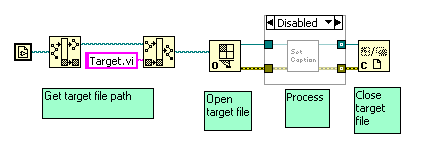
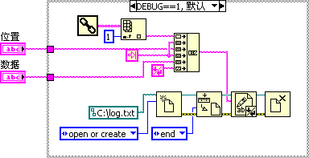

# 其它查找程序错误的工具和方法

除了断点和探针这两种最常用的调试工具外，调试中还常常需要借助一些其它的工具和方法，以寻找到程序的问题所在。

调试有错误的程序，首要任务是要找到错误所处的部位。在大多数场合，可以在程序执行过程中使用探针一路跟踪数据的变化。如果某个节点的输出数据与预期的不一致，这个节点很可能就是问题所在之处。但在某些情况下，靠这种简单方法是无法找到错误所在之处的。

比如，程序运行中出现了数组越界的错误。但程序往往并不是在错误发生之处就立即表现出异常，而在程序又运行了一段不确定的时间之后，突然崩溃或报错。而且，每次调试时，程序报错、或者崩溃处所可能都不在同一处。或者，虽然找到了最终出错的代码处，但发现它是个最基本的LabVIEW节点，不能再进入节点内部调试了。而且，这个节点出错的可能性基本为零，错误肯定是在其它地方产生的。

再比如，有些错误是由于多线程的时序引起的。为程序添加断点或探针会改变程序的时序，导致程序调试时结果正常，而正常运行时，结果却错误。

## 程序框图禁用结构

在断点和探针派不上用场的时候，可以采用这种思路查找程序故障：先把一部分代码移除，再看看程序运行是否还有问题。如果一切正常了，说明被移除的代码中存在错误。否则，问题应当出在没有被移除的那部分代码中。这样，就缩小了查找可能存在问题代码的范围。然后，在有问题的那部分代码中，把怀疑有问题的代码再移除一部分，再重复上述的检查过程。这样，就可以一步一步缩小查找的范围，最终定位到出错的位置。

使用这个方法需要反复地把某些代码移除出程序，然后再放回程序。使用程序框图禁用结构（在第3.3节中已经介绍过程序框图禁用结构）可以大大方便这一调试过程（图 8.15）。程序框图禁用结构的用法类似于C语言中用来做注释的关键符号"/\*   \*/"或者"//"。在C语言中经常把疑似有问题的代码注释起来，确认没有问题，再取消注释。LabVIEW中也可以这样做。把疑似有问题的代码放在程序框图禁用结构的禁用页面中。确认没有问题，再把代码所在的页面重新设为启用就可以了。

图 .15禁用被怀疑有问题的子VI

## 使用消息对话框和文件

有的时候，某种错误只在程序正常运行时出现，但试图暂停或使用断点、探针等调试工具时，错误却消失了。有的时候，程序运行必须关闭所有的调试信息，或者出错的代码部分不允许使用LabVIEW的调试环境（比如代码运行在LabVIEW RT设备上）。在不能使用LabVIEW调试工具的情况下，调试起来就麻烦多了。对于这一类程序，可以采用其它方法来观察程序运行过程中的数据。比如，让数据通过弹出对话框显示出来，或者把数据记录在文件中。通过观察被显示或记录下来的数据，判断程序是否有错。

图 .16把程序中的数据记录下来

图 8.16是一个使用文件记录程序运行中临时产生的一些数据的例子。假设这个VI不能使用LabVIEW调试工具，但它通过调用"数据记录.vi"就可以把程序运行中重要的数据了记录下来。待程序运行结束，便可以在记录的文件中查阅这些数据。

图 .17数据记录.vi的程序框图

"数据记录.vi"可以根据自己的需求定义。例如，可以使用图 8.17中的实现方法。在每次调试程序时，把调用它的VI，和传入的数值写入一个指定的文本文件中。
