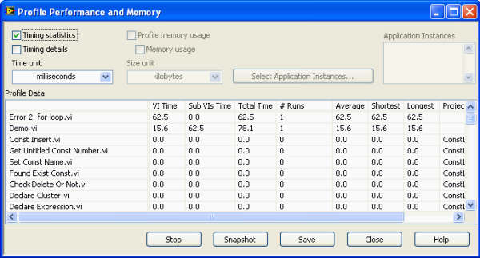
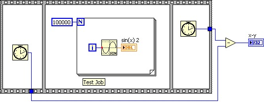
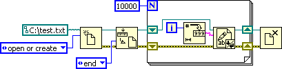
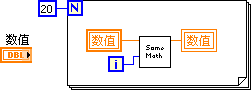

# 提高程序运行效率

调试程序除了要找出程序中的错误之外，有时其目的是在于提高程序的效率，也可能是为了找出程序中潜在的危险，比如内存泄漏等。

## 找到影响程序运行速度的瓶颈

想要提高程序的运行效率，首先要找到影响程序运行的瓶颈在哪里。LabVIEW程序的运行也符合80
/
20定理：20%的程序代码占用了80%的运行时间。如果能找到这20%的代码，加以优化，就可以达到事半功倍的效果。

对于已经编写好的程序，可以通过性能和内存信息工具来查看程序中每个VI运行了多长时间。对程序的效率进行优化，要从最耗时的VI着手。性能和内存信息工具可以从LabVIEW的菜单项"工具-\>性能分析-\>性能和内存"中启动。图
8.30显示的是这个工具的界面。

图 .30性能和内存信息显示

这个工具可以记录程序运行过程中，每个子VI所花费的CPU时间及占用的内存。具体使用方法如下：在运行一个程序之前，先按下"性能和内存信息显示"工具界面上的"开始"按钮，工具就开始为所有在内存中的VI进行统计了。在程序运行结束后，点击工具上的"快照"按钮，工具就会按照"VI时间"降序排序，显示出在刚才的运行中，每个子VI占用了多少CPU时间。排在最前面的几个VI是最耗时的，也就是程序的瓶颈，是需要重点优化的对象。

某个子VI占用了大量CPU时间，有可能是因为它内部的运算较为复杂。那就需要打开它，对它的算法进行优化。但更有可能的是因为这个子VI被执行的次数太多。这时，就要考虑程序结构了。看一看是否可以减少这个VI的运行次数：比如，把它从某些不必要的循环中挪出去；或者拆分这个VI的代码，把没有必要循环执行的部分分离出去，挪到循环体外面。

并不是所有的运行效率问题都可以在性能和内存信息工具中体现出来的。"VI时间"列出的只是VI的CPU占用时间。如果程序里存在大量的不必要的延时，或者程序常常被某些低速工作（如读写外部仪器，通过网络传输数据等）所阻塞，这样的程序运行速度肯定也是很慢的。但是，这一类的低效率因素在性能和内存信息工具上是体现不出来的。有些非常耗用CPU的操作，在性能和内存信息工具上也无法体现。比如，线程切换、内存开辟等操作，虽然耗时。但却不会在工具中显示出来。含有这些内容的程序段到底运行了多少时间，需要使用其它的方法来查看。

## 查看一段代码的运行时间

在调试或者测试一段程序的时候，有时用户更关心的是一段程序到底运行了多少时间。这里所指的时间不同于程序所消耗的CPU时间，而是指程序运行一遍直观的耗时。通常，编写一段简单程序就可以完成这个工作了。使用一个顺序结构，在被测程序开始前，记录一下当时的时间，程序运行结束，再查看一下当时的时间，其差值就是程序运行的时间（如图
8.31所示）。

图 .31一种查看程序运行时间的方法

更简单一点，仅使用一个时间顺序结构也能完成同样的工作（如图
8.32所示），其"全局结束时间"（Frame Duration）输出 与图
8.31中的x-y含义相同。

图 .32使用时间顺序结构查看程序运行时间

这两种方法的最高精度都是1毫秒，更短的时间就测不了了。使用时间结构时需要注意，时间结构可能会改变其内部程序运行的线程。这样一来，使用它，可能会影响程序运行的时间。

在多核CPU的计算机上，程序可以在多个CPU内核上同时执行。某些子VI虽然占用的大量的CPU时间，但如果程序线程设置合理，是可以让这些VI不影响到程序的整体效率的。

## 解决程序效率低下的瓶颈

仅仅使用性能和内存信息工具还是不能发现所有的程序效率问题的。并且一旦程序的主体部分已经完成，要再对其进行修改，成本就比较高了。尤其是涉及到结构性的改动时更是如此。构建在这个模块之上的代码需要作相应更新，以前做过的测试需要重新再做一遍。如果时间紧迫，同时考虑到这种代码改动所带来的风险，在程序完成后可能就无法再对其性能进行优化了。

为了最有效地编写出高效率的程序，在设计程序结构的时候，就需要考虑到可能会影响程序效率的所有因素，直接设计出高效率的程序。而不是在程序完成后，再回头查找程序瓶颈。如果暂时做不到这点，了解一下程序容易出现效率低下的地方，至少可以帮助调试人员在调试程序时尽快找到问题所在。

下面讨论的是一些常见的运行速度比较慢的程序代码部分。程序运行效率的瓶颈很可能就出现在这些部分。所以在设计程序时，对这些部分要格外注意。

## 读写外设、文件

相对于计算机的中央处理器、内存读写的速度而言，计算机外围设备的处理和传输数据的速度是非常慢的。比如，GPIB的传输速率最高也只有1Mbps，比内存的传输速率低了两个数量级以上。在一个测试应用软件中，造成整个系统效率低下的瓶颈很可能就处在这类数据传输当中：程序的大部分时间都消耗在等待外部数据上了。

这些设备的速度是不可能通过优化程序来加以提高的。但是可以考虑在程序读写外设、文件的同时，同步处理一些其它的运算。这样，不至于让这部分工作耽误整个程序的运行。

另一个提高程序效率的方法是通过优化程序结构，减少对外设和文件的访问次数。以写文件为例，图
8.33中的程序把一万个字符串依次写入文件。

图 .33低效率的文件写入方式

这段程序效率非常低下，它最耗时的部分是打开、关闭文件操作。并且，打开关闭了文件一万次。运行这段代码，在配置较高的计算机上仍需要耗时2秒多。其实，完全没有必要在每次写入文件内容时都打开关闭文件一次。如图
8.34所示，完全可以把打开关闭文件的操作放到循环外完成。

图 .34改进的文件写入方式

经过优化，完成同样的写入文件操作只需要60毫秒。这个程序中，运行了一万次写文件操作。由于操作系统已经针对写文件进行了优化，实际上并不是每次调用这一函数都会真正往硬盘上写数据的，而往往是在关闭文件的时候才真正去写硬盘。这也是图
8.33的程序速度非常慢的原因之一。不过，这个程序还可以进一步优化，以减少写文件的操作次数。

图 .35高效率的文件写入方式

在图
8.35这段被优化的程序中，所有的文件操作函数都只被调用了一次。执行这段代码只需要耗时30毫秒。

## 界面刷新

界面刷新会消耗大量的运算资源。此外，界面刷新过快并不会给用户带来任何好处。一个界面至少要停留几百毫秒，用户才能够看清楚它。如果以很高的速度更新界面上的某个控件的值，比如，以每秒一百次的速度刷新一个数值控件，由于数值变化太快，飞速闪动，用户是根本看不清楚控件里出现的数据的。所以，界面刷新的次数应当减少到适当的程度，以降低程序运算量。

比如，在采集数据的同时，需要在程序界面上以波形的方式显示数据。假设程序以每秒钟1000次的速度读取数据采集设备，每次读取20个数据。在用波形显示数据时，完全没有必要在每次采集数据后都刷新显示。而可以每采集100次，即每0.1秒钟才刷新屏幕一次。而每次刷新屏幕时，也没有必要把新采到的2000个数据都显示出来。要知道，在程序运行中，用户是来不及看清2000个数据的细节的。可以对这两千个数据重采样，用10数据代表它们就可以了。

有些界面刷新可能并不是在编写程序时，编程者有意识设定的。比如图
8.36中的程序，用于在"树形"控件显示出多条信息。它由一个总条目和300个子条目组成。

图 .36低效率设置树形控件的方法

程序中有一个循环框，迭代300次，每迭代一次，为树形控件添加一个条目。程序在运行时，每添加一个条目，属性界面都会刷新显示一次。树形控件刷新是比较慢的，因此这个程序效率非常低。幸运的是，树形控件还提供了一个方法，可以把所有要添加的条目一次性传递给树形控件。这样，树形控件在程序运行过程中只需刷新一次，效率大大提高。程序框图如图
8.37所示。

图 .37高效率设置树形控件的方法

有些控件并不提供树形控件那样的一次性改变所有数据的方法。比如说，程序需要修改一个波形图控件上每条曲线的属性，为此不得不使用一个循环框，每次迭代时，修改一条曲线的属性。但每修改一次波形图曲线的属性，波形图就会自动刷新一次。对于程序而言，这一些刷新其实毫无用处，又得占用大量的计算机资源。其实，遇到这种情况也有办法可以减少界面刷新次数。VI的前面板有一个属性是"延迟前面板更新"。在有界面更新操作的代码前，将这一属性设置为"真"。其后，代码在运行时，界面就不会被更新了。直到所有更新操作都完成，再将"延迟前面板更新"设置为"假"，这使得VI针对刚才所有的操作更新一次界面（图
8.38）。程序效率大大提高。

图 .38设置波形图上每条曲线的属性

## 循环内的运算

设计循环的时候总是要格外小心。即便一段代码运行得再快，一旦让它循环几千几万次，甚至几百万次，耗费的时间就不可忽视了。所以，越是执行次数多的循环，其内部代码的效率对整体影响就越大。图
8.33、图
8.34所示的例子就是把能够减少调用次数的代码都移至循环体外，提高了程序的运行效率。

除了文件的读写外，对硬件设备进行的各种操作也会遇到类似的问题。一个测试程序可能需要多次设置或读取仪器或数据采集设备的数据。但打开和关闭硬件设备的操作不需要进行多次，应该在测试程序一开始就打开所有硬件设备，在测试结束后再统一关闭所有设备。

图
8.39所示程序中的问题，在LabVIEW的初学者中也是比较容易出现的。有文本语言编程经验的程序员习惯于把循环内每次迭代运算的结果记录到变量中，下次迭代从同一变量中再读出数值。

图 .39在循环内读写局部或全局变量

而对LabVIEW语言而言，迭代间的数据传递应该通过移位寄存器进行。对全局或局部变量的读写可以移至循环外（图
8.40），这样就节约了多次读写全局或局部变量的时间。

图 .40将读写局部或全局变量移至循环外

## 调试信息

默认情况下，VI中除了保存有程序代码，还保存有用于帮助调试VI的一些必要数据和代码。这些用于帮助调试的数据和代码被称为调试信息。

调试信息对于已经生成可执行文件或动态链接库的程序是没有意义的，因为LabVIEW在把VI转换成可执行文件的时候，会去除VI中的调试信息的。但目前，有相当一部分程序是以.vi文件的格式，发布给用户的。用户在LabVIEW的编译环境中打开这些VI再运行。创建一个默认的VI，都是带有调试信息的，在LabVIEW编译环境中运行这些VI，计算机的很大一部分资源被用来记录VI运行的中间状态，以备调试使用。VI发布给用户后，如果不需要用户调试这些VI，应当将VI设置为不可以调试。这样，就移除了VI中的调试信息，这就可以使得程序减少近50%的CPU时间与内存占用。（移除调试信息方法参考图
8.5）

## 多线程和内存的使用

LabVIEW是自动多线程运行的。并且在需要的时候LabVIEW自动为程序运行时产生的数据分配和回收内存空间。这意味着在大多数情况下，LabVIEW会产生出比较优化的代码。初级用户不必关心有关线程和内存的问题，就能够编写出安全、高效的程序。但是，对于效率要求较高的程序而言，还是可以通过改进某些程序代码来进一步优化程序的线程分配及内存使用的。在第11章介绍了LabVIEW运行机制后，再继续深入探讨这个问题。

## 利用等待用户反馈的时间

由于人的反应速度远不如计算机，用户对界面做出反应是相对比较慢的。如果需要，可以把这段时间也利用起来完成有用的工作。比如，在编写一个人机对弈的棋类游戏中，在等待用户走子的时候，计算机就可以开始计算下一步的走法了。这样，虽然程序消耗的运算资源并未减少，但用户却可以感觉到程序的反应加快了。