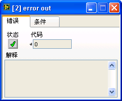
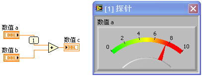

# 断点和探针

断点和探针是调试LabVIEW代码时最常用的两个工具。

## 断点

LabVIEW中的断点在使用和功能上都比较简单、直观。使用工具选板（图
1.46）上的断点工具，在想要设置或者取消断点的代码处点击鼠标即可。或者，直接在程序框图的节点、数据线上右击鼠标，选择设置或取消断点的菜单项，也可以添加或删除断点。

断点几乎可以设置在程序的任何部分。当程序运行至断点处，就会暂停，等待调试人员的下一步操作。很多编程语言的调试环境都具有条件断点，但LabVIEW没有类似的断点设置。LabVIEW是使用条件探针来实现条件断点功能的。

如果某个VI不允许设置断点，很可能是这个VI被设为不允许调试了。此时，只需在VI属性中重新设置为允许调试即可。

断点是可以被保存在VI中的。关闭保存了断点的VI，程序执行至断点处仍会停下来，并且会自动打开这个VI。所以，在把程序发布给用户前，需要保证程序中没有断点，以免用户的程序在运行时突然停下来。打开"查看-\>断点管理器"菜单，可以查看到所有存在于内存中的VI的断点（图
8.6）。并且可以对它们进行统一管理，比如可以直接删除所有的断点。

图 .6断点管理器

## 探针

探针的功能类似于其他语言调试环境中的查看窗口。查看窗口用于显示变量当前状态下的数据。LabVIEW与其他语言不同之处在于，LabVIEW是数据流驱动型的图形化编程语言。LabVIEW中的数据传递并非通过变量，而主要是通过节点之间的连线完成的。所以，LabVIEW的探针并不是针对变量的，而是添加在数据线上的。

LabVIEW的探针也是图形化显示的。它们通常都是在悬浮窗中显示出来的一些显示控件。比如，为一根传递数值类型数据的连线添加探针，默认的探针便是一个数值型显示控件。图
8.7所示的错误输入输出数据线上的探针，则看上去就像是个错误簇。有些时候，为了显示对调试者更加有帮助的信息，探针也可能使用与连线数据类型不同的控件来显示信息。比如图
8.3中的探针，虽然它是用于监视一个引用类型的数据连线的，却使用了字符串控件，以显示出引用类型的详细信息和值。

图 .7数值型和错误信息型数据线的探针

## 选取其它控件作为探针

如果编程者认为LabVIEW为某一条数据线提供的默认的探针不美观或不适用，也可以在该数据线上点击鼠标右键菜单"自定义探针-\>控件-\>..."，在弹出的控件选板中选取一个控件作为探针（图
8.8）。但该控件的数据类型必须与数据线的数据类型一致，探针才会被成功创建。

图 .8使用仪表控件作为数值型数据线的探针

## 条件探针

设置断点后，程序每次执行到断点处都会停下来。但有时候，调试者希望程序只在被监测的数据满足某一条件时，才暂停运行。比如，被监测的数据在正常情况下应大于或等于零，调试者希望一旦数据小于零则暂停。在LabVIEW中，可以使用条件探针来实现这样的功能。

图 .9数值型条件探针

以图
8.9为例，如果希望程序中的循环只有在迭代第8次时才停下来，就得使用条件探针。在记录循环次数的i的输出数据线上点击鼠标右键，选择"自定义探针-\>带条件..."的探针，即可创建出一个条件探针。在探针的条件页上可以设置程序暂停的条件。比如，在这个例子中，当i=7时，则对应于循环迭代到第8次。满足这一条件时，程序会暂停运行，等待开发人员进一步的调试操作。

## 用户自定义探针

调试中，有时需要在探针上显示出信息更为详细的数据，也许LabVIEW自带探针的功能不够强大，并不能满足需要。如在图
8.10中，需要给队列数据类型加一个探针。LabVIEW自带的探针只能显示出表示这一队列的一个32位整数，这对于调试程序帮助不大。调试者也许更希望在探针上看到队列中元素的内容。

图 .10队列数据的默认探针

LabVIEW提供的探针类型虽然有限，但编程者可以自己动手，创建出满足特殊调试需求的探针来，这就是用户自定义探针。

用户自定义探针其实就是一个VI。LabVIEW自带了一些已经做好的探针，这些探针都被放置在\[LabVIEW\]\\vi.lib\\\_probes文件夹下。可以打开这个文件夹里面的VI，查看一下已有的自定义探针是如何做的。比如，图
8.9中所使用的I32型条件探针的VI便是ConditionalSigned32.vi。创建用户自定义探针前，可以参考这些已有的探针。

若需要自己动手创建一个自定义探针，可以先在探针所针对的数据类型的数据线上点击鼠标右键，选择"自定义探针-\>新建"。之后，LabVIEW会弹出一个向导界面，帮助用户指定创建用户自定义探针所需的信息（图
8.11）。在图
8.10的示例中，需要探测的是一个元素为双精度浮点数的队列。故此，可以按照向导的提示，选择新建一个探针，VI名为"DBL
Queue"。

图 .11创建新探针的向导界面

在提供了必要的信息之后，LabVIEW会自动生成自定义探针VI的框架。这个框架VI有一个输入和一个输出。输入是被探测的数据，输出是一个布尔类型，表示程序是否需要暂停。这个VI的界面也就是探针的外观。探针所实现的功能完全依赖于如何对其编程。

为了完成这一自定义探针的全部功能，首先要设计其界面。在这个例子中，探针应该具有显示队列元素内容、以及当队列长度等于某一值时暂停程序的功能。仿照I32型条件探针的外貌，新设计的探针界面使用选项卡控件，并利用选项卡控件不同的页面分别显示数据和设置条件。在选项卡控件的数据页面上使用实数数组来显示队列中元素的数据。在条件页面，通过一个数值控件来输入程序暂停时所需队列的长度。

框架自动生成的两个控件虽然是必须的，但不必让用户看到，故可以将它们移到前面板的显示区域之外（图
8.12）。

图 .12编辑中的自定义探针界面

界面设计完成后，需要编写实现探针功能的代码。这个自定义探针功能比较简单。只要把元素内容输出，以及在列长度与设置的输入值相等时暂停程序运行即可。其代码如图
8.13所示。在程序调试中，这个自定义指针的界面如图 8.14所示。

图 .13自定义探针的程序框图

图 .14使用自定义的探针，可以查看队列中元素的内容

##  集成的探针监视窗口

从LabVIEW
2009开始，LabVIEW默认把所有探针的数据显示全部集成在了一个窗口内，如图8.15所示。

\
图8.15 集成的探针监视窗口

与之前LabVIEW中每个探针都有一个独立窗口相比，新的探针管理器无疑更加整洁。新探针管理器中，只有选中的探针的数值会被显示在"Probe
Display"窗口中。有时候，希望调试程序时可以同时看到多个探针的值。在探针监视窗口中选中某一个探针，点击窗口左上角的"在新窗口中打开"按钮，就可以为这个探针新建一个独立的显示窗口（如图8.16所示）。这样，不同的探针数据就可以同时显示了。

\
图8.16 在独立窗口显示探针数据