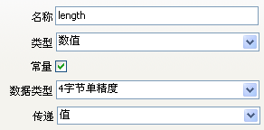
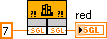
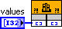
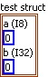
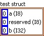
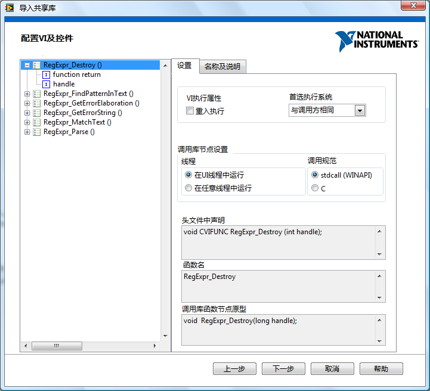

# 调用动态链接库

## 背景知识

动态链接库的英文是：Dynamic Linkable Library，简称 DLL。从字面上理解，它是一种“程序库”。库内存放的是可供应用程序使用的函数、变量等。

“动态”是与“静态”相对应而来的。这里的动态和静态是指链接库中代码与使用它们的应用程序之间的链接方式。如果采用静态链接库，在生成应用程序时，库中的函数等都会被直接放入最终生成的可执行文件中；而使用动态链接库时，库中的函数等不会被放到可执行文件中去，而是仍然保留在 DLL 文件内。当程序被运行时，再链接到动态链接库中的函数和变量等内容。

静态库的局限性比较大，C 语言编写的静态库只能在 C 语言中使用，LabVIEW 无法调用。而动态链接库则可以在多种编程语言中通用：使用某一种语言编写出来的 DLL 可以在另一种语言编写的程序中使用。比如，使用 C 语言编写的 DLL 可以在 LabVIEW 中使用，反之亦可。

动态链接库的加载方式又分“动态”与“静态”两种。这里的动态和静态是指应用程序运行时，动态链接库代码被载入内存的方式。常用的方式是静态加载，指动态链接库在应用程序启动时，随应用程序一起被载入内存。而动态加载方式是指，应用程序启动时，并不载入动态链接库。只有在使用到动态链接库中某个函数时，才把动态链接库载入内存。

DLL 最大的优势在于代码共享，只要某一功能以 DLL 的形式提供出来了，其它的应用程序就可以直接使用这一功能，而不必再实现一份相同的代码了。

DLL 的使用非常普遍。比如 Windows 操作系统提供给应用程序调用的功能，就是以 DLL 的形式公布出来的。LabVIEW 中若需使用某个系统功能，如读写注册表等，即可通过调用 Windows 提供的 DLL 函数来完成。Window 提供的这些完成系统功能的函数也被称为 Windows
API。在常用的几个系统 DLL 中，kernel32.dll 提供了内存管理和进程调度相关的函数，user32.dll 中的函数则主要用于控制用户界面，gdi32.dll 中的函数则负责图形方面的操作。在 32 位操作系统中，这些 Windows API 的 DLL 都被保存在 system32 目录下。

很多硬件设备的驱动程序也往往是以 DLL 方式提供的。此外，在互联网上还可以找到各种各样的 DLL。如果需要解析某种文件，需要使用某些常用的算法等等，都可以先去互联网上搜索一下，是否有相关的 DLL 库可供直接使用。

在 LabVIEW 中，经常会遇到需要使用 DLL 的情况，比如，在程序中使用到某个以 DLL 方式提供的第三方的驱动程序或算法。再比如，在一个大项目的开发中，出于效率和开发人员喜好等因素的考虑，可能会使用 C++ 语言实现软件的运算部分，并把这些功能构建在 DLL 文件中，再使用 LabVIEW 编写程序的界面部分，并通过调用编写好的 DLL 来调用运算部分的功能。

LabVIEW 程序员在使用 DLL、ActiveX 控件等之前，至少先要了解它们的功能和用法。比如初次使用某个 DLL 时，常常会遇到这样的情况：调用了一个函数但没有得到正确的运行结果。遇到这类问题，首先要查清是自己不了解 LabVIEW 调用 DLL 函数的用法，还是不了解那个 DLL 的使用方法。熟悉 C 语言的用户，可以先在 C 语言下尝试能否正确使用这个 DLL。如果在 C 语言下可以，但在 LabVIEW 下却不能，那说明是在 LabVIEW 调用 DLL 时错了。学习完本章的内容应该可以解决这个问题了。如果在 C 语言下，也不能正确调用这个 DLL，那说明是对这个 DLL 的使用方法还没理解，就应当先学习弄懂这个 DLL 的有关资料。

## CLN 和 CIN 节点

在 LabVIEW 中，通过“互联接口 -\> 库与可执行程序 -\> 调用库函数”节点来调用 DLL 中的函数。调用库函数节点常被简称为 CLN 节点，它是英文 Call Library Function Node 的缩写。

在同一函数选板上，它旁边的一个节点是“代码接口”节点（Code Interface
Node），简称 CIN 节点。在 CLN 节点出现以前，LabVIEW 只能通过 CIN 节点调用 C 语言编写的函数。现在有了 CLN，可以不再考虑使用 CIN 了。CIN 节点不能调用动态链接库中的函数，它只能调用按照特定方式编译出来的程序代码。稍有差错，程序就无法正常运行。CIN 所调用的程序模块不通用，而且限制颇多，CLN 节点出现之后，很少有人再使用 CIN 节点了。

在 LabVIEW 中调用 DLL 中的函数，最大的困难在于把函数参数的数据类型映射为相应的 LabVIEW 中的数据类型。在着手手工设置 CLN 节点前，可以优先考虑使用导入共享库工具用以自动生成配置 CLN 节点。这个工具在菜单“工具 -\> 导入 -\> 共享库”中。它专门用于把 DLL 中的函数包装成 VI，生成的每个 VI 中最主要的部分就是一个 CLN 节点，它能够自动设置函数的参数。这个工具在大多数情况下，都能够把 DLL 中的函数包装成可以正确运行的 VI。如果你有现成的 DLL，打算在 LabVIEW 中使用，可以考虑首先用这个工具，把 DLL 中所有的函数都包装成 VI。再在其结果上继续改进，就方便多了。这个工具可能无法直接处理一些非常特殊的数据类型（如字符串数组）和函数（如回调函数），所以，即便有工具我们还是需要了解一下 LabVIEW 是如何调用 DLL 中的函数、以及如何手工配置 CLN 节点的。

需要注意的是，如果 DLL 使用了 C++ 的类作为接口，这样的 DLL 是没办法在 LabVIEW 中直接调用的。CLN 节点只能调用符合标准 C 语言函数接口的 DLL。若项目中必须使用某个 C++
DLL 时，可以在其上再用 C 语言写一个 C 接口 DLL，作为它和 LabVIEW 之间的中间层。LabVIEW 调用这个中间层 DLL 提供的函数，中间层函数再调用 C++ 接口的 DLL 函数。

## DLL 的加载方式

一个 CLN 节点刚被拖到程序框图上的时候，外观如下图所示：


还需要对它进行配置后，才能够使用。双击这个 CLN 节点，就会出现它的配置对话框。这个对话框有四页。第一页是被调用函数的信息：


“库名或路径”栏，用于填写 DLL 文件名和 DLL 的全路径。在系统路径下的 DLL，直接输入文件名即可，否则需要全路径。若没有勾选“在程序框图中指定路径”，则 DLL 是被 LabVIEW 静态加载到程序中的，也可被称为 LabVIEW 程序静态调用了这个 DLL。在调用了这个 DLL 的 VI 被装入内存时，DLL 也同时被装入内存，虽然这时，这个 VI 也许还没有被运行。在这个 VI 运行完毕后，也不会把 DLL 卸载出内存。要一直等到所有使用了这个 DLL 的 VI 被关闭后，这个 DLL 才会被卸载出内存。

若勾选了“在程序框图中指定路径”选项，那么对话框中配置的 DLL 就是无效的。CLN 节点会多出两个 "路径" 接线端，以便在程序框图中输入 DLL 的路径：


此时，LabVIEW 是动态加载 DLL 的，或者说 LabVIEW 是动态调用 DLL 的。因为在 VI 运行到这个 CLN 节点之前，都不能确定输入的“路径”是什么，所以自然也无法加载相应的 DLL。只有当运行到这个 CLN 节点时，LabVIEW 才把要用到的 DLL 装入内存。在这个 CLN 节点运行结束后，LabVIEW 并不会立即把 DLL 卸载出内存。如果后续的 CLN 节点也使用了这个 DLL 文件，就不需要再重新加载了。只有当程序传一个空路径给 CLN 节点时，LabVIEW 才会把已经加载的 DLL 文件卸载。

加载 DLL 文件通常是一个比较耗时的工作。采用静态加载方式，程序所用到的 DLL 在程序启动时都被装入内存，程序启动时间会比较长。而使用动态加载方式，程序运行到需要用到 DLL 的时候才被加载，缩短了程序的启动时间，把这部分时间转移到了程序运行中。

还有一种情况，使用动态加载的优势比较明显。假如程序功能很多，调用了多个 DLL 文件。而程序每次运行时，往往只用到其中部分 DLL。如果使用静态加载，不管有没有用到，所有的 DLL 都要被装入内存。如果此时缺失了某个 DLL，即便程序运行时不需要用到它，程序也会因为在启动时找不到它而无法运行。采用动态加载方式，只是把那些程序运行时用到的 DLL 装进来。这样，提高了程序效率，又不会因为缺少某个暂时用不到的 DLL 而影响程序运行。

## 函数的配置

CLN 节点配置对话框中，“函数名”一项用于输入需要调用的 DLL 中的函数。如果是选用静态加载方式，并已输入了正确的 DLL 文件全路径，这里会列出 DLL 中所有允许被外部调用的函数，用户只要在下拉框中选取一个即可。

“线程”选项用于选择被调用的 DLL 函数在何线程内运行。CLN 节点的线程选项只有两项：“在 UI 线程中运行”和“在任一线程中运行”。在程序框图上直接就可以看出一个 CLN 节点是选用的什么线程。如果是“在 UI 线程中运行”，节点颜色是较深的桔黄色；如果是“在任一线程中运行”，则节点是比较淡的黄色：


“在 UI 线程中运行”是指在 UI 线程（即界面线程）中运行被调用的函数。LabVIEW 程序不论多么复杂，都只会有一个界面线程。这个线程用于处理所有与界面相关的工作，如显示一个数据，产生一个用户事件等。由于程序中只有一个界面线程，如果把多个被调用的函数都设置为在界面线程中运行，就可以确保这些函数在同一线程内运行。

LabVIEW 除了界面线程之外，还有多个其它执行线程，用于执行程序框图中的代码。如果选择“在任一线程中运行”，就不能确定 LabVIEW 会在哪个线程内运行这个 DLL 函数。

可以按照以下判断方法，选择 CLN 节点中的线程设置：如果被调用的动态链接库是多线程安全的，就选择“在任一线程中运行”；否则，动态链接库就不是多线程安全的，就得选择“在 UI 线程中运行”。选择在任一线程中运行一个 DLL 函数，程序的运行效率比较高。因为 LabVIEW 可以把 DLL 函数放在与其前后程序代码相同的线程内执行，这样就省去了线程切换的开销。并且，该设置允许 LabVIEW 在不同的线程内同时调用同一个 DLL 函数，并行执行的速度通常比串行高一些。但是，如果 DLL 不是多线程安全的，也就意味着在不同线程内同时调用 DLL 中的函数可能会出现错误，那么必须禁止这种情况的出现。这时，只能把 CLN 节点设置为“在 UI 线程中运行”，以确保所有 DLL 函数都只在一个线程内运行。

判断一个动态链接库是否是为线程安全的，也需要费一番心思。如果这个动态链接库文档中没有明确说明它是多线程安全的，那么，为稳妥起见，应该把它当成非多线程安全的。熟悉 C 语言的用户可以查看一下动态链接库的源代码，若代码中存在全局变量、静态变量或者代码中看不到有使用信号量，关键区等保护措施的，这个动态链接库也肯定不是多线程安全的。

关于 LabVIEW 中几种不同线程的详细介绍可以参考[多线程编程](optimization_multi_thread)一节。

“调用规范”（Calling convention），用于指明被调用函数的参数压栈规范。CLN 节点支持两种规范：stdcall 和 C call。它们之间的区别在于，stdcall 由被调用者负责清理堆栈，C call 由调用者清理堆栈。如果调用规范设置错误，可能会引起 LabVIEW 崩溃，所以一定要小心。反过来说，如果 LabVIEW 调用 DLL 函数时出现异常，首先就应该考虑这个设置是否正确。

作为 DLL 的使用者，往往不需要关心调用规范的实现细节，只要知道如何判断被调用的 DLL 采用哪种规范就可以了。一个简单的判断规则如下：Windows API 一般使用 stdcall，标准 C 的库函数大多使用 C call。如果函数声明中有类似 "\_\_stdcall" 这样的关键字，它就是 stdcall 的。

## 简单数据类型参数的设置

CLN 节点配置对话框的第二页是配置参数页：


使用 CLN 节点，最困难的部分就是把函数参数的数据类型映射为相应的 LabVIEW 中的数据类型。在 DLL 和 LabVIEW 之间传递参数，最常用的三种数据类型是：数值、字符串和数值型数组。这几种类型的参数配置还是比较简单的。

### 数值类型

如果掌握一点 C 语言的背景知识，就会发现 LabVIEW 多种不同精度的数值类型与 C 语言中的数值类型的匹配还是相当直观的。比如“4 字节单精度”数据类型对应 C 语言中的 float 数据类型。LabVIEW 自带的例子 "\[LabVIEW\]\\examples\\dll\\data passing\\Call Native Code.llb" 中详细地列出了简单数据类型在 LabVIEW 与 C 之间的对应关系。

C 语言中经常在函数间传递指针或者数据的地址。在 32 位的程序中，可以使用 int32 数值来表示指针。因此，当需要在 LabVIEW 中传递指针数据时，可以使用 I32 或 U32 数值类型来表示这个地址类型的数据。但是，在 64 位的程序中，数据的地址只能使用 I64 或 U64 来表示。这样在一个调用了 DLL 函数、并且函数参数中有地址型数据的 VI，如果使用固定数据类型的数值来表示地址的话，就要准备两份代码。解决此问题的方法就是在该页的“数据类型”栏选择使用 LabVIEW 中的新数据类型：有符号或无符号 “指针大小整形”。这个数据类型的长度在不同的平台上会自动使用 32 位或 64 位长度。

如果在 C 语言函数参数声明中有 const 关键字，可以选中“常量”选项。LabVIEW 把一个数据传递给 DLL 中的函数时，通常需要为数据生成一份拷贝，让 DLL 函数使用这个拷贝数据。这样做的目的，是为了防止数据在 DLL 中被修改，外部程序又不知道，因而引起错误。设置“常量”属性，就说明这个参数一定不会在 DLL 中被改动，LabVIEW 可以不为它生成一份拷贝，以节约内存。

下表列举了 DLL 函数的数值型数据在 C 语言和 LabVIEW 中的设置方法：

|  |  |  |
| ---- | ----------- | ----------- |
| 输入 / 输出 | 输入 | 输出或兼作输入输出 |
| C 语言声明 | `float red;` | `float* red;` |
| LabVIEW 中的配置 |  |  |
| LabVIEW 的使用 |  |  |


### 布尔类型

在 DLL 函数和 VI 之间并没有专门的、用于传递布尔值的数据类型，它也是利用数值类型来传递的。输入时先把布尔值转换为数值，再传递给 DLL 函数；输出时再把数值转换为布尔值。

在 C 语言中，有多种表示布尔类型的数据类型，如“bool”、“BOOL”等。它们的存储长度可能不相同，有的用一个字节表示，有的用四个字节表示。在使用时需要查看一下在被调用的 DLL 文件中布尔类型是以何种长度存储的，再使用对应的数值数据来表示它。

下表列举了布尔型数据的设置：

|  |  |  |
| ---- | ----------- | ----------- |
| 输入 / 输出 | 输入 | 输出或兼作输入输出 |
| C 语言声明 | `bool visible;` | `bool* visible;` |
| LabVIEW 中的配置 |  |  |
| LabVIEW 的使用 |  |  |


### 数值型数组

对于数组的传递，LabVIEW 只支持 C 数据类型中的数值型数组。在 CLN 节点中配置数组型参数时，选择“类型”为“数组”，这是指参数的类型；然后还要选择“数据类型”，这是指数组元素的数据类型，它可以是任何一种数值类型。

“数组格式”一般都是使用“数组数据指针”，它对应于 C 语言中用指针表示的数组。“数组格式”还有其它两个选项：“数组句柄”和“数组句柄指针”。像这种带有“句柄”的参数类型都是表示 LabVIEW 定义的特殊类型的，通常只有 NI 公司产品中的 DLL 或使用 LabVIEW 生成的 DLL 中才会使用这些数据类型，在第三方的 DLL 中是不会用到的。

“最小尺寸”参数可以给一维数组参数设置一个最小长度，当用户传给 CLN 节点的数组长度小于这个值时，LabVIEW 会将其扩充至最小长度，再传递给 DLL 函数。

当函数的输出参数为数组时，一定要为输出的数组数据开辟存储空间。开辟数据空间的方法有两种：

第一种方法是创建一个长度满足要求的数组，作为初始值传递给参数。这个输入数组的内容对程序而言是无效的，它只被用来表示应该为输出数组分配的内存空间的大小，以确保输出数据都被保存在这个合法的内存空间中。

第二种方法是直接在参数配置面板上进行设置。在“最小尺寸”中写入一个固定的数值，LabVIEW 会按此大小为输出的数组开辟内存空间。在“最小尺寸”栏中参数可以输入一个固定数值。此外，如果该 CLN 节点调用的参数中有整型参数，这些参数的名称就会出现在该栏的选择项中，也就是说，也可以选择某个参数作为“最小尺寸”。这样 LabVIEW 会按照所选参数运行时的输入值来开辟相应大小的空间。

如果没有给输出数据分配内存，或分配的空间不够大，程序运行时就可能出现数组越界的运行错误，LabVIEW 会莫名其妙崩溃。更糟糕的是，LabVIEW 也许并不是在出现数组越界错误的瞬间崩溃的，而往往是在其之后的某一个不确定的时刻崩溃。如果意识不到程序中有这种错误，或者程序中有很多个类似的 CLN 节点，那么，调试并查找排除这一错误可能要花费大量的时间和精力。

下表列举了数组型数据的设置：

|  |  |  |
| ---- | ----------- | ----------- |
| 输入 / 输出 | 输入 | 输出或兼作输入输出 |
| C 语言声明 | `int values [];` | `int values [];` |
| LabVIEW 中的配置 |  |  |
| LabVIEW 的使用 |  |  |


### 字符串类型

字符串的使用与数组是非常类似的。实际上，在 C 语言中字符串就是一个 I8 数组。

|  |  |  |
| ---- | ----------- | ----------- |
| 输入 / 输出 | 输入 | 输出或兼作输入输出 |
| C 语言声明 | `char* name;` | `char* name;` |
| LabVIEW 中的配置 |  |  |
| LabVIEW 的使用 |  |  |

下表列举了字符串型数据的设置：


## 结构型参数的设置

C 语言中的结构（struct），在一些简单情况下，可以和 LabVIEW 中的“簇”相对应。但是，对于比较复杂的情况，LabVIEW 中的簇要做适当调整，才能够对应起来。

在讨论结构型参数的映射前，一定要先了解一下字节对齐的概念。在这里只做一个简单介绍，其详细内容可以搜索数据对齐相关的专题文章。

C 语言中的一个结构：

```cpp
typedef struct {
    char a;
    int b 
} MyStct; 
```


显然，元素 a 只占用一个字节，而元素 b 占用四个字节。假设结构中的元素 a 所在的地址是 0xAAAA0000，那么，元素 b 占用四个字节的存放地址是与结构的字节对齐设置相关的。如果采用 1 字节对齐，则 b 是紧挨着 a 存放的，b 的地址就是：0xAAAA0001；如果采用 2 字节对齐，b 的存放
地址是紧挨着 a 的第一个偶数地址，也就是：0xAAAA0002；如果采用 4 字节对齐，b 的存放地址是紧挨着 a 的第一个 4 整数倍地址，也就是：0xAAAA0004。当然还可以把程序设置为 8 字节、16 字节对齐等。

C 语言中，字节对齐数可以由 `#pragma pack` 指令指定，也可以在项目属性里指定。但是 LabVIEW 的簇，只能是 1 字节对齐的。因此，C 语言中，非 1 字节对齐的结构与 Cluster 对应时，必须做适当调整，才可使数据正确传输。

比如，结构 `typedef struct {char a; int b} MyStct;` 是 2 字节对齐的，那么，对应的 LabVIEW Cluster 第一个元素还应该是 I8 型的 a。但是，不能紧接着就放 b。因为 C 语言中，b 的起始地址不是紧挨着 a 的，它们中间还有一个无意义的一字节数据。虽然在 C 的结构体中没有表现出来，在 LabVIEW 中却需要把它考虑进去。也就是说，在 LabVIEW 与之对应的簇的元素 a、b 之间还应添加一个一字节长的元素。

如果是自己编写一个 DLL 给 LabVIEW 调用，为了简便起见，可以把 C 代码中所有的结构都设为 1 字节对齐。

C 语言的结构中如果还嵌套了数组，是不能直接对应于 LabVIEW 中嵌套了数组的簇的。在 LabVIEW 中，只能把数组的元素都拆开来放在簇中。

下表列举了 C 与 LabVIEW 中一些常见结构数据类型数据的对应关系。

| C | LabVIEW |
| ----------- | ----- |
| <pre>#pragma pack (1) <br />typedef struct {char a; int b} MyStct; <br />MyStct* testStruct;</pre> |  | 
| <pre>#pragma pack (2) <br />typedef struct {char a; int b} MyStct; <br />MyStct* testStruct;</pre> |  | 
| <pre>#pragma pack (4) <br />typedef struct {char a; int b} MyStct; <br />MyStct* testStruct;</pre> |  | 
| <pre>#pragma pack (1) <br />typedef struct {char a; char\* str; int b} MyStct <br />MyStct* testStruct;</pre> |  | 
| <pre>#pragma pack (1) <br />typedef struct {char a; char str [5]; int b} MyStct; <br />MyStct* testStruct;</pre> |  | 


上表中的第四个例子，结构中含有一个指针。与这种结构相对应时，LabVIEW 中的簇中只能用一个 U32 数值（32 位系统上；64 位系统上则使用 U64）来表示指针的地址，不能把指针指向的内容放到簇中去。下文将会继续讨论如何从这个地址中把数据取出来。

在上表中，所有的 C 语言中声明的 testStruct 变量，都是指向结构的指针。也就是说 C 函数的变量类型为结构的指针时，才能在 LabVIEW 中使用簇与之对应。CLN 节点的配置面板中，并没有一个专门的参数类型叫做“struct”或者“簇”，只要选择“匹配至数据类型”就可以了。

如果参数仅用于输入，它的类型很可能直接使用结构，而非结构的指针。考虑到 C 函数参数的压栈顺序，把一个结构体作为参数传给函数，等价于把结构中每个元素分别作为参数传递给函数。结构参数类型，在 LabVIEW 中的设置方法如下表所示：

|  |  |  |
| ---- | ----------- | ----------- |
| 输入 / 输出 | 输入 | 输出或兼作输入输出 |
| C 语言声明 | <pre>typedef struct {int left; int top;} Position;<br />long TestStructure (Position inPos);</pre> | <pre>typedef struct {int left; int top;} Position;<br />long TestStructure (Position *pos);</pre> |
| LabVIEW 中的配置 |  |  |
| LabVIEW 的使用 |  |  |


## 返回值的设置

C 语言的函数可以带返回值，它对应 CLN 节点的第一个输出参数。在配置 CLN 节点时，函数返回值可以是空，也可以是数值或者字符串，但不能使用其它数据类型。

函数返回值与输出参数一样，都是把数据从 DLL 函数中传递出来，给后续的 LabVIEW 代码使用。但在 CLN 节点上，函数返回值是没有左接线端的。因此，它不需要像输出参数那样，需要在 LabVIEW 代码中为传出的数据开辟存储空间。

为何函数返回值就不需要开辟存储空间了呢？以函数返回字符串的情况为例，实际上，函数返回的是一个指向字符串指针。既然是函数返回的，LabVIEW 就可以得到该指针，进而就可以得到它所指的字符串。在 LabVIEW 内部，既然已经得到了这个字符串，也就可以得到它的长度。然后再开辟一个相应大小的空间，把字符串内容复制出来。

而参数输出字符串的情况并非如此。所谓参数输出并不是真的有输出，而是 DLL 函数要求 LabVIEW 提供给被调用函数一个指针，这个指针指向一块可以保存输出数据的内存空间。由于此时 LabVIEW 无法得知将要输出的数据有多大，因而不可能自动开辟一片缓存，然后把指针传给函数。所以，它只好把指定缓存大小的任务交给编程人员了。

## 对 C 语言中指针的处理

C 语言函数常有指针类型的参数。在 LabVIEW 中有时只能得到一个指向某个数据的指针。例如下面这个函数在 C 语言中的声明：

```cpp
#pragma pack (1)
typedef struct {char a; char* str; int b} MyStct;
MyStct* testStruct;
long TestStructure (MyStct* tempStct);
```

在 LabVIEW 中使用 CLN 节点调用这个函数，只能返回以整数类型表示的 str 的指针，无法得到字符串的内容。

在大多数情况下，也许并不需要在 LabVIEW 中得到一个指针指向的具体内容，而是只需在 LabVIEW 中得到这个指针的地址，再把它传递到下一个 CLN 节点就可以了。对指针所指向的内容的操作都是在 DLL 的函数中完成的。

如果某些情况下，必须要在 LabVIEW 中得到指针指向的内容，就只能借助 C 语言来完成这一工作了。仍以上面的函数为例，如果需要得到字符串 str 的内容，就要另外写一个 C 函数，把函数 TestStructure 返回的 tempStct 结构中的元素拆开成简单数据类型，作为新的函数的参数。新函数中的一个参数就是 char\* str，LabVIEW 的 CLN 节点可以把它映射为字符串类型。在 LabVIEW 中调用这个新的函数，便可以得到这些简单数据类型的数据。

有些函数需要在外部开辟的一块内存中写入数据，LabVIEW 中没有分配内存的操作，也需要再写一个 C 函数用于分配好内存，以给被调用的函数使用。

这种做法的弊病是，针对每个需要得到内容的指针都要创建一个包装函数，相当麻烦。

还有一个可以重复利用 C 代码的方法是：编写一个 C 函数，负责把指针指向的内存中的数据以字节数组的形式读出，再在 LabVIEW 中把它们重新组织成合理的数据类型。虽然这种方法更复杂，好在 LabVIEW 中自带的一些 VI 已经具备了这种功能，编程人员可以直接利用这些现成的 VI 来完成这部分工作，而不需再额外编写代码了。

完成这一功能的节点是：

"\[LabVIEW\]\\vi.lib\\Utility\\importsl\\GetValueByPointer\\GetValueByPointer.xnode"。

[XNode](oop_xnode) 可以被看做是一种功能更复杂的 VI，这里可以就把它当成子 VI 那样使用。

这个节点有三个输入：一是指针，或者称为数据的内存地址；二是数据类型；三是字节对齐方式。为它们提供正确的参数，GetValueByPointer.xnode 就会把指针所指向的数据返回出来。


上图所示的例子中，CLN 节点 "DLLMemory.dll:ReturnPointerToConstant" 返回的是一个指针，指向在 C 语言中声明的一个整数常量。把这个指针传给 GetValueByPointer.xnode 并且告诉它数据类型是 I32，GetValueByPointer.xnode 就会得到并返回这个指针指向的内容。

文件夹 "\[LabVIEW\]\\vi.lib\\Utility\\importsl\\" 中还有三个 VI，它们用于分配一块内存，然后供 DLL 中的函数使用。比如有些函数输出数组或字符串数据，需要调用它的函数开辟好输出数据的空间，再把空间地址传给这个函数。需要使用 LabVIEW 调用这个函数时，可以利用 DSNewPtr.vi 完成这一功能。DSNewPtr.vi 的输入是内存空间大小，输出是新开辟空间的地址。InitStr.vi 也可以开辟一块内存空间，并在该空间写入初始值。DSDisposePtr.vi 用于释放前两个函数开辟的空间。


## 导入共享库工具

从菜单项“工具 -\> 导入 -\> 共享库”可以启动导入共享库工具。导入共享库工具可以方便地把 Windows、Linux、Mac OS 系统上共享库文件中的函数包装成 VI。在 Windows 操作系统上，共享库文件就是 DLL 动态链接库文件。对于不熟悉 C 语言的用户而言，在程序中直接使用 VI，要比配置 CLN 节点便捷得多。

LabVIEW 自带了一个用于演示这一工具的示例：“\[LabVIEW\]\\examples\\dll\\regexpr\\Import Shared Library Tutorial GUI.vi”。首次使用导入共享库工具之前，可以打开示例，根据提示学习这个工具的用法。

导入共享库工具以向导的形式，一步一步地提示用户把 DLL 函数包装成为 VI。首先要求用户提供一个 DLL 文件，一个头 (.h) 文件。工具可以查看到 DLL 文件提供了哪些可供用户使用的函数，然后就针对这些函数进行转换。头文件中包含了这些函数的声明。函数声明定义了一个函数包括多少个参数，以及每个参数的数据类型。该工具根据这些信息来为所生成包装的 VI 设定合适的控件。

之后，工具要求用户提供“包括路径”，和“预处理定义”。有时候，一个 DLL 的头文件又依赖于其它的头文件。比如，DLL 函数的头文件中可能使用了某个系统定义的数据类型，数据类型的定义在 windows.h 中。（windows.h 是 Windows SDK 中的一个文件，VC、CVI 等开发环境常常会带有 Windows SDK。）要正确地得到这个数据类型，就必须让工具找到 windows.h 这个头文件。这时，需要用户把 windows.h 文件的全路径加在“包括路径”里。编写 C 语言时，经常用到各种常量定义。如果 DLL 的头文件需要用到某些宏定义，就应该把它们写在“预处理定义”中。

然后，工具会列出 DLL 中的所有函数，用户可以选择其中一部分，将其包装成 VI。

随后，要求用户设置生成 VI 的路径和库名称。（有关库的内容，本书将会在[库](manage_library)一节进行介绍。）之后，要求用户选择生成 VI 的错误处理机制。选择哪一种错误处理机制取决于被调用的 DLL 函数是如何设置的。如果被调用的函数本身就不产生任何错误信息，那么，它的包装 VI 也就只能采用无错误处理机制的 VI。不过最常用的机制还是“函数返回错误代码 / 状态”处理机制。通常，API 函数使用参数来传递完成函数功能所需的数据，而使用返回值表示错误代码。它的包装 VI 在使用 CLN 节点调用 DLL 中的函数后，随即检查函数的返回值，看是否出错。

最后，是配置 VI 和控件页面。这是比较复杂的一页，它用于配置每个 VI 和控件的属性。如果已经阅读并领会了本章前面的内容，对 CLN 节点配置有了一定了解，再看本页的内容，就比较容易理解了。它们实际上也是对应着 CLN 中的配置选项。




导入共享库工具会尽量根据函数的声明，为它制定最适合的包装 VI，配置合理的控件。但是，有时候这个工具也无法判断准确。比如，某参数的数据类型是 int\*，工具就无法判断这个参数是用于传递一个整型数据还是一组整型数据；也无法判断它是用于输入还是输出。那么工具就只好采用适用性最强的默认配置方式：认为它只传递一个数据；而且既用于输入也用于输出。在“配置 VI 及控件”页面是可以修改这些默认设置的。令人遗憾的是，这个工具只能针对每一个 VI 去修改它的配置。如果，有一批相似的设置要修改，就比较麻烦了。比如在某个程序中，所有传递数组的参数都是以 int\* 形式声明的，那就不得不在这个配置页面中找到每一个这种类型的数据，把它由传递指针，改为传递数组。还有一种稍微便捷一点的修改方法：在使用这个工具前，在 DLL 头文件中，把传递数组的参数的声明都改为 int
xxx\[\] 的形式。这样以来，工具就可以直接把这个参数识别为传递数组了。

最后，就可以生成出一组 VI 来了。在应用程序中直接调用这些 VI 即可。


## 制作专为 LabVIEW 使用的 DLL

绝大多数时候调用 DLL 都是是为了利用别人已经实现好了的功能。只有少数情况向，我们可能需要为某个 LabVIEW 项目制专门作一个 DLL 文件。比如，可能某些算法只有用 C 语言实现才能达到要求的效率；或者需要把某个无法直接被 LabVIEW 调用的外部模块再包装一层，等。对于这种专为 LabVIEW 调用设计的 DLL 文件有一些方法可以简化制作难度，以及提高运行效率。

首先，数据类型的设计就不必像上文提到的那么麻烦了。我们可以先设置 CLN 节点，把参数的 LabVIEW 数据类型设置好。比如下图中的 CLN 节点，在设置参数时采用了“匹配至数据类型”（Adapt to Type），这样它的接线端就是接受任何类型的数据了。之后，我们把所需的数据类型连接至这个 CLN 节点，比如一个数值类型，一个簇类型。然后选择 CLN 节点的右键菜单“生成 C 文件”（Create C File）


这样，LabVIEW 就会自动生成这个 CLN 节点可以调用的函数的声明了。比如，上面这个 CLN 节点生成的 C 代码如下：

```cpp
#include "extcode.h"
#include "lv_prolog.h"

typedef struct {
	int32_t elt1;
	LVBoolean elt2;
	} TD1;

void test_func(int32_t size, TD1 *data);
```

生成的 C 语言代码使用了几个处理 LabVIEW 数据的 .h 文件，比如“extcode.h”。这几个 .h 文件在 \[LabVIEW\]\\cintools\\ 文件夹下。 

LabVIEW 在调用第三方提供的 DLL 文件时，效率不是很高：在 DLL 函数与 LabVIEW 之间传递各种类型数据时都会发生数据复制。这是因为 LabVIEW 代码和 DLL 函数不能对保存同一块内存地址进行操作，数据必须复制到各自的内存空间里。如果需要处理的数据量非常大，数据拷贝的耗时或许会超过数据处理本身的耗时，甚至于还不如直接使用 LabVIEW 代码进行数据处理的效率高。

解决数据拷贝问题的方法是：在编写 DLL 时就使用 LabVIEW 提供给 C 语言使用的数据类型。这样在 DLL 和 LabVIEW 之间传递数据时就不会传递数据本身，而是传递 LabVIEW 数据的引用。大数据就不需要被拷贝了。LabVIEW 提供了一整套 C 语言接口函数，以便用户在编写 DLL 的时候可以创建和修改 LabVIEW 类型的数据，处理 LabVIEW 的数据句柄。这些函数的声明都在前文提到的 “extcode.h”文件中。

## 调试 LabVIEW 调用的 DLL

如果在项目中调用了 C 语言编写的 DLL 文件，有可能 C 语言编写的函数中可能存在某些错误，并且只有当它们在 LabVIEW 程序中被调用时才会显现出来。这就要求在 LabVIEW 程序运行时，调试这些 DLL 函数。

调试 C 语言的代码还是要在 VisualStudio 等编程环境中调试。对于生成可执行文件的 C 程序，在代码中设置断点再运行，程序即可暂停在断点处，然后进行单步调试等。对于生成的 DLL 也可以使用类似方法进行调试。

由于 DLL 是不能直接运行的，所以要让 VisualStudio 调用 LabVIEW，才能进行调试。设置的方法是在 VisualStudio 项目的属性中，设置“Debugging-\>Command”为 LabVIEW.exe 可执行文件：


设置好调试命令，再在 VisualStudio 中点击“开始调试”按钮或菜单，VisualStudio 就会把 LabVIEW 调用起来。如果代码中有断点，程序会暂停在断点处。

使用这种调试方法时，需要注意：被调试的 DLL 应当处于调试模式下。并且，在开发调试过程中，计算机内可能存有多份不同版本的这一 DLL 文件。要确保 LabVIEW 调用的 DLL 确实是当前正在调试的版本。