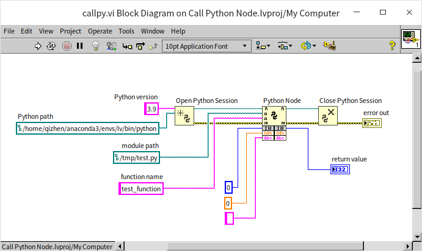
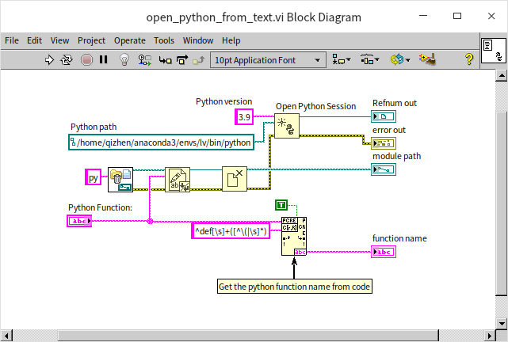
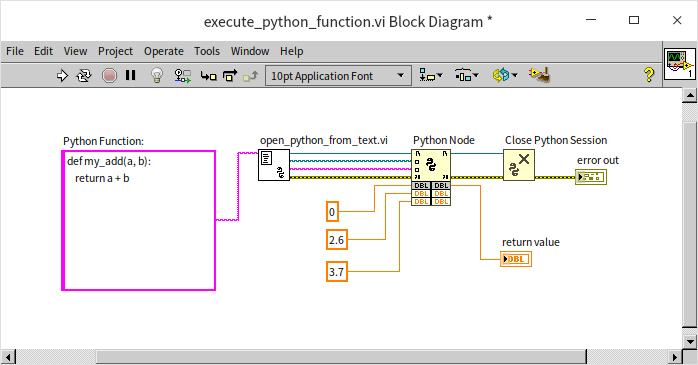
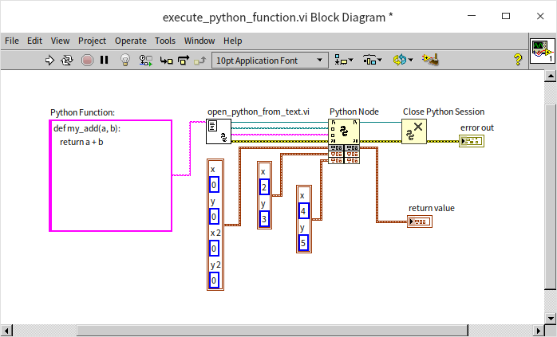
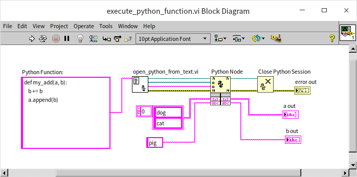
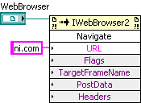
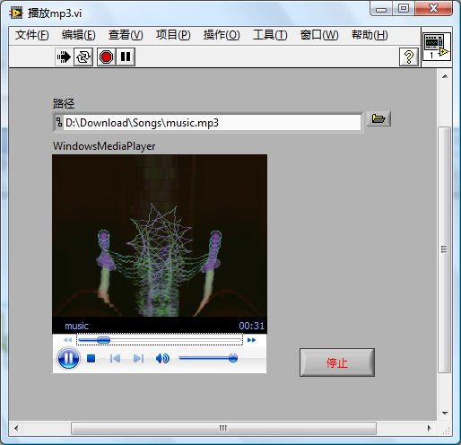
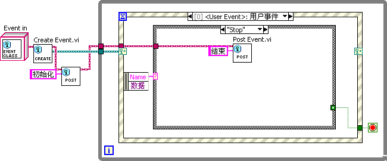

# 调用其它外部程序或组件

LabVIEW 还可以连接或调用多种其它的外部程序与组件，而且相对来说比调用 DLL 更容易。


## Python

### 安装 Python

LabVIEW 调用 Python 的代码，只能使用 Python 自己的解释器，所以必须要在电脑上安装 Python。 LabVIEW 的每一个版本只能支持几个特定版本的 Python （比如 LabVIEW 2021 只可以调用 Python 3.6~3.9），并且，LabVIEW 调用的 Python 代码可能会依赖一些特定版本的库。为了避免不同版本的 Python 和库等发生不兼容问题，最好使用专业的工具来管理所需的库和环境。Python 最常用的环境管理工具是 Conda。在开源社区中最流行的包含 Conda 和 Python 的安装包是 [Miniconda](https://docs.conda.io/en/latest/miniconda.html )，和 [Anaconda](https://www.anaconda.com/ )。Miniconda 比较精简，安装包只包含了最核心的库，其它库可等到需要时再安装。它适合入门级的 Python 用户。Anaconda 的安装包比 Miniconda 大了大约十倍，包含了几乎所有常用的库，适合有大硬盘空间的用户使用。

下载安装包时，需要注意它是 64-bit 还是 32-bit 的。这个设置必须与 LabVIEW 相同，也就是 64-bit LabVIEW 只能调用 64-bit Python。软件下载后，直接安装即可。

在 Linux 上安装 Conda 后，Conda 在打开终端时就会自动启动。这时，用户会发现终端命名提示符的格式与之前不同了。如果不希望自动启动 Conda，可以使用如下命令将其关闭： 

```sh
conda config --set auto_activate_base false
```

在 Windows 上，需要通过 Conda 安装包创建的开始菜单启动带有 Conda 的 PowerShell，或命令行窗口。比如，在开始菜单里找到“Anaconda Prompt”，然后点击它启动 Conda。

我们需要为 LabVIEW 调用的 Python 程序创建一个新的环境，以避免它与其它 Python 程序有冲突。创建新环境使用 conda create 命名，同时为新的环境起名为 lv，并设置新环境中 Python 的版本为 3.9：

```sh
(base) qizhen@deep:~$ conda create --name lv python=3.9
```

使用 conda env list 命令可以列出所有已创建的环境。并且显示出每个环境所在的文件夹路径。我们需要记住这个路径，在配置 LabVIEW 调用 Python 代码时，会用到这一路径。

```sh
(base) qizhen@deep:~$ conda env list
# conda environments:
#
base                  *  /home/qizhen/anaconda3
lv                       /home/qizhen/anaconda3/envs/lv
```

上面列出的两个环境中，lv 是新建的，base 是默认的环境。对新创建的环境进行配置或测试，需要首先切换到新环境。运行 conda activate 命令进行切换：

```sh
(base) qizhen@deep:~$ conda activate lv
(lv) qizhen@deep:~$ 
```

可以看到，命令提示中的环境名 (base) 已经被切换为 (lv) 了。接下来我们就可以配置当前的环境，比如使用 pip 命令安装 Python 的库，或者运行某段 Python 代码。


### 调用 Python 的方法

在 LabVIEW 2018 之前，只能通过调用 EXE 的方式，把 Python 解释器当作一个应用程序启动起来，再通过设置命令行参数的方式来运行相应的 Python 程序。其它脚本语言的程序也可以通过此方式来调用。由于 Python 越来越普及，LabVIEW 在 2018 之后增加了三个专用于调用 Python 程序的节点。



这三个节点分别是：
* Open Python Session： 用于启动 Python 解释器。它有两个参数，一是“Python version”，表示 Python 解释器的版本。笔者使用的 LabVIEW 2021 只支持 Python 3.6, 3.7, 3.8 和 3.9。笔者在转为 LabVIEW 设置的 Python 环境中，安装在的是 Python 3.9，所以这里只能输入 3.9。另一个参数是“Python path”，表示 Python 解释器的位置。如果电脑上安装了多个 Python 解释器，或多个环境，一定要选择那个为 LabVIEW 准备的那个 Python 解释器的路径。
* Python Node： 用于调用一个 Python 代码中的函数。输入“module path”是被调用 Python 程序的文件路径；“function name”是 被调用的 Python 程序的函数名。这个节点下部可拉伸的部分，用于设置传递给 Python 函数的参数，以及读取 Python 函数的返回值。Python Node 的配置方法比调用 DLL 简单，可以使用链接的常量或控件来指定参数的数据类型，当然这些数据类型必须与 Python 程序中的设置保持一致。
* Close Python Session： 调用结束后，用于关闭 Python 解释器。

### 编写一个测试 VI

每次创建一个 Python 程序文件（*.py 文件），写好相应的函数，再回到 LabVIEW 中去调用，是比较麻烦的。为了更方便的做演示，笔者希望直接在 VI 程序框图上写 Python 代码，然后运行。对此，只需要稍微改造一下上图中的 LabVIEW 代码：


Python 代码的函数被写在一个字符串常量中。程序运行时，先把代码保存到一个临时生成的 .py 文件中，然后在调用使用 Python Node 调用刚刚保存的 .py 文件就可以把字符串常量中的 Python 函数运行起来了。如果字符串常量中的 Python 代码中只有一个函数，那么我们可以使用上图程序中的[“匹配正则表达式”节点（Match Regular Expression）](data_string#正则表达式)，把 Python 函数的函数名自动提取出来。

对于上面的这段代码，如果把它做成一个子 VI，然后把 Python 代码作为输入，这样使用起来就更方便了。制作这样子 VI 的难点在于“Python Node”所需的输入输出是可变的，我们能制作一个参数数目和数据类型可变的子 VI 吗？就像“Python Node”这样？答案是肯定的，但是它比普通子 VI 制作起来要更复杂一些。有兴趣的读者可以参考 [XNode](oop_xnode) 一节。

制作 XNode 比较复杂，我们这里选用一个简单的折中方案：把除了 Python Node 和 Close Python Session 之外的所有节点都放入一个子 VI：



这样，演示 VI 会变得更加简洁：


### 输入输出参数设置

上图 VI 中的 Python 代码非常简单，它只有一个名为 my_add 的函数：

```python
def my_add(a, b):
	return a + b
```

函数有两个输入参数： a 和 b。函数返回 a+b 的值。因此，在 LabVIEW 程序中，把整数 2 和 3 输入给这个 Python 函数时，函数的返回结果是 5。

Python 的变量和输入输出参数可以是动态类型的，也就是说，在 Python 代码中不需要预先定义变量的数据类型，Python 解释器会在运行时检查变量的数据类型是否合法。所以，对于同样一段 Python 代码，LabVIEW 可以采用不同的输入输出参数类型。比如，把实数 2.6 和 3.7 传递给同样一个 Python 函数，函数的返回值为 6.3。



字符串也行：把字符串 “2” 和 “3” 传递给同样一个 Python 函数，函数的返回值为字符串 “23”，也就是把两个输入字符串衔接起来。


数组也可以：行为与字符串类似，返回值是把输出两个数组衔接起来。把数组 [2, 3] 和 [4, 5] 传递给同样一个 Python 函数，函数的返回值是数组 [2， 3， 4， 5]。


甚至簇也行，但是行为和预期的也许不太一样。簇类型的数据被传递到 Python 中，会被表示成 Tuples （元祖）数据类型。元祖与数组比较类似，简单来说，元祖可以看做是一个不可变的数组。元祖的“+”运算也与数组的运算相似，都是把两个输入数据衔接在一起。因此，把拥有两个元素的簇 (2, 3) 和 (4, 5) 传递给同样一个 Python 函数，函数的返回值是一个拥有 4 个元素的簇： (2, 3, 4, 5)。



在上述的程序中，如果传入的两个参数具有不同的数据类型，比如一个参数是实数，另一个是字符串，那么 Python 解释器在运行时，会发现实数与字符串无法进行“+”操作，从而报错。

在 Python 代码中可以为变量添加建议数据类型，比如下面的代码，输入参数的建议数据类型是字符串：

```python
def string_concat(a: str, b: str) -> str:
	return a + b
	
print(string_concat(2, 3))
```

但是，建议数据类型毕竟只是“建议”，即便把整数作为参数传给这个函数，Python 解释器也并不会报错。（Python 中有专用的工具和开发环境，可以检查报告这种类型错误，所以在 Python 代码中加入建议数据类型是有意义的。） LabVIEW 在调用这个函数时，也同样可以输入其他类型数据而不出错。

如果 Python 函数参数的类型是数值、字符串或簇（在 Python 中是 tuples），那么这些参数就是通过值传递的，Python 函数内部的任何操作都不会改变这些参数在函数外部的值。在 Python 函数内部，如果得到了某个数值、字符串或元祖类型的数据，是不能够通过输出参数的方式，把这些数据传递给 VI 的，只能通过返回值把它们从 Python 传递到 LabVIEW。如果，输入参数的类型是数组，那么在调用 Python 函数时，会采用传引用的方式（关于传值和传引用可以参考 [LabVIEW 的运行机制](optimization_mechanism) 一节）。也就是说，Python 函数可以改变输入数组中的数据，再通过同一个参数把修改后的值输出出来。比如下面这个 VI：



它调用了一个叫做 append_array 的 Python 函数，函数没有返回值。函数有两个输入，分别是字符串数组 a，和字符串 b。在 Python 函数内部，对两个输入数据都做了改变，首先把 b 复制一份在衔接起来，如果 b 的输入值是 "pig"，在操作后，b 在函数内的值就变成了 "pigpig"。接下来又把字符串 b 追加在数组 a 后面。如果 a 的输入值是 ["dog", "cat"]，在操作之后，就会变成是 ["dog", "cat", "pigpig"]。

运行上图的 VI，由于输入数据 a 是一个数组，我们可以从输出数据中看到 Python 函数内部对它的改变，因此，控件 a out 中的数据是 ["dog", "cat", "pigpig"]；输入数据 b 是一个字符串，是传值的，Python 函数内部对它的改变不会输出出来，所以控件 b out 中的数据与输入相同，仍然是 "pig"。

Python 允许函数有多个返回值，比如运行下面的程序，将会得到 x = 5; y = "pig":

```python
def return_both(a, b) -> str:
	return a, b
	
x, y = return_both(5, "pig")
```

返回多个数据只是为了书写方便，但它本质上相当于 Python 函数只返回了一个类型为 tuples 的数据 (5, "pig")。在 LabVIEW 中，可以使用簇来接收 tuples 数据。运行下面的 VI，就会看到簇控件 "return value" 中的数据为 (5, "pig")：


LabVIEW 调用 Python 函数只能传递以上介绍到的几种简单数据类型，复杂类型，比如类、map 等是无法直接传递给 Python 函数的。如果需要处理复杂类型的数据，可以把复杂数据类型拆解成简单数据类型再传递，或者把复杂类型数据平化成 [JSON 或 XML](data_string) 再传递。

### 应用实例

大多数可以用 Python 实现的功能，仅用 LabVIEW 也能实现。但是，Python 仍然具有一些明显优势，最重要的一点是 Python 拥有强大的开源社区。开源社区为 Python 贡献了海量的开源免费资源包（或者库函数），其中一些资源还是其它任何语言上都无法找到的，比如在人工智能领域，目前超过 90% 的研究成果（发表的论文）都是基于 Pytorch 库的。（Pytorch 起源于 Lua 语言的 torch 库，但 torch 已经停止开发了。）

我们挑选一个小功能演示一下 LabVIEW 调用 Python 代码：生成 QRCode。LabVIEW 本身不具备生成 QRCode 的功能，它只能通过包装某些开源库来实现这一功能。Python 拥有这样的开源库，比如 Python 的 qrcode 库。首先在 Python 环境中，使用 pip 命令安装这个库：

```
(base) qizhen@deep:~$ conda activate lv
(lv) qizhen@deep:~$ pip install qrcode[pil]
Collecting qrcode[pil]
  Downloading qrcode-7.3.1.tar.gz (43 kB)
     ━━━━━━━━━━━━━━━━━━━━━━━━━━━━━━━━━━━━━━━━ 43.5/43.5 kB 2.7 MB/s eta 0
00:00
  Preparing metadata (setup.py) ... done
Collecting pillow
  Downloading Pillow-9.2.0-cp39-cp39-manylinux_2_28_x86_64.whl (3.2 MB)
     ━━━━━━━━━━━━━━━━━━━━━━━━━━━━━━━━━━━━━━━━ 3.2/3.2 MB 4.4 MB/s eta 0:0
:00
Building wheels for collected packages: qrcode
  Building wheel for qrcode (setup.py) ... done
  Created wheel for qrcode: filename=qrcode-7.3.1-py3-none-any.whl size=40386 sha256=ff22258cd1a100
c88e4636b93a077a5ad0319933e434e098140210242f0637c
  Stored in directory: /home/qizhen/.cache/pip/wheels/93/54/16/55cec87f8d902ed84b94ab8fdb7e89ae1158
06e130bc83b03
Successfully built qrcode
Installing collected packages: qrcode, pillow
Successfully installed pillow-9.2.0 qrcode-7.3.1
(lv) qizhen@deep:~$ 
```

Python 中很多图像处理相关的函数都是用到了 pillow，一个图像处理库。所以，在安装 qrcode 的同时也安装了 pillow。

安装好所需的库，我们就可以编写一个 VI，让它通过 Python 代码去调用这个 qrcode 库了：


在这个演示 VI 中，有一个名为 gen_qrcode 的 Python 函数，它的功能就是调用 qrcode 库函数来生成一个 QRCode。在这个简单演示中，所有设置，比如 QRCode 的尺寸、风格等都采用了默认值，所以代码极其简洁。这个 Python 函数有两个输入参数，一个是 QRCode 的内容，演示程序中使用了本书的主页网址作为内容；另一个参数是生成 QRCode 的保存位置，演示中生成了一个临时文件来保存它。VI 在生成 QRCode 后，又把它显示在了 VI 前面板的图片控件上：


现在可以扫码打开本书的主页了。


## ActiveX

### ActiveX 控件

提起 ActiveX，一般是指基于标准 COM 接口来实现对象连接与嵌入的 ActiveX 控件。ActiveX 控件最早是针对微软的 Internet
Explorer 设计的。通过定义容器（调用 ActiveX 控件的程序）和组件（ActiveX 控件）之间的接口规范，用户可以很方便地在多种容器中使用 Active 控件，而不必修改控件的代码。ActiveX 控件使得网页通过脚本和控件交互，产生更加丰富的效果。

后来，ActiveX 规范被更广泛地应用到了各种软件领域。越来越多的软件采用了这一规范，并制作出了大量功能丰富的 ActiveX 控件。使用 LabVIEW 来制作一个 ActiveX 控件也许理论上可行，但操作起来非常麻烦，至今还未看到有人这样做过。然而，在 LabVIEW 中使用 ActiveX 控件却是相当方便的。通过使用 ActiveX 控件，可以非常方便地为程序添加诸如网页浏览、Flash 动画播放等功能。

本书的目的主要是介绍 LabVIEW 语言，有关 ActiveX 的规范及其控件的内容可以参考有关书籍。假如仅仅作为 ActiveX 控件的使用者，那就用不着去详细学习 ActiveX 的规范，只要知道需要用到的控件有哪些方法属性，并且会实际使用就可以了。

### 使用 ActiveX 控件

使用 ActiveX 控件首先需要在 VI 的前面板上创建一个 ActiveX 容器，该控件在控件选板“新式 -\> 容器”中。在 ActiveX 容器控件的右键菜单中选择“插入 ActiveX 对象”，LabVIEW 即会列出所有的可被使用的 ActiveX 控件：


选中一个控件，就可以把它放置在 VI 前面板上的 ActiveX 容器中了。但是，并非所有在“选择 ActiveX 对象”对话框中列出的 ActiveX 控件都可以直接在 LabVIEW 中使用。有些 ActiveX 控件是有版权的，需要得到它的生产厂家的授权后，才可以使用。

#### 浏览网页

LabVIEW 自身并没有提供上网浏览网页的控件，但是它可以利用 IE 提供的 ActiveX 控件浏览网页。使用网页浏览 ActiveX 控件，首先要在 VI 的前面板上放置一个 ActiveX 容器，然后插入“Microsoft Web Browser”控件。

在新版的 LabVIEW 中，已经把一些常用的 ActiveX 控件和.NET 控件放置在了控件选板上（位于“.NET 与 ActiveX”控件选板），它包括网页浏览控件、Windows Media Player 等，可以直接选择使用：


这些控件是由其它公司提供的 ActiveX 和.NET 控件，并不是由 LabVIEW 提供的。需要浏览网页时，调用“WebBroser”控件的“Navigate”方法就可以了：



运行调用了“Navigate”方法的程序，被浏览的网页就会出现在页面上：


这里需要注意的是，ActiveX 控件通常都提供了大量的属性和方法。如果想了解这些属性和方法的使用，需要查看这个 ActiveX 控件的帮助文档。如果无法找到相关文档，可以联系 ActiveX 控件的生产厂家以寻求帮助。

#### 播放 mp3 音乐

Windows Media Player ActiveX 控件具有媒体播放的功能。如果程序需要播放 mp3 或视频等，可以使用这一个控件。下图是使用 Windows Media Player ActiveX 控件的 VI 前面板：



程序框图如下：


### ActiveX 控件的事件

ActiveX 控件除了属性和方法之外，还可能会产生一些事件。以“Microsoft Toolbar Control”（工具条）控件为例，当用户点击工具条上的按钮时，它会产生一个“Button Click”事件。

LabVIEW 的事件结构无法捕获这些事件，但是可以通过回调 VI（专门用于处理这个事件的 VI）的形式来处理这些事件。此时，需要使用函数选板中的“互联接口 -\>ActiveX-\> 事件回调注册”节点来注册 ActiveX 事件的回调 VI。

事件回调注册节点有三个输入参数：“事件”、“VI 引用”和“用户参数”。在使用这个节点时，首先需要把 ActiveX 控件传递给“事件”参数，然后在这个参数的下拉框中选取需要处理的事件。比如，我们需要处理的是“Toolbar”控件的“ButtonClick”事件：


选取了事件之后，就要考虑是否需要传递某些用户参数。事件回调注册函数的“用户参数”，默认采用变体数据类型，它可以接收用户指定的任何类型的数据，使用者可以根据自己的需传把某些数据递给回调 VI。比如，假设回调 VI 需要记录主 VI 的名字，就可以把主 VI 的名字（一个字符串）作为用户参数传递给这个事件回调注册函数的“用户参数”。回调 VI 在被调用时，就会得到这个传递进来的数据。 

在我们的示例中，我们打算实现这样的功能，在“oolbar”控件产生“ButtonClick”后，它的回调 VI 抛出一个对应的 LabVIEW 用户自定义事件，以便在主程序的循环事件结构中处理相关的事件。这样可以在代码一处集中处理所有的事件，提高程序可读性。因此，我们需要把用户自定义事件相关的引用传递给回调 VI，所以这里的用户参数就是这个用户自定义事件。示例中使用的 Event 类和相关VI，以及回调 VI 的使用在[界面程序](pattern_ui#回调-vi)一节中有详细的介绍。

设置好用户参数，鼠标右键点击“VI 引用”参数，即可为这个事件创建一个回调 VI：


新创建出的回调 VI 没有任何程序代码，但是，事件相关的输入参数已经被放置在 VI 上了，它们包括：“事件通用数据”、“控件引用”、“事件数据”和“用户参数”：


事件数据是 ActiveX 控件产生事件时，同事件一起发出的数据。在“Toolbar”控件产生“ButtonClick”事件时，它同时发出的数据是按钮的引用。通过这个按钮的引用，我们可以得到按钮的相关信息，比如我们在程序中需要用到的按钮的 “Key（标签）”。

我们的回调 VI 所要做的工作，就是得到被点击的按钮，然后抛出一个以按钮标签为名的 LabVIEW 用户自定义事件。程序中未使用到的输入参数也不能删除，仍旧保留在框图中即可。


经过这个简单的回调函数的处理，ActiveX 控件的事件，被转换成了 LabVIEW 的用户自定义事件。这样，就可以在主程序的循环事件结构中添加相关的处理代码了：




### ActiveX 文档

Microsoft Office 等软件提供的服务，可以让它们的文档通过 ActiveX 容器在其它应用程序中显示出来。这样的文档就是 ActiveX 文档。在 LabVIEW 中的 ActiveX 容器中，除了插入控件，也可以插入 ActiveX 文档，比如选择插入一个图表文档：


与 ActiveX 控件不同，ActiveX 文档不能通过 LabVIEW 程序来修改。在 ActiveX 文档的鼠标右键上选择“编辑对象”，文档相关的编辑器就会被打开（比如 Microsoft Office），必须通过这个编辑器来编辑相关的文档：


编辑好了的 ActiveX 文档的效果如下图所示：


### ActiveX 自动化

ActiveX 在广义上是指微软公司的整个 COM 架构。LabVIEW 可以通过 ActiveX 自动化来调用那些基于 COM 架构提供出来的、而又没有对应的 ActiveX 控件的服务。

由于没有对应的控件，LabVIEW 就不能直接从控件得到这个 ActiveX 对象的引用。因此，需要使用“互联接口 -\>ActiveX-\> 打开自动化”函数来创建一个 ActiveX 对象并得到它的引用。使用这个函数时，需要为创建的 ActiveX 对象指定类型：首先把打开自动化拖到程序框图上，然后为其“自动化引用句柄”输入创建一个常量，再用右键点击创建出来的常量，为其选择 ActiveX 类：


假如我们需要使用微软提供的文本朗读服务，我们需要选择 ActiveX 对象对话框中，选择“Microsoft Speech Object Library”类型库，再选择“ISpeehVoice”对象：


这样，我们就创建了一个 ActiveX 对象。在后续的程序中可以使用属性节点和调用节点来设置 ActiveX 对象的属性或调用方法。调用“ISpeehVoice”的“Speak”方法，可以让计算机把一段文本朗读出来。例如，运行下图中的程序，可以让计算机读出“I love LabVIEW!”这句话。


## .NET

.NET Framework 是微软提供的一套软件开发平台。目前市面上已有大量的基于.NET 架构的控件和服务供用户选择。在 LabVIEW 中可以很方便地使用这些控件和服务，使用它们的方法与使用 ActiveX 对象的方法极为类似。因此本章也不再重复详细阐述了，仅举一最简单的例子。

.NET 库中也有网页浏览控件。在 VI 的前面板上放置一个.NET 容器，然后插入“System.Windows.Forms”程序集中的“WebBrowser”控件：


然后调用它的“Navigate”方法，即可浏览一个网页：


## EXE

借助“互联接口 -\> 库与可执行程序 -\> 执行系统命令”VI，可以在 LabVIEW 程序中调用另一个应用程序。这个 VI 通过命令行的方式打开 LabVIEW 之外的某个应用程序或系统命令，比如在 LabVIEW 中打开网页浏览器软件去浏览某个网页，打开记事本显示某个文本文件等。

下图中的例子是在 LabVIEW 中打开记事本软件的程序框图。


其它使用执行系统命令的示例可参考“\[LabVIEW\]\\examples\\comm”目录中的 Calling System Exec VI。

