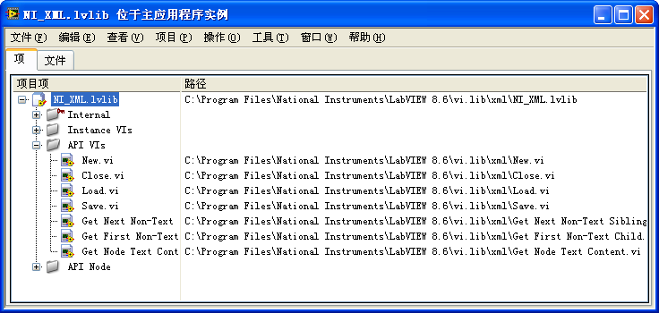

# 库

提到计算机软件中的"库"，最熟悉的概念可能是动态链接库。动态链接库是以DLL为扩展名的文件函数的库。一个DLL文件里包含了多个函数，它可以被其它应用程序调用。LabVIEW中的库是指VI库，它是以lvlib为扩展名的文件。它在逻辑上包含了一组相关的VI，以及相关的其他文件、配置信息等。

## 创建库

在项目浏览器的窗口中点击鼠标右键，选择"新建-\>库"即可创建出一个新的库。

凡是可以在项目中创建的文件类型，也都可以在库中创建。库中文件较多时，应当把文件分门别类地分别放置在不同的文件夹内（图
9.11）。

图 .11库中文件的组织结构

## VI的名字空间

一个不属于某个库的VI，VI名就是文件名。VI名会在VI窗口的标题栏中显示出来。如图
9.12所示。

图 .12 VI名

VI一旦放入某个库中，它的VI名就会发生改变。库中VI的名是库文件名加上VI的文件名。如图
9.13所示，一个名为"New.vi"的VI若放在库"NI_XML.lvlib"中，则它的VI名就成了"NI_XML.lvlib:
New.vi"。库文件名与VI文件名之间是用冒号分隔开的。

由于库中VI的VI名带有库名信息，所以在不同库中的两个同文件名VI，它们的VI名还是不相同的。这样，LabVIEW就可以根据不同的VI名来区分它们。即便是在同一个项目内，也可以存在两个文件名相同的VI，只要它们所属的库不同就可以了。

图 .13 VI名由库文件名和VI文件名两部分组成

库是可以嵌套的，即一个库可以包含另一个库。在这种情况下，库中VI的名字就会有多个库的前缀，例如"aaa.lvlib:bbb.lvlib:ccc.vi"。但是，多个层次的库管理起来很容易出现混乱，建议读者不要使用嵌套的库。

在图
9.13中，VI名在VI的标题栏中显示在一对方括号内。在VI运行时，方括号中的VI名是不会显示的，取而代之的是"新建"这个名字。这是因为，在VI的属性对话框的"窗口外观"一页中，设置了VI运行时显示的标题。设置了窗口标题之后，在标题栏上，VI名便会显示在方括号内。

## 为库中VI设置权限

大型软件维护难度大的原因之一是模块、函数（VI）之间的调用关系非常复杂混乱。改变程序中的某一处，很可能引发出一大堆无法预料的问题。

笔者曾经编写过一个解析某文件格式的模块，用户是同一大项目中其它模块的编程者。在这个模块中只允许用户使用几个接口的VI：如打开文件、读数据、保存、关闭等。但是，模块一旦提供给用户，就很难限制用户的使用范围了。用户发现这个模块中有几个底层VI恰好是他所需要的，尽管明知道使用底层VI可能存在风险，也会心存侥幸直接拿这些底层VI来使用。

后来，在这个功能模块的新版本中，某些底层VI的实现被做了修改。虽然模块的接口VI没有改变，但是底层VI有的换了参数、有的换了名字、有的甚至已经放弃不再使用了。那些用户编写的、使用了原来的底层VI的程序，也就随之出现了问题。新模块刚发布，马上就有用户抱怨，说新版本的模块丢失或某些VI改动了，导致了他们的程序无法运行。

VI库的出现解决了这个问题。LabVIEW允许开发者设置VI库中VI的访问权限（图
9.14），VI的访问权限可以是公有或私有。公有VI可以被所有其它VI调用，私有VI只能被同一库中的其它VI调用。对于包含了较多VI的库而言，也可以直接设置虚拟文件夹的访问权限，这样就不用再分别设置每个VI的权限了。

图 .14设置库中VI的访问权限

在VI库中，作为接口的VI应当被设置为公有；而所有底层的VI，以及不希望被其他人使用的VI都应当被设置为私有。这样一来，用户拿到这一模块后，即便发现某一底层VI的功能满足他的要求，也不可以直接调用这一VI。而库的开发者在发布新版本时，完全可以尽情修改底层的私有VI，因为库中所有的私有VI都绝对不会被他人所使用。只要公有的接口保持不变，就能确保整个项目不会因为模块的修改而出现错误。

## LLB文件

以llb作为后缀名的LLB文件在LabVIEW的早期版本中就使用了。它是一种压缩文件，一个LLB文件中包含有多个VI或其他类型的文件。通常，需要新建一个文件时，自然就会想到选中菜单"文件-\>新建"。可是，在LabVIEW
8.0之后，在"新建"菜单中是看不到LLB这种文件类型的。要创建或者管理一个LLB文件，首先要选择"工具-\>LLB管理器"。在打开LLB管理器之后，再在它的菜单中选择"文件-\>新建LLB"，创建出一个新的LLB文件。在LLB文件中添加或删除VI，也要通过LLB管理器完成。

从以上的介绍可以看出，LabVIEW中的LLB文件与库有类似之处，它们都是由一组VI组成的。但实际上，这两个概念的区别相当大。

LLB文件包含的一组VI是在物理意义上包含了一组VI。LLB在磁盘上就是一个文件，它内部的VI都在这个文件中，需要通过LLB管理器来查看。由于LLB文件是压缩了的，它可以节省一定的磁盘空间。但是，随着计算机存储介质容量的迅速膨胀。LabVIEW程序的存储空间已经不再是一个需要考虑的问题了，压缩VI也就不再具有诱惑力了。

而库所包含的一组VI仅仅是逻辑上的包含。在项目浏览器中，可以看到库中所属的VI。但这些VI仍然是以独立的文件形式存在于磁盘上的。它们的存储路径也不受库文件的约束。

LLB文件内部的VI没有层次关系，所有VI或其它文件都是平级存放的。这样一来，文件多了，就不能直接看出他们的调用关系。而在VI库中可以建立虚拟文件夹，更加合理地组织文件之间的关系。

LLB内部VI名的长度是有限制的，文件名太长会被自动截断。

LLB是一个单一文件，使用它不利于源代码控制。LLB中的某一个VI被修改，整个LLB也就被修改了。这样，一是没办法作增量存储，二是不容易直接确定是哪个VI被改动了。

由于历史原因，LabVIEW自带的大量功能模块、示例等仍然是以LLB文件的形式提供的。在短时期内，这一状态恐怕也不会发生根本的改变。但是基于上述LLB文件的缺点，在开发新的LabVIEW项目时，应当尽量避免使用LLB文件，而代之以使用库，充分利用库的管理软件功能模块的优点。