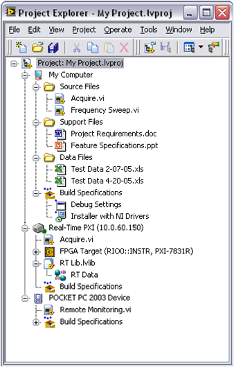
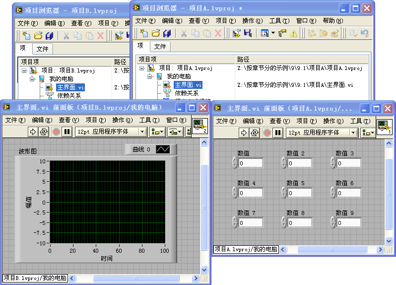

# 项目浏览器

## 项目浏览器的功能

项目浏览器中的内容是按树形结构分层次显示的，它们表示了程序中 VI 的调用层次关系。右键点击一个子 VI 的图标，选择 "显示 VI 层次结构" 或者打开 VI 的菜单 "查看 -\>VI 层次结构" 可以查看到调用该 VI 的上层 VI，以及该 VI 调用的子 VI。但与 "VI 层次结构" 窗口相比，项目浏览器中条目的组织结构可以由编程者自行调整，可以被更加合理有序地组织起来。

在项目浏览器的 "文件" 页中，可以直接调整文件存放的磁盘位置，而不必再另外打开操作系统提供的文件浏览器。

在项目浏览器中可以集成源代码管理功能，不再需要使用源代码管理工具提供的界面了。源代码管理工具是用来进行软件源代码版本控制的。大型软件开发通常需要这样的工具，用来记录每一次代码的修改。同时，源代码管理工具有利于开发同一软件的不同版本，并方便多人同时对同一段代码进行修改。

## 项目中的层次结构

图 .1 项目浏览器窗口

图
9.1 是一个项目浏览器的截图。它用一个树形的结构来表示工程中所有的 VI、各种组件和文件设置等，并可以表示它们相互之间的关系。

树形结构的最顶层是项目的名称。LabVIEW 的项目是一个后缀名为.lvproj 的文本文件。使用文本编辑器打开这个文件可以看到，它使用了 XML 格式来记录项目中包含的文件以及项目的属性。

第二层是项目运行的目标机器。假如计算机上只安装了普通台式机版本的 LabVIEW，那就只能看到一个目标："我的电脑"。LabVIEW 还可以运行在其它硬件设备上，比如 PDA、嵌入式设备、FPGA 等。假如计算机上还安装了针对这些设备的 LabVIEW 版本，比如：LabVIEW
RT、LabVIEW FPGA 等，那么在这一层还会显示出这些相应的目标设备。如图图
9.2 所示。

图 .2 包含有多个目标设备的项目

第三层中，除了 "依赖关系" 和 "程序生成规范" 之外，都是项目中所有使用到的文件和文件夹等。用户可以添加虚拟文件夹，按自己的喜好组织文件结构。LabVIEW 项目中常见的文件类型除了 VI（.vi）和控件（.ctl）之外，还有 VI 库（.lvlib）、LV 类（.lvclass）、Xcontrol（.xctl）等。在后面的章节中将会逐一讨论这些文件的功能和使用方法。

"依赖关系" 中显示的是那些虽然未在项目中出现，但是被项目中的 VI 所调用到的那些 VI。这些被依赖到的文件主要是那些 LabVIEW 自带的文件。如果被依赖的文件不是 LabVIEW 自带的文件（比如在 LabVIEW 路径之外的某个子 VI），那么在发布这个项目的时候就要考虑到用户的计算机上是否也会有这些被依赖的文件。如果用户的机器上没有，那么这个项目是无法在用户的机器上正常运行的。

在 LabVIEW
8.0 之前，若需要把 VI 源文件构建成可执行文件，需要使用工具菜单下的 "APP
Builder"工具。现在，这个工具也被集成到了项目浏览器中。在目标机器的最后一个条目" 程序生成规范 " 中包含了把源代码配置成为 EXE、DLL 等的信息。

LabVIEW
8.0 之前的版本中，那些保存 VI 的高级选项，比如添加密码、移除 VI 前面板、程序框图等选项，以及其它一些与运行有关的选项，例如禁止调试、自动弹出错误框等选项，也都一块儿被合并到了 "程序生成规范" 中。

## 文件结构

一个大型项目往往包含了很多文件，为了更方便地找到这些文件，通常应该把相关的文件组织在一起。在项目浏览器中，可以创建虚拟文件夹，以便把同一类的文件放在相同的虚拟文件夹下。而且，虚拟文件夹是可以嵌套的。

项目浏览器中的虚拟文件夹可以对应于一个真实的磁盘上的文件夹。首先创建一个虚拟文件夹，接着在新建的虚拟文件夹右键菜单中选择 "转换至自动更新的文件夹"，然后在弹出菜单中选取一个需要对应的真实的文件夹。这样，项目中的这个文件夹便会与被选择的真实文件夹保持同步。改变项目浏览器中这个文件夹内的 VI，磁盘上对应的文件夹中也会做出对应的修改；反之亦然。

项目浏览器中的虚拟文件夹的路径与磁盘上的文件夹的真实路径也可以是不同的。硬盘上不同地址的文件可以被放置在项目中同一虚拟文件夹内；反之，同一路径下的文件也可以被放置在不同的虚拟文件夹内。在项目浏览器窗口的菜单中选择 "项目 -\> 显示项路径" 可以显示出项目中每个文件的真实路径。

## 按照文件的物理结构来查看项目

在需要创建一个新的类似项目，或在版本备份时，程序经常会被来回复制。在这个过程中，很可能会引起子 VI 的错误链接。比如，项目里本来应该使用的是 Project
One 文件夹下的某一个子 VI，但实际上却链接到了 Project
Two 文件夹下的一个同名 VI。遇到这类错误，我们可以打开文件的路径显示，查看每个文件的真实路径，然后就可以修改那些链接错了的文件了。

项目中文件较多的时候，要一条一条查看每一个文件的真实路径是很麻烦的。这时，可以按照文件的物理结构来查看项目中的文件，检查每个文件的路径是否正确。进入 "文件" 选项卡，就可以看到项目中按照文件的真实路径组织起来的文件。只要在这里检查一下，看是否出现了不应该出现的文件夹，就可以判定是否出现了错误链接。比如图
9.3 中的项目，所有文件都应当在文件夹 "Project
One"中。而项目中却出现了"Project Two"，那一定是在某处出现了链接错误。

图 .3 按照文件的物理结构查看项目

如果某些文件存放的路径不恰当，需要调整，我们可以直接在项目浏览器中调整，而不再需要打开文件浏览器进行修改。在 "文件" 选项卡中直接拖动文件，即可改变它们的路径。

## 源代码管理

对于多人开发的大型项目而言，源代码管理是必不可少的。源代码管理的主要功能包括：源代码备份，版本控制，源代码合并等。LabVIEW 虽然不具备源代码管理的功能，但是它可以方便地调用常见的源代码管理工具（比如：Perforce、Virtual
SourceSafe 等）来实现以上的功能。

以 Perforce 为例，如果你的计算机上装有 Perforce 软件的客户端，则在图
9.4 所示的 LabVIEW 的选项对话框的 "源代码控制" 页上就可以选择 Perforce 作为源代码控制工具。

图 .4 配置源代码控制工具选项

在选项页中配置的信息是作用于所有 LabVIEW 项目的全局设置。如果某个项目需要有特殊的配置，还可以在这个项目的属性对话框中配置项目的特殊源代码控制设置（图
9.5）。

图 .5 项目属性对话框中有关源代码控制的选项

配置好源代码控制工具，就可以直接在 LabVIEW 的项目浏览器中使用源代码控制功能了。这时候再打开 LabVIEW 的项目，会发现文件的图标上多了个小方块，有的小方块上还打了红色的勾，这表示文件的不同状态。已经存在于源代码控制服务器上的文件会显示出小方块；已经签出的文件，即在本机上可以进行修改的文件会被勾上红色的标志（图
9.6）。

开发人员可以通过使用项目浏览器的工具条上相关的按钮或项目浏览器中文件的右键菜单对项目中的文件进行源代码管理。比如，可以完成从服务器上签出、把新版本上传至服务器等操作。

图 .6 源代码控制功能

## 比较和合并 VI

有了源代码控制，就可以把一个 VI 开发过程中不同的版本都记录下来。这样，编程人员就可以根据需要随时回复到以前的某个版本。还可以比较当前版本和上一版本的不同之处，帮助开发者判断最近所作改动是否正确。倘若最近所作的改动不正确，便可以放弃当前的版本，改而使用以前的某个稳定版本。

在项目浏览器中的 VI 的右键菜单中选择 "显示差别"，即可把当前版本的 VI 与它的上一个版本进行比较。对于没有安装源代码控制工具的计算机，是不会有 "显示差别" 这个选项的。在 LabVIEW 的菜单中选择 "工具 -\> 比较 -\> 比较 VI"，也可以对这两个 VI 进行比较（图
9.7）。

VI 的比较结果以文本的方式显示在 "差别" 对话框中。对于 LabVIEW 来说，以文本表述其代码并不直观。在差别对话框的 "详细信息" 栏中双击显示出来的条目，LabVIEW 就会把有差别的区域分别在两个 VI 上显示出来。

图 .7 比较 VI

如果是多人同时开发一个项目，有可能会出现两人同时修改了某一个 VI 的情况。也许两个人的修改都是必要的，不可以被丢掉（假设两个人的修改并非完全重复）。那么，可以利用 LabVIEW 的合并工具（菜单 "工具 -\> 合并 -\> 合并 VI"）把两个 VI 的不同之处合并起来（图
9.8）。

图 .8 合并 VI 工具

## 运行环境

打开项目中的一个 VI，项目的名字和运行目标会出现在 VI 的左下角，如图
9.9 所示：

图 .9 VI 上显示的项目名称

使用过 8.0 之前的 LabVIEW 版本的读者应该知道，老版本的 LabVIEW 是绝对不允许同时打开两个文件名相同、但内容不同的 VI 的。这其实很容易理解。VI 就好比是文本语言中的函数，如果两个函数的名字相同，就无法确定究竟应该使用哪一个。但这毕竟带来了不方便之处。比如，我们需要同时运行两个程序，它们最顶层的 VI 名字都是 "主界面.vi"。这是一个非常常见的 VI 名称。但是这两个 VI 的代码并不相同。为了让这两个程序同时正常工作，应该允许在这两个程序内分别使用两个文件名相同，但内容不同的 VI。

项目除了方便用户进行文件管理之外，还有一个功能就是为项目中的 VI 提供了一个独立的运行环境。不同运行环境之间的 VI 不会相互影响，这样就可以同时打开属于不同环境下的同名 VI 了（图
9.10）。

图 .10 不同项目中的同名 VI 可以被同时打开

有时候，在同一项目内，也希望使用同名的 VI。比如说，一个项目中需要控制两台不同的仪器，那么就需要有两个不同的 "初始化.vi" 来分别初始化两台设备。但是，如果直接使用两个同名的普通 VI，程序还是无法区分它们。解决的办法就是把它们放到不同的 "库" 中，在不同库中的同名 VI 还是可以被 LabVIEW 区分开的。