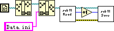
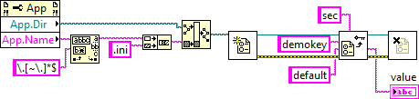
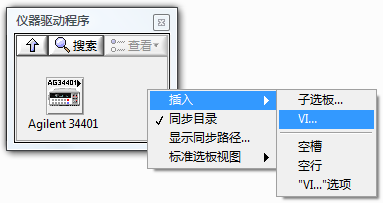
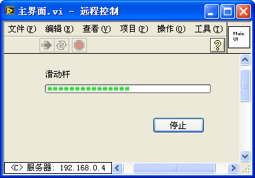
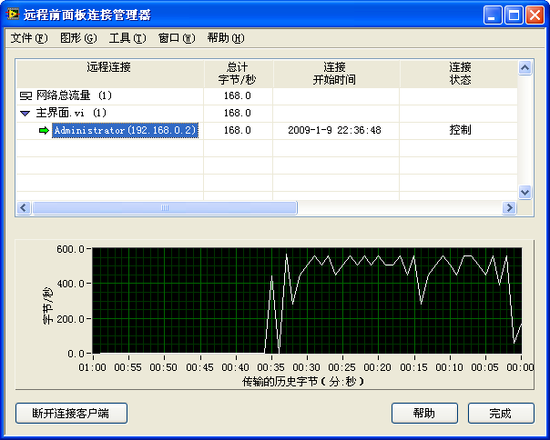
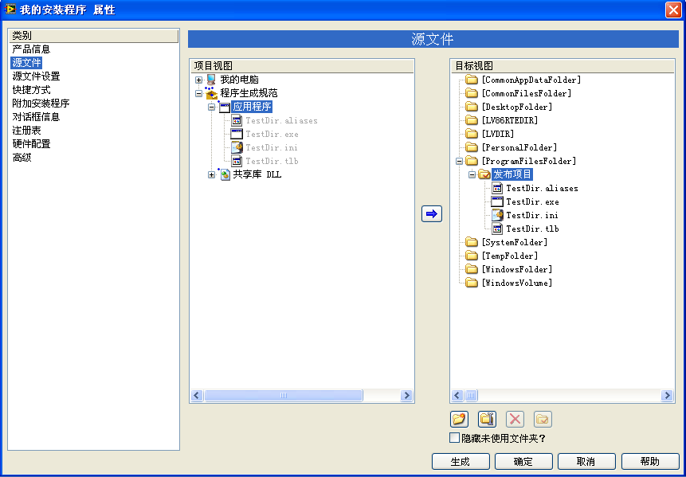

# 发布产品

LabVIEW 软件开发结束后，在交给用户时有几种常见的形式。比如，可以把软件的源文件，即开发时使用的 VI 直接交给用户。用户在 LabVIEW 环境中打开这些 VI 就可以执行。如果用户没有 LabVIEW 开发系统，可以把软件做成 EXE 可执行文件的形式，交给用户。这样，用户直接双击 EXE 文件就可以运行软件了。

LabVIEW 提供给用户的软件发布工具也集成在项目浏览器中。项目浏览器中的 "程序生成规范" 就是用来配置项目发布方法的。在程序设置规范的右键菜单中选取 "新建"，可以看到程序有六种发布方法（图
9.15），分别是：应用程序、安装程序、共享库、源代码、web 服务和 zip 文件。

图 .15 设置项目发布方法

## 应用程序

### 应用程序生成规范

在程序设置规范的菜单中选择 "新建 -\> 应用程序"，就会弹出图
9.16 所示的程序设置规范的属性对话框。"应用程序" 设置规范用于生成一个 EXE 可执行文件。倘若某个项目有一个主 VI（一般是程序的主界面），其它所有 VI 都是它的子 VI。那么在 "应用程序" 属性对话框的源文件属性页中把主 VI 设置为启动 VI 即可。LabVIEW 会自动把所有主 VI 静态调用的子 VI 都加入 EXE 文件中。

图 .16 应用程序设置

如果项目中有动态调用的子 VI，LabVIEW 是不会自动把这些子 VI 加入 EXE 文件的，必须由开发人员手工把这些 VI 加入到项目 "始终包括" 的文件列表中。

### 文件路径的变化

如果在程序中，有动态调用 VI，或者有读写某些文件的子 VI，那么程序中必然会有关于这些 VI 或文件的路径信息。在把程序生成为可执行文件后，这些文件的位置和路径常量的值可能会发生变化。这带来了一个问题：在开发状态下运行正常的程序，生成为可执行文件后，也许不能正常运行了。

图 .17 文件路径设置

以图
9.17 中的程序为例，其功能是打开一个与当前 VI 同文件夹的 "Data.ini" 文件。但是，在把该项目制作成可执行文件后，运行这一可执行文件，就会发现 Data.ini 并没有被成功读写。为了查看错误是如何产生的，可以对程序稍作改动，让它把当前 VI 以及 Data.ini 文件的路径显示在界面上（图
9.18）。

图 .18 在程序界面分别显示出 VI 和数据文件的路径

为了便于比较，可以把开发环境下的 VI 所在的文件夹放在 "C:\\9.3\\"，而设置生成的应用程序文件命名为 TestDir.exe，所在文件夹放置在 "C:\\9.3\\ 应用程序 \\"（图
9.19）。

图 .19 设置生成的应用程序的路径和文件名

依次在开发状态下直接运行 VI 以及运行 VI 生成的可执行文件，分别观察显示出来的 VI 和数据文件的路径（图
9.20）。

图 .20 左图为直接运行 VI；右图为运行可执行文件

可以看到，在开发环境下，运行 VI，得到的 VI 路径即真实的 VI 路径，数据文件与 VI 在同一文件夹下。但是在生成可执行文件之后，VI 文件就不存在了。这时候显示出来的 VI 路径是一个虚假的路径。它显示 VI 路径在 exe 文件的下一层。倘若把 exe 文件看作是一个 "文件夹"，则 VI 位于这个虚拟的文件夹中。尽管显示出来的数据文件仍然和 VI 位于同一级，但真实的数据文件显然不可能位于 EXE 文件 "内部"。因此可以肯定，这时使用相对路径运算出来的数据文件的路径是错误的。

这个问题的解决办法有两种。简单的方法是，在编写程序时，始终把主 VI 放在某一子文件夹下，比如放在一个叫做 "C:\\9.3\\MyApp\\" 的文件夹下，数据文件也放在与 "MyApp" 同级的路径下，即文件夹 "C:\\9.3\\" 下。这样在程序中保存的数据文件的相对路径就是 "..\\..\\data.ini"。程序生成 EXE 文件之后，数据文件与 EXE 文件在同一路径下，这时该相对路径仍然正确。

另一个更为灵活的解决方法是，在程序中首先判断当前是在开发环境下运行 VI 呢，还是在运行生成的可执行文件，针对这两种不同的状态分别采用不同的路径运算方法。在上面的例子中，其实是希望数据文件与生成的 EXE 文件在同一文件夹下。那么，这时只需要再得到 VI 的更上一层的路径就可以了（图
9.21）。

图 .21 在不同的运行方式下，得到不同的路径

判断当前的运行方式，可以使用 "应用程序" 的 "类别" 属性。如果该属性的值为 "Run
Time
System"则表示当前正在运行一个 EXE 文件。需要注意的是，在开发环境下，同一项目中的 VI 可能在不同的子文件夹中，文件夹可以有多个层次。但是生成可执行文件后，所有的 VI 都处会在同一级目录中，即以 EXE 文件作为虚拟文件夹的那个" 文件夹 "中。VI 的路径全部是类似"C:\\xxx\\xxxx.exe\\xxx.vi" 的形式。

还有一种更为简单的处理方式，就是干脆把项目中所有的数据文件都放在 VI 的上一级目录中。这样，程序就不需要做任何处理，在生成 EXE 文件之后，数据文件正好对应地放置在 EXE 文件所在的文件夹中。

LabVIEW 生成的 EXE 文件在运行时，都会自动生成一个同名的 INI 文件，如果程序中有任何需要配置的信息，可以保存这个 INI 文件中，不必另外再使用一个 INI 文件。EXE 文件的名字是可以改变的，所以在程序中不能使用固定的 INI 文件名，而是应当根据当前 EXE 文件的名称来决定 INI 文件的名称。在程序中使用 "应用程序 -\> 目录路径" 和 "应用程序 -\> 名称" 两个属性可以得到当前 EXE 文件的路径和文件名。如图
9.22 所示。

图 .22 通过 EXE 文件名得到 INI 文件名

LabVIEW 有一个路径常量："'VI 库 ' 路径常量"。它常被用来定位 LabVIEW 开发环境自身的路径。比如程序需要读取 "LabVIEW.ini" 文件中的信息，可以使用图
9.23 的方法得到该文件路径。

图 .23 得到 LabVIEW.ini 文件的路径

若是在 LabVIEW 开发环境中，'VI 库 ' 路径常量表示的是当前 LabVIEW 安装路径下的 vi.lib 文件夹所在路径。但是生成可执行文件后，EXE 文件的运行就脱离 LabVIEW 开发环境了。所以程序无法判断电脑上是否有 LabVIEW，以及它的位置。"VI 库" 路径常量将返回空值。

一般来说，在生成 EXE 文件之后，程序就不应当再依赖 LabVIEW 开发环境下的任何文件了。但是如果程序中必须得到 LabVIEW 开发环境所在的文件夹，可通过读取注册表来得到。LabVIEW 安装信息写在在注册表中的键值是固定不变的。

### 其它设置

作为专业的应用程序，还需要为其制作一个漂亮的图标，设定版本信息等。这些操作也都可以在程序生成规范中设置。它们的使用方法较为直观，本书就不再复述了。

在真正生成应用程序之前，可以先进入生成规范属性的 "预览" 页面预览一下。预览页会列出将要生成的所有文件和它们的路径，预览可以帮助编程者在真正生成大量文件前验证生成规范的配置，如所包含的源文件和生成路径等是否正确。

## 共享库

有时候，由 LabVIEW 编写出来的程序未必是有界面的应用程序，而是一些供其它非 LabVIEW 编写的程序调用的子函数。在这种应用情形下，最常见的方法就是把 LabVIEW 项目的 VI 做成 DLL，项目中每个需要供其它程序调用的 VI 成为 DLL 中的一个输出函数。

图 .24 配置 DLL 的导出函数

在程序设置规范的菜单中选择 "新建 -\> 共享库"，在属性对话框源文件页可配置生成共享库。

生成可执行文件只需要选择启动 VI 就可以了。但是生成共享库 DLL 文件，一般一个 DLL 中包含有多个导出函数。项目中，需要在 DLL 中被使用的 VI，都应当被放置在对话框的 "导出 VI" 一栏中。

将项目中的某个 VI 置入 "导出 VI" 栏，或点击 "定义原型" 按钮，即可在 "定义 VI 原型" 框中配置选中的导出 VI（函数）的属性（图
9.24）。VI 在转变成 DLL 函数的时候可能需要做一些手工配置。比如说 VI 名可以是中文，但函数名必须是英文，所以当 VI 名中包含有非法的函数名字符时，需要手工更改函数名。函数中参数的名称也有类似问题。

DLL 函数的数据类型也与 VI 的控件数据类型有所差异。比如说字符串，在 VI 中字符串的长度信息是包含在字符串数据中的，而 DLL 中函数的字符串通常以 char\* 类型表示，它不包含长度信息。通常在 DLL 函数中需要传递字符串的时候，同时还需要用另一个参数表示字符串的长度。

LabVIEW 在生成 DLL 文件的同时，还会生成相应的.h 文件和.lib 文件，供其它程序调用这个 DLL 时使用。如果需要把 VI 制作成 DLL 中的导出函数，应当尽量采用基础数据类型，比如字符串，数值类型等等。如果 VI 中使用了复杂类型，比如簇等，在生成的 DLL 函数中会使用 LabVIEW 的特殊数据类型，它们会被定义成名为 "TD1"、"TD2" 等的结构类型。在文本语言中处理这些数据类型是比较麻烦的，必须使用 LabVIEW 提供的相应的 C 接口 API 函数才可以处理它们。所以，为了简化使用 LabVIEW 生成的 DLL 的难度，应当尽量使用简单数据类型作为函数参数类型。

## 源代码

### 发布源代码

某些时候，开发人员编写的程序是直接以 VI 的形式提供给用户的。比如，在 LabVIEW 众多的工具包中，大多数都是以 VI 的形式提供的。但是发布给用户的 VI 与开发时的 VI 还是有所不同的，最常见的区别包括：为了保护产权，发布给客户的 VI 有时需要加密码，禁止用户查看其程序框图；为了加快客户应用程序的运行速度，需要禁止 VI 的调试功能等。使用 LabVIEW 的源代码发布功能可以便捷地完成以上的修改。

图 .25 设置源文件发布时 VI 的属性

使用这一功能时，在 LabVIEW 的程序生成规范中选择 "新建 -\> 源代码发布"。它的配置与共享库相类似，也需要指定哪些 VI 会最终包含在发布包中。其不同之处是，源代码发布直接把 VI 提供给用户，不需改变参数信息类型等。但是，源代码发布需要在 "源文件设置" 页中设置发布给用户的 VI 的属性。在项目文件列表中选中一个 VI，即可以在这个页面右半部份为其设置密码或修改其发布后的文件名。其它更多属性出现在点击 "自定义 VI 属性" 按钮后弹出的对话框中（图
9.25）。默认情况下，发布的 VI 属性都保持原 VI 属性不变。若需要改变，只需要更改一下属性相应的复选框即可。

为了进一步提高发布给用户的 VI 的运行效率，以及确保程序框图不被他人所窃看，可以选择移除 VI 的程序框图和前面板。在 LabVIEW
7.1 以及之前的版本中，选择 VI 菜单 "文件 -\> 另存为..." 的时候可以选择改变 VI 的某些属性，以及移除前面板、程序框图等。在 LabVIEW
8 之后，这些设置都被挪到发布源代码的生成配置规范中来了。在移除 VI 前面板时需要注意：只有那些从不显示界面的子 VI 才可以被移除前面板。被移除了程序框图的 VI 只能工作在特定的 LabVIEW 版本上。比如，在 LabVIEW
8.5 上移除了某个 VI 的程序框图。那么，这个 VI 今后就只能工作在 LabVIEW
8.5 上了。而在 LabVIEW
8.6 或其它版本中是无法使用这个 VI 的。因此，倘若发布的 VI 还需要在将来的 LabVIEW 新版本上继续使用，即便需要保护程序框图，也只是给 VI 加上密码，而不是移除程序框图。

在发布产品，生成.exe 文件时，启动 VI 栏目中可以包含多个 VI。这样生成的 EXE，在启动时，会同时打开多个 VI 的面板。

### 编辑控件选板和函数选板

需要发布源代码的 VI 一般是一些提供给用户编程时使用的子 VI。为了方便用户在编程时选用这些 VI，可以把这些 VI 加入函数选板。

把 VI 添加到函数选板上，有两种方式。

第一种是自动添加方式。只要把 VI 放置在 \[LabVIEW\]\\user.lib 文件夹下，LabVIEW 就会在函数选板 "用户库" 中显示出此 VI。用户编程时可以从这里选取使用此 VI。user.lib 文件夹下，以下横线作为名字开头的文件和文件夹会被 LabVIEW 忽略，不会被添加到函数选板上。

第二种方式是手工添加 VI 至函数选板。在菜单中选择 "工具 -\> 高级 -\> 编辑选板"，这时屏幕上会出现三个对话框，其中一个是控件选板，一个是函数选板，最后一个是控制用的 "编辑控件和函数选板" 对话框。这时的控件与函数选板不再用于选取控件和函数，而是用于编辑使用。右键点击控件或函数选板上的图标或空白处，会出现编辑选板的菜单。

如果需要把一个 VI 放置在函数选板某一处，可以选择右键菜单中的 "插入 -\>VI"。在弹出的 "选择需添加的 VI 或目录" 对话框中，输入一个 VI 的全路径，这个 VI 就被添加到函数选板上了（图
9.26）。

图 .26 在函数选板上插入 VI

编辑好函数选板，在 "编辑控件和函数选板" 对话框上点击 "保存改动"（图
9.27），这时 LabVIEW 会提示即将做出的改动。控件和函数选板每个子选板的设置被保存在名为.mnu 的文件中。点击 "继续" 就会使刚刚完成的编辑生效。编写程序时，在函数选板上就可以选取刚刚放置上的 VI。

图 .27"编辑控件和函数选板" 对话框

大多数情况下，从控件或函数选板上拖拽某个图标至前面板或程序框图，会在程序框图上添加一个控件、函数、子 VI 或其它节点。但有些选板上的图标可以往程序框图或前面板上添加多个对象，甚至是一段完整的程序。比如，选择函数选板下的 "Express-\> 执行过程控制 -\>While 循环"，可以程序框图上添加一个 While 循环，并在 VI 前面板上添加一个 "停止" 按钮控件用于控制这个循环的停止条件。

实现这样的功能非常简单。先写好一个 VI，其中包含所有将来打算放置到目标 VI 上的程序框图和控件。比如实现函数选板 "Express-\> 执行过程控制 -\>While 循环" 的功能，先要编写一个 VI，它有一个 While 循环和一个 "停止" 按钮控件用于控制循环的停止条件。把这个 VI 保存下来，取名 "MyWhile.vi"。然后编辑函数选板，把这个 VI 插入函数选板。保存改动之前，在函数选板上右键点击这个 VI，选择 "放置 VI 内容"，然后保存改动（图
9.28）。

图 .28 函数选板上 VI 的 "放置 VI 内容" 选项

以后编程时，从函数选板上拖拽这个 VI 至程序框图，放置在程序框图上将不是作为子 VI 的 "MyWhile.vi"，而是直接把 "MyWhile.vi" 中的内容放置在目标 VI 上。于是目标 VI 上就多了一个 while 循环和一个 "停止" 按钮。

本书在第 4 章介绍了多种常用的程序结构模式，其中有些模式非常常用，比如循环事件、循环条件等结构。可以为这些结构编写一些模板 VI，然后以放置 VI 内容的方式把它们插入函数选板。这样，再编写程序时，在函数选板上选取这些结构模式的图标，就可以在当前 VI 上直接添加上这些模式。

## 网络应用

### 远程前面板

有时候，操作人员需要控制在远程计算机上运行的程序。比如，在生产车间的计算机上运行着直接从机床上的传感器上读取数据的程序；而在另一间办公室的监控人员需要实时观察程序读出的数据，并对异常数据做出及时的处理。解决这样的问题可以有多种办法。传统方式是在办公室和生产车间的电脑上各写一个程序，通过 TCP/IP 等协议，在两台电脑上传递数据。开发这样的程序是比较繁琐的。实际上，LabVIEW 提供了几种非常简便的方式，可以轻松控制远程计算机上的程序以及浏览远程计算机上采集的数据。这几种方法的原理是相似的，都是在运行程序或者执行功能的计算机上开设一个 web 服务。远程的计算机通过 web 服务得到数据或控制 VI 的运行。

如果两台电脑都装有同样版本的 LabVIEW，那么最方便的远程访问控制方式就是使用远程前面板。

使用远程前面板，首先要打开运行 VI 的计算机（服务器端）上的 web 服务功能：从 LabVIEW 的菜单中选择 "工具 -\> 选项"，在 "web 服务器：配置" 页面中勾选 "启用 web 服务器"。然后把需要被远程使用的 VI 打开（可以先不运行）。

在远程用于访问的计算机成为客户端。在客户端打开 LabVIEW，选择菜单项 "操作 -\> 连接远程前面板"。在弹出的连接远程前面板对话框（图
9.29）中输入开启了 web 服务的计算机的 IP 地址、以及需要访问的 VI 的名称。如果只是观察 VI 运行的结果，可以不勾选 "请求控制"。然后点击 "连接" 按钮连接服务器上的 VI 前面板。

图 .29 远程前面板正在进行连接

成功连接后，就会出现 web 服务器上的 VI 的前面板，并可以控制它的运行以及观察运行结果（图
9.30）。

图 .30 远程前面板

在 web 服务器一端，可以使用菜单中的 "工具 -\> 远程前面板管理器"，查看远程前面板的连接情况。如图
9.31 所示，这台服务器的 "主界面.vi" 正在被 IP 地址为 192.168.0.2 的机器远程连接。如果希望切断某一远程前面板，可以点击 "断开连接客户端" 按钮。

图 .31 远程前面板连接管理器

### web 发布

使用远程前面板的缺点是服务器和客户端都必须安装相同版本的 LabVIEW 开发软件。这样，它的使用就受到了一定的限制。实际上，作为客户端，用户并不一定需要使用 LabVIEW 开发环境的功能。LabVIEW 还提供了一种更为通用的 web 发布功能，可以让一台计算机像浏览网页一样查看和控制运行在另一台计算机上的 VI。

在运行 VI 的计算机（服务器）上，选择 LabVIEW 菜单 "工具 -\>web 发布工具"。在弹出的 web 发布工具的配置对话框（图
9.32）上选取需要发布的 VI，并启动 web 服务器。然后按照提示，一步一步生成一个 web 发布的 VI。

图 .32 web 发布工具

LabVIEW 会为这个 VI 生成一个 html 文件，放置在 web 服务器的根目录下。web 服务器的根目录在 LabVIEW 的选项中配置，默认路径为 \[LabVIEW\]\\www。

只要网络上的其它计算机打开网页浏览器，输入作为 web 服务器的计算机名或 IP 地址，即可看到 LabVIEW 的 web 服务页面。将需要被访问的 VI 在 web 服务器计算机中装入内存，在另一台计算机网页浏览器地址栏的 IP 地址的后面加上斜杠和刚刚生成的 html 文件的名称，即可访问和控制刚刚被选中的 VI（图
9.33）。

图 .33 通过网页访问 VI

### web 服务

web 服务与 web 发布之间的关系有些类似共享文件与应用程序之间的关系。通过 web 发布提供给用户的是一个带有界面的应用程序，用户可以在其它计算机上访问这一应用程序。而 web 服务并不提供用户完整的应用程序，它只是把一些 VI 的功能提供出来。这样，运行在其它计算机上的应用程序可以直接利用 web 服务提供的功能。

web 服务提供出来的功能是运行在服务器上的。在使用 web 服务时，客户机把需要调用的功能、所需的参数传递给服务器，服务器对其进行处理后把运行功能得到的结果再返回给客户机。

在程序设置规范的菜单中选择 "新建 -\>web 服务"，在属性对话框的源文件页，可配置生成服务 VI。

## 安装程序

图 .34 配置安装程序

生成应用程序和共享库之后，也许不能直接拿到其它计算机上使用。LabVIEW 生成的程序必须依赖 LabVIEW 运行引擎才可以使用，但很多计算机上可能并没有安装 LabVIEW 运行引擎。专业的软件通常会带有一个安装包，以帮助用户把软件的各个组成部分放置在目标机器正确的文件夹下，并生成启动菜单、完成写入注册表信息等等。

如果需要制作一个功能非常复杂的安装软件，必须依赖专业的安装包制作工具。但是，如果仅仅需要完成一些最基本的工作，比如创建启动项、在 "添加或删除程序" 工具中添加一个卸载项目等，使用 LabVIEW 的程序生成规范中就可以制作了。

在 LabVIEW 的程序生成规范中选择 "新建 -\> 安装程序"。然后在属性对话框的 "源文件" 页面选择需要安装至目标机器的文件（图
9.34）。被安装的目标机器上的文件可以是项目中的某个 VI，但更常见的情况是需要安装生成好的应用程序、共享库、源代码或者是 web 服务。因此，也可选择项目中其它生成规范生成的文件。

图 .35 选择需要安装的运行引擎

LabVIEW 程序的运行需要依赖 LabVIEW 运行引擎。为了在没有 LabVIEW 运行引擎的目标机器上也能运行安装好的 LabVIEW 程序，可以在 "附加安装程序" 中选取需要附带的引擎及其他组件（图
9.35）。LabVIEW 的引擎是比较大的，它可能会使你的安装包增加几十兆字节的空间。有时候，要发布的程序本身非常小，携带一个比它自身大几十倍的附加内容似乎并不划算。因此，如果能够确保目标机器有所需要的组件，不在安装包里携带运行引擎也是可以的。

## 压缩包

现在网上流行绿色软件。也就是不再为程序制作安装包，而是直接把所需的所有文件打包成一个压缩文件。LabVIEW 同样具有此功能。在生成规范中选择生成压缩包，然后把所需文件加入压缩包即可。

## 打包库

许多使用 LabVIEW 的工程师也使用过 Visual Studio 这个开发工具。使用 Visual
Studio 时，通常可以为一个软件产品创建一个 Solution，一个 Solution 可以包含多个 Project。这个软件产品可能由多个文件组成，比如说有一个 EXE，两个 DLL 组成，那么就可以为它们创建三个 Project。每个 Project 的源代码都是独立的，可以设置 Project 的编译方法。这样便于独立地分别开发每个 Project。各个 Project 之间是可以有依赖关系的。比如说，编译 EXE 的时候可以自动地把另外两个 DLL 先编译一遍。

而 LabVIEW 的 "项目" 这个概念是最近几年才有的，这方面的功能远没有 Visual
Studio 成熟。在 LabVIEW 中，只有 Project 这一级，而没有 Solution。这在开发大型程序时，可能会带来一些不便：所有的 VI 都只能放在一个 Project 中，最终生成的可执行文件是一个比较大的 EXE 文件，每次编译都要编译项目中所有的文件，很耗时；更为严重的问题是很难划分可独立开发的程序模块，所有代码都混在一起，不容易分别开发。

有些公司发布的产品不是可执行文件而是一个供其它程序调用的功能库。如果以 VI 的形式发布一个功能模块，这些 VI 源程序就必然被放置到用户的工程中去，这很不合理；如果以 DLL 文件的形式发布，在 LabVIEW 中调用 DLL 又很麻烦。

这个问题一直到 LabVIEW 2010 发布后才有所改善。LabVIEW 2010
增加了一种新的文件格式：打包库（英文：Packed Project
Libraries，文件名后缀：lvlibp)。这种文件格式兼有原来库文件（lvlib 文件）和 LLB 文件格式的一些优点，在模块化程序的时候，可以考虑使用 Packed
Project Libraries 。

打包库从名字上来看，就是被包装好了的库文件。
库是编程时候由程序员创建出来的。比如图 9.36 所示的这个工程，创建了一个叫做 "My
Algorithm Library.lvlib" 的库。它包含两个 VI，其中一个是私有的。

\
图 9.36 用于生成打包库的项目

而打包库则是通过一个项目的生成规范，从库编译而来的。比如图 9.36 所示的项目，鼠标右击 "程序生成规范"，可以选择新建一个 "打包库" 类型的生成规范。在这个生成规范中指定把 "My
Algorithm Library.lvlib" 编译成打包库（图 9.37）。

\
图 9.37 选择打包库中的内容

编译的结果是在指定的路径下生成了一个名为 "My Algorithm
Library.lvlibp" 的文件。它的后缀名仅比库文件多了一个字母 p。

双击这个文件，可以打开它，看到它里面包含的公有 VI（图 9.38）。

\
图 9.38 查看 Packed Project Library 中的内容

如果需要在其它项目中使用到这个打包库，可以直接把它加到另一个项目中去。如图 9.39 是一个演示项目。

\
图 9.39 使用 Packed Project Library

从使用者角度来看，打包库看上去和库非常相似，用法也完全相同。

打包库与库

- 都是将功能相关的一组 VI 封装起来的方法；
- 库中的 VI 可以具有层次结构；
- 库中的 VI 都带有名字空间，名字空间是带有后缀名的库名；
- 都可以方便地放在项目管理器里使用。

尽管它们十分相似，打包库与库相比，还是有一些明显区别的：

- 打包库是通过编译生成的；
- 打包库中的 VI 是编译后产生的，它们不能被修改；
- 打包库包含有私有 VI，但用户无法看到也不能使用它们；
- 打包库把 VI，.lvlib 以及其它用到的文件都打成一个压缩包，用户在磁盘上就只能看到一个.lvlibp 文件，看不到 VI 文件；
- 打包库很适合作为最终产品发布给用户使用；
- 在项目中使用打包库可以缩短编译时间，因为打包库中的 VI 是已编译好的，不需要再随项目编译一遍。这也要求打包库与使用打包库的项目是在同一版本的 LabVIEW 下编译的。