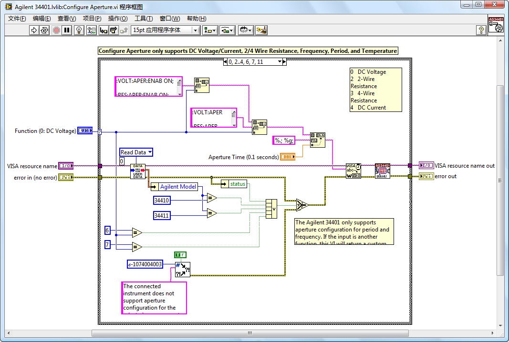
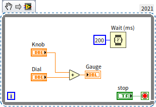

# 数据采集

数据采集通常是测试程序第一步需要做的工作。它负责从硬件设备得到表示物理量或信号的数据。

## 使用驱动程序

不论使用何种数据采集设备，如果该设备已经具备了专为 LabVIEW 设计的驱动程序，那么使用驱动程序会大大简化编程的复杂度。用于采集数据的硬件设备多种多样，包括了各种板卡式设备、传统仪器、嵌入式智能设备等。它们的驱动程序也各不相同。但是，它们的功能和使用方法大体是类似的：通过调用驱动程序提供的接口 VI 按顺序分别打开或初始化设备；对设备进行必要的配置；从设备中读出数据；最后关闭设备。

NI 公司出产的硬件设备一般都配有 LabVIEW 驱动程序，其它公司出产的硬件设备很多也带有 LabVIEW 驱动程序，用户可以联系该硬件厂商以得到相应的驱动程序。

对于比较常见的仪器设备，可以使用 LabVIEW 提供的 "查找仪器驱动程序" 工具来查找并安装其驱动程序。该工具位于 LabVIEW 的菜单项："工具 -\> 仪器 -\> 查找仪器驱动"。

图
7.12 是 "查找仪器驱动程序" 工具的启动界面。使用这个工具前首先要申请一个 ni.com 的登录帐号并登录，人后才可以按照厂商名和关键词来搜索仪器的驱动程序。图
7.13 是找到的结果。

图 .12 使用 "查找仪器驱动程序" 工具查找仪器驱动程序

图 .13 "查找仪器驱动程序" 工具的查找结果

## 使用硬件设备的 C 语言驱动程序

还有部分硬件设备可能没有提供 LabVIEW 驱动程序，但这些硬件设备一般会提供 C 语言驱动程序。C 语言的驱动程序一般以 DLL 的形式提供，DLL 中包含了控制硬件设备或读取数据所需的函数。同时驱动程序也会提供一个.h 头文件，用于声明驱动程序中函数的定义。

在 LabVIEW 中使用这种类型的驱动程序时，可以在应用程序中直接使用 CLN 节点来调用这些驱动程序函数。但是使用 CLN 节点并不直观。更好的方式是先把 C 语言驱动程序包装成 LabVIEW 驱动程序的形式，再在 LabVIEW 中使用。

简单的包装方式可以使用 LabVIEW 中的 "导入共享库" 工具，把 DLL 中的函数全部导入 LabVIEW，包装成 VI。在测试程序中使用以 VI 形式提供的驱动程序功能要比直接使用 CLN 方便得多。因为 VI 中可以包含更多的信息，比如关于函数功能的说明，参数的数值范围、功能等。

如果某个驱动程序使用的频率较高，就值得花些时间，把它设计得更为专业和易用。如果重新设计驱动程序结构，就可以不局限于把每个 DLL 函数包装成一个 VI，而是可以按照在 LabVIEW 下使用该仪器最自然的方式设计驱动程序中每个 VI 的功能。一个 VI 中也许会调用多个 DLL 函数。这样的 VI，功能可能会更强大一些。编写这类驱动程序时，可以参考在 LabVIEW 中使用的 IVI 仪器驱动程序，它们也是通过包装 DLL 的方式实现的。

## 编写驱动程序

某些不太常用或功能简单的数据采集设备可能没有提供任何形式的驱动程序，而是在程序中向仪器发送以字符串或数值表示的命令来控制这些仪器设备。

仪器设备通常使用 GPIB、USB、网线等数据线与电脑相连。在 LabVIEW 中向这些设备发送数据，可以使用 "仪器 I/O-\>VISA" 函数（图
7.14）。其中最常用的是 VISA 写入和 VISA 读取函数。

图 .14 VISA 函数

为 VISA 函数的 "VISA 资源名称" 参数指定正确格式的地址，就可以把一个数据发送到一台通过某种数据线与电脑相连的设备上。在 LabVIEW 帮助中有对这个资源名称格式的详细说明。

在应用程序中直接使用 VISA 函数与直接使用 CLN 节点一样，有其不足之处：不直观、配置繁琐。所以，对于没有驱动程序的硬件设备，可以自己为它编写驱动程序，然后再在应用程序中使用。所谓驱动程序，实际上也就是一组 VI，每个 VI 包含了硬件设备最常用的功能。仪器的常用功能一般由一个或数个命令构成。比如，需要从仪器中读取一个测量值，就必须先发送命令告诉仪器进行测量，然后发命令告诉仪器发送数据，再读出数据。与此相对应，一个驱动程序的 VI 也是由一个或多个 VISA 函数构成。图
7.15 是 LabVIEW 自带的 Agilent
34401 万用表的驱动程序中的一个 VI。在它的程序框图中，实现功能的主要部分就是通过 VISA 函数向仪器发送命令的。

图 .15 驱动程序 VI 的程序框图

编写驱动程序，首先要设计驱动程序的结构。结构中要包括驱动程序应当包含哪些 VI，每个 VI 的功能是什么，每个 VI 如何实现等。设计驱动程序应当参考已有的驱动程序或规范。毕竟，设计一个驱动程序的接口和结构也是需要花费一定时间的，如果直接采用已经设计好的接口，就省时省力多了。将来使用这一驱动程序的用户，也会因为它和其它驱动程序十分类似而缩短学习使用它的时间。

## 可互换虚拟仪器驱动程序

可互换虚拟仪器（Interchangeable Virtual
Instrument，缩写 IVI）驱动程序规范是由 IVI 基金会（Interchangeable Virtual
Instrument
Foundation）制定的一种仪器驱动程序规范。它最大的特点就是实现了仪器在程序运行时的可互换性。

如果在测试程序中使用普通的驱动程序，那么势必造成测试软件对硬件设备和驱动程序的依赖。如果把测试程序移至一台没有该驱动程序的电脑上，测试程序是无法运行的。如果另一台电脑上连接的仪器设备与第一台电脑连接的仪器不同，那么只能重新编写测试程序，使用新的仪器驱动程序。IVI 仪器驱动程序与普通仪器驱动程序的不同之处就在于，测试程序不需要重写或重新编译，就可以更换仪器设备，利用其它型号的仪器完成测试功能。

为了实现互换性，IVI 基金会将同类别仪器的共性提取出，并制定了每个类别的规范。比如，有示波器类的规范、数字万用表类的规范、频谱分析仪类的规范等等。每一类的仪器都有各自的 "类驱动程序"（IVI
Class
Driver）。类驱动程序包含了该类仪器通用的各种属性和操作函数。运行时，类驱动程序通过调用每台仪器的专用驱动程序（IVI
Specific
Driver）中相应的函数来控制仪器。比如，IviDmm 是数字万用表类的类驱动程序，而 fl45 则是针对 Fluke
45 这个型号万用表的专用驱动程序。

电脑上可能安装有同一个类型的多种型号仪器的专用驱动程序。类驱动程序应当调用哪一个专用驱动程序，可以在 IVI 配置文件中指定。安装 LabVIEW 时，还会同时安装一个叫做 "Measurement
&
Automation"（简称 MAX）的软件。这是 NI 公司专用于配置计算机硬件设备的应用软件，通过它可以比较直观地修改 IVI 配置文件中的设置。

图 .16 IVI 体系结构

为了实现仪器互换，在编写测试程序的时候，程序中调用的是类驱动程序。类驱动程序检查 IVI 配置文件，以确定应该使用的专用驱动程序。若系统中的仪器被更换，只需适当修改 IVI 配置文件，而应用程序无需任何改动，因而实现了测试系统的通用性（图
7.16）。

IVI 驱动程序相对于传统仪器驱动程序而言，更适用于高端应用和大型测试系统的搭建。比如，笔者曾经编写过一套校准程序，这套程序要满足多家不同的校准实验室使用。每个实验室所拥有的仪器都不尽相同，而为每个实验室编写一套单独的程序又效率太低。此时，使用 IVI 体系结构编写校准程序就是最好的选择。校准软件只需编写一份，而每个实验室只要在 MAX 中配置自己所拥有的仪器就可以使用这套校准软件了。

## 软件定时

LabVIEW 程序中，常常会遇到需要定时执行某一段代码的情况。按照定时的精度区分，有些程序对定时的精度要求很低。比如下图中这个程序：

它设定每 200 毫秒程序执行一次计算和刷新界面。这个程序对定时的精度要求是很低的，虽然它设定的是 200 毫秒，但实际上，即便时间出现 50% 的误差，都不会对程序运行产生什么影响。

但有些程序对定时的精度要求非常高。比如，在利用数据采集设备对信号进行采集时，其精度要求可能是前面提到的程序的数千倍以上。高速数据采集时，时间误差要求甚至于高达 10^-9^ 秒的级别。

### 定时函数和 VI

LabVIEW 程序若要完成定时功能，也有多种方法。最简单的方法是利用 LabVIEW 提供的几个定时函数和 VI。常用的几个与定时相关的函数或 VI 都在函数选板 "编程 -\> 定时" 中，包括 "时间计数器"、"等待"、"等待下一个整数倍毫秒"、"时间延迟" 和 "已用时间"。

图
3.8 中的程序使用了两个 "时间计数器" 来计算某一段代码执行所需的时间。如需定时，只要不停地检测当前时间，如果当前时间与上次执行任务间隔了特定的时间，就再次执行任务，这样就完成了定时功能。

"已用时间"VI 的用法和 "时间计数器" 类似，但是 "已用时间"VI 提供了更多的功能。

更简单的定时方法是直接使用 "等待"、"等待下一个整数倍毫秒" 或 "时间延迟" 函数，这三个函数的用法是完全相同的。它们可以分辨的最小等待或延时时间也是相同的：
2 毫秒。它们唯一的差别在于精度。"等待" 与 "时间延迟" 的精度是相同的，它们每执行一次的误差可达数个毫秒。"等待下一个整数倍毫秒" 的精度要高一些。

因此，像图
1.29 中的程序，不需要太高精度，使用 "等待" 与 "时间延迟" 均可。如果，是一个数据采集程序，精度要求不太高，可以考虑使用 "等待下一个整数倍毫秒" 函数。如果精度要求更高，则需要再考虑其它定时方法。

LabVIEW 程序中需要定时的时候，最常使用的方法是 "等待"
与 "等待下一个整数倍毫秒" 这两个函数（图 3.60）与循环配合。因此，下文将着重比较一下这两个函数。

\
图 3.60

"等待" 函数比较容易理解：给定一个输入参数
n 毫秒，每次程序执行到它的时候，它就会停下来，等待 n 毫秒，再继续运行后续程序。

"等待下一个整数倍毫秒" 函数稍微复杂一点：给定一个输入参数
n 毫秒，每次程序执行到它的时候，会暂停在这里，函数每隔 n 毫秒醒来一次，醒来后再继续运行后续程序。

一般情况下，若程序并不要求非常精确的计时，则 "等待" 与
"等待下一个整数倍毫秒" 的区别不大，选用哪个函数都可以。只有在计时精度要求较高的时候，才需要考虑它们之间的细微差别。

\
图：3.61 循环框内的定时函数

单纯解释概念比较抽象，还是用程序来演示一下。假设图 3.61 程序中 "Read Data"
和 "Write Data"
函数的运行时间都是 n 毫秒（在本章节随后的其它图例中，这两个子程序的运行时间均是 n 毫秒）。若
n\<50，在默认情况下，上图的两个程序，循环每迭代一次，所需时间大约都为 100 毫秒。

#### 精度

但是，两个程序的计时精度是不同的。在循环框内使用 "等待下一个整数倍毫秒"
函数的精度远高于使用 "等待" 的精度。

在 Windows 这样的非实时操作系统中，定时函数的精度是非常低的，每运行一次出现几毫秒误差是正常的现象。

使用 "等待"
函数，每次循环运行到它时才开始计时，因此单次的误差会被累积。假如每次误差四、五毫秒，迭代五次误差就可能达到十几毫秒了。

而 "等待下一个整数倍毫秒"
函数，并非是在每次调用的时候计算延时的。假设函数从 0 时间开始计时，那么程序一开始运行，它就知道自己每一次醒来的时间分别应当是：100ms，
200ms，
300ms......。假如误差是 ±4 毫秒，那么它实际每次醒来的时间就是 100±4ms,
200±4ms, 300±4ms......，这个误差不会被累积。

图 3.61 两种定时函数的累积误差

#### 第一次迭代的时间

运行下面两段程序，x-y 分别是多少呢？（忽略误差）

图 6.62 分别使用了 "等待" 与 "等待下一个整数倍毫秒" 函数的程序的运行时间

在使用 "等待" 函数的程序中，每延时一次，x-y 等于 500；延时了五次，每次 100 毫秒，那么总和就是 500 毫秒。

而在使用 "等待下一个整数倍毫秒"
函数的程序中，x-y 的值则每次都不确定，但是值的变化范围是确定的，在 400+2n
与 500 之间。这是因为 "等待下一个整数倍毫秒"
开始计时的时间并不是根据程序何时运行来确定的，也就是说，对于程序来说，这个时间是不确定的。虽然
"等待下一个整数倍毫秒"
函数可以保证每次醒来的间隔是 100ms，但它却不能确定第一次醒来的时间。第一次醒来可能是在 0\~100ms 之间任何一个时间。

如果程序要求循环第一次迭代就必须是精确的 100 毫秒，那么该怎么办呢？很简单，让 "等待下一个整数倍毫秒"
第一次睡眠时不做任何事情，从第二次才开始使用它就行了。图 6.63 所示的程序，每次运行，x-y 的结果可以确定是 500。

图 6.63 调整 "等待下一个整数倍毫秒" 函数起始时间

#### 并行与串行

在前面的程序里，延时函数与循环中其它的代码是并行的，这样，只要其它代码耗时很少，就可以认为循环每次迭代的时间就是由延时函数的输入参数来决定的。但有时候，延时函数需要与其它代码串行，比如必须在某两个节点之间延时。

图 6.64 串行方式使用 "等待" 与 "等待下一个整数倍毫秒" 函数

当串行的时候，再使用 "等待" 函数计时就不那么准确了。比如上图左面那个程序，它每循环迭代一次的时间变成了 2n+100。时间 n 是不确定的，它会受到电脑的配置，CPU 负荷等因素影响。因此，用这种方式计时误差很大。

而 "等待下一个整数倍毫秒"
只考虑每次醒来的间隔，至于什么时候进入休眠的，并不影响醒来的时间。因此，对于它来说，并行与串行的效果是完全相同的（2n\<100 时）。

### 使用事件结构

在事件结构中，有一个超时事件处理分支。若给予事件结构的超时接线端，传递一个正整数，比如 "25"，则 LabVIEW 会每隔 25 毫秒，自动执行超时事件处理分支中的代码。

利用事件结构的超时事件来定时，其精度与 "等待" 函数相当。如果程序中已经使用了事件结构，又需要定时功能，则首先可以考虑利用已有的事件结构框架。

例如，程序主界面需要显示一段动画片段，需要每隔 30 毫秒刷新一下动画的图像。程序已经使用了循环事件结构来处理界面操作，那么就可以直接在事件结构的超时处理分支中添加刷新动画图像的代码（图
3.60）。

图 .60 利用超时时间定时

### 定时循环

前面介绍的几种定时方法，其共同缺点就是精度太低。要得到更高精度的定时，必须借助专门的硬件设备（参考[数据采集](measurement_daq)）。

多数数据采集设备本身都带有硬件定时功能。所以，在使用数据采集设备时，通常不是由程序来控制每个采样点之间的间隔，而是直接设置数据采集设备的定时器，由数据采集设备自己控制每次采样的间隔时间。

但如果程序是在嵌入式设备上运行的，往往需要在软件中定时，并且精度要求又比较高。此时，可以使用定时循环结构。定时循环结构的精度远高于前面几种定时方式。在笔者曾经参与过的一个测试程序中，使用 "等待" 函数定时，运行一小时后，时间误差长达几分钟；后改用 "等待下一个整数倍毫秒" 函数，误差缩至一分钟之内；最后改用定时结构，误差缩短到了几秒钟。

此外，即使是在 PC 机上运行的程序，遇到需要精确定时、需要设定多个不同级别的多个定时、或者需要动态改变定时功能这三种情况，也应该考虑使用定时循环。

定时循环位于 "编程 -\> 结构 -\> 定时结构" 函数子选板中。该子选板内包括了 "定时循环"、"定时顺序" 等节点。它们的功能及用法比较简单，读者可以自行查阅 "帮助文件"，本书就不再一一详解了。

### 硬件定时

使用数据采集设备时，对于采样频率的设定是极其重要的。比如，程序要求每秒钟从数据采集设备中读取 100 个数据出来，即采样间隔时间为 10 毫秒。编程者可能很自然地想到，可以使用 LabVIEW 中的延时函数。在程序中放置一个循环，循环内加一个 10 毫秒的延时，每循环一次读一个数据即可。

但是，这样的程序有几个问题：一是在运行非实时操作系统如 Windows 的计算机上，延时函数可以支持的最低值也只有 1 毫秒，采样间隔低于 1 毫秒就无法使用这种方法了。二是使用延时的方法精度较低。比如把延时设置为 1 毫秒时，其误差极大，可能高达 1 毫秒的几十倍。而一般数据采集对于采样间隔时间的精度要求都是比较高的。再有，每采集一个数据就从读一次数据采集设备，在如此高的数据量下，是一种效率非常低下的做法。

实际上，一般的数据采集设备都是自带时钟的。它的时钟精度都比较高。所以，不应当使用软件的定时方法来设定程序的采样间隔，而是应当使用数据采集硬件设备上的时钟。硬件设备提供的驱动程序包含有采样间隔时间（有的设备称之为 "采样频率"）的设置，只需为它设置一个合适的值即可。而从硬件设备读取数据时，可以每次读一批数据以提高程序效率。

还是以前面的采集声音为例。如果程序需要持续采集音频信号并同时显示出来，就不适合使用 Express
VI 了。声音采集 Express
VI 只适合单次采集一定长度的音频信号。要完成这一连续采集，可以使用 "编程 -\> 声音 -\> 输入" 中的 VI。这些 VI 就相当于声卡的驱动程序 VI。

图
7.17 是一个简单的音频信号采集程序。程序中，首先使用 "配置声音输入"VI 设置采样频率为 22050，声卡硬件会根据这一数据配置自己的时钟。该程序设定了采样数为 5000。这样，声卡硬件每读取完 5000 个数据后，就会一次性把这些数据读入内存。程序再把这些数据显示出来。每一次显示 5000 个数据的效率，比分 5000 次，每次显示一个数据的效率要高得多。

图 .17 持续采集声音信号
