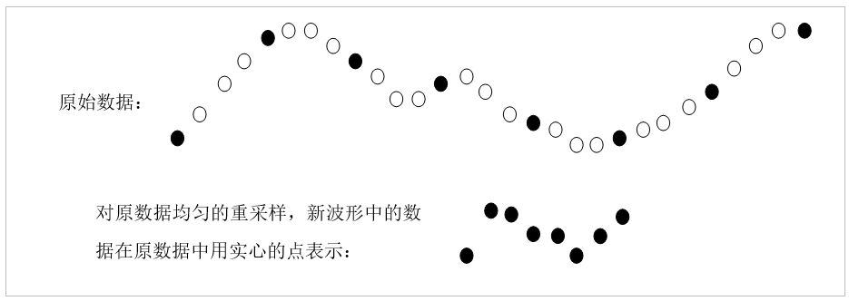
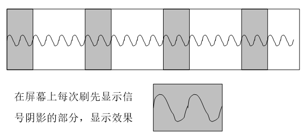

# 显示 

本书在[图形化显示数据](data_graph)一节，详细介绍了LabVIEW显示波形数据的方法。这一节，主要介绍在显示测设测量数据中的一些特殊方法。

## 中断的曲线

有时候需要绘制中间断开的曲线。比如某个信号，在0～1秒有信号，在1～2秒无信号，在2～3秒间又恢复信号。希望在1～2秒间不要把它的曲线显示出来。

简单地把在1～2秒间的波形数据的值设置为0是不能满足这个要求的。如果简单地设置为0，波形图会在Y轴等于0的地方绘制出一条水平直线。应该借助"NaN"数值（）来设置曲线不显示部分的数据。NaN是Not a
Number的缩写，表示它不是一个数值。如果波形中某个点的数据值为NaN，那么在波形图上是不会绘制这一点的。

因此，实现上文提及的功能，只要在程序中把小于0的部分设置为NaN即可，画出正弦曲线大于0的部分，而隐藏小于0的部分（图
7.24、图 7.25）。

图 .24只显示正弦曲线大于0的部分

图 .25只有大于0部分的正弦曲线

扩展这一用法，还可以绘制出"一条"可以变换颜色的曲线。比如程序要求用绘制一条正弦曲线，曲线大于0的部分用红色表示，曲线小于0的部分用绿色表示。实现的方法是：在波形图控件上绘制两条分别为红色和绿色的曲线，红色曲线只绘制正弦曲线大于0的部分，绿色曲线只绘制正弦曲线小于0的部分。两条曲线恰好是首尾相连的，看上去就像是同一条曲线有两种颜色。

## 大量数据的显示

有些数据采集设备的采样频率非常高，在很短的时间内就可以采集几M甚至几G的数据。在程序中查看这些数据时，直接把全部数据显示在波形图中肯定不是一个好方法。因为数据太多，把它们全部绘制出来相当耗费时间。

实际上，一个屏幕是无法显示太多数据的。以1024×768的屏幕为例，如果全部用来显示波形图，横向也只有1024个点，也就是说最多只能显示出一条曲线的1024个点。所以一次把所有数据都装入波形图是没有意义的。为了提高程序效率，每次只应该把相当于显示分辨率的数据传给波形图让其绘制出来。

为了保持原有波形的形状不变，用于显示的数据应当是均匀地从原始数据中选取出来的。比如，某一采集到的原始数据有100,000个点，在屏幕上，波形图控件每次可以显示200个点。那就可以在原始数据中，每隔500个点抽取出一个点，组成一组新的数据（图
7.26）。

图 .26对原始数据进行重采样以加快显示速度

显示大量数据是导致程序效率低下的一个主要因素。在硬盘上读取大量数据，重采样同样是比较耗时的工作。如果硬盘上保存有一个大数据文件，且经常需要装入内存并显示出来，不妨把这个文件重采样后的缩减版也保存下来。这样每次要显示数据全图时，可以直接装入缩减版的文件，省去了读入大文件和重采样的时间。

数据被重采样缩减后，虽然还保持着原数据的总体外观，但细节部分已经丢失了。若用户需要使用波形图的放大工具试图放大波形图某一部分查看波形的细节处，就不能继续使用这个缩减版的数据了，它无法显示波形的细节。这时，程序必须重新计算数据显示的区域和波形分辨率，重新生成一组重采样缩略数据。

比如需要被显示的数据采样频率为10,000，即每秒钟采集10,000个点。原数据长度是10秒钟，共有100,000个点。波形图每次可以显示200个点。开始显示数据全图时，每隔500个点抽取出一个点，组成一组新的数据。新的一组数据采样率为20，数据时间长度还是10秒钟，由200个点组成。

假如用户在观察了波形全图后，决定选取波形中第3秒和第4秒之间的数据进行观察（图
7.27）。放大后需要显示的数据长度为2秒，对应于原始数据的第3,000～5,000个点。这2000个点也不需要全部在波形图上显示，可以对它们进行重采样，采样频率为100。这样，重采样的数据还是有200个点，表示原数据第2、3秒的内容。

图 .27使用放大工具查看波形细节

## 高速数据的显示

有的测试程序要求一边采集数据一边把采集到的数据显示出来，供用户随时观察。如果硬件采集数据的速度不高，数据变化频率也不够快，可以直接使用波形图表控件把采集到的数据显示出来。

当数据采集速度特别快时，比如采样率达到每秒上万个点。如果还是把所有采集到的数据都传递给波形图表控件，就相当于每秒显示几万个点。图像刷新的速率如此之快，人眼根本无法分辨出每一幅图像。为了降低图像的刷新速度，在显示时可以降低用于显示的数据的采样率。比如降低到每秒10个点左右，再在波形图表控件中显示。这样，波形的移动速度就不会太快，观察者就可以看清楚了。

这个处理方法与处理大量静态数据的显示方法是类似的。它们的缺点也是相同的，就是无法显示波形的细节部分。而实际上，一个程序之所以采用高采样率采集数据就是为了观察采集波形的细节部分。如果被采集的信号是无规律的，那么可以每次以原采样率显示一小段数据，比如0.001秒钟内的信号。图像停留1秒钟，等观察者可以看清楚它，再显示刚刚采集到的0.001秒钟的信号。这种方法虽然可以显示图像的细节，但是观察者实际只能看到0.1%的数据，其它99.9%的数据都没有被显示出来。

大多数时候，被观测的信号都是有规律的周期信号。由于周期信号是重复的，如果能够保证每次在波形图控件上绘制的信号，都从信号不同周期的同一位置开始显示，那么实际上每次显示的图像都和上一副图像几乎是相同的。这样，就可以提高图像刷新速度，而图像仍然会保持稳定的形状不会有无规则的闪动。如果每秒钟刷新20帧图像，显示的数据就可以比上一种方法多20倍。这样一来，既可以显示波形的细节部分，又可以显示更多的数据。这也正是示波器的工作方式（图
7.28）。

图 .28示波器的工作原理

采用示波器方式显示信号图像，使图像稳定演示的关键点是需要每一帧图像都必须从某个信号周期的同一位置开始显示。可以通过设置触发点来保证每次得到每个周期的同一点。在得到触发点后，再在触发点后截取一段相同长度的波形。

图
7.29是利用声卡来采集声音信号并显示出来的一个简单示波器。它在工作时，首先从声卡读取声音信号，然后根据设定的触发电平找到触发点。在触发点后截取一段波形显示出来。

图 .29声卡示波器的程序框图

在测试此VI时，同时使用扬声器产生了一个方波，再利用声卡示波器把声音信号显示出来。图
7.30是声卡示波器的显示效果。在这个波形图中，原始的方波信号也被合成进去了。图中不规则的周期信号是声卡示波器麦克风采集进来的声音信号。这里由于音响系统效果较差，所以信号从扬声器发出，再经麦克风采集回来后，已经完全变形了。但还是可以看出，这个信号是受方波信号激励产生的。调整方波的频率幅值等，采集到的信号也会相应改变。

图 .30声卡示波器的显示效果

## 用鼠标在波形图控件上选取一条曲线

有时，用户需要使用鼠标对波形图控件上的曲线进行一些复杂的操作。那么，程序首先就要知道用户鼠标点击的是哪条曲线。实现这一功能，可以利用波形图控件的方法"根据位置获取曲线"，这个方法的输入参数是一个坐标位置，若输入坐标点的附近有曲线经过，就返回这条曲线的索引，否则返回-1。

下面使用一个示例程序来介绍如何利用这一方法获取鼠标点击的曲线。程序的功能为：当鼠标点击波形图控件的某一条曲线时，该曲线变粗。

\
图7.35 获取鼠标点击的曲线的程序框图

图7.35是实现了这一功能的程序的框图。程序启动后，首先画出两条随机数据的曲线。当用户在波形图上点击时，就调用"根据位置获取曲线（GetPlotAtPos）"方法查看是否点击在了某条曲线上。如果是，则使用曲线的属性节点"曲线.线条宽度（Plot.LineWidth）"把曲线宽度设置为2，曲线变宽；否则，曲线维持原宽度仍为1。

程序运行效果如图7.36所示（Plot0曲线被加粗）\
\
图7.36 Plot0曲线被选中后加粗
