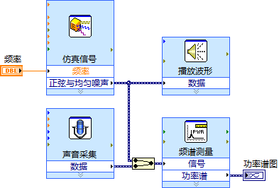

# Express VI

## 测试程序相关的Express VI

由于测试程序是LabVIEW程序最常见的类型，LabVIEW特别提供了很多针对这类程序的VI。这其中包括了针对数据采集/发生、分析、显示、保存等各方面的Express
VI（图 7.6）。

图 .6测试程序常用的Express VI

为了简化程序员的工作，LabVIEW把测试领域常用的功能都集成到了为数不多的几个功能极为强大的子VI中。子VI的功能越复杂，所需的各类数据就会越多。而实际上，针对某一特定的程序而言，一般只需要配置复杂子VI的几个简单参数即可。

比如，程序中常会需要产生一个波形数据。因此，LabVIEW需要提供给编程者一个产生波形数据的子VI。产生一个波形需要编程者提供很多信息，比如波形的类型、频率、幅值、相位、采样率、采样数等数十个数据。如果以一个普通子VI的方式来提供这些功能，会使得程序框图显得杂乱无章，降低了程序的可读性。更严重的是，编程者也很难在程序还未运行之前就设计好每个数据具体的值。这样就增加了编程的复杂度。

Express
VI正是为了解决这一矛盾而出现的。它为使用者提供了一个配置对话框，VI所需的数据可以在配置界面上直接选择。第一次把Express
VI放置在程序框图上或者双击程序框图上的Express
VI，就会出现它的配置界面。配置界面上有提示信息，可以帮助编程者选择正确的配置数据。并且有的配置界面带有反馈信息，比如，仿真信号Express
VI的配置界面上就包含了"结果预览"。编程者无需运行程序，就可以及时地在此界面观察到所选参数的效果了。

图 7.7是"仿真信号"Express
VI的配置对话框，改变频率、幅值等参数，立刻就可以在"结果预览"中看到仿真信号波形的变化。

图 .7"仿真信号"Express VI的配置对话框

## 应用

如果使用的是NI公司的数据采集设备，再配合Express
VI，那么编写一般的测试程序是非常简单的。基本上，采集、处理、显示、存储等几个主要步骤，每个步骤只要使用一两个Express
VI就可以了。

比如安装了"DAQmx"软件包之后，在采集数据时，可以使用它提供的"DAQ
Assistant"Express VI（图 7.8）。这个Express
VI的配置对话框是一个向导型的界面，它可以一步一步地指导编程者选择并配置采集信号所使用的NI硬件（图
7.9）。用户首先选择一个需要测量的信号量，然后向导会列出可以使用的硬件。选择硬件后，再对其做相应的配置。

图 .8 DAQ Assistant Express VI

图 .9 DAQ Asssistant Express VI和它的配置对话框

并不是每台电脑上都装有同型号的NI公司的数据采集卡，不过，大多数电脑都配有声卡。声卡也是一种信号输入输出设备，所以本书主要以声卡为例演示数据采集程序。使用声卡同样可以便捷地利用Express
VI完成编程。

下面要实现这样一个程序：产生一个正弦波，通过计算机的扬声器把这个正弦波以声音形式发出；再使用麦克风，把声音信号采集进来；然后，比较原始波形和重新采集进的波形的功率谱的差别。

这个程序有四个主要步骤：产生波形信号、输出信号、采集信号、计算信号功率谱。这四个步骤分别使用四个Express
VI就可以完成。其程序框图如图 7.10所示。

图 .10声音信号处理程序的程序框图

图 7.11显示了程序的运行结果。在其功率谱图上，蓝色（亮色）的是原始信号，红色（暗色）的是通过麦克风采集进来的信号。可以看出，再次从麦克风采集进来的信号与原始信号相比，频率相同，但功率有所下降，相对噪音增加。

图 .11声音信号处理程序的界面

在配置这几个Express
VI的时候需要注意，仿真信号的长度应当与声音采集的长度相同，以避免采集数据中混入更多无用信号。

Express
VI编程虽然简单，但其功能毕竟有所局限，它只包含了测试程序中最常用的那些功能。若程序要求比较特殊，或者使用的是其它公司的仪器、数据采集卡等设备，那么还是需要用那些功能比较单一的底层VI来编写程序的。
