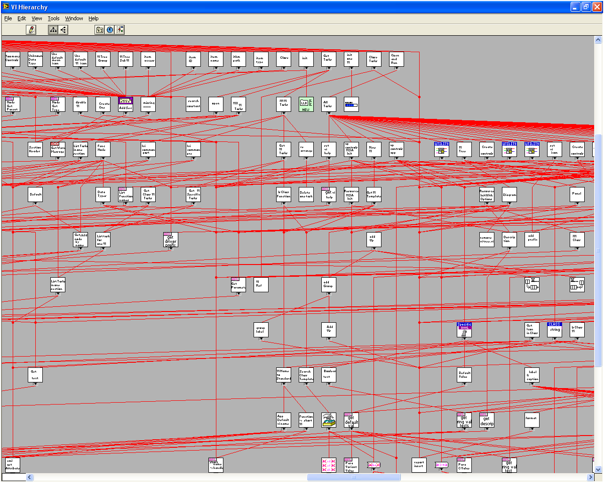
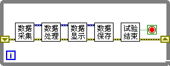

# 采集、处理、显示

## 程序结构的划分

对于规模不是非常大的 LabVIEW 程序，不论是分析一个程序，还是设计一个程序，一般都是从总体到细节，也就是从高到低地分析和设计。如果一开始就研究细节，可能效率会比较低下。

在设计程序时，编程者会首先在纵向上把程序划分成若干个层次。然后，从程序的最高层起，考虑如何按照程序功能将最高层分为几个部分，以及每一部分之间的关系。再从最高层的每一部分开始，考虑下一层次，并按照功能把下一层次划分成更细致的功能模块。一层接一层，依此类推。

在划分程序的层次时，可以按照程序的大小和复杂度，把程序划分成不同的层次。最简单的程序或许只有一个层次，一个 VI 即可完成；稍微复杂的程序，可以包含两层，由一个主 VI 和数个子 VI 构成；更复杂的程序，层次可以更多一些。

简单程序的层次结构可以在 VI 层次结构中体现出来（参见图
1.33 中的程序）。但，对于大型程序而言，就不再适合使用 VI 层次结构图来分析程序了。如图
7.1
中的程序，满屏显示也只能看到其中一小部分 VI 的层次结构。对于类似的大型程序，应当采用更抽象的程序层次划分方法。

图 .1 一个复杂程序的 VI 层次结构图

测试测量程序的一个比较常见的层次划分方法是把程序划分为三个层次。

最上层是主 VI。一个测试程序的主 VI 通常也是这个程序的界面 VI，所以也可以把最高一层称为界面（交互）层。它负责实现程序的界面、以及与用户进行交互，并调用下层 VI。本书将在第 10 章介绍如何设计程序界面。

其下一层是功能层。一个测试程序常由以下几个主要功能组成：数据采集、数据分析处理、数据显示、数据存储等。本章将会详细讨论这几个功能的设计和实现。

最底层称为驱动层。程序各功能通过调用不同的驱动来完成更为细致和通用的功能，比如有数据采集设备的驱动、文件读写驱动、图形显示驱动。这一层还包含底层的数学运算 VI 等。LabVIEW 已经提供了常用的底层驱动功能，所以本书也不再详细讨论驱动程序了。

主 VI 在调用几个功能模块时，会根据不同的程序要求，采用不同的程序结构。下面介绍几种测试程序常用的结构模型。

## 普通循环模型

一个简单的测试程序的过程可以简化为数据的采集、处理、显示、保存。其主 VI 程序框图模型如图
7.2 所示。

图 .2 简单测试程序模型

大多数程序并非只需运行一次，而是要不断地持续采集数据，然后处理、显示、保存这些数据。这样的程序模型如图
7.3 所示，即在上述模型的基础上再增加一个循环。

图 .3 顺序测试程序的模型

图
7.3 程序中的最后一个子 VI 是用来判断试验是否结束、是否需要进行下一次循环的。在这个模型中，各个程序模块是单线程顺序执行的。它的优点是程序逻辑简单，容易设计和理解。

但是，此模型中，每个功能模块之间存在着顺序上的依赖关系。它只能单线程运行，计算机必须先执行完前面一个模块，再运行下一模块。比如，尽管数据存储是一个相对比较慢的过程，但计算机还是必须等它执行完，才能执行下一循环的数据采集工作。这样，整个程序的执行速度也会相对较慢。

## 管道流水线模型

改进效率的方法之一是同时运行这几个功能。当然，对于单个的数据来说，还是需要先采集、然后处理、之后再显示和保存的。所以，同时运行这几个功能并不是对同一数据同时运行这几个功能。而是程序在采集新数据的同时，处理上一次循环迭代采集到的数据，同时，显示和存储上一次循环迭代处理好的数据（图
7.4）。这有点类似于一个需要多道工序产品的生产作业流水线。

图 .4 流水线方式处理数据

流水线在一定程度上提高了程序的效率。在流水线模型中，程序执行一次循环迭代的时间，即每处理一个数据的时间，取决于采集、处理、显示和存储这几个步骤中耗时最长的那一个。如果程序中总是同一个步骤耗时最长，那么使用流水线模型是个非常好的选择。

但实际程序运行过程中，受数据传输线路的影响，数据被采集进电脑的速度可能时快时慢。而受计算机中运行的其它程序的影响，计算机对数据的处理过程也可能时快时慢。流水线的速度总是取决于各工序中最慢的那个，如果能使用一个缓存，在采集数据达到较快，处理速度较慢的时候，把数据先存下来，等数据采集速度减慢或处理速度变快时再对缓存中的数据进行处理，程序的总体效率就可以进一步提高。

## 生产者消费者模型

按照上文所提的思路，对采集到的数据做一缓存，其程序模型如图 7.5 所示。

图 .5 带缓存的数据采集和处理程序

这里采用队列作为缓存，也可以使用其它方式如数组作为数据缓存。新采集到的数据直接被放到队列中，这一简单过程耗时极少。也就是说，数据采集多快，就可以以多快的速度存放数据到缓存。程序的另一部分则不停地从队列中取出数据，对其进行处理。如果需要，还可以把这个模型中的数据显示和保存部分也放到另一单独的循环中去运行。

这一模型也被称为 "生产者 - 消费者模型"。模型中，上半部分的循环是产生（采集）数据的，而下半部分的循环是消费（处理）数据的。在 LabVIEW 的新建对话框中可以找到这一模型的模板。

采用生产者 - 消费者模型的程序初看起来都比较复杂。但是理解了这类程序中两个主要循环的用处，再分析程序就比较容易了。这个模型的实际应用程序会更加复杂，与管道流水线模型相比较难理解和维护。