# 类

## 创建

在项目浏览器上，点击鼠标右键，选择 "新建 -\> 类"，就可以创建一个新的类：

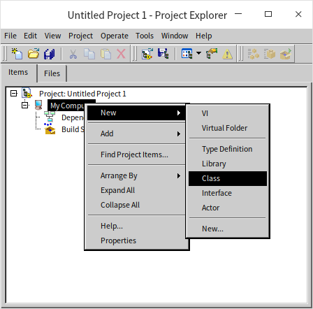

我们给它起个名字叫做 “Parent”，因为我们将要使用它当做另一个类的父类。创建新类的时候，LabVIEW 会询问新类继承自哪里：

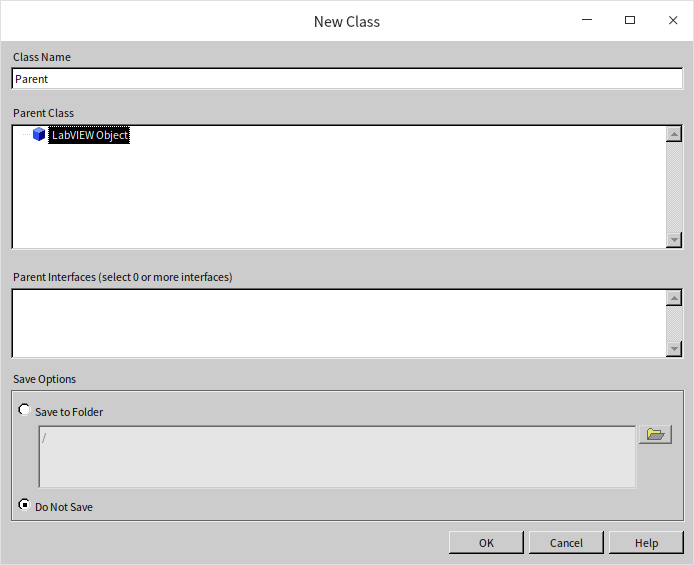

作为我们创建的第一个类，我们并没有为它准备一个父类。LabVIEW 中所有的类都必须有且仅有一个父类，如果不需要设定一个特别的父类，那么就会默认使用 “LabVIEW 对象” 作为父类。所以 “LabVIEW 对象” 会是 LabVIEW 中所有类的祖先类，当你编写了一个 VI，用于处理所有 LabVIEW 的对象，比如得到对象的类名，那么输入数据的类型就可以采用 “LabVIEW 对象”，使得你的程序可以接受任何类型的实例。

接下来我们再使用同样的方法创建一个名为 “Child” 的类，它是 “Parent” 的子类，所以选择 “Parent” 作为它的父类：

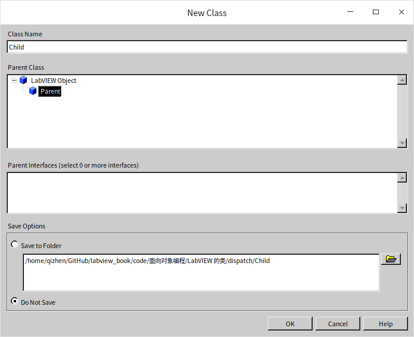

类在结构上是一种特殊的 [LabVIEW 库](manage_library)，因此它的很多属性和设置都与库相似。比如，类的名字也作为名字空间；也可以为类中的 VI 设置访问权限等。除此之外，类还有它特殊的设置，比如有属性和方法等。

类被保存在一个以 lvclass 为后缀名的文件中。

## 方法（VI）

鼠标右键点击在类上，就可以为类创建方法了。方法其实就是一些 VI。

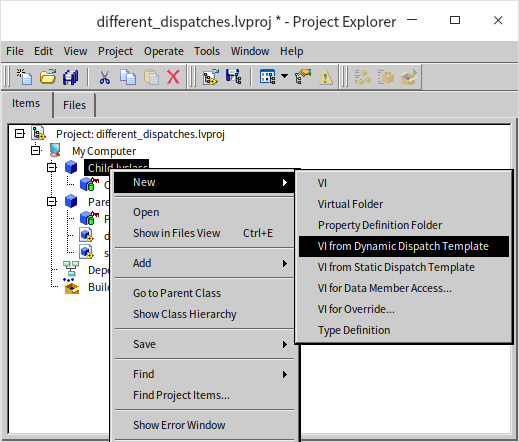

在新建这一栏下可以看到很多条目：

* **VI**：就是指创建一个普通的方法 VI。
* ** 虚拟文件夹 **：如果类中的方法很多，为了便于管理，可以把它们归类到不同的文件夹中。
* ** 属性定义文件夹 **：这是专用来保存数据读写 VI 的文件夹。
* ** 基于动态分配模板的 VI**：如果一个类中的方法，有可能被子类中相同的方法重写，就应该使用这个模板。相当于其它语言中的 “虚函数”。
* ** 基于静态分配模板的 VI**：如果一个类中的方法，不允许被子类重写，就应该使用这个条目来创建。它与基于动态分配模板的 VI 的唯一的区别在于：动态分配的 VI 的类输入输出接线端是动态分配的，而静态分配的 VI 则不是。
* ** 用于数据成员访问的 VI**：因为类的数据全部是私有的，所以需要借助公有 VI 来访问它们。这个选项用于快速建立读写类中数据的 VI。这些 VI 依然是基于动态分配模板的 VI 或基于静态分配模板的 VI，只是 LabVIEW 帮忙在程序框图上添加了一些数据读写的代码。
* ** 用于重写的 VI**：这个选项是专门给子类用的，用来创建覆盖父类的方法 VI。它创建的是一个基于动态分配模板的 VI，只是 LabVIEW 帮忙在程序框图上添加了一些调用父类同名方法的代码。
* ** 类型定义 **：创建用户自定义控件，用于自定义一些在模块里可能需要用到的数据类型。

下面我们研究一下 “基于动态分配模板的 VI” 和 “基于静态分配模板的 VI” 各自的行为是什么样的。

首先在 Parent 类中创建一个基于静态分配模板的 VI，叫做 static.vi。这个 VI 的功能比较简单，只是返回一行文字 “Parent Static VI”。

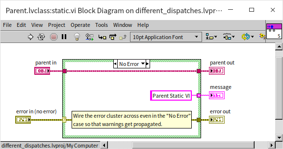

之后我们尝试在 Child 类中创建一个同名的基于静态分配模板的 VI。这时候就会发现新建的 Child.lvclass:static.vi 是不能运行的。

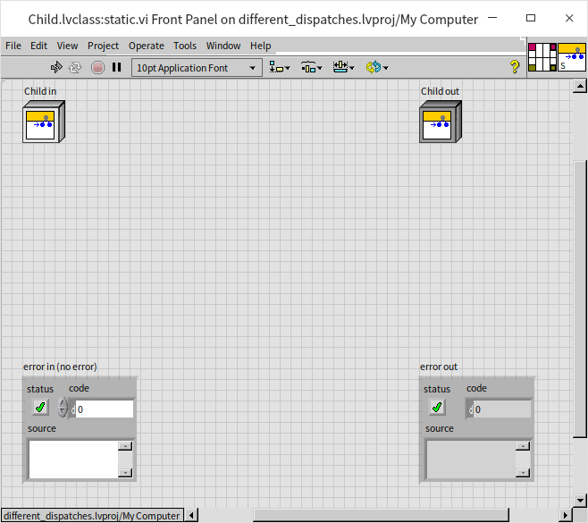

点击它的运行按钮，可以看到错误信息：它试图覆盖一个祖先类中的基于静态分配模板的 VI。

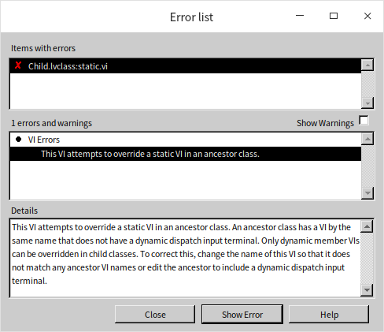

如果一个类中已经有了一个基于静态分配模板的 VI，它的子孙类中就不能再有同名的方法了。

再创建两个基于动态分配模板的 VI，我们可以在父类和子类中分别创建出同名的基于动态分配模板的 VI。它们的区别仅在于输出文字略有不同，两个 VI 都可以正常运行：

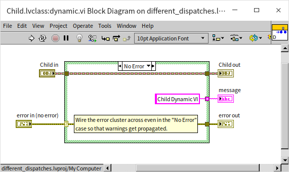

现在我们可以写一个测试程序来看看上面几个 VI 都会返回什么结果？下图是一个简单的测试，它的程序框图上分别有一个父类的实例，和一个子类的实例，之后分别把它们传递给上面创建的几个 VI，看看返回结果：

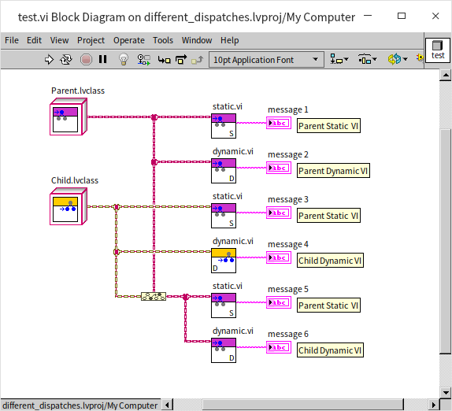

上图中，偏紫色图标的 VI 都属于 Parent 类，偏黄色图标的 VI 都属于 Child 类。

static.vi 由于是基于静态分配模板的 VI，不能被子孙类覆盖，所以可以确定，被调用的永远是 Parent 类中的那个 static.vi，返回值也一定是 “Parent Static VI”，不论输入的类型是哪一种。

Parent 类的实例调用 Parent.lvclass:dynamic.vi 返回值是 “Parent Dynamic VI”；Child 类的实例调用 Child.lvclass:dynamic.vi 返回值是 “Child Dynamic VI”。这也是比较确定的。

需要注意的是最后一条测试，“message 6” 中的文字。因为 Child 类继承自 Parent 类，Child 类可以被认为是 Parent 类的一个子集。如果一个对象属于 Child 类，也就必然属于 Parent 类。因此在程序中我们可以把这个 Child 类的对象的数据类型转化成为 Parent 类的数据类型，然后用它去调用 dynamic.vi。这里的实例是由 Child 类生成的，不论它在程序中使用哪个祖先类的数据类型表示它，它都始终还是一个 Child 类实例，所以程序调用它的 dynamic.vi，运行的一定还是 Child 类中的那个 dynamic.vi。我们可以看到这里返回的文字是 “Child Dynamic VI”。只有当子类中没有实现（重写）某个基于动态分配模板的 VI 时，程序才会调用它父类中的同名 VI。

下面我们再改动一下 Parent.lvclass:static.vi 的程序逻辑，让它去调用一下 Parent.lvclass:dynamic.vi：

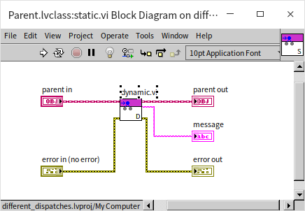

然后我们再在测试程序中，使用一个泛化成 Parent 类类型的 Child 类的实例调用这个 Parent.lvclass:static.vi。返回值会是什么呢？

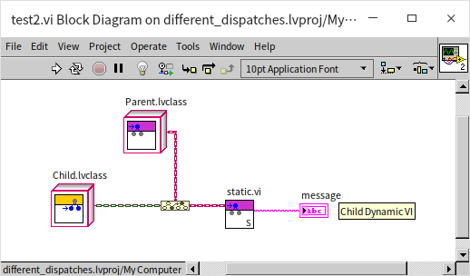

尽管 Child 子类中没有 static.vi，测试程序确定调用的是父类中的 static.vi，但是由于传入的实例属于 Child 类，那么父类的 static.vi 中调用的依然是 Child 类中的 dynamic.vi。一个基于动态分配模板的 VI，即便是在其它类的 VI 中被调用，依然还是会运行实例所属的类中的方法。

这也就是面向对象编程中 “多态的含义”。我们在编写程序的时候可以总是在代码里放置父类中的方法，但在程序运行时，调用的是哪个方法是根据传入的实例的具体类型来决定的。如果传入的对象属于某一个子类，被调用的将会是那个子类中的方法。换句话说，这个被调用的父类的方法是抽象的，它会根据传入对象具体类型的不同表现出多种形态，所以叫做多态。

如果一个父类的 VI 被子类覆盖之后，是不是就无法在子类中被调用了呢？在子类中调用父类同名方法时，不能如同调用一般的子 VI 那样，直接把父类的方法拖拽过来。这种调用方式是无效的，而必须使用函数选板中的 "编程 -\> 簇，类与变体 -\> 调用父类方法" 节点来调用父类的方法。如果在新建类的方法时，选择 “用于重写的 VI”，系统会自动把这个节点加在新生成的 VI 程序框图上。

下图中的方法 VI 使用了调用父类方法节点，先得到父类同名方法返回的数据，再把这个数据与子类方法自己的数据合并返回：

基于静态分配模板的 VI 与基于动态分配模板的 VI 在源代码层面的区别仅仅是：动态分配的 VI 的类输入输出接线端是动态分配的，而静态分配的 VI 则不是。如果已经创建了一个基于静态分配模板的 VI，但是后来发现它应该是基于动态分配模板的 VI，那么也不需要重新在生成一个新的 VI，只要改变原有 VI 的接线端的类型就可以了。

## 属性 (数据)

除了 VI，每个类都包含一个和类同名的.ctl 项。尽管它的面板和设置方法与用户自定义控件类似，但实际上在硬盘上是找不到这个.ctl 文件的。它的数据信息都直接记录在同名的.lvclass 文件中。此外，这个.ctl 项必须是一个簇。簇中的元素就是这个类的属性，也就是类所使用到的所有数据，这相当于其它语言中的类的变量。与多数其它语言不同之处是，LabVIEW 的类的数据只能是私有的。这主要是出于安全考虑。在类之外，只能通过公有的方法来间接访问这些数据。

因为数据都是私有的，所以也不存在继承的问题，子类不能继承父类的数据。如果子类需要使用父类里的数据，也需要通过调用父类提供的方法间接调用。

我们可以为刚刚创建的类添加一些数据：

子类和父类中可以添加同名的数据。类的数据可以有初始值设定，初始值就是对应控件的默认值。上图中，如果 message 控件的默认值是空字符串，那么新创建出来的实例中 message 的数据都是空字符串；如果把 message 控件的默认值改为字符串 “init”，那么新创建出来的实例中 message 的数据都是 “init”。

我们可以使用类的 “新建 -\> 用于数据成员访问的 VI” 菜单创建一些用于读写数据的 VI。

新建的数据访问 VI 也可以选择是动态的或是静态的。因为数据都是私有的，不会有继承的问题，使用静态的数据成员访问 VI 会更直观一些。唯一的问题是，如果父类和子类中，有重名的数据，它们的数据成员访问 VI 也会重名，这样如果是静态的 VI，就会遇到我们上一节提到的那个 “试图覆盖一个祖先类中的基于静态分配模板的 VI” 的错误。这时候可以给数据访问 VI 改个名，VI 的名字不是必须和数据名相同的。

另一种解决方案是创建动态的数据成员访问 VI，这样父类子类中的数据成员访问 VI 可以重名。还有一个额外的好处是子类中访问父类的数据会更容易理解。LabVIEW 的数据不能继承，但现实中有些情况下数据是应当被继承的，比如说父类是 “家具”，有个属性 “价格”，子类是 “桌子”，显然 “桌子” 应当继承 “家具” 的价格。在遇到这种情况时，我们可以在父类和子类中添加同名的数据，生成同名的动态数据成员访问 VI，以方便在子类动态数据成员访问 VI 中直接调用父类的同名数据成员访问 VI，从而得到父类中的数据。

下图显示了我们为测试项目创建的一些数据成员访问 VI：

类中的数据成员访问 VI 也可以通过 LabVIEW 的属性节点来调用，使用属性节点访问数据的好处是一次可以读写多个属性：

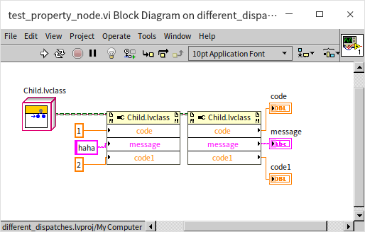

在设计类的时候应该尽量避免把数据成员访问 VI 直接给用户使用。模块的一个设计原则就是尽量把底层数据隐藏起来不让用户看到，用户必须通过模块提供的高层方法进行操作，这样模块的开发者才可能放心的对模块底层结构和数据进行维护改进。

### 数据线样式

默认状态下，LabVIEW 中每个新创建的类，都使用了相同样式和颜色的数据线。但是为了在演示程序中更清楚的分辨一根数据线传递的是哪一个类的数据，演示程序为每个类都设置了不同的数据线颜色和样式：

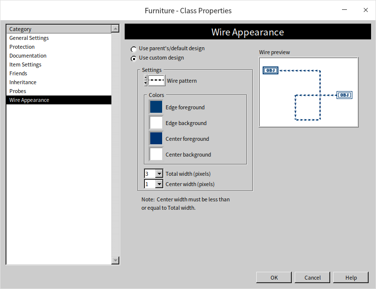

## 应用示例

下面我们使用一个更贴近实际生活的例子来演示一下面向对象编程的整个流程。

### 需求

假设有一家家具店，店里只卖两种家具，桌子和椅子。我们编写一个程序来模拟一下家具店里这些家具的属性和方法。假设我们需要模拟如下的属性和方法：
* 编号（属性）：每个家具都有一个唯一的编号。
* 成本价（属性）：商店进货的价格。
* 返回售价（方法）：每个家具都有一个固定的售价，它等于 `家具的成本价格 *(预计利润率 + 1)*(税率 + 1)`。假设成本价格，利润率和税率都是已知的。
* 组装（方法）：桌子和椅子组装过程。
   * 桌子的组装：把桌腿固定在桌面上，然后反转过来。具体过程在演示程序中用一段文字代替即可。
   * 椅子的组装：把靠垫和椅背固定在一起，然后再安装椅子腿。具体过程在演示程序中用一段文字代替即可。
* 以上几个属性和方法都是桌子椅子共有的，此外，我们再要求每个类提供一个自己独特的方法：
   * 铺桌布（桌子类的独特方法）：在演示程序中用一段文字表示桌布铺好即可。
   * 放置靠枕（椅子类的独特方法）：在演示程序中用一段文字表示靠枕放好了即可。

此外，我们将编写一个模拟程序，调用家具店中每一个家具，打印出它们的售价和承重。

### 设计

根据上面的需求，我们可以做如下的设计
* 需要三个类：家具类，桌子类和椅子类。桌子类和椅子类都继承自家具类。
* 家具类包含有两个数据：编号，成本价；两个方法：返回售价，组装。这些是桌子类和椅子类都共同拥有的属性和方法。
   * 返回售价这个方法在所有类中的逻辑都完全相同，所以只需要在父类，家具类中实现，其它两个子类不需要在实现一遍，直接继承父类方法即可。
   * 组装这两个方法虽然是桌子类和椅子类都有的方法，但它的实现在两个类里却不相同，需要分别在两个子类中实现。
   * 我们还将在桌子类和椅子类中各实现一个 “初始化” 方法，虽然初始化方法在两个子类中同名，但是因为它们的输入参数不同，它们其实是完全不同的方法，所以并不能在父类中定义这个方法。
* 桌子类包含四个方法：初始化（设置产品编号，成本价，和桌布型号），返回售价，组装，铺桌布。
* 椅子类包含四个方法：初始化（设置产品编号，成本价，和靠枕型号），返回售价，组装，放置靠枕。
* 此外还需要定义两个常量：利润率和税率

### 创建类

按照上面已经介绍过的方法，创建一个新的项目，然后再创建三个类：分别为 Furniture（家具类），Table（桌子类）和 Chair（椅子类）。Table 和 Chair 都继承自 Furniture。

### 属性（数据）

家具类 Furniture 包含两个数据：id（编号）和 cost（成本价）。为了在桌子椅子初始化的时候可以设置这两个数据，我们给这两个数据添加了数据访问 VI。

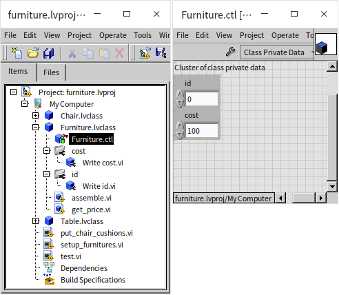

桌子类和椅子类分别需要保存桌布型号（tablecloth_type）和靠枕型号（cushion_model）数据。我们最好为这两个数据定义两个自定义数据类型。自定义的数据类型也可以放在类中保存。比如下图中，桌子类的桌布型号控件就保存在了类中。

### 方法（VI）

首先实现父类家具类中的方法。返回售价（get_price.vi）方法可被子类直接调用，不需要被子类重写，所以可以使用基于静态分配模板的 VI。它的功能就是把家具的成本价乘以利润和交税参数后返回：

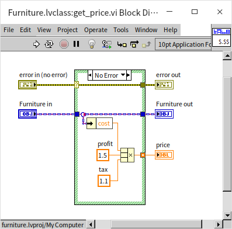

父类家具类中组装（assemble）方法是需要被子类重写的，所以它必须是基于动态分配模板的 VI。父类中实现的默认方法仅仅是返回家具的编号：

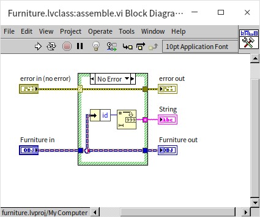

组装方法会被子类重写，比如下图是椅子类中重写的组装方法，它首先调用了父类的同名方法，得到家具的编号，然后插入一段带有 “椅子（Chair）” 的文字，返回。这样我们将来就能够清楚的知道这个 VI 被调用过了。桌子类中组装方法的实现类似，就不再贴图了。

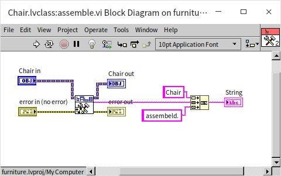

椅子类中还有一个构造方法（construct.vi），用于初始化椅子的数据。它首先调用家居类中的数据访问 VI，设置产品编号和成本价，然后再把靠垫型号写入到椅子类的数据当中去。桌子类也有一个构造方法，与之类似。

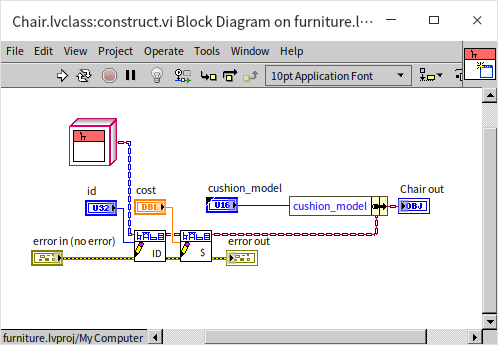

椅子类独有的方法是放置靠垫（put_cushion.vi）。我们就让程序读出靠垫的型号，然后返回一段文字表示坐垫放好了。桌子类的铺桌布（put_tablecloth.vi）方法与之类似。

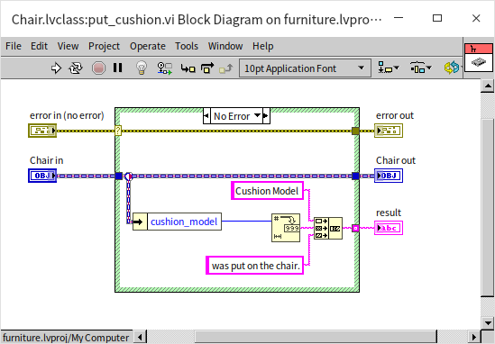

这样，我们就把用于家具店的几个类都实现好了。下面测试一下看它们是否工作正常。

### 应用测试

首先写一个简单的 VI 演示为一组椅子放置靠垫，这个 VI（put_chair_cushions.vi）功能很简单，输入一组椅子类的实例，分别调用每个实例的放置靠垫方法：

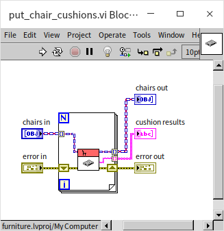

接下来再写一个 VI 用于组装所有的家具（setup_funitures.vi）。因为这个 VI 要处理所有类型的家具，它的输入输出控件就不能再是桌子或椅子类了，而必须是家具类型。这个 VI 稍微复杂一点，首先针对每一个家具调用 “组装方法”，再调用 “返回售价” 方法，再把两个方法返回的字符串合并起来：

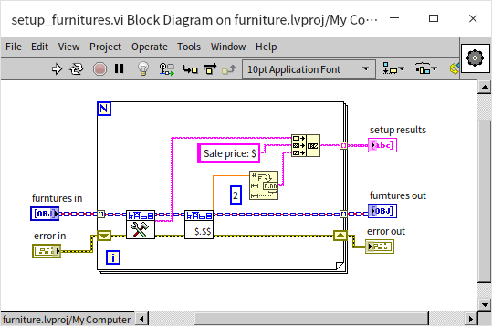

最后，可以编写用于测试的程序了：

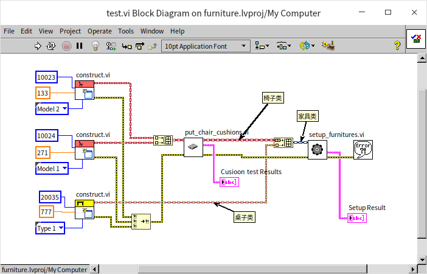

这个测试程序大致可以分成三个部分：
* 最左面那一部分是初始化的部分，它调用桌子和椅子类的构造方法，创建了两个椅子对象，和一个桌子对象。
* 中间一部分，把两个椅子的对象放置在了一个数组中，然后传递给 put_chair_cushions.vi 为每个椅子放置靠垫。
* 最右边一部分，把两把椅子和一张桌子放置在了一个数组中，这个数组的数据类型会自动变为家居类的数组，否则无法既存放椅子也存放桌子。

运行这个测试 VI，输出结果如下：

按照传统的编程方式，如果需要对不同的输入对象调用不同方法，需要写一个条件结构，用于判断输入对象的类型，然后按照不同类型去调用不同的子 VI。但是，借助类的多态特性，应用程序（测试程序）不再需要程序员编写代码去判断实例数据所属的子类，以及调用不同子 VI。在程序中，我们完全可以把所有实例用它们共同的父类的类型来传递，代码中也只使用父类的方法。而程序执行到父类的方法时，会自动执行已经重写了它的相应的子类的方法。

在我们的示例中桌子类和椅子类同时从家具类那里继承了 "组装" 这个方法。但是，它们都重写了这个方法，这样就实现了多态。尽管 setup_funitures.vi 的输入控件类型是家具类，但是程序在执行到组装（assemble.vi）这个方法时，会自动判断输入对象的具体类型，然后调用相应的方法，所以我们可以在测试的返回结果中看到桌子类的对象都返回了 “Table” 字符串，而椅子类的对象都返回了 “Chair” 字符串。

在程序调用了 assemble.vi 的地方双击这个子 VI，LabVIEW 不会像对待普通 VI 那样立刻打开子 VI，而是会列出所有类中的同名 VI，询问用户需要看哪一个。    

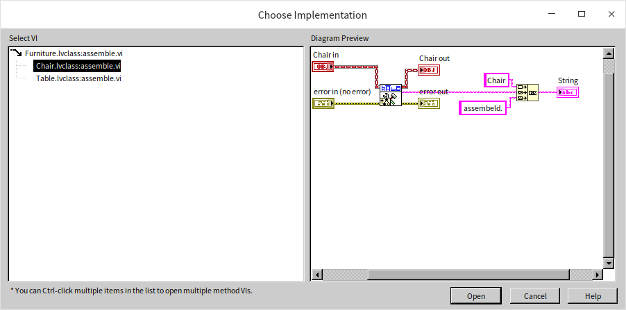
