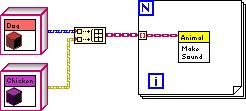

# 类

## 创建

在项目浏览器上，点击鼠标右键，选择"新建-\>类"，就可以创建一个新的类：

我们给它起个名字叫做“Parent”，因为我们将要使用它当做另一个类的父类。创建新类的时候，LabVIEW会询问新类继承自哪里：

作为我们创建的第一个类，我们并没有为它准备一个父类。LabVIEW中所有的类都必须有且仅有一个父类，如果不需要设定一个特别的父类，那么就会默认使用“LabVIEW对象”作为父类。所以“LabVIEW对象”会是LabVIEW中所有类的祖先类，当你编写了一个VI，用于处理所有LabVIEW的对象，比如得到对象的类名，那么输入数据的类型就可以采用“LabVIEW对象”，使得你的程序可以接受任何类型的实例。

接下来我们再使用同样的方法创建一个名为“Child”的类，它是“Parent”的子类，所以选择“Parent”作为它的父类：

类在结构上是一种特殊的[LabVIEW库](manage_library)，因此它的很多属性和设置都与库相似。比如，类的名字也作为名字空间；也可以为类中的VI设置访问权限等。除此之外，类还有它特殊的设置，比如有属性和方法等。

类被保存在一个以lvclass为后缀名的文件中。

## 方法（VI）

鼠标右键点击在类上，就可以为类创建方法了。方法其实就是一些VI。

在新建这一栏下可以看到很多条目：

* VI：就是指创建一个普通的方法VI。
* 虚拟文件夹：如果类中的方法很多，为了便于管理，可以把它们归类到不同的文件夹中。
*属性定义文件夹：这是专用来保存数据读写VI的文件夹。
*基于动态分配模板的VI：如果一个类中的方法，有可能被子类中相同的方法重写，就应该使用这个模板。相当于其它语言中的“虚函数”。
*基于静态分配模板的VI：如果一个类中的方法，不允许被子类重写，就应该使用这个条目来创建。它与基于动态分配模板的VI的唯一的区别在于：动态分配的VI的类输入输出接线端是动态分配的，而静态分配的VI则不是。
*用于数据成员访问的VI：因为类的数据全部是私有的，所以需要借助公有VI来访问它们。这个选项用于快速建立读写类中数据的VI。这些VI依然是基于动态分配模板的VI或基于静态分配模板的VI，只是LabVIEW帮忙在程序框图上添加了一些数据读写的代码。
*用于重写的VI：这个选项是专门给子类用的，用来创建覆盖父类的方法VI。它创建的是一个基于动态分配模板的VI，只是LabVIEW 帮忙在程序框图上添加了一些调用父类同名方法的代码。
*类型定义：创建用户自定义控件，用于自定义一些在模块里可能需要用到的数据类型

下面我们研究一下“基于动态分配模板的VI”和“基于静态分配模板的VI”个子的行为是什么样的

首先在Parent类中创建一个基于静态分配模板的VI，叫做static.vi。这个VI的功能比较简单，只是返回一行文字“Parent Static VI”。

之后我们尝试在Child类中创建一个同名的基于静态分配模板的VI。这时候就会发现新建的Child.lvclass:static.vi是不能运行的。

点击它的运行按钮，可以看到错误信息：它试图覆盖一个祖先类中的基于静态分配模板的VI。

所以如果一个类中已经有了一个基于静态分配模板的VI后，它的子孙类中就不能再有同名的方法了。

再创建两个基于动态分配模板的VI，我们可以在父类和子类中分别创建出同名的基于动态分配模板的VI。它们的区别仅在于输出文字略有不同，两个VI都可以正常运行：

现在我们可以写一个测试程序来看看上面几个VI都会返回什么结果？下图是一个简单的测试，它的程序框图上分别有一个父类的实例，和一个子类的实例，之后分别把它们传递给上面创建的几个VI，看看返回结果：

上图中，偏紫色图标的VI都属于Parent类，偏黄色图标的VI都属于Child类。

static.vi由于是基于静态分配模板的VI，不能被子孙类覆盖，所以可以确定，被调用的永远是Parent类中的那个static.vi，返回值也一定是“Pareent Static VI”，不论输入的类型是哪一种。

Parent类的实例调用Parent.lvclass:dynamic.vi返回值是“Parent Dynamic VI”；Child类的实例调用Child.lvclass:dynamic.vi返回值是“Child Dynamic VI”。这也是比较确定的。

需要注意的是最后一条测试，“message 6”中的文字：我们把一个Child类的实例泛化成Parent类的一个实例，然后用它去调用dynamic.vi。这里的实例是由Child类生成的，所以不论它在之后的程序中被当做哪个祖先类的实例传递，它都始终是一个Child实例，所以无论之后怎么转换，调用dynamic.vi，运行的都是Child类中的那个dynamic.vi。所以这里返回的文字是“Child Dynamic VI”。只有当子类中没有实现（重写）某个基于动态分配模板的VI，程序才会调用它父类中的同名VI。

下面我们再改动一下Parent.lavclass:static.vi，让它调用Parent.lvclass:dynamic.vi：

然后我们再在测试VI中，使用一个例泛化成Parent类的实例的Child类的实例调用这个Parent.lavclass:static.vi。返回值会是什么呢？

尽管子类中没有static.vi，测试程序确定调用的是父类中的static.vi，但是由于传入的实例属于Child类，那么static.vi中调用的依然是Child类中的dynamic.vi。一个基于动态分配模板的VI，即便是在其它类的VI中被调用，依然还是会运行实例所属的类中的VI。

那么如果一个父类的VI被子类覆盖之后，是不是就无法在子类中被调用了？在子类的重写VI中还是可以使用“调用父类方法”节点来调用父类方法的。如果在新建类的方法时，选择“用于重写的VI”，系统会自动把这个节点加在新生成的VI程序框图上。

下面是一个改写了的Child.lvclass:dynamic.vi，把父类方法产生的数据与子类方法自己的数据合并返回：

基于静态分配模板的VI与基于动态分配模板的VI的本文的区别仅在于：动态分配的VI的类输入输出接线端是动态分配的，而静态分配的VI则不是。如果在开始设计的时候，生成了一个基于静态分配模板的VI，但是后来发现它应该是基于动态分配模板的VI，那么也不需要重新在生成一遍，只要改变它的接线端的类型就可以了。

## 属性(数据)

除了VI，每个类都包含一个和类同名的.ctl项。尽管它的面板与设置方法与用户自定义控件类似，但实际上在硬盘上是找不到这个.ctl文件的。它的数据信息都直接记录在同名的.lvclass文件中。此外，这个.ctl项必须是一个簇。簇中的元素就是这个类的属性，及它所使用到的数据，这相当于其它语言中的类的变量。与多数其它语言不同之处是，LabVIEW的类的数据只能是私有的。这主要是出于安全考虑。在类之外，只能通过公有的方法来间接访问这些数据。

因为数据都是私有的，所以也不存在继承的问题，子类不能继承父类的数据。如果子类需要使用父类里的数据，也需要通过调用父类提供的方法间接调用。

我们可以为刚刚创建的创建一些数据：

子类和父类中可以添加同名的数据。类的数据可以有初始值设定，初始值就是对应控件的默认值。上图中，如果message控件的默认是空字符串，那么新创建出来的实例中message的数据都是空字符串；如果把message控件的默认值改为字符串“init”，那么新创建出来的实例中message的数据都是“init”。

我们可以使用类的“新建-\>用于数据成员访问的VI”菜单创建一些用于读写数据的VI。

新建的数据访问VI也可以选择是动态的或是静态的。因为数据都是私有的，不会有继承的问题，使用静态的数据成员访问VI会更直观一些。唯一的问题是，如果父类和子类中，有重名的数据，它们的数据成员访问VI也会重名，这样如果是静态的VI，就会遇到我们上一节提到的那个“试图覆盖一个祖先类中的基于静态分配模板的VI”的错误。这时候可以给数据访问VI改个名，VI的名字不是必须和数据名相同的。

另一种解决方案是创建动态的数据成员访问VI，这样父类子类中的数据成员访问VI可以重名。还有一个额外的好处是子类中访问父类的数据会更容易理解。LabVIEW的数据不能继承，但现实中有些情况下数据是应当被继承的，比如说父类是“家具”，有个属性“价格”，子类是“桌子”，显然“桌子”应当继承“家具”的价格。在遇到这种情况时，我们可以在父类和子类中添加同名的数据，生成同名的动态数据成员访问VI，以方便在子类动态数据成员访问VI中直接调用父类的同名数据成员访问VI，从而得到父类中的数据。

在设计类的时候应该尽量避免把数据成员访问VI直接给用户使用。模块的一个设计原则就是尽量把底层数据隐藏起来不让用户看到，用户必须通过模块提供的高层方法进行操作，这样模块的开发者才可能放心的对模块底层结构和数据进行维护改进。

例如，可以创建一个名为Animal的类，用它来描述一些动物的属性和行为。

现在，回到前面例子中的Animal类：需要用两个数据来分别描述动物的年龄和颜色。因此，在Animal.ctl的簇中放入了两个分别表示年龄和颜色的控件（图
13.2）。

图 .2添加类的数据

## 方法（VI）

鼠标右键点击在类上，就可以为类创建方法了（图
13.3）。方法其实就是一些VI。

图 .3创建新方法

在图 13.3中新建这一栏下可以看到很多条目：

VI：就是指创建一个普通的方法VI。

虚拟文件夹：如果类中的方法很多，为了便于管理，可以把它们归类到不同的文件夹中。

基于动态分配模板的VI：如果一个类中的方法，有可能被子类中相同的方法重写，就应该使用这个模板。比如发声（Make
Sound）这个方法，在两个不同子类中将会被重写，所以一定要使用"基于动态分配模板的VI"。（这有点类似与C++中的虚函数。）

基于静态分配模板的VI：如果一个类中的方法，不允许被子类重写，就应该使用这个条目来创建。它与基于动态分配模板的VI的唯一的区别在于：动态分配的VI的类输入输出接线端（这个例子中是"Animal
in/out"）是动态分配的，而静态分配的VI则不是（如图
13.4所示）。静态分配的VI到的接线端通常使用"推荐"类型。

用于数据成员访问的VI：因为类的数据全部是私有的，所以需要借助公有VI来访问它们。这个选项用于快速建立读写类中数据的VI。

用于重写的VI：这个选项是专门给子类用的。用来创建覆盖父类的方法VI。

控件：创建用户自定义控件。

图 .4动态分配类输入/输出的接线端

使用过C++的程序员都知道，C++的类中有两个特殊函数：构造函数和析构函数。它们分别在类的生成和销毁时完成一些初始化和收尾的工作。LabVIEW的类不存在类似的构造和析构VI。如果需要在类实例生成后或销毁前作初始化和收尾工作，需要程序员自己编写完成这些工作的VI，并在应用程序中调用这些VI。

## 继承

为了让演示程序更生动，再创建两个动物类的子类："狗"类和"鸡"类。创建子类时，与创建"动物"类的过程是一样的：在项目浏览器上，点击鼠标右键，选择"新建-\>类"，然后存盘。

如果某个类是其它类的子类，需要在子类的属性对话中设置。比如设置"狗"类的继承关系，打开它的属性对话框，点击"更改继承"按钮，在弹出的更改继承对话框上（图
13.5），选择animal.lvclass作为它的父类。这样，狗类便成了动物类的子类。在这里可以注意到，LabVIEW中所有的类都有一个共同的父类"LabVIEW对象"。

图 .5设置类的继承关系

C++的类支持多继承，即一个子类可以有多个父类。LabVIEW的类只支持单继承，一个子类只能有一个父类，但一个父类可以有多个子类。这与Java、C#比较相似。LabVIEW中所有的类都有一个共同的祖先类，而C++中没有，这点也与Java、C#相似。

设置好继承关系，再为子类创建几个属性和方法，这个演示程序就搭建完成了。为了让应用程序美观易读，可以修改这几个类的数据线外观（图
13.6）。否则，所有的类的数据线千篇一律，很容易就混淆了。数据线的外观也是在类的属性对话框中配置的。

图 .6配置类数据线的外观

## 多态

鸡类和狗类同时从动物类那里继承了"发声"这个方法。但是，它们对这个方法的实现可以不同，这样就实现了多态。

为了达到这一效果，首先要在动物类中使用"基于动态分配模板的VI"为父类创建一个"发声"方法：Make
Sound.vi。在鸡类和狗类两个子类中，分别使用"用于重写的VI"为每个子类创建一个新的Make
Sound.vi（图 13.7）。（父类与子类的方法VI必须是同一VI名字）

图 .7选择重写父类中的某个方法

实际上，这两个类对于发声方法的实现是非常相似的。可以找一段音频，在扬声器中输出狗叫和鸡叫。不过，在这个演示程序中简化一下，仅仅把叫声在弹出对话框中显示出来就可以了（图
13.8）。

图 .8两个子类中Make Sound.vi的实现

在这两个子类方法的程序框图中，除了弹出对话框之外，还调用了一个子VI。这个子VI是父类中相同的方法，即动物类的Make
Sound.vi
。这样，就可以使子类的方法不仅继承有父类同一方法的功能，然后还可添加一些子类自身的额外功能。在子类中调用父类同一方法时，不能如同调用一般的子VI那样，直接把父类的方法拖拽过来。这种调用方式是无效的，而必须使用函数选板中的"编程-\>簇，类与变体-\>调用父类方法"节点来调用父类的方法。

其实，借助类的多态特性，应用程序不再需要判断实例数据所属的子类，再根据不同子类编写不同代码。它完全可以把所有实例用它们共同的父类的类型来传递，代码中也只使用父类的方法。而程序执行到父类的方法时，会自动执行已经覆盖了它的相应的子类的方法。从而让不同的动物发出不同的叫声。

图
13.9中的程序，它有两个分别属于鸡类和狗类的实例：一个鸡对象，一个狗对象。程序的目的是让这两只小动物分别叫一声。如果按照传统的编程方法，需要先判断对象的类型，然后按照不同类型去调用不同的子VI。而有了多态这个特性，在编写程序时，可以把这两个实例都使用它们共同父类来表示，调用发声方法时，也只调用父类中的方法，把动物类中的"Make
Sound.vi"拖到程序框图上即可。待程序运行时，会自行判断每个实例属于哪个子类，然后调用子类中对应的发声方法。

图 .9类的多态特性的演示

图 13.9中的程序运行的结果是，先弹出"汪汪！"，然后再弹出"咕咕嘎！"对话框

由于程序在图 13.9中的"Make
Sound"子VI处，有可能运行的是某个子类中的同一个方法，所以双击打开它时，它会提示你选择打开哪一个方法VI的程序框图。弹出的选择对话框如图
13.10所示。

图 .10选择打开父类或某一个子类的方法
b
## 面向对象与数据流

(LabVIEW类中的数据是传值还是传引用？)

LabVIEW是数据流驱动的编程语言。数据在数据线上流动，每个节点通过输入端的连线接收到数据，对其进行处理，再把结果传给输出端连线。为了符合数据流的概念，多数情况下LabVIEW函数或VI使用的传参方式是值传递：就仿佛是整个数据在连线上流动，遇到一个节点，便一股脑儿都传到节点中去。必要时，譬如数据线分叉的时候，数据便生成一个副本。这样就有了两份同样的数据，沿着不同的分支继续传递。

为了保持这种用户已经习以为常的数据流驱动方式，LabVIEW类的对象也是按照值传递的方式在节点间流动的。这一点和其它编程语言是有所差别的。常见文本编程语言中传递对象时，基本都使用传引用的方式。

传值与传引用这两种传参方式各有特色，LabVIEW别具一格地选择了值传递方式，是因为在LabVIEW中，值传递的优势更大一些。

传引用的主要优点在于效率高，一个对象的数据量往往都比较大。C语言中，使用压栈的方式传递函数参数，如果数据量太大，压栈、出栈的开销会非常大。而一个引用类型的数据一般只需要占用4或8个字节，传递它们的开销远小于直接传递数据。而LabVIEW在把参数传递给子VI时，并不是采用压栈方式的。对于设计良好的程序，子VI可以做到缓存重用，也就是子VI中的参数直接使用源数据的内存，这样可以大大提高参数传递的效率。所以，在LabVIEW中，值传递并不像C语言中那样对效率有明显影响。

在多线程程序中，传引用意味着不同的线程可以访问同一块数据。在不同的线程中同时对同一数据进行读写是很危险的，它可能会产生不可预期的结果。所以，在多线程程序中常常使用临界区、信号量等方法来防止竞争状态的出现。这对于C++或其他文本语言的程序员来说，这不是一个太大的问题，编写多线程程序的软件开发人员多少已经对可能出现的竞争状态有所了解。并且他们清楚地知道自己在编写多线程程序，会相当留意并采取措施防止错误出现。

而LabVIEW的使用者中，相当一部分用户是非计算机专业的。为了更简便地利用多线程的优势，LabVIEW采用了自动多线程的机制。编程者并不需要告诉程序开辟新线程，程序中任何两段没有逻辑上先后顺序依赖的代码都有可能被自动地放到两个线程中去同时执行。在这种情况下，传引用是非常危险的，编程者可能根本意识不到程序是多线程的，因而在无意识的情况下写出了存在竞争状态的代码。

只有值传递才可以解决这个问题。值传递意味着数据在必要时，每到一个分叉处，就复制成相等但互相独立的两份数据。每个可能同时运行的数据线上的数据都是相互独立的，程序永远不会试图去同时访问同一个数据。这样就避免了无意识下造成的竞争状态。如果程序中的确需要在不同线程里处理同一对象，编程者可以在明确程序风险的前提下使用LabVIEW中的传引用机制，并做好多线程安全防护。

## 面向对象思想对LabVIEW程序设计的影响

目前，LabVIEW程序开发的一般流程是先设计和实现顶层VI，一般来说顶层VI也就是程序的主界面。然后自上而下地设计和编写LabVIEW程序。在这种思路的引导下，程序中的大部分模块都不具备通用性，都需要重新编写。只有少量最低层的基础程序模块才可能互相通用。

随着程序规模的膨胀，不同项目间的重复度越来越高，可重复利用的东西越来越多。而模块的重用可以极大地提高项目开发效率。因此，对于模块的管理、维护和重用，成了软件开发效率的关键点。程序员不得不把更多的精力集中在模块的设计开发上。

面向对象的编程思想正是应此需求而生的。借助面向对象的编程方法可以对程序的功能模块进行封装，提高模块的通用性和安全性。可以对模块的功能进行继承，提高新模块的开发效率。不同的模块间可以并行地开发、测试，便于团队工作。这些都大大提高了LabVIEW开发大型程序的效率。而搭建在各种模块之上的LabVIEW应用程序，其规模也必然会有一个本质性的飞跃提高。
