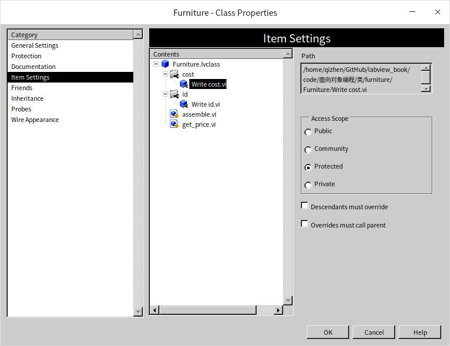
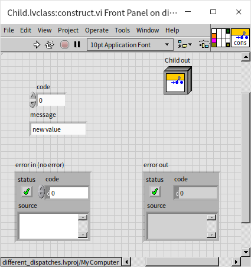
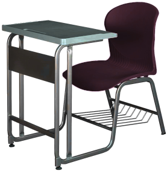

# 接口

## “类”的种类

LabVIEW为了降低学习门槛，在2020之前，只提供了一种“类”。但是如果我们看一下其它面向对象的编程语言，会发现，它们通常可以实现很多种不同类型的“类”，而且有很多不同的分类方法。

### 访问权限

按照访问权限来分，类的属性（数据）和方法（函数或VI）可以分为：

* 公有：类内和类外都可访问。类内访问是指在同一个类的方法（函数或VI）的代码中可以读写，否则就是类外访问。
* 私有：类内可访问，类外不可访问。
* 保护：可以在类内，或者子类内访问。
* 友元：有的编程语言支持友元的概念，是指某个类的属性和方法可以被其它一些指定为友元的方法或类访问到。

在LabVIEW中，类的属性（数据）只有一种访问权限，私有，数据只能被同一个类中的VI读写。LabVIEW中，类的方法（VI）到是支持了以上所有四种访问权限的设置，它在类的设置对话框中：

底层的方法（VI）要尽量设置成私有的，不能够让用户直接使用。在LabVIEW还没有完善的私有VI保护功能的时候，笔者常常遇到一种情况：修改了一个底层VI中的问题，然后就会有用户抱怨说，笔者的改动破坏了他们的应用程序，他们没办法再像原来那样使用被改动过的VI了。这些VI本来并不打算给用户使用的，可是用户就是上帝嘛，既然他们已经在用了，也就只能把修改回退回去让这些VI保持不变的行为。这样就造成功能模块非常难以维护，每一处细节都有可能影响到一些客户，都不能动。反之，如果把底层的VI都设置为私有的，这样就能够确保用户不会使用它们。模块的维护者就可以放心大胆的去修改它们了，只要保证提供给用胡的API不变，底层结构怎么更新都没事。

比如，我们上一节中使用的家具店的例子，家居类中数据访问方法只是给子孙类中的方法使用的，所以应当设置为“保护”（Protected）权限。

有些语言中，类本身也可以设置访问权限，私有或共有。这样可以把模块也分出层次：一个应用程序先划分成几个大模块，每个大模块又可以划分成若干小模块，小模块可以定义为私有的，或者在不同的大模块之间共享。LabVIEW的类算然不能嵌套，但是LabVIEW的库可以嵌套，我们有可能会在一个大型项目中划分若干库，某个库中有创建出若干类。这时候这个类作为库中的一个成员，也可以设置它是私有，或共有等。

### 是否需要实例化 

* 静态：静态的属性和方法不需要类实例化就可以被访问。
* 动态：动态的属性和方法只能通过类的某个实例进行访问。

需要格外注意的是，LabVIEW中的“基于动态分配模板”和“基于静态分配模板”与讨论其它语言时候所说的动态静态完全是不同的概念。按照其它语言通常对静态动态的定义，我们之前介绍到的LabVIEW类中的属性和方法基本上都是动态的：类中VI都有一个“类”输入控件，并且是必须的。也就是说，不输入一个类的实例进来，这些VI不能运行。LabIVEW的类中也可以加静态方法，只要添加一个普通的VI，没有类输入控件的就可以了。比如下图中的VI，它虽然被放置在一个类中，但并没有类的输入，因此可以在任何地方被直接调用。

这相当于这个VI仅仅利用了类的封装特性，把它和相关的VI封装在同一个类里。有一些VI很适合被封装在类里，比如我们之前演示过的构造VI，它并没有类的输入，但是这个VI可以产生一个类的实例，并且对它进行初始化。可以在这个VI里面设置一些对象初始的数据，打开所需的文件，仪器，链接网络资源等。下图是一个构造VI的示例：

### 是否需要或必须被子类覆盖

* 普通函数：大多数语言里，普通的函数对应LabVIEW类中的“基于静态分配模板”VI。这种函数或VI不会被子类中的函数或VI覆盖。
* 虚函数：对应LabVIEW类中的“基于动态分配模板”VI。这种函数或VI会被子类中的函数或VI覆盖。虚函数在子类中被覆盖后仍然是虚函数，如果到某一层级之后不想再让子孙类覆盖了怎么办？有的语言又定义了
* 最终函数：不允许被子类中的函数覆盖。
* 抽象函数：也被称为纯虚函数。这是一种虚函数，但基类通常只定义了函数的名字和输入输出参数类型，并没有实现（编写代码给）这个函数。抽象函数需要在子类中实现。LabVIEW中可以通过把一个方法设置为必须在子孙类中重写来达到设置抽象VI（纯虚VI）的目的。

与函数类似，类也有普通类的和抽象类。有些语言里还有最终（final）类。
* 抽象类：不能实例化，只能用于被子类继承。
* 最终类：不能被继承

不能被实例化的类有什么用？还是使用上一节用过的例子，一家家具店只卖两种家具：桌子和椅子。这时候我们可以定义一个“家具”类，它有两个子类：“桌子”类和“椅子”类。这时候家具就应该是一个抽象类，因为家具店里不存在除了桌子和椅子之外的其它家具类型。为了预防程序员可能出现的错误，把家具类设为抽象类，就会强制使用者从桌子或椅子创建家具实例，不至于创建出一个不知道类型的家具来。
桌子和椅子并不适合被设置为最终类，因为桌椅还可以细分成很多种类，比如躺椅、长条椅等都可以从椅子类派生出来。
最终函数和最终类的使用一般都是处于安全原因，比如我们写了一个用于验证密码的类，为了防止有人把功能被修改了的实例传给调用者，可以把验证密码类设为最终类，放置被继承后在子类里被重写。

LabVIEW中没有抽象类的定义，但是我们下面很快就会介绍一个与它非常相似的概念：“接口”。我们可以使用接口来完成抽象类的功能。

## 多继承

### 多继承的问题
LabVIEW的类不允许多继承，一个类只能有一个父类。当然一个类还是可以有多个子类的。但实际应用中，还是会遇到很多需要多继承的情况的。比如还是上面那个家具店，他们只卖坐姿和椅子，但是偏有这么种家具，它既是桌子也是椅子：

这种合体桌椅即有桌子的属性和方法，也有椅子的属性和方法，最符合直觉的就是它应该同时有两个父类：“桌子”类和“椅子”类。它应该把两个父类的属性和方法都继承来，如果只能单继承，比如只能继承自椅子类，那么它具有的桌子的属性和方法，就要再重新编程实现一遍，比较低效。其实还有个比低效更严重的问题，如果某个程序是用来处理桌子的，程序只能输入桌子的实例，由于这个合体桌椅是继承自椅子类，就无法把他传给程序做处理了。

有些编程语言，是允许多继承的，比如C++。但是多继承引发了很多更为严重的问题，比如属性和方法冲突的问题。在多继承的情况下，我们可以写一个“合体桌椅”类，同时继承桌子和椅子。桌子和椅子类中可能会有一些同名的方法，那么合体桌椅类应该继承谁的呢？
* 有时候可能需要同时保留两个父类里同名的方法，比如桌子和椅子都有“返回承重”方法，可以得到家具的承重参数，“合体桌椅”类的桌子部分和椅子部分还是有不同承重的，所以需要同时保留来自两个父类的“返回承重”方法；
* 有时候可能应该在两个父类的同名方法中只保留一份，比如桌子和椅子都有“返回价格”方法，合体桌椅也不可能一个东西返回两样价格。
* 更麻烦的情况是，有一个程序用于处理所有的家具，它的输入数据类型是“家具”，当有一把合体桌椅被当做“家具”类的实例传递给程序后，程序调用了实例的“返回承重”方法，这时候你觉得程序会拿到合体桌椅从桌子类那里继承来的方法，还是从椅子类那里继承来的方法，还是最早他们共同从“家具”类里继承来的方法？

其实，编程语言肯定会把这些情况都定义的明明白白，问题程序员搞不清楚。程序员会写出能产生各种莫名其妙结果的代码，以至于使用多继承产生的问题远比它解决的问题多。学习C++编程经常看到的一个建议就是尽量不要使用多继承。再C++之后的一些主流编程语言直接就取消了类的多继承。既不能使用类的多继承，有需要合体桌椅同时被处理桌子的程序和处理椅子的程序都接受，怎么办呢？解决方法是使用“接口”。

### 接口

我们可以把接口想象为只包含抽象函数的抽象类。接口可以被多继承而不引起混乱，因为接口中只有方法的定义，而没有实现。我们可以明确的知道程序不会调用到接口里的方法，因为哪里没有实现方法的代码。当一个类继承了一个父类，那么它是为了借用父类实现好的方法做事情；当一个类继承了一个接口，它是保证会自己会实现接口要求的所有方法。一个类当然可以继承多个接口，保证自己会支持每个接口定义的所有方法。合体桌椅同时继承“桌子”接口和“椅子”接口，那么就可以同时被处理桌子的程序和处理椅子的程序接受了。

接口虽然解决了一个对象同时支持多类功能的问题，可以让这个对象被多个种处理不同类型数据的程序接受。但是它并没有解决有效降低重复代码的问题，因为很多方法明明已经在其它类中定义了，却不能继承。不同的编程语言采取了一些不同的措施来更有效的重复利用代码。比如在PHP语言中引入了一种叫做Traits（特性）的东西。一个特性是一个代码块，它的封装方式与类是有些相似的。在其它类中，可以使用一个定义好的特性。比如我们定义一个TableTraits，封装一些桌子会用的方法，比如put_tableclose方法。我们还有一个叫做DeskClass的类，使用了TableTraits这个特性，这样DeskClass就拥有了TableTraits封装的所有方法。一个特性可以备用在多个类中，一个类也可以使用多个特性。比如，另一个叫做DiningTableClass的类已使用了TableTraits这个特性，DiningTableClass就也拥有了put_tableclose方法。

与类继承不同，特性中的方法是被直接挪到了类里面，在程序运行时，我们是看不到TableTraits这种东西的，所有的方法就如同是直接在类中实现的一样。我们只能看到DeskClass:put_tableclose方法和DiningTableClass:put_tableclose方法。这样就解决了多继承是提到的问题。

Java在解决这个问题的时候，采取了另一种策略，他允许在接口中给函数添加默认实现。如果使用了接口的类没有重写这个方法，那么，它的对象就会使用接口中实现的这个方法。接口中的方法有了实现，又有多继承，如果不加以限制就和类的多继承没区别了，就又会引起多继承的所有问题。 所以Java对使用类中方法的默认实现有一个限制，当某一个类实现的不同接口中有同名方法，并且接口中都提供有默认实现，那么，这个类必须重写这个方法。这样将来不管哪一个程序使用到这个类的对象的时候，都可以明确的知道调用的是这个类当中重写了的方法，而不是调用到了任何一个接口中实现的方法。这样就避免了，在多继承中搞不清楚是调用关系的问题。

## 接口
