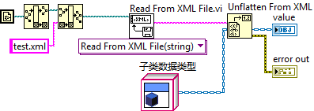
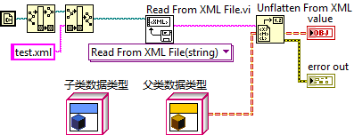

# LVClass的内存加载

## LVClass内存加载引发的效率问题

曾经有一个LabVIEW的用户抱怨：他编写的一个LabVIEW程序，每次打开主程序就要花费几分钟的时间，这有点令他忍无可忍。笔者对他的项目分析后，得出结论：程序的效率问题是由LvClass引起的。他的项目包含有上百个类（LvClass），大量的LvClass有可能造成效率低下。

LabVIEW中有一个属性节点可以用来查看内存中所有的VI，利用它就可以查看一个程序被打开后，到底装入了哪些VI（图13.40）。

\
图13.40 查看所有内存中的VI

假设有一个VI，它不属于任何LvClass，也不包括任何子VI，打开这个VI（即便这个VI是属于某个lvlib的）后，可以查看到只有这个VI会被装入内存。但是，如果打开的是某一个LvClass中的VI，则不但这个VI会被装入内存，它所在的类中的所有其它的VI也都会被调入内存。如果这个类从属某个父类和祖先类，那么所有的父类、祖先类中的VI也统统都会被调入内存。

总结一下：当一个VI被装入内存时，则
1.	它的所有子VI都会被装入内存；
2.	它所在的类中的所有的VI都会被装入内存；
3.	它所在的类的父类中的所有的VI都会被装入内存。
4.	以上3条是可以递归的。
 

假如一个主VI A.vi被装入内存，它的子VI B.vi也会被装入内存，和B同属一个类的VI C.vi也要被装入内存， C中有个子VI D.vi， D.vi属于类E.lvclass， E.lvclass的父类是F.lvclass，F.lvclass中有个方法VI G.vi。尽管G.vi的功能和程序A.vi根本不挨边，但也会被装入内存。表面上这个程序不算太大，但是程序开始启动时，却需要把多于程序本身许多倍的不相关的VI都装入内存，这一过程也许会长达几分钟的时间。

鉴于LvClass的这一特性，设计使用它的时候一定要格外小心。为此需要注意如下几点：

1.	如果仅需要对一些VI进行封装，那么应当使用lvlib，而不是lvclass。两者封装的主要区别是，lvlib只封装方法（也就是VI），lvclass还可以封装对象的属性（也就是模块用到的数据）。
2.	类中的VI必须是高内聚的，即类中的方法共同完成某一基本功能，不可再分割。应用程序一旦用到这个类中的某个VI，就意味着程序将会使用到类中几乎全部的VI。如果一个应用程序可能只使用这个类中的某几个VI，那就不必使用类。
3.	继承关系应当尽量简单，没有必要的时候尽量不使用继承。LabVIEW不支持接口，不应该创建仅当作接口用的纯虚类。
4.	尽量不要嵌套调用类中的VI。比如，在某一个类的VI中又去调用另一个类中的VI。
5.	打算使用类的多态特性时要注意，多态使得应用程序在运行时，会根据对象的类型选择对应的处理方法。但有些选择应当是程序编译时就做出的，它们不适合套用在多态特性上。
 
举几个具体的例子：
-	读写INI文件的模块比较适合做成类，每个INI文件对应一个类的实例。它有丰富的数据（文件的内容）；它的方法有限，基本上只需要打开、读条目、写条目、保存关闭，这四个方法，并且一般的应用程序都会同时使用到这四个方法。
-	复杂仪器的驱动程序不适合做成类，因为驱动程序会提供非常多的功能。如示波器有各种触发模式，而一个应用程序通常只用到多种模式中的某一种就够了。
-	某个可以生成测试报告给用户的测试程序，在程序运行时用户可以选择不同的报告类型。生成报告的模块可以用lvclass来设计。因为生成不同类型的报告的方法间，可重用代码很多，可以为它们设计一个基类。
-	某个可以支持多种不同型号仪器的测试程序，不适合使用lvclass来设计选择仪器驱动程序这部分功能。因为测试程序发布给用户时，虽然不同用户使用不同的硬件，但特定用户的硬件设备是固定的。对仪器的选择应当是程序发布时就决定好的，而不是等到程序每次运行起来后再判断的。

## LVClass内存加载引发的类型转换问题

我们做一个实验，看看能否把一个LVClass类型的对象转换成XML格式，保存成文件。然后再从文件中把数据转回成相应LVClass的对象。

首先，给一个子类的对象设置一些数据。然后把它当做父类类型的数据，平化成XML文本，存盘：

关闭LabVIEW，然后重新打开LabVIEW。再编写一个反向程序，把XML数据转换成父类类型的数据：

发现函数 Unflatten From XML 返回了一个错误，输出值value返回的是一个空的数据。

这个错误产生原因是：当把子类对象转换成父类类型的时候，这个对象类型虽然变成了父类类型，但其数据仍然是子类的。在转换成XML格式时，XML格式中记录的仍然是子类的数据。

在反向过程中，Unflatten From XML拿到的数据是子类的，但它企图转换时，却发现内存中没有子类的类型信息，因此它也就不知道如何转换这个数据，所以报错。

如果这个程序稍微改动一下，把XML数据直接转换成子类的数据，就不会出错了：

实际上，子类的数据总是可以用父类来表示的。因此这个XML数据亦可以直接被转换成父类的类型，但前提是，一定要保证运行时子类的类型已经被加载到内存中去了。只要在程序中放置一个子类的对象，自然就可以把子类加载至内存。像下面这个程序就可以正常工作：

由以上的实验我们可以看出：

1. 若XML中的内容如果是属于某个LVClass类型的数据，把这些数据转换回对应LVClass的对象的时候，那个LVClass一定要已经被加载进内存才行，否则LabVIEW是不会知道如何转换的。
2. 上一节提到：当子类被加载进内存时，它所有的父类也会被载入内存。但反过来并不成立。因为一个类有哪些父类是确定的，父类的地址就记录在子类中。但一个夫类并不会知道他有多少个子类，任何人都有可能从它再派生出不同的子类来，因此父类在装入内存时，不可能把自己的子类也都装进来。

