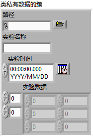
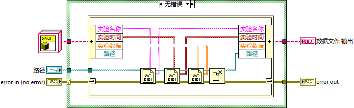
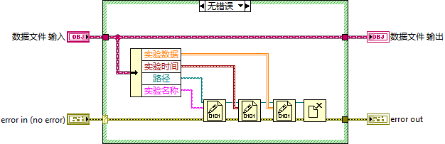
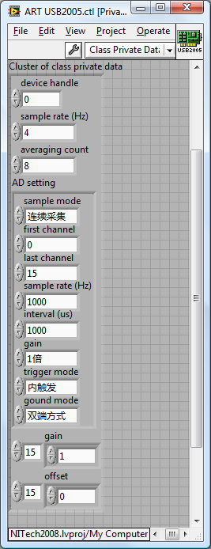
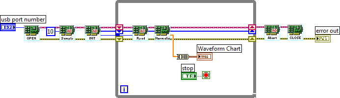
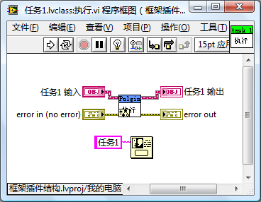
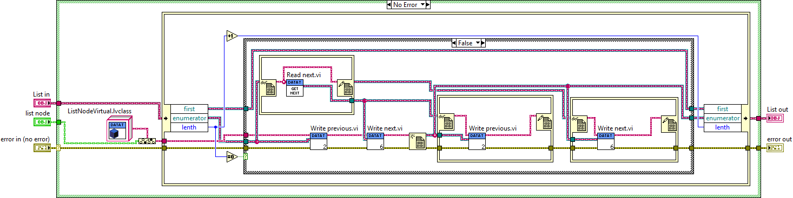
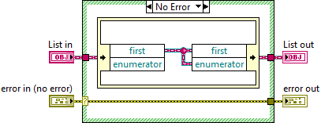
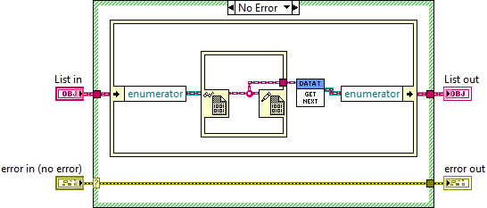
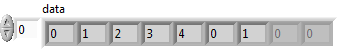

# 应用实例

## 管理一个类的多个对象

这是最常见的面向对象编程的应用。在程序里经常会出现需要管理多个同类型对象的情况。比如一个测试程序，可能会使用到同类型的多台仪器。那就可以把这个型号的仪器定义为一个类，每台仪器就是这个类的一个对象；它每次采集到的数据也是相同类型的，也可以把数据的模型定义成一个类，每次采集的数据是一个实例；数据需要保存在格式相同的文件中，所以可以把这种格式的文件定义为一个类，每个文件就是一个实例。

比如一个简单测试程序，需要把所有的测试数据保存在统一格式的文件中。在应用程序中需要管理多个格式相同的文件，所以可以为这种类型的文件编写一个类。

这个文件中保存有实验名称、实验时间和实验数据。因此，类的数据中应当包含这些信息（图
13.11）。

图 .11类的数据

这些数据是不能直接被应用程序读写的，所以还要为它们创建读写方法。使用右键菜单"新建"中的"用于数据成员访问的VI"，就可以直接创建出这些属性读写方法。

除了属性读写方法，数据文件还常常会用到以下几个方法：打开、创建、保存等。因此，这个数据文件类中也实现了这些方法。

"打开"方法用于从文件中读出数据，保存在类的数据中（图 13.12）。

图 .12数据文件类的打开方法

"保存"方法与"打开"方法是相反的过程。把类中的数据存入文件（图 13.13）。

图 .13数据文件类的保存方法

"创建"方法用于创建一个空的数据文件对象。为了演示方便，程序中还为这个数据文件类添加了一个"清空"方法，用于清空类中的所有数据。设计好的类结构如图
13.14所示。

图 .14数据文件类

图
13.15是使用这个类的一段演示程序，倘若需要应用到多个数据文件，程序可以在一开始就为每个文件生成一个对象。之后的程序中，就可以使用类的方法，对这些对象进行操作。使用类的方法时，和使用普通VI是一样的，把它们拖到程序框图上即可使用。

图 .15在应用程序中使用类

另外再举一个例子，笔者曾经在一个演示项目中使用到了一块某公司产的数据采集卡。为了编程方便，为它写了一套基于类的驱动程序。其总体结构如图
13.16所示。

图 .16基于类的硬件驱动程序

这个驱动程序的思路是，把所有这块硬件的设置参数（如：采样率、放大倍数等）作为类的数据（图
13.17），而用户可以调用的硬件的功能（如：初始化、读数据等）则作为类的方法。类中某些VI仅作为其它VI的子VI，不能给用户使用的，只要设为私有，就可以了。

图 .17硬件驱动程序类中的数据

图
13.18是使用这一驱动程序的一个示例程序。例子只演示了使用一块硬件卡的情况，如果程序需要用到多块相同的硬件卡，只要用"Open"方法打开多个驱动程序类的对象就可以了。

图 .18使用基于面向对象的驱动程序

## 同一段代码处理多种数据类型

虽然管理多个对象是最典型的类的使用方法，但是读者可能会发现，在前面提到的这两个例子中，类并不是必需的。完全可以使用簇和LabVIEW的库达到同样的效果：簇用来保存原来类中的数据，而原本类的方法都做成库中的VI就可以了。

LabVIEW中的类可以涵盖簇的功能，这就如同C++中的类和结构有时也可通用一样。不过，使用簇加库的方式，只能实现对模块的封装，类的另外两大特性：继承和多态是没法实现的。所以类的一些更为复杂的应用，就不可能使用簇来替代了。

如果使用簇加库的方式，那么应用程序的一份代码，只能处理一种数据类型。比如，图
13.15中的示例程序，只是处理了一种格式的文件。如果使用簇来记录所有数据文件的内容也是可以的。但是，如果程序中需要使用几种不同格式的文件，即表示它们的簇的内容不同，是属于不同的数据类型的簇。一个子VI的某个参数必须是固定的，换成另外一种数据类型就不能接受了。所以若需要处理两种以上的数据类型，即便所做的工作是相同的，也必须编写两套VI。

但是，如果某个VI属于类的子VI，那么，尽管每个子类的数据类型不同，它就可以处理这个类的所有子类。这样，在应用程序中，只需编写一段代码，就可以处理多种不同类型的数据，势必会大大提高编程效率。

以一个最简单的应用为例。一个程序需要处理两种类型的数据：一个数值型，一个簇型。程序的功能是把两种类型的数据中的数值都加1。

作为演示，这个程序的代码极为简单，实际上只是调用了一个子VI。但是这个子VI却可以处理两种不同类型的数据（图
13.19）。

图 .19同一方法处可以处理不同数据类型

实现这一功能的方法是，把程序中使用到的两种数据类型"数值"和"簇"装箱成类。（换句话说，就是创建两个类，这两个类中的数据分别是数值类型的数据，和簇类型的数据。）再创建一个数据为空的基本类做为它们共同的父类（图
13.20）。而程序中所用到的算法，都在这个父类中实现。父类的方法是可以直接被子类使用的，每个子类数据类型不同，这样父类的算法就可以应用于多种不同的数据类型了。

图 .20处理不同数据类型的类的结构

多态VI也可以实现类似的功能，即根据不同类型的输入数据，选择不同的实例VI来处理这个数据。但是使用多态VI时，程序没有办法把各种不同的类型的输入数据放置在同一数据结构（比如数组）中进行存储和传递。换言之，多态VI是在编程时就根据输入数据类型的不同，为其选择了不同的实例VI进行处理。实例VI一旦选定，在程序运行过程中就不能改变了。而面向对象的编程方法则可以做到在程序运行时，用相同的方法把所有数据传给了某个子VI后，这个子VI仍然可以根据输入数据类型的不同为其分配不同的处理方法。比如，为了简化应用程序代码，在处理图
13.19中的程序时，往往使用循环结构，来减少对"加1.vi"子VI的调用次数。如图
13.21所示。

图 .21把不同类型的数据放在同一数据结构中

算法应该是与数据类型无关的。比如，一个排序算法既可以给数值类型的数据排序，又可以给字符串类型的数据排序。在编程实现一个算法时，也应该做到这一点。编写好一段某种算法的程序，它就应该可以方便地适用于各种类型的数据，而不必针对每种不同类型的数据再重新实现算法。

把算法和数据类型分离开来的编程方法叫做泛型编程。目前，不借助于类，是无法在LabVIEW上实现泛型编程的。了解Java泛型编程的读者对这一应用会比较容易理解，因为LabVIEW使用的这种方法和Java中泛型编程的实现方法是非常类似的。

## 递归

本书在第6.3.4节中介绍了利用动态调用实现递归的编程方法。但是使用动态调用方法编程比较繁琐，而且运行效率也比较低。实现递归调用的理想方法是，可以把一个具有递归功能的VI直接拖拽到自己的程序框图上，成为自己的子VI。然而LabVIEW
8.6以及之前的版本是不允许这样做的。幸好有一个例外，就是类的方法VI可以作为自己的子VI，进行递归调用。

所以，只要把6.3.4节中用来计算阶乘的那个Factorial.vi放在一个类中，就可以大大简化实现代码。新创建的类如图
13.22所示，它的数据是空的，也只有一个方法，就是需要被递归调用的那个VI。

图 .22为实现递归调用创建的类

新的递归实现阶乘算法如下：在它的VI程序框图上调用了一个子VI，而这个子VI正是它自身（图
13.23）。对比利用动态调用的实现方法（图 6.24），程序是否大为简化了？

图 .23借助类实现递归调用

## 框架插件程序架构

本书在第6.3.3节中介绍了利用动态调用实现"框架-插件"式程序结构的编程方法。使用类也可以达到同样的效果，并且可以简化代码，并提高程序效率。

比如，某一应用程序需要把所有放在相对路径"Plugin/"下的任务都运行一遍。这就可以使用"框架-插件"式程序结构。界面及任务调度等是主程序，也就是框架；被执行的每一个任务是一个插件。编写框架程序时，有多少个插件是不确定的，每次框架程序运行起来之后，再检查"Plugin/"文件夹，凡是里面合乎定义的文件都是一个插件。

使用类来编写这种模式的程序，需要为所有的插件定义一个统一的接口，即插件接口类。这个类定义了插件的接口方法，这个方法VI在每个插件中都应该有固定的连线板模式和参数类型。这样框架程序才能以统一的标准来调用插件。接口方法VI可以多于一个。

在演示程序中，每个插件只有一个接口方法，叫做"执行.vi"。调用这个VI时，程序弹出一个对话框，上面标志着这个插件的名字。所以，在"插件接口"类只需要创建一个动态分配模板的方法。这个VI除了类输入/输出和错误输入/输出之外，不需要额外的参数。

程序中的每个插件，也是一个类。它们都继承自同一个父类"插件接口"类。每个子类都重写父类的接口方法，在这个例子中就是"执行.vi"。每个任务所完成的具体工作都在这个"执行.vi"中完成。

实现好的项目结构如图
13.24所示："插件接口"是所有插件的父类；"任务xx"是每个插件的类。它们有统一的接口方法。

图 .24插件们的类结构

图
13.25是其中一个任务的接口方法的实现代码，在演示程序中它只是弹出一个对话框，显示这是任务1。

图 .25插件接口方法的程序框图

框架程序的实现方法如图
13.26所示。它的前半部分与使用动态VI编写框架程序的方法是一样的：在固定的文件夹下，找到所有符合插件定义的文件。

程序后半部分有所不同。框架程序首先调用"编程-\>簇、类与变体-\>获取LV类默认值"VI，这个VI可以为一个类文件创建一个采用默认值的对象。由于这个VI可以应用在所有类上，所以它输出的类是所有LabVIEW类共同的祖先类"LabVIEW对象"。而需要调用的是插件接口类中的方法，所以，接下来需要使用"编程-\>簇、类与变体-\>转换为特定的类"函数，把LabVIEW对象类型转为更为特殊化的"插件接口"类。之后调用插件接口类的"执行"方法。

由于类有多态性，虽然程序框图上只是调用了插件接口类的"执行"方法，但程序实际上调用的是每个插件的特定类的执行方法。这样，执行这个演示程序，程序会顺序弹出"任务1"、"任务2"等信息。

图 .26框架插件结构程序的实现方法

使用类来实现框架插件结构的程序，比使用动态调用VI方法实现相同的结构要更为简单高效。

下面比较一下这两种方法各自的优缺点。

|             | 动态调用VI                                               | LvClass                                                                                                                                        |
|-------------|----------------------------------------------------------|------------------------------------------------------------------------------------------------------------------------------------------------|
| LabVIEW版本 | LabVIEW很早的版本就具备了动态调用VI的功能。              | LabVIEW 8.2开始才支持面向对象的程序设计。                                                                                                      |
| 开发的难度  | 相对来说比较直观易懂。                                   | 对于已经了解了LabVIEW面向对象编程的用户来说，做一个插件也是比较简单的。但是如果完全没接触过面向对象这个概念，还需要预先学习面向对象编程。      |
| 插件的形式  | 插件是一个单独的VI，插件所有的功能都必须在这个VI中实现。 | 插件是一个对象（类的实例）。插件对象可以拥有多个方法。一个新的插件被添加进来后，它的所有方法可以自动应用于框架程序中任何调用了插件方法的地方。 |
| 总结        | 适合简单程序                                             | 适合大型程序                                                                                                                                   |

表 13.1动态调用VI与LvClass实现框架插件程序架构的比较

## 使用LvClass实现链表等数据结构

LabVIEW自带的数据结构只有数组和队列。多数情况下，这两种数据结构足够开发者使用了。但是，有C++和C#语言编程经验的程序员，在编写LabVIEW程序时也常常会希望使用C++和C#编程语言中常见的数据结构，比如链表（List）、树（Tree）等。其实，在LabVIEW中也可以编程实现这些数据结构。一个比较直观易懂的编程方法是基于LabVIEW中的类和引用来实现各类数据结构。

在C++和C#语言中还常常会遇到数据容器这一个概念。数据结构和数据容器是十分相似的概念：数据结构侧重于数据的存储方式，比如按何种顺序存储数据；数据结构再加上与此结构相关的操作方法，比如添加删除数据等方法，就构成了一个数据容器。脱离了操作方法，单纯的数据结构用处非常有限。因此，本书在提到数据结构或者数据容器时，指的都是同一回事：数据结构和相关的方法。

本节，以双向链表为例，讲解一下如何在LabVIEW中实现一个数据结构。

\
图13.27 双向链表示意图

在双向链表中，每个节点都记录了上一个节点和下一个节点的位置。因此，在双向链表中，可以从一个节点直接跳转到它的上一个或下一个节点上去，也就是正向或反向遍历整个链表。可以直观地想到，使用LvClass就能够实现这样的节点。只要为这个节点创建一个类ListNode，并且这个类有两个成员变量，它们的类型都是ListNode的引用，分别用于指向前一个和后一个节点就可以了：

\
图13.28 ListNode类中的数据

这样的设计在文本编程语言中是没有问题的，但在LabVIEW中行不通。在其它编程语言中，程序运行时，才会对类的对象进行初始化。LabVIEW中，VI一打开，它的控件和常量就需要被初始化了。某个对象在初始化时，它的成员变量也要被初始化，若它的成员变量的类型还是这个类，这个初始化的过程就陷入了死锁：类需要它的成员变量先初始化；它的成员变量需要这个类先初始化。

基于同样的原因，一个类的成员变量的数据类型也不可以是这个类的子类：子类初始化需要先对它的父类进行初始化。但是，一个类的成员变量的数据类型可以是这个类的父类：父类在初始化的时候，不需要理会它的任何子类。

既然父类初始化时，不依赖于子类的初始化；而子类的对象又可以被当做父类的类型来保存，那就可以利用这一特性在LabVIEW中实现数据结构的节点了。只不过在LabVIEW实现链表的节点要多一个步骤：需要为ListNode类再定义一个父类ListNodeVirtual。这个父类不做任何实质性的工作，它仅用于保存相邻节点的引用。

\
图13.29 LabVIEW可以使用的ListNode类的示意图

以上两个类是针对链表节点的。双向链表本身也需要做成一个类：DoubleLinkedList类，这个类中封装有链表的属性和方法。比如它需要一个指向链表表头的引用；需要有为链表添加删除数据的方法；为遍历链表中的数据，还需要有一个迭代器......

下面的示例，实现了链表的几个简单功能。演示程序项目结构如图13.30所示。

\
图13.30 双向链表项目结构

ListNode的成员变量包括一个数据，和两个指向前后节点的引用。

\
图13.31 ListNode类的成员变量

DoubleLinkedList类的成员变量包括指向链表头节点的引用，迭代器指向的节点的引用，并记录了链表长度

\
图13.32 DoubleLinkedList类的成员变量

下面详细介绍一下链表中几个主要方法是如何实现的。

首先是Append after
Enumerator.vi这个方法，它是链表里最复杂的一个方法。它的输入是链表中一个新的节点，它把这个新节点添加在链表迭代器指向的那个节点的后面。

在给链表添加数据时，会遇到两种情况。第一种情况，这个链表是一个空链表，那么被添加的节点就是这个链表的首节点，链表的迭代器也应当指向这个唯一的节点。

如果设计的这个链表是一个环状链表。当链表中只有一个节点的时候，这个链表的上一个和下一个节点都是它自己（图13.33）。

\
图13.33 在空链表中插入一个节点

第二种情况，如果链表不是空的，就把新节点插在迭代器指向的节点的后面。具体操作如下：新节点的前一节点指向的应当是迭代器指向的那个节点；新节点的后一节点是迭代器指向节点的后一节点；迭代器指向节点的新的后一节点应当是这个新节点；原来迭代器的后一节点的前一节点也应当换成这个新的节点（这一段比较容易引起迷惑，读者可以想象在图13.27中插入一个新节点是，对箭头所作的修改。）；最后，迭代器也指向了这个新的节点。这样连续添加新节点时，它们会按照先后顺序插入链表。程序如图13.34所示。

\
图13.34 在非空的链表中插入一个节点

最终的演示程序还用到了其它几个方法。

Reset Enumerator.vi
负责把迭代器复位，也就是指向链表的头节点（图13.35）。

\
图13.35 Reset Enumerator.vi的代码

Enumerator go Next.vi 用于让迭代器向后移动一个节点（图13.36）。

\
图13.36 Enumerator go Next.vi的代码

Enumerator Value.vi 返回迭代器指向的那个节点（图13.37）。

\
图13.37 Enumerator Value.vi的代码

使用这几个方法就可以搭建出一个简单的演示程序来实现链表的功能了。图13.38是一个简单的演示程序，它分两部分：第一部分是左面那个循环，每次循环迭代就会创建出一个新的ListNode对象，它的数值是当前迭代的次数；右半部分使用链表的迭代器遍历链表中的节点。在这个演示程序中，迭代器移动次数比链表长度多了两次，因为链表是环状的，转着圈访问，链表中的头两个元素会被读出两遍。

\
图13.38 演示程序代码

程序运行后，data显示了迭代器每一步所指向的节点的值（图13.39）。

\
图13.39 演示程序运行结果

# LVClass的效率

曾经有一个LabVIEW的用户抱怨：他编写的一个LabVIEW程序，每次打开主程序就要花费几分钟的时间，这有点令他忍无可忍。笔者对他的项目分析后，得出结论：程序的效率问题是由LvClass引起的。他的项目包含有上百个类（LvClass），大量的[LvClass](http://ruanqizhen.spaces.live.com/blog/cns!5852D4F797C53FB6!3213.entry)有可能造成效率低下。

LabVIEW中有一个属性节点可以用来查看内存中所有的VI，利用它就可以查看一个程序被打开后，到底装入了哪些VI（图13.40）。

\
图13.40 查看所有内存中的VI

假设有一个VI，它不属于任何LvClass，也不包括任何子VI，打开这个VI（即便这个VI是属于某个lvlib的）后，可以查看到只有这个VI会被装入内存。但是，如果打开的是某一个LvClass中的VI，则不但这个VI会被装入内存，它所在的类中的所有其它的VI也都会被调入内存。如果这个类从属某个父类和祖先类，那么所有的父类、祖先类中的VI也统统都会被调入内存。

总结一下：当一个VI被装入内存时，则

1.  
2.  
3.  
4.  

它的所有子VI都会被装入内存；它所在的类中的所有的VI都会被装入内存；它所在的类的父类中的所有的VI都会被装入内存。以上3条是可以递归的。假如一个主VI
A.vi被装入内存，它的子VI B.vi也会被装入内存，和B同属一个类的VI
C.vi也要被装入内存， C中有个子VI D.vi， D.vi属于类E.lvclass，
E.lvclass的父类是F.lvclass，F.lvclass中有个方法VI
G.vi。尽管G.vi的功能和程序A.vi根本不挨边，但也会被装入内存。表面上这个程序不算太大，但是程序开始启动时，却需要把多于程序本身许多倍的不相关的VI都装入内存，这一过程也许会长达几分钟的时间。

鉴于LvClass的这一特性，设计使用它的时候一定要格外小心。为此需要注意如下几点：

1.  
2.  
3.  
4.  
5.  

如果仅需要对一些VI进行封装，那么应当使用lvlib，而不是lvclass。两者封装的主要区别是，lvlib只封装方法（也就是VI），lvclass还可以封装对象的属性（也就是模块用到的数据）。类中的VI必须是高内聚的，即类中的方法共同完成某一基本功能，不可再分割。应用程序一旦用到这个类中的某个VI，就意味着程序将会使用到类中几乎全部的VI。如果一个应用程序可能只使用这个类中的某几个VI，那就不必使用类。继承关系应当尽量简单，没有必要的时候尽量不使用继承。LabVIEW不支持接口，不应该创建仅当作接口用的纯虚类。尽量不要嵌套调用类中的VI。比如，在某一个类的VI中又去调用另一个类中的VI。打算使用类的多态特性时要注意，多态使得应用程序在运行时，会根据对象的类型选择对应的处理方法。但有些选择应当是程序编译时就做出的，它们不适合套用在多态特性上。举几个具体的例子：

-   
-   
-   
-   

读写INI文件的模块比较适合做成类，每个INI文件对应一个类的实例。它有丰富的数据（文件的内容）；它的方法有限，基本上只需要打开、读条目、写条目、保存关闭，这四个方法，并且一般的应用程序都会同时使用到这四个方法。复杂仪器的驱动程序不适合做成类，因为驱动程序会提供非常多的功能。如示波器有各种触发模式，而一个应用程序通常只用到多种模式中的某一种就够了。某个可以生成测试报告给用户的测试程序，在程序运行时用户可以选择不同的报告类型。生成报告的模块可以用lvclass来设计。因为生成不同类型的报告的方法间，可重用代码很多，可以为它们设计一个基类。某个可以支持多种不同型号仪器的测试程序，不适合使用lvclass来设计选择仪器驱动程序这部分功能。因为测试程序发布给用户时，虽然不同用户使用不同的硬件，但特定用户的硬件设备是固定的。对仪器的选择应当是程序发布时就决定好的，而不是等到程序每次运行起来后再判断的。

