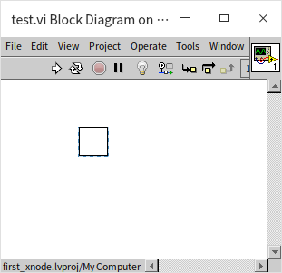
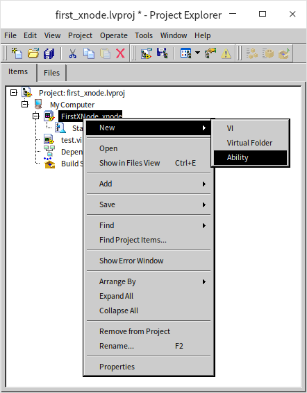
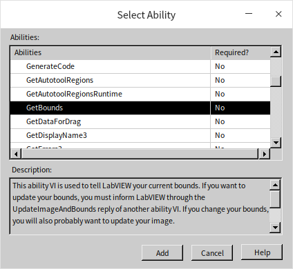
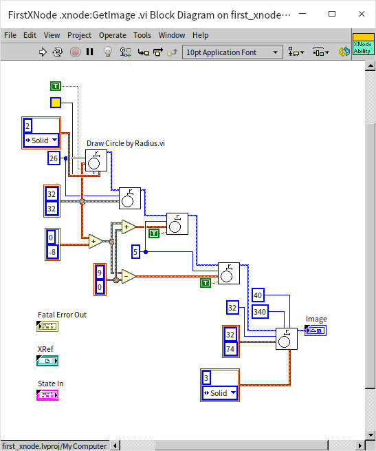
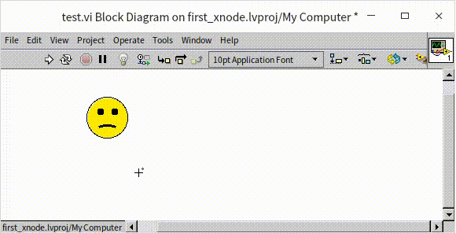
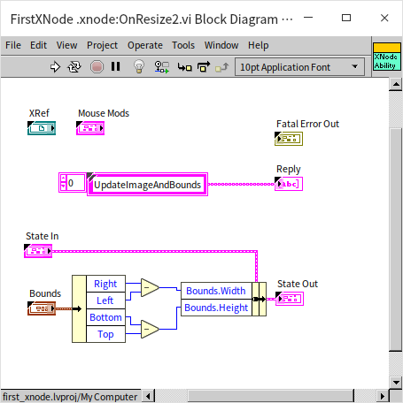

# XNode

:::info

这一节的的示例程序将会使用到 [VI 脚本](vi_server_for_vi) 和 [XControl](ui_xcontrol) 等相关技术。

:::

读者们应该都已经非常熟悉如何创建子 VI 了，甚至创建一些能处理多种数据类型的子 VI。但是我们是否还能创建一些功能更强大的节点呢，就像 LabVIEW 自带的那些函数（比如簇捆绑），甚至是结构（比如循环结构）等等？

LabVIEW 确实也提供了相应的功能，XNode。XNode 看名字，就会联想到 [XControl](ui_xcontrol)。二者确实有一些相似之处。XNode 与 XControl 是差不多同时出现的技术。使用 XControl，用户可制作出有复杂行为的控件；而使用 XNode 则可以制作出有复杂功能和行为的节点。XControl 很早就已经开放给 NI 的外部用户使用了，而 XNode 至今也没有正式开放给外部用户。但是因为 LabVIEW 安装包已经包含了 XNode 的完整功能，用户还是通过一些设置来使用这个功能的，网上可以找到很多用户制作的 XNode 产品。

## 开启 XNode 相关功能

XNode 本质上就是一组有特定格式要求的库和 VI，XControl 本质上也是一组有特定格式要求的库和 VI，所以，理论上，用户不需要对 LabVIEW 做任何特殊设置，只要提供了符合要求的这样一组文件，就可以在程序里使用这个对应的 XNode 了。但在实际应用中，凭空创建这个些 VI 即繁琐又容易出错。如果激活了 LabVIEW 的 XNode 功能，LabVIEW 会提供一些模板以及文档来帮助搭建 XNode。

### Windows

在 Windows 系统下，用户如果想方便的创建 XNode，有两个途径可选。一是官方途径，从 NI 官方得到一个安装到 LabVIEW 上的启用 XNode 功能的证书。如果此路不通，也可以使用一些第三方的工具。利用这些第三方工具，同样可以方便快捷的创建 XNode。比如，XNode Editor （Google 这个工具名，可以搜索到详细信息）。

此外，最好可以在 LabVIEW 的配置文件中添加一下设置，它们可以激活 LabVIEW 中与 XNode 相关的一些工具，帮助进行 XNode 开发。

```ini
XnodeWizardMenu=True
XnodewizardMode=True
XTraceXnode=True
XNodeDebugWindow=True
SuperSecretPrivateSpecialStuff=True
```

在 Windows 系统下，LabVIEW 文件是与 labview.exe 同文件夹下的 labview.ini 文件。

### Linux

笔者主要在 Linux 系统下使用 LabVIEW。在 Linux 系统下启用 XNode 功能要方便的多，只需要将如下配置拷贝到 LabVIEW 的配置文件中即可：

```ini
XNodeDevelopment_LabVIEWInternalTag=True
XnodeWizardMenu=True
XnodewizardMode=True
XTraceXnode=True
XNodeDebugWindow=True
SuperSecretPrivateSpecialStuff=True
```

其中的 XNodeDevelopment_LabVIEWInternalTag=True 设置可以让 LabVIEW 的新建功能增加 XNode 选项。


在 Linux 系统下，LabVIEW 的配置文件的路径是：“/home/<username\>/natinst/.config/LabVIEW-x/labview.conf”。

## XNode 的调试菜单

LabVIEW 自带的一些节点也是使用 XNode 技术制作的。比如 Match Regular Expression，这个节点在函数选板“Programming -> String” 上。它看上去就是一个普通的 LabVIEW 自带的各种函数，但它其实是一个 XNode。当我们按照上文介绍的方法开启 XNode 调试工具之后，在用鼠标右键点击这个节点，会发现右键菜单，多了 XnodeWizardMenu 这一项。这个菜单列出了这个 XNode 所有的功能 VI。XNode 的功能 VI 与 [XControl](ui_xcontrol) 的功能 VI 概念相似，主要用来控制 XNode 的各种行为和功能，我们之后会详细介绍。


在这个调试菜单上选取一个功能 VI，就会打开相应功能 VI 的程序框图。如果将来编写 XNode 遇到困难，可以用此方法打开别人做好的 XNode 的功能 VI，进行参考借鉴。

我们在上图看到的程序框图上的 Match Regular Expression 节点只是这个 XNode 的图标，就好像是子 VI 在调用 VI 程序框图上显示的图标。当我们双击一个子 VI 的图标，会打开这个子 VI 的执行代码；相应的，如果我们想查看这个 XNode 的执行代码是什么，可以 XnodeWizardMenu 菜单中选取 “GeneratedCode”,LabVIEW 会把这个 XNode 的执行代码显示出来。比如下图是这个 Match Regular Expression 节点的执行代码：


上图中的运行代码似乎什么事都没做，其实这是因为这段代码不是某人手工编写的，而是程序程生成出来的（所以叫 GeneratedCode），代码并没有排列得当。点击一下“Cleanup Diagram”按钮，就会看到真正的程序代码了：


与子 VI 有一些不同：子 VI 的代码是固定的，写好的什么样，就一直是什么样；XNode 的运行代码是动态生成的，是会根据配置选项，连接的数据线等条件的改变而改变的。

XNode 功能强大，可以制作出很多不同类型的节点。比如，“Error Ring”是比较类似于数据接线端的节点；“定时循环结构(Timed Loop)”是一种结构节点。

## 功能 VI

XNode 与 [XControl](ui_xcontrol) 相似，通过一些特定的功能 VI 来控制 XNode 的行为和功能。不同之处在于数量， XNode 的功能 VI 的数量比 XControl 多了一个数量级。我们接下来会逐一介绍这其中一些最重要的功能 VI 的用法。

### State

首先，我们先创建一个新的 XNode：


这是会发现，新创建出来的 XNode，只有一个默认的“状态(State)”功能控件。它与 XControl 中的 State 功能控件功能完全相同。它是一个簇控件，簇中包含了用于定义 XNode 所需的每个数据的数据类型。如果哪个数据需要在不同的功能 VI 之间被使用，可以就把它的类型放在 State 功能控件里，这样 XNode 就会自动为它开辟一块存储空间，用来保存这些数据。我们暂时还不需要什么数据，所以可以暂时不去改变默认的 State 功能控件，将来需要用到时，再做修改。

新建的 XNode 没有任何功能 VI，XNode 所有的功能 VI 都是可选的。那么这个空的 XNode 能运行吗？

我们在创建一个测试 VI，然后把新建的 XNode 拖到测试 VI 的程序框图上，可以看到新建 XNode 看上去就是一个空白方块，并且测试 VI 是可以运行的，没有语法错误。只是新建的 XNode 也是空的，运行起来不做任何事情。



### GetBounds

新建 XNode 在其它 VI 的程序框图上是上去是一个空白的方块，大小就是一个子 VI 图标的大小。这在高分辨率显示器上看上去显得太小,子 VI 的图标大小是没法调节的，最大就是 32*32 像素，但 XNode 的图标尺寸是可以调节的，下面我们就使用 GetBounds 功能 VI 把它改大。

首先，为新建的 XNode 添加个这个功能 VI。鼠标右键点击 XNode 项目，选择“Ability”：



LabVIEW 会弹出一个对话框，列出了 XNode 所有的功能 VI：



对话框还给出了每个功能 VI 的简单说明。我们找到 GetBounds，然后点击添加。
GetBounds 功能 VI 用于设定当前 XNode 图标的尺寸。打开这个功能 VI，可以看到他有一个名为“Bounds”的输出，这是我们唯一需要设置的，把尺寸设置大一点 64*64 像素：


再次打开测试 VI 查看，会发现 XNode 的图标大了一倍：


### GetImage

新创建的 XNode 在程序框图上还只是一个空心方块，我们现在给它加上一个有意义的图标。为 XNode 添加图标的功能 VI 是 GetImage。我们使用同样的方法，打开添加功能 VI 对话框，然后找到 GetImage， 选择添加。

这个功能 VI 的核心输出是一个 Image 类型的数据，也就是一张代表图标的图片。如果已经使用作图工具画好一个图标了，那么可以在这里直接从文件中读取图片，或者直接把图标做成常量，放在这个功能 VI 里输出就行了。有的时候，无法为 XNode 预先绘制全部图像，只能在这个 VI 中动态生成，比如我们想要做一个类似捆绑/松绑（Boundle/Unboundle）节点的 XNode，它显示出来的内容会根据接入的数据线的数量和类型产生变化，在知道数据线连接情况之前是无法预先绘制图标的。

在这个的演示程序中，我们使用 LabVIEW 的绘图 VI，从零开始绘制一幅图片作为 XNode 的图标：



再次把这个 XNonde 拖到测试 VI 里，可以看到我们新绘制的图标是一个“苦脸”：


用鼠标选中这个 XNode 会发现，这个图标不再是方形的了，而是一个圆形。这一点与[制作不规子 VI 图标](optimization_coding_style)原理是相似的：编辑或绘制图标时，边缘的空白区域都不会被认作是图标的一部分。


### GetGrowInfo

XNode 的图标不但可以比正常子 VI 图标大，它还允许用户在使用时调整大小。如果想让 XNode 提供这个功能，就需要在 GetGrowInfo 功能 VI 中设定 XNode 尺寸允许的范围。


这个功能 VI 的核心输出是一个簇，包含了如下信息：

* Min Bounds：这是 XNode 图标允许的最小尺寸，用户不能把图标缩的比这个尺寸更小；
* Max Bounds：这是 XNode 图标允许的最大尺寸；
* Vertical Increment：纵向调整的增量，也就是每次增加或减少几个像素点。有些节点，比如：捆绑/松绑（Boundle/Unboundle），是可以纵向拉伸的，但每次伸展增量要恰好能够容纳一个接线端。所以它的增量不会是 1 个像素，而是 5 个（假设每个极限端宽度是 5 个像素）。我们的示例图标可以是允许尺寸内的任意大小，所以不需修改，表示采用默认值，增量为 1 个像素；
* Horizontal Increment：横向调整的增量；
* Maintain Aspect?：是否维持长宽比。这个我们设置为真，保证图标总是一个正圆；
* Oval?：用户在调整图标大小的时候，XNode 图标上会出现一些提示用的光点和轮廓线。默认情况下，这些光点和轮廓线会围绕图标排列成一个矩形。因为我们的示例图标是一个圆脸，所以正好把这一项也设置为真，让轮廓线摆列成圆形；
* Vertical Only Resize?：设置是否只能纵向调节尺寸；
* Horizontal Only Resize?：设置是否只能横向调节尺寸；
* Resize None?：设置是否允许调节尺寸。

再次把这个 XNonde 拖到测试 VI 里，把鼠标移动到 XNode 的图标上，就可以看到允许调节尺寸的提示光点了。点击拖动一个光点，可以看到图标的轮廓的大小是可变的：



可是，当我们松开鼠标，会发现 XNode 图标的尺寸并没有改变。这是因为 GetGrowInfo 功能 VI 只是设置了图标尺寸可以变化的范围，真正调整图标尺寸，还需要在一些列的功能 VI 中进行设置。

### OnResize2

首先我们要让 XNode 知道用户使用鼠标把尺寸调整到了多大。这需要通过 OnResize2 功能 VI 来实现。这个功能 VI 名称带有一个数字 2，这是版本号。有的时候，新版本的 LabVIEW 中，对某个功能 VI 的需求可能会有变化，就会增加一个只有版本号不同的同名功能 VI。

OnResize2 功能 VI 有一个输入，这里传入的数据就是用户调整后 XNode 的新尺寸。之后，我们要根据这个新的用户设定的尺寸来设置 XNode 的图标尺寸（使用 GetBounds 功能 VI） 和 XNode 的图标图案（使用 GetImage 功能 VI）。但是我们没办法直接在不同的功能 VI 之间传递数据：我们不可以在一个功能 VI 中直接调用另一个功能 VI，功能 VI 只能被 LabVIEW 调用。使用全局变量也不是一个好办法。功能 VI 之间的数据传递必须通过由 State 功能控件所定义的“状态”。

因此，我们先要修改一下 State 功能控件：把 XNode 作为一个状态数据：


需要注意状态数据的默认值要设置合理。接下来我们就可以在 OnResize2 功能 VI 中把它截获的用户设定的新尺寸传递给“状态”数据：



这个功能 VI 的 “State In” 输入的是这个 XNode 当前的“状态”数据；“State Out”则用来接收新的状态。OnResize2 功能 VI 还有一个输出：“Reply”。Reply 可以接收一些预先定义好的字符串，告诉 LabVIEW 在处理完当前这个功能 VI 之后，还应该调用哪些功能 VI。因为我们希望 LabVIEW 之后去更新 XNode 图标的尺寸和图案，所以我们在这里把字符串“UpdateImageAndBounds”传递给 Reply,因此，LabVIEW 在运行了 OnResize2 之后会再去调用 GetBounds 和 GetImage 两个功能 VI。

为了能让用户调整 XNode 图标尺寸，我们需要对 GetBounds 做一些修改，不能再用一个常量值来设定尺寸了，而是应该从 XNode 的状态数据中读取当前应有的尺寸：


GetImage VI 也要做相应的修改，不再用常量来绘制图标，所有图片中的图块面积，曲线的长短、粗细等都必须根据 XNode 的尺寸按比例计算得到：


完成这些代码修改后，XNode 的尺寸就可以被用户通过鼠标拖拽来调节了。


### Initialize

。。。。。。。。。。。。。。
