# 代码编写规范和技巧

在编写程序时，除了需要它满足运行正确这个最基本的要求外，还会要求它具有良好的可读性和可维护性。具有良好可读性和可维护性的程序代码都有一些共同之处。实际上，本书的各个章节中，都针对具体问题，各有侧重地介绍了如何编写美观和健壮的程序代码。下面再具体介绍一些编写程序代码时比较通用的规范和技巧。

## 简洁的程序框图

一个程序，要想让他人容易看明白，首先就应该简洁。如果一个程序框图上只有四五个子VI或函数、一两个结构，那么，基本上一眼就可以看明白程序的内容了。如果一个程序框图上有四五十个子VI、函数，各种循环和条件结构层层相套，数据线纵横交错，恐怕看不了几眼就会头晕眼花，更别说轻易弄懂它的意思了。

理想状态下，一个VI的程序框图上就应该只包括四五个子VI或函数、一两个结构。并且，这个VI的程序框图应该符合常用的程序结构或模式。看一眼就可知道，这个VI的程序框图采用的是状态机结构或循环事件结构等。一般程序阅读者对这些常用结构模式是有一定了解的。在阅读程序时，若能够套用已有的知识，就可以大大加快理解速度。

一个功能很复杂的程序，不可能只用四五个函数就完成。那么，应该考虑尽可能把大的功能拆分成多个子V：主VI由四五个子VI组成；而每个子VI也只包含四五个函数或更底层的子VI；依次层层类推。

LabVIEW和文本语言不同，除了那些需要被重复使用的代码应该被做成子函数外，对于那些过于庞大或复杂的代码，即便它不会被其它地方调用，也应当被拆分为子VI，以提高程序可读性。在一个项目中，如果每个子VI的程序量都很少，那肯定非常容易被理解。但是，它也会带来一些不利之处。

第一，子VI数量过多。程序员最担心的可能就是子VI数量过多是否会影响程序运行效率。使用子VI确实会占用一些额外的运算资源，但这些额外的开销非常微小，绝大多数情况下都可以忽略不计。如果对程序效率要求极高，即使是子VI这样不易察觉的额外开销也需要去掉的话，那么可以在程序开发阶段，依然正常地编写子VI，以不影响程序可读性。但是在程序发布时，利用VI
Scripting提供的功能，另外再编写一段程序，把所有子VI都合并到主VI中去。让最终发布的程序只有主VI，没有子VI，以提高运行效率。

第二，程序的层次比较多。程序的调用关系过多，可能会不利于阅读整个程序的全部代码。但实际上在团队工作中，每个程序员仅仅负责一个项目的一小部分。他主要关心整个项目的结构，以及自己负责那一部分的细节。而对于项目其它部分的细节则关心不多。所以，项目中模块和层次划分得越详细，子VI越多，反而越有利于程序员理解程序大致流程，以及有利于维护自己负责的那一小部分。

前面提到的是理想状况。实际编程时，因为创建子VI也需要花费一些额外的编程时间，程序员往往更注重当前程序的编写速度，而不是优化程序风格。为了加快编程速度，程序员甚至愿意牺牲程序的可维护性。毕竟，将来维护这段程序的可能不是他自己，而目前程序的编写的速度比风格更容易受到领导好评。

所以，在实际制定编程规范时，可以采用折中方案。每个子VI可以更复杂一些，包含更多的节点。但这个程序框图复杂程度的上限就是不超过一个屏幕的显示范围。目前，正在使用的显示器屏幕分辨率很少有低于1024\*768的，主流显示器中最小分辨率一般在1280\*800左右。VI的程序框图的面积最大不应当超过这一数值，否则在分辨率较低的显示器上就无法完整显示整个框图。而程序框图上的所有代码都应当在不拖动滚动条的前提下，在显示区域内显示出来。

很多初学者，为了尽可能多地在程序框图上添加内容，会把程序框图设置为全屏显示。实际上，这不是一个好习惯。在编程的时候，经常需要同时查看VI的前面板，以及子VI的程序框图。把一个VI的程序框图最大化，就无法同时查看其它窗口的内容了。所以，VI的程序框图窗口最合适尺寸应该不超过屏幕的2/3。

## 布局和连线

内容相同的两个程序框图也会有可读性的差别，这主要取决于程序框图上节点的布局和连线的排布。一般来说，排布整齐，连线方向一致的程序，肯定比杂乱无章的程序框图更容易阅读和理解。

排布程序框图时，主要应该注意以下几点：

程序框图上所有的连线的方向都应该是从左向右，数据在数据线上的流动总是从左向右。从左到右，是阅读时最自然的习惯。

程序框图上有一个主要数据线贯穿程序左右。这个数据应该是比较重要的数据，比如文件的引用、某个类等等。有了这个主线，程序阅读者，可以顺着它来读。

数据线应当尽量减少弯曲和交叉。由于数据都是从左向右流动，理论上它们应当是平行的。

图 11.36是一个程序框图布线的例子。这样的程序是非常容易阅读的。

图 .36典型的符合规范的程序框图

把程序框图上一个个的节点、连线排列整齐，是要花费一些时间的，有些人可能会嫌麻烦。LabVIEW
8.6之后又增添了一个新的功能，帮助编程者自动把程序框图上的内容排布整齐，堪称是懒汉福星。

这就是VI程序框图窗口工具栏上的按钮"整理程序框图"。点击这一按钮，能够自动整理程序框图（图
11.37、图 11.38）。

图 .37被编程者任意摆放和连线的程序框图

图 .38使用"整理程序框图"工具后的程序框图

"整理程序框图"工具可以在不改变程序的逻辑关系的前提下，调整程序框图上节点和连线的位置，使它们更整齐易读。但是，这个工具毕竟比不上人脑更智慧，经过整理的程序框图虽然比原来整洁很多，但还是无法与人工调整出来的程序框图一样美观。比如图
11.38是自动调整出的结果，它还是不如图 11.36那样美观。

## 注释

为了帮助他人更快地理解程序逻辑或一些比较特殊的实现方法，为代码添加文字说明是必不可少的。在LabVIEW中添加文字说明，首先应该做到以下几点：使用有意义的控件或常量名称；显示节点的标签，并使用有意义的文字；为子VI创建有意义的图标。如果这些还不够，还可以在程序框图上添加一些文本标签，并添加详细的注释文字。

注释应当尽量靠近被注释的节点或连线。如果注释文字过长，为了不影响程序正常的代码，也许只能把注释写在离被注释节点或数据较远的地方。为了使注释更加醒目和直观，可以使用以下两种风格的注释方式。

第一种，使用箭头表明注释针对的节点或数据，如图 11.39所示。

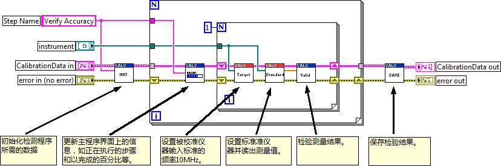

图 .39使用箭头表明注释针对的节点或数据

第二种，使用标号把注释文字和被注释的节点或数据关联起来，如图 11.40所示。

图 .40使用标签表明注释针对的节点或数据

对于有注释的程序框图，不能使用"整理程序框图"工具。因为它可能导致程序中注释的位置出现错误。在LabVIEW的程序中，注释是一段文本标签，它和程序上的节点，连线等没有逻辑关系。
"整理程序框图"工具并不知道它们是和哪些内容相关，在整理程序框图的过程中，节点的位置发生变化，注释摆放的位置也会发生变化。

## 使用自定义数据类型

"簇"类型的数据是一种很常见的数据。编写比较大型的程序时，可能多个子VI的参数中都有同一种簇类型的数据。比如说，一个用于保存某一实验数据的程序，其中多个VI用到了同一个"实验信息"数据类型。"实验信息"是一个簇，它由两个元素组成，分别是"实验名称"和"实验时间"。

在程序的编写过程中，可能会发现这个簇数据的类型需要改动。原来的两个元素不够用，程序还需要添加"实验编号"这一信息（图
11.41）。

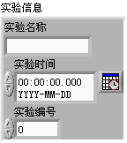

图 .41在编程过程中，需要修改了一常用数据的类型

由于程序中多个子VI都用到了这一数据类型，一旦它发生变动，就需要把所有用到这个簇的VI都进行相应修改。这样的修改不但繁琐，更糟糕的是可能会遗漏某些数据没有改动，造成程序潜在的错误。

解决这一问题的方法是为类似的数据创建一个自定义类型。自定义数据类型同自定义控件一样，保存在.ctl文件中。它的创建方法也与自定义控件相同。区别在于需要把它的控件类型设置为"自定义类型"或"严格自定义类型"。在程序中，如果用到了这个.ctl文件，就把它叫做这个自定义控件或自定义类型的实例。

自定义控件与它的实例之间没有任何关联。如果使用自定义控件制作并保存了一个漂亮的按钮控件。需要用到它时，通过拖拽或打开这个.ctl文件就可以在VI前面板上添加一个此类用户自定义控件的实例。这个实例一旦生成，就和原用户自定义控件无任何关联了。无论是你修改这个实例，还是修改原用户自定义控件，都不会对另一方产生任何影响。

自定义类型与严格自定义类型在VI上生成实例的方法与自定义控件相同。不同之处在于：自定义类型以及严格自定义类型与它们的实例之间是相关联的。比如，创建一个数值类型的自定义类型，它的所有实例也都是数值型的。如果在自定义类型文件中把这个控件的数据类型改为字符串，那么它已有的所有实例都将自动变成字符串类型。

对于严格自定义类型，它和它的实例之间，不但数据类型是相关联的，控件的属性也是相关联的。这些属性包括控件的颜色、大小以及枚举或下拉列表类型控件的项目等，也是相关联的。

比如，在使用自定义类型时，自定义类型上的控件是一个文本下拉列表控件，它的数据类型是U16数值型。控件中包括两个下拉选项："条目一"和"条目二"。如果在自定义类型中，为它多添加一项"条目三"。这时候，因为数据类型还是U16不变，它所有的实例不会跟随它更新，实例中的枚举型控件还是只有两项。但如果使用了严格自定义类型，则它所有的实例会自动更新，也都变为三项。

LabVIEW中有些数据类型以及它们的属性经常会在编程过程中进行调整，比如簇、枚举、下拉列表、组合框、数组、波形图等。为了便于随时修改它们，在编程时，凡是遇到这样的数据类型，就该为它们制定一个严格自定义类型定义。当需要所有实例控件的外观都保持一致时，也应该使用严格自定义类型。

## 连线板

为了保持程序框图上连线的整齐，所有的子VI都应当尽可能采用相同模式的连线板。

比如，可以规定程序中所有VI的连线板都必须采用4224模式：（按照每一列接线端的数量命名此模式）。所有VI中的输入参数，用连线板左侧的六个接线端表示；输出参数用右侧的接线端表示。子VI在程序框图默认是显示子VI的图标，但也可以把它的连线板显示出来：在子VI图标上点击鼠标右键，选择"显示项-\>接线端"即可。

图
11.42所示的程序中，所有子VI都统一采用了4224模式的连线板。这样就可以保证每个VI参数接线端所在的位置是固定的。两个子VI中，同一排上的参数接线端，它们的相对高度肯定是相同的。这样，它们之间连接数据线，就可以保证数据线是一条直线，没有弯折。

图 .42所有子VI统一采用4224连线板

若程序框图上每个子VI采用不同模式的连线板，则他们的接线端很难都保持在同一高度，连线难免出现转折处。如图
11.43所示。

图 .43每个子VI采用不同连线板模式

4224模式的连线板总共有12个接线端。如果VI的参数（输入输出控件）太多，超过12个，就没法使用这一模式了。但实际上，VI的参数不宜太多，一般应该控制在8个以下。如果超过这一数字，不但这个VI使用起来比较麻烦，调用它的代码的可读性也成问题。一个子VI中联出十几根数据线，程序阅读者分辨起来就非常费劲了。

如果VI需要输入或输出较多的数据，可以把其中类似或相关的数据合并起来，用一个数组或簇来表示它们，以减少参数的数量。或者采用其它方式在VI间传递数据，比如使用全局变量。

参数对应的连线板接线端位置，应与参数控件在VI前面板上的位置相对应。这样做是为了方便程序阅读者直观地了解接线端与控件的对应关系。比如图
11.44所示的VI，它的连线板上接线端的布局与前面板上控件的布局完全一致。所以读者一眼就可以认出，连线板上第一列第二排接线端表示的参数是"AC
Filter Bandwidth"。

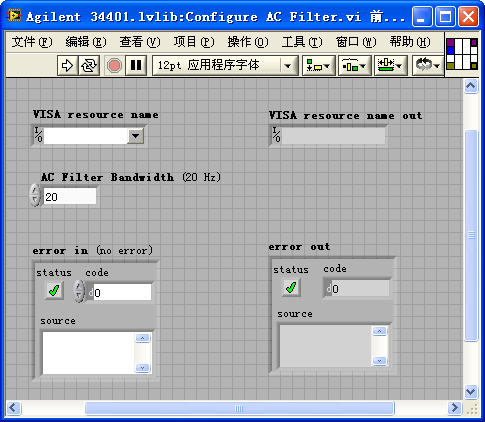

图 .44一个VI的前面板和连线板

## 图标

图标是VI非常重要的一部分，精心设计的图标可以大大提高程序的可读性。设计VI图标时应该注意以下几点。

千万不要使用默认的图标。使用默认图标会导致一个程序框图上所有的子VI看上去都是同一个模样，根本分不清楚哪个图标是哪个VI。

尽量使用图形而不是文字。人对图形的接受和处理速度远高于文字，所以以图形标识的图标不但更美观，也可以被人更快速地阅读。有时候，编程者绞尽脑汁也想不出一个合适的图标，干脆在图标里写上几个字。这样就失去了图标的意义。因为子VI的名字，或注释等都以文字表示，没必要再重复一遍。如果是临时、内部使用的VI还可以只在图标上写文字，正式发布给用户的VI一定要定义有意义的图案。

同一个功能模块，或同一个库中的VI的图标应当有统一风格，让人一看，就知道它们之间是相关的。这种统一风格可以体现在图标的配色方案一致，或者都有同样的组成元素，比如相同的标签，或图形部分。图
11.45中的两组VI，第一组是某一仪器驱动程序的VI，它们都用共同的一个红色"AG34401"标签；第二组是LabVIEW处理配置文件的VI，们都拥有一个用来表示文件的相同图案。

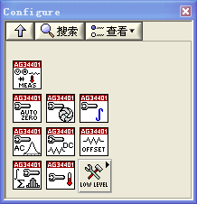

图 .45一组图标具有统一风格

LabVIEW中的图标最大尺寸是32×32个像素点，这也是默认的大小。一般来说，在程序中都采用默认的大小就可以了。图标也可以做成其它尺寸和不规则图形。在某些特殊的情况下，可以采用不规则的图标美化LabVIEW程序框图。下面列举两个这方面的例子。

### 制作不规则图形的子VI图标

大多数子VI的图标都是一个正方块。但有时候，为了程序代码美观、易读，需要把子VI做成不规则图形显示在调用它的父VI代码上。LabVIEW中很多自带的函数，比如说加减乘除运算函数等，就没有采用规则的32×32的正方形图标。在应用程序中也可以把子VI做成非正方形方块的，例如图
11.46中的My Function.vi，就把它的图标做成了三角形。

图 .46调用了My Function.vi的程序框图

把子VI的图标改为非规则图形，有一些事项需要注意。首先，要考虑选取一个合适的连线板模式。LabVIEW默认的模式是4224模式。但这种模式通常不适用于不规则的图标。比如说图
11.46的My
Function.vi，它需要一个纵向位于中央的输出接线端，而4224模式最右侧的4个接线端对称分布，没有一个位于中间。

在VI前面板的图标上点击鼠标右键，选择"显示连线板"，之后再鼠标右击，选择"模式"，就可以挑选一个合适的模式了。对于My
Function.vi，可以使用52225这个模式。如图 11.47所示：

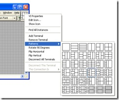  
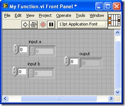

图 .47选取52225连线板模式

接下来，就是核心工作------编辑图标了。其中最重要的两点，一是不要给图标加上边框，二是图标编辑器的三个颜色的图标必须保持一致。图
11.48是LabVIEW的图标编辑器，它的中央有三个小方块，分别显示黑白色、16色、256色下的VI图标。用鼠标点击一下某个小方块，左边的编辑区就开始对这个颜色的图标进行编辑。

目前的显示器的颜色数都高于256色，所以在程序框图中看到的始终都是256色那个图标；如果少于这个颜色数量，比如只有16色，那么在程序代码上看到的子VI显示的就是16色的那个图标。不过现在恐怕找不到16色的显示器了，所以16色这个图标一般情况下就是空白。黑白色的显示器虽然更罕见，但是这里的黑白图标还有另一个用处，就是确定图标中图形的轮廓。所以一定要有一个形状和256色图标相符合的黑白图标才能做出不规则图形图标来。一般在编辑黑白图标时，按一下"复制于256色"的按钮，把256色的图标复制过来就可以了。

编辑不规则形状的图标时，最好选中"显示接线端"，把连线板模式在图标编辑区显示出来。这样可以方便地查看图标的图形是否与连线板接线端相匹配。比如说，要在连线板右侧中央的接线端接一个输出数据，图形至少要覆盖到这个接线端才行。

图 .48编辑不规则图标

### 隐藏程序框图上的大个簇常量

在编写某些程序的时候可能会遇到如图
11.49所示的情形：即用到了一个极为复杂的数据类型常量。这个常量由于体积巨大，使得在程序框图无论怎样布局都让人看起来不太舒服。如何才能把这个程序改造得美观一些呢？

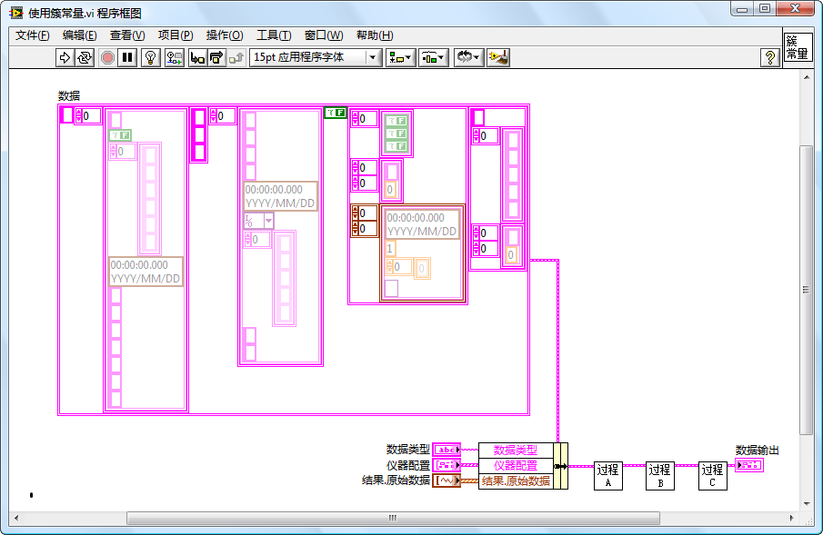

图 .49体积巨大的常量会有碍观瞻

要解决这个问题，只有设法把这个常量在主程序框图上隐藏起来。通常可以用以下两种方法。

第一种方法：把这个常量变换成控件，再把控件隐藏起来。这种方法比较简单，但是也有弊病。首先，容易引起误解：控件一般表示有值传入，他人阅读程序时就可能搞不清楚这个值是从哪里传来的了；其次，若要修改簇常量中某一个元素的值，操作起来比较麻烦。

第二种方法是把它隐藏到更深层的子VI中去。具体操作方法如下：

如图 11.50所示，先给这个复杂数据类型建立一个严格自定义类型。

图 .50定义严格自定义类型

然后再建立一个新的VI，把要隐藏的这个个头巨大的常量摆放在这个VI中，并且为它创建一个同类型的显示控件，把它的值传出来。VI的连线板采用4224模式的，第四排第三列的接线端用于传出VI中唯一的数据，如图
11.51所示。

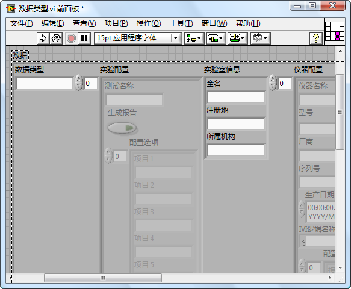

图 .51用于隐藏个头巨大常量的VI

这个VI的图标要做得小巧漂亮，如图 11.52所示。

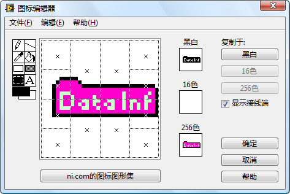

图 .52常量数据VI的图标

把这个新造出来的常量数据VI拖到程序框图上，把它的输出连接到刚才连接常量的地方，再把位置摆放好。这样的程序看起来是不是漂亮多了（图
11.53）？

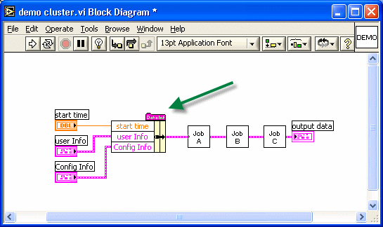

图 .53改造后的程序框图

## VI分析器

实际上，编写程序时需要注意的规范还有很多。若要程序员把所有的规范都牢记下来并在编程时处处按规范行事，也是比较困难的。在编程时难免有疏忽，那就需要一条找出这些疏忽的途径。LabVIEW中的"VI分析器"工具就可以用来查找程序代码中的错误或风格有问题的地方。

"VI分析器"是一个向导型界面的程序，点击菜单项"工具-\>VI分析器-\>分析VI"将启动"VI分析器"工具。按照界面的提示，一步一步下去即可对VI进行分析。

"VI分析器"工具会打开每一个被检测的VI，按照预定的规范进行检查。比如检查程序中是否有拼写错误，控件排列是否准确等。这些检查或测试条目以插件的形式存在，用户还可以编写自定义的检查插件。所有测试插件均在\[LabVIEW\]\\project\\\_VI
Analyzer\\文件夹下。

如果电脑上仅安装了LabVIEW，可能一个插件都没有。对VI中常见的错误和毛病的检查插件在"VI
Analyzer
Toolkit"中。安装了这个Toolkit后，"VI分析器"工具就具备检查VI常见问题的功能了。

图 11.54、图 11.55、图 11.56是"VI分析器"向导界面中的几个重要步骤的截图。

图 .54选择VI

首先要在"VI分析器"中选择被测试的VI（图
11.54）。可以选择一个项目中的所有VI，也可以选择一个路径，检测路径中所有的VI。作为示例，此处选取\[LabVIEW\]\\examples\\xml路径下的所有VI进行分析。

图 .55选择检测项目

之后，需要选择对VI进行哪些测试（图
11.55）。有些测试项目可能并不那么重要，比如不需要关心是否在循环内有数组或字符串的运算。只要不勾选这些项目，就不会检测它们了。

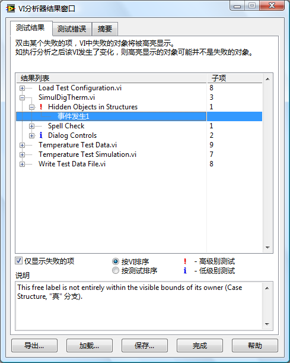

图 .56检测结果

"VI分析器"检测结束后，会把所有发现的问题列出来（图
11.56）。这之中，有很多问题可能是误报或并不重要，那不必理会。错误可能性高、并且严重的问题会以红色叹号标注出来；次要问题以蓝色叹号标注。对于这些问题要格外注意。结果窗口的"说明"栏会指出问题的详细内容。

图 .57打开有问题的VI

如果这段说明还是不很直观，可以双击该条目，LabVIEW会自动打开有问题的VI，并将问题之处高亮显示出来（图
11.57）。