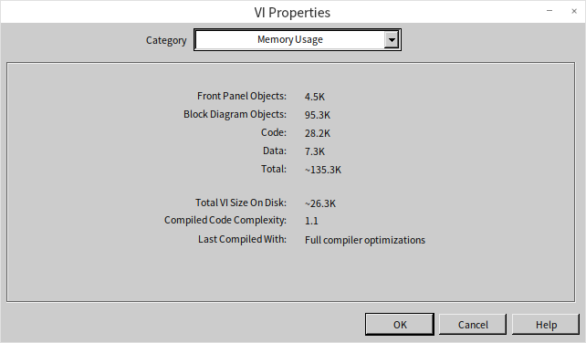
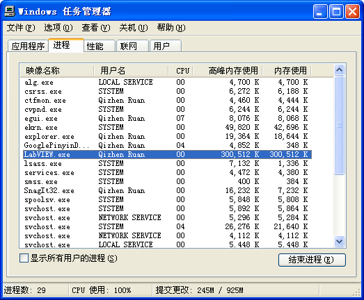
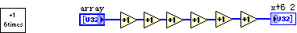
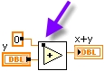
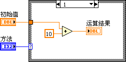
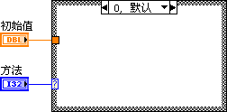

# 内存优化

## VI在内存中的结构

打开一个VI的属性对话框，其中的"内存使用"页是用来查看这个VI内存占用情况的（图
11.6）。它显示了一个VI内存占用所包含的四个主要部分：前面板对象、程序框图对象、代码和数据，以及这四个部分的总和。其实，在LabVIEW中打开一个VI时，这四个部分并不是同时都被LabVIEW调入内存的。

图 .6在VI属性对话框中查看VI各部分内存占用

打开一个主VI时，主VI连同它所有子VI的代码和数据段都会被调入内存。由于主VI的前面板在一般情况下是要打开的，前面板也就同时被调入了内存。但此时，主VI的框图和子VI的前面板、框图并没有被调入内存。只有当需要主动查看主VI的框图或打开子VI的前面板和框图时，它们才会各自被调入内存。

基于LabVIEW的这种内存管理的特性，在编写VI的时候可以通过以下方法来优化LabVIEW程序的内存使用。

第一，把一个复杂VI分解为数个子VI。子VI的使用会增添额外的前面板和框图的空间，但并不增添额外的代码和数据空间。由于程序运行时只有代码和数据被调入内存，因此使用子VI不会占用额外的内存。使用子VI的好处还在于，当子VI运行结束时，LabVIEW可以及时收回子VI的一些不再被使用的数据空间，从而改善了内存的使用效率。

第二，在没有必要时，不要设置子VI的可重入属性。可重入VI每次运行时都会对自己使用的数据生成一个副本，这增加了内存开销。

第三，主VI的面板通常就是用户界面，需要显示给用户。但是要尽量避免开启子VI前面板。比如，在子VI中使用与其前面板控件有关的属性节点，会导致它的前面板被调入内存中，增加内存开销。所以，要尽量避免在子VI中使用子VI前面板控件的属性节点。

第四，我们可以放心地在VI的程序框图以及运行中不会被开启的非界面VI的前面板上添加图片、注释等信息，这有助于编写、维护LabVIEW程序。这些帮助信息不会在VI运行时占用内存。

## 内存泄漏

LabVIEW与C语言不同，它没有任何分配或释放内存的语句。LabVIEW自动管理内存，在适当的时候分配或收回内存。这样就避免了C语言中常见的，因编程者使用内存管理语句不当而引起的内存泄漏。

在LabVIEW中，一般只有一种情况能够引起内存泄漏：即打开了某些资源，却忘记了关闭它们。比如，在对文件操作时，需要先打开这个文件，返回它的引用句柄。随后，如果忘记了关闭这个句柄，它所占用的内存就始终不会被释放，从而产生内存泄漏。在LabVIEW中，各种带有打开句柄的函数或VI都会引起同样的问题。

由于内存泄漏是动态产生的，程序员无法通过VI的属性面板来查看。但可以通过Windows自带的任务管理工具来查看LabVIEW程序内存是否泄漏。比如下面这个程序，循环中只有新建一个XML文档的操作，而没有相应的关闭它的操作。每新建一个XML文档，都需要占用一些内存。如果循环持续运行，VI所消耗的内存就会越来越多。在Windows系统的任务管理器中可以观察到这一现象。

图 .7持续打开新句柄的一段程序

同时按下Ctrl+Alt+Delete三个键，选择打开Windows任务管理器。在任务管理器的性能页面上可以监视到系统内存的使用情况（图
11.8），其中"页面文件使用记录"反映了当前内存使用的情况。当图
11.7中的程序开始运行后，"页面文件使用记录"开始明显升高。

图 .8 Windows任务管理器观察系统内存使用情况

"页面文件使用记录"所反映的是系统中所有程序使用内存的整体情况。具体到LabVIEW所占用的内存的情况，可以在"进程"页中查看LabVIEW.exe一栏的"高峰内存使用"项（图
11.9）。高峰内存使用记录的是LabVIEW在运行过程中最多使用到的内存数量。在程序运行过程中，如果其高峰内存使用持续增加，则说明程序有内存泄漏。

图 .9 LabVIEW使用内存的情况

## 缓存重用

LabVIEW程序是数据流驱动型的。数据传递到不同节点时，往往需要复制一个副本。这是LabVIEW为了防止数据在节点处被改变而引发错误，所做的一种数据保护措施。只有当目标节点为只读节点，且确认该节点不可能对输入数据作任何更改时，才不在该节点处做备份。例如，"索引数组"函数是不会改变数组值的，LabVIEW在这里就不为输入数组做备份。对于加减法运算等肯定改变输入数据的节点，LabVIEW则需要对输入或输出数据作备份。如果程序仅对简单数据类型或元素非常少的数组、簇等进行运算，这些数据类型本身占用内存极少，多份拷贝也不会引起明显内存消耗。

但有些LabVIEW程序，比如涉及到大数组运算的程序，往往内存消耗极大。其主要原因就是LabVIEW在运算时为数组数据生成了过多的副本。

实际上，很多LabVIEW节点是允许使用缓存重用的。它类似C语言的调用子函数所使用的地址传递。通过合理设计和使用缓存重用节点，可以大大优化LabVIEW程序的内存使用。使用菜单中的"工具-\>性能分析-\>显示缓冲区分配"工具（图
11.10）可以在VI的程序框图中查看缓存的分配情况。打开该工具，选择需要查看产生缓存区分配的数据类型。凡是在程序框图中有缓存分配的地方，都会显示出一个黑点。

图 .10显示缓冲区分配工具

下面是几种常用节点的试验结果。

### 一般的运算节点

图 .11简单的顺序执行程序

如图
11.11所示，程序对一个常量加1，然后将结果输出。"+1"函数输出端有一个黑点，表示LabVIEW在此处开辟了一个缓存用于保存运算结果。其实完全可以利用输入数据的内存空间来保存这个运算结果。可以通过如下的方法来告知LabVIEW编译器，在此运算节点处可以重用输入数据的内存空间。

图 .12实现缓存重用

图
11.12是经过优化后的VI。它用一个控制型数值控件代替了原来的数值常量输入，于是LabVIEW在"+1"函数处没有开辟新的缓存。常量数据是不可以被改变的，因此它所在的内存控件不可以被用于存放别的数据。

LabVIEW中其它运算节点也有类似的性质。由于这个程序所需内存极小，无法通过查看内存分配情况观察优化前后的区别。

### 移位寄存器

移位寄存器是LabVIEW内存优化中最为重要的一个节点，因为移位寄存器在循环结构两端的接线端是强制使用同一内存的。这一特性可以被用来通知LabVIEW在编译循环内代码时，重用输入输出缓存。

图 .13对数组进行数值运算的顺序执行程序

分析一下图
11.13所示的程序。它首先构造了一个数组，然后对这个数组进行了数次数学运算。每一步运算，LabVIEW都要开辟一块缓存用以保存运算结果的副本。打开VI属性面板上的内存使用，可以看到这个VI占用了大约2.7M的内存空间。其实这些副本都是不必要的，每一步运算的结果都可以被保存到输入数据的内存空间。为此，我们可以把所用的运算节点都放到一个子VI中，然后利用上一段提到的方法，使子VI中的代码缓存重用（图
11.14）。

图 .14利用子VI实现缓存重用

还有一种方法，利用移位寄存器也可以实现缓存重用。

图 .15利用移位寄存器实现缓存重用

如图
11.15所示，可以将运算代码放在一个只运行一次的循环结构内，由于运算部分的输入和输出都与移位寄存器相连，这就相当于通知了LabVIEW，在运算的输入输出需要使用同一块缓存。因而，LabVIEW不再为每一步运算开辟新的缓存而是直接利用输入数据的缓存保存结果。打开VI属性面板上的内存使用，可以查看到这个VI的内存占用已经减少到了原来的六分之一。

在程序中使用移位寄存器来优化内存是循环结构的一种特殊用法。不了解此用法的程序员在读到这段代码时可能会比较迷惑。这样不利于程序可读性。幸运的是，在LabVIEW
8.5之后，增加了一个新的结构"编程-\>应用程序控制-\>内存控制-\>元素同址操作结构"，专门用于替代移位寄存器优化代码的内存使用。图
11.16中的程序，和图 11.15中的程序的效果是完全一样的。

图 .16使用元素同址操作结构实现缓存重用

使用元素同址操作结构与使用移位寄存器相比，它还有一个优点，即它可以和数组索引、捆绑簇元素等操作结合在一起（图
11.17）。在完成数组元素替换、簇元素替换的同时，保证尽量使用已有缓存，节省内存占用。

图 .17使用元素同址操作结构实现数组元素的替换操作

### 调用库函数节点

下面以传递整型参数的调用库函数节点为例，来分析节点的缓存重用。在调用节点的参数配置面板上，可以按需要分别选择值传递或选择指针传递。

若选择了值传递，则库函数调用节点是不会改变该参数的内容的。如果在该库函数调用节点参数的左侧接线端引入输入数据，在输出端引出输出参数，由于节点的输出数据其实是直接由输入数据引出的，LabVIEW就不会在这个节点处开辟缓存了。

而在指针传递方式时，LabVIEW认为传入的数据可能被改变。因为输入数据同时还可能发往其它节点，因而LabVIEW会在此处开辟缓存，作为输入数据的一个副本。也就是说，选用指针传递方式，库函数调用节点的每一对接线端是缓存重用的。换言之，库函数调用节点的输出值是直接存放在输入值的缓存空间的。

如果一个参数只用作输出，通常会在库函数调用节点的输入接线端为它建立一个输入常数，这个常数的地址空间并不能直接被利用，它只是为库函数调用节点开辟缓存而设置的初始值。即使没有接入输入常数，LabVIEW也会为此参数开辟一块缓存。但是，这样每次传入的参数值都会有变化。如图
11.18所示，库函数调用节点调用的函数功能是把输入的值加1，然后输出。图
11.18-a中的输出值永远都是1；而图
11.18-b，由于库函数调用节点每个指针传递的参数的输入输出用的是同一块缓存，即每次运行输入值是上一次的输出值，库函数每次运行输出结果都比前次增加1。

图 .18库函数调用节点

利用图 11.18-c的例子可以证明LabVIEW的某些节点是缓存重用的。每次运行图
11.18-c的例子，输出结果都会比前次增加2。这是因为示例中库函数参数的两个接线端以及"+1"节点的输入输出端所使用的都是同一缓存。

如果库函数调用节点中某个参数只连接了输入端，而没有输出。那么，LabVIEW就假设调用的函数是不会修改这个参数的。它也就不会为这个数据复制一个拷贝，而是重用这个数据的缓存。此种情况下，如果你调用的函数修改了这个数据，你的程序就会面临这样一个潜在的危险：这个数据有可能被程序其它部分的代码使用了，尽管在使用处你看不出这个数据有任何被改动的地方，但它在运行时却不是你期望的数值。因为这个数据所在的缓存，被程序其它一个地方的一个库函数调用节点给重用了，而这个节点又偷偷摸摸地修改了它。

在图
11.18的示例中，如果库函数调用节点输出的参数是个数组或者字符串，那么就必须为它相对应的输入端连入一个与输出数据大小一致的数组或字符串。否则，LabVIEW无法知道输出数据的大小，而使用默认分配的缓存空间很容易出现数组越界错误。

## 子VI参数的缓存重用

一个设计合理的LabVIEW程序，其数据在子VI间传入传出时是可以做到缓存重用的。这些数据在主VI和子VI中都不发生拷贝，大大提高了程序的效率。

观察一下图
11.19所示的VI。打开前面已介绍过的"显示缓冲区分配"工具，查看这个VI中内存分配的情况，会发现在加法函数处有一个黑点。这个黑点说明程序在这里又分配了一块内存，这个内存是用来存储加法运算结果的。

图 .19控件不与连线板相连时，加法节点处有内存分配

为什么加法函数在这里不做缓存重用呢？为什么不利用其中一个加数的内存空间来保存计算结果呢？

图
11.19中的VI运行的时候，加数Numeric的数据是由VI前面板的控件提供的。如果用户不修改控件的值，每次VI运行，这个数值应该是保持不变的。如果加法函数在这里做缓存重用，加数或者说它对应的控件中的数据，就会在加法运算执行后被修改。这样的话，程序就可能出现逻辑上的错误。

所以把一个这样的控件连在LabVIEW的运算函数上，函数节点是不能重用控件的数据内存的。同样的道理，连接一个常量到函数节点上，节点同样不能做缓存重用。在子VI中，没有连到连线板上的输入控件就相当于一个常量。

但是，如果让VI上的控件与VI的连线板相连，情况就完全不同了。如图
11.20所示，三个控件连到了连线板上，程序中加法节点上的那个黑点就消失了。它没有再为运算结果分配新的内存。

图 .20控件与连线板相连时，加法节点处没有内存分配

这是因为，当输入控件与连线板连接后，LabVIEW就认为这个输入值应当是由子VI的调用者（父VI）提供的。从逻辑上来说，输入控件连到连线板上，就不再是常量，而是子VI的一个输入变量了。既然是输入变量，子VI就不再需要记住输入的数据。因此，可以把新产生的数据放在输入参数所在的内存，做到缓存重用。

但是，这个输入参数的内存被修改后，万一它的数据还要在父VI中被其它节点使用，怎么办呢？

其实，子VI是不需要考虑这点的。输入的数据被修改，肯定是安全的。这一点是由父VI来保证的。如果输入数据不允许被修改，父VI肯定会把传入的数据拷贝一份再传到子VI中去。

如图 11.21中的程序所示，它所调用的子VI就是图
11.20中那个VI。与子VI左上角连线板相连的输入参数是一个常量，常量的值是不能被改变的。所以，LabVIEW会把这个常量的值复制一份，再传到子VI中去，以保证子VI中的运算节点可以缓存重用。

图 .21父VI中的数据拷贝

如果图
11.21中这个父VI的输入控件也与连线板相连，并为子VI提供输入参数，则LabVIEW会知道，父VI的这个数据是由再上一层VI提供的，此处也不需要拷贝数据。这样，这个VI也就做到了缓存重用。如果设计合理，参数传递多层VI都不需要开辟新内存。

从上面的说明中，还可以发现一个问题。那就是，有时候子VI的改动，可能会影响父VI的行为，诸如是否为传入子VI的数据复制备份等等。有时候，会发现在改动了一个子VI后，它的父VI也需要重新保存，原因就在此。

## 输入输出参数的排布

在子VI的程序框图上，不论代码有多复杂，有多少嵌套的结构，控件终端最理想的排布方式为：所有输入参数（控制型控件的接线端）都位于代码的最左端并排成一列；所有的输出参数（显示型控件的接线端）都位于代码的最右端并排成一列。也就是说，输入输出参数尽可能均位于VI内部结构之外。如图
11.22所示。

图 .22控件终端整齐地排列在程序框图左右两端

这种排布方式首先是为了保证程序有良好的可读性。在阅读LabVIEW代码时，通常都会按照习惯的阅读方式，按从左到右的顺序阅读程序。所有的输入参数都排布在同一侧，有助于以数据线为线索，也就容易找到数据被读写的地方。

此外，这种风格的VI，在效率上也比较优化。下面分别讨论一下作为输入、输出参数时，为什么这种方式效率更高。

如果一个输入参数的接线端位于程序代码的最左侧，位于所有结构的外面。那么，它将是这个程序框图上最先被执行的部分。VI一开始运行，就可以首先从这个输入控件中读出数据。

但是，如果这个输入参数的接线端位于代码的某个结构的内部，那么LabVIEW必须运行到这一结构内部的时候，才能够读取这个参数的值，否则可能会引起逻辑上的错误。例如，如图
11.23所示的程序，一个输入参数的接线端，位于一个循环的内部。如果这只是一个子VI，在VI运行期间内，"初始数值"输入是不可能发生变化的。但是LabVIEW并不知道这一点，每次循环迭代，它都必须重新读取"初始数值"中的数据。并且，为了避免下一次循环再读取它的时候，数据可能出错，LabVIEW不能重用这个数据的缓存。

图 .23输入参数的接线端位于循环结构内部

如果这个"初始数值"的接线端位于循环结构之外，LabVIEW则可以明确地知道，只需要在程序最开始时读取一次数据。这样，在需要的时候，LabVIEW可以重用"初始数值"的数据缓存，以避免开辟新内存，拷贝数据等操作。这样就提高了程序的内存效率。

对于一个输出参数而言，如果它的接线端位于某个条件结构的内部，LabVIEW就要考虑，程序有可能执行不到这个条件。LabVIEW就不得不多添加一些代码来处理这种情况。如若VI没有运行到这个条件，就要给输出参数准备一个默认值。比如图
11.24中的程序，输出"运算结果"位于条件结构的分支1上。如果输入"方法"的值是1，则VI会把"初始值"加10的结果赋给"运算结果"。但是，如果输入"方法"的值是0，程序中没有给"运算结果"赋值的代码，LabVIEW必须自己添加一些额外的代码，给"运算结果"一个输出值。

图 .24输出参数的接线端位于条件结构内部

若把"运算结果"输出接线端移至条件结构外，则编程者会为它提供不同条件下的输出值。就可以省去这部分LabVIEW自动添加代码的工作，提高了程序的效率。

## 良好的数据流结构可以优化程序内存效率

先看一段程序：

图 .25主VI程序中有不必要的数据线分枝

图
11.25中，左半部分是主VI的程序框图，它有一个输入数组参数"Array"。输入的数据被传递到了两个子VI（子函数）中：一个是子VI"My
Search"；另一个是"一维数组排序"函数。图 11.25的右半部分是子VI"My
Search"的程序框图。

需要注意的是，主VI上的一维数组排序函数图标内有个黑点（这个黑点靠近黄色方块的中心，这里看不太清楚，和图
11.26对比一下，就可以发现了），说明此处做了一次内存分配。这是因为Array的数据被同时传递到了"My
Search"和"一维数组排序"两个节点进行处理。这两个操作可能会同时进行。LabVIEW为了安全（两个操作对数据的改动不能相互影响，不能同时对同一块内存进行读写），就必须为这两个节点分别在两份内存中准备两份备份。所以在"My
Search"和"一维数组排序"两个节点中，如果一个节点用了原来Array的内存，另一个节点就需要拷贝一份数据给自己用。

打开"My
Search"子VI的程序框图，就会发现该子VI其实没有对Array数据进行任何改动。因此，主VI完全没有必要再开辟一块新内存。假如让"My
Search"子VI先运行，在运行过程中，Array数据不会发生变化。再运行一维数组排序，则可以重用Array所在的缓存来保存结果。

只要对程序稍作改动，就可以对此进行优化。图 11.26是改进后的程序：

图 .26符合数据流风格的主VI

在改进后的程序中，Array数据首先传入"My
Search"子VI，然后又传出来，继续传给"Sort 1D
Array"函数。这样，看上去好像数据要多在子VI中转一圈。但由于子VI中Array输入输出是缓存重用的，实际上相当于只是把数组数据的引用传给了子VI。这个操作的效率是相当高的。而在主VI中，执行"一维数组排序"时，LabVIEW知道此处的输入数据是这个节点专用的，改了它也是安全的，于是也可以缓存重用。这样，"一维数组排序"上的那个小黑点就消失了。

图
11.26中的主VI，它的优点首先是符合数据流的风格。它的主要的数据从左到右，流经每个节点。这样的程序非常容易阅读和理解。LabVIEW也更容易对这样的代码进行优化。所以这种风格的程序通常效率也比较高。

有时，利用LabVIEW的自动多线程特性，书写并行代码，对程序效率有利。比如，程序中某一部分的代码需要花费较长时间进行计算或者读写。此时，可以并行运行其他代码。但是，并行代码也有不利之处。如，并行书写的程序不易理解，容易出错。多线程运行有时也会带来额外的开销。像图
11.25、图
11.26中的程序，数据量较大，但是并没有比较耗时的运算操作、或数据读写操作。这样的程序，串行运算比并行效率更高。
