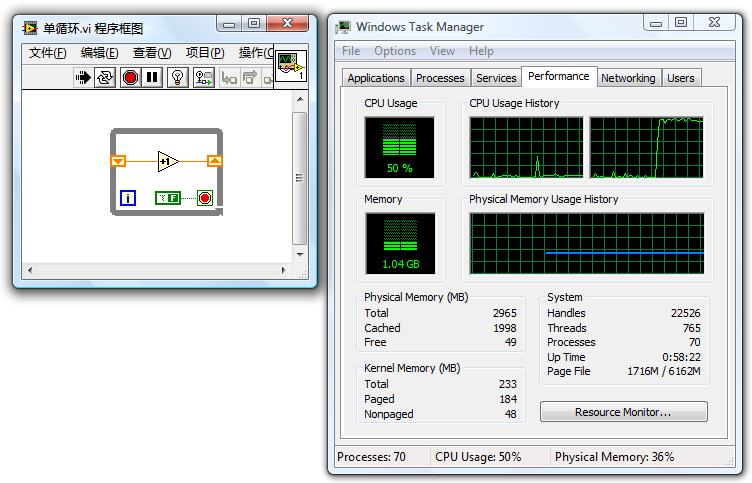
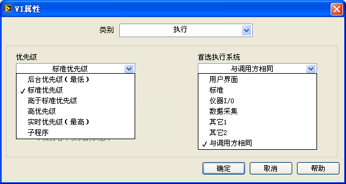
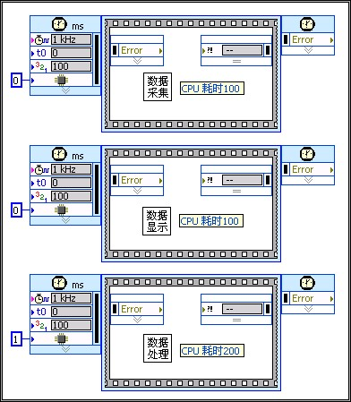

# 多线程编程

## LabVIEW是自动多线程语言

一般情况下，运行一个VI，LabVIEW至少会为它开辟两个线程：一个是用户界面线程，用于处理界面刷新、用户对控件的操作等等；另外一个或多个是执行线程，负责VI除界面操作之外的其它工作。LabVIEW是自动多线程的编程语言。只要VI的代码可以并行执行，LabVIEW就会尽量将它们分配在多个执行线程内同时运行。

图
11.27是一个正在运行的简单VI，它由单独一个持续运行的循环构成。在此情况下，这个执行循环的线程负担特别重，其它线程则基本空闲。在单核CPU计算机上，这个线程将会占用几乎100%的CPU时间。图
11.27中的任务管理器是在一个双核CPU计算机上截取的。这个循环虽然在每一个时刻只能运行在一个线程上，但这并不表示它始终不变地就固定在某一个线程上。它在某个时刻可能运行在这个线程上，另一时刻又被调度到其它线程上去运行了。因此，图
11.27这个程序最多只能占用计算机大约50%的总CPU时间。两个CPU内核各被占用一些。

图 .27双核CPU计算机执行一个计算繁重的任务

图
11.28是当程序有两个并行的繁重计算任务时的情况。这时，LabVIEW会自动把两个任务分配到两个线程中去。这时即便是双核CPU也会被100%占用。

图 .28双核CPU计算机执行两个计算繁重的任务

通过这个示例，可以得知在LabVIEW上编写多线程程序非常方便。编程时应该充分利用这个优势。一般情况下，编写程序时应当遵循这样的原则：可以同时运行的模块就并排摆放，千万不要用连线、顺序框等方式强制它们依次执行。在并行执行时，LabVIEW会自动地把它们安排在不同线程下同时运行，以提高程序的执行速度，节省程序的运行时间。今后，多核计算机将成为主流配置，多线程的优势将更为明显。

当然特殊的情况也是有的，即用多线程时，运行速度反而减慢。在后面的章节中，会详细讨论这些特殊情况。

## LabVIEW的执行系统

LabVIEW
5.0开始才支持多线程。在此版本之前，LabVIEW的VI都是单线程运行的。其实，对于并排摆放的LabVIEW子VI或函数节点而言，即使LabVIEW不为它们分配不同的线程，它们也是"并行执行"的。LabVIEW会把它们拆成片断，轮流执行。这就如同LabVIEW为自己设计了一套多线程调度系统，在系统的单个线程内并行执行多个任务。

LabVIEW的这样一套把VI代码调度、运行起来的机制叫做执行系统。新版本的LabIVEW有六个执行系统，分别是：用户界面执行系统、标准执行系统、仪器I/O执行系统、数据采集执行系统、以及其它1、其它2系统。一个应用程序中使用到的众多子VI是可以分别放在不同的执行系统里运行的。用户可以在VI属性面板上的"执行"页面，指定这个VI的执行系统（图
11.29）。

图 .29 VI属性的"执行"设置页

## 执行系统与线程的关系

LabVIEW在支持多线程以后，不同的执行系统中的代码就被划分在了不同的线程下运行。用户界面执行系统只有一个线程，并且是这个程序的主线程。其它的执行系统与用户界面执行系统不同，它们都不是主线程，并且可以为一个执行系统开辟多个线程来执行代码。

在VI属性面板的"执行"页面，用户除了可以设置VI的执行系统，还可以设置它的优先级。优先级分为后台、标准、高于标准、高、实时等五个档次，优先级依次提高。优先级内还有一项"子程序"，它是一个比较特殊的设置。实际上它并不是一个优先级。

在单核CPU的计算机上，LabVIEW最多为每个执行系统下每个档次的优先级开启四条线程。如果是多核CPU，这一数字还会加倍。不过，实际上一个程序在运行时，不会有那么多的执行系统和优先级设置。所以，平时并看不到那么多的线程。

线程的开辟、销毁、切换等也是需要消耗一定的系统资源的。如果线程开辟得太多，切换过于频繁，反而有可能导致程序效率下降。在默认情况下，若不对VI的"执行"属性做任何改动，则一个程序内所有的VI采用的都是标准执行系统和标准优先级。LabVIEW最多将为你的程序开辟五条线程：一条用户界面线程，四条标准执行系统标准优先级下的线程（双核则是八条，依此类推）。五条线程并不会引起明显的效率损失。

## 用户界面执行系统

程序中所有与界面相关的代码都是放在用户界面执行系统下执行的。假如程序员为某个VI设置了其它的执行系统，这个VI的前面板被打开后，前面板上面的数据更新等操作也会被放在用户界面执行系统下运行。还有另外一些工作，比如利用"打开VI引用"函数动态地把一个VI加载到内存中，使用VI
Scripting中的一些属性、方法节点等，也都是在用户界面执行系统下运行的。

前文曾提到，用户界面执行系统是一个特殊的执行系统，它只有一个线程------用户界面线程。LabVIEW一启动，这个线程就被创建出来了，而其他执行系统下的线程只有在被使用到时才会被LabVIEW所创建。

因为用户界面执行系统只有一个线程，所以，VI一旦被设置为在用户界面执行系统下执行，就会变成单线程运行。图
11.28和图
11.30中的程序，如果是运行在其它的执行系统下，双核CPU的两个核都会被占满。但是，如果我们把VI的执行系统改为用户界面执行系统，那么这两个循环就会运行在同一线程下。双核CPU其中一个核将被占用100%，另一个则基本空闲。

尽管这个VI是单线程的，但是程序中的两个循环仍然是并行运行的。VI前面板上的两个显示控件上的数据会交替增加。

    

图 .30在界面执行系统------单线程运行的并行任务

如果VI中使用的一些模块不能保证多线程安全，就可以把VI设定在用户界面执行系统中运行。这样，VI包括其中的代码就只能在单一的用户界面线程下运行，以确保安全。

## 其它几个执行系统

"与调用方相同"是默认选项，它表示这个VI沿用调用它的上层VI设置的执行系统。如果顶层VI也选择"与调用方相同"，那么就等于它选择了标准执行系统。因此，对于顶层的主VI来说，标准执行系统是默认情况下使用的执行系统。

仪器I/O执行系统专用于发送命令到外部仪器，或从仪器中读取数据。这是程序中较为重要的操作，需要及时运行。所以仪器I/O执行系统中的线程的优先级比其他执行系统中的线程要高一些。

数据采集执行系统用于快速数据采集。数据采集执行系统中的线程的数据堆栈区比较大。

其它1、其它2执行系统没什么特别之处。如果你一定要让某些VI运行在独立的线程内，则可以使用这两个选项。

绝大多数情况下，用户使用界面执行系统、标准执行系统就已经足够了。

## VI的优先级

VI的优先级设置总共有六个级别：后台、标准、高于标准、高、实时、子程序（图
11.29）。其中前五项是从低到高的五个优先级。优先级越高，越容易抢占到CPU资源。比如，你把某个负责运算的VI的优先级设为最高级"实时"，程序在运行时，CPU就会更频繁地给这个VI所在线程分配时间片段，其代价是分配给其它线程的运算时间减少了。如果这个程序另有一个线程负责界面刷新，那么用户会发现，在把执行线程的优先级提高后，界面刷新会变得迟钝，甚至根本就没有响应。

优先级设置的最后一项是"子程序"，它与前五项的级别有很大的不同。它并不是一个单纯的优先级设置。若VI被设置为"子程序"优先级，VI其它的一些属性也会被改变：

设置为"子程序"的VI的前面板会被移除。所以这样的VI不能用作界面，也不能单独执行。

设置为"子程序"的VI的调试信息也会被移除。这样的VI无法被调试。

当程序执行到被设置为"子程序"的VI的时候，程序会暂时变为单线程执行方式。即程序在"子程序"VI执行完之前，不会被别的线程打断。

以上的三点保证了"子程序"VI在执行时会得到最多的CPU资源。某些非常关键的运算，假如不是特别耗时的的话，就可以被设置为"子程序"以提高运行速度。比如，有这样一个VI，它的输入是一个数值数组，输出是这组数据的平均值。这个运算在程序中需要被尽快地完成，以免拖延数据的显示。这个VI就是一个非常适合
"子程序"优先级的VI。

在设置VI优先级时，需要注意如下几点：

提高一个VI的优先级并不能缩短VI总体占用CPU的时间。提高了VI的优先级，意味着它可以比其它VI更快更多地抢到CPU的资源，但它所需要的CPU时间还是那么多。

高优先级的VI并不一定在低优先级VI之前执行。现在常用的多线程操作系统采用的都是抢占方式。线程优先级别高，只是意味着它抢到CPU的可能性比低级别线程的更大，而并非必然比低级别的线程先抢到CPU。

使用"子程序"优先级时要格外注意，因为它会让程序暂时变成单线程方式执行，这在很多情况下反而会降低程序的效率。假如一个VI并非只是用来运算，它还需要等待其它设备传来的数据，这样的VI就绝对不能被设置为"子程序"的。现在，多核CPU已经很流行了，在这样的计算机上，单线程运行的程序通常比多线程效率低，这也是需要考虑的。

## 动态连接库函数的线程

本书在第5.1.4节中已经简单介绍了CLN节点中的各种设置，其中包括了对多线程的设置。如果程序中大量频繁地使用了CLN节点，那么还要考虑到CLN节点的线程设置与调用它的VI的线程设置相匹配。

笔者曾经编写过一个三维动画演示程序。在程序中使用了大量CLN节点来调用OpenGL的函数，以实现三维动画。

由于OpenGL的全部操作必需在同一线程内完成，于是在程序中把所有的CLN都设置为在界面线程运行的方式（即UI线程）。对VI的线程选项也没有修改，还是默认的选项。结果程序运行极慢，每秒钟只能刷新一帧图像，CPU占用率已经达100%。而作为动画，每秒至少25帧才能看着比较流畅。

当时曾试图用LabVIEW的性能和内存分析工具来查找效率低下的VI，结果也未查找到。在性能和内存分析工具上显示的CPU占用时间极少。既然分析工具查找不到程序中最耗时的操作在哪里，对如何优化这个程序也就自然无从下手。于是，这个演示程序被搁置了一段时间。

后来，还是从同事提供的一些信息中得到了启发，才突然想明白了原因所在。程序耗用了大量的CPU资源，以至于动画刷新功能得不到足够的资源，是由于几乎全部的CPU资源都被消耗在线程切换中了。程序为每个OpenGL接口函数包装一个接口VI。这些接口VI非常简单，程序框图就只有一个CLN节点，调用相应的OpenGL函数。每个VI都是在默认的执行线程中运行的，而CLN调用的函数却是在界面线程下运行的。所以，每执行一次这样的接口VI，LabVIEW都要进行两次线程的切换。先从执行线程切换到界面线程，执行完函数，再切换回执行线程。

线程切换是比较耗时的。演示程序刷新一帧要调用大约两千次OpenGL接口VI，总耗时接近一秒。可是，由于线程切换所耗时间并非LabVIEW代码运行占用时间，所以LabVIEW的性能和内存分析工具没有统计这一时间消耗。

找到了症结所在，也就有了解决的方法。于是把程序中所有直接或间接调用了OpenGL接口函数的VI全部都设置为在UI线程下运行。这样，程序中所有的VI和CLN都运行在同一线程下，避免了程序运行至CLN节点时的线程切换。改进后的程序，每秒钟刷新30帧图像也只占用了很少一部分CPU资源。

在LabVIEW中调用Windows
API时也需要注意这个问题。笔者曾经遇到过这样一个问题：调用Windows
API时，API返回的错误信息丢失了。在调用某一Windows
API函数时，它的返回值为0，表示有错误发生。这时再调用GetLastErr和FormatMessage函数试图得到错误代码和信息。但问题出现了：前一个调用的函数明明返回值为0，但是随后调用的GetLastErr函数却无法查到错误代码，问题出在何处？

其实，这一错误也是由于线程切换造成的。看上去两个Windows
API函数是紧挨在一起被LabVIEW调用的。但实际上，由于CLN节点线程设置与VI线程设置是不同的，LabVIEW在调用它们之间还要做两次线程切换才行。Windows
API中很多函数是非多线程安全的，线程切换过程中错误代码会被丢掉。解决这个问题的办法依然是：把调用这三个函数的CLN和调用它们的VI全部设置为在界面线程下运行就可以了。

类似的线程切换导致效率低下的问题，不仅出现在调用动态链接库的情况下，还会出现在使用属性节点和方法节点时。比如，设置一个控件的值有三种常用方法。对于显示控件而言，可以直接通过数据连线，把值传递给控件的接线端；还可以把值传递给控件的局部变量；或者设置控件的值属性。从运行效率来说，直接把值传递给控件的接线端速度最快；使用局部变量速度稍慢，所耗时间大约是前一种方式的2倍；使用值属性效率显著变差，所耗时间有可能比前两种方式高一两个数量级。这主要是由于读写属性节点时，一部分工作要在界面线程运行，另一部分工作要在其它线程运行。这样一来，每次使用属性节点都会引起线程切换，

## LabVIEW对多核CPU的支持

摩尔定律曾预言，CPU的主频每隔一年半左右就会提高一倍。但近几年这个定律似乎已经失效了。笔者在最近5年间换过数次电脑，它们的CPU主频始终徘徊在2GHz左右。

在意识到提高CPU主频的成本越来越高之后，CPU生产商不再单纯提高处理器的主频，而是开始采用增加CPU内核数量的方法来提升系统整体性能。

目前，主流商用电脑的配置中，CPU一般都有2到4个核，可以预期，这个数字在今后几年里会成倍增长。多个CPU内核同时工作，固然可以提高程序运行效率。但是，只有针对多核系统做了优化的软件，才能充分发挥多核的威力。针对多核进行优化的第一步，是要求软件是多线程运行的。在多核计算机上，操作系统会自动把程序的不同线程分配到不同的CPU内核上去运行。

使用常用的文本语言，比如C++编写一个多线程的程序并不是一项简单的工作。除了要非常熟悉C++的基本编程方法，程序员还需要了解Windows多线程的运行机制，熟悉Windows
API的调用方法，或者MFC的架构等等。在C++上调试多线程程序，更是被许多程序员视为噩梦。

但如果使用LabVIEW编写多线程程序，情况就大为不同了。LabVIEW是自动多线程的编程语言。LabVIEW程序员可以不了解任何与多线程相关的概念与知识。只要在VI的程序框图上，并排放上两段没有先后关系的代码，LabVIEW就会自动把这两段代码分配在不同的线程中，并行运行。而在多核CPU的计算机上，操作系统会自动为这两个线程分配两个CPU内核。这样，就有效地利用了多核CPU可以并行运算的优势。LabVIEW的程序员不知不觉中就完成了一段支持多核系统的程序。

由操作系统来分配CPU也许效率还不是最高的。比如图
11.31所示程序，包括了数据采集、显示和分析三个模块。三个模块是并行执行的。假如电脑是双核的，于是操作系统分配CPU0先做数据采集，CPU1先做数据显示，等数据采集做完了，CPU0又会去做数据处理。数据处理是个相对任务较为繁重的线程，而电脑一个CPU做数据处理时，另一个CPU却空闲在那里。这种负载不均衡就造成了程序对于整体系统的CPU利用率不高。

 

图 .31操作系统为多线程程序自动分配CPU

对于效率要求极为苛刻的程序，可以利用LabVIEW的定时结构，由程序员人工指定CPU的分配方案。

定时结构包括定时循环结构和定时顺序结构，他们主要用于在程序中精确地定时执行某段代码。不过，它们还有一个辅助功能，那就是指定结构内的代码运行在哪一个CPU内核上。在图
11.32中，定时顺序结构左边那个四边带小爪的黑方块（集成电路模块示意图）所代表的接线端就是用来指定哪一个CPU内核的。

图 .32一个时间顺序结构

图 .33时间顺序结构的输入配置面板

CPU设置可以如图
11.33所示的那样，在时间顺序结构的输入配置面板中静态地设置；也可以像图
11.32中的程序那样，在程序运行时指定。执行图
11.32中的程序，在0和1之间切换结构内代码运行的CPU。可以在系统监视器中看到指定的CPU被占用的情况。

还是以图
11.31中的程序为例，手工为每个任务指定他们运行的CPU内核，其程序框图如图
11.34所示。

图 .34手工指定每个任务运行的CPU

这样一来，两个耗时较少的任务占用同一个CPU内核，耗时较多的任务单独占用一个CPU内核。如图
11.35所示，不同CPU内核被分配到的任务比较均衡，大大加快了程序整体运行速度。

图 .35两个CPU负载均衡
