# 简单算法和数据结构

著名的图灵奖获得者、Pascal 编程语言发明人 Nicklaus Wirth 提出了一个公式：`程序 = 算法 + 数据结构`。数据结构研究的是如何针对特定问题找到最适合的数据的组织方式，而算法研究的是找到解决该问题的最优化方法和步骤。二者加在一起就是程序，这句话虽然不全面，但基本上揭示了程序的核心本质。在程序员求职面试时，最常被问到的问题也是关于算法和数据结构的。

LabVIEW 程序的核心也是算法和数据结构，但由于 LabVIEW 长期被用来编写测试程序，所需的算法和数据结构通常是固定的几种，因此没有强调算法和数据结构的重要性。但是，算法和数据结构对程序运行效率的影响却是至关重要的，其影响远超于使用 LabVIEW 还是使用 C 语言之间的差别。如果能够理解一些基本的算法和数据结构，就有可能会提高自己程序的效率。常听有人抱怨 LabVIEW 运行速度慢，但实际上多数程序都还有很大优化空间。

算法和数据结构作为编程的两大基石，分别都可以开一门整学期的课程来学习。在本节中，由于篇幅有限，我们只能讨论一些初级的算法和数据结构。

## 时间复杂度

这一节和程序的运行效率高度相关，所以先要介绍一下衡量一个算法效率的指标：算法复杂度。算法复杂度分为时间复杂度和空间复杂度。空间复杂度表示指执行这个算法需要多少内存空间。多数情况下，大家更关心的是时间复杂度，它表示执行一个算法所需工作量的多少，这直接决定了算法运行时间的快慢。时间复杂度是一个函数，时间复杂度高，表示输入数据增加一小点，算法工作量就要增加很多倍；反之，低时间复杂度的算法，在输入增加很多的情况下，所需工作量却不会增加太多。时间复杂度跟要解决的问题有关：有的问题可以被非常高效的解决，而有的问题根本没有低时间复杂度的解决方法。所以，只有对比同一个问题的不同算法的时间复杂度才有意义。

时间复杂度函数用大写字母 O 表示；同时用一个小写字母，比如 n，表示算法要处理的数据量。

* 如果一个算法，不论输入数据量 n 有多大，都一定会在某个固定的时间内运行完，就表明这个算法的运行时间是常数级别的，记作 $O(1)$
* 如果一个算法的运行时间与输入的数据量呈线性关系，比如，输入数据个数是 n 运行时间是 c*n，c 是一个常数，那么就表明这个算法的时间复杂度是线性的，记作 $O(n)$
* 如果一个算法的运行时间与输入数据量的平方成正比，那么算法的时间复杂度就是 $O(n^2)$;同理，如果运行时间与输入数据量的三次方成正比，那么时间复杂度就是 $O(n^3)$ ……

上面这些被统称为多项式级别的时间复杂度。如果一个算法的时间复杂度是多项式级别的，基本上还可以用来解决实际问题。如果一个算法的时间复杂度超过这个级别，比如是阶乘级别的 $O(n!)$ ，指数级别的 $O(2^n)$，甚至更高，那么就基本上无法用来解决实际问题了。我们曾经介绍过一个时间复杂度为 $O(2^n)$ 的[斐波那契数算法](pattern_reentrant_vi#计算斐波纳契数列)，这种复杂度下，普通计算机最多也只能解决输入值小于 20 的问题。当然，即便都是多项式级别的，我们也希望为需要解决的问题找到一个复杂度最低的算法。

### 判断素数

下面我们研究一下质因数分解算法的时间复杂度。如果有一个数 n，我们知道它一定是两个素数（质数）的乘积，但不知道是哪两个素数，那么对 n 进行质因数分解的时间复杂度是多少？

用一些具体的数字来演示可能会更清楚： 假如有两个素数是 17 和 19，相乘可以得到 $17 * 19 = 323$。对于计算机来说，把两个值较大的数相乘和把两个值较小的数相乘所需时间几乎没有差别，可以被看作是一个常数，所以乘法运算的复杂度是常数级别的 $O(1)$。但是反过来，把 323 质因数分解，可就没那么容易了。我们只能从最小的素数开始一个一个试。比如先试试 323 能不能被 2 整除，如果不行再试 3，一直试到 17，才终于找到答案。最差的情况是，n 是两个相同的素数的乘积，那么就要查找 $\sqrt{n}$ 次，假设乘法除法的运算量是一个级别的（实际上除法慢的多），那么因数分解 n 的时间复杂度就是 $O(\sqrt{n})$。分解两个素数乘积的程序如下：


这个程序还可以进一步优化一下，比如，可以忽略掉那些明显的不是素数（比如偶数等）的因数等。优化后的程序运行速度可以快一些，但它的复杂度依然还是 $O(\sqrt{n})$  级别的，比两个素数相乘的复杂度高得多。其实，$O(\sqrt{n})$ 在常见算法里算是非常低的时间复杂度了，但即便如此，它也无法处理特别大的输入。假如，两个素数都大于 $10^{10}$，那么，用普通计算机对它们的乘积做质因数分解，就会因为所需时间太长而失去实际意义了。一个运算和它的反运算的时间复杂度相差巨大，在计算机领域是有实际用途的。比如，可以用于信息的加密解密。被广泛使用的 RSA 加密算法就利用了把素数相乘远远快于把合数分解成质因数这一特性。简化说来，加解密过程是这样的：用户 A 和 B 通过互联网通信，它们之间传递的所有数据（包括加密算法，密钥）都会被监听者 C 截获。A 需要 B 发送给自己一些隐私消息，不能让 C 看懂。于是，A 先找到两个大的素数，然后把两个素数相乘的乘积作为 RSA 算法的密钥交给 B，B 使用这个密钥把消息加密后再传递给 A。RSA 算法加密只需要这个合数作为密钥，但解密过程必须使用原来的两个素数。A 当然保留了原来的两个素数，但 C 并没有。如果 C 想要解密，必须对密钥合数进行质因数分解，而质因数分解是个相对较慢的过程，只要 A 找到的两个素数够大，C 就不可能在有效时间内算出两个素数。这样，传递的信息就达到了加密的效果。

这个加密方法非常巧妙。但还有一个问题：A 去哪找两个这么大的素数？A 不能从已知的素数表里选取，因为 C 可能会获得同样的一张表。如果 A 随机产生出一个很大的数，又怎么确定它是素数？试试把它因数分解？那样一来，A 所需要的时间不就和 C 差不多了吗？尽管 A 可以提前做准备，时间相对充裕，但如果算法太耗时，也是不方便的。幸运的是，有一些时间复杂度极低的判断一个数是否是素数的算法的。比如，我们可以利用一些素数的性质来判断一个数是不是素数：假设 a 是一个比较小的素数（比如 2、3、5 等），p 是需要判断的一个比较大的数，如果 p 是一个素数，那么就会有 $a^{p-1}-1$ 可以被 p 整除。我们可以根据这个判断公式编写如下的程序检查一个数是否是素数。

这个算法还有一些需要注意的地方：首先，有一些非素数，也能偶尔满足上面的判断公式，所以需要多试几个不同的 a 的值，如果都满足条件，才能确保被测试的数是素数。对于 U64 类型有效范围内的整数，分别把 a 等于 2、3、5、7、11 这 5 个最小素数的情况都试一遍就足够了。其次，在程序里不能直接使用 LabVIEW 的乘方函数计算 $a^{p-1}$ 的值，这是因为被测数据 p 一般都比很大，$a^{p-1}$ 会是一个非常非常大的数，已经超出 U64 可表示的范围了。因为我们只关心 $a^{p-1}$ 除以 p 后的余数，所以，在程序里可以把乘方计算拆成多个乘法计算，一边算乘法，一边只保留结果中的会影响最终余数的低位部分，这样就可以在 U64 允许的范围内就行计算了。

这个算法的 Python 代码如下：

```python
def montgomery(n, p, m):
    k = 1
    n %= m 
    while p != 1:  
        if 0 != (p & 1):
    	    k = (k * n) % m
        n= (n * n) % m
        p >>= 1
    return (n * k) % m

def is_prime(n):
    if n < 2:
        return False
    for a in [2, 3, 5, 7, 11]: 
        if 1 != montgomery(a, n-1, n):
            return False
    return True
```
LabVIEW 代码如下：


利用上面的程序在一段连续的整数中挨个测试，很快就可以找到一些素数。比如，我们利用上面的程序，从 1,000,000,000 开始查找，很快就找到了一个素数： 1,000,000,007。

## 数组（Array）

### 基本操作的效率

本书在[数组和循环](data_array#数组)一节中，已经介绍了 LabVIEW 中数组的基本操作。本节将重点讨论数组的不同操作在效率方面的差异。这些操作的效率很大程度上取决于数组数据在内存中的存储方式。数组通过一组连续的内存空间来存储具有相同数据类型的一组数据。下图展示了一个内存中整数数组的示例：

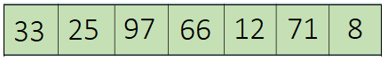

数组中每个元素按顺序依次放置在一块内存上。这样有规律放置的一组数据非常有利于通过索引来查找或修改数组中的某个元素。因为数组每个元素所占内存都是相同的，所以，只要知道元素的索引就可以立刻得到： `元素在内存中的地址 = 数组的起始内存地址 + 索引 * 单个元素占用的内存`。也就是说查找数组元素的时间复杂度是 $O(1)$。但数组的这种数据组织方式也有缺陷，比如说，在数组中插入或删除一个元素就相对较慢。因为数组的每个元素都是按顺序放置在内存中的，如果在中间插入或删除一个元素，那么这个元素之后的所有元素都要向后或向前依次移动一个位置。最差的情况是在数组头插入一个元素，那么数组中每个元素都要后移一位，看上去是插入一个元素，其实改动了所有的元素。数组插入删除元素的时间复杂度是 $O(n)$。

下面编写一个程序：假设我们需要在程序中构造一个长度为 100,000 数组，数组中总共有 0 ~ 99,000 总共 100,000 个整数元素，它们是倒序，从大至小排列的。

因为正好是倒序排列的一组整数，所以，可以使用循环的索引作为数据，每次迭代把索引数据都插入到数组最前面，这样就构造出所需的数组了。下图中最上面那个顺序结构中的程序就是按此方法实现的：

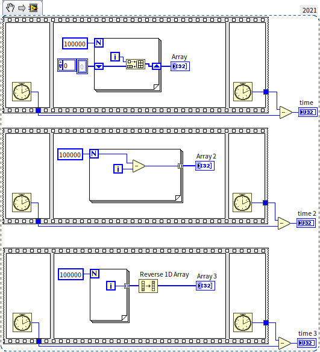

上文介绍了数组每种操作的效率，所以读者可能已经想到了，这种把数据插在数组头的操作是非常慢的。每插入一个数据的时间复杂度都是 $O(n)$，如果插入 n 个数据，总复杂度就达到 $O(n^2)$ 了。所以我们要在程序中避免数组的插入，LabVIEW 中构造数组最自然最高效的方法是使用[循环结构中带所有的输出隧道](data_array#输出隧道)。上图中，下面两个顺序结构都是比较好的构造数组的方法。在笔者的电脑上运行这个程序，time, time 2, time 3 的输出值分别为 450, 1 和 2。可见其效率差距之大。

:::info

这里请读者思考一个问题：把数据插入数组头的确非常慢，那么插入数组尾部是不是就没有效率问题了呢？新插入的元素是数组中的最后一个，那就不需要移动任何其它元素了。是这样吗？

:::

### 多维数组

前文提到过，LabVIEW 不支持数组的数组。这是因为数组的每个元素必须占用相同的内存空间。这样才能根据一个元素的索引快速计算到它所在的内存空间。而不同的数组拥有的元素个数可能都是不同的，也就是每个数组的长度都不相同，把它们作为元素再放到另一个数组里，那样新的数组就没法快速索引了。如果需要用到数组的数组，可以使用二维数组来代替。数组还可以是三维甚至更多维的。二维数组可以看做是按照行列顺序排列的数据：

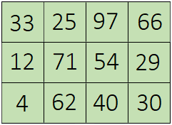

二维数组在内存中存储顺序是先放置一行的数据，然后紧接着保存下一行。因为每一行的元素的个数都相同，所以通过元素的索引还是可以立刻计算到元素所在的内存地址。比如一个二维数组，共有 n 行 m 列，需要访问的元素的索引是第 i 行 j 列，那么就可以知道这个 `元素的内存地址 = 数组的起始内存地址 + (m * i + j) * 单个元素占用的内存`。

但是，LabVIEW 还是允许一些长度不定的类型的数据作为数组元素的啊，比如字符串数组中，每个元素字符串的长度可都是相同的。这是因为，当字符串、簇等数据长度不定的数据作为数组元素的时候，数组中的元素其实是那些数据的引用。字符串中的内容被保存在内存的另一处，不论这个字符串本身有多长，它的引用都只是一个 4 字节长的数据，所以数组依然可以通过元素的索引快速找到元素所在的内存地址。关于这方面的相机介绍，可以参考[数据平化至字符串](data_string#数据平化至字符串)一节。

### 排序

程序里经常需要对一组数据进行排序，labview 有自带的函数，可以为数组中的元素排序，需要时直接使用即可。这一节我们来研究一下这个排序算法的底层是如何实现的，如果需要自己编写排序算法应该怎么做。

先考虑一下，我们平时怎么给东西排序，比如有一堆苹果，需要我们按照个头从大到小排序。有几种方法：
* 我们通常会先把里面最大的一个挑出来，摆在眼前；然后再从剩下苹果里面挑一个最大的，排在第二；再挑第三个……这种排序算法叫做**选择排序**（Selection Sort）。
* 也有的人喜欢用另一种方式排序：从那堆苹果里随便拿一个出来，摆在眼前；再随便拿一个苹果，跟眼前的比较一下，如果新拿的苹果更大，就排前面，否则排后面；再拿来一个苹果跟眼前所有苹果一一比较，把新苹果插在一个比前面小比后面大的位置上……这种排序算法叫做**插入排序**(Insertion Sort)。
* 还有一种类似的算法叫做**冒泡排序**（Bubble Sort）：假设我们面前有一排没有排序的苹果，我们先比较最右面两个苹果，如果左边一个大，就不动，如果右面的大，就调换两个苹果的位置；再比较右边数的第二第三个苹果，也是如果两个苹果中如果左边一个大，就不动，如果右面的大，就调换两个苹果的位置；在比较右边数第三第四个苹果……这样一轮下来，我们就可以保证最大的苹果被挪到了最左边了；如果同样的操作再来一轮，就能保证第二大的苹果被挪到了左边第二的位置；同样操作 n 轮后，n 个苹果就都被排序好了。

上面这三种算法都是比较简单直观的，如果说编写代码的话，笔者个人最喜欢冒泡排序，写出来的代码相对更简洁优美。下图是冒泡排序程序的程序框图：

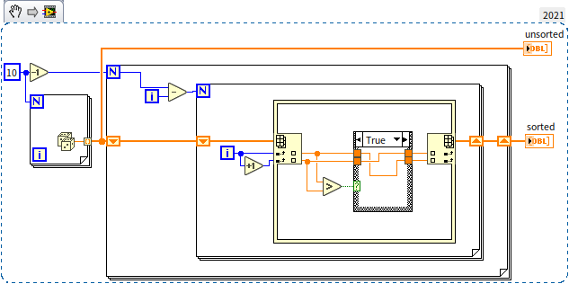

在这三种排序算法，每摆放好一个元素，都要去比较或者挪动其它所有剩下的元素。为了把 n 个数据排序，需要运行 n 轮，每轮又要进行平均 n/2 个操作。总体来看，算法时间复杂度达到了平方级别，也就是 $O(n^2)$。如果读者用一个大的数组去测量一下的话，就会发现，上面几种算法比 LabVIEW 自带的排序算法慢很多。慢在哪里呢？上面三个算法慢在：其实排序并不需要把每一个元素都跟其它所有的元素进行比较。比如有 a, b, c 三个数，如果已经发现 a > b，b > c，那么就不需要再去比较 a 和 c 的大小了。就是这些这多出来的比较运算，拉低了上面几个算法的效率。

有一些算法针对上面问题做了优化，去除了多余的比较。其中使用最广泛的是**快速排序**（Quick Sort）算法：还是以苹果排序为例，我们先从一堆苹果里随便拿出一个做基准，把所有其它的苹果都跟它比较。比它大的所有苹果都放在它左边；比它小的所有苹果都放在它右边。这样，桌上苹果分成了中间一个，左边一堆，右边一堆。我们能够确定，左边这堆任何一个苹果都必定大于右边一堆苹果中的任意一个。所以任何一个左边的苹果都不必再和右边的任何一个苹果去比较了。我们接下来再从左边这一小堆苹果中随机拿出一个做基准，按照上述方法，把左边这一堆分成更小的三堆；之后再对右边那一小堆苹果也做同样的操作。依次递推，直到每一小堆都只有一个苹果的时候排序就完成了。

这种排序算法，去除了所有没必要的比较，时间复杂度降低到了 $O(n\log_2 n)$。LabVIEW 自带的排序算法采用的就是这种排序算法。

那么，还能再快一些吗？如果是通过比较数组中元素的大小来排序，n 个数据，至少也要比较 $n*\log_2 n$ 次才行，所以无法再快了。但是，上文也提到过，数组最高效的操作是索引，那么能不能不比较大小，而是通过索引来排序呢？确实有这样的算法，比如我们需要给下面这样一组整数排序： 5, 4, 2, 8, 7，那么我们就可以先创建一个用于计数的数组（这也是计数排序名称的由来），这个计数用的数组长度一定要大于原来数组中最大的那个元素的数值。比如上面的例子中，需要排序的几个数中最大的是 8，那么我们就可以开辟一个长度为 10 的数组用来计数。接下来，挨个查看需要排序的数据，第一个数是 5，那么就把计数数组第 5 个元素加一；第二个数是 4，就把计数数组第 4 个元素加一…… 当计数完毕之后，按照计数数组记录的情况从前到后构造一个新的数据数组出来，就是排好序的数据数组了。这样的排序算法叫做**计数排序**（Counting Sort），下图是计数排序算法的程序框图：


计数排序的时间复杂度是 $O(n)$，比快速排序的复杂度又降低了一级。从上图的程序中也可以看出来，它没有嵌套的循环。说明计算次数与输入数据长度是呈线性关系的。比较一下计数排序和 LabVIEW 自带排序算法的效率：


在上图的测试程序中，首先生成了一个长度为 100,000,000 的随机数数组，然后分别传递给 LabVIEW 自带的排序算法（上面的顺序结构）和计数排序的算法（下面的顺序结构）。运行程序，在笔者的电脑上，time 和 time 2 的输出值分别是 17156 和 93。可见如果使用得当，计数排序的效率提升十分可观。那么 LabVIEW 自带的排序算法为什么不用计数排序呢？

从上面对算法的描述和代码实现中可以看出来，基本的计数排序只适合用来给那些素数值分布区间不大的整数数组排序。对于其它类型的数组，也可做一些处理，实现时间复杂度为 $O(n)$ 的排序算法：
* 比如对于数值大小分布区间非常大的整数数组，可以按照整数的每一位分别排序，每一位就只是 0 ~ 9 十个数，这就好处理了：先按个位数字把所有数据排好序，再按照十位上的数字排序，再按照百位…… 这种排序算法叫做**基数排序**（Radix Sorting）；
* 或者也可以对原始数据做预处理，让它们可以适应计数排序算法，比如可以把字符串数组中所有的字符串用某种公式映射到一个小范围整数区间后再排序。

总之，基数排序也好，计数排序也好，通用性都比较差：程序员需要针对特定的问题，对算法进行设置，甚至改造后才能使用。而一个编程语言自带的函数是希望具备一定的通用性的，可以应用到各种不同数据类型上的。基于比较大小的排序算法的通用性就非常好，不论实数还是字符串或其它常见类型，都不需要改造就能直接比较大小。因此，LabVIEW 自带的排序函数还是采用了快速排序算法，这样不管什么样的用户数据都可以处理。不过，当我们自己编写程序的时候，如果遇到对于效率要求极高的排序问题，还是可以考虑为其实现一个定制的 $O(n)$ 级别排序算法的。


### 搜索算法

数组另一个常见操作是从数组中找到一个特定值的元素。LabVIEW 也提供了相应的函数，读者可能已经发现了，LabVIEW 提供的搜索（Search）数组函数有两个，一个用于搜索未排序数组，另一个搜索已排序数组。搜索未排序数组没什么好办法，只能一个一个元素的比较，直到遇到一个元素与搜索值相同。最差的情况下，比较到最后一个元素才能确定是否找到，所以算法复杂度是 $O(n)$。如果数组是排序的，那就有效率更高的办法了。比如一个从大到小排序的数组，我们可以直接把数组中间的一个元素拿出来与搜索数据比较，如果搜索的目标数据比拿出来的数组元素更大，就表示目标数据一定在它的左边，就不需要再搜索数组右边那一半了；在左边这一半继续刚才的过程，直到找到目标数据。这个算法叫做**二分搜索算法**（Binary Search），因为它跳过了大部分的数组元素，只比较了少部分元素，所以时间复杂度大大降低，只有 $O(log_2 n)$。

LabVIEW 中用于搜索已排序数组的 VI “Search Sorted 1D Array.vim”是开源的，读者可以打开它的程序框图学习一下二分搜索算法是如何实现的。

和排序一样，如果搜索可以不基于数值比较，而是基于索引，是不是就可以更快了？确实是这样的，比如，数组中的数据总是与索引值相同，那么，要搜索数据 5，就直接读取索引为 5 的元素就可以了，这样就把搜索算法的复杂度降低到 $O(1)$ 了。这样数据结构是一种特殊的结合了链表的数组，叫做散列表或者哈希表，我们后面再做详细介绍。

## 链表（Linked List）

链表以节点的方式来存储数据,每个节点包含两个区域：一个用来存储数据元素，另一个用来指向下一个节点。它的结构可以用下图表示：


LabVIEW 中没有特别简单的实现通用链表的方法，比较优雅的实现方式需要用到面向对象的编程。因此，本书会在讨论了[面向对象的编程](oop__)之后，再来介绍如何[实现一个链表](/oop_use_cases#双向链表-doubly-linked-list-或-double-linked-list)。

链表的随机读取一个数据的效率比较低，而添加删除数据的效率却比较高，这与操作数组的效率正相反。链表添加删除数据之所以高效是因为它不需要移动链表中的其它节点。添加一个数据，只要先添加一个节点，在插入数据的地方，让原本的前一个节点指向新节点，新节点又指向原本的后一个节点，其它数据都不需要变动，新数据就被插入链表了。删除的操作也类似，删除时，让被删除节点的前一个节点直接指向被删除节点的后一个节点就可以了。链表根据索引访问一个数据的时间复杂度是 $O(n)$，数组访问数据的时间复杂度是 $O(1)$；链表添加或删除一个数据的时间复杂度是 $O(1)$，数组添加或删除数据的时间复杂度是 $O(n)$。

由此可见，如果数据需要经常被随机访问，那么就适合用数组来存储。比如，硬件设备在一段连续时间内采集的信号数据，保存在数组中，可以快速的随机读取任意一个时间的信号数据。如果数据需要经常被增删，那么就可以考虑使用链表。比如一个程序用来调度工作任务，系统会随时产生新任务插入任务列表，以及把完成的任务从列表中去除，那么就可以采用链表来实现这个任务列表。

需要注意的是，如果数据量不大，比如，一个程序负责管理一个部门的百十来号人的信息查询，不论哪种数据结构都不会耗用太多时间，在这种情况下，首先考虑的是开发的效率，就使用现成的数据结构或者已有的代码即可。

## 树（Tree）

### 树形控件
链表数据结构中，每个节点只会指向下一个节点。如果把这个结构稍微改一下，每个节点可以指向多个下一级节点，就是树的数据结构了。这个结构看上去就像是有很多分支的树。LabVIEW 中连链表数据结构都没有，就更别提树数据结构了。但幸运的是，LabVIEW 中有一个树形控件，它是用来显示有多个层级的树形的数据的，比如，显示多个层级的文件夹和文件。属性控件的操作方式与树形数据结构是非常类似的。所以我们可以利用这个属性控件提供的方法和属性来学习一下如果操作树形数据结构。树形控件的外观与[多列列表框](data_and_controls#列表表格和树形控件)非常类似。区别仅在于最左边一列，多列列表框显示出来的数据都是同一个级别的，不分层次，但树形控件可以通过显示内容的缩进来表示它们所在的不同的层次：


上图显示的是，在界面上，通过鼠标拖拽，把一些条目变成另一些条目的下级。

### 构造排序二叉树

树形数据结构，如果用图表示出来的话，和树形控件显示出来的结构非常相似。下面我们不再操作界面，而是通过调用树形控件提供的属性和方法，在程序中构造一棵树。这是一棵特殊类型的树：**排序二叉树**（Sorted Binary Tree）。

所谓二叉树是指，树中每个节点最多指向两个下一级的两个子节点，也就是任意一个树枝上最多能分两个叉。这两个子节点是有差别的，我们分别给它们命名为左子节点和右子节点。左子节点和左子节点都所有子孙节点构成了这个节点的左子树；同理也有右子树。  

所谓排序是指，这棵树中，任意一个节点上的数据的数值都必须大于它的左子树上的任何一个节点的数据的数值，也必须小于它的右子树上的任何一个节点的数据的数值。比如下面这棵树就是一棵排序二叉树：

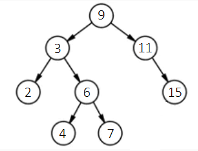

首先它的每个节点最多有两个子节点。其次，这上面任意一个节点，比如最上面这个节点（也被称为根节点），它的数值是 9，大于它的左叉上的任何子孙节点的数值，也小于它右叉上的任意一个子孙节点的数值。当我们需要给这棵树添加一个新的数据时，比如 12，为了保持确保添加的数据后，这棵树还是排序二叉树，我们需要这样操作：从树的根节点出发，先比较新数据 12 与根节点数据 9 的大小。因为 12 比 9 大，所以我们应当进入到它的右子节点（如果新数据更小，那么就进入到这个节点的左子节点）。在新进入的子节点中，继续比较新数据 12 与当前节点的数据 11，新数据大，所以继续进入 11 的右子节点。在这个节点中，新数据 12 小于节点的数据 15，所以应该进入左子节点。因为 15 这个节点没有左子节点，那么就在这里为数据 12 添加一个新的节点，把新节点作为 15 这个节点的左子节点。过程图示如下：

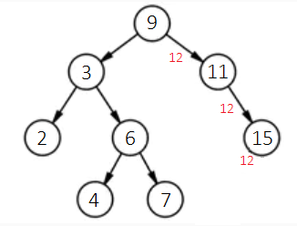

添加了新节点之后的树如下：

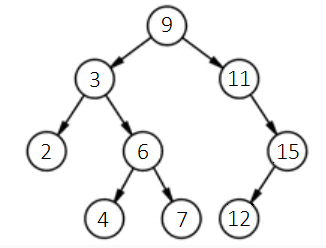

根据上面的思路，我们可以编写一个程序，按顺序，使用下列数据创建一棵排序二叉树 `[9, 3, 2, 6, 4, 7, 11, 15, 12]`。树形控件毕竟不是为树数据结构设计的，为了使用方便，我们还要先把它提供的属性和方法包装一下，制作一个方便我们操作数据结构的子 VI。树形控件有两个主要的不利于把它当做数据结构使用的问题：其一是，在数据结构中，我们一般使用引用来指向下一个节点，但是树形控件中没有元素数据的引用，它使用标签（Tag）来标识每个数据。我们在使用的时候要确保为每个数据指定一个唯一的标签。在这里，我们把问题简化一下，假设输入的数据中没有重复的，这样就可以直接用数据本身作为标签了。另一个差别在于，树形控件中，每个节点的所有子节点都是等价的，并不区分左右，但是二叉树数据结构，需要区分左子结点和右子节点。为此，我们会给树形控件中每个数据的标签添加一个前缀：根节点标签的前缀是字母“s”，其它所有的左子节点用前缀“L”表示，右子节点用前缀“R”表示。我们把上面提到的这两个改动封装在一个子 VI “node_info.vi” 中，下图是这个子 VI 的程序框图：

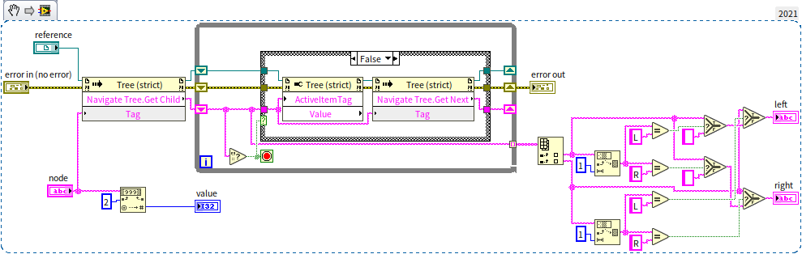

它的输入是一个用标签表示的节点（node），输出是这个节点的数据（value），以及它的左子节点（left）和右子节点（right）。把节点的标签的前缀去掉，转换成数值数据类型，就是节点保存的数据。接下来程序调用了树形控件遍历节点相关的方法，得到输入节点的所有子节点，然后根据子节点的前缀是 L 还是 R 来区分左子节点和右子节点。

有了这个子 VI 的帮助，实现插入一个节点的功能就很容易了。下图中的程序是插入节点 VI “insert_node.vi”的程序框图：


这是一个[递归 VI](pattern_reentrant_vi#递归算法)，程序首先比较新数据和当前数据的大小，如果新数据更小，说明新数据应该在当前节点的左子树中。程序再查看当前节点是否有左子节点，如果有，就递归进入左子节点，继续比较新数据和左子节点。如果，当前节点没有左子节点，那么就使用新数据创建一个新的左子节点：

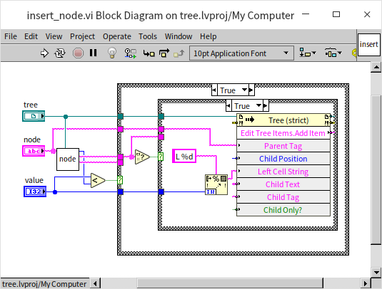

如果新数据大于当前节点的数据，就应该插入右子树中。代码类似，就不再重复了。创建一棵完整的树的主程序如下：

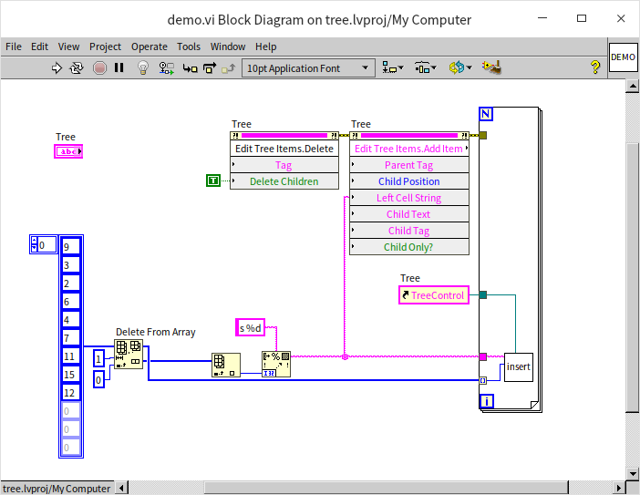

主程序首先调用树形控件的“删除”（Delete）方法，把控件中原有的数据清空。然后调用树形控件的“添加项目”（Add Item）方法，添加了二叉树的根节点，根节点的前缀不同，所以在这里单独添加。接下来就循环调用 insert_node.vi 把剩下的数据一一添加到了树中。运行上面的程序，树形控件看上去就是下面的样子：

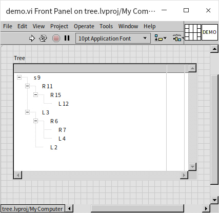

这棵树的形状和上文给出的图示是一致的。那么我们为什么要创建一颗排序二叉树呢？首先，它的查找数据效率非常高，不需要一个一个数据的比较。先把待查找的数据与根节点数据比较，就可以确定是去左边找还是右边，然后在子树中继续这一过程。这一过程非常类似上文提到的排序数组中的二分搜索算法，正因如此，排序二叉树还有另一个名字：**二叉搜索树**（Binary Search Tree）。排序二叉树中的搜索的时间复杂度也是 $O(log_2 n)$。但二者的插入数据效率就大相径庭了。排序数组在插入新数据时，由于需要挪动插入元素后面的所有元素，时间复杂度为 $O(n)$；而排序二叉树在插入新节点的时候，并不需要挪动任何其它节点，时间复杂度为 $O(1)$。不过，它还需要通过搜索，找到新节点该放置的位置，搜索的时间复杂度是 $O(log_2 n)$，所以，总过程的时间复杂度是 $O(log_2 n)$。综合来看，这个效率远高于排序数组，因此，排序二叉树经常被应用在需要快速查询数据的程序中，比如需要快速查询一个学校学生的信息等。


### 树的遍历

树的另一个常用算法是遍历，也就是按一定顺序查看树中的每一个节点。这一过程也被称为搜索。遍历和搜索的细微差别在于，“遍历”没有特定目标，要把树中的每个节点都访问一遍；而“搜索”的时候，遇到目标节点就停下来，不必再访问其它节点了。不过在很多场景下，遍历和搜索都是通用的。树在遍历的时候，首先要考虑是**广度优先**（先遍历完上一层的的所有节点之后，再去遍历下一级的所有节点）还是**深度优先**（先顺着左叉一路走到底，然后再查看右叉上的数据）。深度优先遍历时，又要根据先查看根节点数据还是先查看子节点数据分为：前序遍历（先访问根节点，再访问左子节点，最后访问右子节点）、中序遍历（先访问左子节点，再访问根节点，最后访问右子节点）和后序遍历（先访问左子节点，再访问右子节点，最后访问根节点）。对于排序二叉树来说，采用中序遍历，依次访问的数据正好构成一个从小到大排序的序列。下图是中序遍历的程序：


程序首先查看输入的节点是否是空，如果是空节点就什么都不做。否则就读出节点的数据，和左右子节点。在中序遍历时，程序先对左子节点递归调用遍历函数，在把数据插入到结果中，最后对右子节点进行递归调用。前序遍历和后序遍历就是把上面三步的顺序调整一下。在演示程序中，把遍历的结果插入到了一个数组中。上文提到，数据插入数组的效率是比较低的，如果考虑效率，这里应该使用“队列”来保存数据。使用数组是为了直接在前面板上显示出数据，方便演示。

调用中序遍历的主程序非常简单，先得到根节点，然后调用遍历函数即可：


程序运行结果：

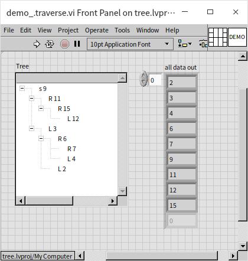

树的遍历是一个非常有用算法，很多问题，甚至有些看上去跟树没什么关系的问题也都可以用树的遍历算法来解决，比如，打印出几个数字的排列组合；比如走迷宫问题；再比如 24 点问题：随机抽 4 张扑克牌，怎么样用加减乘除把它们计算出 24 来。下文一个应用树的遍历算法的具体问题：

### 三壶谜题

假设有三个水壶，容量分别为 8 升，5 升，3 升。8 升的水壶里装满了水，其它两个水壶是空的。怎么样把水在三个水壶之间来回倒，从而得到准确的 4 升水？我们需要一个步骤最少的解法。

这个问题初看起来，跟树没有任何关系。但是，如果没学习过树的遍历算法，这个问题还真的不好解决。即便尝试几次后，恰好得到了 4 升水，也不能保证这就是最优解法。不过一旦掌握的树的遍历算法，就会觉得这个问题非常简单了。

我们先要为这个问题构造一棵树，然后再遍历，搜索答案。我们可以把三个水罐的每一种状态（各自装了多少水）都作为一个树中的节点。比如最初，三个水罐中的水分别是 8, 0, 0，我们就用它作为树的根节点，节点数据是 `[8, 0, 0]`。它的子节点是所有倒一次水之后，能够出现的所有新状态。比如,从根节点出发，只可能有两种可能的操作，把 8 升水壶中的水倒入 5 升的水壶，那么新状态就是 `[3, 5, 0]`，或者把水倒入 3 升的水壶，那么新状态就是 `[5, 0, 3]`。同理，从 `[3, 5, 0]` 这个状态出发，有三种可能的操作，把 8 升水壶的水倒入 3 升水壶，新状态是 `[0, 5, 3]`；把 5 升水壶的水倒入 8 升水壶，新状态是 `[8, 0, 0]`；或者把 5 升水壶的水倒入 3 升水壶，新状态是 `[3, 2, 3]`。下图是这棵树的示意图，这棵树的节点太多，图示只列出了一部分：

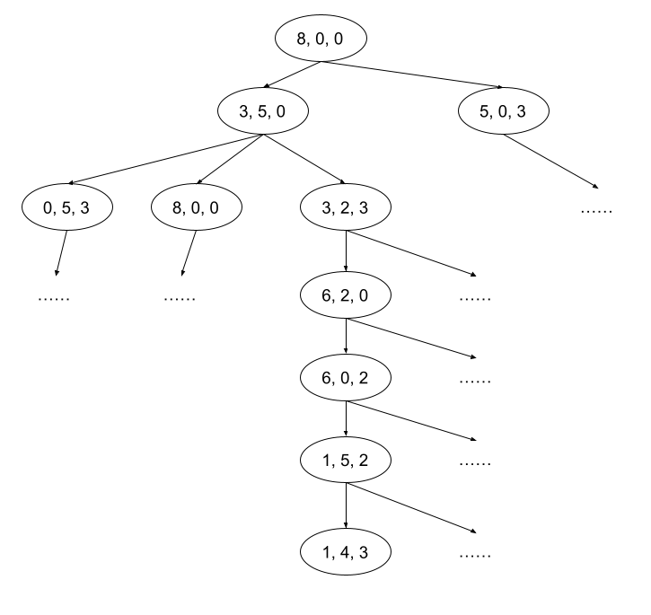

在这众多的节点中，会有一些节点的数据带有数字 4，如果我们能找到层次最接近根节点的，带有 4 的一个节点，那么也就找到了问题的答案。上图也列出来了一个可能的答案。但图示的不一定是最优解，我们还要编程验证一下。在搜索这棵树的时候，我们需要采用广度优先搜索，因为我们需要找到步骤最少的解法，所以我们需要先搜根节点，看看是不是不用倒水直接就有答案；如果不行，就搜所有第一层的子节点，如果找到答案，表示只需一步就可解决问题；如果还没有找到答案，就在搜索所有第二层子节点，看看有没有两步解决问题的方法；之后再搜索第三层……

在编程序的时候，我们也不一定要使用树形控件，甚至不需要构造出一个有引用，有节点的树。只要应用树的遍历算法就好了。下面我们就编程实现一下这个算法，首先考虑在程序里使用的数据：
* 我们使用一个整数数组来表示三个水壶的状态，这个数组只有三个元素，分别表示三个水壶中的水量。比如， `[3, 2, 3]`。三个水壶的总水量永远是 8，每个水壶中的水不能超过水壶的容积。
* 三个水壶的容积，也就是它们最多能装的水的数量是一个整数数组常量： `[8, 5, 3]`。
* 我们用一个簇来表示倒水的方向，这个簇有两个整数作为元素：第一个元素表示水从哪个壶倒出；第二个元素表示水倒入哪个壶。每个元素的取值都只可能为 0, 1 或 2，并且两个元素的值不能相同。
* 三个水壶，总共就只有六种倒水的方法，我们使用一个数组常量表示这六种方法。
* 倒水的时候，如果目标水壶能够装的下，就要把源水壶的水全部倒入目标水壶；如果目标水壶装不下，就把目标水壶装满。只有这样，我们才能知道每个水壶中确切的水量。
* 如果源水壶是空的，或者目标水壶是满的，那么就没法倒水了。我们可以忽略这种操作。
* 当我们找到答案的时候，需要把解决问题的过程打印出来。这个过程，也就是树上从根节点到答案节点的一条路径，路径上的每个节点代表了倒完一次水后水壶的状态。有了这个路径我们就还原整个倒水的过程。因为路径记录了多个节点，所以，它是一个二维数组，每一行表示一个节点。
* 我们在程序中传递数据的时候，每一个状态都需要使用这个状态的路径来表示。所以，程序中的状态是用一个二维数组来传递的。当需要遍历多个状态的时候，数据就是一个三维数组了。它的第一个维度下，每一条数据就是一条路径；每一条路径的最后一个数据，是需要查看的节点。


设计好数据，我们需要编写一个辅助 VI “get_next_states.vi”。输入水壶当前的状态给这个 VI，它会把所有可能出现的下一个状态列出来：


这个程序会按照六种倒水的方法，逐一尝试把一个水壶里的水倒入另一个水壶。如果成功，就把新的状态返回出来。这个 VI 实际上相当于返回了树形数据结构上，一个节点的所有子节点。

接下来是解决三壶问题最核心的 VI： 实现了广度优先搜索算法的 “BFS.vi”。BFS 是 Breadth-first Search 的缩写。它的程序如下：

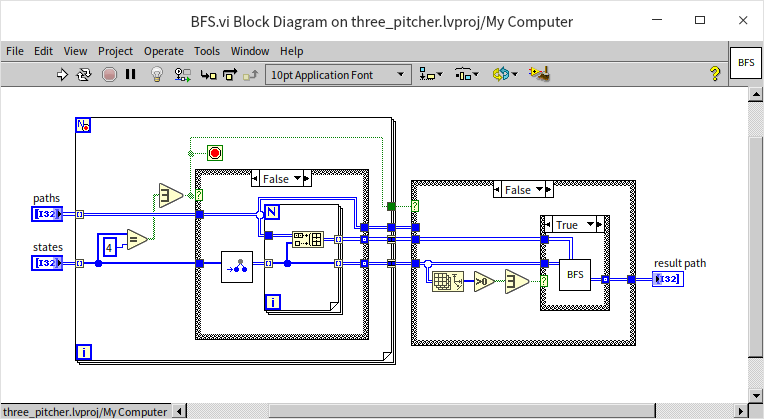

这个程序也是一个递归 VI。它的输入是一组路径（每个状态都是用一条完整路径来表示的），这一组数据表示了一个层级下的所有节点。因为是做广度优先搜索，所以程序首先查看输入的每一个节点是否包含数字 4，如果是，表示已经找到答案，程序返回，不再处理后面的工作了。如果没有找到答案，那么程序会针对每一个输入的节点调用“get_next_states.vi”，把所有下一级的状态都找出来，并放置在一个数组中。当把所有输入节点的所有下一级节点都找到之后，程序会对这些下一级的节点递归调用，在下一级继续做广度优先搜索，直到找到答案。

这个程序的主程序十分简单，只要把初始状态，也就是树的根节点传递给广度优先算法 VI 即可：

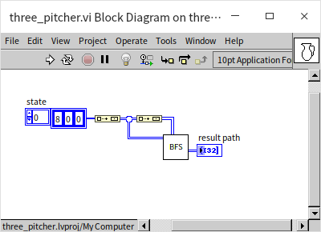

程序运行结果如下，它列出了找到答案所经历的每一步：

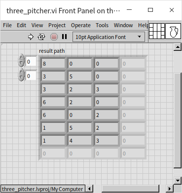

这个程序虽然能跑了，但它还有个严重问题。程序中有很多重复出现的状态，比如 A 水壶的水倒入 B，下一步 B 水壶的水又倒回 A。这些重复的状态一是导致程序效率下降，二是，在找不到答案的情况下，程序会一直把水倒来倒去，陷入死循环。我们会在下文中修正程序里的问题。


### 使用树数据结构的注意事项

虽然我们在上文使用了树形控件来演示树数据结构的操作，但树形控件的设计初衷只是用来做界面显示的。演示程序也只是为了帮助读者了解树形控件是树形数据结构的基本操作。在实际项目中，不能把树形控件当作数据结构来使用，因为树形控件的效率比较低，不适合处理大量数据。实际上，在很多应用中，“树”可以只是逻辑上的存在，不需要真正使用引用和节点把树数据结构构建出来的。就好比上文提到的三壶问题那样，倒水的过程就代表了树上从一个节点到另一个节点的跳转；排列组合问题中，数字位置的切换就代表了移动到下一节点，等等。在必须要构建一棵树的时候，可以仿照[链表](oop_use_cases#双向链表-doubly-linked-list-或-double-linked-list)的实现，使用面向对象的编程方法构造一颗高效率的树。

对于排序二叉树，要想达到预定的搜索效率，这棵树需要保持一定的平衡性（平衡表示每个枝杈的长度都差不多）。极端情况下，假设一棵树特别歪，所有的节点都只有左子节点，这样的树就退化成一个链表了。链表的搜索的时间复杂度是 $O(n)$，比排序二叉树应有的 $O(log_2 n)$ 差了很多。一棵不平衡的二叉树可以通过调整节点的位置使其平衡，但这一过程也是有开销的。如果一棵树要时时刻刻保持平衡，开销就又太大了，总体效率反而下降。业界最常使用的排序二叉树是红黑树。**红黑树**具有自平衡调整的功能，但又不会调整的过于频繁，是综合性能最佳的一种排序二叉树。LabVIEW 中有两种数据容器在底层就使用了红黑树，它们就是集合和映射表。


## 集合（Set）

集合和映射表，笔者更愿意称他们为数据容器，因为它们是更加关注如何操作数据，而非存储。不过数据容器，数据结构经常也是通用的，称他们为数据结构也无不可。集合用于存储和处理无重复元素数据，能够提供这种功能数据结构都可以被称为集合，至于在底层数据是在数组中、链表中或是树中都可以。LabVIEW 为了确保集合的效率，采用了红黑树来存储数据。集合最常用的场合是确保数据没有重复，它可以非常高效的查询一个数据是否已经在集合内了，也可以高效的把数据插入集合。LabVIEW 的集合因为采用了红黑树，数据插入和查询的时间复杂度都是 $O(log_2 n)$。下图是一个最简单的使用集合的例子：


程序把一组随机排列的整数一次插入了集合，输入的数据中有两个 6。但集合中是不能有重复数据的，所以第二个 6 并不会被插入集合。运行程序生成的集合中的数据是排序的，并且去除了重复数据：


集合数据在传入循环结构时，可以像数组一样直接使用带索引的隧道，取出集合中的每个元素。元素取出的顺序是它们的排序顺序，而不是插入的先后。

根据集合的性质，它在很多应用中可以替代数组，并表现出更高的性能。如果一组数是需要排序的，或者是需要确保唯一性的，都可以使用集合而不是数组。如果一个数组，不需要保持原顺序，又经常需要添加或删除元素，可以一考虑是否能用集合替代，因为在集合中插入删除数据的效率高于数组。

我们在上文解决三壶谜题的时候，程序中还留有一个缺陷：在遍历树的时候，遇到了很多重复的节点。我们正好可以利用集合的特性，来解决这个问题。思路是：每创建一个新的节点，都检查一下，它是不是已经在集合中了，如果在，就不处理了；如果不在，则把它加入集合，然后才处理。改进的程序如下：


新编写的广度优先搜索算法与上文的程序几乎相同，只是增加了用集合来检查一个状态是否已经出现过，如果出现过的，就该忽略。改进后的程序不但效率高了，而且也不会陷入死循环。输入一个不可能达到的目标，比如 9，程序会立刻返回空路径，表示没有找到答案。


## 映射表（Map）

集合使用元素的数据本身在集合中进行比较和查找，但是很多应用中，用户关注的数据与用来查询而数据可能并不是同一个数据。比如在考试成绩查询程序中，用户往往使用学生学号来查询，而他们希望得到的是学生的考试成绩。这种应用，集合就不适用了。为此，LabVIEW 又提供了一个与集合非常类似的数据容器“映射表”。映射表与集合的实现机制是完全相同，区别在于映射表为每个用于查询的数据又附带了一个额外的数据。也就是说，在映射表中，每个数据节点都包含一对数据，一个叫做“键”，专用于比较和查询；另一个叫做“值”，保存一些与“键”相关的额外信息。只有“键”，没有“值”的映射表就等价于集合。以考试成绩查询程序为例，我们可以把学号作为键，把学生考试成绩作为值。如果需要查看多门成绩，那么可以用一个数组或簇作为值，每个值中包含多个考试成绩的数据。

除了用于查询数据，映射表也可以在某些场合用于优化程序运行效率。最典型的情况是，如果用户可能在短时间内频繁的使用相同的输入参数调用一个比较耗时的函数，那么就可以为这个函数创建一个映射表，把输入参数作为映射表的“键”，把函数输出值作为映射表的“值”。这样，当用户调用函数的时候，如果发现映射表中已经保存了相应输入参数的运行结果，那么就不需要再次计算了，直接从映射表中取回缓存的结果即可。本书在[递归算法](pattern_reentrant_vi)一节中就应用了这样的方法为程序做优化，详见：[带缓存的递归](pattern_reentrant_vi#带缓存的递归)。

集合和映射表是在 LabVIEW 2019 中添加的功能。在此之前，LabVIEW 一般使用[变体数据类型](oop_generic#利用变体实现-map-容器功能)实现映射表的功能。如果，读者看到有程序中使用变体数据类型做数据查询，很可能因为程序是在老版本 LabVIEW 上开发的。


## 队列（Queue）和栈（Stack）

队列和栈是另外两个非常常用的数据结构。因为本书在之前的 [传引用-队列](pattern_pass_by_ref#队列)、[状态机](pattern_state_machine#数据结构设计) 等章节中已经做了详细介绍，这里就不再重复了。

LabVIEW 的队列在底层使用了链表来存储数据，所以数据入队、出队的时间复杂度是 $O(1)$，效率非常高。在程序中，如果不需要随机访问一组数据中的元素，而是只需要从头或尾读写数据时，应该考虑使用队列而不是数组来存储数据，这样效率会更高。

