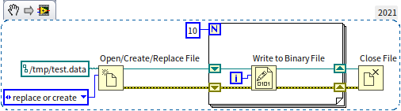
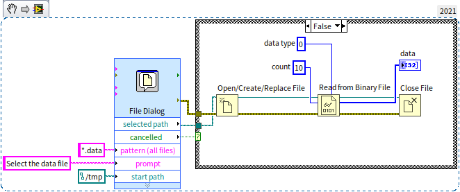
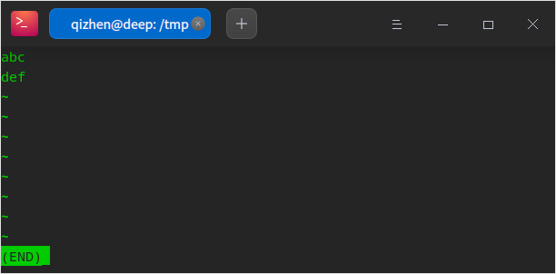
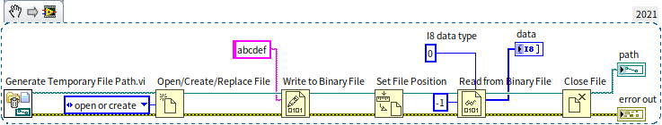
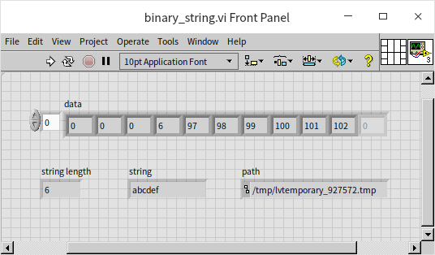

# 文件读写

## 二进制文件和文本文件

LabVIEW 文件读写相关的函数和 VI 主要在“编程 -\> 文件 I/O”函数选板上：

所有文件保存在存储介质上都是一串二进制的数据。不同类型的文件，对于文件内的数据的组织排布方式有所不同，使得它们适用于不同的场合。这些不同的文件又可以划分成两个大的类别：二进制文件和文本文件。严谨的说，文本文件也是一种广义上的二进制文件，它在存储上也是一串二进制数。但我们这里比较的是狭义上的二进制文件（非文本）与文本文件。

二进制文件直接把数据的原始格式写入硬盘，优点是数据占用空间小。但是二进制文件中可能包含各种长度的不同类型的数据，如果不知道一个二进制文件的格式，是无法知道里面存储的都是哪些数据的。二进制文件只能使用特定的程序或函数来读写；文本文件是用人眼可以识别的字符来存储数据，里面的数据都是字符串，优点是可以直接使用文本编辑器打开这类文件进行查看和编辑。

比如说，一个小数“38749.928398387799”，按照二进制格式保存一般需要占用 8 个字节，如果不要求那么精确 4 个字节也行；而使用文本格式保存则至少需要 19 个字节，也就是这个字符串的长度，考虑到文本文件通常还要加入数据间的分隔符，以及很多辅助信息，存储同样的数据，文本格式的文件可能比二进制文件大几倍。

二进制文件不仅空间效率高，时间效率也高。本身文件小，读写时间就短。尤其是很多时候，数据在内存中使用二进制格式存在的，可以直接写入二进制文件。如果保存成文本文件，还需要转换成字符串才能保存，非常影响速度。

综上所述，如果需要高速度，就使用二进制文件；如果需要操作方便就是用文本文件。如果追求极致的存储效率，不介意运行速度，可以使用 Zip 函数，对存储的文件进行压缩。有些文件类型，采用了折中方案，既包含二进制部分，也包含文本部分，比如采集到的数据使用二进制存储，而经常需要查看的内容比如通道名、用户名等使用文本存储。

在介绍这些预定义文件格式的读写之前，我们先来看一下 LabVIEW 最基本的文件读写如何使用。

### 二进制文件读写

二进制文件可以用于任何类型的数据，比如数组、簇等。但是我们在写入数据的时候，一定要记得数据是按照什么顺序写入的，在读取数据是必须按照同样的数据类型，同样的顺序把每一个写入的数据读出。如果我们拿到的是别人保存的一段二进制文件，我们不知道其中数据的格式，那么我们将无法从中读出正确的数据。

下图是一段典型的写二进制文件的程序，它在一个循环中保存了 10 个整数。

程序首先调用“打开文件”，打开指定路径的文件。如果不给这个函数指定文件路径，程序运行时，它会弹出一个选择文件对话框，要求用户选择一个文件。这个对话框可供设置的选项非常有限，接下来还会介绍一个功能更强大的选择文件对话框。

“打开文件”可以设置新建、替换等操作。一般来说，如果需要读或者修改目标文件，也就说目标文件必须存在，则应该选择“打开”操作，这样，“打开文件”若找不到目标文件会报错；如果需要写一个新文件，则应该选择“新建”操作，这样，“打开文件”若发现目标文件已存在则报错；如果确定目标文件存在，但是要完全替换目标文件中的内容，则应该选择“替换”操作。程序这里使用了“替换或新建”操作，表示如果文件不存在则新建一个，若已存在则替换其内容。

“打开文件”还可以设置文件的权限：只读、只写、读写。对于不需要进行修改的文件，可以把打开权限设置为只读，以确保后续程序不会无意间修改文件内容。

“打开文件”函数会输出一个文件句柄，这个句柄就代表了目标文件，后续程序需要用它来指定对哪个文件进行读、写或关闭。

程序中的“写入二进制文件”函数会把输入“数据”参数的数据都存入文件。“数据”参数默认是变体类型，但它可以接收几乎所有的数据类型，任何数据都可以被以二进制形式存入文件。程序中按次序从 0 至 9 写入了 10 个整数。“写入二进制文件”还有一个参数是“字节顺序”，用于指定按照什么顺序保存一个数据的每个字节。比如一个 I32 整数有 4 个字节，那么这 4 个字节按什么顺序摆放呢？是高位在前还是低位在前？目前，主流 CPU 在处理数据的时候，都是按照“小端”顺序处理数据的，也就是高位数据保存在内存的高地址中；但是网络传输协议却大多是采用的“大端”，也就是高位数据保存在内存的低地址中。这两种设置没有明显的优劣之分，只要保证读写时采用一致的设置即可。

存入数据后，一定要记得关闭文件。处于效率考虑，文件写入函数通常不会把数据直接写入硬盘，而是会先把数据放在缓存中，只有关闭文件才能确保所有缓存中的数据被写入硬盘。

我们可以试着用文本编辑（比如 notepad）器查看一下写入文件的数据是什么样的。笔者直接在命令行终端打开了刚刚生成的 test.data 文件，但是只能看到一些乱码：

读取二进制文件的过程与写入十分类似：

在这个程序里我们使用了一个“文件对话框” [Express VI](measurement_express_vi) 来选取目标文件。Express VI 与普通 VI 不太一样，它除了输入输出参数，通常还有一些配置参数。把“文件对话框”拖到程序框图上的时候，或者在程序框图上双击这个 Express VI，就会弹出它的配置对话框：

在这个程序中，我们只需要选择单个文件，并且必须是一个已存在的文件。除了这几个基础的配置信息，我们还需要已输入参数的方式，告诉它我们需要选择的文件后缀名是 ".data"，初始路径在 "/tmp"，并且选择文件的对话矿上还需要有一句提示：“Select the data file”。配置好这些参数，运行程序，就会弹出选择文件对话框：

在这里选则目标文件，点击确定按钮，所选择的文件的路径会从“文件对话框” VI 的“所选路径”参数输出。如果用户在选择文件对话框中点击“取消”按钮，程序应该避免运行后续的程序，以免程序出现错误。因此，程序检查了“文件对话框”的“取消”输出，如果其值为真，则什么都不做。

“读取二进制文件”函数必须设置读取数据的类型。二进制文件本身没有数据的类型信息，这里指定的数据类型必须与写文件时写入的数据类型一致。读数据时，我们可以像写数据程序一样用一个循环来读取数据。不过“读取二进制文件”中可以设置读取数据的数量。如果我们设置数量为 10，“读取二进制文件”函数就会一次读取 10 个数据出来。如果把这个参数设置为 -1，函数会一次读出后续所有的数据。

虽然在演示程序中，只保存了 10 个同样为整数类型的数据，但实际上，我们也可以把不同类型的数据都存放在同一个文件中的。比如先写入两个整数，再写入三个布尔型数据，最后放入一个簇类型数据。只要读文件时保证数据类型和顺序与写时一模一样就可以读出正确的数据。

:::info

这里请读者思考一个问题。上文写二进制文件的示例中，连续写入了 10 个整数。如果程序换一种做法：一次写入一个长度为 10 的整数数组。假设对应整数的数值都是相同的，这两种方法写入文件的数据是不是相同的呢？

:::

### 文本文件读写
与操作二进制文件极其类似，LabVIEW 还提供了“写入文本文件”和“读取文本文件函数”。但是在介绍这两个函数前，

在使用“写入文本文件”函数把字符串写入文件时，它只会把字符串的内容写入文件。比如下面的程序：

查看生成的文件，里面只有可读的文本文字：

### 相通的两种格式

请读者先考虑一下：既然文本文件只是一种特殊的二进制文件，那么是不是直接使用二进制文件函数也可以操作文本文件？只要把字符串数据传递给“写入二进制文件”就可以生成文本文件了？我们用下面的程序验证一下：

程序最开始调用“生成临时文件路径” VI 生成了一个临时文件的路径，它返回的只是个路径，这个路径对应的文件并不存在。在做测试的时候，我们经常需要把数据参数保存在一个临时文件中，用过之后，就再也不需要这个临时文件了。这时候，使用“生成临时文件路径” VI 就特别方便，不用自己费脑筋想文件名。而且，它生成的临时文件是在系统的临时文件夹中，系统会定时清理临时文件夹中的文件，我们也不用担心生成的临时文件太多会占用系统空间。

程序之后把字符串 "abcdef" 写入了临时文件中。如果使用文本编辑器打开这个生成的文件，会发现 "abcdef" 确实被写入了文件，但是在这几个字符之前还有一些乱码：

为了更清楚的查看这几个乱码是什么，上图的程序在保存了字符串之后，又按照 I8 整数的格式把整个文件中所有的数据读了出来。使用 I8 类型是因为它占用的空间恰好是一个字节，这样我们可以把文件中所有的字节按照顺序读取并显示。在读文件之前我们还调用了“设置文件位置”函数，把当前位置设置为文件的起始位置。程序每读或写一个数据，文件的当前位置都会向后移动一个数据的长度，如果在写完数据之后，需要把数据再读回来，就需要把文件当前位置重置到文件开头。对于一个大文件，如果我们只需要读取其中的某一部分内容，也可以使用“设置文件位置”函数把当前位置移动到所需要的地方，再读取数据。程序运行结果如下：

原来，“写入二进制文件”在写入字符串数据是，不但把字符串的内容写入了文件，还在字符转内容之前写入了一个 U32 类型整数，表示字符串的长度。也只有这样，“读取二进制文件”函数在读取字符串数据时才知道应该读取多少个字节。

## LabVIEW 中常用的文件格式

使用最基本的二进制和文本文件，用户可以任意组织其中的数据的结构。这样固然灵活，但是不利于交流，其他人未必了解你的文件格式，想要正确读写你的文件可能不那么便利。好在人们已经定义了数不清的各种文件格式，每种文件格式都定义好了其内部数据的组织方式。很多文件的格式规范都是公开的，如果按照已某个规范创建出一个文件，就不必担心其它人无法正确理解这个文件了。

从“ 文件 I/O”函数选板上就可以直观的看到 LabVIEW 支持的一些文件类型，比如电子表格格式文件、测量文件、配置文件、TDM/TDMS 文件、XML 文件、波形文件等。操作这些类型的文件与操作最基本的二进制和文本文件是类似的，它们都会有打开、读、写、关闭几个基本操作。有些类型文件只保留了读和写函数，把打开、关闭的操作合并到读、写函数里了。所以，最关键的问题可能还是应该如何选择适合项目类型的文件。

* 电子表格文件是一种文本格式的文件，专用于二维数组数据的读写。二维数组数据（表格）是一种非常常见的数据格式，比如，一个班级的考试成绩就可以被做成一个表格，表格中每个单元是一个成绩数据；每行代表一名学生；每列代表一门功课。
* LabVIEW 测量文件不是一种文件类型，而是一套 [Express VI](measurement_express_vi)。它可以把测量数据读写到几种不同类型的文件中。如果编写的是一个数据采集，或者测试程序，并且程序的数据采集部分也是使用 Express VI 编写的，那么使用这一套 Express VI 读写文件再合适不过了。
* 配置文件也被称为 INI 文件。它是一种文本格式的文件，专用于保存程序的配置信息。LabVIEW 本身也有一些需要记录下来的配置信息，比如，最近都打开了哪些项目和 VI。打开 LabVIEW.exe 同目录下的 LabVIEW.ini 文件就可以看到这些记录。INI 适合保存键值（key value pair）类型数据,但是它的读写效率不高，不适合存储大量数据。
* TDM 和 TDMS 两种数据格式非常类似。TDM （technical data management） 只能用在 Windows 操作系统下，它可以把硬件采集到的数据以二进制格式保存在后缀名为 .tdx 的文件中，同时在同名的 .tdm 文件中以文本格式记录一些相关信息，比如通道名、用户名等。TDMS （TDM streaming） 则是把所有的二进制和文本数据都合并进了一个 .tdms 文件。当直接记录设备采集的数据时，可以采用 TDMS 文件存储。
* XML，和 JSON 都是文本格式的文件，它们为保存的数据添加了标签，用于为数据添加说明信息。如果需要保存的数据有比较复杂的结构，并且希望可以直接在文本编辑器中查看数据，那么采用 XML 或者 JSON 文件格式。
* 波形文件顾名思义，专用于保存波形类型的数据。波形文件是一种特殊的 LabVIEW “数据记录文件”。数据记录文件可以以二进制数据根式保存任何 LabVIEW 程序中的数据。如果仅仅是想把某个数据记录下来，一遍下次打开程序时继续使用，那么就可以采用数据记录文件。数据记录文件虽然使用方便，但由于它的格式时二进制的，我们无法直接在文本编辑器中直接查看。

## 练习

* 
