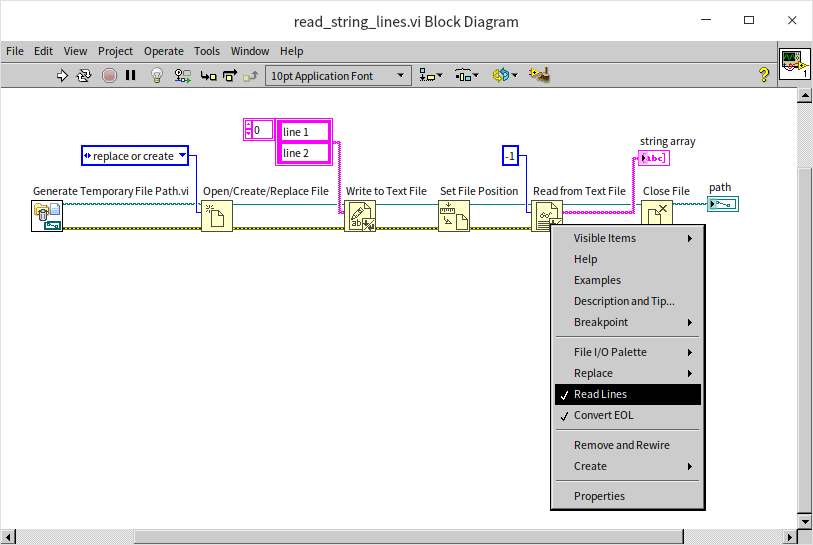
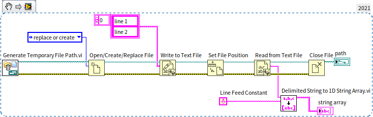
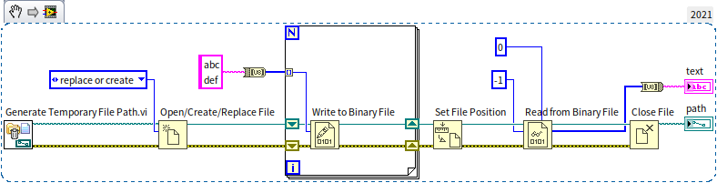
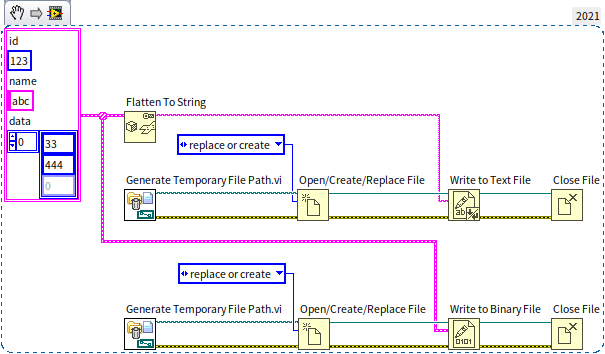
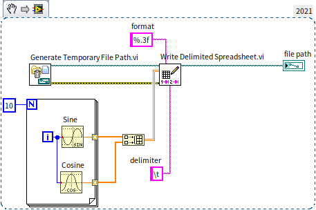
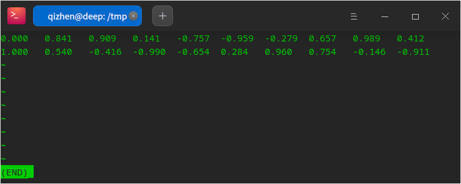
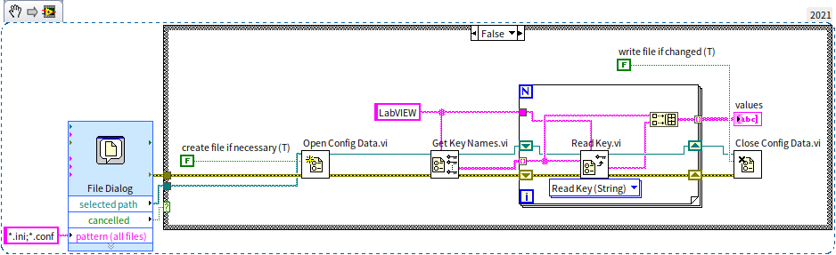
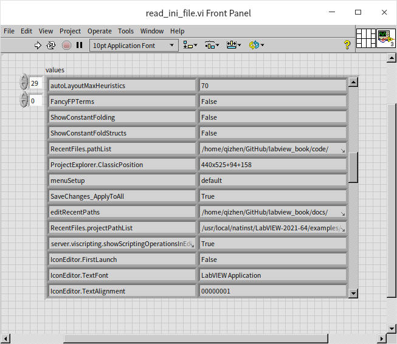

# 文件读写

## 二进制文件和文本文件

LabVIEW 文件读写相关的函数和 VI 主要在“编程 -\> 文件 I/O”函数选板上：


在这个函数选板上可以看到读写多种不同类型的文件的函数。这些不同类型的划分主要是按照数据在文件中的组织格式来区分的。如果我们先不考虑数据的组织格式，只考虑文件中的数据的内容，可以把文件分为两大基础类别：二进制文件和文本文件。二进制文件中，每个字节的数据用 U8 整数表示的话，可以是 0~255 之间的任何一个数，当然在文件中，这个字节并不一定是用来表示整数的，它可能是用来表示其它数据类型的。文本文件中的每个字节则不会是任何数值，它们只会是某些人眼可读的字符所对应的二进制数值。比如，文件中会有大小写字母、数字、标点、空格、换行符等。如果用文本编辑器打开，文本文件是可以被直接阅读的，而二进制文件里通常只能看到一堆乱码。

严谨的说，文本文件也是一种广义上的二进制文件，它在存储上也是一串二进制数。但我们这里比较的是狭义上的二进制文件（非文本）与文本文件的区别。

二进制文件直接把数据的原始格式写入硬盘，优点是数据占用空间小。但是二进制文件中可能包含各种长度的不同类型的数据，如果不知道一个二进制文件的格式，是无法知道里面存储的都是哪些数据的。二进制文件只能使用约定好的的程序或函数来读写；文本文件里面的数据都是人眼可以识别的字符串，优点是可以直接使用文本编辑器打开这类文件进行查看和编辑。

比如说，一个小数“38749.928398387799”，按照二进制格式保存一般需要占用 8 个字节（双精度浮点数），如果不要求那么精确 4 个字节（单精度浮点数）也行；而使用文本格式保存则至少需要 18 个字节，也就是这个字符串的长度，考虑到文本文件通常还要加入数据间的分隔符，以及很多辅助信息，存储同样的数据，文本文件占用的空间可能比二进制文件大几倍。

二进制文件不仅空间效率高，时间效率也高。本身文件小，读写时间就短。尤其是很多程序中，数据在内存中本来就是以二进制格式保存的，它们可以被直接写入二进制文件。如果保存成文本文件，还需要先把它们转换成字符串才能保存，非常影响速度。

综上所述，如果需要高速度，就使用二进制文件；如果需要操作方便就是用文本文件。如果追求极致的存储效率，不介意运行速度，还可以使用文件压缩函数，对存储的文件进行压缩。有些文件类型，采用了折中方案，单个文件内既包含二进制部分，也包含文本部分，比如采集到的数据使用二进制存储，而可能被直接查看的内容，如通道名、用户名等则使用文本格式存储。

我们先来看一下 LabVIEW 中最基本的文件读写如何使用。

### 二进制文件读写

二进制文件可以用于存储任何类型的数据，比如数组、簇等。但是我们在写入数据的时候，一定要记得数据类型都有哪些，是按照什么顺序写入的，在读取数据时必须按照同样的数据类型、同样的顺序把每一个写入的数据读出。如果我们拿到的是别人保存的一段二进制文件，不知道其中数据的格式，那么我们将无法从中读出正确的数据。

下图是一段典型的写二进制文件的程序，它在一个循环中保存了 10 个整数。


程序首先调用“打开文件”函数，打开指定路径的文件。如果不给这个函数指定文件路径，程序运行时，它会弹出一个选择文件对话框，要求用户选择一个文件。这个对话框可供设置的选项非常有限，后文会介绍一个功能更强大的选择文件对话框。其实，“写入二进制文件”和“读取二进制文件”如果没有指定文件路径或句柄，也可以弹出选择文件对话框，但一般不会在程序里这样用。

“打开文件”可以设置新建、替换等操作。一般来说，如果需要读取或者修改目标文件，也就说目标文件必须存在，则应该选择“打开”操作，这样，“打开文件”若找不到目标文件会报错；如果需要写一个新文件，则应该选择“新建”操作，这样，“打开文件”若发现目标文件已存在则报错；如果确定目标文件存在，但是要完全替换目标文件中的内容，则应该选择“替换”操作。示例程序使用了“替换或新建”操作，表示如果文件不存在则新建一个，若已存在则替换其内容。

“打开文件”还可以设置文件的访问权限：只读、只写、读写。对于不需要进行修改的文件，可以把打开权限设置为只读，以确保后续程序不会无意间修改文件内容。

“打开文件”函数会输出一个文件句柄，这个句柄就代表了目标文件，后续程序需要用它来指定对哪个文件进行读、写或关闭。

程序中的“写入二进制文件”函数会把输入“数据”参数的数据都存入文件。“数据”参数默认是变体类型，但它可以接收几乎所有的数据类型，任何数据都可以被以二进制形式存入文件。程序中按次序从 0 至 9 写入了 10 个整数。“写入二进制文件”另一个参数是“字节顺序”，可以指定按照什么顺序保存一个数据的每个字节。比如一个 I32 整数有 4 个字节，那么这 4 个字节按什么顺序摆放呢？是高位在前还是低位在前？目前，主流 CPU 在处理数据的时候，都是按照“小端”顺序处理数据的，也就是高位数据保存在内存的高地址中；但是网络传输协议却大多是采用的“大端”，也就是高位数据保存在内存的低地址中。这两种设置没有明显的优劣之分，只要保证读写时采用一致的顺序即可。

存入数据后，一定要记得关闭文件。出于效率考虑，文件写入函数通常不会把数据直接写入硬盘，而是会先把数据放在缓存中，只有关闭文件才能确保所有缓存中的数据被写入硬盘。

我们可以试着用文本编辑器（比如 notepad）查看一下写入文件的数据是什么样的。笔者直接在命令行终端打显示了刚刚生成的 test.data 文件的内容，但是只能看到一些乱码：


要还原文件中的数据，只能再编写一段程序，把数据读出来。读取二进制文件的过程与写入十分类似：


在这个程序里我们使用了一个“文件对话框” [Express VI](measurement_express_vi) 来选取目标文件。Express VI 与普通 VI 不太一样，它除了输入输出参数，通常还有一些配置参数。把“文件对话框”拖到程序框图上的时候，或者在程序框图上双击这个 Express VI，就会弹出它的配置对话框：


在“配置文件对话框”上，我们选择了只需要单个文件，并且必须是一个已存在的文件。除了这几个基础的配置信息，我们还需要通过输入参数的方式，告诉这个 VI 我们需要选择的文件后缀名是 ".data"，初始路径在 "/tmp"，并且选择文件的对话框上还需要有一句提示：“Select the data file”。配置好这些参数，运行程序，它就会弹出选择文件对话框：


在这里选择目标文件，点击确定按钮，所选择的文件路径会从“文件对话框” VI 的“所选路径”参数输出。如果用户在选择文件对话框中点击了“取消”按钮，程序应该避免运行后续的读文件程序，以免程序出错。因此，示例程序检查了“文件对话框” VI 的“取消”输出，如果其值为真，则什么都不做。

“读取二进制文件”函数必须设置读取数据的类型。二进制文件本身没有数据的类型信息，这里指定的数据类型必须与写文件时写入的数据类型一致。读数据时，我们可以像写数据程序一样用一个循环来读取数据。不过“读取二进制文件”中直接就可以设置读取数据的数量。如果我们设置数量为 10，“读取二进制文件”函数就会一次读取 10 个数据出来。如果把这个参数设置为 -1，函数会一次读出后续所有的数据。

虽然在演示程序中，只保存了 10 个同样为整数类型的数据，但实际上，我们也可以把不同类型的数据都存放在同一个文件中的。比如先写入两个整数，再写入三个布尔型数据，最后放入一个簇类型数据。只要读取文件时保证数据类型和顺序与写入时一模一样就可以读出正确的数据。

:::info

这里请读者思考一个问题。上文写二进制文件的示例中，连续写入了 10 个整数。如果程序换一种做法：一次写入一个长度为 10 的整数数组。假设对应的整数数值都是相同的，这两种方法写入二进制文件的数据是不是相同的呢？

:::

### 文本文件读写

与操作二进制文件极其类似，LabVIEW 还提供了“写入文本文件”和“读取文本文件”函数。在使用“写入文本文件”函数把字符串写入文件时，它会把字符串的内容写入文件。比如下面的程序：


示例程序首先调用“生成临时文件路径” VI 生成了一个临时文件的路径。需要注意的是，它只是生成了一个路径，这个路径对应的文件还不存在。在做测试的时候，我们经常需要把数据参数保存在一个临时文件中，一段时间之后，就可以将其丢弃了。这种情况使用“生成临时文件路径” VI 就特别方便，因为它不用自己费脑筋去给临时文件起名。并且，它生成的临时文件是在系统的临时文件夹中的，操作系统会定时清理临时文件夹中的文件，我们也不用担心生成的临时文件会占用太多系统空间。

查看生成的文件，里面只有可读的文本文字：


上面示例程序的后半部分又把数据从文件中读取出来了。因为这里没有关闭文件后再打开的过程，在读文件之前需要调用“设置文件位置”函数，把文件当前位置设置到文件的起始位置。程序每读或写一个数据，文件的当前位置都会向后移动一个数据的长度，如果在写完数据之后，需要把数据再读回来，则需要把文件当前位置重置到文件开头。对于一个大文件，如果我们只需要读取其中的某一部分内容，也可以使用“设置文件位置”函数把当前位置移动到所需要的地方，再读取数据。

文本通常会被分成一行一行的，所以“写入文本文件”除了支持字符串数据类型的输入，还支持字符串数组作为输入，数组中的每个元素会被作为一行写入文件。“读取文本文件”函数也可把读取的文本按照字符串数组方式输出。在“读取文本文件函数”的右键菜单上选中“读取行”，这时候，这个函数就会按照行来读取文件，默认每次读一行。再把读取数量设置为 -1，函数就会读出文件中所有的行：



如果已经按照字符串格式读出了数据，也可以调用 LabVIEW 中的字符串处理函数（Delimited String to 1D String Array.vi）把它按照行转换为字符串数组。下图中的程序与上图中的程序是等效的：



读者可能已经注意到了，“写入文本文件”和“读取文本文件”函数的右键菜单都有一项叫做“Convert EOL”（转换换行符），这个设置只在 Windows 系统上有效。在 Windows 操作系统的文本文件中，每行结尾默认是“回车+换行(CR+LF)”，即 `\r\n`；Unix、Linux 以及现代 macOS 系统的文本里，每行结尾默认是“换行 LF（`\n`）”。只有在古老的旧版麦金塔系统（Classic Mac OS 9 及更早版本）中，每行结尾默认是“回车 CR（`\r`）”。

目前，网上下载的文本文件，尤其是各种文本编程语言的源代码，多是采用 Linux 系统的换行方式。如果设置了“转换换行符”，“写入文本文件”和“读取文本文件”函数在 Windows 系统下会自动把源文档中每行之间的分隔符都替换成 `\r\n`。


### 相通的两种格式

既然文本文件只是一种特殊的二进制文件，那么是不是直接使用二进制文件函数也可以操作文本文件？只要把字符串数据传递给“写入二进制文件”就可以生成文本文件了？我们用下面的程序验证一下：


程序调用“写入二进制文件”把字符串 "abcdef" 写入了临时文件中。如果使用文本编辑器打开这个生成的文件，会发现 "abcdef" 确实被写入了文件，但是在这几个字符之前还有一些乱码：


为了更清楚的查看这几个乱码是什么，上图中的示例程序在保存了字符串之后，又按照 U8 整数的格式把整个文件中所有的数据读了出来。使用 U8 类型是因为它占用的空间恰好是一个字节，这样我们可以把文件中所有的字节按照顺序读取，并显示出每个字节的数据。程序运行结果如下：


原来，“写入二进制文件”函数有一个名为“预置数组或字符串大小”的参数，其默认值为 True。因此，在写入字符串或数组时，LabVIEW 会自动在数据内容之前写入一个 I32 类型（4字节）的整数，用于记录数据的长度。这样做的目的是为了让“读取二进制文件”函数能够知道应该读取多少个字节。

如果你不希望包含这个长度头（例如需要写入标准的纯二进制协议），可以将该参数设置为 False，但读取时你就必须自己管理数据的长度逻辑。

文本文件应当只包含字符串的内容，所以，我们可以先把字符串转换成 U8 数组，在把数组的每个元素写入文件，这样生成的文件就是一个文本文件：



采用同样的原理，我们也可以调用“写入文本文件”函数来生成一个二进制文件。在[“字符串”](data_string)一节中，我们介绍了“平化”的概念，当数据被写入二进制文件时，就是一个平化的过程。所以，如果我们先把某个数据平化成字符串，再调用“写入文本文件”函数写入文件，其结果与直接调用“写入二进制文件”函数把数据写入文件是完全相同的，比如下图中的两种写书数据方式是完全等效的：




## LabVIEW 中常用的文件格式

使用最基本的二进制和文本文件，用户可以任意组织其中的数据的结构。这样固然灵活，但是不利于交流，其他人未必了解你的文件格式，想要正确读写你的文件可能不那么便利。好在人们已经定义了数不清的各种文件格式，每种文件格式都定义好了其内部数据的组织方式。很多文件的格式规范都是公开的，如果按照某个规范创建出一个文件，就不必担心其它人无法正确理解这个文件了。

在“文件 I/O”函数选板上就可以直观的看到 LabVIEW 支持的一些文件类型，比如电子表格格式文件、测量文件、配置文件、TDM/TDMS 文件、XML 文件、波形文件等。操作这些类型的文件与操作最基本的二进制和文本文件是类似的，它们都会有打开、读、写、关闭几个基本操作。有些类型文件只保留了读和写函数，把打开、关闭的操作合并到读、写函数里了。所以，最关键的问题可能还是应该如何选择适合项目类型的文件。

### 电子表格文件

电子表格文件是一种文本格式的文件，专用于二维数组数据的读写。二维数组数据（表格）是一种非常常见的数据格式，比如，一个班级的考试成绩就可以被做成一个表格，表格中每个单元是一个成绩数据；每行代表一名学生；每列代表一门功课。电子表格文件根据分隔符的不同，有两种最常见的格式，一种是用逗号 "," 分隔一行中的每个数据，通常用 ".csv" 作为文件名后缀；一种是用制表符 "\t" 分隔一行中的每个数据，通常用 ".tsv" 作为文件名后缀。用户也可以任意自定义分隔符和文件名后缀名，但是使用已有的规范通用性会更好，容易被其它软件识别。

微软的 Excel 是最常用的一款处理表格数据的软件。Excel 以及其它类似软件，比如 Google Sheets、WPS 办公软件等都可以读写 .csv 或 .tsv 文件。如果需要在这些软件和 LabVIEW 之间共享数据，使用电子表格文件是一个非常好的方案。

电子表格文件的读写都比较简单，下图是一个写电子表格的示例：



不论输入的数组元素是那种类型，最终都是以文本格式存入文件，所以写入时可能需要设置数据写入时的格式，使得文件中的数据更容易阅读。可以参考 [字符串数据](data_string) 一节中关于字符串格式化的设置。

程序写入文件的数据如下：



下图是一个在网上找到的开源数据文件，weight_height.csv


可以很明显的看出，这个文件中的数据有 3 列，分别表示性别、身高和体重。使用下图中的程序可以把文件中的数据读出并显示：


“读取电子表格文件”是一个 [多态 VI](oop_generic)，点击它下面的数据类型选择菜单，可以看到它能够读入的三种数据类型：实数 DBL，整数 I64 和字符串 String。需要读取的文件中既有字符串数据（第一列，性别），也有实数数据（第二三列，身高和体重）。如果选择按照实数数据类型读入，那么输出的结果会是一个二维实数数组，它会忽略源文件中的所有字符串数据。所以我们这里只能按照字符串读出所有的数据，再自己把身高体重转换成实数。

这个 csv 文件是使用逗号做分隔符的，所以在读取的时候必须设置使用 "," 分隔数据，否则这个 VI 会默认用制表符去分隔数据。

很多电子表格文件的第一行都不是数据，而是每列数据的名称。只要在读取文件后，保留所需要的数据即可。

程序运行结果如下图所示：


关于数据的显示部分，可以参考 [图形化显示数据](data_graph) 一节。


### 配置文件

配置文件也被称为 INI 文件，因为这类文件通常以 .ini 为后缀名。INI 是英文 Initialization （初始化）的缩写。 ini 文件专用于保存程序的配置信息，比如记录程序界面尺寸、位置，之前打开过的文件等等。有了这些记录，程序每次启动后才能恢复到上一次关闭时的状态，这也是 INI 文件名字的由来。Windows 系统下的 LabVIEW 本身就带有一个 INI 文件，它是与 LabVIEW.exe 文件同文件夹下的 LabVIEW.ini 文件。INI 文件是一种文本文件，所以读者可以使用文本编辑器打开 LabVIEW.ini，看看里面有什么内容。

比如，读者会看到类似下面的一些条目：

```ini
[LabVIEW]
IconEditor.TextFont="LabVIEW Application"
IconEditor.TextSize=00000009
```

上面示例列只截取了 LabVIEW.ini 文件中的两条，它们分别表示 LabVIEW 图标编辑器中使用的字体和字号。如果用户在图标编辑器里改变了字体和字号，这些更改都会被记录在这个 INI 文件中，即便在重新启动 LabVIEW 之后，LabVIEW 也会记住用户的设置。

在示例中，中括号代表一个段落的开始，一个 INI 文件中可以有多个段落。中括号中的文字代表段落的名称，同一个文件中每个段落的名必须是唯一的。中括号下面的行，直到下一个中括号之前，都是这个段落的内容。内容中每一行必须是一对键值：等号左边表示一个设置的名称，等号右边是这个设置的值。在同一个段落内，键的名称必须是唯一的，不同的段落可以有同样的键名。值可以是数值类型或字符串类型的数据。有时候也可能会看到使用英文分号 ";" 起始的行。分号是 INI 文件的注释符，如果一行以分号开头，这一行就不会有实际功能。

下面是一个典型 INI 文件的示例：

```ini
[section_one]
key1=1
key2="some string"

[section_2]
key1=2.5
;下面这行没用
;key_five=7.99
```

读写 INI 文件先要打开文件，然后读写，最后关闭。这与读写文本文件和二进制文件的过程非常类似。INI 文件的读写 VI 都是 [多态 VI](oop_generic)，它们支持六种基本数据类型的读写，包括布尔、双精度、I32、路径、字符串、和 U32 数据类型。无论那种数据类型，都需要指定读写的段落名可键名，写数据时，如果段落或键不存在，文件会新建一个相应的段落和键；读数据时，如果段落或键不存在则会返回用户指定的默认值。

下图是一段写入 INI 文件的程序：


程序首先拿到当前 VI 的路径，然后去掉文件名，只保留路径，也就是这个程序所在的文件夹的路径。然后构造了一个新的路径，指向当前 VI 同文件夹下的 test.ini 文件。之后调用“打开配置数据” VI 来打开这个 INI 文件。之后再调用“写入键” VI 写入了几种不同类型的数据。这个程序还调用了“删除键”和“删除段” VI，删除了刚才写入的一些数据，被删除的段落和键值将不会出现在文件中。程序最后调用“关闭配置数据” VI 关闭文件。文件是在关闭时才真正被写入文件的，也就是说，如果只调用“写入键”而不关闭文件，那么硬盘上文件的内容是不会变的。

如果打开的 INI 文件原本就有一些内容，那么“写入键”会覆盖那个同段落、同键名内的数据；如果某个键没有被重新写入或删除，则它的内容不会变化。

当写入字符串数据时，VI 还有一项设置：“write raw string?”（写入原始数据），一般使用默认值即可；这时，写入 VI 会自动对不可显示的字符比如回车符等进行编码，把它们编程可以显示的形式。只有在极个别的情况，比如写入的 INI 文件要给 LabVIEW 之外的程序使用时，才可能要求对字符串不进行编码。

运行上面程序，产生的 INI 文件如下：


可以看到 key 4 对应的字符串数据中，回车符被编码成了 "\0A"。 文件中还有一些原本就存在的段落和键值，没有被改动。

我们无法把复杂类型的数据，比如数组，或簇直接传递给“写入键” VI。但也是有办法把这样的数据保存到 INI 文件中的，比如 labVIEW.ini 文件中就有这样的键值，键 "RecentFiles.pathList"  记录了 LabVIEW 最近打开过的十个 VI 的路径。它原本应该是一个路径的数组，LabVIEW 为了把它写入 INI 文件，把数组数据转换成了一个字符串，在字符串中用 ":" 分隔每个 VI 的路径。我们自己在编写程序的时候，可以仿照 LabVIEW.ini 的方法，把复杂数据转换成自定义格式的字符串。可以参考上文“相通的两种格式”这一段，使用[“字符串”](data_string)一节中介绍的“平化”函数，把数据平化成字符串，再保存至 INI 文件。

读取 INI 文件与写入相似，下图是读取 LabVIEW.ini 文件的程序：



程序首先调用文件对话框找到一个文件。在 Linux 系统下，配置文件的后缀名是 .conf。然后程序打开了这个配置文件，再调用“获取键名” VI 得到了 "LabVIEW" 段落下的所有键名。之后逐个读出每个键的值。“读取键”也是一个多态 VI，它支持的数据类型与“写入键” VI 相同。但是因为这里我们使用了一个循环来读取数据，没有区分它们的数据类型，所以就用了字符串的形式来读取所有的数据。因为 INI 是一种文本文件，所以，任何内容也都可以被当做字符串读出。程序运行结果如下，它是笔者的 LabVIEW 环境的部分设置信息：



配置文件的读写效率比较低。一般，应用程序的配置信息不会太多，使用配置文件保存这些信息不会有问题。但如果是程序采集到的数据，或者分析数据的结果，通常数据量会比较大，就不适合用配置文件来存储。

--------------------

（以下部分还没有写完 .......）

### LabVIEW 测量文件

所谓的“测量文件”通常指的是 LabVIEW 独有的 ASCII 文本格式文件（.lvm）。它通常由“写入测量文件”这一 Express VI （[快速 VI](measurement_express_vi) ）生成。

对于初学者，Express VI 非常便利。你不需要自己处理文件打开、格式化字符串、关闭文件的繁琐过程，只需将信号线连接到 Express VI 的输入端，配置弹窗中的选项（如分隔符、是否包含时间头等），即可生成一个人类可读的表格数据文件。但 .lvm 文件体积较大，读写速度较慢，适合短时间、低采样率的数据记录。

对于那些参与开发数据采集或测试程序的人来说，应用快速 VI 进行文件操作可以带来极大的便利。例如，考虑这样一个场景：一个工程师正在进行一个项目，该项目涉及从各种传感器收集温度和湿度数据。传统上，处理这些数据的收集、处理和存储可能需要大量编程。然而，有了 LabVIEW 测量文件，这个过程就被简化了。


### TDM 和 TDMS 文件

TDM（Technical Data Management） 和 TDMS （TDM Streaming） 是两种密切相关的数据格式，它们在现代数据采集和管理系统中扮演着至关重要的角色，特别是在需要精确高效数据处理的环境中。这两种格式主要用于存储从各种硬件设备收集的大量数据，因此在工程、科学研究和工业自动化等领域尤为相关。

为了解决文本文件体积大、读写慢，而纯二进制文件缺乏描述信息（如单位、传感器名称）的问题，NI 推出了 TDMS 格式。

TDMS 是一种二进制格式，但它内部自带了类似数据库的结构（文件 -> 组 -> 通道）。在“编程 -> 文件 I/O -> TDM 流”选板下，你可以找到专门的 API。它主要是为了解决文本文件体积大、读写慢，而纯二进制文件缺乏描述信息（如单位、传感器名称）的问题。

- TDMS 打开/创建： 建立文件引用。
- TDMS 写入： 可以直接输入波形数据或数值数组。TDMS 的优势在于它可以高速“流盘”，非常适合长时间的高速数据采集。
- TDMS 设置属性： 你可以给文件、组或特定通道写入自定义属性（如“操作员姓名”、“传感器序列号”），这是普通二进制文件做不到的。

此外，使用 Excel 安装 NI 提供的插件后，可以直接打开查看 TDMS 文件，兼顾了二进制的效率和查看的便利性。


TDM 主要为 Windows 操作系统设计，擅长以结构化和有组织的方式处理数据。它以二进制格式保存硬件设备捕获的数据，通常存储在扩展名为 .tdx 的文件中。该格式优化了速度和效率，确保大数据集快速保存且占用最小存储空间。除了二进制数据，TDM 还在相应的 .tdm 文件中以文本格式记录相关信息。这些相关信息通常包括元数据，如通道名称、用户名和其他提供存储数据清晰度和相关性的上下文细节。

另一方面，TDMS 是 TDM 格式的扩展，因此得名 TDM 流。它代表了数据存储的演变，将二进制数据和文本信息合并到一个流线型的 .tdms 文件中。这种整合简化了文件管理，并减少了处理多个文件相关的复杂性。对于涉及大量数据流的应用程序，TDMS 格式尤为有益，因为它能高效处理实时场景中的连续信息流。

1. **工业监控系统**：在工业环境中，持续监控机械和设备时，可以利用 TDMS 格式记录来自各种传感器的数据。例如，制造厂可能使用传感器监控设备的温度、振动和压力。TDMS 格式可以无缝存储这些数据，并在单个文件中附加时间戳和机器标识符，用于每次监控会话。

2. **科学研究**：进行产生大量数据的实验的研究人员，如粒子物理或天文学领域，可以利用 TDM 格式。例如，在粒子加速器实验中，可以使用 TDM 格式记录代表粒子碰撞事件的二进制数据，而相关的 .tdm 文件捕获实验设置细节、操作员记录和校准参数。

3. **汽车测试**：在汽车测试场景中，测试驾驶期间记录各种车辆参数时，TDMS 文件为存储车辆传感器的实时数据提供了高效的方式，如速度、加速度和发动机性能指标。单文件格式使得测试后的数据传输和分析更加容易。


使用 TDM 和 TDMS 格式的主要优势在于它们能够高效处理大量复杂数据。它们为数据存储提供了结构化的方法，确保数据及其上下文元数据以连贯和可访问的方式保存。这种结构对于需要对数据进行后处理和分析的应用尤为有益，因为它简化了数据检索和解释。

此外，TDMS 文件中二进制和文本数据的整合提供了一种简化的数据管理方法，减少了处理多个文件和数据错位的可能性。这种整合在涉及实时数据流或长期数据记录的应用中尤为宝贵。

总之，TDM 和 TDMS 格式为在各种技术和科学应用中管理大量数据提供了强大的解决方案。它们的设计满足了高精度数据采集的需求，确保了数据完整性和效率。无论是在工业监控、科学研究还是汽车测试中，TDM 和 TDMS 都是技术数据管理的可靠选择，为我们这个越来越依赖数据的世界中的数据处理提供了结构化和高效的方法。


### XML 和 JSON 文件

#### XML

XML 是一种灵活的、结构化的语言，通常用于数据表示和配置文件。它使用基于标签的结构和层次性布局，可以轻松表示复杂的数据关系。

1. **创建和写入 XML**：LabVIEW 提供了多种用于创建 XML 文档的功能。您可以首先定义根元素，然后添加子元素、属性和文本内容来构建 XML 结构。例如，如果您正在进行一个涉及记录传感器数据的项目，您可以创建一个 XML 文件，其中每个传感器的数据都被封装在单独的标签中，以及像时间戳、传感器类型和单位等属性。

2. **读取 XML**：LabVIEW 提供了解析 XML 文件的功能。您可以将 XML 文件读入 LabVIEW 应用程序，浏览其结构，并从特定元素或属性中提取数据。这个功能在配置文件中特别有用，比如在 XML 格式中定义测试设置的参数。

3. **示例用例**：在 LabVIEW 中使用 XML 的一个典型例子可能是在一个数据记录应用程序中，您需要在不同的时间间隔记录来自各种传感器的数据。XML 文件可以用代表每个传感器的标签来存储数据，使得数据的识别和处理变得容易。

使用“平化至 XML (Flatten to XML)”函数，可以将 LabVIEW 的任意数据类型（如簇、数组）直接转换成 XML 格式的字符串；反之使用“从 XML 还原 (Unflatten from XML)”可恢复数据。

#### JSON

JSON 是一种轻量级格式，易于人类阅读和编写，也易于机器解析和生成。它使用键值对结构，非常有效地表示复杂的、层次化的数据结构。

1. **创建和写入 JSON**：LabVIEW 的 JSON 功能允许您创建 JSON 对象或数组。您可以添加键值对，其中键是字符串，值可以是数字、字符串、数组甚至嵌套的 JSON 对象。例如，在一个监测环境状况的应用程序中，您可以在一个 JSON 文件中以键值对的形式存储温度、湿度和空气质量级别，以便于数据检索和分析。

2. **读取 JSON**：LabVIEW 包括读取 JSON 文件并解析其内容的功能。这允许您提取与特定键相关联的值，从而便于处理和分析数据。

3. **示例用例**：在 LabVIEW 中使用 JSON 的一个例子可能是在一个用户界面应用程序中，布局和用户设置存储在一个 JSON 文件中。应用程序可以在启动时读取 JSON 文件，根据用户的偏好配置用户界面。

XML 和 JSON 文件格式在 LabVIEW 中提供了在数据处理方面的极大灵活性和效率。它们允许以既适合机器又适合人类阅读的方式来构建复杂数据，增强了数据操作和解释的便利性。无论是用于配置、数据记录还是用户界面设置，XML 和 JSON 都是 LabVIEW 环境中的宝贵工具，使得数据管理和应用程序开发更加高效。

LabVIEW 2013 之后原生支持 JSON。使用“平化至 JSON (Flatten to JSON)”和“从 JSON 还原 (Unflatten from JSON)”函数。

### 波形文件

波形文件旨在捕获和存储波形数据——通常代表随时间变化的信号的一组数据点。它们非常适合需要记录信号以供分析、监测或后处理的应用。与普通文本文件不同，波形文件以二进制格式存储。这种格式确保了高效的存储和快速访问，但也意味着数据不能直接在标准文本编辑器中读取。

1. **数据采集**：假设您正在使用 LabVIEW 捕获音频信号或振动数据。您可以使用数据采集（DAQ）VI 来获取信号，然后使用波形文件 VI 将这些数据写入波形文件。该文件将包含有关信号的所有必要信息，例如采样率、开始时间和实际数据值。

2. **写入数据**：LabVIEW 提供了特定的 VI 用于创建和写入波形文件。这些 VI 允许您定义文件路径、设置文件属性，并指定数据的写入方式——无论是追加到现有文件中还是用于创建新文件。

3. **数据检索**：当您需要分析或处理存储的波形数据时，可以使用 LabVIEW 的波形文件 VI 从文件中读取数据。这些 VI 使您能够提取波形数据及其属性以进行进一步分析。

4. **可视化和分析**：从波形文件中检索数据后，您可以使用 LabVIEW 的绘图工具进行可视化，或使用信号分析 VI 提取有意义的信息。

波形文件的一个实际应用可能是在环境监测系统中。例如，如果您正在自然保护区监测噪音水平，可以使用 LabVIEW 定期捕获音频信号。这些信号可以存储在波形文件中，记录一段时间内的声音轮廓。稍后，这些文件可以被读回到 LabVIEW 中以分析噪音水平的变化，识别模式或检测异常。

波形文件的二进制格式提供了一种紧凑高效的方式来存储大量波形数据。它使得快速写入和读取操作成为可能，这在涉及实时信号处理或长时间数据记录的应用中至关重要。此外，波形文件的整体结构封装了数据及其元数据，确保波形始终伴随其上下文信息，从而促进准确的分析和解释。

## 练习

1. 写入文件：
   - 在 LabVIEW 中创建一个新的 VI。
   - 使用“写入文本文件”VI 将一系列数字或字符串写入文本文件。您可以选择写入固定字符串或使用控件输入数据。
   - 添加文件路径控件以指定文本文件的位置和名称。
2. 从文件中读取：
   - 使用“从文本文件中读取”VI 读取您刚刚创建的文件内容。
   - 使用字符串指示器在前面板上显示读取的内容。
3. 运行 VI：
   - 执行 VI，将数据写入文件，然后再读取回来。
   - 观察字符串指示器上的输出。
