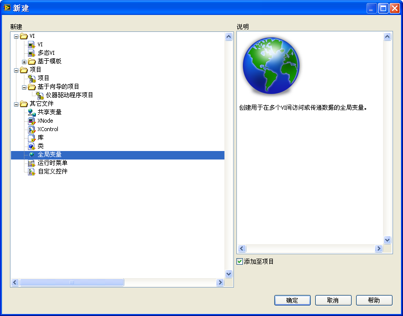
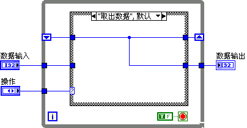
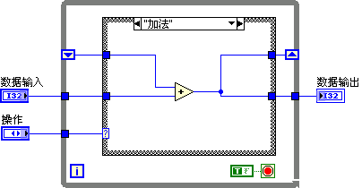
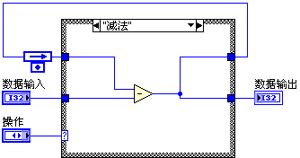
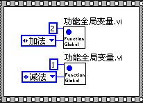

# 全局变量

全局变量与局部变量类似，是一种可以让数据随时流入流出其间的对象。它与局部变量的区别在于，局部变量只能在其对应控件所在的VI中使用，而全局变量可以在一个程序中的任意VI上使用。使用全局变量时，数据被保存在某一固定的内存空间内，不随数据线流动，在需要读写数据的地方，直接对全局变量进行操作即可。

在LabVIEW中应当尽量避免使用全局变量和局部变量。全局变量看似方便，但带来的问题也很多。最主要的是它破坏了数据流顺序的逻辑关系，导致程序可读性和可维护性下降。

偶尔也会存在不得不使用全局变量或者使用它利大于弊的情况。例如，在需要实现子VI间参数传引用的机制时；在不破坏程序可读性的前提下，需要避免一些不必要的数据连线，从而美化程序框图时。

## 全局变量

本节所讲述的全局变量是特指图标像地球的那个"全局变量"VI（图
4.25），全局变量VI中可以包含多个全局变量数据（控件）。把这个全局变量VI拖拽到某一VI的程序框图上，就会在该VI的程序框图上出现一个全局变量实例（图
4.26中内含小地球图标的举行方框）。通过这个实例可以读写全局变量中的数据。有时候，在不会引起误解的情况下，可以把全局变量VI、全局变量数据、全局变量实例，都简称为全局变量。

在LabVIEW的新建对话框中选择"全局变量"即可创建出一个空白的全局变量VI（图
4.24）。在一个VI的程序框图上，选择函数选板的"编程-\>结构-\>全局变量"，就可创建出一个空白的全局变量实例，双击这个全局变量实例，可以打开一个空白的全局变量VI。

图 .24创建全局变量

全局变量VI是一种特殊的VI，它只有前面板，没有程序框图。在这个VI的前面板上可以添加控件，每个控件表示一个全局变量数据。由于一个全局变量VI可以存放多个全局变量数据，在编程时，可将相关度较大的全局变量数据放在一个全局变量VI中，以便于管理。若这个全局变量VI上有多份全局变量数据，在这个全局变量VI对应的实例上的鼠标左键菜单，或右键菜单的"选择项"中，可以选择这个实例将要读写全局变量中的哪个数据（图
4.25）。

图 .25使用全局变量实例

不论控件是控制型的还是显示型的，它所表示的全局变量既可读，也可写。在VI上任何需要使用这个全局变量数据的地方，把它所在的全局变量VI拖到程序框图上即可生成全局变量实例，然后对其进行读写。

全局变量VI有其局限性。首先是前面已经提到过的，全局变量破坏了数据流顺序的逻辑关系，而且不利于代码的可读性。使用全局变量，难以判断数据是否在其它地方被改动过，而且无法控制其改动。换言之，代码上的全局变量，不能直观地反映出它的数据来源。

其次，VI每次读取全局变量数据，LabVIEW都要为读到的数据复制一个新的副本，这毫无疑问影响了VI的效率。

第三，全局变量的不合理使用可能导致竞争状态。竞争状态是指在多个线程中，由于同时访问同一资源所引发的程序结果的不确定情况。如图
4.26中的VI，假设全局变量Data的值原本为0，运行完下面这个加2减1的代码后，Data中的值是几呢？答案可能是1，也有可能是2，还可能是-1，这完全取决于程序的执行顺序。而在这种有并行代码的情况下，执行顺序是不确定的。

图 .26处于竞争状态的全局变量

图
4.26中的代码分为上下两个部分，两部分之间没有数据线相连。按照我们前面所介绍的LabVIEW的运行机制，这两部分的代码应当同时在不同的线程内运行。这里需要更确切地解释一下：所谓同时运行是一个宏观的说法，在宏观的时间范围内，计算机可以同时执行两个任务。但是，从微观的角度来看却并非如此。比如，对于只用一个CPU的计算机来说，这个CPU在任何时候只能执行一个任务。不过它可以在某几个纳秒之内，只执行任务A，而下几个纳秒再去做另一任务B，下几个纳秒再回来执行任务A。CPU就这样在两个任务之间快速地来回切换。虽然，在微观上看，某一特定的时刻只执行一个任务，但是在宏观上看，这两个任务是同时进行的。

图
4.26中的程序，从微观的时间来考虑，每一时刻也只执行上半部分或下半部分的一个任务。由于程序并没有指定它们的先后次序，程序先执行哪一个任务是随机的。若程序先执行完上半部分的全部代码，再执行下半部分代码，则Data最终的值是1。若程序先执行上半部分的读全局变量，再加2；然后做下半部分的读全局变量，再减1；接着执行上半部分的写全局变量；最后执行下半部分的写全局变量。Data最终的值是-1。所以，这个程序的运行结果是不确定的，也就是说，出现了竞争状态。

## 共享变量

共享变量与全局变量相比，其作用域更广。它不但可以在不同的VI之间传递数据，还可以在不同的程序，甚至不同的计算机以及硬件设备间传递数据。在实际应用中，共享变量主要用于网络上不同VI的数据共享，或读写其它硬件设备上的数据。

共享变量的创建方法与全局变量相同，可以从模板中创建，也可以在项目浏览器的右键菜单中选择"新建-\>变量"，创建出一个共享变量。共享变量不是一个单独的VI，它是LV库的一部分，它只能创建在某个LV库（lvlib文件）下。

创建共享变量时，首先会弹出共享变量属性对话框，设置共享变量的名称、类型等属性（图
4.27）。共享变量有三种：单进程、网络发布、以及时间触发的共享变量。时间触发的共享变量应用于LabVIEW实时系统模块，安装了LabVIEW实时模块后才可以使用。

图 .27共享变量属性对话框

单进程和网络发布的共享变量仅作用域不同，使用方法是相同的。这里着重介绍一下单进程共享变量。

单进程共享变量，顾名思义就是作用域为单个应用程序进程的共享变量。它与全局变量的性质是完全相同的。唯一的不同点是单进程共享变量都带有错误输入/输出端，我们可以利用错误处理连线来控制单进程共享变量的执行顺序。例如图
4.28中的VI，假设共享变量Data的值原本为0，运行完下面这个加2减1的代码后，Data的值必然为1。

图 .28共享变量的应用

但是，这并不意味着单进程共享变量可以防止出现竞争状态。设想图
4.28中的VI只是程序中的一个子VI，在其运行的同时，Data还是可以在其它子VI中被访问修改的，依然可能处于竞争状态。

## 功能全局变量

利用循环结构中移位寄存器的特性，也可以保存全局数据。使用这种方式保存全局数据的子VI叫做功能全局变量。功能全局变量的基本结构模式都是类似的：主体是一个循环条件结构；有一个用于选择某种操作的输入控件；一对或多对分别用于输入和输出数据的控件。它能实现相关的访问这些数据的方法（也称作对数据的操作）。

功能全局变量中使用循环结构只是为了利用它的移位寄存器。移位寄存器并不连接任何初始化数据。每次执行这个VI时，它能够读出上一次执行时存入移位寄存器的数据，并把这一次VI执行结束时的数据存入移位寄存器。这样，就可以在程序的全程保存、处理或使用移位寄存器中的数据了。功能全局变量VI绝对不可以被设置为可重入，否则在程序不同之处得到的移位寄存器中的数据就不是同一份了。

功能全局变量的程序框图如图 4.29所示。

图 .29带有加减法功能的功能全局变量

在这个例子中，程序使用了一个未初始化的移位寄存器保存全局数据；通过"操作"输入参数来选择需要执行的四种操作；"数据输入/输出"分别用于给不同的操作提供或返回数据。

功能全局变量与前面提到的两种全局变量最大的区别在于：其它的全局变量只能读写数据；功能全局变量除了读写数据之外，还可以按程序要求实现对数据的其它操作。并且，所有对全局数据的操作都必须通过全局变量提供的方法来完成。

这个例子中的全局变量提供了4个相关的操作："取出数据"用于返回功能全局变量保存的数据；"清零"用于把功能全局变量保存的数据清零；"加法"用于给保存的数据再加上输入的数值；"减法"是在保存的数据上减去输入的数值（图
4.30）。

图 .30功能全局变量其它几个操作分支

对于仅运行一次的循环，可以使用反馈节点来代替循环结构和它的移位寄存器。反馈节点可以减少程序框图上的对象数量，让程序框图看上去更干净一点。图
4.31就是使用反馈节点编写出的一个完全等效于上例的功能全局变量。

图 .31等效的加减法功能全局变量

与前两种全局变量相比，功能全局变量有两个主要的优点。

首先，功能全局变量可以防止竞争状态出现。因为功能全局变量的VI是不可重入的，所以把它作为子VI时，绝对不可能出现两个功能全局变量VI同时执行的情况。因为全局变量的所有操作都是在这个VI内部完成的，也就意味着，所有对数据的操作都绝对不会被其它操作所干扰。

图
4.32中的VI，执行结束必然导致全局数据增加1。即便此时还有其它线程的子VI在同时运行，其程序运行结果也必然是一个确定值。但是，需要注意的是，解决了竞争状态不等于全局变量的使用顺序可以乱写，错误的顺序仍然可能导致错误的运行结果。比如，在本例中，加减法的顺序是可以随意放置的，它们不影响程序最终的结果，但清零操作的顺序不能混乱。先做加法，还是先清零肯定会导致不同的程序运行结果。

设计功能全局变量时还可以加入出错处理的连线，以在使用时便于确定全局变量的调用顺序。

图 .32使用功能全局变量

功能全局变量的另一优点是，功能全局变量中的全局数据只能被全局变量本身所使用。调用这个全局变量的程序只能使用全局变量提供的方法对数据进行操作。这样，就可以通过提供某些特定的数据操作方法，对访问模块中的数据加以限制，提高数据的安全性。

模块的编写者和使用这个模块编写应用程序的很可能不是同一个人。因此，模块开发者对模块的使用进行必要的限制，防止模块使用者对模块数据的滥用，是非常必要的。

上文所使用的例子中，故意没有提供"写入数据"的方法。因此功能全局变量的使用者在编写程序时是无法实现直接修改全局变量的值的，只能对这个数据清零或加减。比如，用户无法直接把全局变量中的数据设置为3，它只能先调用"清零"方法，再调用"加法"把数值加到3。

甚至，在某些情况下也可以不提供"取出数据"操作，让这个全局数据与模块使用者完全屏蔽。模块使用者只能利用全局变量提供的方法查看数据处理后的结果。这样全局数据被很好地隔离开来，避免了被不当改动的风险。

另外，如果全局数据的数据量比较大（如一个长数组），那么可以利用功能全局变量的这一特点，每次只把所需的全局数据中的某一部分写入或读出全局变量。这样就避免了大块数据的拷贝，提高了程序效率。

鉴于上述两个忧点，在需要使用全局变量的时候应当首先考虑使用功能全局变量。

功能全局变量相对于普通全局变量最主要的缺点就是需要额外的编写一段代码，创建起来稍费事些。

## 基于功能全局变量的程序功能模块

在LabVIEW
8.0之前的版本中，由于没有其它更好的对数据进行封装以及设置访问权限的方法，功能全局变量还常常被用来实现数据与方法的封装，以及限制数据访问权限等。功能全局变量的应用远远超出了全局变量这一范畴，它和状态机一起成了软件工程在LabVIEW中应用的两大法宝，一度受到很多LabVIEW程序员的极力推崇，以至于相当一部分LabVIEW程序模块都采用了功能全局变量模式。

目前，LabVIEW中仍有很多功能模块是采用这种模式编写的。如果你的LabVIEW是8.6或之前的版本，可以打开"\[LabVIEW\]\\vi.lib\\Utility\\config.llb\\Config
Data
Registry.vi"看一下。这个VI是"配置文件VI"的一个底层模块。函数选板"编程-\>文件I/O-\>配置文件VI"中都是为INI文件（配置文件）提供接口的VI。但是，打开这些VI的程序框图，就会发现，它们只是做了一些接口的包装工作。这些VI最终都调用Config
Data Registry.vi完成相应的功能。而Config Data
Registry.vi则采用功能全局变量模式，提供了对INI文件添加删除键值等的操作（图
4.33）。

图 .33使用功能全局变量模式编写的程序功能模块

功能全局变量虽然有很多优点，但如果要把它作为更大的功能模块来使用，也同样存在很多不足。由于它和状态机都是基于循环条件结构的，因此，前文提到的状态机的缺点，功能全局变量也同样存在。

在使用功能全局变量模式编写的功能模块中，几乎所有的功能和数据接口都是在这个功能全局变量VI中完成的。如果模块的功能较为复杂，这个VI的连线也就十分复杂。比如图
4.33中这个功能全局变量就非常复杂了，想弄清楚它的工作原理恐怕还得仔细阅读和研究一段时间。

模块功能复杂，往往接口的数据也多。把众多的接口数据放在一个VI上提供给用户，用户很可能被这个VI上的数据搞得晕头转向，不知该如何使用。正因如此，LabVIEW并没有直接把Config
Data
Registry.vi暴露给用户去直接使用，而是对它的结构再封装一层，每个VI只负责读或写某一两个给用户使用的接口数据。这样就大大方便了用户的使用。

把所有的结构数据都放置在一个VI上也会给维护带来问题。比如，模块需要增加或改动某个功能，可能又得给它添加新的参数，甚至不得不改变VI连线板的模式。

现在只要使用LabVIEW
8.2以上的版本开发新的功能模块，就完全没有必要继续使用功能全局变量这种模式了。LabVIEW从8.2版本起，开始支持面向对象的编程。面向对象的概念既包含了功能全局变量的优点，又克服了其缺点。我们会在后续的章节详细介绍面向对象的编程方法。