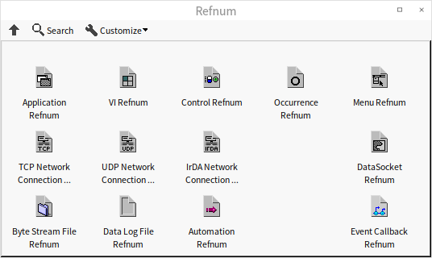
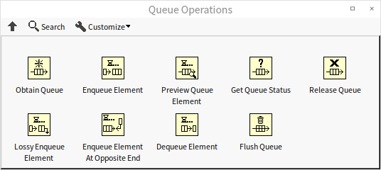
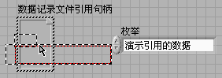
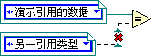
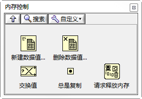
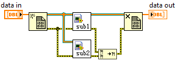
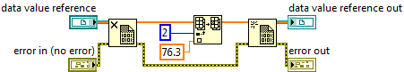

# 传引用

传值是符合数据流驱动程序的传参方式，在LabVIEW中应该尽量使用这种方式。但是传引用在某些情况下是不可避免的。假如程序要在不同的线程中对同一数据进行操作，就不得不用到传引用。

在C++中，引用是用一个4或8字节的数据来表示一块数据的地址，数据本身则被保存在某个可以被多个资源同时访问到的地方。在LabVIEW中，传引用的形式更加丰富。

## LabVIEW自带的传引用数据类型

在C语言及其它常用的文本编程语言中，一个数据传入子函数的时候，可以被指定是传值还是传引用。但LabVIEW不同，LabVIEW不能指定一个数据是传值还是传引用。但是LabVIEW的数据类型被区分为传值型的和传引用型的。LabVIEW中大部分数据类型是值传递的，而另有一部分数据类型专门用于传引用。

控件选板的"引用句柄"栏（图
4.56）上的控件就都是传引用数据类型的控件。在程序框图上，用深绿色细线表示这类传引用的数据类型。



图 .56引用句柄函数选板

除了控件选板上的各种"引用句柄"外，LabVIEW还有其它一些数据类型，尽管其数据线的颜色不同，但其实也属于传引用的数据类型。其中包括了硬件设备的句柄（如VISA资源名称、IVI逻辑名等）、通知、事件、队列等等。

LabVIEW中还有相当多的引用数据类型，它们的控件并没有列在控件选板上。比如我们在第3.7.6节中介绍了为窗格和布尔控件等对象创建引用的方法，它们的引用控件是无法在控件选板中找到的。只能通过先为某个对象创建引用，再从引用的接线端创建控件，通过这样一种间接的方法来得到这些引用类型的控件。

引用数据类型本身是一个4字节的数据，用这个4字节的数据再指向一个其它的对象，程序中真正需要使用的是它所指向的对象。各种不同引用类型的区别在于它们所指向的对象种类是不同的。比如有的引用指向一个文件，有的指向仪器设备，有的指向某个VI或控件。

在使用了这些传引用数据类型的程序框图上，数据线上流动的是引用类型本身的4字节数据，而他们所指向的对象是不动的。如果引用所指向的是一大块数据，那么，在节点间传递4字节的效率当然比传递这一大块数据要高很多。在数据线分叉的地方，LabVIEW需要把引用本身的4字节数据生成一个副本，它所指向的对象并不需要被复制，但程序同样可以在不同的代码分支中同时访问这一大块数据，而效率是大大提高了。

## 全局变量

除了LabVIEW自带的传引用数据类型，能够传递特定数据的引用之外，我们也可以通过其它手段，把任意一块数据以引用的方式传递。

全局变量（和局部变量）是一种最简便的传引用的方法。全局变量的数据实际上是被保存在某一固定的内存空间的，在不同的VI或线程中，都可以通过全局变量访问数据。

在使用全局变量时，直接把表示全局变量的VI或节点放在程序中就可以访问它的数据了。这种方式尽管有优点，但缺点更明显。我们在阅读LabVIEW程序的时候，数据线是非常重要的线索。它为我们指明了程序执行的顺序，数据传递和加工的过程。失去数据线这一重要线索，就不容易搞清楚某个数据是从哪里来的，何时被改动，因而大大降低了程序的可读性和可维护性。

所以，很多时候，数据线是非常必要的。在传引用时，还是希望能够有一根数据线用来传递这个引用。

## 队列

我们在第4.3.3节中曾经简要的介绍过队列这种数据结构。表示队列的数据类型，与LabVIEW中大多数常见的数据类型都不一样，它在传递数据时，采用了传引用的方式。

LabVIEW中有一套处理队列中数据的函数，在"编程-\>队列操作"函数选板中（图
4.57）。



图 .57队列操作函数选板

LabVIEW提供的队列操作函数允许数据双向入队，因此，需要使用"栈"数据结构时，也可以使用这套函数。

在LabVIEW中，队列除了用于存储数据，提供数据先进先出之类的操作外，还有一个非常重要的用途：在不同的线程间交换数据。LabVIEW测试程序常用的模式之一是，程序有多个线程同时运行，一个线程用于采集数据，另一线程处理及显示这些数据。这就需要LabVIEW提供一个便捷的方法可以把采集线程得到的数据存在某处，再由显示线程把数据从保存它的地方读出。也就是说，把一组数据从一个应用程序传送到另一个与之并行运行的应用程序中。队列就是应此需求出现的。队列是传引用的，这样才能在不同的线程内对同一个队列进行操作。

我们可以借助队列，让自己定义的数据类型也按照传引用的方式传递。其思路是，创建一个新的，最多只允许放置一个元素的队列，把被引用的数据作为这个队列的元素。平时在VI间传递参数时，传递的是这个队列，需要时，再把数据从队列中取出使用。

图
4.58是初始化一个这样的传引用数据的代码。被引用的数据类型是一个簇，它由三个元素组成。最后生成的"data
out"，它本是指向队列的引用，但是由于这个队列中存放的是我们自己定义的数据，所以"data
out"也可被用作是指向我们定义的簇数据的引用。


图 .58创建一个传引用的数据

传引用通常用于在不同线程里访问同一份数据，所以在访问数据时要防止出现竞争状态。也就是说，某一线程正在访问被引用的数据时，其它线程不应同时访问这个数据，而是应该等待，直到第一个线程访问数据结束后，再来访问这个数据。

熟悉C语言的读者可能会马上想到临界区、信号量等防止竞争状态的方法。但实际上在这里，我们可以利用队列的一些特性，非常简单地解决竞争状态问题。思路如下：

需要访问被引用数据时（假设我们用一个名为"甲"的VI来访问和处理被引用数据），程序首先应当调用"元素出队列"函数把队列中唯一的元素取出。在完成读写数据的工作后，再让新的数据重新入队。

这样一来，程序执行到VI甲时，队列立即被清空。其它线程内若有采用相同机制的VI（假设名为"乙"）准备同时处理这个数据时，它已经无法从空队列中取出所需的数据。它只能暂时等待，直到VI甲完成所有工作，再次把数据放回队列，VI乙才能继续执行。这样就避免了同一数据被同时访问而引发的竞争状态。

图 4.59就是一段处理数据的示例代码：


图 .59清空队列、处理数据、重新入队

图 4.60是使用队列传引用方式的一个例子，其中"Set Name.vi"和"Set
Number.vi"使用的都是图
4.59所示的带有防止竞争状态的代码。虽然它们之间没有先后依赖关系，LabVIEW会同时运行它们，但在防竞争状态代码的保护下，它们不会同时访问被引用的数据，只能依次设置被引用数据中的Name和Number元素。


图 .60使用按引用方式传递的数据

使用了传引用，就必须自己管理内存了。比如在我们这个例子中，程序为了传引用而创建了一个队列。在程序结束前，需要销毁这个队列，以避免可能出现的内存泄漏。

## 数据记录文件引用句柄

使用队列是一个非常高效的传引用方式，而且可读性也不错。但它始终是一种非常规的解决方案。队列的控件和数据线始终是一个"队列"，不了解队列这一用法的编程者读到上例中的代码会感到迷惑。若能使用LabVIEW中专门用于传引用的深绿色细线来表示传引用，程序的可读性会更好。

"引用句柄"控件选板中的"数据记录文件引用句柄"常常被用于表示用户自定义的引用数据类型。把一个新的"数据记录文件引用句柄"控件放置在VI的前面板上，它的外观是一个空的矩形方框；再把其它不同类型的控件放置到这个矩形方框之内，它就会转化成为一种特殊的引用数据类型。

用于用户自定义的引用数据类型时，通常是把一个枚举类型的控件放入"数据记录文件引用句柄"控件的方框内（图
4.61），组成新的引用数据类型控件（图
4.62）。其中的枚举类型只有一个数据项，用于显示一些相关的提示文字。之所以采用枚举类型，一是因为它可以显示提示文字，二是LabVIEW会把数据项中文字不同的枚举类型当作不同的数据类型。



图 .61把一个枚举类型控件拖入数据记录文件引用句柄控件的方框内


图 .62生成新的引用类型控件



图 .63不能把不同类型的引用数据相互赋值或比较

数据记录文件引用句柄控件方框内的枚举类型不同，其表示的引用数据类型也不同。把每一种不同的用户自定义引用数据定义为一个特殊的类型，可以提高程序的安全性（图
4.63）。

比如，在某个应用程序中，有两个字符串数组分别保存实验员姓名和仪器设备编号。程序要求使用传引用的方式访问这两组数据。在这个程序中，它们是两组完全不同的数据，有各自的一组VI来处理这些数据，不允许出现VI与数据交叉混用。

如果使用相同引用数据类型来表示这两组数据，把实验员姓名的数据传递给处理设备编号的子VI，程序不会立刻检验到错误，仍然允许运行，但在运行时则可能出错。若分别使用不同的引用数据类型，当把实验员姓名的数据传递给处理设备编号的子VI时，数据线会断开，程序不允许运行，编程人员会立刻意识到错误。

使用自定义的数据记录文件引用句柄表示引用数据类型，比使用队列表示引用数据类型多出了一个步骤：为被引用数据生成的队列需要通过强制类型转换函数，转换成自定义的引用句柄数据类型，再传出子VI。这样，在应用程序中，子VI间就是通过引用句柄的深绿色线来传递数据了。子VI在得到这个引用后，同样需要把它转换为队列，再进行使用（图
4.64）。


图 .64使用自定义的数据记录文件引用句柄表示引用数据类型

## 借助C语言

借助C语言比借助队列实现传引用要麻烦一些，编写程序时尽量不要采用这种方法。但是，如果应用程序中，已经有部分模块是用C语言编写的，并且所传递的数据在C代码中和在LabVIEW代码中都会使用到，也可以考虑把数据存放在C语言实现的模块中。

这种做法的思路是，数据存放在C语言开辟的内存空间里，C语言把数据的内存地址传给LabVIEW。平时在VI间传递参数时，传递的是这个地址的数值；需要时，再把数据从内存中读到LabVIEW里使用。

下列代码是一个在C++语言中开辟内存空间，保存LabVIEW中数据的一个范例函数：

```cpp
int stdcall CreateBuffer ( // 为数据开辟空间并传出指针
  const char data[],       // 数据内容
  int size,                // 数据大小
  char* bufPointer         // 用于返回新开辟空间的指针
) {
  char buffer = new char[size+4];  // 开辟一块内存空间保存数据和数据的大小信息
  ((int)buffer) = size;            // 新开辟空间的头4字节，保存数据的大小信息
  memcpy (buffer+4, data, size);   // 其余部分用于保存数据
  *bufPointer = buffer;            // 把新开辟内存空间传给bufPointer参数
  return 0;                        // 函数返回
}

int stdcall GetBufferData (   // 从数据的地址得到数据内容
  char bufPointer,            // 数据地址
  char data                   // 用于返回数据内容
) {
  int size = ((int)bufPointer);        // 得到数据的大小
  memcpy (data, bufPointer+4, size);   // 把数据内容拷贝给调用函数提供的地址
  return 0;                            // 函数返回
}
```

在LabVIEW语言中，需要为某段被引用数据创建一个引用时，就利用上述函数，把这段数据保存到C语言中开辟的内存空间里。LabVIEW代码中传递的只是这个数据空间的地址值。后续程序若需要用到被引用数据，可以通过地址值得到数据的内容。

用一个U32的数值表示引用，或者用队列表示引用，同样都会有数据不安全的问题。因此，在程序中，同样也可以把这个地址值，强制转换为一个自定义的引用句柄，用自定义的引用句柄来表示这一数据引用（图
4.65）。


图 .65使用借助C语言创建的数据引用


## 数据引用节点

从2009版本起，LabVIEW新增添了构建数据传引用的节点，大大简化了传引用的程序代码。

新添的有关传引用的两个节点位于函数选板
"编程-\>应用程序控制-\>内存控制"中，分别是
"新数据值引用"和"删除数据值引用"。"新数据值引用"用于创建一个数据的引用，"删除数据值引用"可以从引用中取回原来的数据。

\
图4.66"内存控制"函数选板

在4.8.3
队列一节中已经讲过，引用主要应用于多线程程序中。如果两个线程同时对同一份数据进行修改，则必须使用传引用的机制。否则，若使用值传递的方式，数据在数据线分叉的地方，就会变成独立的两份，之后在两个线程内分别修改的是两份完全独立的数据，而并非是对同一份数据进行的修改。除了使用队列可以解决竞争外，新增添的数据引用节点更是一个简单的途径。

比如图4.67所示程序，程序输入了一个数组，然后需要在两个并行的子VI中同时对这个数组中的数据进行修改。每个子VI可能修改了数组不同的元素，程序运行结束后输出的数组应当把这两个子VI中的修改都包含进来。因此，程序一开始需要为数组数据生成一个引用，然后把引用分别传递到两个子VI中去。两个子VI都运行结束后，再从引用中取回数据。

\
图4.67 "新数据值引用"与"删除数据值引用"节点

LabVIEW中绝大多数的函数和子VI都是值传递的。当它们需要使用到被引用的数据时，必须把引用转为数据，处理过的数据可能还需要再转为引用（如图4.68所示的程序）。在此过程中，往往又会产生数据拷贝，如果数据量很大，则程序运行效率就会比较差。为此，LabVIEW
新添了一个"元素同址操作结构"（在函数选板"编程-\>结构"上），用来处理从引用中取出、放回数据的过程。配合使用"元素同址操作结构"后，LabVIEW会尽量使用数组原地址，而不再复制从引用中取出的数据，这样就充分利用了传引用的效率。比如图4.69所示的程序，与图4.68所示的程序功能是完全相同的，但LabVIEW会对后面一幅图中的程序进行优化，继而提高了效率。（本书会在第11章更详细得介绍程序效率）

\
图4.68 数据与引用相互转换

 

图4.69 使用"元素同址操作结构"的程序框图

## 传引用引起的死锁

上一节提到，LabVIEW中的引用常常和"元素同址操作结构"配合使用。为了保证多线程安全，"元素同址操作结构"对一个引用的数据进行处理时，会锁住引用指向的数据。若其它线程需对同一数据进行操作，必须等到"元素同址操作结构"中所有代码执行完毕方可。这样就避免了多线程读写同一内存数据所产生的竞争问题。

举例来说，图4.70中的程序的执行时间是1秒，而图4.71中的程序的执行时间则是2秒。因为图4.71所示程序中的两个
"元素同址操作结构"需要对同一数据进行处理，它们不能同时执行。

\
图4.70 两个不同数据的引用可以同时被处理

\
图4.71 同一数据的引用不能同时被处理

有了"锁住"这个操作，就有不小心造成死锁的可能。比如对于同一数据的引用，千万不能嵌套使用"元素同址操作结构"，否则就会死锁。例如图4.72中的示例：程序运行至内层的
"元素同址操作结构"，就会停在这里等外层
"元素同址操作结构"运行结束，释放它锁住的数据；而对于外层
"元素同址操作结构"来说，要等待它内部的全部代码运行结束，它才结束。因而它们相互等待，造成了死锁。

\
图4.72 嵌套使用"元素同址操作结构"造成死锁
