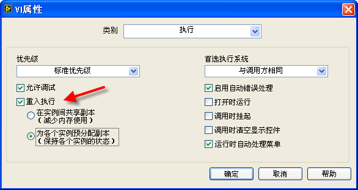
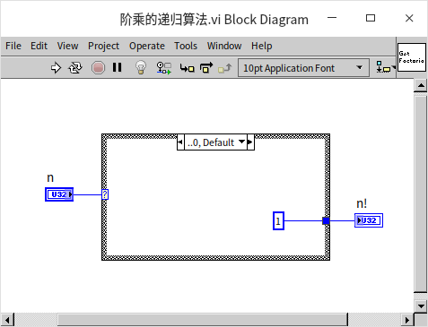
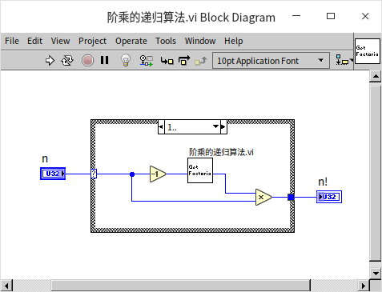
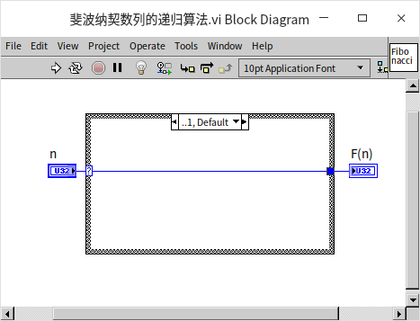
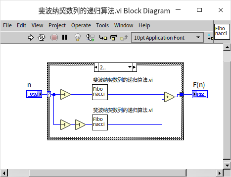
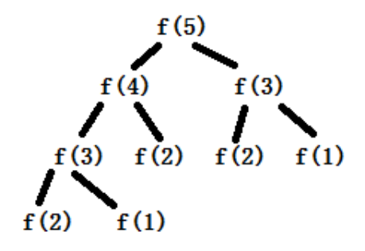
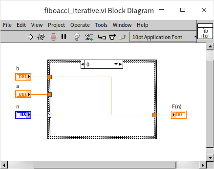
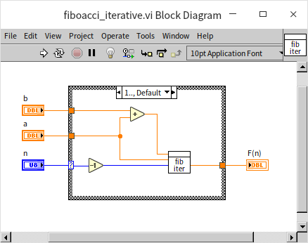
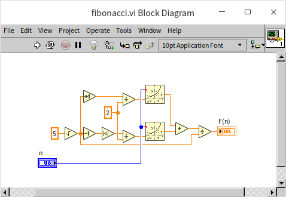

# 可重入 VI 和递归算法

重入执行是子 VI 的一个属性。默认情况下，VI 是不会被设置这个属性的；需要设置它时，可以在 VI 属性对话框中，选中“重入执行”选项。设置了这一属性的 VI，称为可重入 VI。

如果某个子 VI 被设置为可重入，那么在程序的不同地方调用这个子 VI 时，它会在内存中为每一处的调用各生成一个新的 VI 实例。即，尽管程序在不同地方调用的这个子 VI 的内容都相同，但是这些子 VI 在内存中却是相互独立的。如果是非可重入的子 VI，在内存中只能有一份实例，所有的调用者都访问这个实例。

被设置为重入执行后，还有两个选项：“为各个实例预分配副本”表示每处调用生成的实例 VI 都拥有各自独立的数据区，它们之间的数据互不干扰。本书后续章节提到的可重入 VI，如无特殊说明，都是指这种可重入 VI。“在实例间共享副本”是 LabVIEW 8.5 之后出现的选项，它是指这些实例 VI 使用同一块数据区。

## 同一 VI 的并行运行

下图是一个简单的 VI，它的程序框图有上下两部分，都调用了同一个子 VI。上下两部分的代码之间没有数据线相连。LabVIEW 是自动多线程的语言，图中的两个子 VI 是否会同时运行呢？

如果程序中调用的是两个毫无关联的不同的子 VI，LabVIEW 通常会同时在不同的线程执行它们；但对于两处调用相同的子 VI，那就得看子 VI 是如何设置的了。如果子 VI “简单运算.vi”是非可重入的，那么它们一定不会同时运行。LabVIEW 一定要等一个执行完，才会执行另一个。

非可重入的子 VI 在内存中只有一个实例，它的代码和数据都只有一份。在不同的地方调用这个子 VI 时，它运行所需的数据内容可能都是不同的。如果多个在不同地方被调用的同一个子 VI 可以同时运行，子 VI 内部的运行状态和数据就可能就会发生混乱。所以 LabVIEW 要禁止这种情况的发生。

VI 的这一特性在有些场合表现出了非常好的优点。比如，一个子 VI，是专门用来读写文件“foo.txt”的。应用程序中可能有多处都调用了这个子 VI 来读写“foo.txt”，如果允许多个线程的程序同时读写它，就很容易造成其内容的混乱。比如一个线程刚刚写入数据 22，另一个线程就写入新的数据 33 覆盖了原来的数据，第一个线程写入数据后立刻读出，却发现读回来的数据与写入的完全不同。同一子 VI 不可在不同线程同时运行的特性恰好保护了“foo.txt”，使它不被不同线程同时读写。

但在某些场合，这一特性又显得非常糟糕。比如，有一个用于读写所有文件的子 VI。不同的文件应当是可以同时被访问的，但这个子 VI 却不允许应用程序同时读写不同的文件。需要同时访问几个文件时，也必须一个一个的访问，暂时不能访问文件的那个线程只好等待着。这样，就造成了程序效率的低下。

在这种场合，只要把子 VI 设置为可重入，就可以在不同线程中同时运行了：一个线程正在运行这个子 VI 时，另一个线程也可以调用它。在 LabVIEW 中，形象地来看，就是在程序框图的某处，数据流入了一个子 VI；在这个框图另外一处，数据也可以片刻不停地同时流入这个子 VI。因此，叫做“可重入”。前面已经讲过，应用程序每处调用可重入的子 VI 时，都生成了一个独立的实例。这就相当于，在应用程序中各处调用的都是不同的子 VI，只不过这些子 VI 内部的代码相同而已。既然是不同的子 VI，当然也就可以在不同的线程中同时运行。

下图是一个延时子 VI 的程序框图，程序执行到这个子 VI 时，如果没有错误，会暂停 1 秒钟，再返回：

下图是一个调用了这个延时子 VI 的应用程序，它并行的调用了这个延时子 VI 两次，那么这个应用程序总的运行时间是多少呢？

如果延时子 VI 是非可重入的，则由于两处调用只能先后分别运行，程序总运行时间为 2 秒。若延时子 VI 是可重入的，则两处调用可以同时运行，程序总运行时间为 1 秒。

## 可重入 VI 的副本

若可重入 VI 的多个实例共用一份副本，就意味着它们共用同一数据区。不同实例运行时，可能会把不同数据写入这个唯一的数据空间中，这样就造成了数据的混乱。如果需要可重入 VI 不同实例会同时运行，并且它们运行时会使用不同的数据，那么就一定要把这个子 VI 设置为 "为各个实例预分配副本"。

下图是一个简单的子 VI，这个 VI 的功能是每执行一次，输出的数据加一：

这个程序利用了反馈节点。每次运行这个 VI 时，反馈节点首先输出上次 VI 运行后传递给它的数据。VI 在此基础上加一，再返回给反馈节点，以便下次调用时使用。反馈节点下方的 0 是它的初始值，主程序启动后，首次调用这个子 VI 时，反馈节点会给出初始值。

下图是一个调用了“运行次数”子 VI 的应用程序。执行这个程序后，输出“次数 1”和“次数 2”分别是几？

运行结果同样与“运行次数”子 VI 的设置有关。主程序中两个循环执行次数一为 10，一为 20。它们之间没有数据连线，所以可以被同时执行。但哪个循环会先执行完是不确定的。

如果“运行次数”子 VI 是非可重入的，则每次运行完主程序“次数 1”和“次数 2”的值是不确定的，但它们之间必然有一个值为 30。虽然循环运行次序不能确定，但是能够确定，运行次数子 VI 总共被调用了 30 次，所以它最后一次被调用后，输出的值一定是 30。只不过，哪个循环中的 VI 是最后一次被调用的并不确定。

如果运行次数子 VI 是可重入的，并且被设置为“为各个实例预分配副本”，那么主程序的执行结果就会是确定的。“次数 1”的值一定为 10，“次数 2”的值一定为 20。由于子 VI 是可重入的，所以程序中的两处调用行为相当于调用两个不同的子 VI。他们分别运行，不论运行次序如何，左侧的子 VI 被调用了 10 次，而右侧的子 VI 被调用了 20 次。

如果运行次数子 VI 是可重入的，并且被设置为“在实例间共享副本”。那么主程序的执行结果又是不确定的了：“次数 1”和“次数 2”的值可能是小于 30 的任何一个数值。子 VI 可重入，意味着程序中的两处子 VI 调用是可以同时运行的。但是，它们共用一个副本，这就造成了数据的混乱。假如，左侧子 VI 正在运行，内部记录运行次数的数据是 8，而这时右侧子 VI 也同时运行起来，并往内部记录运行次数的数据区写入一个数值 3。这样，左侧子 VI 再读出该数据是就是一个错误数值了。

“在实例间共享副本”虽然会引起数据的混乱，但是它可以大大节约程序的内存。每生成一个副本，就会多消耗一份内存空间。因此，在确保不会发生数据混乱的情况下可以把可重入子 VI 设置为“在实例间共享副本”。对于初学者来说，如果不确定程序中是否有数据混乱的可能性，最好不要使用这一设置。只有一种情况除外，就是在实现递归算法时，参与递归的子 VI 必须被设置为“在实例间共享副本”。

## 递归算法

### 算法
递归是指一个 VI 直接调用自身，或者间接调用自身，比如：VI_1 调用 VI_2，VI_2 又调用 VI_1。如果大家还记得学习数学的时候有个归纳法，递归可以被看作是把归纳法写成程序。递归的策略是把一个大的复杂的问题转换为一个小的和原问题相似的问题，再进一步把问题拆成更小的问题，最终解决整个问题。理论上，任何需要使用递归调用的地方，都可以用循环结构来代替。但是在某些情况下，使用递归调用的确可以大大简化程序代码的复杂度，有助于缩短编程时间、提高程序可读性。所以，学会如何实现递归还是很有用的。

### 计算阶乘
下面看一个最简单的例子：计算阶乘。计算某个正整数的阶乘就是用那个数去乘所有比它小的正整数。比如 3 的阶乘写作 `3! = 3*2*1`；类似的 `6! = 6*5*4*3*2*1`。如果用循环来计算 n 的阶乘，就是把所有小于 n 的正整数乘起来就行了：

但是我们还可以换一种方法来考虑如何计算阶乘：我们不是直接从原始的数据开始计算，而是用归纳的方法，一步一步的来简化问题，比如 6 的阶乘，它可以通过先计算 5 的阶乘，再把结果乘以 6。用公式来描述就是 `0! = 1, n! = n * (n-1)!   |（n≧1）`，或者写成函数的形式为：`F(0) = 1, F(n) = n * F(n-1)   |（n≧1）`。数学归纳法中一定要有一个基本情况，对于阶乘的问题，基本情况是 0，0 的阶乘等于 1，这是人为定义出来的。有的读者可能已经注意到了，用归纳法表示的阶乘与直接计算阶乘不是完全一模一样，归纳法把阶乘计算推广到了所有非负整数，而直接计算，只能计算正整数的阶乘。这算是归纳法的一个小优势吧。

下面我们把归纳法公式转换为程序，只要照着公式一模一样的写就可以了。建立一个新的 VI，把 VI 的可重入属性设置为“在实例间共享副本”（Shared clone reentrant execution）。首先处理基本情况，当输入为 0 时，输出为 1：

当输入大于等于 1 时，VI 调用自身，但是输入的值需要减 1；然后把子 VI 输出乘以输入值，输出结果就可以了：

### 计算斐波纳契数列

阶乘这个问题过于简单，还不能完全体现递归的优势。我们可以再考虑一个稍微更复杂一点的问题：斐波纳契数列。
这个问题是意大利人斐波那契在描述兔子繁殖的数量时用到的:
* 第一个月初有一对刚诞生的兔子
* 第二个月之后（第三个月初）它们可以生育
* 每月每对可生育的兔子会诞生下一对新兔子
* 兔子永不死去

每个月兔子的总数量用数学归纳法来描述就是：
* `F(0) = 0`
* `F(1) = 1`
* `F(n) = F(n-1) + F(n-2)   |（n≧2）`

这个问题的数学归纳法公式简洁明了，非常适合用递归算法来解决。首先，还先编写归纳法的基本情况，也就是递归的结束条件，当输入为 0 和 1 时，分别输出 0 和 1：

当输入 n 大于等于 2 时，VI 调用自身两次，一次输入 n-1，另一次输入 n-2；然后把两个子 VI 输出的结果相加，输出结果即可：

### 递归程序的一个效率问题

读者可以用一个不大于 20 的输入数据试验一下，看结果是否正确。但是千万不要尝试太大的输入数据，因为上面这个 VI，它的功能上虽然正确，效率上却存在巨大缺陷，当输入数据大于 20 的时候，它的运算会非常非常耗时。我们分析一下上图程序的运行过程，假如输入数值为 20，程序分为两支：
* 上面的分支去计算 19 的斐波纳契数，在其内部又需要分两支，一支计算 18 的斐波纳契数……；
* 下面的分支去计算 18 的斐波纳契数，可是 18 的斐波纳契数已经在上面那个分支里计算过了啊，现在又要重复计算一遍！

我们可以把上述的调用关系用一棵二叉树来表示：

这样的算法，输入值每增加 1，程序的计算量就要翻倍。也就是程序的运算量与输入数据的大小呈指数关系，[时间复杂度](pattern_algorithm#时间复杂度)： $O(2^n)$。这是编写递归程序时比较容易出现的一个效率问题：同样的计算，在不同的地方被运行了很多次。

下面我们讨论几条解决这个效率问题的思路。

#### 带缓存的递归

既然低效率是由于同样的计算被运行多次引起的，那么一个最直接简单的解决方案是：把每次运算的结果记录下来，如果之后再遇到同样的计算，就直接把记录的结果拿来用，不再重新计算了。具体的实现方法可以是：在程序里设置一段缓存，每次进入递归函数时先查看一下，需要计算的数据是不是已经有结果记录在缓存里了，如果有，那么直接从缓存中拿出之前记录的结果；如果缓存中没有想要的结果，再进行计算，然后把计算的结果记录在缓存里。因为程序在计算每一个值之前，都先到缓存里查一下，这就避免了重复计算。

缓存可以使用任何数据结构来构建。计算斐波纳契数列时需要针对从 0 开始的每一个整数进行计算，所以非常适合使用数组来做缓存。比如在预先开辟的一块数组，用索引表示每一步计算的输入值，用数组中的元素保存计算的结果。很多时候，递归算法的输入数据并不是连续的整数，一个更通用的缓存设计是使用[映射表（Map）](pattern_algorithm#映射表map)数据结构。在其它一些语言和而不同的应用环境中，我们可能还会看到很多类似的名词比如：关联数组、字典、散列表、查找树等，它们所指的都是一类接口相似的数据结构，在结构中保存的每条数据是由一个“键”和一个“值”组成的一对数据。使用者可以在结构中，使用“键”来快速查找到“值”。在使用映射表做缓存时，可以使用程序的输入数据作为“键”，程序的运行结果作为“值”。

下图是添加了缓存的计算斐波纳契数的程序框图：

它与不带缓存的基本递归算法是完全一致的。唯一的改变在于，在真正开始计算前，先调用“Look In Map”函数，查看要计算的数据是否已经在缓存中了。如果是，则直接返回从缓存中取回结果。如果缓存中没有，那么进行递归计算，但是在输出结果之前，先调用“Insert Into Map”函数把运算的结果插入到缓存里。

在效率改进之后，程序已经可以计算较大数值的斐波纳契数了，计算结果的数值可能会非常大，所以这里把计算结果的数据类型改为了双精度实数类型，用以显示更大的数值，尽管它应该还是一个整数。

#### 避免树形递归

另一个提高效率的思路是：保证每计算一个步，只递归调用本身一次，这样也可以避免重复计算。具体方法如下：在计算第 n 步的时候，我们需要把第 n-1 步和第 n-2 的结果加起来。但是第 n-2 的结果在计算第 n-1 结果时也用到了。就是说，每一个结果会被后面的两次计算用到，所以只要把这个结果作为函数的输出，传递给后面两次运算就好了。

使用这个思路来编写程序，程序有两个输入 a 和 b 分别记录前两次的运算结果。当输入 n 为 0 时，也就是递归的结束条件，把 b 的值返回：

当输入 n 大于等于 1 时，程序递归调用自身，同时把 n-1 作为子 VI 的 n 值； 把 a+b 作为子 VI 的 a 值； 把 a 作为子 VI 的 b 值：

使用这种递归算法，优点是提高了运算效率，缺点是它的算法并不是直接对应与斐波纳契数的数学归纳法的描述，理解起来不那么直观。程序员有时候要在程序的运行效率和可读性之间做取舍。

#### 斐波纳契数的计算公式

本节内容使用了斐波纳契数作为讲解递归算法的一个示例。但是，如果我们只考虑斐波纳契数本身的话，它并非必须使用递归来计算。比如，也可以使用循环进行计算：求 n 的斐波纳契数，可以从小到大计算，先算出 0 的斐波纳契数，再计算 1 的斐波纳契数，再计算 2 的斐波纳契数…… 循环迭代 n 次，得到 n 的斐波纳契数。但是，最高效的算法是使用斐波纳契数的公式直接计算：

### 编写递归程序的步骤

从以上的例子中可以总结出，编写递归算法可遵循以下的步骤：
1. 明确一个递归结束的条件，也就是归纳法的基本情况。如果递归调用的结束条件设置不当，可能会引起程序死循环甚至崩溃。
1. VI 中先放置一个条件结构，检查当前输入是否满足递归结束条件。如果满足返回基础条件设定的结果。
1. 输入值若不满足递归结束条件，则想办法把问题拆分成可以用更小或更简单的相似问题，然后使用更小或更简单的输入调用算法 VI 自身，得到子问题的结果。
1. 对子问题的结果进行归并处理，得到当前问题的结果。

在考虑是否使用递归算法时需要注意一些事项：
* 递归算法解题通会使得某些问题的解决变得非常简洁，可读性好于非递归算法。
* 合作伙伴如果没有递归编程经验可能会比较难以理解程序代码。
* 任何需要使用递归算法的地方，都可以用循环来代替。递归算法的运行效率通常低于循环算法。
* 参与递归调用的 VI 必须被设置为“在实例间共享副本”（Shared clone reentrant execution）的可重入 VI。这一设置在 VI 属性对话框的“执行”页面：

### 普通 VI 为什么不能被递归调用

这和大多数其它编程语言都不一样，其它的编程语言如果支持递归，那么一般不需要对函数做什么特别的设置，直接就可以进行递归调用。但是在 LabVIEW 中，普通 VI（非可重入的 VI）是不能通过静态调用的方法来实现递归的。即，不能把一个 VI 当作自身的子 VI。

其它多数编程语言会为每一次函数调用都分配一个不同的数据区共子函数使用。对于一个非可重入的子 VI，VI 每次被调用的时候都从同一片数据区读取数据，这是处于效率的考虑。因为这个设置，在每一个时间，同一个子 VI 只能被运行一次。因为 LabVIEW 需要借此来保证多线程时的数据安全。假如，同时有多个线程在同时读写同一块内存里的数据，就很可能发生一些不可预料的错误，比如线程 A 写入一个数据 5.0 在内存里，然后读出继续使用，我们是希望读出的数据为 5.0 的。但多线程情况下，很可能还有一个 B 线程在 A 写入 5.0 后立即在同一内存地址写入了一个不同的数据比如 7.0，这时线程 A 再读出的数据就是错误的了。关于多线程和内存管理的问题，本书会在 [LabVIEW 的运行机制](optimization_mechanism.md) 和 [多线程编程](optimization_multi_thread.md) 章节内做更详细讨论。

递归算法中，子 VI 总是在调用还没结束的时候就再次被调用的。因此，非可重入的子 VI 不能用于递归调用。被设置为“为每个实例预分配副本”可重入 VI，尽管是可以被同时调用多次，但是不能被用于地递归调用。为了保证每处调用时使用不同的数据区，LabVIEW 在静态调用“为每个实例预分配副本”的可重入子 VI 时，把数据区设置在了调用它的父 VI 中。也就是说，子 VI 的数据区是在程序运行前，就开辟好了的。而在递归调用时，是无法在程序运行前就确定子 VI 要被调用多少次的，调用次数是动态的，LabVIEW 无法知道需要为它准备多少个独立的数据区，所以也就不可以静态递归调用。

## 数据空间分配方式

LabVIEW 8.6 之后，在设置 VI 为可重入时，有两个数据空间分配选项：“在实例间共享副本”（Shared clone reentrant execution）和“为每个实例预分配副本”（Preallocated clone reentrant execution）。

“为每个实例预分配副本”是 LabVIEW 8.6 之前设置可重入 VI 时的唯一选项。它是指程序在运行前，编译的时候就为每个可重入 VI 的实例分配好各自的数据空间。比如说这个子 VI 被主 VI 在 3 处不同的地方调用了，那么就分配 3 份数据副本给它。但是，这种分配数据空间的方式有两个主要的问题。

其一，很多时候程序运行前不能预期会有几处调用到了这一个可重入子 VI，比如递归算法就是如此。递归每迭代一次，就需要生成一个新的递归 VI 的实例。而递归的深度与输入数据有关，在程序运行时才能确定，因此无法预先得知应当分配多少个副本数据空间，也就没法设置为这种模式。

其二，这种设置方式控件效率太低。假设一个可重入 VI A，它在主 VI 中有三处被调用，分别是实例 1、2、3。假设程序总共运行 3 秒，第 0 秒运行实例 1；第 1 秒运行实例 2；第 2 秒运行实例 3。在这个程序整个运行时间内，始终为可重入 VI A 开辟了三份数据空间，但是每份数据空间都只被使用了很短一段时间，其余时间都没被用到。若是能够重复利用它们，程序可以节约不少内存。

为了解决以上两点问题，LabVIEW 又新添了一种为可重入 VI 分配数据空间的方式：“在实例间共享副本”。笔者觉得这个名称可能会容易让人误解为：只为可重入 VI 分配一份数据空间，然后它所有的实例都是用这同一份数据空间。实际情况当然不是这样的，否则就无法保证可重入 VI 功能的正确性了。

事实上，采用“在实例间共享副本”时，多数的可重入 VI 的实例依然会有它们各自独立的数据空间。但是，数据空间并不是程序编译时就预先分配好了的，而是只有当一个实例 VI 被运行到的时候，才为它分配数据空间，而这个实例 VI 运行结束后，它的数据空间就又被回收回去了。如果两个实例 VI 是在不同的 VI 中被调用的，它们不会共享同一个数据空间的；两个两个实例 VI 若是在同一个 VI 中被调用，倒是可以分享同一片数据空间，这也是名称中“共享”的由来。总的来说，如果起名为“动态分配空间”可能会更好理解一些。

“在实例间共享副本”的设置虽然提高的程序的空间效率，但它并非只有优点。数据空间的开辟回收都是需要时间和额外的运算资源，因此这个设置是以牺牲时间效率为代价来换取空间效率的提高。

对于一个可重入 VI，如果它在应用程序中被调用的地方并不是很多，或者它的各个实例常常会同时运行的，那么就应该把它设为“为每个实例预分配副本”；反之，这个可重入 VI 会被应用程序频繁的调用，而且每个实例运行的时间都很短，它们的运行时间不大可能会有重叠，就应当把它设置为“在实例间共享副本”。用于递归调用时，必须使用“在实例间共享副本”方式。

## 可重入的优缺点

总得来说，笔者更喜欢可重入 VI，并且会尽量把自己开发的 VI 设置为可重入。可重入 VI 首先有比较好的运行效率，因为同一个可重入 VI 可以在不同的线程并行运行。其次，可重入 VI 的输出结果仅依赖于输入数据，输入某些数据，VI 的输出值是确定的。这使得可重入 VI 有更好的封装性和可移植性。换句话说，我们可以放心的把可一个重入 VI 移植到一个新项目中去使用，而不必担心新项目的配置环境是否与旧项目不同，是否会影响到 VI 的运行结果。

那么为什么 LabVIEW 还是把非可重入作为新 VI 的默认设置呢？可重入 VI 对于内部的程序是有一些要求的，某些 VI 被设置为可重入后，会造成数据竞争（我们会在[全局变量](pattern_global_data)一节更细致的解释数据竞争问题），从而导致 VI 的运行结果出错。对于 LabVIEW 的初学用户来说，这些问题将是难以解决的。比如在上文，“可重入 VI 的副本”这一段提到的例子，那个“运行次数”子 VI 被并行调用了 30 次，用户本能就会希望看到最终输出的结果为 30。如果“运行次数”子 VI 被设置为可重入，结果就不一定是 30 了。新用户可能就一时无法理解错误在哪了。

那么什么样的 VI 可以被设置为并且笔者也建议把它们设置为可重入呢？一个 VI，如果它的输出完全由输入决定，自身没有记录任何可能影响运行结果的状态，那么最好把它设置为可重入。如果一个 VI 符合以下这些情况，那么设置为可重入会有很大的风险，只有在完全了解了他们的功能，确认没有问题时才能考虑将 VI 设置为可重入：
* VI 中使用了任何一种[全局变量](pattern_global_data)
* VI 中使用了没有初始化的[移位寄存器](data_array)
* VI 中使用了没有初始化或者只在程序启动时初始化的反馈节点，就比如上文提到的“运行次数”子 VI
* VI 中有[文件读写](pattern_file)，或调用了外部设备，比如从数据采集设备读取数据等

## 练习

* 编写一个 VI 使用递归算法计算列出输入数组的全排列。比如，输入的数组是[1, 2, 3]，输出一个二维数组，每一行代表这三个输入数据的一种排列方式： 
[[1,2,3],
[1,3,2],
[2,1,3],
[2,3,1],
[3,1,2],
[3,2,1]]
