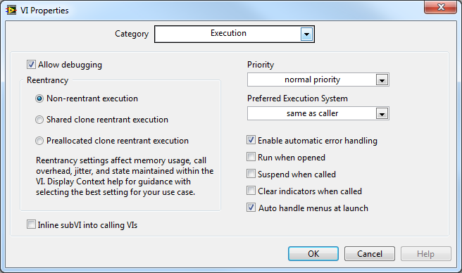

# 可重入VI

重入执行是子VI的一个属性。默认情况下，VI是不会被设置这个属性的；需要设置它时，可以在VI属性对话框中，选中"重入执行"选项。设置了这一属性的VI，称为可重入VI。

图 .12设置VI的可重入属性

如果某个子VI被设置为可重入，那么在程序的不同地方调用这个子VI时，它会在内存中为每一处的调用各生成一个新的VI实例。即，尽管程序在不同地方调用的这个子VI的内容都相同，但是这些子VI在内存中却是相互独立的。如果是非可重入的子VI，在内存中只能有一份实例，所有的调用者都访问这个实例。

被设置为重入执行后，还有两个选项："为各个实例预分配副本"表示每处调用生成的实例VI都拥有各自独立的数据区，它们之间的数据互不干扰。本书后续章节提到的可重入VI，如无特殊说明，都是指这种可重入VI。"在实例间共享副本"是LabVIEW
8.5之后出现的选项，它是指这些实例VI使用同一块数据区。

## 同一VI的并行运行

图
4.13是一个简单的VI，它的程序框图有上下两部分，都调用了同一个子VI。上下两部分的代码之间没有数据线相连。LabVIEW是自动多线程的语言，图中的两个子VI是否会同时运行呢？

图 .13并行的两个相同子VI

如果程序中调用的是两个不同的子VI，LabVIEW有可能会同时在不同的线程执行它们；但对于两处调用相同的子VI，那就得看子VI是如何设置的了。

如果子VI"简单运算.vi"是非可重入的，那么它们一定不会同时运行。LabVIEW一定要等一个执行完，才会执行另一个。

非可重入的子VI在内存中只有一个实例，它的代码和数据都只有一份。在此处调用这个子VI时，它运行所需的数据内容可能都是不同的。若可以同时运行在多处调用的这个子VI，子VI的运行状态和数据就可能发生混乱。所以LabVIEW要禁止这种情况的发生。

VI的这一特性在有些场合表现出了非常好的优点。比如，一个用于读写某个特定文件的子VI
"foo.txt"。应用程序中可能有多处都调用了这个子VI来读写"foo.txt"，如果允许多个线程的程序同时读写它，就很容易造成其内容的混乱。同一子VI不可在不同线程同时运行的特性恰好保护了"foo.txt"，使它不被不同线程同时读写。

但在某些场合，这一特性又显得非常糟糕。比如，有一个用于读写所有文件的子VI。不同的文件应当是可以同时被访问的，但这个子VI却不允许应用程序同时读写不同的文件。需要同时访问几个文件时，也必须一个一个的访问，暂时不能访问文件的那个线程只好等待着。这样，就造成了程序效率的低下。

在这种场合，需要把子VI设置为可重入，以避开同一子VI不可在不同线程同时运行的特性。一个线程正在运行这个子VI时，另一个线程也可以调用它。在LabVIEW中，形象地来看，就是在程序框图的某处，数据流入了一个子VI；在这个框图另外一处，数据也可以片刻不停地同时流入这个子VI。因此，叫做"可重入"。前面已经讲过，应用程序每处调用可重入的子VI时，都生成了一个独立的实例。这就相当于，在应用程序中各处调用的是不同的子VI，只不过这些子VI内部的代码相同而已。既然是不同的子VI，当然也就可以在不同的线程中同时运行。

图 3.12显示的是一个延时子VI的程序框图（延时1秒），而图
4.14是一个调用了这个延时子VI的应用程序，它并行的调用了这个延时子VI两次，那么这个应用程序总的运行时间是多少呢？

图 .14计算程序总运行时间

如果延时子VI是非可重入的，则由于两处调用只能先后分别运行，程序总运行时间为2秒。若延时子VI是可重入的，则两处调用可以同时运行，程序总运行时间为1秒。

## 可重入VI的副本

若可重入VI的多个实例共用一份副本，就意味着它们共用同一数据区。不同实例运行时，可能会把不同数据写入这个唯一的数据空间中，这样就造成了数据的混乱。如果需要可重入VI不同实例会同时运行，并且它们运行时会使用不同的数据，那么就一定要把这个子VI设置为"为各个实例预分配副本"。

图
4.15是一个简单的子VI，这个VI的功能是每执行一次，输出的数据加一。它利用了反馈节点。每次运行这个VI时，反馈节点首先输出上次VI运行后传递给它的数据。VI在此基础上加一，再返回给反馈节点，以便下次调用时使用。反馈节点下方的0是它的初始值，第一次调用VI时，反馈节点给出初始值。

图 .15计算调用次数的子VI

图
4.16是一个调用了“运行次数”子VI的应用程序。执行这个程序后，输出"次数1"和"次数2"分别是几？

图 .16测试运行次数

运行结果同样与“运行次数”子VI的设置有关。程序中两个循环执行次数一为10，一为20。它们之间没有数据连线，所以可以被同时执行。但哪个循环先执行完是不确定的。

如果“运行次数”子VI是非可重入的，则每次运行程序"次数1"和"次数2"的值是不确定的，但它们之间必然有一个为30。虽然循环运行次序不能确定，但是能够确定，运行次数子VI总共被调用了30次，所以它最后一次被调用后，输出的值一定是30。只不过，哪个循环中的VI是最后一次被调用的并不确定。

如果运行次数子VI是可重入的，并且被设置为"为各个实例预分配副本"，那么图
4.16中程序的执行的结果是确定的。"次数1"的值为10，"次数2"的值为20。由于子VI是可重入的，所以程序中的两处调用行为相当于调用两个不同的子VI。他们分别运行，不论运行次序如何，左侧的子VI被调用了10次，而右侧的子VI被调用了20次。

如果运行次数子VI是可重入的，并且被设置为"在实例间共享副本"。那么图
4.16中程序的执行结果是不确定的："次数1"和"次数2"的值可能是小于30的任何一个数值。子VI可重入意味着程序中的两处子VI调用是可以同时运行的。但是，它们共用一个副本，这就造成了数据的混乱。假如，左侧子VI正在运行，内部记录运行次数的数据是8，而这时右侧子VI也同时运行起来，并往内部记录运行次数的数据区写入一个数值3。这样，左侧子VI再读出该数据是就是一个错误数值了。

"在实例间共享副本"虽然会引起数据的混乱，但是它可以大大节约程序的内存。每生成一个副本，就会多消耗一份内存空间。因此，在确保不会发生数据混乱的情况下可以把可重入子VI设置为"在实例间共享副本"。

## 可重入VI的两种数据空间分配方式

LabVIEW 8.6 之后，在设置VI为可重入时，有两个数据空间分配选项：“为每个实例预分配空间”和“让各个实例间共享空间”：

“为每个实例预分配空间”是旧版本LabVIEW（8.6之前）设置可重入VI时的唯一选项。它是指程序在运行前，编译的时候就为每个可重入VI的实例分配好各自的数据空间。比如说这个子VI被主VI在3处不同的地方调用了，那么就分配3份数据副本给它。但是，这种分配数据空间的方式有两个主要的问题。

其一，很多时候程序运行前不能预期会有几处调用到了这一个可重入子VI，比如递归算法就是如此。递归每迭代一次，就需要生成一个新的递归VI的实例。而递归的深度与输入数据有关，在程序运行时才能确定，因此无法预先得知应当分配多少个副本数据空间，也就没法设置为这种模式。

其二，这种设置方式控件效率太低。假设一个可重入VI A，它在主VI中有三处被调用，分别是实例1、2、3。假设程序总共运行3秒，第0秒运行实例1；第1秒运行实例2；第2秒运行实例3。在这个程序整个运行时间内，始终为可重入VI A开辟了三份数据空间，但是每份数据空间都只被使用了很短一段时间，其余时间都没被用到。若是能够重复利用它们，程序可以节约不少内存。

为了解决以上两点问题，LabVIEW又新添了一种为可重入VI 分配数据空间的方式：“让各个实例间共享空间”。笔者觉得这个名称不是特别贴切，可能容易让人误解为：只为可重入VI分配一份数据空间，然后它所有的实例都是用这同一份数据空间。实际情况当然不是这样的，否则就无法保证可重入VI功能的正确性了。

事实上，采用“让各个实例间共享空间”时，每个可重入VI 的实例依然会有它们各自独立的数据空间。程序在逻辑功能上与“为每个实例预分配空间”的方式没有任何区别。唯一的不同在于，数据空间并不是程序一起动就分配好了的，而是只有当一个实例VI被运行到的时候，才为它分配数据空间，而这个实例VI运行结束后，它的数据空间就又被回收回去了。两个同时运行的实例VI是绝对不会共享同一个数据空间的；两个不同时运行的实例VI倒是可以分享同一片数据空间，这已是名称中“共享”的由来。总的来说，如果起名为“动态分配空间”可能会更好理解一些。

还是以上文的可重入VI A为例，若它被设置为“让各个实例间共享空间”，程序开始时，只需要为可重入VI A准备一份数据空间，供实例1使用；程序第1秒的时候，实例1运行结束，它的数据空间被收回，因此实例2还可以继续使用这份数据空间；第2秒时，轮到实例3继续使用者份数据空间。若我们改变一下应用程序的逻辑，把实例3在第2.5秒的时候就运行起来，由于原有的一份数据空间还在被实例2所使用，它不能再分配给实例3，这时候，LabVIEW就会为可重入VI A再开辟一份数据空间，供实例3使用。

“让各个实例间共享空间”的设置虽然提高的程序的空间效率，但它并非只有优点。数据空间的开辟回收都是需要时间和额外的运算资源，因此这个设置是以牺牲时间效率为代价来换取空间效率的提高。

对于一个可重入VI，如果它在应用程序中被调用的地方并不是很多，或者它的各个实例常常会同时运行的，那么就应该把它设为“为每个实例预分配空间”；反之，这个可重入VI会被应用程序频繁的调用，而且每个实例运行的时间都很短，它们的运行时间不大可能会有重叠，就应当把它设置为“让各个实例间共享空间”。用于递归调用时，必须使用“让各个实例间共享空间”方式。

