# 状态机

## 循环条件结构

循环条件结构是指在循环结构内嵌套了一个条件结构这样的一种复合结构。它是 LabVIEW 中常见的程序结构模式之一。

假设需要编写这样一个测试程序，它有多项测试任务：任务 A、任务 B …… 程序需要顺序执行每一个测试任务。这是一个典型的顺序结构的程序，我们可以采用顺序结构程序的编写方法：

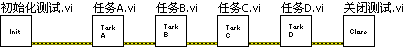

如果程序要求更复杂一些，简单的顺序结构就不够灵活了。比如，有多种产品需要测试，但每种产品的测试流程不一样，有的产品需要测试任务 ABC，有的则需要按顺序测试任务 CDA，等。虽然，可以针对不同产品编写不同的测试程序，但那样需要维护太多不同程序，维护成本太高。

一个更为有效的方法是把测试任务序列作为测试程序的输入，程序根据用户每次指定的测试任务顺序来调用测试任务。这个程序可以使用循环条件结构来完成：

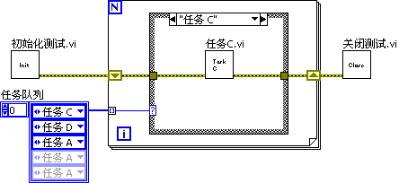

这个程序中的“任务队列”应该是一个输入控件，用户不需要改动程序，只需在主界面选择一组测试任务，就可以改变它的输入值。这里为了便于演示，把它变成了一个常量。“任务队列”是一个数组，元素按照任务执行的顺序排列。在程序运行时，循环每迭代一次，循环结构就从“任务队列”中取出一个任务，然后由条件结构根据该任务的名称选择并进入相应的分支，执行该任务。

## 单状态传递的状态机

假设测试程序的逻辑更复杂一些，如要求根据某一测试任务的运行结果再决定选择下一个测试任务。这样就要求循环迭代一次后，才产生下一次迭代条件结构的选择条件。我们可以把程序再改进如下：

程序开始时，首先指定一个初始任务。条件结构处理完初始任务后，根据当前结果设定下一个任务。由于不能预期循环需要迭代几次，所以需要使用 while 循环。并且，条件结构还多了一个“结束测试”分支，这个分支用于退出 while 循环，它负责把“真”值传递给循环停止条件接线端。

改进后的这个程序结构模式也被称为状态机。状态机中具有一定个数的状态，它在某一时刻仅处于一个状态，在收到某事件或数据后跳转到另一状态。在程序中，每个条件结构中的分支表示一个状态，循环下一次迭代，就跳转到另一个状态中去了。

状态机是一个比较常用的结构模式，所以 LabVIEW 的新建 VI 模板中提供了状态机 VI 的模板。需要使用这一模板时，在 LabVIEW 的启动界面选择它：

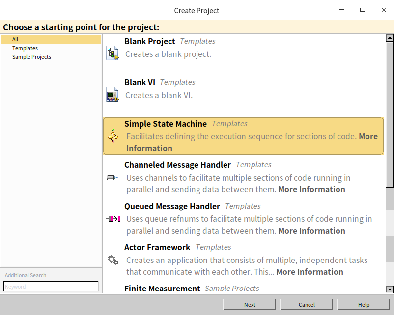

或打开 VI 的 "文件 -\> 新建" 菜单，在弹出的新建对话框中，选择“VI-\> 基于模板 -\> 框架 -\> 设计模式”中的“标准状态机”：

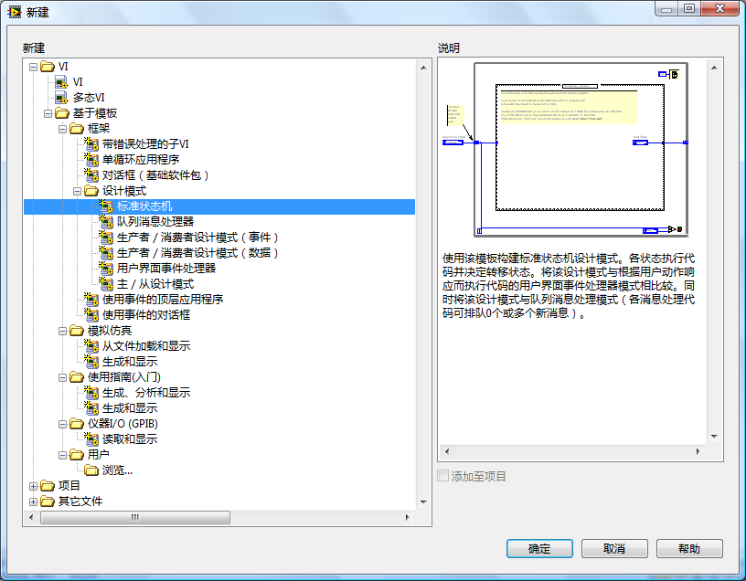

## 多状态传递的状态机

上面展示的状态机中，每一个状态结束前，它只能指定下一个状态。但在实际程序中，有时执行完一个分支的代码，就可以根据当前数据，确定后两次迭代中需要执行的分支。完成这种功能需要用到队列。

队列是一种数据结构，队列中可存放多个类型相同的数据。队列的行为就像是排队买票，数据进入队列，就好像顾客进入排队，先排进去的顾客一定会被先处理，然后先出队伍。队列中的数据也必须是先进先出，即每次从队列中取出一个数据时，只能取队列中最先被放进去的那个。LabVIEW 有关队列操作的函数在函数选板“编程 -\> 同步 -\> 队列操作”中。LabVIEW 中的队列与其它常用的数据结构（比如 array, map, set）都不太一样，它在最初设计时，主要是为了在线程间传递数据，而不是为了存储数据。当然这并不妨碍我们在这里用它来保存需要跳转的状态。本书在[传引用](pattern_pass_by_ref#队列)一节中，还会对队列做详细介绍。

使用队列对状态机进行改进后程序如下：

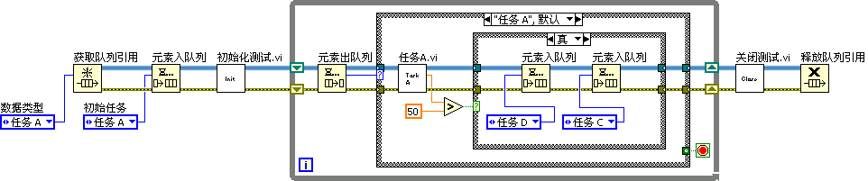

程序首先创建一个队列，用于保存程序中需要跳转到达的状态，并在进入循环前，把初始状态加入队列。循环每次迭代，首先从队列中取出下一状态，用于选择条件结构的分支。在一个分支处理完毕后，再把后续要跳转到的多个状态加入队列。

## 状态机的使用

很多程序的运行过程都可以用状态机来表示。在设计 LabVIEW 程序时，可以先画出程序的状态机，即状态图，然后根据状态图，在 LabVIEW 已经建立好的模板上编写代码。这是一种相当有效的程序设计开发过程。因而，状态机一度成为非常流行的 LabVIEW 程序模式。

但是状态机也有它的不足之处。

首先，状态机的核心是一个条件结构。条件结构、事件结构和层叠式顺序结构都有一个共同的缺点：每次只能显示一个分支中的代码，不利于程序阅读。

其次，如果程序规模庞大，需要处理几十甚至上百中状态，表示它的状态图会变得非常混乱。而 LabVIEW 条件结构中的分支过多，也会大大降低程序的可读性和可维护性。对于这种大规模的程序，状态也需要被模块化，设计出不同的层次。比如，用生产一个产品为例，顶层的程序在“设计”、“生产”、“测试”等几个状态之间跳转，“测试”这个大状态中可能又包含很多分支状态，比如“测试键盘”、“测试屏幕”等分支状态。不同级别的状态，在不同的 VI 中处理，这就避免了某个 VI 的程序过于复杂难懂。

在 LabVIEW 的早期版本中，LabVIEW 还没有事件结构的时候，程序都是使用状态机来处理程序界面的。但是自从有了事件结构，在处理界面的程序中，事件结构就完全代替了条件结构。本书在[事件结构](pattern_ui)一节介绍的循环事件结构模式，也可以看作是一种状态机，但是，当与界面相关的时候，使用事件来控制程序状态的跳转更加便捷。

在计算机软件领域，状态机还被广泛的应用于词法语法分析、正则表达式匹配、数学表达式计算等方面。我们之前介绍过一个可以把字符串格式的数学公式进行求值的 VI：

下面我们就介绍一下如果利用状态机机制实现类似的功能。当然“Eval Formula String.vi”的功能太过复杂，不适合用作演示，我们采用一个简化版做示例，仅考虑正整数四则混合运算的处理和计算。

### 程序要求

首先，明确一下程序的限定和需求。假设我们需要编写一个可以计算字符串形式表达的四则运算公式的程序，它有如下一些要求：
* 输入是一个字符串，只包含数字（0~9）和四个基本运算符（+-*/），遇到任何其它字符则报错
* 输入中的所有数值都是正整数，否则报错。运算的结果可能会是个实数，因为有除法
* 乘除法的优先级高于加减法
* 作为演示，不能使用高级的字符串处理函数，比如查找搜索等。从字符串转换至数值，每次只能转换一个字符。

比如计算“1+2*3-4/5-6”结果应为 0.2

### 数据结构设计

对于这个问题，我们不能直接从左到右读取字符串，每遇到两个数和一个运算符就计算结果，因为乘除法优先级高于加减法，所以，我们在遇到加减法的时候，需要先把数据和运算符保存下来，看看后面的情况在决定是否计算。这个问题只有两级优先级，使用两个移位寄存器，就可以把我们所需的数据和运算符保存下来。但是，在其它问题中，比如需要处理带括号的表达式，优先级会有无数多级，仅仅两个移位寄存器就不够了。这里为了演示一个更为通用的解决方案，我们使用栈数据结构来保存数据和运算符。分别采用两个栈，一个数据栈，一个运算符栈。

栈这种数据结构，有点像手枪的弹夹，数据放入栈，就好像子弹压入弹夹，先压入的子弹一定是后出来。栈中的数据必须是后进先出。

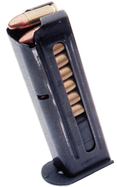

LabVIEW 中没有专门的栈数据结构，但是 LabVIEW 中的队列可以从两个方向放入数据。本来一个单向的队列，只要求数据从左如，从右出即可，但 LabVIEW 中的队列的数据一可以从右入。这样一来，我们只要在使用队列的时候，保证数据只能从右入，从右出，就可以把它当做栈来使用了。

关于输入的字符串公式，为了便于后续操作，我们把它放在了一个字符队列里。

程序运行的思路大致如下：程序从左至右，读出数据和运算符，把数据和运算符先保存到栈中，然后继续读直到下一个运算符，这是判断是否可以计算之前记录的数据和运算符了，如果可以就机算，保存结果，然后继续。

### 绘制状态图

同一个问题，可以用很多种不同的状态图来表示。可以多划分几种状态，每个状态要处理的工作会简单一些；也可以少划分一些状态，每个状态的功能就更复杂一些。我们把问题分成以下六个状态：

* Init，初始状态。在这一状态下，如果下一个输入的字母数数字，则跳转到“构建数值数据”的状态；如果下一个数组字母为空，说明输入都已处理完成，跳转到“计算”状态。
* Construct Number，构建数值数据。这一状态负责把输入的多个数字字母组装成一个整数，如果下一个输入字母还是数字，则停留在当前状态；如果下一个输入字母为空，跳转到“计算”状态；如果下一个输入字母是“+”或“-”，则跳转到“检查栈1”状态；如果下一个输入字母是“*”或“/”，则跳转到“检查栈2”状态。
* Check Stack 1，检查栈 1。查看运算符栈最上面一个运算符是什么。如果是空，则跳转到“压栈”状态；如果不为空，则跳转到“计算”状态。
* Check Stack 2，检查栈 2。之所以有两个“检查栈”状态，是因为运算符有优先级的差别，两个状态分别对应两个优先级。“检查栈 2”查看运算符栈最上面一个运算符是什么，如果为空，或是“+”、“-”，则还不能立刻开始计算，跳转到“压栈”状态；如果是“*”或“/”，则跳转到“计算”状态。
* Push，压栈。在这个状态里，把前一步读取的数据和操作符压入栈，然后跳转到“初始”状态。
* Calculate，计算。这是最为复杂的一个状态，它首先检查运算符栈，如果栈中没有任何运算符，则程序结束；如果还有运算符，则从栈里弹出一个运算符和两个数值，进行加减乘除运算，再把运算结果压入数据栈。做完这一步，如果程序没有结束，则退回到上一个状态。具体方法是看下一个输入是什么，如果下一个输入字母是“+”或“-”，则跳转到“检查栈1”状态；如果下一个输入字母是“*”或“/”，则跳转到“检查栈2”状态；如果输入为空，则继续回到本状态。

用状态图来表示上面的描述如下：

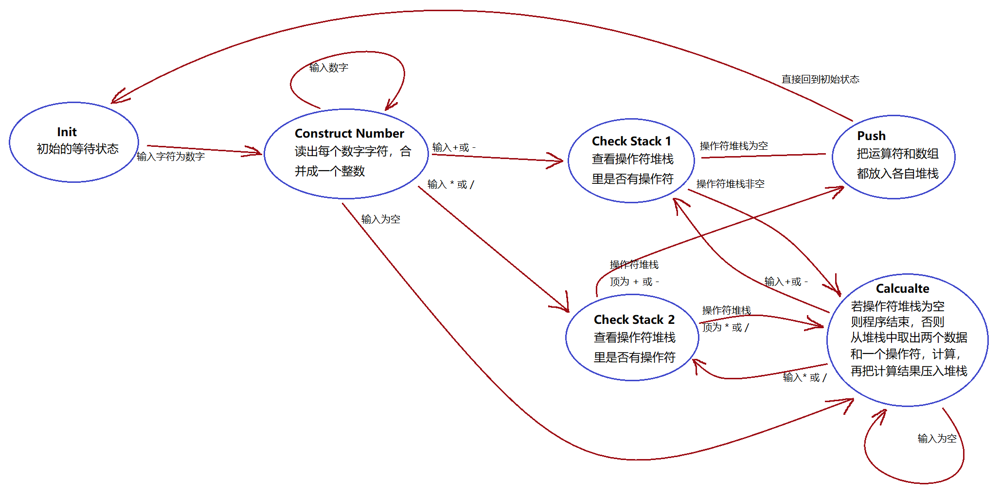

划分成六个状态，对于这个简单问题来说是比较细致的了，这种划分方式，每个状态只负责完成一件简单的工作。当然，也可以采用较少状态的划分方式。比如，“压栈”状态，完成任务，不需要判断任何条件直接跳转到另一状态，所以也可以把“压栈”和之后的状态合并。两个“检查栈”状态也可以合并成一个状态，但这样就要在状态内部检查并分别处理不同的运算符优先级。

### 编写程序

因为程序非常简单，这里没有使用 LabVIEW 提供的模板，但程序的结构与模板是完全一致的。我们首先要制作一个枚举类型的用户自定义控件，用于记录所有状态的名字。状态的名字与上文描述的保持一致：

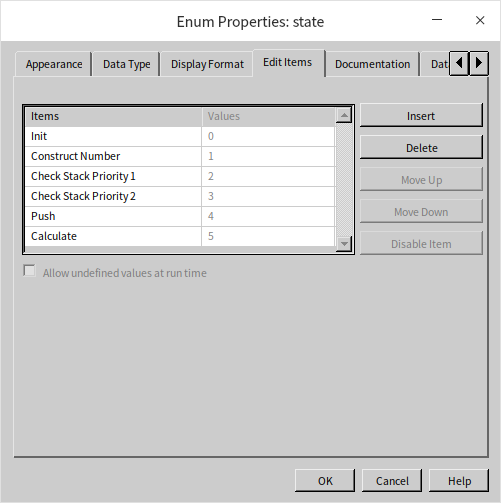

主程序是一个典型的单状态传递状态机，主体部分是一个条件循环结构，左右两侧还有一些初始化和关闭资源的辅助代码：

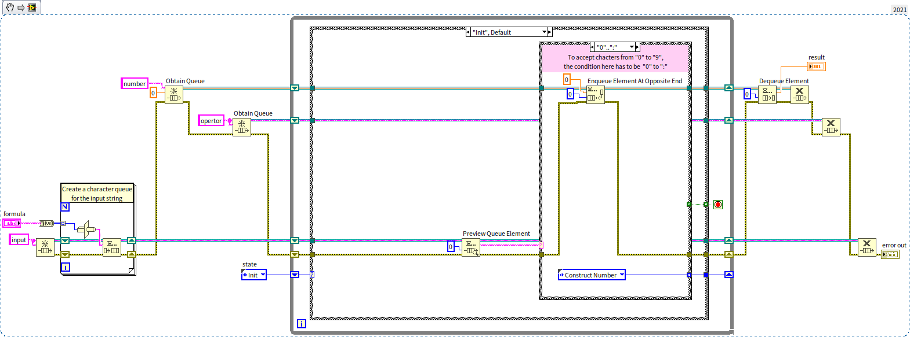

程序左下侧有一小块循环结构，用于把输入的字符串转换成字符队列，只是为了便于后续操作。程序上方两条贯穿条件循环结构的数据线是两个栈。最上面一个是数据栈，下面一个是运算符栈。条件结构内每个分支内程序的逻辑结构都相似，首先处理完成状态自身任务，即对数据进行处理。然后判断下一个状态是什么。

上图显示出来的是“初始”状态分支，当输入字符为数字时，程序设定下一个状态为“构建数值数据”。同时程序还在数据栈中插入了一个值为 0 的数据，这时因为，我们不但利用这个栈保存构建好的数据，在构建数值数据时产生的中间值也被保存在了这个栈里。下图，构建数值数据时，先从栈读出构造了一部分的数据，继续添加一位新数字，然后把结果压回栈：

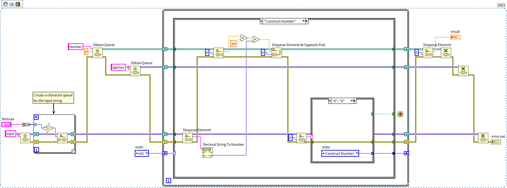

稍微复杂一点的是“计算”状态。它的算法也同上文描述的一致。比如下图显示的是计算加法的分支：从栈里弹出一个加法运算符和两个数值，进行加法运算，再把运算结果压入数据栈。最后根据输入字符跳转到新状态：

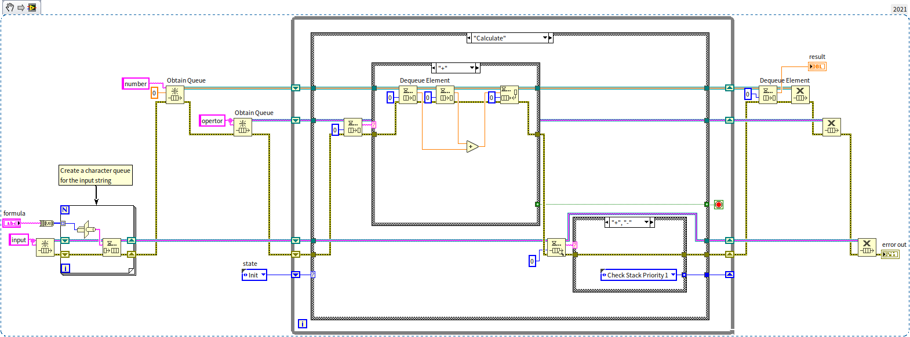

## 练习

* 编写一个 VI， VI 前面板上有红黄绿三盏灯，模拟交通信号灯的切换。三盏灯共有4个状态：只有绿灯亮，绿灯亮同时黄灯闪烁，只有黄灯亮，只有红灯亮。信号灯在每个状态停留几秒钟然后切换至下一状态，循环往复。

