# "Hello，World!"程序

很多计算机编程语言的书籍在指导读者编写第一个程序时，往往都会选用"Hello,
World!"程序。也就是说，编写一段程序，让程序运行起来，在屏幕上显示出"Hello,
World!"几个字。我们也沿用这一传统，编写一个具有中国特色的"Hello,
World!"程序作为我们的第一个LabVIEW程序，即在屏幕上显示"您吃了吗？"几个字。

## 启动界面

我们以LabVIEW 8.6中文版为例，启动LabVIEW，首先显示出来的是LabVIEW的启动界面，如图
1.1所示：

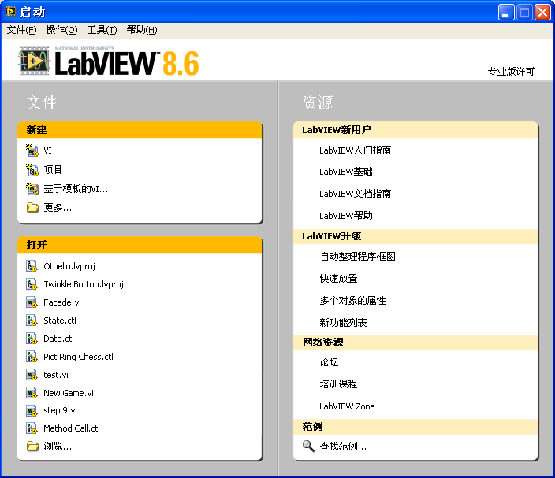

图 .1 LabVIEW的启动界面

LabVIEW的启动界面包括左右两部分："文件"与"资源"，分为三个栏目：

左上部分"新建"栏用于创建新的VI或者工程。若选择"更多"，LabVIEW会给用户提示出更多可以创建的对象，包括：XControl、库、类、全局变量、运行菜单、自定义控件等。

左下部分"打开"栏列出了最近打开过的工程和文件。如果是新安装的LabVIEW，这里会是空的，只有"浏览"一项内容。点击"浏览"，可以选择路径，打开一个文件。

右半部分是与帮助相关的各类信息。建议每一位初学者，或希望系统掌握LabVIEW的读者，系统全面地仔细阅读右侧资源中提供的资料。在LabVIEW中文版中，它已经汉化了。了解掌握这些内容，对掌握LabVIEW会有很大帮助。

## 创建一个新的VI

在LabVIEW启动界面上选择"新建-\>VI"，屏幕上就出现了两个新的窗口，如图
1.2和图 1.3所示：

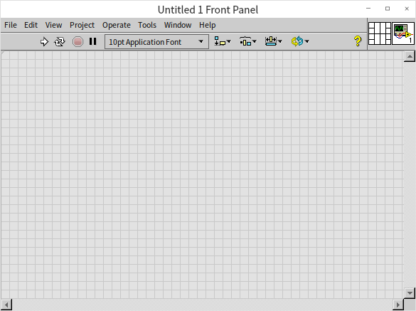

图 .2新VI前面板

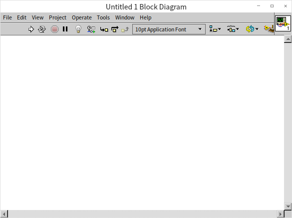

图 .3新VI程序框图

这就是新创建出来的不带任何代码的空白VI。

鼠标移动到这两个界面的边框处，变为双向箭头状时，按下鼠标便可随意调整它们的大小。

LabVIEW的第一个版本始于1986年。早期的LabVIEW是专为模拟测试测量仪器而设计的。一台计算机，插上相关的数据采集卡，再配上一段LabVIEW程序，就成了一台虚拟仪器，可以完成一定的测量功能。因此，LabVIEW的源代码文件在保存时采用了VI（虚拟仪器Virtual
Instrument的首字母缩写）作为文件后缀名。

时隔几十年，LabVIEW的应用早已超出了虚拟仪器的范畴，拓展到了测试测量、控制、仿真等多个领域，但是VI这个名称还是保留了下来。现在，我们可以把VI理解为实现了一定功能的一个LabVIEW代码模块，相当于其它编程语言中的函数。

一个VI由两个窗口组成：前面板和程序框图。

前面板是程序与用户交互使用的界面。用户可以在这里输入程序运行所需的参数，观察程序运行的结果。

程序框图是用户编写程序代码的地方。程序运行时的逻辑是由代码决定的。

## 让VI显示"您吃了吗？"

下面我们可以着手实现第一个LabVIEW程序了。

首先设计它的界面。

当VI的前面板成为活动窗口时，我们同时可以看到另一个浮动的窗口（图
1.4），这就是LabVIEW的控件选板。控件选板上分门别类地列出了各式各样的控件及其图标，鼠标点击选板下方的向下箭头，就可以使选板展示出全部内容。再次点击选板下方的向上箭头，可以使选板回缩到默认状态。我们基本上一眼就可以从图标上判别出这些控件的类型以及其功能用途。鼠标移动到某一类控件的图标上，该类控件的所有子控件选板就会自动显示出来。在设计程序界面时，我们就从控件选板上选择所需的控件。当此浮动窗口被关闭后，只需鼠标右击VI的前面板，便可再次显示出控件选板。

图 .4控件选板

我们的这个程序需要显示文字，所以应该在前面板上选择一个文本或字符串显示控件。根据控件选板上的图标，我们可以识别出，图
1.4中第一排、第三列的图标是与文字显示相关的。进一步查看其子选板（图
1.5），可以看到子选板的第一个控件就是"字符串显示控件"。鼠标左键点击这一选中了的控件，再在VI的前面板上点击鼠标，此控件就被放置在VI前面板上了。我们也可以用鼠标直接把选中的控件拖拉到前面板的某个位置。

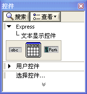

图 .5文本显示控件子选板

把鼠标移动到新放置的控件的边缘，如图
1.6所示，控件的边框出现了八个蓝色的小方块。鼠标移动到控件边框处，光标会变成了最常见的箭头状，此时，按下鼠标左键，即可拖动控件的位置；若鼠标移动到边框蓝色方小块处，光标会变成双向箭头状，此时，按下鼠标左键，可以调整控件的尺寸。将控件按需要调整合适后，我们第一个VI的界面就设计完成了。

图 .6设计好的VI界面

程序的逻辑功能是在程序框图中实现的。当我们在VI前面板上放置一个控件后，VI的程序框图上会自动增加一个与其对应的接线端（图
1.7）。在程序框图中把数据传给该接线端，程序运行后，前面板上的控件就显示出传入的数据。我们把字符串"您吃了吗？"传递给这个名为"字符串"的接线端，运行程序，界面上的"字符串"控件就会显示出这几个文字。（图
1.9、图 1.10）

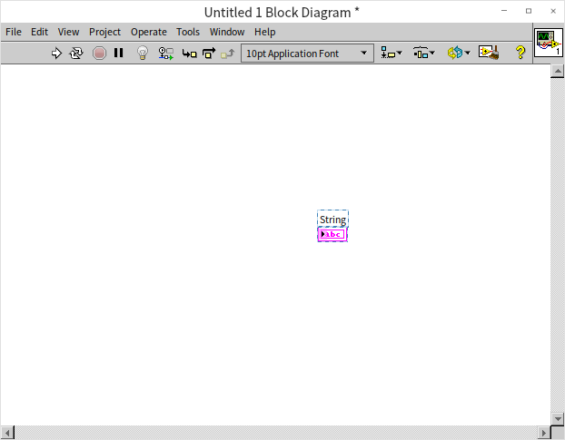

图 .7放置控件后的程序框图

VI的程序框图窗口为活动窗口时，会同时出现一个与控件选板相类似的浮动窗口，这就是函数选板。它上面的图标代表了控制程序运行的函数、结构、常量和LabVIEW自带的VI等。我们现在需要从中找出一个字符串常量来存放"您吃了吗？"这几个字。

与控件选板的操作相同，点击函数选板下方的向下箭头，可以显示出更多的函数子选板。依次进入"编程-\>字符串"子选板，找到字符串常量（图
1.8），然后拖拽到VI的程序框图中。此时，立即敲击键盘，即可在字符串常量内输入相应的文字。

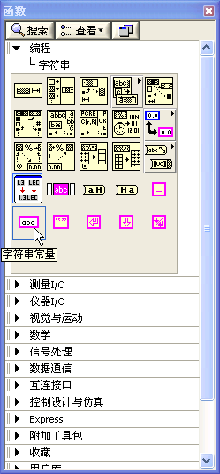

图 .8字符串子选板

图 .9准备连线

LabVIEW通过连线来传递数据。次序将鼠标移至字符串常量的右侧中间位置，鼠标会变成一个绕线轴的模样。这时点击鼠标，就会从字符串常量上引出一根线，再在字符串显示控件接线端的左侧中间位置点击一下鼠标，这两个对象就被一根连线连接起来了。

至此，我们的整个程序就编写完成了。在VI的前面板上，点击工具条上左侧第一个箭头图案的按钮，运行VI。让我们看一下图
1.10显示的程序运行的结果吧。

图 .10程序运行结果

若程序中有错误，工具栏上的运行按钮的箭头会变成断裂状，程序不能运行。按钮的名称也从"运行"变成了"列出错误"。此时点击这个按钮，会弹出错误列表对话框。必须按照列表中的提示，改正错误，修改好程序代码。待运行按钮恢复箭头状，程序方可运行。（参考图
1.13、图 1.14）

作为学习LabVIEW的第一个程序，我们要把它保存好，作为留念。在菜单中选择"文件-\>保存"，或直接使用快捷键"Ctrl+S"，再选择合适的路径和文件名，这个VI便保存下来了。

LabVIEW编程就这么简便易学！

## LabVIEW程序的运行逻辑

目前，常见的编程语言大都是文本形式的编程语言，即便是一些自称为图形化编程的编程语言。例如VC、VB等，虽然它们的界面可以直接进行所见即所得式的编辑，但程序逻辑部分，还是由文本方式的代码来编写的。

从前面的例子可以看出，LabVIEW与常见的文本编程语言区别极大。它不仅具有图形化编辑程序界面的功能，更重要的是，程序逻辑部分也是通过"画图"的方式实现的。为了便于说明两者的区别，使学过C语言的读者更快更容易地掌握LabVIEW，我们在讲解后面的章节时，常常会把LabVIEW和C语言进行相应的比较。

正因为LabVIEW的图形化编程特性，它常常会引起一些人的误解，把LabVIEW与AUTO
CAD，或电路板、化工机械等专业常用的图形化设计、控制应用软件等同起来。但实际上，LabVIEW的灵活性与功能强大是一般行业应用软件无法比拟的，它是一种编程语言。

为了更清楚的讲解LabVIEW程序，我们先来定义LabVIEW编程中使用到的一些名词。VI前面板和程序框图上的各种图形元素都被称为对象。VI前面板上最常见的图形对象是控件，用于输入或显示数据。VI程序框图中所有的图形对象可分为两部份：节点和连线。连线也被称为数据线，在我们上一段所编写的简单程序中，连接两个控件接线端之间的就是连线。连线在程序框图中很容易辨别。除此之外，程序框图中的其它对象统统被称为节点。

节点又可被细分为多个类型，常用的有：

- 接线端。我们在前面提到过接线端，它与VI前面板上的某个控件相对应，用于读出或写入控件数据。接线端的功能与C语言中函数的参数相类似，程序通过接线端（或者说是控件）进行数据交换。 
- 函数。函数是LabVIEW自带的实现了某些功能的节点。函数实现的功能是最为基础的，不能再进行拆分。LabVIEW中的函数类似于C语言中的操作符和自带的基础函数。例如，LabVIEW中的加法函数（）与C语言中"+"运算符相类似，LabVIEW中求字符串长度的函数（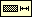）与C语言中的strlen()函数功能类似，等等。
- 结构。结构用于控制程序的执行顺序。它与C语言中那些控制程序流程的关键字功能相类似。例如，LabVIEW中的for循环结构（），与C语言中关键字"for"的功能类似。
- 子VI。一个VI被其它的VI所调用，我们就称之为子VI。它与C语言中子函数的概念是相同的。
- 装饰。VI的程序框图上还可以放置一些与程序运行无关的节点，比如一个背景图片、一段说明文字等等。它仅仅是为了让程序代码更容易被阅读和理解。这相当于C语言中的注释。
 

在文本语言中，程序的基本执行顺序就是语句的书写顺序。也就是说，如果没有改变程序流程的跳转语句出现，程序将按照从上到下的顺序，逐条执行每一行语句。在LabVIEW中，程序的基本执行顺序由连线来控制，即程序是沿着程序框图上的连线执行的。

我们可以这样来理解LabVIEW程序的执行顺序：

一个数据从程序框图上的某个起始节点出发，沿着与它相连的数据线流动到下一个节点的某个输入端点。数据在这个节点被加工处理后，再从这个节点的输出端点沿着连线流出，流向下一个节点，直到流入某个终止节点为止。数据流动的顺序，也就是程序执行的顺序。因此，LabVIEW编写出来的程序被称为数据流驱动的程序。

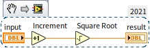

图 .11一段简单数学运算程序

在一个简单的VI中，数据的初始节点和终止节点通常都是控件的接线端。图
1.11所示是一段简单的数学运算程序。原始数据从"初始值"接线端流出，沿数据线流到"加1"函数，再从"加1"函数右端流出，沿数据线流至"平方根"函数，最后流入"结果"接线端。

"初始值"和"结果"同为接线端，为什么一个是数据流出，一个是数据流入呢？这是因为LabVIEW的每个控件都可以选择作为控制控件或是显示控件，这就决定了数据流动方向。作为控制控件时，数据从其接线端流出；作为显示控件时，数据从其接线端流入。

默认情况下，一个控件是控制控件还是显示控件，取决于这个控件所代表的物理实体的特征。比如说，表示开关的控件，默认情况下是控制控件；而表示灯泡的则是显示控件。鼠标右键点击控件，在弹出的快捷菜单中有一项"转换为显示/控制控件"选项，可以用来改变控件的方向。

函数以及子VI通常有多个接线端，并且这些接线端的方向是固定的。数据总是从函数的输入接线端流入，从输出接线端流出。

数据线是可以有分叉的。数据从一个接线端流出，可以同时流向多个接收数据的接线端。数据沿着数据线流动至分叉处，数据会自动生成一个副本，变成两份一模一样的独立数据，分别传递到各自的下一个节点（图
1.12）。后续的节点再分别对两份数据进行处理，两者不会相互影响。（这是一个比较易于理解的描述方式，实际上LabVIEW并不一定在每个分叉都产生副本，随着的LabVIEW理解的深入，本书后文会给出更精确的描述。）

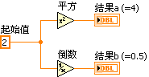

图 .12两份独立数据，各自进行运算

但反之则不可，即一个接收数据的接线端不能同时接受来自不同源的数据。假如硬要如此连线，数据线就变成了虚线（图
1.13）。按下VI程序框图窗口工具条上的"列出错误"按钮，就会得到错误提示（图
1.14）。

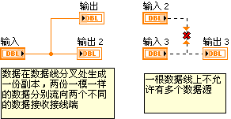

图 .13数据线分叉

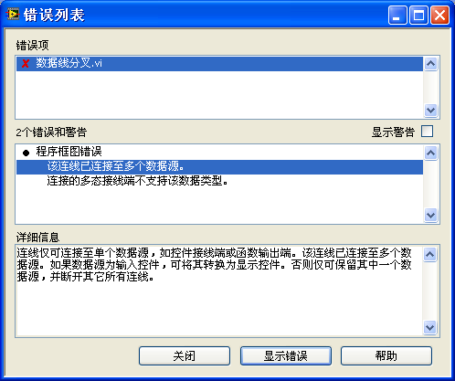

图 .14错误列表

## 练习

* 创建一个新的VI，放置一个开关控件和一个灯泡控件，然后使用开关来控制灯泡的明灭。
