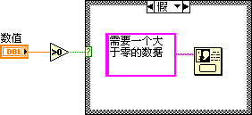
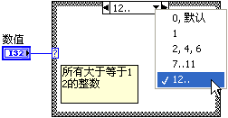
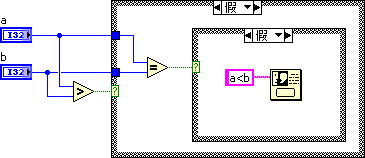

# 条件结构

LabVIEW中的条件结构由多个分支组成，每个分支中有不同的程序代码。条件结构根据输入数据的不同，每次只执行其中一个分支中的代码。这与C语言中的if
else和switch语句的功能相类似。

图 .14条件结构

图
3.14是一个条件结构，它左侧带问号的小矩形是分支选择器。条件结构根据流入分支选择器的数据的值来决定执行某一分支内的代码。条件结构上方带文字的矩形方框是选择标签，文字表示了当前显示的分支的条件。鼠标点击该处，可以修改当前分支的条件；点击向下的三角形，可以按顺序列出选择框所有的分支条件，并切换分支；点击选择标签两侧的小三角，可以依次切换至其它分支。

## 布尔类型条件选择结构

条件结构的一种常见程序模式是：首先比较某个数据，然后把比较的结果传递给分支选择器。条件结构中的两个分支分别是比较结果为"真"、"假"时需要执行的代码。如图
3.15所示。

图 .15选择数据为布尔类型

其实，在LabVIEW中最为常见的布尔型条件结构是用来处理错误数据线的。（图
3.12就是一个例子。）这是LabVIEW中使用最为普遍的错误处理机制。子VI有两个专门用于错误处理的参数："错误输入"和"错误输出"。子VI中最外层的结构就是一个条件结构，"错误输入"的数据线直接连至它的分支选择器。如图
3.16和图 3.17所示。

若"错误输入"是一个错误信息，表示之前的程序已经出错，条件结构执行"错误"分支。由于先前程序已出错，这个子VI就没有必要再运行后续的功能了，直接把错误信息传递给后续程序即可。所以错误分支中无任何代码。

若"错误输入"并非错误信息，表示之前的程序运行正常。条件结构执行"无错误"分支。该分支中包含有这个VI所需完成的全部功能的代码。

有关错误处理机制的其它内容，将在下一章另行详细阐述。

图 .16错误处理的无错误分支

图 .17错误处理的错误分支

## 其它数据类型的条件选择

字符串、整数和枚举类型的数据也可以作为条件结构的条件。这些数据类型与布尔数据类型的区别在于，布尔类型数据只可能有两个值："真"或"假"；而其余这三种类型的数据，它们的可能值都是无穷的。条件结构不可能为每一可能值都设置一个分支。因此，使用这些数据类型作为条件时，条件结构中必须选择一个分支作为默认分支。如果数据不满足其它分支的条件，就执行默认分支的代码。

对于一个特定的枚举型控件而言，它的数据值的个数是有限的。如果条件结构的条件分支与其项数等同，不设默认分支也可以。但为了避免条件分支少于项数以及在编调过程中增删项引发的错误，最好还是设置默认分支。

条件结构中的一个分支可以对应多个条件，不同条件间用逗号隔开。比如图
3.18所示条件结构的第三个分支有三个条件，当输入分支选择器的数值为2、4、6时，都会执行这一分支。

条件标签还可以是一段值，在两个值之间用两个点连接就表示这两个数值之间的一段值。比如图
3.18中的第四个分支表示该分支的条件是7到11。当输入数据为7至11中的任何一个数值时，都会执行这个分支。第五个分支的条件标签表示所有大于等于12的数值。用字符串作为条件时，也可以表示一段值，其数值就是与字符串对应的ASCII码。

图 .18给一个分支添加多个条件

不同分支的条件必须是唯一的。如果同一个条件出现在不同的分支标签中，VI会报错，并不能运行。

## 合理设置选择条件

利用条件选择器可以接受多种数据类型、每一分支又可以处理多个条件的特点，合理设置条件结构的判断逻辑，可以大大简化代码的复杂度。

比如，要求比较两个输入整数：a和b。a>b时，弹出对话框显示"a>b"；a=b时显示"a=b"；a\<b时显示"a\<b"。编写这个程序并不困难，但是直接按照程序要求的逻辑来编写程序，程序中会出现一个嵌套的条件结构。

图 .19嵌套的条件结构

条件结构的可读性也比较差，如果结构有嵌套，可读性会更差。因为程序框图每次只能显示条件结构的一个分支，其它分支的代码需切换到该分支后才能看到。

稍微改动一下程序的条件判断逻辑，即可避免条件结构的嵌套。比如，此例可以改写成图
3.20所示的代码，用a、b的差值来判断它们的大小关系，仅需一个条件结构即可。

图 .20改进的条件结构

图
3.20所示程序的另一处优化，是把每个条件分支中共同的代码"单按钮对话框"提取至结构之外，大大改善了程序的可读性和效率。把共同的代码放在结构之外，这个原则在条件结构中是务必遵循的。

再举一个例子，输入a，b两个布尔参数，a和b的值在不同情况下完成不同工作。如图
3.21所示的程序，先把a与b组成一个布尔数组，再把它转换为数值，从而避免了条件结构嵌套。

图 .21多布尔输入值时，使用单一条件结构

## 隧道

与顺序结构相类似，数据在流入流出条件结构时，也要通过隧道。但这两种隧道在使用中并不相同。条件结构的隧道的用法与顺序结构不同。数据流入条件结构的隧道，其输入端在结构外侧，它可以与其它节点的输出端相连接；其输出端在条件结构内侧，条件结构每个分支都可以使用隧道输入端的数据。而数据流出条件结构的隧道则正相反，它的输出端在结构外侧，输入端在结构内侧。虽然条件结构每次只执行其中某一分支的代码，但每个分支都必须为输出隧道的输入端提供一个数据。

每个分支都必须提供一个数据给某隧道，这样编程是比较繁琐的。实际编程中，多数情况下只有在某个分支中才产生一个有意义的数据，供结构外代码使用，其它分支只需提供一个默认值就可以了。

解决这一问题的方案之一是把输出隧道设置为"未连线时使用默认值"。这样，如果某一分支不传递任何数据给这个输出隧道的输入端，输出隧道就使用该数据类型的默认值作为输出。

在很多场合，条件结构的输出隧道是与某一输入隧道相对应的。如果程序没有特殊说明，流出结构的数据应当与流入结构的数据相同。LabVIEW
8.6增加了一项新功能，可以把这种有对应关系的输入输出隧道的各个分支，一次性都连接起来。鼠标右键点击输出隧道，选择"连接输入隧道-\>创建并连接未连接的分支"，再用鼠标点击一下输入隧道，即可在每个分支中把输入输出隧道连接起来（图 3.22）。

图 .22连接输入输出隧道

## 选择函数

条件结构的可读性比较差，但它又是程序必不可少的一种结构。不过，在某些情况下，可以用选择函数（位于"编程-\>比较-\>选择"）代替条件结构。选择函数有三个输入，其中第二个输入参数的数据类型必须是布尔类型；另外两个参数的数据类型必须相同。当输入的第二个参数为"真"时，函数把第一个输入参数的值作为输出；否则把第三个输入参数的值作为输出。这类似于C语言中的y=x?a:b;
语句。

如果条件结构的分支选择数据参数为布尔类型，或者可以转换为布尔类型，且每个分支只是用来选择一个不同的数值，则这个条件结构完全可以用选择函数代替。比如，图
3.19中的条件结构就可以用图 3.23中的选择函数代替。

图 .23使用选择函数改进后的代码

使用选择函数最明显的优点是，所有候选数据都直接展现在程序框图上，用户一眼便可了解整个程序的逻辑，程序可读性大大提高。
