# 循环结构

## for循环

for循环结构用于把结构体内的代码重复执行一定次数。这与大多数文本编程语言中的for循环都非常类似。

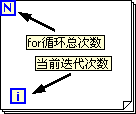

图 .30 for循环结构

图 3.30是一个for循环结构。左上角的N表示循环迭代的总次数，由外部提供给循环结构；左下角i是当前迭代的次数。LabVIEW中的for循环迭代计数只能从0开始，每迭代一次增加1，即循环第一次迭代i为0，第二次迭代i为1，依此类推。

数据在流入流出循环结构时，除了可以通过隧道，也可以通过移位寄存器或者反馈节点。

## 隧道

循环结构的隧道与其它结构中的隧道是类似的。根据数据进出结构的方向，它可以分为输入隧道和输出隧道：输入隧道的输入端在结构外侧，输出端在结构内侧；输出隧道的输入端在结构内侧，输出端在结构外侧。

如果输入的数据是一个数组，循环结构可以使用一种独特的方式，让隧道具备索引功能。开启了索引功能的隧道，每次循环迭代依次取出结构外数组的一个元素。这相当于把隧道和索引数组的功能结合起来了。索引隧道的外观是一个空心的小矩形。在隧道的右键菜单中，可以选择"禁用索引"或"启用索引"，以禁用或启用隧道的索引功能。

使用了索引隧道的for循环结构，可以不用提供循环次数，即不必输入N值，循环迭代次数由输入数组的长度决定。迭代次数即数组长度。这样，循环结构恰好能够处理完输入数组的每一个元素。

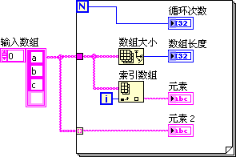

图 .31循环结构的隧道

图 3.31中的程序有四个输出："循环次数"、"数组长度"、"元素"和"元素 2"。运行该程序，每次迭代过程中，"循环次数"和"数组长度"的值是相同的，"元素"和"元素 2"的值也是相同的。

对于输出隧道，也可以开启索引功能。索引输出隧道就相当于把结构内每次迭代产生的数据组成一个数组传递到结构外。

如果同时有多个索引输入隧道，与他们相连的数组长度不一致，则循环迭代次数为这几个数组中，长度最短的那个数组的长度。如果同时也为数组提供循环次数值，即输入一个N值，那么，循环的次数为这几个数组的长度和N值中最小的一个。

通过索引输入隧道连接的输入数组如果是个空数组，则循环迭代次数为0。在调试程序的过程中，有候会出现这种情况，明明提供了N的值，循环却没有迭代或迭代次数不对，此时就需要查看一下，循环结构是否有索引输入隧道，与它们相连的数组的长度是多少。

如果与索引输入隧道相连的是一个多维数组，每通过一次索引输入隧道，数组会降低一维。对于二维数组，使用两层嵌套的循环结构，即可得到它的每一个元素（图 3.32）。

 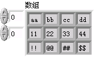

图 .32处理二维数组

下面，分析两个for循环的应用实例：

程序1. 编写一个程序，程序列出某一路径下的所有VI，再把这些VI的文件名在程序前面板上一一显示出来。同时前面板上有一进度条，可以表明已显示了总数的多少。在需要给程序添加进度条时，可以参考本例的思路。

图 .33进度条演示

图 3.33是这一程序的代码。其中，Recursive File List.vi是LabVIEW自带的函数，位于"编程->文件I/0->高级文件函数->递归文件列表"选板，它用于输出指定文件夹中的内容。拆分路径函数位于"编程->文件I/O->拆分路径"，用于输出文件或文件夹名。

该程序首先列出一个文件夹下的所有VI，然后利用循环结构迭代显示每一VI的文件名。程序中的进度条控件的标尺刻度范围被设置为0～1。这样，只要把i/N的值传递给进度条，进度条即可显示出当前程序的大致进度（图 3.34）。

图 .34程序界面

程序2. 判断图 3.35程序中"输出整数"的值是多少？

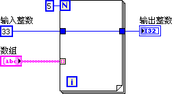

图 .35直接相连的输入输出隧道

"输出整数"有可能是0，这是使用for循环结构最容易出现的错误之一。虽然从程序框图上看，"输入整数"和"输出整数"是连接在一起的，"输出整数"的值应该与"输入整数"相同。但要考虑到，假如"数组"为空数组，则循环一次也不会迭代，与"输出整数"相连的循环结构输出隧道得不到任何数据，只能返回一个默认值。

## 移位寄存器

隧道负责在循环结构内外传递数据。当循环的不同迭代间需要有数据传递时，需要使用另一种机制：移位寄存器。在循环结构边框的鼠标右键菜单中选择"添加移位寄存器"即可为循环结构添加一对移位寄存器。一对移位寄存器由两部分组成，分别位于循环元结构的左右两侧。一次迭代结束时，数据流入循环结构移位寄存器的右侧端；在下一迭代开始时，该数据会从同一移位寄存器的左侧端流出（图 3.36）。

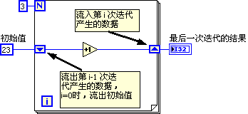

图 .36移位寄存器

有文本编程语言经验的用户，刚开始接触LabVIEW时，遇到需要传递数据的情况，往往会先考虑创建一个变量，用变量来传递数据。在使用循环语句时，更是如此。这实际上是与LabVIEW的数据流驱动相违背的。使用LabVIEW的时候，需要转换思路，凡是循环内需要使用变量的地方，首先应考虑使用移位寄存器。

通过移位寄存器传入传出数据，数据的类型和值都不会发生变化。移位寄存器的特殊之处在于，在循环结构两端的接线端是强制使用同一内存的。因此，上一次迭代执行产生的某个数据，传给移位寄存器右侧的接线端，如果下一次迭代运行需要用到这个数据，从移位寄存器左侧的接线端引出就可以了。也就是说，尽管一对移位寄存器总是包含左右两部分，但这两部分中的数据是同一份；而隧道则有输入隧道和输出隧道之分，某个输入隧道是与其它输出隧道毫无关系的独立节点。

我们把图 3.35中的程序做一改进，用一个移位寄存器来替换程序中原本不相关的输入输出两个隧道。在隧道节点处，点击鼠标右键，选择"替换为移位寄存器"（图 3.37）。

图 .37用移位寄存器替换隧道

图 .38改进后的程序

执行改进后的程序（图 3.38），"输出整数"始终是"33"。即便一次循环迭代都没有，数据从移位寄存器左侧流入，移位寄存器左右两侧保存的是同一份数据，所以从移位寄存器右侧流出时还是"33"。

使用循环结构的一个常见错误是忘记给移位寄存器赋一个初始值。因此，使用移位寄存器时要切记：在循环结构外，给移位寄存器左侧端传入一个初始值，除非能够确定程序的不需要给移位寄存器赋初值。

运行图 3.39中的程序，可以发现"输出值"取决于运行这个VI的次数。每次运行该VI，"输出值"都会发生变化。这就是必须给移位寄存器赋初始值的原因。

图 .39未初始化的移位寄存器

移位寄存器的左侧接线端可以多于一个。如图 3.40所示，用鼠标可以把左侧接线端拉出所需要的个数来。多出来的接线端从上到下分别为上两次、三次......迭代输出的数据。同样不要忘记给左侧的这些移位寄存器连接一个初始值。如果迭代次数少于寄存器个数，或迭代还未开始，从左侧数据尚未更新的接线端出来的数据就是它们的初始值。

图 .40具有多个左侧接线端的移位寄存器

移位寄存器除了在迭代间传递数据之外，还附带有其他一些功能。其中最主要有两点：一是帮助程序内存优化；二是用于功能全局变量中。我们将在后续的相关章节中再讨论这两点应用。

## 反馈节点

### 反馈节点的基本用法

在循环结构框图中，如果单纯为了让下一次迭代使用上次迭代的数据，也可以使用如图 3.41所示的反馈节点。

图 3.41反馈节点

通过移位寄存器的右键菜单，可以把一个移位寄存器替换为反馈节点；反之亦然。在给循环结构内的某一个节点的接线端连线时，如果数据流出现了一个环，LabVIEW就会自动创建出一个反馈节点插在这个环中。如图 3.42所示，把"+1"函数的输出数据再引回到它的输入端，形成了数据流的环，LabVIEW就会自动在这个环上插入一个反馈节点（图 3.43）。

图 3.42连接输入输出接线端

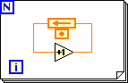

图 3.43通过直接连线创建出的反馈节点

### 2. 反馈节点的参数设置

反馈节点和移位寄存器的功能与本质是完全相同的。反馈节点的优点在于它不需要从循环的边框上连接数据线。因此，可以把程序写得更简洁美观。尤其是熟悉反馈概念的控制或电子专业的工程师们，可以直观地理解这一节点的用途。由于反馈节点实际依赖于循环结构，而它们之间又没有数据线相连，使用反馈节点时，一不小心就可能把逻辑关系弄错。另外，反馈节点也会导致某些连线上数据的逆向流动。如果逆向数据线过长，不利于阅读程序，就不如使用移位寄存器了。

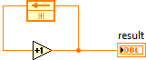

图3.44 单独使用反馈节点是无法判断运行结果的

如果单独查看图3.44所示的程序，因为既不知道反馈节点的初始状态，也不知道它运行了多少次，也就无法判断其运行结果。只有给定了这两个条件，才能推算出程序的运行结果。比如图3.45所示的程序，运行结果是5。

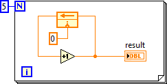\
图3.45 单层循环中的反馈节点

\
图3.46 多层嵌套循环中的反馈节点

在循环嵌套的程序中，反馈节点是针对于包含它的每一层循环结构的。它相当于在包含它的每一层循环结构上都建立了一对移位寄存器，然后把它们串联起来。因此，图3.46所示的程序运行的结果是25。

特别值得注意的是，反馈节点与包含它的循环结构不一定位于同一个VI中。比如图3.45所示的简单程序，在它作为子VI的时候，运行调用它的主VI，result输出的值可能不是5，也就是说初始化的值似乎不起作用。这是因为这个子VI的某个上层VI中也有循环结构，而这个循环结构能够影响它所包含的子VI中的反馈节点。

反馈节点有个启用输入端，右键点击反馈节点，选择"显示启用接线端"可以显示出这个输入端。它的输入为真时，反馈节点正常工作；输入为假时，反馈节点在这一循环并不工作，而是输出上一次执行或循环的数据。读者可以根据前文的描述，判断图3.47中的程序的运行结果。

在这个程序中，反馈节点只有在i为偶数时才工作，因此程序是在统计0\~4中有几个偶数，结果为3。

\
图3.47 带启用输入端的反馈节点

移位寄存器除了可以返回上一次迭代的数据，还可以返回上n次的迭代数据。反馈节点也有类似功能（并不完全相同）。右键点击反馈节点，打开它的属性配置对话框，在配置中可以选择延时的次数。比如设置延迟3次，那么反馈节点每3次迭代才把数据反馈一次。比如图3.48的这个程序，result控件在程序的5次迭代中分别返回值1、1、1、2、2......，其运行结果是2。

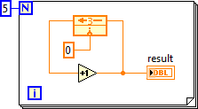\
图3.48 带延迟的反馈节点

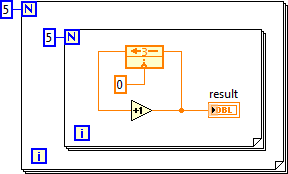\
图3.49 带延迟的多层循环嵌套的反馈节点

在图3.49的程序中，result总共经历25次迭代。在这个多层嵌套的循环中，带延迟的反馈节点依然是每隔3次迭代（最里层循环的迭代）返回一次反馈数据。每次迭代返回的数据分别是：1、1、1、2、2、2、3、3、3、4、4、4、5、5、5、6、6、6、7、7、7、8、8、8、9。也就是最终结果为9。

最后，读者可以分析一下图3.60这个程序的运行结果应该是多少？

\
图3.50 设置复杂的反馈节点

读者可能已经发现直接估算图3.50所示的程序的运行结果是非常困难的，本书实际上是把它作为良好程序风格的一个反例。在完成所需功能的前提下，程序越简单易懂越好。应当尽量避免图3.50这种让人容易引起混淆的代码。

### 3. 在子VI中直接使用反馈节点

如图3.51所示，在子VI中，反馈节点也可以脱离循环结构单独存在。也就是说反馈节点可以建立自己的移位寄存器，而不需要循环结构。

\
图3.51 独立使用的反馈节点

\
图3.52调用带有反馈节点子VI的循环结构

在图3.52所示的这个程序中，主VI放置了两个"子VI.vi"的实例（或者说在两处调用了同一个子VI）。那么，两个"子VI.vi"的实例，它们内部的反馈节点是共享一个移位寄存器，还是每个实例单独使用自己的移位寄存器呢？

运行图3.52的程序，结果如图3.53所示。从这一运行结果可以看出，它们分享了同一个移位寄存器。

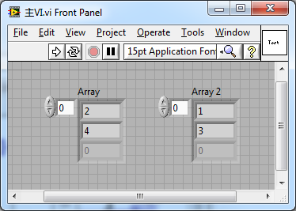\
图3.53 图3.52程序的运行结果

即使子VI在不同的循环中被调用（参见图3.54所示），它们也都是共用同一个移位寄存器的。&#x20;

\
图3.54在不同循环结构中调用同一带有反馈节点的子VI

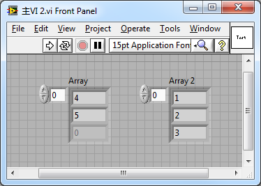\
图3.55 图3.54程序的运行结果

只有把子VI设置成为每个实例都生成副本的[可重入运行方式](pattern_reentrant_vi)时，不同的子VI实例才具有独立的移位寄存器。

## 结束条件

在for循环结构的右键菜单中选择"条件接线端"，可以为for循环创建一个接收停止循环命令的接线端。它类似于C语言中跳出循环的break语句。

图 .44中途停止循环

有时候，循环尚未完成全部迭代，就已经得到所需答案，那么循环也没必要再继续。如图 3.44中的程序，用于查找"数组"中是否有元素与"字符串"的值相同。如果找到，则传"真"值给条件接线端，停止循环运行。

条件接线端有两种停止模式，即可以接收"真"值，让循环停止运行；也可以接收"假"值，让循环停止运行。当条件接线端显示为一个红色圆形时，表示收到"真"值，停止循环运行。鼠标单击条件接线端，使其变成绿色环形箭头，则表示在收到"假"值时，停止循环运行。这一点与while循环是相同的，下一节就不再重复了。

## while循环结构

while循环的功能与for循环类似，用于把循环结构体内的代码重复执行一定次数。

与for循环不同的是，while循环在运行前不能确定循环的次数，只能在循环开始执行后，再根据传入"条件接线端"的数据判断是否执行下一迭代。这与文本语言中的do\...
while\...
循环语句类似。如果程序的逻辑是先执行循环，再判断是否停止循环，则应当首先考虑使用while循环。

由于while循环至少会执行迭代一次，所以图
3.35中的程序如果使用while循环，是不会出错的。循环只要迭代一次，即可把输入隧道的数据传递至输出隧道，这样就可以保证"输出整数"的值为"33"。

for循环结构中使用的数据传递方式（隧道、移位寄存器和反馈节点）及其使用方法，也适用于while循环结构。但在使用索引隧道时需要注意，while循环的迭代次数只受控于传入"条件接线端"的数据，而不受连接索引隧道的数组长度的影响。因此，while循环的迭代次数可以超过输入数组的长度，此时是无法从数组中得到有效元素的数据的，输入隧道只能使用默认值。另外，把数组数据连线到for循环结构内部，LabVIEW会自动为其创建一个索引隧道；而连接数组到while循环结构内部，则默认为其创建一个普通隧道。

使用输出索引隧道时，while循环的效率比for循环稍差。

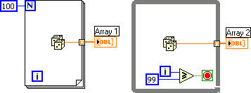

图 .45使用循环构造数组

如图
3.45中的程序，分别在两种循环结构中通过输出索引隧道构造一个数组。这两种循环所产生的数组大小是相同的。如果使用的是for循环，LabVIEW在循环运行之前，就已经知道数组的大小是100，因此LabVIEW可以预先为Array1分配一个大小为100的数据存储空间。但是对于while循环，由于循环次数不能在循环运行前确定，LabVIEW无法事先就为Array2分配合适的内存空间，而是在while循环的过程中不断调整Array2数据空间的大小，这些额外工作使得while循环效率降低。

因此，在可以确定循环次数的情形下，更适合使用for循环。

## 练习

* 编写一个VI，利用循环结构计算从33到62之间所有整数的和。
