# 界面设计实例

虽然上面已经介绍了很多界面设计的原理和规范，但实际界面设计是非常灵活的，同一个功能可以有很多种设计方式。

为了对界面设计中的各种方法有进一步的了解，下面用编写一个黑白棋游戏的界面为例，来介绍一些具体的技巧。利用这些技巧可以让界面编写更快捷、美观。之所以选择黑白棋，是因为这个游戏比较有趣味性，而它的界面又不是特别复杂，适合作为教学范例。黑白棋的棋盘由 8×8 个正方格组成，旗子为黑白两色，放置在方格中。关于这个游戏的游戏规则，在互联网上可以方便地查找到。

编写这样一个界面可以使用多种不同的思路和技巧，以下将按照从简到繁的顺序，分几步来介绍几个不同的方法。

## 利用 LabVIEW 自带控件

界面设计的时候，首先要考虑尽可能使用或借助已有的控件。借用已有控件可以大大缩短开发时间。这个游戏界面上的按钮、文本框等均可以使用 LabVIEW 自带的控件。黑白棋的棋盘棋子，也可以上网找一找，看有没有别人已经做好的可供使用的控件。

假如没有现成的控件可以借用，那就得自己动手做了。有时，虽然作为整体，没有现成的东西可用，但在把它分解成更小的基础部分后，完全有可能利用一些已有控件的。

比如说棋子：这个游戏的棋子为圆形，只有黑白两色，个数最多 64 个。这个特点很适合用 LabVIEW 中的圆形指示灯控件来表示，圆形指示灯的外观与 LED 灯泡相似图
10.41。

图 .41 LabVIEW 中的圆形指示灯控件

为了使它看起来更像真的棋子模样，还要对它进行一些加工：把它的尺寸调大；用工具选板上的颜色画笔工具把它在 "真"" 假 "状态下的颜色分别设置成黑色和白色；给它起一个有意义的标签名："chess
0"，并在前面板上把标签隐藏起来，标签名称是为了以后编程用的。改进后的棋子，外观如图
10.42 所示：

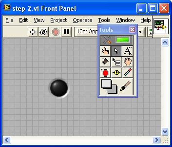

图 .42 改善后棋子的外观

黑白棋总共需要 64 个这样的棋子，并排成 8 行 8 列。其它棋子可以以第一个棋子为模板，拷贝复制，就生成了第二个；再把两个棋子都选中，复制生成四个；重复这一过程，依次生成了 8、16、32、64 个棋子。如图
10.43 所示：

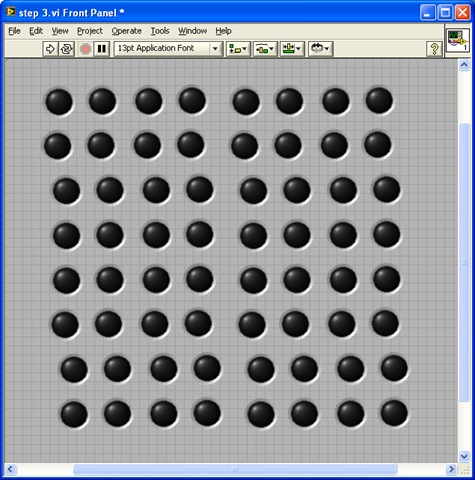

图 .43 整个游戏共需要 64 个棋子

接下来需要把这些棋子排列整齐。利用工具条上的 "对齐对象"，"分布对象"，"调整对象大小" 等几个工具，可快速地把 64 个棋子排列整齐。首先利用对齐工具把首行和首列棋子对齐、再利用间距调整按钮使它们间距均匀。然后利用对齐工具让其它棋子都与首行首列对齐即可。调整好的界面如图
10.44 所示：

图 .44 排列整齐的 64 颗棋子

到此为止，棋子的界面部分就完全设计好了。我们需要进一步考虑编写棋子在游戏过程中不断变化时，它的相关的程序代码。

## 实现运行时改变界面的代码

64 颗棋子并非总是显示在屏幕上的。游戏一开始，屏幕上只有四颗棋子，以后每走一步多一颗棋子。LabVIEW 的每个控件都有一个 "可见（Visible）" 属性，用来控制控件是否需要在前面板上显示出来。棋盘的某个位置还没有放棋子时，可将该位置的棋子控件隐藏起来。这只需要一个非常简单的控件属性设置操作（图
10.45）。

图 .45 使用控件的属性节点设置控件隐藏

设计界面时，经常会遇到这种情况：有些控件在某些特定情况下出现在界面上，在另一些情况下必须隐藏起来。解决这一类问题有几种最常见的解决方案。

一是上面提到的，可以在不需要看见某个控件时设置它的可见属性为 "假"，将其隐藏；在需要显示时，再将它的可见属性设置为真。假如控件数量较少，则这种方法编写代码比较简单，但是不易于界面编辑调试。有时候程序停止时，控件却恰好隐藏了，还需要先找到它、把它变为可见才能对其编辑修改。此外，在有多种不同的控件需要在界面的同一位置轮流出现的情况下，编调程序更是麻烦。多个控件需要在同一位置上重叠摆放，必然有些控件被其他控件遮挡，很不利于对其进行编辑调整。

第二种方法是通过控件的 "位置（Position）" 属性，设置它在界面上的位置。需要显示控件时，把它设定到应该出现的位置；需要隐藏它的时候，把它挪到 VI 前面板可视范围之外的某个位置。比如说，VI 前面板显示区域的大小是 500×400，把控件挪到相对界面左上角 100×600 的地方，用户就不会在程序运行时的界面上看到这个控件了。而需要编辑这个控件的时候，可以拖动 VI 前面板上的滚动条，找到控件，再对其编辑。

使用这种方法，优点是在任何情况下都可以在 VI 前面板上找到控件，进行编辑修改。但是需要在程序中设定控件的位置，需要精心设计控件的位置坐标，编程相对繁琐。

如果有一组控件需要同时出现或隐藏，还可以考虑利用选项卡控件。把这一组控件添加在选项卡控件的某个页面上，调整选项卡控件的显示页面，就控制了控件是否出现。如果把选项卡设置为透明，则可以更加灵活地控制控件的显示或隐藏。向导类型的界面是一种比较常见的界面类型，用户完成一个步骤的操作，点击界面上的 "下一步" 或者 "上一步" 按钮，就会出现一个包含了新内容的新界面。这类界面非常适合使用选项卡控件。选项卡控件的每一页对应向导中的每一个步骤。点击 "下一步" 或者 "上一步"，便可以切换到选项卡的另一页。

重新回到黑白棋游戏程序上来。打开程序的框图，可以看到整齐排列着的 64 个控件端子（图
10.46）。假如要分别对它们一一进行操作，光这 64 个控件端子的连线就已经使得程序代码变得非常杂乱难懂了。为了让程序简明清晰，可以把这 64 个控件按照其在棋盘上的位置，组织成一个 8×8 的二维数组。之后，程序要对哪个位置的棋子进行操作就一目了然了。

图 .46 整齐排列的控件接线端

直接把它们组成数组的方法是为每个控件建立一个引用，然后使用创建数组函数把它们组织起来。但是对 64 个控件进行一一操作还是够麻烦的。这其实完全可以通过编程解决。由于这 64 粒棋子的名字是有规律的，因此可通过如图
10.47 所示的程序，按照名字一一得到这些控件的引用，再将得到的引用转换成 8×8 的数组。

图 .47 得到所有控件的引用

在这段程序中，有一个名为 "Get Control.vi" 的
子 VI。它的功能是按照控件的名字得到一个控件的引用。要得到一个控件的引用有很多种方法，因为这个 VI 已经存在于 LabVIEW 中（\[LabVIEW\]\\resource\\importtools\\Common\\VI
Scripting\\VI\\Front Panel\\Method\\Get
Control.vi），所以就方便地直接把它拿来使用了。

这段代码输出的 "chess
array" 是一个 8×8 数组，它包含了所有 64 个控件。往后，程序需对棋子进行操作，可以先从中得到相应位置的棋子的引用，再对其进行操作。

实际编程时，可能会需要编写更为复杂的界面。而且，需要在子 VI 中对界面上的多个控件的属性进行设置。这需要把这些控件的引用全部传递到子 VI 中去。有一个简便直观的做法，即在程序开始时，为主 VI 界面上控件建立引用，把这些引用捆绑成一个簇，传递到子 VI 中去。因为控件的个数较多，使用簇可以减少程序框图上数据线的数量。

这种方法的缺点也很明显，一旦界面发生变化，比如增减或改变了某个控件。这个包含所有控件引用的簇自然而然也要被修改，而所有使用到这个簇的 VI 也都可能需要被修改，相当不便。所以，这样的程序也可以使用上段文字介绍的、使用 "Get
Control.vi" 子 VI 方案，只把主 VI 的引用传递给子 VI，在使用到某个主 VI 控件的时候，按照名字得到它的引用再对其进行操作。

## 装饰和背景图片

棋子都已经摆放到位了，下面考虑如何把棋盘加上去。由于棋盘是静态不动的，设计比较简单。LabVIEW 自带了包括线条、方块等各种形状的装饰组件（在控件选板 "新式 -\> 修饰" 中）。利用这些装饰图案，很容易搭建出一个棋盘来。图
10.48 就是由几根黑色线条组成的部分棋盘。

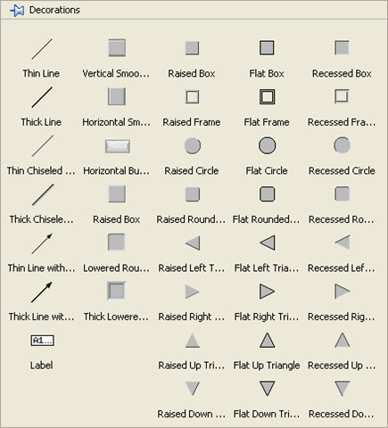

图 .48 把修饰用的直线应用于界面

在编写程序界面时，装饰最常用的用法，是用来将一组相关联的控件包围起来，或把不相关的控件相互隔离开。

利用 LabVIEW 自带的简单图形拼画出来的棋盘也许不够漂亮。想得到更漂亮的棋盘，可以先使用专业画图工具（或者画图板）先画一个漂亮的棋盘，保存成图片文件。然后，把图片贴到 VI 的前面板，当作背景图片。这样，就可以得到一个漂亮的棋盘了。

若需把图片放置到 VI 前面板上，可以用 Ctrl+C、Ctrl+V 复制图片；也可以直接在文件浏览器中，用鼠标把图片文件拖拽到 VI 前面板。拖拽到 VI 上的图片，位于界面最上层，覆盖住了棋子。利用 VI 前面板工具条上 "重新排序" 工具中的 "移至后面"，可以把它挪到最下层。调整好棋子和棋盘的位置，如图
10.49 所示，一个棋子棋盘界面就做好了。

图 .49 带有专业制作的棋盘背景图片的程序界面

棋盘棋子的相对位置应该是固定的。用鼠标把棋盘和全部棋子选中，再在 "重新排序" 工具中选择 "组合"
，就可以把它们设定为一组。之后，这一组控件之间的相对位置就固定下来了，只能同时在界面上同步移动。而如果选择了 "锁定"，则被选中的控件将被完全锁定在界面上，不能移动。

图
10.49 中粘贴上的图片是矩形的，可是有时候也许需要不规则形状的背景图片。这需要使用支持透明色的图片格式，比如 gif 格式，把不规则图片空白部分设为透明即可。还有一种常用的文件格式 png 格式，支持像素点透明度的设置，利用不同的透明度设置还可以给背景图片做出阴影等效果。例如图
10.50 中的 VI，它的界面上两个粉色的带阴影效果的解说框，使用的就是 png 文件格式的图片。

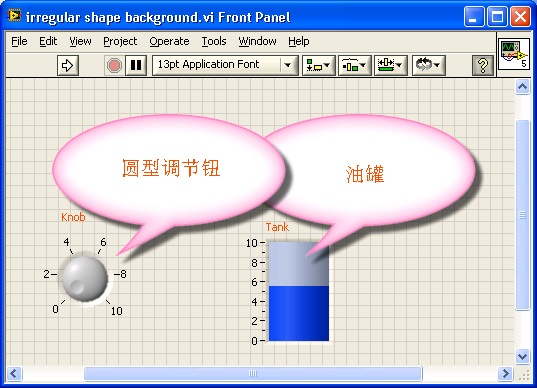

图 .50 在界面上添加不规则图形的图片

编写程序过程中，界面的尺寸随时可能更改，而通过粘贴得到的图片，其大小尺寸是固定的，故不适合做背景图片。而通过设置 VI 前面板窗格的属性，可以让整个前面板都被某一背景图片铺满。鼠标右键点击前面板窗口的滚动条，选择 "属性"，在 "背景" 设置中选择一个背景，或添加一幅所选的图片，就可以在 VI 前面板上铺设所选的背景图片了。图
10.51 是选择 "Clouds" 背景的效果。

图 .51 设置 VI 前面板的背景图片

## 用户自定义控件

至此，棋盘已经很漂亮了，而棋子看上去仍然像个灯泡。可以通过制作自定义控件，为棋子制作一个外观如同真实棋子那样的专用控件。

对棋子外观影响最大的是棋子周围一圈的光影效果，可以设法把这个光圈移走。右键点击一颗棋子，按照第 10.2.6 节介绍的制作用户自定义控件的方法，选中棋子最外面那个白色的框，即边框，删除即可。编辑完成后保存，新的棋子就不再有边框了。其实针对这个 "棋子" 而言，去除边框圈有一个最简单的办法：在该控件的右键菜单的 "显示项" 栏中，放弃选择 "始终"（英文是 decal，正确中文翻译应为 "印花花边"）项即可（图
10.52）。

图 .52 移除灯泡控件的光影效果

如果需要进一步制作更加美观的自定义控件，那就需要利用专业制图工具做出精美的图片，再应用于控件上。如何制作精美图片，已经超出了本书的范围，读者如感兴趣，可以查阅相关书籍和资料。图
10.53 就是通过专业图像处理软件做成的一个带有阴影效果的棋子按钮。

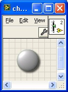

图 .53 外观更像真实棋子的控件

所有的控件都可以选择严格类型定义。以后，如若在严格类型定义 ctl 文件中改动了控件，则界面上所有用到的该自定义控件都会有相应的一模一样的改动。

## 改进界面的实现方法

到目前为止，棋盘棋子的界面已经基本成型。下面编写一小段代码，来验证这个界面设计方案，看看是否可行，如何改进。

以棋盘的初始化为例。在游戏开始时，只有两黑、两白，共四颗棋子，摆在棋盘的最中央。实现这个操作的代码和执行结果如图
10.54 和图 10.55 所示。

图 .54 摆放 4 颗棋子的程序框图

图 .55 运行后的界面效果

示例中的子 VI，Get All Chess.vi（即图
10.47 中的 VI），负责得到所有棋子的引用，并排列成二维数组。

这段程序并不算复杂，但是还是可以发现其中存在一些问题。棋子的布局需要用两个数组才可表达清楚，这给编程增加了负担。造成这一状况的根本原因在于：每个位置上的棋子实际上存在三种状态：黑、白、无。而灯泡控件，只有两个值：真、假。用这两个值还不能完全表达棋子的状态，必须还要利用控件的可见属性。所以，要两个布尔类型的数组才能确定一个棋子的状态。

另外，要判断鼠标点击在棋盘哪个位置上，也比较繁琐。程序中只能得到鼠标相对于 VI 前面板左上角的位置信息。一旦棋盘挪动，用于计算鼠标点击位置的代码也需要做相应改动。

为此，考虑对这个界面再进行一点改进，使用一个具有更多值的控件来表示棋子。在这个程序中，可以使用 "经典 -\> 经典下拉列表和枚举 -\> 图片下拉列表" 控件。为图片下拉列表控件设定三个值：空白图片、黑色棋子图片、白色棋子图片（图
10.56）。棋子采用的都是 png 文件格式的图片，以实现透明和阴影效果。

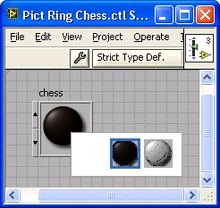

图 .56 创建一个图片下拉列表控件

在程序中，不希望出现图片下拉列表控件的边框和背景。为此，可以用透明画笔，把边框和背景画为透明（图
10.57）。

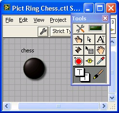

图 .57 最终效果

这样，即便棋盘上看不到任何棋子，由于图片下拉列表控件的存在，只要监视图片下拉列表的鼠标点击事件就可以判断用户是否进行了 "下棋" 操作。

至此，前面的设计中还有一项不足。每个棋子都是一个独立的控件，以至于界面控件太多，不好管理。对于更复杂的程序，比如围棋游戏，如果使用这种方式，界面上就有将近 400 个控件，这是无法接受的。

改进的方法是使用数组控件，即把包含棋子图片的图片下拉列表控件组成一个数组。建立一个二维数组用来放置棋子元素。对于那些不希望被看到的界面上数组的边框和背景，同样可以用透明画笔把它们设置为透明。数组的标签、索引显示，可以通过数组的右键菜单 "显示项 -\> 索引框"，进行隐藏（图
10.58）。

图 .58 使用数组的界面效果

把棋子元素放置于数组中，并把数组拉成 8×8 的大小，放置在棋盘上。一个棋盘棋子控件就做好了。这种做法大大简化了编码的复杂度。比如，同样是初始化设置，只要一个赋值语句就可完成（图
10.59）。

图 .59 初始化数组数据类型的棋盘控件，代码非常简洁

## 使用绘图控件

有时候，程序需要能够画出一个比较复杂的图形或曲线，也许 LabVIEW 并没有提供相应的控件。但仍然可以借用 LabVIEW 已有的控件，配上一些代码，成为一个具有特定功能的控件。

常被用来作为这种基本控件的有 XY 图、三维图片控件、图片控件等。比如，需要有一个绘制极坐标函数曲线的控件，那就可以在 XY 图的基础上改造。编写一个转换用的 VI，把点的极坐标转换成直角坐标系下的值，在 XY 图上绘制出来就可以了。如果需要某个支持某种特定三维绘图方式的控件，那也可以通过改造三维图片控件得到。

图片控件是一个更为基础的控件，很多具有特殊效果的界面元素都可以利用图片控件制作。比如，需要制作带图标的菜单，或类似 LabVIEW 函数选板的菜单等。虽然 LabVIEW 没有提供现成的控件，也可以在图片控件上把这些效果都画出来，前面介绍的棋盘棋子界面也可以使用图片控件来制作。

下面介绍实现这个界面的具体过程。

第一步，创建一个空白的图片控件（图
10.60）。图片控件的常用操作都位于 "编程 -\> 图形与声音 -\> 图片函数" 函数选板中（图
10.61）；读写图形文件的函数位于 "编程 -\> 图形与声音 -\> 图形格式" 函数选板中。

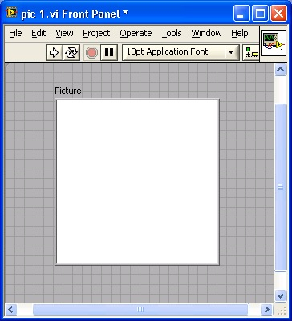

图 .60 VI 前面板上放置的空白图片控件

图 .61 图片函数选板

与前面介绍的方法不同，使用图片控件制作棋盘棋子的过程，并非在 VI 编辑状态下进行的，而是需要在程序运行中绘制。所以，下面所介绍的界面设计工作都要通过编程来完成。

图片控件具有 "画前清除图片" 属性，它有 3 个值。

0：表示从不擦除。也就是说，每次传一个数据给这个控件，比如一个圆环图案，图片上显示的并非只有这个圆环，而是把圆环叠加在原本的内容之上。如果想画一个有三个矩形组成的图案，可以分三次画。每一次给图片控件传递一个矩形图案，三次组合成了包含三个矩形的图案。

2：表示每次都擦除。每次给图片控件传递一个图案，它都会将原来的图案擦掉，仅保留这一次的图形。擦除图案后，图片控件会显示默认的白色。所以，使用这种方式，用户在绘制图案时可能会看到图片闪烁一下。若非必要，尽量不要使用这种方式。

1：表示程序第一次运行时，清除图片上的内容，相当于做了初始化。这里也使用这种方式。就是说，程序开始运行时，重新绘制整个棋盘；之后，棋盘布局发生变化时，仅更新发生了变动的位置，不必重绘整幅图。

图 .62 图片控件的画前清除图片属性

棋盘在棋子的下层，所以要先画棋盘。画棋盘可以使用 LabVIEW 提供的划线函数，一条线一条线画出来。因为我们之前已经制作了棋盘的图片，所以可以直接把这张图片显示出来。代码如图
10.63 所示。LabVIEW 自带的函数仅支持 bmp、jpg、png 三种图像文件格式，如果需要打开一个其它格式的文件，比如 gif 文件，需要先使用其它专业工具把 gif 文件转换成 LabVIEW 可以接受的文件格式，再在 LabVIEW 中使用（图
10.64）。

图 .63 把图片文件在图片控件上显示出来

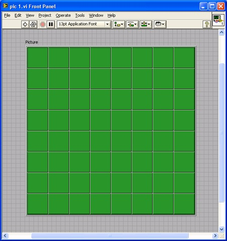

图 .64 在界面上绘制的效果

然后，再画上棋盘初始时的四个棋子。画棋子的方法与棋盘相同，可以使用画圆函数，也可以使用已经制作好的图片（图
10.65、图 10.66）。

图 .65 在图片控件上绘制棋盘和棋子

图 .66 绘制效果

到目前为止，棋盘界面设计的几种方法都已经介绍完了。如果能够把这个黑白棋的相关界面和操作（比如放置棋子，反转棋子等）提取出来，合成一个组件，公布出来，其他有类似需求的人就可以直接利用这个组件，而不再需要自己重新设计了。

然而，在 LabVIEW
8 之前是无法实现这一功能的。因为控制棋子行为的代码分散在程序的各处，而棋盘棋子也是主 VI 的一部分，很难将它们提取出来组成独立模块。LabVIEW
8 中出现的 XControl 可以把控件的界面及行为封装在一起，成为一个既有界面，又有运行代码的组件。在后续的章节中会进一步介绍如何制作一个可独立发布的组件。

## 界面的特殊效果

### 半透明效果

有的程序，比如某些 MP3 播放器，可以始终运行在桌面最前端。为了不挡住后面的窗口，它们在运行时，可以被设置为半透明状态。这样，还可以透过它们，看到后面窗口的内容。

LabVIEW 编写的程序界面也可以达到同样的效果。选择 VI 属性设置的窗口外观属性页面，按动 "自定义" 按钮，进入 "自定义窗口外观" 页。页中有一项可以设置 VI 前面板在运行时的透明度，使界面变为半透明状态（图
10.67）。

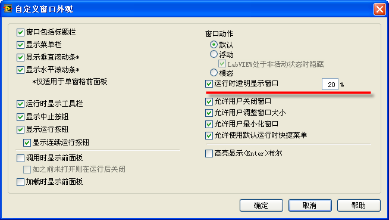

图 .67 设置窗口半透明的属性

这一属性也可以在程序运行时被动态改变。其中，VI 的 "前面板窗口 -\> 以透明方式运行 VI"（FP:RunTransparently）属性用于设置是否透明；"前面板窗口 -\> 透明度"（FP:Transparency）属性用于设置透明度。图
10.68 显示了一个动态改变这一属性的程序及其运行效果。

图 .68 VI 前面板在运行时变为半透明，可以透过它看到后面的程序框图

### 不规则形状

有的程序界面需要的不是规则的矩形窗口，而是一个特殊形状。这种风格在媒体播放器软件中最常见。比如，常见的 mp3 播放软件，都具有 "换皮肤" 功能，以各种不规则形状来展现自己。

LabVIEW 编写的程序也可以达到类似效果。但实际上，这不是一个 LabVIEW 直接提供的功能，而是 Windows
API 提供的功能。LabVIEW 只需要调用几个简单的 Windows
API 函数即可达到类似效果。

制作不规则界面的步骤如下。先在界面上放置一个不规则图形，然后通过调用 Windows
API 函数把界面的背景变透明。这样，显示出来的就是一个不规则的界面了。其程序如图
10.69 所示。

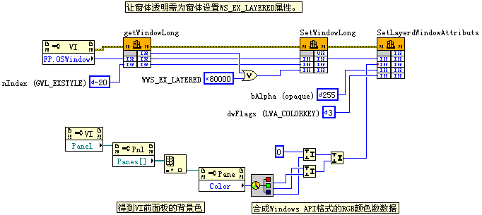

图 .69 生成不规则界面的程序

在这个程序中分别调用了三个 Windows
API 函数：GetWindowLong，SetWindowLong，SetLayeredWindowAttributes。前两个函数用于设置窗口的属性，允许把窗口设置为透明的状态。最后一个函数，用于把窗口中某一特定颜色的区域都设置为透明。在这个程序中，把 VI 前面板上使用默认的背景颜色的区域都设置为透明。需要注意的是，由于 LabVIEW 采用的是高地址位存高位数据方式，它的 RGB 颜色数据格式与 Windows
API 采用的格式略有不同，需要转换一下。

此外，为了保证程序运行中只留有界面上的不规则图形，需要在 VI 属性的窗口外观设置中，把窗口的标题栏、滚动条等都去掉（图
10.70）。

图 .70 窗口外观设置

图 .71 不规则界面运行效果

图
10.71 中两幅截图是程序运行的效果。第一幅图是在 VI 未运行时截取的，VI 的前面板上有一个类似气泡的粉红色图形。第二图是 VI 运行后的效果。此时，VI 的前面板就只有粉红色气泡部分被显示出来。其余部分都已透明，可以透过其透明部分看到后面的 VI 程序框图。

## 动画

在 LabVIEW 中如果需要显示复杂的动画，可以通过调用其它共享库、ActiveX 控件等方法。比如，调用 OpenGL 库制作三维动画，或者播放 Flash 动画等。但是对于一些简单的动画，可以直接通过 LabVIEW 基本编程方法实现。简单的动画实际上就是连续显示一组静态的图片。这里介绍两个最简单的方法。

1. 如果动画效果是一个控件在屏幕上移动，或者放大缩小等，可以通过设置控件的位置、尺寸等属性来实现。
2. 如果要实现更复杂的效果，可以使用图片控件，连续地在图片控件中绘制一组图片，实现动画的效果。

比如，我们需要制作一个不停滚动的车轮。可以先制作一组车轮在不同转动角度上的图片。把这组图片按照顺序分别显示出来，则看上去，车轮是在滚动的。图 10.72 所示的是一个图片下拉列表控件，它包括了车轮在各个角度时的图片。只要在程序中让这个控件的值持续加一，则看上去车轮就如同旋转起来了。

图 .72 车轮控件

我们可以同时再设置控件的位置，让它不但旋转，而且同时移动。这样看起来的效果就是车轮在滚动前进（图 10.73）。

图 .73 使车轮滚动的程序

再配合上前面所讲的制作不规则界面的方法，最终可以实现一个车轮在屏幕上来回滚动的效果（图 10.74）。

图 .74 车轮在屏幕上滚动的效果