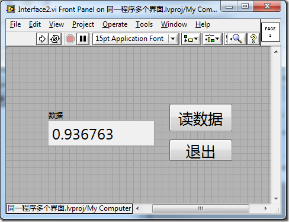
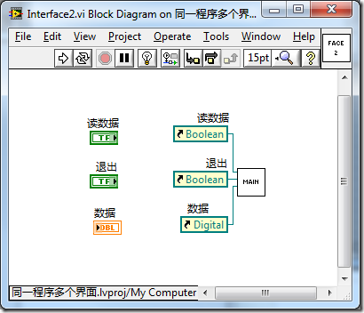
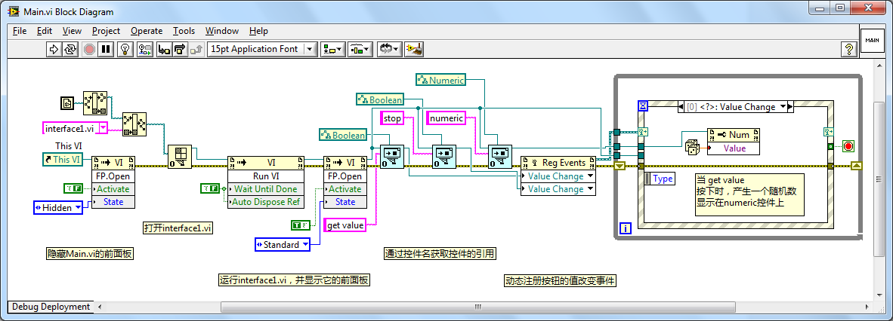

# 复杂界面的模块划分

## 界面的模块划分

对于比较复杂的程序框图，最好把它划分为多个子 VI。这样，每个子 VI 都不会太复杂，可以大大提高程序的可读性和可维护性。对于界面来说，也是如此。如果一个界面过于复杂，最好也把它划分为多个模块。这不仅利于程序本身的编写维护，还可以方便用户使用和操作界面。

有些程序要求用户输入的信息非常多，比如，LabVIEW 的 "选项" 窗口就是如此（图
12.1）。这个窗口提供了 LabVIEW 中各种各样的设置信息，若是完全平铺在界面上，一个大屏幕也放置不下。而且，界面上的控件若是太多，用户也很难找到他所需的内容。因此，LabVIEW 选项界面把不同的设置按照功能的相似性，分成了若干组，每次只显示其中一组的设置信息。用户可以通过界面左侧的 "类别" 列表来选择显示哪一组的设置。

图 .1 LabVIEW 选项界面

再另举一个例子。比如 LabVIEW 中的导入共享库工具（图
12.2），用于把 DLL 文件中的函数都包装成 LabVIEW 的 VI。这一过程会要求用户提供比较多的信息，如 DLL 的文件名、生成 VI 的名字等。它与前面的例子面临相同的问题。若一次把这些设置都显示给用户，用户就无从下手了。导入共享库工具采用了与 LabVIEW 选项窗口稍有不同的解决方案。它使用了向导型界面来帮助用户操作。向导型界面与 LabVIEW 选项界面的区别在于，它通过 "上一步"、"下一步" 按钮来切换当前显示的配置。如果程序所需的各种信息或设置之间有先后依赖关系，那么采用向导型界面更为合适。

图 .2 导入共享库工具

前面介绍的两种类型的界面都有一个共同点，即把为数众多的控件按照相关性，分成多个组，每次只显示一组给用户，从而使程序界面变得清晰而且易于操作。

这两种界面在编程实现时，采用的也是类似的机制。唯一不同点是控制显示页面（即显示哪一组控件）切换的方式不同。一个可以任意显示出某个页面；另一个只能按顺序切换页面。

下面以向导型的程序为例，说明如何实现这类有多个页面的界面程序。

## 选项卡控件

向导型的程序有多个页面，每个页面上有表示不同含义的各种控件，这正适合于使用选项卡控件（图
12.3）。选项卡控件是一种在应用程序的设置对话框中非常常见的控件。它有多个卡片页组成，用户点击某一页对应的标签，控件就会把这一页的内容显示出来，而隐藏其它的卡片页。

图 .3 LabVIEW 中的选项卡控件

在设计向导型程序的时候，可以利用选项卡控件的这一特征，使向导程序各页与选项卡上各页一一对应（图
12.4）。把选项卡页面的标签隐藏起来，在程序中切换需要显示的页。

图 .4 某一向导型程序界面 VI 的前面板

图
12.4 是一个向导型程序在编辑状态时的界面。若拉大 VI 前面板的显示区域，就可以清楚地看出，这个 VI 前面板上首先放置的是一个大个的选项卡控件。其它用于程序运行时的控件都被放置在了选项卡的相应页上。

图 .5 切换显示页的程序框图

如果用户点击了 "下一步" 按钮，则在程序框图中通过设置选项卡的值，使其显示下一页面。（如图
12.5 所示。）

选项卡控件大大简化了程序界面的设计和编写，也方便了用户的使用。但是，它并不能显著地简化程序框图和改善程序的可读性和可维护性。这是因为即便使用了选项卡控件，用户所需要的所有控件还是全部被放置在了这个主界面 VI 上。对于这些控件的处理、包括对页面显示的控制代码全部都要在主 VI 上完成。对于比较复杂的界面，也许需要有十来个页面，那么前面板上所有的控件可能就会多达几十个。如果 VI 程序框图采用循环事件结构，也至少需要相应地处理几十个事件（图
12.6）。

图 .6 复杂界面的程序需要处理非常多的事件（本图中只列出了一部分事件）

对于这样的程序框图，别说读懂它的程序逻辑，就算是要找到某一个事件，也要一条一条查看一阵子才能找到。假如你打算在原有的向导中增加一个步骤，其工作量会大大超出你的预想。因此，若想提高程序的可读性、可维护性，除了把界面分页之外，处理它们的程序代码也必须分成模块才行。

## 子面板

子面板控件（图
12.7）在控件选板 "新式 -\> 容器" 中。它可以在主界面 VI 中把另一个 VI 的前面板显示出来。使用子面板控件时，首先把它拖到主 VI 前面板上。它在前面板上看上去是一个透明的框。这个控件有些特殊，需要在 VI 程序框图上实现一些代码，才可以让它在主界面 VI 运行时，显示另一个子界面 VI 的前面板。

图 .7 空的子面板控件

为了演示这一控件，首先要创建一个子界面 VI（图
12.8）。等主界面 VI 运行之后，子面板控件会显示出这个子界面 VI 的前面板。

图 .8 子界面 VI 的前面板

接下来，要编写装入子面板的程序代码。同其它控件不同，子面板控件被放置在主 VI 前面板上时，在 VI 的程序框图中并没有一个与子面板控件相对应的接线端，而是出现一个它的调用节点。这个节点显示的方法是 "插入 VI"（"Insert
VI"），它的功能就是把另一个 VI 的前面板放到子面板控件中来。" 插入 VI" 的输入参数是那个需要被显示前面板的子界面 VI 的引用。因此，首先需要利用 VI
Scripting 的函数和节点，打开子界面 VI 的引用，再把它传递给子面板控件的 "插入 VI" 方法（图
12.9）。此处还要注意两点：一，如果子界面的 VI 前面板已经被打开了，就无法再把它插入到子面板控件中，故必须关闭其前面板。二，在主界面上是需要观察和控制子界面的，如果子界面不运行起来，就无法完成相应的功能，所以需要运行子界面 VI。

图 .9 插入子界面的程序框图

主界面 VI 运行起来后效果如图
12.10 所示。在主界面 VI 中可以观察子界面的变化，也可以对子界面进行控制。

图 .10 子面板的效果图

回过头再来考虑一下上一节所提到的向导型应用程序界面的实现方法。它的主要问题在于主界面上控件太多，不便维护。现在借助于子面板控件，可以找到一条更为合理的实现途径：使用插件框架式程序架构来编写向导型的程序。图
12.11 是这种插件框架式程序结构的示意图。

图 .11 插件框架式的程序结构

插件框架式程序的实现思路是，把向导界面中的每个页面各自分配到一个独立的子界面 VI 上，这个页面上所有的操作，都由这个页面所在的子界面 VI 完成。图
12.11 左上部分就是为每个页面编写的子界面 VI。这些 VI 都被当作插件，在主程序需要的时候被调用并显示在主界面上。

图
12.11 右下角是主程序（主界面）VI。它前面板上最主要的区域是一个子面板控件，这个控件用于显示页面 VI 的前面板。在主程序需要显示向导中的某一步时，就把对应这一步骤的页面 VI 的前面板显示出来。这样就实现了向导功能。主程序的前面板上还有一些公共控件，比如 "上一步"、"下一步" 这样的按钮。这些按钮在所有步骤中都需要，所以可以放在主框架上，而不需要再在每个页面中重复了。

借助子面板控件搭建起来的插件框架式程序结构解决了复杂程序界面难以维护的问题。它把复杂界面划分为多个子 VI，每个子 VI 中的界面和代码都比较简单，非常容易阅读。这就大大简化了整个程序的维护工作。

但是，子面板仍然有一些使用不便之处。比如，需要编写一些额外的代码才能显示子界面；编辑状态下，看不到子界面，不利于界面调整；主界面与子界面 VI 之间，以及子界面 VI 相互之间的数据传递不是很方便；不方便把子界面作为一个公共模块发布给其它程序使用。

## XControl

实际上，由于同一家公司开发的软件之间多少会有些相似，所以软件开发过程中经常需要把一些界面模块作为公共模块，提供给多个应用程序共享。要让不同的程序方便地使用同一界面模块，这个模块就应当像一个 LabVIEW 中自带的控件那样，可以直接被拖拽到 VI 前面板上；可以直接调整大小；可以方便地和程序中其它函数和控件进行数据交换。

可不可以把 LabVIEW 的自定义控件作为共享模块呢？答案是不行。使用自定义控件可以自行制作一个控件的外观，但是不能自定义它的行为。但是比较复杂的共享界面模块通常是需要一些自定义行为的。这种相对独立的、有特定界面和功能的模块称之为组件。比如，图
12.12 就是一个非常常用的组件。

图 .12 用于添加和管理一组路径的界面组件

这个组件是用来帮助用户选择并管理一组路径的。如果应用程序中需要用户输入一组路径，就可以直接使用这个组件。

这个组件的界面由以下几个基本控件构成：一个列表框（list
box），用于显示所有路径；一个字符串输入控件（文本框），用于编辑某一路径；一个用于弹出路径浏览对话框的按钮；和四个用于添加、删除、以及调整路径显示顺序的按钮。

除了界面部分，这个组件还包括自定义的一些行为。最初，这个控件只是显示一组路径给用户，组件只使用列表框列出一组路径，用于编辑路径的文本框和浏览路径按钮是隐藏不见的。当用户用鼠标点击了列表框上的某一条路径，表示用户需要编辑这一路径。此时，组件需要把文本框和浏览路径按钮在鼠标点击的这一行显示出来，并使用这一行所显示的路径作为文本框的默认值，供用户编辑调整。还有其它一些行为：如，点击浏览按钮要弹出路径浏览对话框；点击向下移动按钮要使选中的路径向下移动一位等。

这个组件在程序中和外界的接口非常明确，是一个路径数组。它只要能够读写一组路径就可以了。

对于这样一个比较独立的组件，LabVIEW 提供了一个非常好的工具来制作它，这就是 XControl。也就是说，可以把上面提到的这个组件做成 LabVIEW 中的一个 XControl 控件。

LabVIEW 不但可以定义 XControl 外观，还可以定义它的数据类型和行为。XControl 可以如同 LabVIEW 自带的控件一样，在多个应用程序中共享或被发布给客户。并且也像普通控件一样，可以方便地被拖拽到 VI 的前面板上，然后使用其编程。

## 同一功能对应多种不同界面的应用程序

如果需要开发一套销售给多个用户的应用程序：每个用户对程序的功能需求是一致的，但对程序界面的需求却各自不同。比如，一个对同一产品进行测试的程序，但每个版本对界面的语言，以及控件的位置、尺寸、颜色等各有不同的需求。对于软件开发人员来说，最好的解决方案当然是一份程序的代码（程序框图）能够对应于多份界面（VI 前面板）。利用常规的方法是无法解决这个问题的，因为 LabVIEW 中每个 VI 只能拥有一个前面板和一个程序框图。

一般来说，程序中实现主界面的那个 VI 就是主 VI，主 VI 中的代码都是比较复杂的。在一个项目中设置维护多份复杂、而功能又相同的主 VI 显然不是一种优化的方法：大量的代码重复，不仅程序变得庞大；一旦在某一版本的主 VI 代码中发现一个错误或功能需求有改动，其它版本的主 VI 代码也必须要做同样的修改。

利用动态注册事件就可以优化上述的程序结构。动态注册事件的特性之一就是把界面和程序代码完全分离开来了。遇到上述需求，可以编写多个实现不同风格界面的 VI（以下简称为 "界面 VI"
）；以及一个无需显示界面、而专门负责完成各项功能的 VI（以下简称为 "功能 VI"）。界面 VI 的程序框图极其简单，只需维持程序持续运行（或许需要有一个空循环）以及能够把控件引用传递给功能 VI 即可；而功能 VI 的界面无需显示，项目仅需利用其程序框图。这样一来，项目中每个 VI 只负责一件任务：或者负责界面，或者负责实现程序功能。需要对程序功能进行修改，或者调整某一风格的界面时，只需改动其对应的那一个 VI 即可。程序中也不再有代码重复的 VI，可维护性大大加强。

下面举一个简单的示例：分别在两个风格完全不同的界面上，实现同一个简单的功能，即在界面上点一下按钮，就返回一个随机数值。这个示例的项目由三个 VI 组成：Main.vi 为该程序的功能 VI；Interface1，和 Interface2 分别是两个不同风格的界面 VI。

 

程序的功能是在 Main.vi 中实现的，它采用了经典的事件结构。

实现上述项目，可以使用两种不同的方法。第一种方法简单易行，适合不太复杂的界面；第二种方法更为通用，可以应对复杂需求。下面分别介绍一下两种实现方法。

### 第一种方式：

在第一种方法中，程序的启动 VI 是 interface1.vi 或 interface2.vi。下图是 interface1.vi 的前面板，由三个简单控件组成：

 

interface1.vi 的程序框图并不进行任何具体工作，而仅是把界面上所有控件的引用传递给 Main.vi，并将 Main.vi 作为子 VI 调用起来：

 

Main.vi 并无需要显示的界面，它的前面板上的控件仅用于输入数据：

在 Main.vi 中，首先通过动态注册的方式，让事件结构接收 interface1.vi 中控件的事件；然后，当用户按下 interface1.vi 中的 "get
value" 按钮时，就产生一个随机数赋值给 numeric 控件：

interface2.vi 的前面板具有与 interface1.vi 完全相同的控件，仅是它们的风格与布局完全不同：

 

interface2.vi 的程序框图则与 interface1.vi 完全相同：

 

由于程序的功能完全是在 main.vi 中实现的，所以程序功能需要变动时，只要更新这一个 VI 就可以了。

### 第二种方式：

在第二种方法中，程序的启动 VI 是 Main.vi，因此 interface1.vi 和 interface2.vi 的程序框图就更加简单了，它甚至不需要调用任何子 VI，只要有一个 while 循环，能够让 VI 持续运行就可以：

 

但是 Main.vi 中的程序变得相对复杂了，它要负责把界面 VI 打开运行，并显示出界面：

在这个方法中，界面 VI 没有主动把控件引用传递个 Main.vi，因此 Main.vi 需要自己打开这些控件的引用。程序在打开控件引用时，使用了 "打开 VI 对象引用" 这一函数，这个函数可以根据控件的名称来找到它的引用。这个函数没有在 LabVIEW 默认的函数选板中，本书在[动态创建和修改 VI](vi_server_for_vi) 一节中对这个函数有详细介绍。

在得到控件的引用之后，程序其它部分与第一种方式都是相同的。这样一来，该程序就具备了和传统的主 VI 一样的能力了：如读写界面上控件的值，接收控件发出的事件等等。在这个实现方案中 interface2.vi 的程序框图与 interface1.vi 完全相同。需要注意的是，这个方案是通过控件的标签来找到每一个控件的。这就要求每个界面 VI 上，相对应的控件必须都具有相同的标签。

在这一示例中，我们把 Main.vi 的前面板进行了隐藏，程序显示的是 interface1 或 interface2 的前面板。我们也可以借助子面板来实现这一功能，如果使用子面板，就是把 Main.vi 当作一个框架，interface1 或 interface2 作为插件即可。

通过这种设计，我们可以把程序的界面与功能完全分离到不同的 VI 中。这样，就可以做到只改变程序的界面而又完全不改动程序的功能代码部分，反之亦可。
