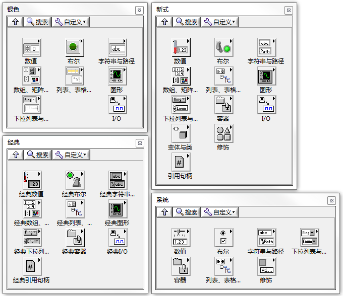
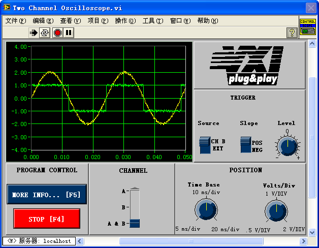
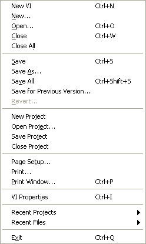
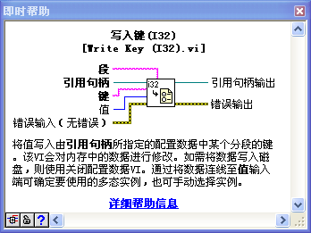
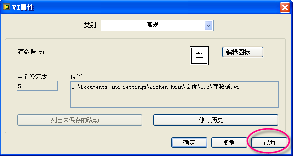
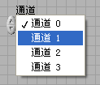

# 界面设计原理

有些程序的界面，一打开来就让人眼前一亮，这可能是因为它的界面设计得非常新颖、华丽。但漂亮的感官冲击并不代表着就是一个好的程序界面。评判一个界面优劣的最基本指标，首先是要看这个界面的交互功能是否完成。即用户是否可以通过界面为程序提供必要的信息、并接受到需要的信息。其次，是要看用户通过这个界面是否可以简单直观地输入或获取信息。最后才是界面的美观程度。

从这个角度说，一个设计良好的界面，通常应该是用户感到十分自然，而并不引起过分注意的界面。在多数场合，引起用户对界面的注意反而往往是因为他觉得刺眼别扭，或者是因为他找不到所需的信息、或找不到输入信息的处所了。

使用 LabVIEW 开发一个项目，或编写一个软件，通常可以按照以下五个步骤进行：收集需求、设计、编码、测试、发布及维护。就设计阶段而言，一个项目所需的设计可能包括：用户界面设计，程序结构设计，接口设计，模块设计等等。编写 LabVIEW 程序，通常是从用户界面设计着手的。首先进行界面设计，可以使得界面设计不受程序实现的影响。若先设计程序结构，然后再设计界面，程序员难免会把简化编码作为主要的追求目标，而把界面设计当成了配角。这样的界面通常不是用户使用起来最方便的界面。

使用传统的文本语言设计、编程用户界面时，通常需要先在草稿纸上画出原型。LabVIEW 在这方面有独特的优势，它的可视化编程方式十分便于制作界面原型。它配备了大量现成的控件，控件属性更改非常简便。用户使用 LabVIEW，可以用拖拽控件的方式，直接设计界面草稿。

对于界面优劣的评判，每个人都会有不同的观点。仁者见仁，智者见智。但是，良好的用户界面一般还是会有些共性的，例如：良好的一致性；使用恰当的数据类型和控件类型；控件的分类排布合理、简洁；用户操作简单方便等。程序员在设计程序界面时需要综合考虑到这些因素。

## 一致性

一个能够让用户迅速接受并且方便操作的程序界面，它最为关键的一个特点应该是，这个界面保持高度的一致性。这里说的一致性包涵了多个方面。

### 程序内部的一致性

由于软件的应用领域、及其面向的客户群体不同，各种软件都有自己独特的风格。为儿童设计的软件（例如使用乐高游戏版的 LabVIEW），界面可以增加一些卡通图片，走可爱路线；为青年群体设计的软件，可以采用鲜艳的色彩，显得富有活力；LabVIEW 的大部分程序应用于工业领域，面向专业技术人员，这些程序界面风格应该显得柔和、朴素，具备专业特征。

一个程序不论它采用了哪种风格，它的不同界面（比如不同的对话框）、同一面板上的不同控件等，它们的风格应当保持一致。采用统一的风格，会让用户有一种和谐的感觉。

如图
10.1 所示，打开 LabVIEW 的控件选板，可以看到三种不同风格的控件：经典风格的、现代风格的、以及系统风格的。

图 .1 三种不同风格的控件

经典风格的控件看上去比较 "土气"，它是 LabVIEW
6 之前的版本所使用的控件。除非是以下两种特殊情况外，这种风格的控件已经几乎不再使用了。

一是维护老程序的时候。老程序可能原本使用了经典控件，为了界面风格统一，又不打算花时间改造原来的程序界面，那就得继续用经典风格的控件。

二是需要设计一个透明控件的时候。在 LabVIEW 界面设计中，将控件的背景和边框等设置为透明色，可以获得很多特殊效果。在以后的一些例子中，还会具体介绍这方面的应用。此处先举一个最简单的例子：在程序运行时，倘若需要在界面上显示一段提示文字，但又不希望显示出字符串控件的边框，就可以把字符串控件的边框和背景设置为透明。

点击菜单的 "查看 -\> 工具选板"，打开 LabVIEW 的工具选板。选择工具选板最下方的 "设置颜色" 工具，并选择右上角的透明颜色（参见图
10.6 LabVIEW 颜色配置），就可以把字符串控件的背景和边框设置为透明。

新式控件和系统风格控件的某些部分的颜色是无法修改的，所以需要控件完全透明时，就不得不使用经典风格的控件（图
10.2）。

图 .2 两种控件分别设置为透明后的效果

LabVIEW
6 及其随后的版本中，增加了一些设计得非常美观的、具有立体效果的控件，这就是新式风格的控件。编写测试领域的软件，可以优先考虑使用这类控件。

系统风格控件的外观与操作系统保持了一致。使用这类控件编写的界面，看起来与系统自带的程序风格非常一致，比较容易被用户接受。系统风格的控件会随着操作系统的不同，以及系统设置的不同而随之自动调整。比如，把某个程序拷贝到 Mac
OS 的机器上，文本框会自然变成 Mac
OS 上圆弧角的风格。假如把系统颜色设为高亮反转显示，文本框也会变为黑底白字。

但是，有些 LabVIEW 特有的控件，比如波形显示控件等，是没有系统风格的。如果程序整体是系统风格的，在使用这类控件时，可以调整一下这些控件相应的色彩，使它们与系统颜色保持一致。

在 LabVIEW
2011 中又增加了一套新型风格的控件："银色" 风格控件。它们的风格更符合当今流行的审美标准。在编写应用程序时，可以尽量使用 "银色" 系列的控件，它能让程序界面更具有现代气息。

### 与约定俗成的习惯保持一致

有很多的设计或操作方法，它们也许不见得是最美观和优化的，但已经被公众广为接受，也就很难被改变了。

譬如，我们现在使用的键盘，沿用了当年为延缓打字速度而精心设计出来的最差布局方式。但现在大家都已经习惯了这种布局，没人会为了打字能够更快一些而改用其它的按键排布方式的。

再如，与系统软件相关的一些经典的操作方式，比如，Ctrl+C 表示拷贝；Ctrl+V 表示粘贴，已经是约定俗成。你如果改用它们去执行你认为更适合的工作，是很难被用户接受的。

对于应用程序界面，大家最习惯的就是 Windows 默认的界面风格了：使用窗口，窗口最上方是标题栏，下面是菜单，然后是工具条，再下面是主体内容，窗口最下方是状态栏，右侧以及最下面是滚动条。如果一定非要标新立异，把标题栏和滚动条的位置互换一下，那么用户肯定会觉得这个界面非常别扭。比如，微软推出的 Office
2007，界面风格有了重大改变，新的界面漂亮了不少。但是它的很多用户常用菜单、按钮都变更了放置的位置，用户又要重新熟悉新的界面布局。所以在 Office
2007 发布后，很多用户宁可继续使用自己熟悉的旧版本 Office 软件。

LabVIEW 默认的颜色配置和控件风格，与系统的风格还是有区别的。所以为了照顾新用户，不妨在程序里尽量使用系统风格的控件和颜色配置。

### 与真实事物保持一致

有很多程序是为了对现实世界的模拟或模仿。为了便于用户接受，界面应该尽量与现实世界保持一致。

用 LabVIEW 编写的程序，大多数往往与测量、控制等有关。在这些领域，一些常用或通用的仪器或设备早已被人们所熟悉和习惯了，软件的界面可以借鉴这些仪器的外观。比如，程序要完成一个类似示波器的功能，那么界面设计应该尽量和传统的示波器相一致：一侧是显示波形的控件，周围有调节垂直、水平方向范围的旋钮、开关等。这样，凡是曾经用过示波器的用户，就可以直接使用这个软件了。

图
10.3 是 LabVIEW 自带范例中的一个 VI。尽管它是早期设计的，用的还是老式的控件，不如现在的程序界面那样柔和美观。但是，由于它在设计上与真实示波器保持了一致：控件的外观、布局和操作方式等，都与真实示波器上的按键旋钮等相类似。所以，曾使用过示波器的用户，基本上不需要再查看这个 VI 的帮助文档，直接就会使用这个 VI 提供的类似示波器的功能了。

图 .3 LabVIEW 自带的双通道示波器示例

### 建立并遵循界面规范

使界面保持一致性的前提是：在设计开发时必须遵循一定的规范。规范定义了程序界面的细节。比如：所有对话框都是相同的颜色、所有的按钮都是固定大小、所有文字都是一致的字体字号，等等。

这个规范可以由公司内部定义，也可以遵循现有的行业规范。凡是开发 Windows 系统风格的程序，可以遵循微软定义的界面规范。微软在 <http://www.msdn.com> 网站上登载有关于 Windows 程序界面规范的介绍。对于一般的 LabVIEW 程序，可以遵循 LabVIEW 程序开发规范。网页 <http://zone.ni.com/devzone/cda/tut/p/id/4434> 上刊登有一篇文档："LabVIEW Development Guidelines: LabVIEW Style Guide (Chapter 6)"。这篇文档规定了 LabVIEW 程序的面板颜色、文字的字体大小、如何排列控件等等细节。

## 界面元素的关联

    

图 .4 两个菜单

图
10.4 左侧是 LabVIEW 中的一个菜单；右侧是笔者 "精心" 设计的另一个菜单。相信读者肯定都会更喜欢左侧的那个组织清晰合理的菜单。

界面上的元素越多，找到自己所需的信息所花费的时间也越多。如果用户一眼看到了一个与自己所需的信息有关联的某个元素，他会期望这个元素具有一定的提示信息，有助于加速找到自己想要的东西。因此，在界面上要有清晰的提示，告诉用户哪些元素是相关的，哪些是不相关的。

有很多手段可以把界面的元素之间的关联展示给用户，比如通过元素的排布、边框、空白、颜色、字体等等方式。

人们总是习惯于在相关内容的附近去寻找所需的信息。所以，逻辑上相关的控件或项目，应当处在屏幕空间相对临近的位置上。比如上述菜单的 "Save","Save
As","Save All" 等，与保存相关的条目都排列在一起。

仅仅把相关内容摆在一起还不够。看一下图 10.5。

  

图 .5 小朋友的名字

这是互联网上流传的一个经典笑话：老师发作业本的时候，念小朋友们写在本子上的名字："黄肚皮"，"鱼是虫"，但是没人答应。最后有两个小朋友没拿到本子，他们的名字分别是 "黄月坡" 和 "鲁蛋"。小朋友们虽然把界面元素按照顺序排列了，但却没有合理地组合它们。

图
10.4 中的菜单，有二十多个条目，单纯地把关联的项目排在一起，用户查看仍然会感到不方便。可以进一步把它们按功能分成几个不同的区域。比如有关保存文件与项目的操作在功能上相对独立一些，就可以用分隔线把这两类操作区分开。

对于面板上控件也是如此处置。可以把功能相关的几个控件用边框围住，或使用分割线、采用不同的间隔等等方法，让用户直观地感觉到它们在功能上是紧密关联的。

颜色也是一种表示控件间关联性的方法。球场上的两组队员，开始分列于球场两端，一目了然就能区分他们是哪一伙的。而一旦比赛开始，这种空间上的提示就不存在了。观众就得依靠队员衣服的颜色来区分他们属于哪支队伍。在界面设计上当然也可以使用这种方式，即为不同功能的控件设置不同的颜色。

值得注意的是，颜色只能作为辅助方式。只有在前几种方法不适用的时候，才需要用颜色来表示关联。颜色与前面提到的其它几种方式不同。人们都喜欢排列整齐、布局合理的界面，但喜欢界面颜色丰富的人就不那么多了。相反，颜色艳丽、对比度高的界面往往会使人视觉疲劳，甚至于让人感到反感。

图 .6 LabVIEW 颜色配置

LabVIEW 配置颜色的面板上被划分了几类不同的颜色区域（图
10.6）。设计系统风格的时候，需要使用系统颜色。其他情况下，尽量使用柔和颜色，避免使用靓丽鲜艳的颜色。设计界面颜色方案时，还要照顾到有色盲、色弱的用户。

界面内容不多时，尽量不要使用太多种类的颜色。只有当界面上信息量特别大的时候，丰富的颜色才会派上用场。比如：大段的文字包含的信息量较多，在需要把不同的文字区分开来的时候（比如，标注所有拼写错误的单词，标注不同词性的单词等等），可以利用颜色来区分不同类型的文字。不过，即便在这应用场景下，不使用颜色，而使用不同的字体，字号等也可以达到同样的效果。

## 帮助和反馈信息

设计用户界面时，要照顾到新用户。为了方便新用户了解界面的使用方法，需要给他们提供足够的辅助或帮助信息。LabVIEW 主要是通过以下几种手段给用户提供帮助信息的：用户手册；即时帮助窗口；提示条；利用控件的标题、选项文字；直接把帮助文字写在界面上等。

首先，应该尽量使用有意义的、容易被理解的控件名称。图
10.7 所示的控件是用来表示使用何种信号作为触发条件的 ------ 是触发信号的上跳沿、还是下跳沿。假若不给这个控件起名，或者起个很简略的、含糊的名称如 "方式" 等，用户在看到这个控件时是无法得知其确切用途的。莫不如将名称写得详细一些，如所示的 "边沿触发方式"，将更便于用户理解。

单有控件标题还不够完善。这个控件的输入值只有两种，可以使用布尔数值类型来表示。但是用户并不清楚 "真" 值在这里表示的是上跳沿、还是下跳沿。因此，还应该把表示当前状态的布尔文本也显示出来。这样用户一目了然，就很清楚地知道了控件的功能与当前的状态。

图 .7 同一布尔控件不同状态时的文本表示

"提示条" 在一般程序中也使用得非常广泛。设置好控件的提示条，鼠标移到这个控件上方，就会在光标附近显示出一个黄色的小提示条，显示出预先输入的帮助信息。LabVIEW 还有一个 "即时帮助" 窗口（图
10.9），可以在这个即时帮助窗口里显示帮助信息。与提示条相比，即时帮助窗口面积比较大，可以写入更详细的信息。

在需要显示 "提示条" 或 "即时帮助" 信息的控件的右菜单中选择 "说明与提示"，将弹出 "说明和提示" 框（图
10.8）。在上方的说明栏中输入 "即时帮助" 所显示的信息；下方的提示栏中，输入提示条所显示的文字。

图 .8 为控件添加说明和提示

即时帮助窗口可以容纳的信息也还是有限的。显示的信息太多了会占用过多的屏幕，影响正常程序显示，或影响整个界面的美观。

如果还需要更多更详细的帮助信息，就只能把信息写到用户手册，或者帮助文档中了。LabVIEW 帮助文档在菜单 "帮助 -\> 搜索 LabVIEW 帮助" 中。此时，一定要在界面上醒目地提示用户，可以查看用户手册（图
10.10）。在 LabVIEW 程序中，通常可以把相关的链接写在即时帮助窗口中（图
10.9）。

图 .9 即时帮助窗口和详细帮助文档的链接

图 .10 在对话框中通常使用 "帮助" 按钮打开相关的帮助文档

对于那些并非经常被访问的界面，比如对于那些用户可能间隔一两年才可能用到一次的配置界面，不要指望用户能够记住界面上每个条目的意义。如果这个界面并不要求做得非常简洁，也可以把帮助信息直接写在界面上。

以 "工具 -\> 导入 -\> 导入共享库" 工具为例，图
10.11 显示的是它的一页界面。在这个界面上，用户真正需要选择的只有 "错误处理模式" 这一项。由于这是一个偶尔才会用到的设置，针对它的说明应当尽量详细，即使占据了较大界面空间也不要紧。在这个例子中，为了更好地说明问题，甚至还把演示图片也放到了界面上。

界面下方的文字，是针对不同的错误处理模式的解释说明。用户选择不同的模式，给出的帮助文字也会相应调整。界面中部，是针对这一选项的图示。按 Ctrl+H 键，还能够看到对每个界面元素解释的即时帮助。如果觉得这还不够详细，可以点击界面右下方的帮助按钮打开帮助文档，阅读更为细致的解释。

图 .11 导入共享库工具的界面

## 限制

保障软件的可靠性是软件开发者的责任。如果用户误操作，或者给程序提供了错误的数据，一个稳定的程序仍然可以组织程序继续运行并报告错误。但这毕竟是亡羊补牢的做法，更完美的解决方案应当是从根源上就杜绝误操作和错误的输入数据。

所以，在设计界面时，还应考虑如何限制用户的误输入和误操作：禁止误操作出现，把输入数据都限制在合理的范围内。

### 限制输入数据

LabVIEW 的某些控件本身就带有对输入数据进行限制的功能。比如数值型控件，在它的属性对话框中的 "数据输入" 页，可以设置这个控件所能接受的数据的范围。假如有一个用于采集数据的程序，它的界面上有一个用来表示选取某个输入信号通道的数值型控件，可供使用的合法数据为通道 0 至通道 3。如图
10.12 所示，为了防止用户选择错误的通道号，应该在其数据输入属性页中，把控件的最大最小值分别设为 3 和 0，"对超出界限的值的响应" 项选择 "强制"。

图 .12 数据范围限制

如此设置后，即使用户误输入一个不合理的数值，比如 99，LabVIEW 也会忽略这个不合理数值。

更安全的做法是让用户不可能输入错误值。比如在本例中，可以考虑使用枚举或下拉列表型控件来表示通道号。这两种控件的可选值是有限的。如所示，用户只能在正确的值中选择一个。

图 .13 枚举型数据

除了枚举和下拉列表型控件，单选按钮也可以起到同样的效果。单选按钮有一个优势，就是可以直接在界面上显示出所有可供选择的值，并且可以附带对每个选项的详细解释。如果界面的空间比较宽松，可以考虑使用单选按钮控件。比如图
10.14 中的界面，这是 VI 属性中的一页，用于设置 VI 密码。关于 VI 保护的三种选择被一目了然地显示在界面上。

图 .14 使用选择按钮的界面

再举一个例子：如果要求用户在界面上选择一种颜色，可以使用 "数值 -\> 颜色盒" 控件。这样，用户就只能够输入合法的颜色数值。

### 防止误操作

用户操作程序界面的方法千奇百怪，不可能完全按照开发者设想的那样去操作。如果设计软件时不加注意，用户有意无意地所做的某些不合常规的操作，很可能导致软件出现错误。因此，一个设计良好的程序界面还应该能够防止用户的误操作。

一个防止误操作的最为简单的方法是，让所有不应被操作的控件都失效。比如图
10.14 中的界面，它的修改密码按钮是灰色的。那是因为用户选择了 "未锁定"，此时并不需要用户提供密码。与其让用户判断是否可以使用这个按钮，不如直接禁止它的使用，以防用户错误地按下它后发生不可预期的错误。当用户选择了密码保护设置后，再让这个按键有效。

在控件的右键菜单中选择 "创建 -\> 属性节点 -\> 禁用"，对该控件的禁用属性节点输入 0、1 或 2，该控件的状态将分别是 "启用"、"禁用"、以及 "禁用并变灰"

## 突出重点

一般来说，界面应当尽量简洁。如果界面上的控件数量过多，那么即便它们之间组织合理、关联得当，用户可能也无法一眼就识别所有控件的详细情况。

如果界面上的控件数量较多，首先应当考虑是否可以采用更有效率的表示方法以缩减控件数量。比如，选用一个可以同时显示多条曲线的波形图控件取代多个波形图控件。如果控件的数量确实无法减少，就应当按照控件的重要程度、使用频率来区分出优先级，而并非将它们平等地排布在界面上。重要的控件，应当占据界面的主要位置，在尺寸上也可超过次要控件。这样，用户一眼就可以看到最重要的信息。比如前文看到的示波器程序界面，它的控件数量也是比较多的。但示波器最重要的功能是波形显示，所以波形图控件在该界面上占据了最大的面积和最显眼的位置。
