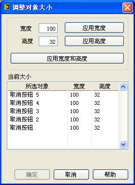
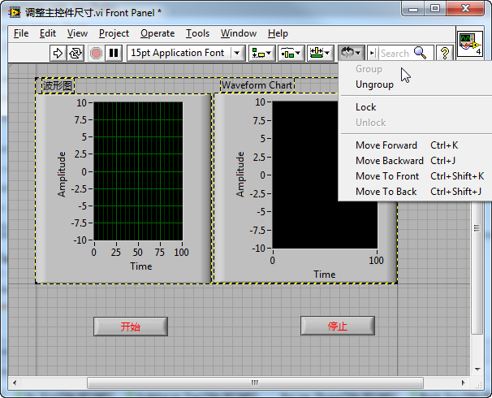
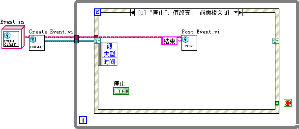
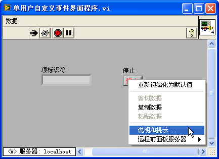
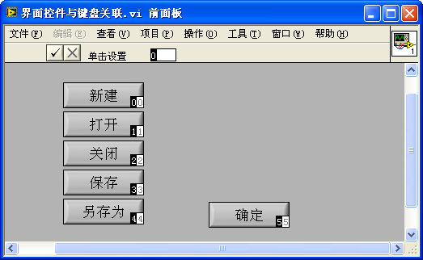
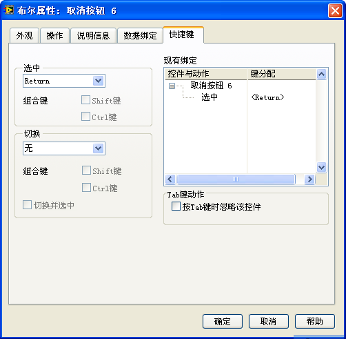

# 常用规范和实现方法

## 界面尺寸调整

### 手动调整控件尺寸和位置

一个程序中所有相同类型的控件都应当尽量保持一致的风格和统一的大小。尤其是在同一界面上的一组相同的控件，更应当保持一致。

图 .15 包括一组按钮的 VI 界面

图 10.15 是一个 VI 的前面板，在这个界面上放置了一组按钮。为了保持界面的整洁，这组按钮应当大小统一，排列整齐，并使用相同的字体。

LabVIEW 提供了几个用来整理界面控件位置和大小的工具，这几个工具在编辑界面时是经常要用到的。它们位于 VI 的工具条上，分别称之为 "文本设置"、"对齐对象"、"分布对象"、"调整对象大小"。图 10.15 列出了这几个工具按钮的主要功能。字体调整按钮用于修改界面上文本的字体、大小、颜色、对齐方式等。它右侧的四个工具按钮分别用于对齐控件、调整控件间距、调整控件大小以及调整控件前后的顺序。

我们首先要把界面上的按钮调整成同样的大小。先选中所有的控件，然后根据需要点击 "调整对象大小" 工具钮的相应按钮。如按 "最大宽度" 按钮，则所有的控件都被设置为与最宽的控件相同的宽度（图 10.16）。

 

图 .16 使用最大宽度控件调整控件的宽度

也可以选中全部控件后，使用 "设置宽度和高度" 按钮。点击这个按钮后，会弹出一个对话框，设置控件长宽的具体数值（图 10.17）。

 

图 .17 设置宽度和高度工具

VI 工具条上其它几个工具的使用方法与调整控件大小按钮的使用方法类似，就不重复解释了。

利用调整控件位置和间距的工具，以及字体调整工具，把控件排列整齐。排列整齐的界面看上去就顺眼多了（图 10.18）。

图 .18 排列整齐的界面

### 设计可调节大小的程序界面

程序的界面应该有多大呢？如果程序可能会被多个用户使用，就难免会运行在各种分辨率的屏幕上。如果界面太大，低分辨率的显示屏就无法完全显示；如果界面太小，对于高分辨率显示屏来说又是一种浪费。从用户的角度考虑，程序的界面尺寸最好是可调的，用户可以选择适合计算机屏幕的任意大小的界面。为了界面显示的协调，程序界面尺寸发生变化时，界面上的控件各自的大小和位置也必须随之调整。

控件跟随界面大小变化有两种方式。一种是控件大小也需要跟随调整的：一些显示数据量较大的控件，比如波形显示控件、表格、大文本框等，通常是界面的主要控件，需要随之调整尺寸以获得尽量大的显示区域；而有些控件的尺寸可以是固定的，比如按钮，选择框等控件。界面尺寸变化时，虽然不需要调整尺寸，但它们的位置可能需要调整，以获得最佳的界面布局。

### 窗格和分隔栏

一般来说，每个 VI 有一个前面板（Panel），每个前面板又可以是由多个窗格（Pane）组成的。默认情况下，新建一个 VI，这个 VI 的前面板是由单个窗格组成的。由于大多数情况，每个面板只有一个窗格，也往往就忽略了窗格的存在。但是在编程时，一定要意识到：LabVIEW 程序中的控件是摆放在窗格上，而不是前面板上的；窗格才是摆放在前面板上的。

使用分隔栏可以在前面板上分割出更多的窗格来。分隔栏在控件选板 "\[xx 风格] -> 容器" 中。分隔栏有横、竖之分，可以把前面板按照不同的方向分成两块。控件无论被放在哪个窗格里，只是界面的外观不同，对程序功能都没有影响。

当前面板的大小改变时，分隔栏也可以跟随着移动。在分隔栏的鼠标右键菜单中有一项 "调整分割栏"，可以用来设置状态栏跟随面板的哪个边沿一起移动，或是按比例移动。

\
图 10.19 设置分隔栏移动方式

分隔栏的右键菜单最后两项 "左窗格"" 右窗格 "(或" 上窗格 ""下窗格")，用来设置分隔栏两侧窗格的一些属性。比如，界面划分成窗格后通常不需要显示窗格内的拖动条，可以在子菜单中禁止其显示。

分隔栏的属性也可以在运行状态下通过程序来设置。在程序框图上分隔栏虽然没有控件那样的接线端，但可以使用右键菜单创建它的引用、属性节点和调用节点，并且在程序中使用它的属性以及方法。比如图 10.20 中的程序就是从左到右挪动图 10.19 状态栏的位置。

\
图 10.20 使用分隔栏的位置属性调整分隔栏位置

在程序运行时，用户仍然可以在界面上移动分隔栏。若不希望用户改变分隔栏位置，可以在分隔栏的右键菜单中选中 "锁定"，这样，分隔栏的位置就被锁定了。

分隔栏没有隐藏属性。若希望程序运行时看不到分隔栏，可以通过改变分隔栏颜色来达到隐藏的目的。首先，把分隔栏的风格改为 "经典"，然后把它的颜色染成与程序框图相同，程序运行时就看不到分割栏了。顺便提一句，分隔栏两侧的窗格是可以有不同背景色的。

窗格也是没有隐藏属性的。若在程序运行时需要隐藏某个窗格，可以调整它周围分隔栏的位置，让这个窗格缩起来就行了。

### 编程调整控件的位置尺寸等属性

如果需要在程序运行时调整界面尺寸，一个有效的方法是动态调整控件的尺寸与位置。当程序接收到 "窗格大小" 这一事件后，根据新的界面的尺寸，重新计算每个控件的位置和大小。

比如图 10.21 所示的程序界面包含一个波形图控件和一个停止按钮。

\
图 10.21 包含一个波形图控件和一个停止按钮的 VI 前面板

当用户改变界面尺寸时，希望停止按钮始终停靠在界面右下角，而波形图控件则撑满剩下的界面空间。这些变化都可以通过编程来设置，示例程序如图 10.22。每当界面发生尺寸发生变化，程序就重新读取界面当前的宽度和高度，再根据这两个数值计算每个控件应当所在的位置和大小。图 10.22 中的程序，调整界面布局的代码被放在了一个 "调整控件尺寸" 的用户事件分支中，而不是直接在 "窗格大小" 这一事件分支中处理，这是因为程序可能有多处需要调整界面布局，比如程序在初始化和 "窗格大小" 事件发生时都需要调整界面布局。解决办法就是：把调整界面布局的代码被放在 "调整控件尺寸" 的用户事件分支中，而当程序初始化和 "窗格大小" 事件发生时，都抛出一个 "调整控件尺寸" 事件，程序便跳转到这一分支来调整界面布局了。这样避免了程序在多处使用同样的调整界面布局代码。

\
图 10.22 调整控件位置和尺寸的程序

使用编程的方法调整控件布局，使其符合变化的界面尺寸，其优点是调整精确稳定。有些控件，比如仪表盘控件，只能通过这种编程的方式才能准确调整其大小。编程方法的缺点是调整较为繁琐。对于比较简单的界面，可以考虑使用分隔栏帮助界面布局，省去编程的繁琐。

### 等比例改变所有控件的尺寸

如果程序的界面很简单，只包含一个窗格，则可以在 VI 属性中设置 "按窗口大小缩放所有控件尺寸"。这样，当界面尺寸变化时，界面所有的控件都将按相应的比例调整自身大小。

\
图 10.23 VI 的 "按窗口大小缩放所有控件尺寸" 属性

这样设置之后，效果是整个界面按比例缩放，所有的控件都一起变化。但是，这样的缩放并不太精确。反复多次调整界面尺寸后，假如界面再回复到原始的大小，会发现有些控件尺寸可能有少许改变。这是因为前面板的尺寸和控件的尺寸都只能是整数，这样每次调整界面后，控件与前面板尺寸的比例都会有所变化。也就是说每次界面调整都会引入误差，误差累积还是比较明显的。

### 仅改变一个主控件的尺寸

在大多数的程序界面上，往往只需要有一个能够缩放的控件撑满屏幕就可以了。其它的控件没有必要调整大小，只要它们的布局整齐不乱就行。

比如对于只包含有一个波形图控件和一个停止按钮控件组成的界面，它只需要波形图随界面尺寸的调整而变化。那么只要在这个控件右键菜单中选中它的 "随窗格缩放" 属性就可以了。但每个界面窗格只允许有一组控件被设置成 "随窗格缩放"。

被设置成这一属性的控件四个边沿的延长线都被深色标注出来了。当界面尺寸被调整时，四条深色直线到其最近的 VI 前面板的边沿的距离是不变的，只有被这个四条深色直线包裹出来的矩形区域的尺寸会随界面一起变化。这样一来，可以保证程序的主控件随界面尺寸变化，而其它的控件位置保持稳定。

\
图 10.24 设置控件 "随窗格缩放"

若主控件有多个，比如说界面上有两个同等重要的波形控件，那么只要把两个主控件组成一组。由多个控件绑成的组，在外观布局上的行为属性与单个的控件是类似的。把这个组设置为 "随窗格缩放"，这一组的控件就可以一起随界面尺寸变化了。

\
图 10.25 将多个控件设为一组

当界面尺寸发生变化时，图 10.25 所示的 "开始" 和 "停止" 按钮之间的距离也会变动，因为它们一个靠近边界线左端，另一个靠近右端。若需要这两个按钮的相对距离保持不变，也把它们绑成一组就可以了。

### 借助分隔栏调整控件的位置与尺寸

对于比较复杂的界面，同样也可以仅仅借助于分隔栏调整控件的尺寸和位置。用图 10.26 这样一个比较复杂的界面为例：

\
图 10.26 一个由多个控件组成的复杂界面

这个界面包含五个控件，假设界面要求如下：水箱、油箱、波形图三个控件需按比例随界面尺寸调整，但它们三个控件之间的距离，以及它们距离界面边框的距离不能变化；信息框的长度随界面调整，但高度不变；停止按钮尺寸保持不变，且始终在界面右下角。

可以使用分隔栏来定位每个控件的位置。为了方便在编辑时调整控件尺寸，以及确保控件尺寸和位置在多次调整界面大小后仍然准确，可以设置较多的分隔栏。原则是让每个需调整尺寸的控件都有一个可以撑满的窗格。 之后，在控件的右键菜单中选择 "将控件匹配窗格"，让它们的尺寸始终与窗格保持一致。

\
图 10.27 利用窗格分割界面

水箱、油箱、波形图、信息四个控件都需要设置为撑满窗格，而停止按钮由于大小不变，不需要有此设置。

这个例子是比较极端的情况，一般来说并不需要设置这么多的分隔栏，只要能保持每个窗格内只有一个跟随界面调整的控件就可以了。

界面上各个控件变化方式不同，全在于分隔栏对齐方式的设置。图 10.28 显示了分隔栏对齐方式的设置：

\
图 10.28 每个分割栏的对齐方式

实际上，用户不会希望在界面上把分隔栏显示出来，可以参考 10.2.1.3 节介绍的方法将其隐藏。

### 程序 \[调节界面

1. ** 有些控件不能改变尺寸 **LabVIEW 中并非所有的控件都可以调整其大小。大多数尺寸固定的控件都是用来给子 VI 输入输出参数的，不会用到用户界面上。但也有一些会用于界面，尤其是一些系统风格的控件，比如单选框、复选框控件等。

\
图 10.29 几种不可改变尺寸的控件

&#x20;

1. ** 有些控件必须保持长宽比 ** 大多数 LabVIEW 控件可以分别设置它们的高度和宽度。但有一些控件，比如仪表盘、旋钮等，它们的形状是固定的，只能是正圆。也就是无论大小如何，长宽始终保持一比一。

对于这样的控件是不能使用 "根据窗格缩放对象"、"将控件匹配窗格" 的，LabVIEW 对于这类控件大小的自动调整并不准确。对于它们，只能使用编程的方式调整尺寸。

\
图 10.30 必须保持长宽比的控件

&#x20;

1. ** 界面最小尺寸 ** 无论采用哪种方式调整界面布局，最好都为界面设置一个最小尺寸。因为任何控件都不可能无限小，所以整个界面缩得太小对于用户也是没有意义的。VI 前面板的最小尺寸也就是程序界面的最小尺寸，这一设置可以在 VI 的属性对话框中找到。

\
图 10.31 设置界面的最小尺寸

## 应用程序的退出按钮

LabVIEW 的 VI 主面板窗口标题栏右上侧有一个红叉，是用于关闭该 VI 的窗口的。尽管已经有了这个关闭窗口按钮，但是程序界面上还是应该有一个用于退出程序或关闭界面的命名为 "取消"、"退出"、或 "关闭" 等的按钮。这是为了与用户习以为常的对话框保持一致。不论是 Windows 系统的对话框，还是 LabVIEW 中的对话框，都有用于退出或关闭对话框的按钮。一般来说，用户总是会习惯性地在界面上寻找关闭对话框的按钮的。

同时还应注意，在程序中需要对用户点击标题栏红叉关闭界面的操作进行必要的处理。有些人直观的认为，既然窗口关闭了，VI 中的代码也应当停止执行，其实不然。应用程序中弹出的对话框通常是应用程序中的一个子 VI，点击对话框窗口右上方的红叉，虽然关闭了 VI 的前面板，但并不会把这个子 VI 移除出内存，也不会自动停止 VI 的运行。如果 VI 中有循环结构的话，它可能还会运行一段比较长的时间，甚至因为不能满足循环停止的条件（比如，只有点击对话框上的某按钮才能停止循环，而这时对话框界面已被关闭，永远无法点击这一按钮），而永远运行下去，直到关闭计算机。笔者曾经处理过一些 VI 程序，点击了它们界面上的某些对话框的关闭窗口按钮（红叉）后，VI 程序就会对界面的操作停止反应，问题就出现在这里。

界面程序通常是使用事件结构编写的，在 <本 VI> 事件源中有专门的关闭 VI 前面板事件。在程序中，一定要对这一事件进行处理。图 10.22 显示的就是用户点击界面上的停止按钮、或点击关闭窗口按钮后的事件处理程序框图。程序包括了程序终止前的预处理、关闭界面并终止程序。

图 .22 关闭程序窗口，需要相应地终止程序运行

在有些程序中，若随意关闭了面板或对话框，可能会引发严重问题。这时，当用户点击界面标题栏关闭窗口按钮时，程序需要给用户一个提示框，让用户确认。只有在用户确认要关闭程序时，才真正关闭程序，以避免误操作引发更大的麻烦。

使用 "前面板关闭？" 过滤型事件就可完成这样的功能（图 10.23）。当用户点击了红叉，先弹出对话框询问用户，当用户点击确认后，才真正关闭程序（图 10.24）。

图 .23 利用过滤型事件，弹出确认对话框

图 .24 确认退出的对话框

## 菜单

运行一个 VI，在主面板菜单栏上显示的是 LabVIEW 设置的默认菜单。这些菜单对于 LabVIEW 应用程序来说，也许毫无用处。程序通常需要有自己的菜单项。

创建程序自己的菜单非常简单，LabVIEW 带有专门的菜单编辑器。在界面 VI 的菜单中选择 "编辑 -> 运行时菜单" 就可以调出菜单编辑器（图 10.25），用以创建 "自定义" 菜单。

菜单编辑器的界面比较简单，根据界面上的菜单、工具条以及帮助文档，读者可以自行编辑所需的自定义菜单。

图 .25 菜单编辑器

保存编辑好的菜单，再次运行界面 VI，界面上出现的将是自定义的菜单（图 10.26）。

图 .26 自定义菜单

创建完菜单之后，还必须在程序中添加响应菜单操作的程序代码。在点击自定义菜单时，LabVIEW 将产生一个 "菜单激活？" 事件；在选择自定义菜单中的菜单项时，LabVIEW 会产生一个 "菜单选择（用户）" 事件。有关菜单的事件都位于 <本 VI> 事件源。在程序的事件结构中捕获这一事件，然后为其添加相应的代码即可。比如图 10.27 中的程序用于改变 "显示数据" 菜单项前的打勾状态。

菜单函数位于 "编程 -> 对话框与用户界面 -> 菜单" 子函数选板上。

图 .27 响应菜单按下的程序

## 控件快捷菜单

程序在运行过程中，鼠标右击某个控件，将弹出 LabVIEW 的默认控件快捷菜单（图 10.27）。这个快捷菜单往往也是不适用于应用程序的，那就需要为控件设置自定义右键弹出菜单。

图 .28 控件运行时的右键弹出菜单

选择控件右键菜单 "高级 -> 运行时快捷菜单 -> 编辑"，将弹出 "快捷菜单编辑器"。它的编辑方法与界面菜单栏相类似。保存该菜单，运行 VI，右键点击该控件，弹出的将是自定义的快捷菜单。同样，也需要在相应控件的 "快捷菜单激活？"" 快捷菜单选择（用户）" 事件框中，编写对应的实现其功能的程序。

图 10.29 的例子中，我们为界面上的 "停止" 按钮设定了一个弹出菜单，这个菜单上只有一个条目 "变换颜色"。每次点击这一菜单项，按钮就会改变显示颜色。

 

图 .29 通过右键菜单改变控件的颜色

在编调控件的右键菜单事件时需要注意的是，"快捷菜单激活？" 事件框中的菜单引用仅在该框内有效。

## 使用键盘操作界面

尽管鼠标是最主要的操控程序界面的工具，但不能排除有些用户还习惯于使用键盘来控制程序界面。为了照顾用户的操作习惯，在设计程序界面时应当使得所用控件都可以通过键盘上的按键来访问。

最常见的键盘操作方式是使用 Tab 键在界面的控件间切换。在使用 Tab 键切换控件的焦点时，应当按照从左到右、从上到下的顺序进行。这一顺序可以使用菜单 "编辑 -> 设置 Tab 键顺序" 进行修改（图 10.30）。然后，按动√或 ×，以确认或放弃选择的新顺序。

图 .30 设置 Tab 键顺序

如果某一控件不需要使用 Tab 键选中，可以在控件的属性对话框中 "快捷键" 一页上选中 "按 Tab 键时忽略该控件"。

有些特殊控件，比如 "确定"、"取消"、"退出" 这类的按钮，在界面操作中是常常用到的，可以为他们设置专门的选中或切换快捷键。这一设置同样位于控件的属性对话框中 "快捷键" 一页上（图 10.31）。

图 .31 设置控件的快捷键

## 组合控件

复杂的控件常常可以由一些简单控件组合而成。

### 1 LabVIEW 控件与 WPF 控件的比较

把几个独立的控件组合起来使用，在不同编程语言中，采用了不同的策略，它们各有优缺点。首先分别比较一下 WPF 和 LabVIEW 如何组合简单控件。

WPF 是.NET 中编写程序界面的一套体系，是目前比较先进的一种界面编程体系。微软提出 WPF 的构想应该是希望把程序的界面和运行逻辑部分完全分开。这样，可以有专业美工设计程序界面；而程序员则专心程序功能的编码。WPF 的界面设计使用了它自己专门的记录方式 ------XAML 语言。这是一种类似 XML 格式的文本语言。在程序进行编译的时候，编译器再把 XAML 代码编译成.NET 的中间代码。这种方式与 LabVIEW 是类似的：界面与程序代码采用了两套不同的表现方式。

LabVIEW 的界面设计简单直观。WPF 似乎还不成熟，在可视化编辑方面尚有改进之处。最严重的问题是，一旦界面较为复杂，Visual Studio 的界面编辑器就无法对其进行解析显示。也就是说，完全失去了可视化编辑的功能。笔者正在进行的一个项目，包括上百个 XAML 文件，其中超过 7 成的文件都无法被界面编辑器显示出来，仍需手工修改 XAML 文本。修改完成后，需要运行程序方能看到修改的效果。

再有，程序界面很少是静态的，界面上常常有一些元素在程序运行时会跟随某些数据的改变而变化。也就是说，WPF 上总会有一些控件是和程序中某些数据绑定起来的。对 LabVIEW 而言，即便在编辑状态下，控件也可以拥有数据。因此，程序员在编辑状态下就可以看到程序运行后的控件状态。而 WPF 没有这一功能，程序只有在运行时才拥有数据，而在编辑状态下，所有数据都是空的。这样一来，在 WPF 界面编辑器上看到的界面很可能与程序运行时是完全不同的。

界面上的基本元素是控件，LabVIEW 与 WPF 由于面向的对象不同，在提供什么样的控件这个问题上采用了完全不同的策略。WPF 面向通用编程，是给专业程序员用的，它侧重功能的强大与编程的灵活性。WPF 自带的界面控件种类并不多，但是程序员可以方便地把它们组合起来，实现各种界面风格，完成各类复杂功能。而早期的 LabVIEW 主要应用于测控领域，LabVIEW 拥有众多的非专业程序员客户。因此 LabVIEW 更侧重控件的易用性：它提供了大量自带的控件，每个控件可供修改的属性有限。使用这些控件是很容易的，拖到 VI 前面板上就可以了；如果想使用某种 LabVIEW 尚未提供的控件，则难度极高。

当今，LabVIEW 的应用已远超出早期预想的范围。相当一部分 LabVIEW 的使用者都是专业程序员，他们对于功能和灵活性的要求越来越高，因此 LabVIEW 近期的几个版本也在这方面做了较大改进。比如，增加了项目管理功能，支持面向对象等。[XControl](ui_xcontrol) 便是专门为补偿 LabVIEW 自带控件功能不足和灵活性不足而设计的新功能。但 XControl 使用起来过于复杂了，不如 WPF 的机制更加合理。

WPF 中的控件几乎都可以作为容器再容纳其它控件。比如说按钮控件，WPF 只提供一个按钮框架以及按下按钮相关的方法和事件。如果用户希望按钮上附加一张图片，就可以在按钮控件里面再嵌入一个图片控件；如果希望按钮上再有一行文字，那就在按钮中再放入一个文本框控件；如果还需要其它功能，再放入其它相应控件即可。但 LabVIEW 的控件中，除了有限的几个以外，都不能嵌套使用。LabVIEW 仅仅提供了可带图片和带文字的按钮，如果还需要附带其它功能，那只能使用复杂的 XControl 了。

以一种界面常用到控件 ------ 表格为例。假如用户要求的表格控件包含有两列，第一列的每个元素都是一个按钮，第二列每个元素是一个下拉框。使用 WPF 编程非常容易，直接把按钮和下拉框嵌入基础的表格控件就行了；而使用 LabVIEW，是不能直接把按钮和下拉框嵌入基础表格控件，就不得不通过软件编程的方法，使各个按钮和下拉框控件在界面上移来移去，让它看上去好像在列表框里一样。当然，与用 WPF 相比，这种编程的方法复杂一些。

LabVIEW 中也有一些和 WPF 控件的性质类似的控件，比如选项卡控件。用户可以随意把一个按钮或者灯泡之类的任意控件放到选项卡控件的某一页上去，组合起来使用。

### 2 列表框与下拉菜单列表控件组合使用

在这一节，举一个例子来说明如何在程序中通过移动控件的方法，形成如同组合控件的功能。

表格是一种常见的界面控件，本例中，用户需要表格中某一列的内容只在有限的范围内选择。实现这样的表格，可以用一个下拉菜单列表控件给用户提供选择内容，以限定用户输入内容的范围，防止填错。比如图 10.47 所示的一个程序界面，界面上表格的第二列需要由用户填写，并且只能在 "甲"" 乙 ""丙"" 丁 " 四个值中选择。当用户点击表格第二列上某个单元格时，该单元格会变成一个下拉菜单列表控件，让用户从中选取一个值。

\
图 10.47 表格单元格为下拉菜单列表控件

如图 10.48 所示，实现这样的表格需要把两个控件组合起来，一个是 "列表框" 控件，一个是 "下拉菜单列表" 控件。

\
图 10.48 复杂表格程序的前面板

程序需要监视列表框控件的 "鼠标按下？" 事件。若用户点击了列表框控件，程序首先要检查是否点击了列表框第二列（"种类" 列）的单元格；如果是，则设置下拉菜单列表控件的尺寸与该单元格大小相等，并调整下拉菜单列表控件的位置，让它覆盖在被点击的单元格上。这样，用户的感觉就完全如同这个单元格变成了一个下拉菜单列表控件。这段程序见图 10.49

\
图 10.49 处理列表框控件点击的程序代码

若这时用户从下拉列表框上选取了一个值，则应当把用户选取的值作为单元格新的值；并且调整它的位置，把它移至所显示的界面之外。

\
图 10.50 处理下拉菜单列表控件值改变的程序代码

这个程序还需要考虑何时隐藏下拉菜单列表控件：比如当用户鼠标点击列表框其它列，或点击在列表框之外的时候，就应当把下拉列表控件隐藏起来。

\
图 10.51 隐藏下拉菜单列表控件的代码