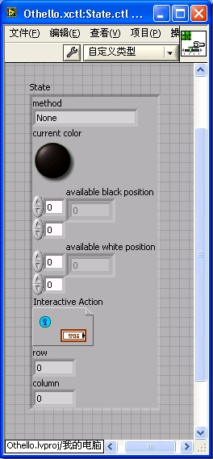
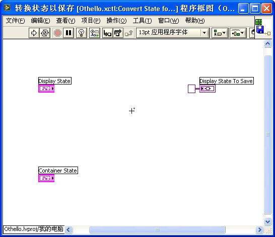
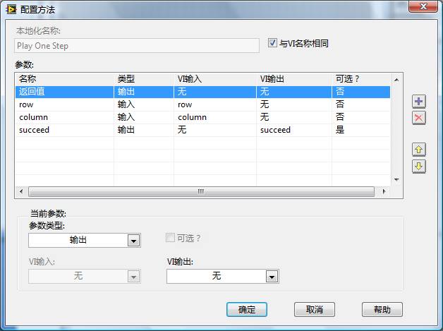
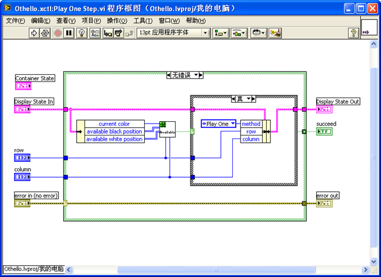
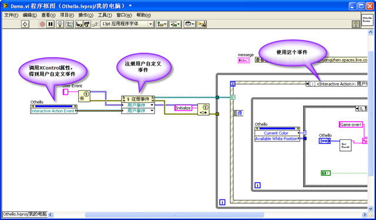
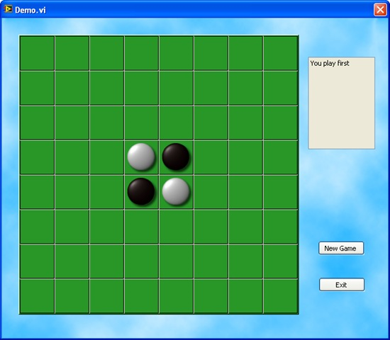
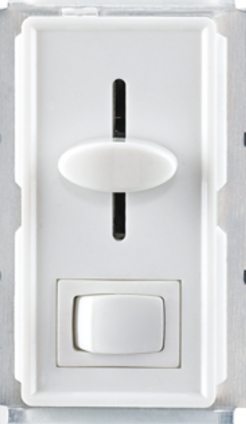

# XControl

这一节将详细介绍XControl的制作方法。为了便于讲解，将以“[界面设计实例](ui_cases.md)”中提到的棋盘为主要例子，介绍如何制作一个XControl控件。在讲解XControl的某些特殊功能时，也会介绍一些其它的例子。

## 设计

XControl的主要特点是可以把它的界面元素与相关的代码封装在一起，从而便于发布和重用这些界面组件。但是XControl也有不足之处，它开发起来难度较大。此外，不合理的XControl可能导致程序更加严重的问题，比如导致程序界面死锁等。所以，在开发XControl之前，一定要精心设计它的结构和行为，以避免出现错误。

在开发一个新的界面组件之前，首先要考虑一下以何种方式实现这个组件。

如果一个界面组件极为特殊，且只可能用在某个特定的程序中，那也许就没有必要将其制作成单独的控件了。可以把这个界面组件做成一个独立的子界面VI，然后通过子面板控件调用这个界面。

如果这个组件需要被多次使用，那么就应该考虑把它做成可重用的独立控件。如果这个控件不包含任何特殊行为，比如一个新型按钮，仅其外观与一般的按钮不同，其它行为都与传统的按钮一模一样。这样的控件适合制作成用户自定义控件。

如果新的组件需要重用，其行为与已有的其它控件又有较大差别，那么就要考虑使用XControl了。比如：需要制作一个新按钮，它比传统按钮多一个状态；制作带有动画效果的控件；制作使用中国本土度量单位的数值类控件；制作一个专用于绘制某种特殊曲线的图片控件等。它们都比较适合使用XControl来开发。

前面提到的黑白棋的控件，它既有特殊界面，又有特殊行为，又可以应用于不同软件中，它就非常适合做成XControl。

首先要具体设计这个XControl所需的界面和行为。

它的界面部分可以直接利用在第10.3.5节设计好的界面。在前文提到的几个设计方案中，使用图片下拉列表数组控件的解决方案，编程代码最简单。所以，在设计XControl时就采用这个界面方案。

XControl在程序框图上的接线端的输入输出数据应该是应用程序中最经常需要与XControl交互的数据。本例中，应用程序最常使用的数据就是棋盘的布局信息。因此，这个XControl的输入输出数据应当是一个表示棋盘上棋子的布局的8×8的整型数组。

黑白棋控件的属性应当包括：当前该下什么颜色的子、可落子的位置、盘面上每种颜色的子数、上次落子的位置等。

它的方法应当包括：落下一个棋子。这个方法需要包含以下具体的操作：在新位置放置一个棋子；翻转被吃掉的棋子；更新数据和所有属性的值。

还有，当用户在交互界面上摆放下一个子之后，需要发个事件通知应用程序。

## 创建

在项目浏览器上，点击鼠标右键，选择"新建-\>XControl"，就可以创建一个新的XControl（图
12.13）。

图 .13创建新XControl

XControl在结构上是一种特殊的库。它包含一些特定的功能VI，和一些可选的属性、方法VI及其它相关文件。在新建的XControl上已经包含了4个必须的功能VI（控件）："数据"（Data）、"状态"（State）、"外观"（Façade）、以及"初始化"（Init）。XControl还有两个可选的功能VI："反初始化"和"转换状态以保存"。

数据功能控件：用来定义XControl的数据类型；

状态功能控件：定义除数据功能之外所有XControl内部使用到的数据；

外观功能VI：这是XControl中最主要的功能VI，用以实现XControl的界面和界面上的行为；

初始化功能VI：设置XControl的初始状态；

反初始化功能VI：负责清理工作，从内存中删除XControl时，释放所有分配给该XControl的资源；

转换状态以保存功能VI：用于把XControl内部的某些数据保存在使用它的VI中。

反初始化功能VI和转换状态以保存功能VI在新创建的XControl中不存在。如果需要使用到它们，可以在项目浏览窗口的XControl上点击鼠标右键，选"新建-\>功能"，为XControl添加一个功能VI。

XControl被保存在一个.xctl文件中。它与LabVIEW库文件十分相似，可以把它看作是一种特殊的LabVIEW库文件。它的属性设置与LabVIEW库的设置也一模一样（图
12.14）。

图 .14 XControl属性设置

先把这个新创建出来的XControl存盘。XControl功能VI的文件名并不一定与其功能名相同。比如，在这个演示中，为了方便更多人使用，可以选择使用英文名称来保存XControl（图
12.15）。

图 .15保存好的空白XControl

## "数据"功能控件

XControl有两个功能控件。"数据"：用于定义XControl的数据类型；"状态"：用于定义XControl使用到的内部数据的数据类型。

首先考虑"数据"功能控件，它是一个.ctl自定义类型文件。它所定义的数据类型，就是XControl控件在程序框图上的接线端的数据类型。在这个例子中，使用一个二维的U16数组表示棋盘布局，所以在数据功能控件中要使用一个二维数组（图
12.16）。

图 .16"数据"功能控件

## "状态"功能控件

"状态"功能控件也是一个自定义类型控件，它是一个簇控件。簇中包含了用于定义XControl运行所需的全部变量。

图
12.17显示的就是运行一个黑白棋XControl所需的内部数据。它包括以下几部分：

method：用于定义XControl的方法。当用户运行一个XControl的某种方法时，设置method变量。每个XControl方法为method变量设置不同的值，这样，在XControl的"外观"功能VI中，就可以知道用户调用的是什么方法了。

current color：用于表明当前应该落什么颜色的棋子，是白色还是黑色。

available black
position：这是一个二维整数数组，表示黑色棋子可以放置的位置。

available white position：一个二维整数数组，表示白色棋子可以放置的位置。

Interactive
Action：是一个用户自定义事件。当用户在棋盘上落下一棋子时，XControl就产生这个事件，通知应用程序，用户走子了。

row和column：两个整数，用于记录上次落子的位置。

图 .17"状态"功能控件

前文只是简短介绍一下每个数据表示的含义。在后文中使用到它们的时候，还会详细解释它们的内容和使用方法。实际在编写XControl的时候，也许不可能在一开始就把"状态"功能控件设计得十分完美。可以一边实现XControl的各种功能，一边对其进行补充。

## "外观"功能VI

"外观"功能VI是XControl最主要的功能VI，它定义了XControl的外观和行为。

### 界面

"外观"功能VI的前面板用于定义XControl的界面，这里可以直接使用在第10.3.5节已经设计好的界面。把图
10.58中设计好的棋盘棋子界面拷贝过来就可以了。这个"外观"功能VI窗口的大小，就是以后用户把XControl控件拖拽到VI前面板上后，XControl实例控件显示出的大小。所以这个VI的大小要刚好包裹住棋盘（图
12.18）。

图 .18外观功能VI的前面板

如果希望制作好的XControl在用户VI前面板上被使用时，可以被任意调整大小，"外观"功能VI前面板上的控件都应该随着前面板的尺寸自动改变大小。

图 .19外观功能VI前面板大小和XControl大小的关系

图
12.19左图是一个XControl"外观"功能VI的前面板，它的大小就是这个XControl被放到另一个VI上之后的初始大小。与自定义控件一样，把VI前面板上的这个控件称为XControl的实例控件。图
12.19右图是正在使用了这个XControl的实例控件的VI，用户可能会拖动XControl的实例控件来改变它的大小。这就相当于，改变左图VI前面板的大小，在这个前面板上的按钮控件必须跟随前面板的尺寸做出相应调整，在右图上改变XControl实例控件尺寸时，按钮的尺寸才会相应地改变。所以左图这个"外观"功能VI必须被设置为"根据窗格缩放所有对象"。

而对于示例中的棋盘控件，可以简单地规定不允许用户调整它的尺寸。只要在"外观"功能VI的属性设置中的窗口外观一页，取消"允许用户调整窗口大小"，即可禁止用户调整XControl实例控件的大小。

### 工作原理

"外观"功能VI的程序框图定义了XControl的行为。比如当用户点击了XControl，XControl就会作出的反应，这与普通的应用程序界面是一样的。它的程序框图采用的也是循环事件结构模式，但是需要特别注意它与应用程序的不同之处。

普通的采用了循环事件结构的应用程序是一直运行着的，等待着事件出现，然后进行处理。而"外观"功能VI只有当XControl有事件发生时，才会被LabVIEW自动调用。它处理完这个事件后，必须立即退出运行。LabVIEW要等XControl的"外观"功能VI运行结束后再去完成其它界面处理功能。所以，千万不要试图在XControl的"外观"功能VI里添加持续执行的代码，如控制XControl上的动画等等。这将会导致LabVIEW对其它界面的操作失去反应。

"外观"功能VI的超时事件处理与一般的应用程序都不同，程序在这里设置了退出循环，并且超时时间是0（图
12.20）。这意味着，一旦其它的事件都处理完成，"外观"功能VI程序立即转入处理超时事件，然后立即结束运行。

图 .20外观功能VI的超时处理分支

### 参数

"外观"功能VI有三个输入参数和三个输出参数。

Data In / Data
Out：从XControl接线端写入或读出的数据。它们的数据类型是由"数据"功能控件定义的。"外观"功能VI的程序框图开始运行时，Data
In中的数据就是XControl当前的值。程序框图运行过程中可以对这一值进行修改。修改后的值由Data
Out 输出，返回给LabVIEW。

Display State In / Display State
Out：是XControl运行时用到的所有内部数据。在本书中有时简称它为状态。它的数据类型由"状态"功能控件定义。它也可以在程序运行中被改变，它的输入输出方式与Data类似。

Container
State：输入参数。它是一个簇，用于表明XControl实例（把一个XControl拖拽到一个VI的前面板上，就产生了一个XControl的实例）在VI面板上的状态。它有三个元素：
"Indicator?"、"Run Mode?"和"refnum"。"Indicator?"
表明XControl实例是否是一个显示控件。它的值为假时，表明XControl实例是一个控制控件。"Run
Mode?
"表示XControl实例所在的VI是否处于运行状态。"refnum"是指向XControl实例的引用。

Action：输出参数，用于通知LabVIEW程序在这次执行中对XControl所做的修改。它有三个元素："Data
Changed?"、"State Changed?"和"Action
Name"。如果在程序中改变了Data，那么就一定要把"Data
Changed?"设置为真，通知LabVIEW。这样，改变的数据才会生效。同样，如果改变了State，则一定要把"State
Changed?"设置为真。"Action
Name"是一个字符串，可以给它输入一段表明这次程序运行的简短文字。这段文字会在LabVIEW的菜单项"编辑-\>撤销"中出现。

### 数据更改事件

"外观"功能VI中的事件处理结构主要处理两类事件。一类是针对XControl的特殊事件，另一类是用户在界面上操作产生的事件。

针对XControl的特殊事件有4个：数据更改、显示状态更改、方向更改、执行状态更改。

当有一个数据通过控件的接线端输入给XControl的实例时，就会触发数据更改事件。对于数据更改事件的处理，通常是用新的数据更新界面上的控件和XControl的状态（Display
State）。

在棋盘XControl的例子中，它的数据就是棋盘的布局。因此，如果程序给XControl设置了新数据，就需要对XControl界面上棋子的布局做出相应的更新。

图
12.21是黑白棋控件对数据更新事件的处理代码：根据新的棋盘布局，刷新棋盘在界面上的显示。程序中使用到了一个子VI。它用于计算黑白棋子可以落下的位置，用于XControl检查用户操作的合法性。在这里主要介绍XControl的相关内容，所以不再对子VI再做详细解释。黑白棋子可以落下的位置被记录在XControl的状态中。在更新了棋子的布局后，需要重新计算黑白棋子可以落下的位置，并更新XControl的状态。由于XControl状态改变，必须通知LabVIEW对新状态做相应的处理。所以，这里一定要把"State
Changed?"设置为真。

图 .21数据更改事件处理

### 显示状态更改事件

如果通过调用XControl的属性和方法，改变了XControl的状态的值，就会触发显示状态更改事件。在上文中，曾提到数据更改事件的处理代码会改变XControl的状态的值，但这不会触发显示状态更改事件。只有调用XControl的属性和方法，才有可能触发这一事件。后文将会介绍如何创建XControl的属性和方法。

对于显示状态更新事件的处理，一般是根据新的状态值更新界面上的控件、以及XControl的数据和状态。比如，棋盘控件提供了一个方法"走子"，在程序中调用这一方法，就会在棋盘上走一步棋。走棋后，必然需要更新棋盘控件的布局和其它状态。因此，必须让"走子"方法改变XControl的一个状态数据"method"，把它的值设置为"Play
One"。这样，method一旦改变，XControl的显示状态更新事件就会被触发。

图
12.22是对"走子"方法的处理。当显示状态更新事件被触发后，先要检查一下method的值。如果是"Play
One"，说明"走子"方法被调用了。这时需要重新计算棋盘的布局和黑白子的可落子位置。这些操作与数据更改事件的处理方法是相似的。但是因为这个操作既更新了黑白棋XControl的数据，也更新了它的状态，所以Data
Changed?和State Changed?都要被设置为真。

图 .22显示状态更新事件处理

### 方向更改事件和执行状态更改事件

当XControl实例控件由控制控件变换为显示控件，或反向变换的时候，就会触发方向更改事件；当XControl实例控件所在的VI由运行态转变为编辑状态，或反向转变时，就会触发执行状态更改事件。对这两个事件的处理是类似的：在某些状态下，需要禁止用户在界面上的操作。在这个黑白棋控件中，对这两个事件的处理是相同的：当控件为显示控件，并在运行状态时，禁止用户对界面点击（图
12.23）。

图 .23方向更改事件处理

在某些情况下，XControl的实例控件更改了方向或运行状态，可能还需要其它一些更改。（这有点像数值控件，改变方向后，需要改变增量/减量按键的显示状态。）

### 界面事件

除了前面提到的四个特殊事件外，XControl的"外观"功能VI和普通界面应用程序一样，需要对用户在界面上的操作做出反应。所以，XControl的"外观"功能VI同样可以对界面上控件的值改变、鼠标点击等事件进行处理。

黑白棋XControl只需处理一个用户界面事件：当用户在棋盘上合法的位置点击鼠标时，表示走一步棋（图
12.24）。

在捕获到棋盘界面上点击鼠标事件后，首先判断这里可否落子。如果可以，则落下一子，然后重新计算棋盘的布局和其它状态。程序在这里还发出了一个事件，这个事件是发给使用了棋盘XControl实例的VI的。后文将会介绍如何使用这一事件。

图 .24用户走子事件处理

## "转换状态以保存"功能VI

"转换状态以保存"功能VI
用于保存XControl的状态数据。默认情况下，XControl"外观"功能VI中的状态（Display
State）全部都会被保存在调用它的VI中。如果状态数据比较大，无疑会增加VI的内存大小。但是，这些状态也许并不需要保存。有些控件的状态，比如控件颜色，尺寸等信息，需要在VI关闭后仍然保存，在下次打开时，还可以保持上次的修改。但是有些状态中的数据，只是临时使用的，不需要保存。这个黑白棋控件的任何状态数据，如当前颜色、可落子的位置等等都是每次重新计算出来的，不需要保存下来。所以，在"转换状态以保存"功能VI中，可以丢弃所有数据，保存一个空数据就可以了（图
12.25）。

图 .25"转换状态以保存"功能VI

## "初始化"功能VI

"初始化"功能VI有两个作用，一是把保存在调用XControl的VI中的状态读取出来，赋给XControl的状态。二是打开或初始化XControl需要使用到的资源。在调用黑白棋控件的VI中，没有保存任何状态数据在VI中，所以不需要读取任何数据。但是黑白棋控件使用到了一个用户事件，所以需要在"初始化"功能VI中创建这个事件（图
12.26）。

图 .26"初始化"功能VI

## "反初始化"功能VI

"反初始化"功能VI负责关闭XControl中打开的资源。黑白棋控件在"初始化"功能VI中创建了一个事件，所以在这里要销毁它（图
12.27）。

图 .27"反初始化"功能VI

## 属性

在程序中，可以通过控件的属性节点来读取或设置一个控件的某些属性，比如它的位置，颜色等等。同样，也可以为XControl实例控件添加自定义的属性，以供程序运行时使用。

在项目浏览窗口的XControl上点击鼠标右键，选"新建-\>属性"，即可为XControl添加属性。每个属性对应两个VI，分别用于读、写属性。去掉其中一个VI，属性就变成只读或只写了。通常，属性读写VI中的代码非常简单，基本上就是读出XControl状态中的某个数据，或者把某个数据写到XControl状态中去。

黑白棋控件的属性也是非常简单的，比如"Current
Color"属性用于得到当前该下什么颜色的棋子。这是一个只读属性，它读取属性VI的实现如图
12.28所示。

图 .28读取属性VI

在应用程序中使用XControl控件的属性，和使用普通控件的属性是相同的（图
12.29）。

图 .29 XControl实例控件的属性节点

## 方法

XControl控件的方法与普通控件的方法也是类似的。在应用程序中通过调用节点来调用XControl控件的方法。方法与属性的区别在于，属性每次用于读写一个数值，而方法用于完成XControl的某一功能，并且它可以同时读写多个参数。

方法的创建以及实现方法都和属性类似。它对应的VI所作的工作也是读写XControl的状态。XControl方法的参数个数是不定的，但是不能通过直接增加或删除方法VI上的控件来改变方法的参数。改变参数个数或类型，只能在方法的配置对话框中完成。鼠标右键点击项目浏览器中的方法VI，选择"配置方法"即可激活其配置对话框（图
12.30）。

图 .30方法VI的配置对话框

黑白棋中有一个方法："走子"。应用程序每调用一次这个方法，就会在棋盘上走一步棋。不过，走棋的具体算法是在"外观"功能VI的显示状态更改事件处理中完成的，所以在"Play
One Step"方法中只要把走子的位置记录到XControl的状态中即可。

它的实现代码如图 12.31所示。

图 .31 XControl方法的实现

首先，判断落子的位置是否合理。如果是，则修改状态中相应的数据（落子位置）。这个方法同时还要设置"method"的数据，这样，在"外观"功能VI中就可以知道是哪个方法被调用了。

## 事件

控件应该能够发出特定的事件，这在程序中是非常必要的。因为目前大多数应用程序的界面部分都采用循环事件结构的模式。非常遗憾的的是，XControl实例控件自身不具备产生事件的功能。所以，使用XControl的VI，不能像截获普通控件的事件（比如鼠标点击等）那样，直接在事件结构的编辑事件对话框中选取某个XControl实例控件的事件。如果希望XControl实例控件也能像使用其它控件那样，发出事件供应用程序使用，就只能借助用户自定义事件来实现这一功能。

实现的方法是，先创建一个用户自定义事件，在XControl的状态中把它保存下来，然后在应用程序的事件结构中注册这个自定义事件。用户自定义事件是在"初始化"功能VI中创建的，然后保存在XControl的状态中。为了在应用程序中得到这个自定义事件，需要为它创建一个XControl属性。在应用程序中读取该属性，然后注册。这样，应用程序的事件结构就可以捕获来自XControl控件的事件了。

在应用程序中，注册和使用XControl事件的代码如图 12.32所示。

图 .32使用XControl中的事件

## 棋盘XControl的使用

XControl的使用方法与普通控件是相同的（除了事件处理稍微复杂之外）。只要把XControl文件拖拽到界面VI上，就可以使用了。图
12.33是一个演示程序的界面，它由黑白棋XControl控件和其它几个必要的控件组成。

图 .33演示程序界面

演示程序的程序框图是一个典型的循环事件处理结构（图
12.34）。通过读写XControl的属性和调用XControl的方法完成程序功能。

图 .34演示程序的程序框图

## 实现动画

在第10.3.8节已经介绍了LabVIEW中实现简单动画的方法，使用XControl来制作具有动画效果的控件会更复杂一些。因为XControl"外观"功能VI中的超时时间只能设置为0，也就不能利用"外观"功能VI的事件结构来定时，实现每隔一段时间刷新一次界面的方法来实现动画功能。在XControl中实现动画效果，需要把控制界面刷新的定时代码放到另一个线程中去运行，这可以借助在第6.3.5节介绍的后台任务程序架构。

举一个简单的例子。若需要编写一个XControl，它的界面上有一个不停闪烁的灯泡。这个程序的设计思路如下。

首先，编写一个后台任务。XControl界面上的灯泡控件的引用被传递至后台任务VI中。后台任务负责计时，每到规定的间隔时间，就通过设置灯泡控件的颜色属性，改变其颜色。这样看起来，灯泡就是在不停闪烁的。图
12.35是这个后台任务计时部分的简化示意图。真实程序中还要考虑到处理XControl发来的事件，比示意图稍复杂。

图 .35后台任务负责计时部分的代码

XControl的"初始化"功能VI负责把后台任务启动起来（图
12.36）。这里需要注意的是，计时VI是一个可重入VI，在打开它的引用时，"选项"输入为参数"8"。这个参数的含义是，每次打开计时VI的一个副本。同一个XControl可能会同时被创建多份实例，它们的后台任务也必须是独立的，否则计时就会相互影响，出现混乱。（关于"打开VI引用"函数的"选项"输入参数的设置的详细说明，可以参考"LabVIEW帮助"。）

图 .36 XControl的初始化功能VI

与此相应，要在XControl的"反初始化"VI中关闭后台任务（图
12.37）。这个例子中，只要发送一个"Exit"事件给后台任务，它就会自己结束运行。

图 .37 XControl的反初始化功能VI

## 得到调用XControl实例的VI的信息

在XControl的"外观"功能VI中，可以通过Container
State这个输入参数，得到XControl实例的引用。这个实例就是被放置在应用程序上的那个XControl控件。一旦得到这个控件的引用，我们就可以使用VI
Scripting的所有功能对其进行操作了。利用VI
Scripting的强大功能，就可以实现各种功能和效果都相当酷的XControl控件。下面仅举一例。

假如需要实现这样一个XControl，它看上去就像是一个普通的按钮，但实际上用户永远按不到它。一旦用户把鼠标挪到它上面，它就会立即换个位置。如果要在XControl中实现这个功能，则必须得到XControl的实例在VI上的位置，并且可以设置新的位置。同时，为了防止按钮跑到前面板显示区域之外，还要知道XControl所在的VI的前面板尺寸。这些数据都可以通过XControl实例控件的引用得到。

图
12.38是XControl"外观"功能VI对鼠标移动到控件上这个事件的处理代码。它所实现的功能是，首先得到XControl实例控件的位置、以及VI前面板的尺寸；然后随机产生一个新的位置（程序中的子VI就是用来计算控件新位置的），把XControl实例控件移动到新的位置上去。

图 .38 XControl外观功能VI的按钮控件鼠标进入事件处理

这段代码存在一个小问题，那就是它有一处循环。这个循环是为了实现XControl在VI前面板上移动的动画效果。理论上，XControl"外观"功能VI中不应该存在任何循环。因为循环运行时间都比较长，会阻塞LabVIEW对其它界面的反应。不过这里的循环运行次数较少，速度非常快，所以不会引起明显的界面反应迟钝的问题。

给这个按钮起名叫"淘气按钮"。把它放在VI的前面板上，一旦试图去点击它，它就会跑掉。当然，在编辑状态下，还是可以逮到它的。只要先把它用鼠标框住选中它，它就不会动了。在VI运行状态下，就真的没办法按到它了。

## 错误处理

控件一般不会返回错误信息给应用程序。所以在XControl的功能、属性、方法等VI中，一般可以直接忽略程序中出现的错误。如果需要在程序调试时参考这些出错信息，可以暂时在弹出对话框中显示这些错误，或把它们记录在文件中。但是在发布XControl给用户前，应当移除这些用户不需要的代码。

## 调试

XControl的调试和普通程序没有太大区别。先在XControl的功能、属性、方法等VI中设置断点，然后再使用XControl，当程序运行至断点处，就会暂停下来。等待调试者的进一步命令。

调试中若发现问题，当然希望能及时修改XControl的代码。但是，一旦打开了XControl的任何一个实例，在项目浏览器上，就会为相应的XControl加上一把锁，禁止编辑。这是为了防止对XControl进行改动后出现实例与XControl的不一致。这时，可以鼠标右键点击项目浏览器上的XControl，选择"解锁库以编辑"（图
12.39）。接下来就可以对XControl进行修改了。

图 .39解锁XControl

当XControl处于编辑状态时，在应用程序上的XControl的实例会暂时失效（图
12.40），应用程序也无法运行。

图 .40失效的XControl实例

待XControl修改完成，鼠标右键点击项目浏览器上的XControl，选择"应用实例改动"，就又会重新回到运行状态。

## 练习

* 制作一个控件模拟下图所示的调光开关，它不但可以开关还可以控制灯泡的亮度。界面最好做的比示例更美观。

