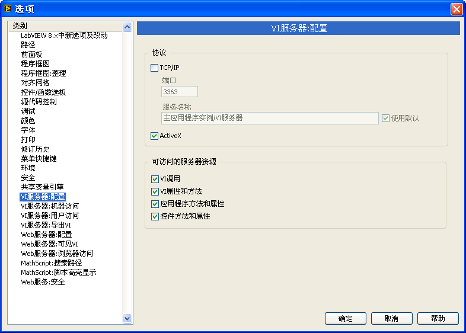

# VI 服务器

### VI 服务器的概念

VI 服务器（VI Server）是从 LabVIEW 5.0 开始提供的一个功能。它是由 LabVIEW 提供的、用以帮助用户通过编程来控制 VI（包括 VI 上的控件、函数、子 VI 等）和 LabVIEW 环境设置等的一整套函数。

VI 服务器的服务由 LabVIEW 提供，客户端可以通过三种方法调用服务器提供的服务：

客户端就是本机的 LabVIEW 程序：这是最常用的 VI 服务器使用方式。VI 直接使用 LabVIEW 中的属性、调用等节点就可以利用 VI 服务器提供的服务了。这种方法也被称为 VI
Scripting（VI 脚本）。在 LabVIEW 程序中通过属性节点（Property
Node）和调用节点（Invoke Node）提供的属性与方法，就可以调用这些服务。VI
Scripting 最常见于在运行时需要改变界面的程序，以及动态运行某个 VI 的程序。

ActiveX：如果希望在其它编程语言中使用 VI 服务器，可以利用 LabVIEW 提供的 ActiveX 接口，支持 ActiveX 的编程语言。比如 VB、VC++ 等都可以调用 LabVIEW 提供的服务。

TCP/IP：用于远程机器。通过 TCP/IP 协议调用另一台计算机上 LabVIEW 提供的功能。

在 LabVIEW 的菜单中选择 "工具 -\> 选项..."，可以设置是否以 ActiveX 和 TCP/IP 协议的方式提供 VI 服务（图
6.1）。

图 .1 设置是否以 ActiveX 和 TCP/IP 协议的方式提供 VI 服务

### VI Scripting

VI Scripting 的主要功能是通过编程修改应用程序和 LabVIEW 的设置，也可以在程序运行时修改程序和界面控件的属性，调用它们的某些方法。VI
Scripting 最常用的场合包括：在程序运行时改变程序界面，程序运行时装入子 VI，控制另一线程代码的执行，批量创建或修改多个 VI 等。

与 VI
Scripting 相关的节点都在函数选板 "编程 -\> 应用程序控制" 中，这其中又以属性节点和调用节点使用得最为频繁（图
6.2）。

图 .2 应用程序控制函数选板

VI Scripting 的使用过程一般是这样的：

首先，打开一个 VI 或者某个对象的引用。比如可以使用 "编程 -\> 应用程序控制 -\> 打开 VI 引用" 函数来打开一个 VI 的引用，或者使用属性节点打开 VI 中某个控件的引用。

然后，使用属性节点设置这个对象的属性，或者使用调用节点调用这个对象的方法。

最后，使用 "关闭引用" 函数关闭所有被打开的节点。

VI
Scripting 的一部分功能直接就可以在 LabVIEW 中使用。另外还有一些功能，如创建和修改 VI 的程序框图，在 LabVIEW 专业版中没有开放出来，需要另外从 NI 公司得到专门的许可后才能使用。