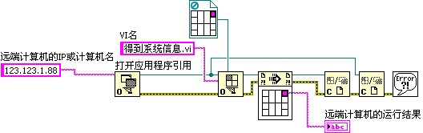

# 网络服务和 ActiveX 接口

## 网络服务

VI 服务器的功能还可以通过 TCP/IP 协议提供。因此，通过 VI
Scripting，我们还可以控制或修改另一台计算机上的 VI。使用 VI 服务器网络服务功能时，实施控制的计算机和远端计算机都需要在 LabVIEW 的设置对话框中，选中 TCP/IP 协议。并且，远端计算机需要设置允许实施控制的计算机的 IP 进行访问。

我们以一个简单的例子来说明 VI 服务器的网络服务功能。图
6.41 是一个在远端计算机上打开的 VI 的程序框图。它的功能是得到远端计算机的操作系统信息。


图 .41 远端计算机上 VI 的程序框图

在控制计算机上，可以通过程序来调用这个 VI，让它在远端计算机上运行，并返回结果。这一过程与在本地计算机上动态调用一个 VI 的方法类似。唯一的差别是，在打开 VI 引用之前，首先要使用 "打开应用程序引用" 函数连接到远端计算机（图
6.42）。



图 .42 动态调用其它计算机上 VI 的程序框图

## ActiveX 接口

VI 服务器提供的另一种接口协议是 ActiveX 服务。ActiveX 接口主要供其它语言来调用 VI 服务器的服务。例如，某一测试的主程序是使用文本语言编写的，但其中某一项任务是用 LabVIEW 编写的。在文本语言中可以通过 ActiveX 协议运行 LabVIEW 的 VI，并传递参数。

下面的程序是使用 VB
Script 编写的一段代码。这段代码实现了打开一个 VI 的前面板并运行它的功能。

```vb
Set lvapp = CreateObject ("LabVIEW.Application")
Set vi = lvapp.GetVIReference ("C:\temp\test.vi")
vi.FPWinOpen = True
vi.Run
```

由于 IE 支持 VB
Script，这段代码还可以嵌在 HTML 文件中实现这样的功能：页面上有一处超链接指向一个 VI，点击这个链接，就可以打开相应的 VI。其他浏览器使用 JavaScript 也可以实现类似的功能。