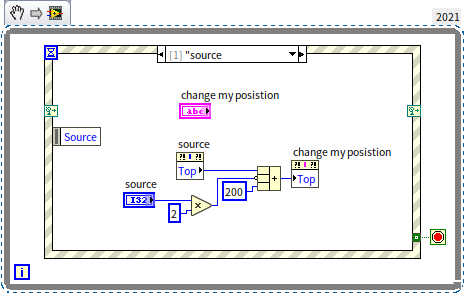
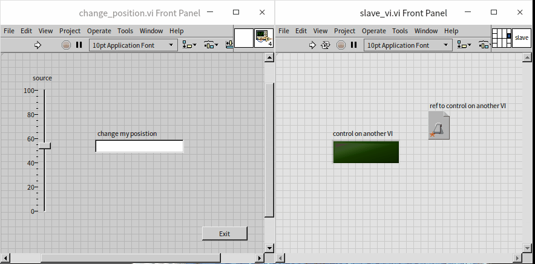
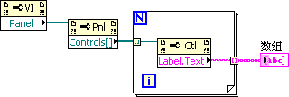
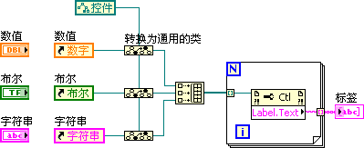
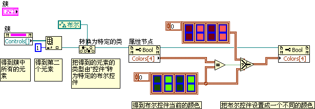
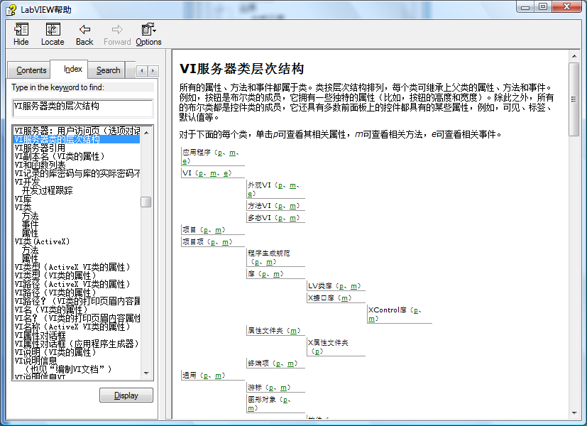
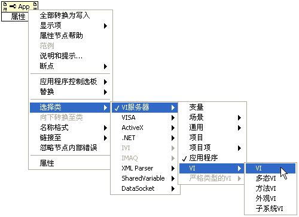
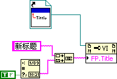
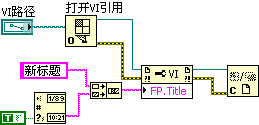
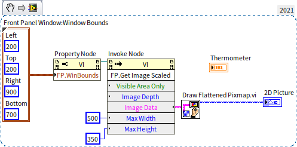

# 运行中改变界面

在程序运行的过程中，程序的用户界面也不可避免会产生变化。最常见的是界面上某些数据的变化，这一般只需要在程序中把新数据传递给控件的接线端即可。在之前的章节中，我们也介绍了如何使用[控件的局部变量和属性](data_and_controls)对界面做更复杂的调整，比如改变控件的位置颜色等。除了控件，界面上的其它部分，比如窗口的尺寸，标题内容，装饰图片等等也都是可以在程序中进行自动调整的。

## VI 服务器

### VI 服务器的概念

LabVIEW 中，所有这些通过编程对 VI （包括 VI 上的控件、函数、子 VI 等）和 LabVIEW 环境设置等进行调整、控制的功能，都是由一个被称为 VI 服务器（VI Server） 功能模块来提供的。这套功能在 LabVIEW 5.0 中就已经开始广泛使用了。

我们可以通过三种方法调用 VI 服务器提供的服务：

客户端就是本机的 LabVIEW 程序：这是最常用的 VI 服务器使用方式。VI 直接使用 LabVIEW 中的属性、调用等节点就可以利用 VI 服务器提供的服务了。这种方法也被称为 VI Scripting （VI 脚本）。在 LabVIEW 程序中通过[属性节点（Property Node）和调用节点（Invoke Node）](data_and_controls#属性节点和调用节点)提供的属性与方法，就可以调用这些服务。VI Scripting 最常见于在运行时需要复杂变化界面的程序，以及动态运行某个 VI 的程序。

ActiveX：如果希望在其它编程语言中使用 VI 服务器，可以利用 LabVIEW 提供的 ActiveX 接口，支持 ActiveX 的编程语言。比如 VB、VC++ 等都可以调用 LabVIEW 提供的服务。

TCP/IP：用于远程机器。通过 TCP/IP 协议调用另一台计算机上 LabVIEW 提供的功能。

在 LabVIEW 的菜单中选择“工具 -\> 选项...”，弹出“选项菜单”，然后可以在“VI 服务器”页面设置是否开启以上提到的这些功能：

### VI Scripting

VI Scripting 是 VI 服务器提供的一套属性和方法，通过调用这些属性和方法，就可以编写程序去调整修改某些 VI 的前面板，程序框图，也可以修改由 VI 生成的应用程序，甚至是 LabVIEW 中的一些设置。VI
Scripting 最常用的场合包括：在程序运行时改变程序界面，程序运行时装入子 VI，控制另一线程代码的执行，批量创建或修改多个 VI 等。

与 VI Scripting 相关的节点都在函数选板 “编程 -\> 应用程序控制” 中：

VI Scripting 的所有函数和节点中，以属性节点和调用节点使用得最为频繁，本书在之前的示例中也已经多次使用到它们了。

VI Scripting 的使用过程一般是这样的：

* 首先，打开一个 VI 或者某个对象的引用。比如可以使用 “编程 -\> 应用程序控制 -\> 打开 VI 引用” 函数来打开一个 VI 的引用，或者使用属性节点打开 VI 中某个控件的引用。
* 然后，使用属性节点设置这个对象的属性，或者使用调用节点调用这个对象的方法。
* 最后，使用 “关闭引用” 函数关闭所有被打开的节点。

VI Scripting 的一部分功能直接就可以在 LabVIEW 中使用。另外还有一些功能，如创建和修改 VI 的程序框图，在 LabVIEW 专业版中没有开放出来，需要另外从 NI 公司得到专门的许可后才能使用。

## 引用

### 通过引用调用属性节点

本书在[控件的局部变量和属性](data_and_controls)一节中对控件的属性节点做过简要介绍。如果需要设置同一 VI 上的控件的属性，可以直接在控件的右键菜单中创建它的属性节点。直接创建出来的属性节点与其相关联的控件之间没有数据线相连，但用户通过它们共同的标签就会立即意识到它们之间的关系。使用这种方式调用属性节点简单直观，但有一些限制，比如我们无法在一个 VI 中，去直接调用另一个 VI 里控件的属性节点。

设置控件的属性还可以使用另一种方式：通过控件的引用来调用。在控件的右键菜单中选择 “创建 -\> 引用”，就可以为这个控件创建一个引用，然后把这个引用与通用的 “属性节点”（位于函数选板 “编程 -\> 应用程序控制 -\> 属性节点”）相连，再选择需要设置的属性：

用以上两种方式创建的属性节点在功能上是完全相同的。

直接从控件上创建出来的属性节点只能在控件所在的 VI 中使用。倘若需要设置另一个 VI 上的控件属性，就只能使用第二种（创建引用）方法了。比如，需要设置一个控件的多个属性，会在程序框图中占据较大的显示空间。为了让主 VI 的程序框图显得比较整洁，也可以把所有的属性设置放到另外一个子 VI 中去。此时，控件在主 VI 上，属性节点在子 VI 上，就得使用创建引用设置属性的方法了。

另外，有时需要在程序中设置多个控件的同一属性。由控件直接生成的属性节点只能与固定的控件相关联，这就需要为每个控件都生成相同的属性节点。由于通用属性节点可以作用于任何控件，因此可以使用通用属性节点做成的子 VI 来设置所有的控件，以尽可能地重用代码。

下图是一个简单的 VI，它在运行时，利用属性节点来改变界面上一个控件的高低位置：

程序运行起来的效果是这样的：

加入我们希望使用这个 VI 同时去控制另一个 VI 中控件的位置，那么我们可以现在另一个 VI 中，为需要被控制的控件创建一个引用。然后再给引用创建一个显示型控件，用于把引用传递出去，这样，凡是可以得到这个引用的 VI，就都可以通过这个引用来控制引用所指向的控件了。需要被控制的 VI 的程序框图如下：

把这里输出的引用，传递给刚才的 VI，在刚才的 VI 中，利用这个引用来设置对应控件的位置属性：

最终程序运行起来的效果是这样的：

### 得到对象的引用

在上文，“[通过引用调用属性节点](#通过引用调用属性节点)”一段中介绍了如何把控件的引用传递给另一个 VI。它也是一种静态的方法，因为在编写程序时，就要把需要处理的引用作为输出数据传递到其它 VI 中去。在大多数实际应用中，我们都需要更灵活的动态方式去得到控件或者其它对象的引用。

除了利用鼠标右键菜单直接生成一个对象的引用之外，我们也可以利用属性节点从某个对象的引用得到与其相关的其它对象的引用。比如，VI 有一个叫做“Panel”的属性，通过它可以得到 VI 的前面板的引用，前面板又有一个叫做“Controls\[\]”的属性，通过它可以得到前面板上所有控件的引用。这个属性名字中的中括号，“\[\]”，表示这个属性的数据是一个数组：

有时候，我们需要得到一个 VI 上的某个特定名字的控件，而不是所有控件。如果使用上免得方法，先得到所有的控件，再一一比对它们名字是比较繁琐的。LabVIEW 自带了一些 VI，已经实现了类似的功能，比如这个 LabVIEW 自带的 VI：“\[LabVIEW\]\\resource\\importtools\\Common\\VI
Scripting\\VI\\Front Panel\\Method\\Get Control.vi”，可以根据标签返回一个控件的引用：

有些对象是无法直接为其创建属性节点的，只能通过这种间接的方法来得到该对象的引用。例如前面板上的修饰物（控件选板 “新式 -\> 修饰” 中的对象）。我们无法通过右键菜单来为界面上的修饰物创建属性节点，若要设置它的属性，就必须首先得到它所在的 VI 的引用，再得到前面板的引用，然后得到修饰物的引用，最后使用这个引用来设置属性。比如下面这个程序，修改了一个装饰物的颜色：

有些系统风格的装饰物，其颜色是由系统设置决定的，不能在程序中改变。

## 对象类的层次结构

### 树状层级关系

VI Scripting 所使用的引用都是指向某一对象的，这些对象可以被分成不同的类型。比如某一个 VI 是属于 VI 类的，某一个控件是属于控件类的，等等。这些类按照通用和特定的关系，可以排出一个如下图所示的树状的层级关系：

比如界面上有一普通的数字控件，它是属于 "数字" 控件类的，这是一个比较特定的类。它同时也属于 "数值" 类。不过 "数值" 类比 "数字" 控件类更通用，它还包含 "颜色" 控件等其它的对象。而更加通用一些的 "控件" 类则包含了布尔、字符串等各种控件对象。为了表述方便，我们把一个特定的类型叫做子类，把比它通用一级的类型叫做父类。如，"控件" 类是 "数值" 类的父类，而 "数值" 类是 "控件" 类的子类。

在传递对象的引用时，可以把引用设置为对象所属的任何一个类的类型。例如，一个普通的数字控件的引用，既可以是 "数字" 控件类型的；也可以是 "控件" 类型的，还可以是更通用的 "图形对象" 类型的。不同类型的属性节点具有不同的属性。父类具有的属性，子类都具有。但子类还可以具有更多特殊的属性。

当需要设置几个对象共同的属性时，需要使用它们共属的类来表示。它们共属的类是一个更通用的类。

一个对象的引用可以通过使用 "编程 -\> 应用程序控制 -\> 转换为特定的类" 或 "编程 -\> 应用程序控制 -\> 转换为通用的类"，把这个引用转换成更加通用或更加特定的类型。比如需要得到几个不同控件的标签，它们可以使用同一个 "标签 -\> 文本" 属性。为了让它们使用同一个属性节点，需要用具有同样类的引用来表示它们。比如下面的程序，使用“转换为通用的类”把几个不同控件的引用都表示为“控件”类，然后通过“控件”类的属性从这些控件读取了它们的标签信息：

某些时候，可能会先得到一个以通用类表示的某对象的引用，如果后续程序需要设置这个对象某些特殊属性，就必须先把这个引用转换为特定的类，才能使用这些特定的属性。

例如：VI 前面板上有一簇控件，簇中有两个元素，第二个元素是一个 LED 灯泡控件，如下图所示：

假如我们需要程序运行时修改这个灯泡的颜色。簇中的元素可以通过簇的“Controls\[\]”属性得到。由于簇中可以包含各种类型的控件，所以“Controls\[\]”输出的都是以“控件 ”类型表示的各个控件的引用。而“颜色”是“布尔”类型控件的一个特殊属性，所以，这里需要把得到的“控件”引用转换成特定的“布尔”类型，才能设置其颜色属性：

### 类浏览器

LabVIEW 提供了一个工具来帮助编程者方便的找到某个类的某个属性或调用节点，这就是“类浏览器”工具。需要打开这个工具时，可以选择菜单中的“查看 -\> 类浏览器”：

在类浏览器工具的对话框中选择一个“VI 服务器”作为对象库，再选择需要处理的类。它会在“属性和方法”列表中列出这个类所有的属性和方法。双击一个条目，就可以把这个属性或方法添加在 VI 的程序框图上。

如果需要查看 LabVIEW 中所有的可以用于 VI Scripting 编程的类及其属性和方法，可以打开 LabVIEW 的帮助文档，在索引中输入 "VI 服务器类的层次结构"（英文 "VI Server Class Hierarchy"）即可可按照层次结构查阅到 VI 服务器中每个类所具有的属性、方法以及事件：

## 一些常用的属性和方法

### 应用程序的属性和方法

把通用“属性节点”从函数选板拖放到 VI 程序框图上时，它默认的被设置为“应用程序”类。我们常常利用这个类别下的属性，去读取应用程序本身，以及应用程序所在的操作系统的各种信息。比如，我们可以读取一下用户名信息，这样可以根据不同用户运行不同的程序分支。我们也可以读取系统信息，比如是哪一种操作系统、什么版本、系统有没有打印机、有多少个显示器、分辨率如何等等，然后根据系统的不同运行不同的程序逻辑。

笔者在调试程序的时候，有时会利用“应用程序”的“All VIs in Memory”属性显示出所有被装载到内存中的 VI，帮助笔者确定程序是运行正常。关于装载 VI 的具体做法何用途会在“[装载和运行子 VI](vi_server_for_subvi)”一节进行介绍。

属性节点不仅可以用来查看、设置本机应用程序的信息，也可以用于查看远端应用程序的信息。这需要我们首先使用“打开应用程序引用”函数，打开一个远端应用程序，然后把得到的句柄传递给属性节点。这样属性节点就可以去访问远端应用程序的属性了。关于如何设置远端应用程序，我们将在网络服务的相关章节内介绍。

“应用程序”的“Kind（类别）”属性也是比较常用的属性，它可以显示当前的应用程序是否是运行在 LabVIEW 开发环境中，还是运行在嵌入系统的环境中，或者是已经被编译成一个独立的可执行文件了。程序很可能需要根据不同的开发和运行环境进行一些特殊的设置。

在 LabVIEW 开发环境中，当前应用程序就是 LabVIEW。如此，我们就可以在程序中使用“调用节点”去运行 LabVIEW 的一些功能。比如，保存所有打开的 VI 等等。

### VI 的属性和方法

把通用“属性节点”从函数选板拖放到 VI 程序框图上，然后可以使用右键菜单改变它的类别对象：

如果，我们需要设置 VI 的属性，那么就把属性节点关联的类选为 “VI”。在没有任何引用输入时，这个属性节点中的属性设置都是针对它所在的 VI 的。例如，下图中的程序可以修改它所在 VI 的标题：

如果是设置其它 VI 的属性，就要给属性节点传入一个 VI 的引用。VI 的引用可以通过两种方法得到：静态的和动态的。

* 静态的方法： 需要使用 “编程 -\> 应用程序控制 -\> 静态 VI 引用” 节点。把这个节点放置在程序框图上，鼠标双击静态引用的图标或选择它的右键菜单 “浏览路径...”，弹出 “选择需打开的 VI” 提示框，然后从中选取某一 VI，这个节点即可输出这一 VI 的引用。之所以称其为静态，是因为它在编写程序时，就已经选定好了引用所指向的 VI：

* 动态的方法：如果是在程序运行中，才能知道需要设置哪个 VI，那么就需要使用 "编程 -\> 应用程序控制 -\> 打开 VI 引用" 函数来打开一个 VI 的引用。把 VI 的路径传给 “打开 VI 引用” 函数，它就会返回这个 VI 的引用：

常用的 VI 相关的信息，比如 VI 的类型、路径、名称、修改历史、VI 各个部分占用内存的数据等等，都有与之相对应的属性。同样，我们也可以使用调用节点来运行 VI 相关的方法，这其中最常用的可能就是“Run VI”方法了，它可以让一个 VI 运行起来。具体的使用方法将在“[装载和运行子 VI](vi_server_for_subvi)”一节进行介绍。

需要注意的是，与程序界面相关的属性和方法，实际上都是针对 VI 的前面板的。比如我们要设置程序界面的尺寸和位置，实际上应该设置的就是 VI 的前面板的尺寸和位置。但是这些属性和方法并没有被归类到“前面板”对象类别，而是都被归类在了“VI”对象类别下。VI 的属性是比较多的，在选择属性时，可以看到菜单上有一组属性都是关于“Front Pannel Window”的，对于前面板的设置都在这里：

下面这个程序，首先设置了程序界面，也就是 VI 前面板的位置和尺寸，然后调用了“Get Image”方法，截取了程序界面的图像，再把这个图像在程序界面上显示出来：

程序运行后的前面板如下，看上去像是无限嵌套的镜像。

VI 和控件的“Get Image”方法在生成报表的时候会比较常用，当我们在程序界面上绘制出了理想的数据曲线之后，可以直接利用这个方法把界面图片截取下来复制到报表中去。

VI 类别对象有一个属性是“Front Panel”，它可以返回当前 VI 的前面板的引用，再把这个引用传递给属性和调用节点，可以看到真正属于“前面板”类别对象的属性和方法了。这是一些更加高级的属性和方法，它们读书只能针对编辑状态下的 VI 进行使用。本书将在后续章节详细介绍它们的用法。