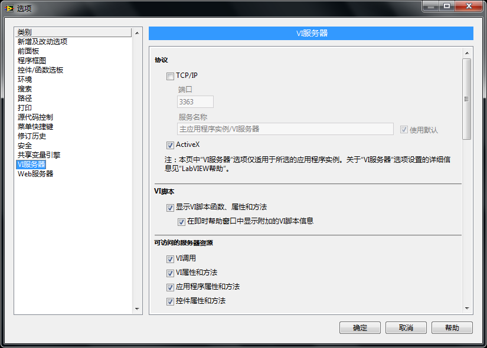
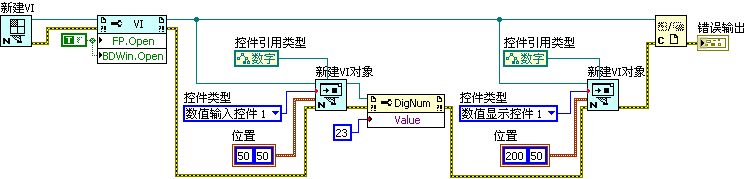

# 动态创建和修改 VI

## VI 脚本授权

前文提到的 VI 脚本相关的属性和方法都是不需要特别授权的，在 LabVIEW 专业版中直接就可以使用。还有一些更加强大的 VI 脚本功能在默认情况下并没有打开。比如，需要使用 VI 脚本创建新的 VI 或 VI 上的控件、函数等，或者需要修改 VI 的程序框图等功能。

从 LabVIEW
2010 开始，打开这些高级功能的开关被放置在 LabVIEW 的选项对话框中。在选项中的 VI 服务器页面，可以看到 VI 脚本选项，只要选中这一选项，VI 脚本功能就被激活了。

\
图 6.31 在 LabVIEW 的选项对话框中打开 VI 脚本功能

在激活了 VI 脚本的授权之后，"应用程序控制" 函数选板上会多出一个名为 VI 脚本的子选板（图
6.32）。这个子选板中有 5 个新增加的函数。第一个函数（新建 VI）用于创建新的 VI；第二个函数 "打开 VI 对象引用" 用于通过标签打开 VI 上的对象（比如控件、函数等。利用 VI 前面板的 "控件 \[\]"、程序框图的 \[节点 \] 等属性，也可以实现类似的功能）；第三、四个函数 "新建 VI 对象" 用于创建新的 VI 上的对象；最后一个函数 "遍历查找图形对象" 用于得到一个 VI 上某一类的对象的所有引用。这一功能与前文（图 6.10）提到的 Get
Control.vi 的功能非常类似。由于 VI 脚本函数选板已经提供了 "遍历查找图形对象"VI，在程序里就可以使用这个 VI 替代 Get
Control.vi。

\

图 6.32 授权后才能使用的 VI 脚本函数

激活 VI 脚本的授权后，可使用的属性和方法也会增加很多。图
6.33 是属性节点选择 VI 属性的菜单，其中 "包含已编译代码"、"程序框图"、"程序框图窗口" 等属性都是在激活授权后出现的。这些授权后获得的属性和方法功能更加强大，比如可以使用它们创建或修改 VI 的代码。

图 6.33 更多的 VI 属性设置

## 创建 VI

使用 "新建 VI" 函数，可以创建出一个新的 VI，并得到它的引用。通过设置 VI"前面板 -\> 打开" 和 "程序框图 -\> 打开" 属性，可以让它的前面板以及程序框图显示出来（图
6.33）。这个程序运行之后，计算机屏幕上会出现一个新建的 VI。它的行为与在 LabVIEW 的菜单中选择 "文件 -\> 新建 VI" 是相同的。

图 .33 创建新的 VI

## 创建新的控件

在创建了空的 VI 之后，就需要考虑为其添加一些内容了。例如，首先为其添加两个数值控件。创建新的控件使用的是 "创建 VI 对象" 函数。给 "创建 VI 对象" 函数提供正确的控件类型、控件引用类型、控件位置和新控件的所有者（在这里指新建 VI 的引用），它就可以在这个 VI 上创建出一个新的控件。创建新控件的程序框图与所创建出来的前面板可分别参见图
6.34 和图 6.35。

图 .34 创建控件

图 .35 运行程序创建出来的 VI 的前面板

## 创建程序框图

创建程序框图上的节点的方法与在前面板上创建控件的方法是相同的。图
6.36 是示例程序的一部分代码，只是省略了程序前面创建新 VI 的部分。运行它，便在程序框图上创建出一个新的加法函数和一个数值常量。

图 .36 创建一个加法函数和一个数值常量

对于程序框图，除了要创建节点之外，还要把它们用数据线连接起来。连接数据线使用的是接线端的方法 "连接数据线"，它可以把两个接线端连接起来。图
6.37 所示的程序是把新生成的数值常量和加法函数连线。

图 .37 把常量和加法的输入用数据线连接

其它的接线端也需要被连接起来，整个的程序框图如下所示：包括创建 VI、创建控件、创建程序框图上的节点以及对它们连线（图
6.38）。

图 .38 整个程序的框图

运行这个程序，生成的 VI 的程序框图如图 6.39 所示。

图 .39 使用 VI Scripting 生成的程序框图

需要编程序创建一个新 VI 的用例不多，除非是需要生成大量的 VI。比如，某公司开发硬件驱动程序，需要生成大量面板和程序框图都类似的 VI。

## 批量修改 VI

在实际应用中，比较常用的是，需要对已有的 VI 进行某种批量修改。比如，已经编写好了一个由几十个 VI 组成的一个功能模块。但随后，新的需求要求修改所有 VI 的某些属性或部分代码，或者修改界面的布局等。这些修改在每个 VI 中都是相似的，这种情况就非常适合通过编程来修改。

以一个简单的任务为例。当我们需要把自己所写的一批 VI 发布给用户时，可能需要给这些 VI 加上密码，以保护产权。要完成这样一个任务，首先要得到所有需要被修改的 VI 的路径。在这个例子中，我们还是采用最简单的策略，列出一个文件夹下的所有 VI。然后一一打开每个 VI，通过属性和方法对 VI 进行修改。在这个例子中，我们使用 VI 的 "锁定状态 -\> 设置" 方法给 VI 添加密码。修改了 VI 之后，一定要保存。如果不保存，VI 引用被关闭后，所有的修改都会丢失。保存 VI 使用的是 VI 的 "保存 -\> 仪器" 方法（VI 的全称是 "虚拟仪器"）。整个任务的代码如图
6.40 所示。

图 .40 批量为 VI 设置密码