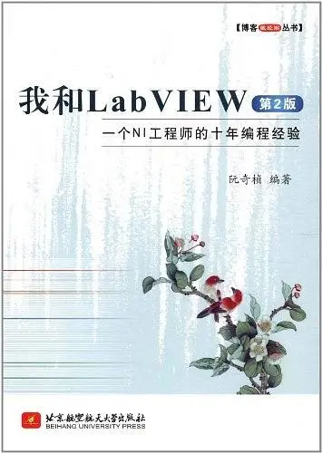

# LabVIEW Tutorial

## About This Book

"My Decade of LabVIEW Programming" (ISBN: 9787512408487), first published in 2009 by Beihang University Press, encapsulates my journey of learning and programming with LabVIEW. The book demystifies LabVIEW's essential features and addresses common challenges encountered by learners, presented in a reader-friendly format.

With the consent of Beihang University Press, I've made the entire book available on GitHub to reach and assist a broader audience. Recognizing that the original title no longer fully representative of its expanded scope, I've given this open-source project a more descriptive name, *The LabVIEW Journey*. The initial version released on GitHub was based on the original manuscript of the book's second edition. Since its release on the platform, I've extensively updated and expanded this version, resulting in significant differences from the published edition. The book was originally written in Chinese, and I began translating it into English in 2023. Translating complex technical concepts has been a formidable yet rewarding challenge. While I have strived for technical and linguistic accuracy, the rapid evolution of software and the nuances of translation mean there is always room for refinement. Since its initial release, I've been fortunate to receive constructive feedback from numerous enthusiastic readers, which has been invaluable in enhancing the book's quality.

I sincerely invite and encourage readers to contribute to this ongoing project. Whether it is correcting mistakes, adding new content, or refining examples, your contributions on GitHub are greatly appreciated. Should you have any questions or comments, please do not hesitate to post them in the comments section below.

For a more accessible reading experience, especially on mobile devices, you can visit the book's dedicated web pages at https://lv.qizhen.xyz/en/ or https://labview.qizhen.xyz/en/. To access the full table of contents on a mobile screen, simply click the three-line menu icon in the top left corner. The complete text and all images from the book are housed in the GitHub [docs folder](https://github.com/ruanqizhen/labview_book/tree/main/docs), while the corresponding sample code resides in the [code folder](https://github.com/ruanqizhen/labview_book/tree/main/code). Here, you'll find most of the examples cited in the book, with a few exceptions omitted due to copyright concerns.

## Introduction

As a former software engineer at National Instruments (NI), I bring a wealth of personal experience to the writing of this book, which remains an independent project. Please note that the opinions expressed here do not necessarily align with NI's official views and are provided for informational purposes only.

This book has its roots in a series of LabVIEW programming articles originally published on my blog (https://blog.qizhen.xyz). Since those posts were written for seasoned developers, they lacked the detailed explanations a novice would need. In adapting them for this book, I have restructured and expanded the content to make it accessible to beginners. The insights and methods shared here stem from my years of studying and using LabVIEW. That said, given constraints on my time and capacity, this book does not cover every facet of the platform.

The book focuses on several key areas:

- **General-Purpose Programming:** While LabVIEW is widely recognized as the industry standard for test, measurement, and control, I draw on my software engineering background to teach readers how to use it as a powerful, general-purpose programming language. The book frequently draws parallels to other programming languages, helping readers understand LabVIEW's architecture from multiple angles.

- **Common Challenges:** Drawing on my experience instructing LabVIEW in both corporate and academic settings, I address the hurdles beginners face most often—such as managing race conditions, breaking the habit of overusing local variables, and scaling simple loops into robust state machines. This book dedicates significant space to these common issues, offering practical solutions and clear explanations.

- **Practical Examples:** We supplement theory with practical examples that illustrate different solutions to common LabVIEW programming problems, comparing their pros and cons.

- **Focus on Core Functions:** To make the best use of your time, the book prioritizes the most common functions in LabVIEW, introducing more specialized features only as needed.

- **Complementing Official Docs:** This book is meant to complement, not replace, LabVIEW's official documentation. You are encouraged to consult the built-in LabVIEW Help for detailed function and parameter specifications.

The content is structured to progress from simple concepts to complex frameworks. If you run into a challenging section, feel free to skip it and return after reading later chapters. You can also use the search bar on the website to find specific topics.

Maintaining and updating this book has been a long-term project. It started with examples and screenshots from the Chinese edition of LabVIEW 8.6 and has since evolved to incorporate newer versions, including English releases and versions for different operating systems. As a result, the screenshots feature a variety of interface styles, and I appreciate your understanding. All example programs, including the VIs shown in the figures, are available in the book's GitHub repository.

Remember, programming is a skill honed through practice. While this book is a helpful reference, hands-on experience is crucial for mastering LabVIEW.

## My Journey as a Programmer

The publication of the first edition of this book marked my tenth anniversary at NI. Throughout my career there, LabVIEW was a central part of my professional life, shaping my growth as a software engineer. I could think of no better way to celebrate that journey than to share my experiences and lessons in a book.

My connection with LabVIEW dates back to my university days. I recall a project where we had to simulate a control system by entering a stimulus signal and observing the output. That challenge sparked an idea: what if programming could be as simple as connecting blocks that represent transfer functions? Such an approach would make building complex systems much easier.

That seed of an idea blossomed the moment I first encountered LabVIEW. It perfectly mirrored my college concept: building a program by connecting blocks with lines. This familiarity fostered a lifelong preference for LabVIEW. My first experience with the language showed me how user-friendly it is, especially compared to text-based languages like C++. LabVIEW is a true graphical programming language driven by the dataflow paradigm, where execution is determined by data moving between nodes rather than by sequential lines of text. Graphical programming is not only more intuitive, but it is also far better suited for modeling parallel processes than traditional text-based code.

I began learning LabVIEW without any textbooks, relying entirely on the software itself. At the time, Chinese resources on LabVIEW were scarce, and reading English documentation was difficult. Yet, this self-taught approach had its merits—most notably, the deep satisfaction of solving problems on my own and learning to think outside the box.

But I wanted to go beyond simple applications. I aimed to use LabVIEW for large-scale software development, which required a much deeper understanding of the language. I began reading advanced tutorials, especially those written by NI. While these resources were theoretically rich, they often lacked practical, day-to-day programming techniques, which prompted me to study code written by other engineers to round out my education.

As a passionate advocate for LabVIEW, my hope is to see it recognized as a general-purpose programming language on par with C++ and Java. While I appreciate its unique strengths, I also recognize its limitations. These limitations have motivated me to help improve the language—making it more robust and user-friendly. This book is a testament to that commitment, chronicling my experiences, lessons, and hopes for the future of LabVIEW.
