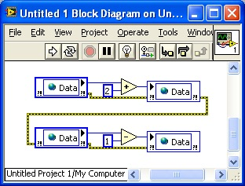

# 一些废弃的内容


## 共享变量

共享变量与全局变量相比，其作用域更广。它不但可以在不同的 VI 之间传递数据，还可以在不同的程序，甚至不同的计算机以及硬件设备间传递数据。在实际应用中，共享变量主要用于网络上不同 VI 的数据共享，或读写其它硬件设备上的数据。

共享变量的创建方法与全局变量相同，可以从模板中创建，也可以在项目浏览器的右键菜单中选择 "新建 -\> 变量"，创建出一个共享变量。共享变量不是一个单独的 VI，它是 LV 库的一部分，它只能创建在某个 LV 库（lvlib 文件）下。

创建共享变量时，首先会弹出共享变量属性对话框，设置共享变量的名称、类型等属性（图
4.27）。共享变量有三种：单进程、网络发布、以及时间触发的共享变量。时间触发的共享变量应用于 LabVIEW 实时系统模块，安装了 LabVIEW 实时模块后才可以使用。


图 .27 共享变量属性对话框

单进程和网络发布的共享变量仅作用域不同，使用方法是相同的。这里着重介绍一下单进程共享变量。

单进程共享变量，顾名思义就是作用域为单个应用程序进程的共享变量。它与全局变量的性质是完全相同的。唯一的不同点是单进程共享变量都带有错误输入 / 输出端，我们可以利用错误处理连线来控制单进程共享变量的执行顺序。例如图
4.28 中的 VI，假设共享变量 Data 的值原本为 0，运行完下面这个加 2 减 1 的代码后，Data 的值必然为 1。



图 .28 共享变量的应用

但是，这并不意味着单进程共享变量可以防止出现竞争状态。设想图
4.28 中的 VI 只是程序中的一个子 VI，在其运行的同时，Data 还是可以在其它子 VI 中被访问修改的，依然可能处于竞争状态。


## LabVIEW 的编程思想

用 LabVIEW 编程，其思路与使用其它编程语言是一致的。按照程序设计的一般方法，编程解决一个问题可以分为五个步骤收集需求、设计、编码、测试、发布及维护。比如需要使用 LabVIEW 编程计算两个整数的最大公约数，其工作步骤如下。

第一：确定需求，给出需求的详细说明。

对于求最大公约数的问题，第一步需要做的就是写出程序输入输出的详细定义。如果使用文本语言编程，首先应当以文档的方式把需求记录下来。但是，LabVIEW 程序员有个更方便的设计方法：直接在 VI 的前面板上定义程序的输入输出。用两个数值输入控件分别代表两个输入值 (a, b)；一个数值显示控件代表输出 (g.c.d)。根据题意，输入要求是正整数，因此可以把数值控件的表示法设置为 U32，并在这个控件的属性中设置最小值为 1。然后，再为 VI 和它每个控件添加上相关的帮助信息。至此，VI 的前面板就已经为用户提供了一个详细的 VI 的功能描述以及接口定义了（图 11.1）。


图 .1 使用 VI 前面板记录程序需求

第二：设计算法。

通常，某个问题会有多种解决方法（算法）。比如说求最大公约数问题，可以采用穷举算法，把 1 到 a 之间所有的整数都试一遍，然后找到那个最大的公约数；也可以使用 g.c.d. 算法（在这里特指最优化的求解最大公约数算法）。

若使用类似 C 语言的语法来描述 g.c.d. 算法，则其运算过程如下：

``` cpp
    Step1: if (a mod b == 0) goto Step3; else goto Step2;
    Step2: (a, b) = (b, a mod b); goto Step1;
    Step3: x=a; return;
```

多数情况下，算法和具体的语言环境无关。比如说，不论采用哪种语言，g.c.d. 算法的效率都高于穷举法。但使用 LabVIEW 编程解决某些具体问题时，还需要考虑它与文本语言不同的特性，选用更为适宜的算法。比如说，树的遍历（数据结构课程中的基本算法之一），可以使用 [递归的算法](pattern_reentrant_vi)，也可以使用循环的算法。一般递归算法的思维方式更自然，更容易掌握，实现起来也比较方便。但循环算法一般效率较高。这里我们使用循环算法为例。

第三：使用 LabVIEW 实现已经设计好的算法。

LabVIEW 中没有 goto 语句，但使用循环语句可以达到同样效果。针对本例，LabVIEW 编写的 g.c.d 算法程序如下：使用 while 循环，a 和 b 分别用循环上的两对移位寄存器表示。在循环体内首先判断 a 是否被 b 整除，如果是，结束循环；否则把 b 和（a
mod b）赋给两个移位寄存器，进入下一次循环。程序框图如图 11.2 所示。


图 .2 g.c.d 算法程序框图

这个小程序暂时不需要测试和发布维护这两个步骤。